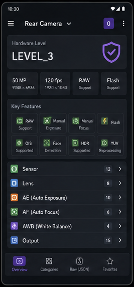

# Android Camera Parameters

Android Camera Parameters is a powerful diagnostic tool for developers and enthusiasts to explore the deep technical capabilities of their device's cameras. It leverages the Android Camera2 API to provide detailed insights into every lens on your device.



## Key Features

*   **Detailed Diagnostics**: Inspect `CameraCharacteristics` for all lenses (Rear, Front, External).
*   **Hardware Level Detection**: Instantly see if your device supports `LEGACY`, `LIMITED`, `FULL`, or `LEVEL_3` features.
*   **Real-time Feature Tracking**: Check support for RAW capture, Optical Image Stabilization (OIS), Manual Exposure, Manual Focus, and more.
*   **Categorized Exploration**: Hundreds of parameters organized by Sensor, Lens, AE/AF/AWB, and Processing categories.
*   **Raw Data Export**: View the complete camera profile as a structured JSON.

## Tech Stack

- **Language**: Kotlin
- **UI Framework**: Jetpack Compose
- **Design System**: Material 3
- **Architecture**: MVVM
- **Libraries**:
    - [Camera2 API](https://developer.android.com/training/camera2): Core camera interaction.
    - [Gson](https://github.com/google/gson): JSON serialization for raw data export.
    - [Navigation Compose](https://developer.android.com/jetpack/compose/navigation): App navigation.
    - [Glide](https://github.com/bumptech/glide): Image loading.

## Project Structure

- `app/`: Main Android application module.
    - `com.aaron.cameraparams.ui`: Compose-based UI screens and components.
    - `com.aaron.cameraparams.camera`: Logic for interacting with the CameraManager and retrieving characteristics.
- `camera_parameters/`: Sample JSON dumps of camera parameters from various devices (Pixel 3, Samsung S10+, etc.).
- `docs/`: Additional documentation and screenshots.

## Getting Started

### Prerequisites

- Android Studio Koala or newer.
- Android SDK 37 (Compile/Target).
- A physical Android device (recommended) or Emulator with Camera2 support.

### Build and Run

1. Clone the repository:
   ```bash
   git clone https://github.com/zoozooll/AndroidCameraParameters.git
   ```
2. Open the project in Android Studio.
3. Build the project:
   ```bash
   ./gradlew assembleDebug
   ```
4. Install and run on your device.

## License

This project is licensed under the **MIT License**. See the [LICENSE](LICENSE) file for details.

## Support or Contact

Email: kangkang365@gmail.com
Project Site: [GitHub Pages](https://zoozooll.github.io/AndroidCameraParameters/)
