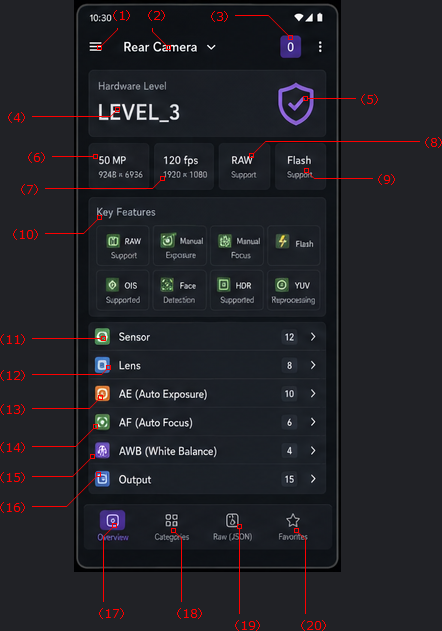

# Top App Bar



## (1) Navigation Menu

☰

### Purpose

Show additional options:

* Settings
* Export JSON
* Import Favorites
* Dark Theme
* About

---

## (2) Camera Name

Possible values:

* Rear Camera
* Front Camera
* External Camera

The value is derived from `LENS_FACING`.

When clicked, a dialog will be displayed showing all available cameras on the device.

---

## (3) Camera ID Badge

Derived from:

```java
CameraManager.getCameraIdList()
```

Examples:

```text
0
1
2
3
```

Useful for developers.

When clicked, a dialog will be displayed showing all available cameras on the device, the same as when clicking the Camera Name.

---

# Summary Card

## (4) Hardware Level

Example:

```text
LEVEL_3
```

Derived from:

```java
INFO_SUPPORTED_HARDWARE_LEVEL
```

Possible values:

| Value    | Meaning                  |
| -------- | ------------------------ |
| LEGACY   | Old camera device        |
| LIMITED  | Limited Camera2 features |
| FULL     | Full Camera2 support     |
| LEVEL_3  | Advanced Camera2 support |
| EXTERNAL | External or USB camera   |

---

## (5) Hardware Level Icon

Visual representation of the hardware level.

### LEVEL_3

Purple shield:

🛡

### FULL

Blue circle:

⬤

### LIMITED

Yellow triangle:

▲

### LEGACY

Gray icon.

When the icon is long-pressed, a Toast message will be shown with a description of the current hardware level.

---

## (6) Main Sensor Resolution

Example:

```text
XX MP
```

Derived from:

```java
SENSOR_INFO_PIXEL_ARRAY_SIZE
```

### Purpose

Quickly show the sensor size.

The pixel array size is converted into megapixels (MP).

---

## (7) Maximum Video FPS

Example:

```text
120 fps
```

### Purpose

Show the highest frame rate supported by the camera.

Can be derived from:

```java
CONTROL_AE_AVAILABLE_TARGET_FPS_RANGES
```

---

## (8) Capability Card

Example:

```text
RAW
```

### Meaning

Indicates that the camera supports RAW capture.

Derived from:

```java
REQUEST_AVAILABLE_CAPABILITIES
```

The camera supports RAW capture if the result contains:

```java
CameraMetadata.REQUEST_AVAILABLE_CAPABILITIES_RAW
```

---

## (9) Flash Support

Example:

```text
Flash
Supported
```

Derived from:

```java
FLASH_INFO_AVAILABLE
```

Possible values:

* Supported
* Not Supported

---

# Key Features Section

## (10) Key Features Grid

### Purpose

Show important capabilities at a glance.

### RAW Support

Determined by:

```java
REQUEST_AVAILABLE_CAPABILITIES_RAW
```

---

### Manual Exposure

Shown in gray if the camera does not support it.

The camera supports manual exposure if:

* `INFO_SUPPORTED_HARDWARE_LEVEL` is not `LEGACY`, and
* `CONTROL_AE_AVAILABLE_MODES` contains `OFF`.

---

### Manual Focus

Shown in gray if the camera does not support it.

The camera supports manual focus if:

```java
CONTROL_AF_AVAILABLE_MODES
```

contains:

```java
OFF
```

---

### Flash

Show `RED_EYE` if the camera supports Red-Eye Reduction mode.

Show `AUTO` if Red-Eye Reduction is not supported but Auto Flash mode is supported.

Derived from:

```java
FLASH_INFO_AVAILABLE
```

---

### OIS

Derived from:

```java
LENS_INFO_AVAILABLE_OPTICAL_STABILIZATION
```

---

### Face Detection

Derived from:

```java
STATISTICS_INFO_AVAILABLE_FACE_DETECT_MODES
```

---

### HDR

The camera supports HDR if:

```java
CONTROL_AVAILABLE_SCENE_MODES
```

contains:

```java
HDR
```

---

### YUV Reprocessing

The camera supports this feature if:

```java
REQUEST_AVAILABLE_CAPABILITIES
```

contains:

```java
YUV_REPROCESSING
```

---

## (11) Sensor Category

Contains:

* Active Array Size
* Pixel Array Size
* Sensitivity Range
* Exposure Time Range
* Frame Duration Range
* Orientation
* ...

Icon:

Green sensor icon.

Badge:

Displays the number of parameters.

Example:

```text
12
```

---

## (12) Lens Category

Contains:

* Aperture
* Focal Length
* Focus Distance
* OIS
* Lens Pose

Icon:

Blue lens icon.

---

## (13) AE Category

Contains:

* AE Modes
* Metering Modes
* Exposure Compensation
* AE Lock Available

Icon:

Orange.

---

## (14) AF Category

Contains:

* AF Modes
* Focus Regions
* Macro Mode
* Continuous Focus

Icon:

Green.

---

## (15) AWB (White Balance) Category

Contains:

* AWB Modes
* White Balance Lock
* Color Temperature

Icon:

Purple.

---

## (16) Output Category

Contains:

* JPEG Sizes
* RAW Sizes
* YUV Sizes
* Stream Configurations
* High-Speed Video

Icon:

Blue.

---

# Bottom Navigation

## (17) Overview

If the current page is Overview, this item is highlighted.

Otherwise, clicking it will navigate to the Overview page.

---

## (18) Categories

If the current page is Categories, this item is highlighted.

Otherwise, clicking it will navigate to the Categories page.

---

## (19) Raw JSON

If the current page is Raw JSON, this item is highlighted.

Otherwise, clicking it will navigate to the Raw JSON page.

---

## (20) Favorites

If the current page is Favorites, this item is highlighted.

Otherwise, clicking it will navigate to the Favorites page.
