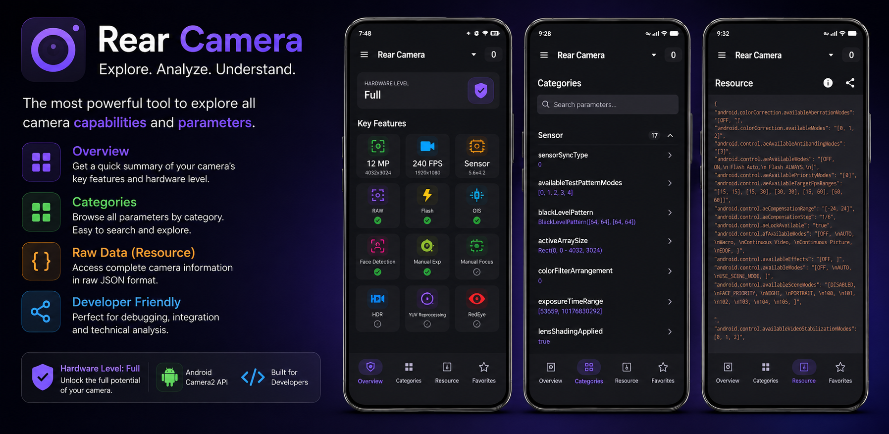

# Parameter Kamera Android (Android Camera Parameters)

<a href='https://play.google.com/store/apps/details?id=com.minininja.cameraparams&pcampaignid=pcampaignidMKT-Other-global-all-screenshots-pipeline'></a>
<a href='https://zoozooll.github.io/AndroidCameraParameters/category/mastering-android-camera2-api'></a>

[English](../../README.md) | [简体中文](README_zh-CN.md) | [繁體中文](README_zh-TW.md) | [Español](README_es.md) | [Português](README_pt-BR.md) | [Français](README_fr.md) | [Deutsch](README_de.md) | [Русский](README_ru.md) | [हिन्दी](README_hi.md) | [Bahasa Indonesia] | [日本語](README_ja.md) | [한국어](README_ko.md)

Android Camera Parameters adalah alat diagnostik yang kuat bagi pengembang dan penggemar untuk mengeksplorasi kemampuan teknis mendalam dari kamera perangkat mereka. Ini memanfaatkan API Android Camera2 untuk memberikan wawasan mendalam tentang setiap lensa pada perangkat Anda.



## Fitur Utama

*   **Diagnostik Terperinci**: Periksa `CameraCharacteristics` untuk semua lensa (Belakang, Depan, Eksternal).
*   **Deteksi Tingkat Perangkat Keras**: Lihat secara instan apakah perangkat Anda mendukung fitur `LEGACY`, `LIMITED`, `FULL`, atau `LEVEL_3`.
*   **Pelacakan Fitur Real-time**: Periksa dukungan untuk tangkapan RAW, Stabilisasi Gambar Optik (OIS), Eksposur Manual, Fokus Manual, dan lainnya melalui dasbor yang intuitif.
*   **Eksplorasi Terkategorisasi**: Ratusan parameter diatur berdasarkan kategori Sensor, Lensa, AE/AF/AWB, dan Pemrosesan dengan fungsionalitas **pencarian bawaan**.
*   **Favorit (Segera Hadir)**: Tandai parameter yang sering diperiksa untuk akses cepat.
*   **Ekspor Data Mentah**: Lihat profil kamera lengkap sebagai JSON terstruktur.
*   **Dukungan Multi-bahasa**: Terlokalisasi sepenuhnya ke dalam 12+ bahasa termasuk Mandarin, Spanyol, Jepang, dan banyak lagi.

## Bahasa yang Didukung

Aplikasi ini dilokalkan untuk mendukung audiens global:
- 🇺🇸 Inggris
- 🇨🇳 Mandarin (Sederhana)
- 🇹🇼/🇭🇰 Mandarin (Tradisional)
- 🇪🇸 Spanyol
- 🇧🇷 Portugis (Brasil)
- 🇫🇷 Prancis
- 🇩🇪 Jerman
- 🇷🇺 Rusia
- 🇮🇳 Hindi
- 🇮🇩 Bahasa Indonesia
- 🇯🇵 Jepang
- 🇰🇷 Korea

## Stack Teknologi

- **Bahasa**: Kotlin
- **Framework UI**: Jetpack Compose
- **Sistem Desain**: Material 3
- **Arsitektur**: MVVM
- **Library**:
    - [Camera2 API](https://developer.android.com/training/camera2): Interaksi inti kamera.
    - [Gson](https://github.com/google/gson): Serialisasi JSON untuk ekspor data mentah.
    - [Navigation Compose](https://developer.android.com/jetpack/compose/navigation): Navigasi aplikasi.

## Struktur Proyek

- `app/`: Modul aplikasi Android utama.
    - `com.aaron.cameraparams.ui`: Layar dan komponen UI berbasis Compose.
    - `com.aaron.cameraparams.camera`: Logika untuk berinteraksi dengan CameraManager dan mengambil karakteristik.
- `camera_parameters/`: Sampel dump JSON dari parameter kamera dari berbagai perangkat (Pixel 3, Samsung S10+, dll.).
- `docs/`: Dokumentasi tambahan dan tangkapan layar.

## Memulai

### Prasyarat

- Android Studio Koala atau yang lebih baru.
- Android SDK 37 (Compile/Target).
- Perangkat Android fisik (disarankan) atau Emulator dengan dukungan Camera2.

### Build dan Jalankan

1. Clone repositori:
   ```bash
   git clone https://github.com/zoozooll/AndroidCameraParameters.git
   ```
2. Buka proyek di Android Studio.
3. Build proyek:
   ```bash
   ./gradlew assembleDebug
   ```
4. Instal dan jalankan di perangkat Anda.

## Lisensi

Proyek ini dilisensikan di bawah **Lisensi MIT**. Lihat file [LICENSE](../../LICENSE) untuk detailnya.

## Dukungan atau Kontak

Email: kangkang365@gmail.com
Situs Proyek: [Dokumentasi Parameter Kamera Android](https://zoozooll.github.io/AndroidCameraParameters/)
