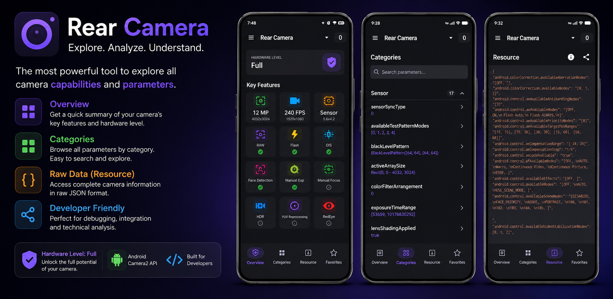

# Android 相机参数 (Android Camera Parameters)

[English](../../README.md) | 简体中文 | [繁體中文](README_zh-TW.md) | [日本語](README_ja.md) | [한국어](README_ko.md)

Android 相机参数是一款强大的诊断工具，供开发人员和爱好者探索其设备相机的深层技术能力。它利用 Android Camera2 API 提供有关设备上每个镜头的详细洞察。



## 核心特性

*   **详细诊断**：检查所有镜头（后置、前置、外置）的 `CameraCharacteristics`。
*   **硬件级别检测**：即时查看您的设备是否支持 `LEGACY`、`LIMITED`、`FULL` 或 `LEVEL_3` 特性。
*   **实时特性跟踪**：通过直观的仪表板检查对 RAW 捕获、光学防抖 (OIS)、手动曝光、手动对焦等功能的支持。
*   **分类探索**：数百个参数按传感器、镜头、AE/AF/AWB 和处理类别组织，并具有**内置搜索**功能。
*   **收藏夹（即将推出）**：书签常用参数以便快速访问。
*   **原始数据导出**：以结构化 JSON 形式查看完整的相机配置文件。
*   **多语言支持**：完全本地化为 12 种以上语言，包括中文、西班牙语、日语等。

## 支持语言

该应用已本地化以支持全球用户：
- 🇺🇸 英语 (English)
- 🇨🇳 中文 (简体)
- 🇹🇼/🇭🇰 中文 (繁体)
- 🇪🇸 西班牙语 (Spanish)
- 🇧🇷 葡萄牙语 (巴西)
- 🇫🇷 法语 (French)
- 🇩🇪 德语 (German)
- 🇷🇺 俄语 (Russian)
- 🇮🇳 印地语 (Hindi)
- 🇮🇩 印度尼西亚语 (Indonesian)
- 🇯🇵 日语 (Japanese)
- 🇰🇷 韩语 (Korean)

## 技术栈

- **语言**: Kotlin
- **UI 框架**: Jetpack Compose
- **设计系统**: Material 3
- **架构**: MVVM
- **库**:
    - [Camera2 API](https://developer.android.com/training/camera2): 核心相机交互。
    - [Gson](https://github.com/google/gson): 用于原始数据导出的 JSON 序列化。
    - [Navigation Compose](https://developer.android.com/jetpack/compose/navigation): 应用导航。

## 项目结构

- `app/`: 主 Android 应用程序模块。
    - `com.aaron.cameraparams.ui`: 基于 Compose 的 UI 屏幕和组件。
    - `com.aaron.cameraparams.camera`: 与 CameraManager 交互并检索特性的逻辑。
- `camera_parameters/`: 来自各种设备（Pixel 3、Samsung S10+ 等）的相机参数示例 JSON 转储。
- `docs/`: 补充文档和屏幕截图。

## 入门指南

### 前提条件

- Android Studio Koala 或更高版本。
- Android SDK 37 (编译/目标)。
- 物理 Android 设备（推荐）或支持 Camera2 的模拟器。

### 构建与运行

1. 克隆仓库：
   ```bash
   git clone https://github.com/zoozooll/AndroidCameraParameters.git
   ```
2. 在 Android Studio 中打开项目。
3. 构建项目：
   ```bash
   ./gradlew assembleDebug
   ```
4. 安装并在您的设备上运行。

## 许可证

本项目根据 **MIT 许可证** 授权。有关详细信息，请参阅 [LICENSE](../../LICENSE) 文件。

## 支持与联系

电子邮件: kangkang365@gmail.com
项目网站: [GitHub Pages](https://zoozooll.github.io/AndroidCameraParameters/)
