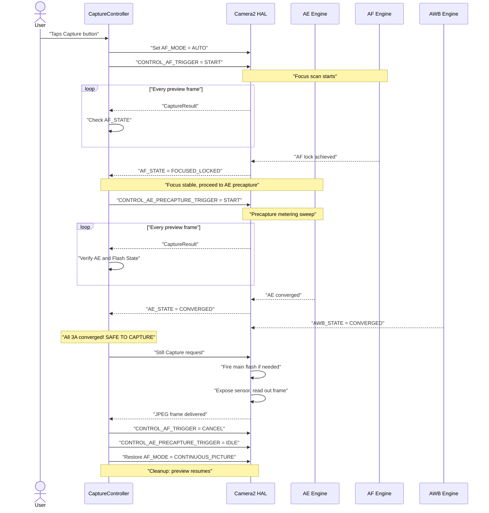
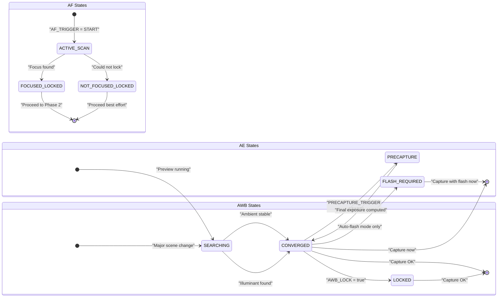

# Chapter 17: The 3A Pipeline

We've studied **AE** (Auto Exposure, Chapter 13–14), **AF** (Auto Focus, Chapter 15), and **AWB** (Auto White Balance, Chapter 16) as independent systems. Real photography apps must coordinate all three before each shutter press — and the *order and timing* matter deeply.

A naive implementation that fires `capture()` immediately when the user taps the shutter button produces inconsistent results: sometimes focus, sometimes not; sometimes flash fires, sometimes not; sometimes mid-sweep AWB gives a green-tinted photo. A reliable 3A pipeline eliminates all of that.

The 3A pipeline implementation in this chapter is identical to the flow used internally in the [Android Camera Parameters app](https://github.com/zoozooll/AndroidCameraParameters) and the sequence described in the Android Camera architecture research documents and CSDN articles on professional Camera2 development.

---

## The Full 3A Orchestration Sequence (Overview)

Before diving into each subsystem, let's visualize the complete state flow. This is a real production sequence — not a simplification.



**Each step is blocking.** You do not move to step N+1 until the HAL confirms the state required at step N. Never skip steps — that's how you ship an app with intermittent soft focus, bad flash exposures, or blue-tinted photos.

---

## AE (Auto Exposure) Deep-Dive

AE is the most complex of the three A's because it encompasses not just shutter+ISO but **flash metering** and the **precapture trigger**.

### AE Modes: CONTROL_AE_MODE

| Mode | Behavior | Flash Support |
|------|----------|--------------|
| `OFF` | Fully manual (covered in Ch. 14) | None |
| `ON` | Auto exposure, **flash disabled** (permanent off) | No |
| `ON_AUTO_FLASH` | Auto exposure, **auto-flash decision** — HAL fires flash only in low light | Auto (most common default) |
| `ON_ALWAYS_FLASH` | Auto exposure, **flash always fires** (fill flash for backlit portraits) | Always |
| `ON_AUTO_FLASH_REDEYE` | Auto exposure + flash + red-eye reduction (fires a pre-flash sequence to clamp pupils) | Auto + redeye |
| `ON_EXTERNAL_FLASH` | External camera accessory flash | External only (rare) |

**The default for a normal camera app** is `ON_AUTO_FLASH`. Users expect the phone to "know" when to fire the flash.

### AE States & Precapture Trigger

Like AF, AE reports its state via `CaptureResult.CONTROL_AE_STATE`:

| State | Meaning |
|-------|---------|
| `INACTIVE` (0) | AE disabled or hasn't started |
| `SEARCHING` (1) | Actively searching for correct exposure |
| `CONVERGED` (2) | Exposure is stable. In flash modes, this means *ambient* exposure converged, but a preflash sweep hasn't happened yet. |
| `LOCKED` (3) | Exposure explicitly locked via `CONTROL_AE_LOCK = true` |
| `FLASH_REQUIRED` (4) | Converged on ambient, and HAL has decided **flash is needed** for correct shot |
| `PRECAPTURE` (5) | **Key state.** The precapture sweep is running — HAL is metering (firing preflash pulses, if flash is needed) to calculate final capture exposure + flash power. |

### Why the Precapture Trigger Matters

The AE engine running on preview frames is *approximate*. The preview pipeline uses smaller buffers, lower bit-depth processing, and doesn't account for the massive light contribution of a main flash firing at capture time.

`CONTROL_AE_PRECAPTURE_TRIGGER = START` tells the HAL:

> "I'm about to take a real still photo. Stop approximating. Run the full-precision metering pipeline. If I'm in an auto-flash mode, fire one or more low-power preflashes, measure the reflection, and calculate exact final shutter/ISO/flash-power for the capture."

**Skipping precapture = flash photos are randomly overexposed or underexposed.** The HAL simply didn't have a chance to meter for the flash in real time.

### AE Regions (Spot Metering)

Just like `CONTROL_AF_REGIONS` for focus, `CONTROL_AE_REGIONS` specifies *where in the scene* to meter. A portrait tap-to-focus should simultaneously apply the same region to AE — the face gets both focus priority AND exposure priority, not metered based on the bright sky background.

```kotlin
// Use the SAME MeteringRectangle array for both AF and AE regions
val focusWeightedRegions = arrayOf(userTapRegion)
builder.set(CaptureRequest.CONTROL_AF_REGIONS, focusWeightedRegions)
builder.set(CaptureRequest.CONTROL_AE_REGIONS, focusWeightedRegions)
```

**Weighting:** Each `MeteringRectangle` has a `weight` (0–1000). Regions with higher weight influence metering more. A "spot metering" mode uses one high-weight rectangle (1000). "Matrix / Evaluative" metering uses many low-weight rectangles spread across the frame.

---

## AWB: The Silent Partner of the Trio

AWB usually converges early and stays converged in most scenes — which is why it's often treated as an afterthought. But its contribution to color accuracy is critical, and it *can* still be searching when you're ready to capture.

### AWB States Recap

| AWB State | Capture Decision |
|-----------|------------------|
| `INACTIVE` (AWB_MODE = OFF) | OK to proceed (manual gains) |
| `SEARCHING` | **Wait.** Colors may still shift. Usually < 500ms after major scene change. |
| `CONVERGED` | ✅ Perfect — proceed |
| `LOCKED` | ✅ Also perfect — explicitly locked via `CONTROL_AWB_LOCK = true` |

### Coupling AWB Lock with AE/AF Locks

For critical studio/product photography, lock all three *before* capture:

```kotlin
// In the still-capture request (not earlier — we want final converged values locked)
builder.set(CaptureRequest.CONTROL_AWB_LOCK, true)
builder.set(CaptureRequest.CONTROL_AE_LOCK, true)
// AF stays locked because we triggered it earlier and haven't cancelled
```

This guarantees the main capture reuses *exactly* the same color/wb profile that the final precapture metering frame used.

---

## Complete Production 3A Capture Controller (Kotlin)

Now let's assemble it all into a reusable class. This implementation matches the orchestration flow in the Android Camera architecture research documents section on 3A Control Pipeline and the patterns recommended by the Android Camera CSDN series.

```kotlin
class ThreeACaptureController(
    private val characteristics: CameraCharacteristics,
    private val captureSession: CameraCaptureSession,
    private val previewSurface: Surface,
    private val jpegReaderSurface: Surface,
    private val mainHandler: Handler
) {
    // ----------- Public API -----------
    interface CaptureListener {
        fun onCaptureStarted() {}
        fun onCaptureSuccess(jpegBytes: ByteArray)
        fun onCaptureError(reason: String)
    }

    /**
     * Orchestrate the full 3A capture sequence:
     *   AF Trigger → AF Locked → AE Precapture → AE Converged → Still Capture → Cleanup
     */
    fun captureStillPhoto(
        aeMode: Int = CameraMetadata.CONTROL_AE_MODE_ON_AUTO_FLASH,
        listener: CaptureListener
    ) {
        this.listener = listener
        listener.onCaptureStarted()
        beginPhase1_AfTrigger(aeMode)
    }

    // ----------- Internal state -----------
    private var listener: CaptureListener? = null
    private var timeoutRunnable: Runnable? = null
    private var phase: Int = 0
    private lateinit var currentAeMode: Int

    private val SESSION_TIMEOUT_MS = 3500L  // Budget phones need up to ~3s

    // ---- PHASE 1: Trigger AF, wait for FOCUSED_LOCKED ----
    private fun beginPhase1_AfTrigger(aeMode: Int) {
        currentAeMode = aeMode
        phase = 1

        val request = captureSession.device.createCaptureRequest(
            CameraDevice.TEMPLATE_PREVIEW
        ).apply {
            addTarget(previewSurface)

            set(CaptureRequest.CONTROL_AF_MODE,
                CameraMetadata.CONTROL_AF_MODE_AUTO)
            set(CaptureRequest.CONTROL_AE_MODE, aeMode)
            set(CaptureRequest.CONTROL_AWB_MODE,
                CameraMetadata.CONTROL_AWB_MODE_AUTO)

            // Kick off one-shot AF scan
            set(CaptureRequest.CONTROL_AF_TRIGGER,
                CameraMetadata.CONTROL_AF_TRIGGER_START)
        }

        startTimeout("AF scan")
        captureSession.setRepeatingRequest(request.build(), captureCallback, mainHandler)
    }

    // ---- PHASE 2: AF locked. Start AE precapture trigger ----
    private fun beginPhase2_AePrecapture() {
        phase = 2
        val request = captureSession.device.createCaptureRequest(
            CameraDevice.TEMPLATE_PREVIEW
        ).apply {
            addTarget(previewSurface)

            // Keep AF locked — do NOT cancel AF trigger yet!
            set(CaptureRequest.CONTROL_AF_MODE,
                CameraMetadata.CONTROL_AF_MODE_AUTO)
            // AF_TRIGGER remains in START state from Phase 1

            set(CaptureRequest.CONTROL_AE_MODE, currentAeMode)

            // ---- THE CRITICAL LINE: Run Precapture ----
            set(CaptureRequest.CONTROL_AE_PRECAPTURE_TRIGGER,
                CameraMetadata.CONTROL_AE_PRECAPTURE_TRIGGER_START)

            set(CaptureRequest.CONTROL_AWB_MODE,
                CameraMetadata.CONTROL_AWB_MODE_AUTO)
        }

        restartTimeout("AE precapture")
        captureSession.setRepeatingRequest(request.build(), captureCallback, mainHandler)
    }

    // ---- PHASE 3: AE converged + AWB converged. Fire actual still capture. ----
    private fun beginPhase3_StillCapture() {
        phase = 3
        cancelTimeout()

        val request = captureSession.device.createCaptureRequest(
            CameraDevice.TEMPLATE_STILL_CAPTURE
        ).apply {
            addTarget(previewSurface)
            addTarget(jpegReaderSurface)

            // Keep AF locked until AFTER capture completes
            set(CaptureRequest.CONTROL_AF_MODE,
                CameraMetadata.CONTROL_AF_MODE_AUTO)

            set(CaptureRequest.CONTROL_AE_MODE, currentAeMode)

            // Lock both AE and AWB for the still capture to prevent last-frame drift
            set(CaptureRequest.CONTROL_AE_LOCK, true)
            set(CaptureRequest.CONTROL_AWB_LOCK, true)

            set(CaptureRequest.CONTROL_AWB_MODE,
                CameraMetadata.CONTROL_AWB_MODE_AUTO)

            set(CaptureRequest.JPEG_QUALITY, 95)
            // JPEG orientation: use Display rotation for correct final orientation
            val jpegOrient = computeJpegOrientation()
            set(CaptureRequest.JPEG_ORIENTATION, jpegOrient)
        }

        captureSession.capture(request.build(), object : CameraCaptureSession.CaptureCallback() {
            override fun onCaptureCompleted(
                session: CameraCaptureSession,
                request: CaptureRequest,
                result: TotalCaptureResult
            ) {
                super.onCaptureCompleted(session, request, result)
                // ImageReader OnImageAvailableListener will handle saving bytes to listener
                // Now clean up: reset back to normal preview mode
                resetToContinuousPreview()
            }
        }, mainHandler)
    }

    // ---- Cleanup: Resume normal continuous preview ----
    private fun resetToContinuousPreview() {
        phase = 0
        val request = captureSession.device.createCaptureRequest(
            CameraDevice.TEMPLATE_PREVIEW
        ).apply {
            addTarget(previewSurface)
            set(CaptureRequest.CONTROL_AF_MODE,
                CameraMetadata.CONTROL_AF_MODE_CONTINUOUS_PICTURE)
            set(CaptureRequest.CONTROL_AE_MODE, currentAeMode)
            set(CaptureRequest.CONTROL_AWB_MODE,
                CameraMetadata.CONTROL_AWB_MODE_AUTO)

            // Release all locks & cancel all triggers
            set(CaptureRequest.CONTROL_AF_TRIGGER,
                CameraMetadata.CONTROL_AF_TRIGGER_CANCEL)
            set(CaptureRequest.CONTROL_AE_PRECAPTURE_TRIGGER,
                CameraMetadata.CONTROL_AE_PRECAPTURE_TRIGGER_IDLE)
            set(CaptureRequest.CONTROL_AE_LOCK, false)
            set(CaptureRequest.CONTROL_AWB_LOCK, false)
        }
        captureSession.setRepeatingRequest(request.build(), null, mainHandler)
    }

    // ----------- Master Callback: Drives all 3 phases via state inspection -----------
    private val captureCallback = object : CameraCaptureSession.CaptureCallback() {
        override fun onCaptureCompleted(
            session: CameraCaptureSession,
            request: CaptureRequest,
            result: TotalCaptureResult
        ) {
            val afState = result.get(CaptureResult.CONTROL_AF_STATE)
            val aeState = result.get(CaptureResult.CONTROL_AE_STATE)
            val awbState = result.get(CaptureResult.CONTROL_AWB_STATE)

            when (phase) {
                1 -> {
                    // ---- PHASE 1: Wait for AF lock ----
                    when (afState) {
                        CaptureResult.CONTROL_AF_STATE_FOCUSED_LOCKED -> {
                            Log.d("3A", "✓ AF FOCUSED_LOCKED — moving to AE precapture")
                            beginPhase2_AePrecapture()
                        }
                        CaptureResult.CONTROL_AF_STATE_NOT_FOCUSED_LOCKED -> {
                            Log.w("3A", "⚠ AF NOT_FOCUSED_LOCKED — proceeding anyway (may be soft)")
                            beginPhase2_AePrecapture()
                        }
                        // ACTIVE_SCAN / PASSIVE_SCAN → keep waiting
                    }
                }
                2 -> {
                    // ---- PHASE 2: Wait for AE to converge after precapture ----
                    // Accept states that mean "AE is done with precapture and ready for capture"
                    val aeReady = (aeState == CaptureResult.CONTROL_AE_STATE_CONVERGED
                                || aeState == CaptureResult.CONTROL_AE_STATE_LOCKED
                                || aeState == CaptureResult.CONTROL_AE_STATE_FLASH_REQUIRED)
                    val awbReady = (awbState == CaptureResult.CONTROL_AWB_STATE_CONVERGED
                                 || awbState == CaptureResult.CONTROL_AWB_STATE_LOCKED
                                 || awbState == CaptureResult.CONTROL_AWB_STATE_INACTIVE)

                    if (aeReady && awbReady) {
                        Log.d("3A", "✓ AE=$aeState, AWB=$awbState — firing capture")
                        beginPhase3_StillCapture()
                    }
                }
            }
        }
    }

    // ----------- Timeout protection: Never hang if HAL never converges -----------
    private fun startTimeout(phaseName: String) {
        cancelTimeout()
        timeoutRunnable = Runnable {
            Log.w("3A", "⏱ Timeout waiting for $phaseName — proceeding with best effort")
            when (phase) {
                1 -> beginPhase2_AePrecapture()  // Proceed with best possible focus
                2 -> beginPhase3_StillCapture()  // Proceed with best possible exposure
            }
        }
        mainHandler.postDelayed(timeoutRunnable!!, SESSION_TIMEOUT_MS)
    }
    private fun restartTimeout(phaseName: String) = startTimeout(phaseName)
    private fun cancelTimeout() {
        timeoutRunnable?.let { mainHandler.removeCallbacks(it) }
        timeoutRunnable = null
    }

    // ----------- Utility: Correct JPEG orientation based on display rotation -----------
    private fun computeJpegOrientation(): Int {
        val sensorOrient = characteristics.get(
            CameraCharacteristics.SENSOR_ORIENTATION
        ) ?: 0
        // Combine with Display.rotation (0, 90, 180, 270) from your Activity
        // Typical impl: return (sensorOrient + displayRotationDegrees) % 360
        return sensorOrient  // Simplified; wire to your display's rotation
    }
}
```

### How to Use the Controller

```kotlin
// Inside your CameraFragment's capture button click listener
val controller = ThreeACaptureController(
    characteristics = yourCameraCharacteristics,
    captureSession = yourActiveSession,
    previewSurface = previewView.surface,
    jpegReaderSurface = jpegImageReader.surface,
    mainHandler = yourCameraHandler
)

controller.captureStillPhoto(
    aeMode = CameraMetadata.CONTROL_AE_MODE_ON_AUTO_FLASH
) {
    override fun onCaptureSuccess(jpegBytes: ByteArray) {
        lifecycleScope.launch(Dispatchers.IO) {
            val file = File(requireContext().filesDir, "photo_${System.currentTimeMillis()}.jpg")
            file.writeBytes(jpegBytes)
            withContext(Dispatchers.Main) {
                Toast.makeText(requireContext(), "Saved: ${file.name}", Toast.LENGTH_SHORT).show()
            }
        }
    }
    override fun onCaptureError(reason: String) {
        Toast.makeText(requireContext(), "Capture failed: $reason", Toast.LENGTH_LONG).show()
    }
}
```

### Pairing with ImageReader

Don't forget the `OnImageAvailableListener` on your JPEG `ImageReader` to actually deliver `jpegBytes` to the listener. The controller above assumes you've already wired this:

```kotlin
// Set this up when creating the ImageReader (see Capture Chapter)
jpegImageReader.setOnImageAvailableListener({ reader ->
    val image = reader.acquireLatestImage() ?: return@setOnImageAvailableListener
    image.use {
        val buffer = it.planes[0].buffer
        val bytes = ByteArray(buffer.remaining())
        buffer.get(bytes)
        // Deliver bytes to your UI / file saver
        lastCaptureListener?.onCaptureSuccess(bytes)
    }
}, mainHandler)
```

---

## Flash-Specific Handling Nuances

For `ON_AUTO_FLASH` / `ON_ALWAYS_FLASH` / `ON_AUTO_FLASH_REDEYE` modes, the precapture trigger runs preflash pulses. Two important considerations:

1. **Preflash pulse visibility:** Preflashes are *real flashes* — the user sees them as a low-brightness flash pulse before the main flash. Most modern camera UIs hide this with a "shutter button animation" or by darkening the preview.

2. **`FLASH_STATE` must READY:** In addition to `AE_STATE = CONVERGED`, verify `CaptureResult.FLASH_STATE = FLASH_STATE_READY` (or `FIRED`) for flash modes before capture. It's possible for AE to converge but the flash charging capacitor to still be ramping up.

```kotlin
// Enhanced aeReady check inside Phase 2 callback for flash modes:
val aeState = result.get(CaptureResult.CONTROL_AE_STATE)
val flashState = result.get(CaptureResult.FLASH_STATE)

val flashModeWantsFlash = (currentAeMode == CameraMetadata.CONTROL_AE_MODE_ON_ALWAYS_FLASH ||
                          (currentAeMode == CameraMetadata.CONTROL_AE_MODE_ON_AUTO_FLASH &&
                           aeState == CaptureResult.CONTROL_AE_STATE_FLASH_REQUIRED))

val aeReady = when {
    flashModeWantsFlash -> {
        // HAL must have both AE converged AND flash ready to fire
        (aeState == CaptureResult.CONTROL_AE_STATE_CONVERGED
         || aeState == CaptureResult.CONTROL_AE_STATE_FLASH_REQUIRED) &&
        (flashState == CaptureResult.FLASH_STATE_READY
         || flashState == CaptureResult.FLASH_STATE_FIRED)
    }
    else -> {
        // No-flash mode: plain AE convergence is enough
        (aeState == CaptureResult.CONTROL_AE_STATE_CONVERGED
         || aeState == CaptureResult.CONTROL_AE_STATE_LOCKED)
    }
}
```

---

## The 3A State Transition Machine (Summary Diagram)

For quick reference when debugging, here's the combined state chart of AE, AF, and AWB showing the expected transitions during a successful capture.



The global controller only proceeds to the still capture when the final "capture OK" state is reached simultaneously on all three sub-states.

---

## Troubleshooting the 3A Pipeline

| Symptom | Root Cause | Fix |
|---------|-----------|-----|
| Flash photos randomly under/over-exposed | Skipped `AE_PRECAPTURE_TRIGGER = START` | Always run precapture before still capture in any flash mode |
| Every 5th–10th photo is slightly soft | Proceeded to capture before `FOCUSED_LOCKED` | Block on AF state (our controller does this) |
| Camera hangs for seconds then crashes | No timeout; HAL stuck in SEARCHING forever | Add the 3500ms timeout + best-effort fallback as shown |
| Flash fires but photo is still dark | Proceeded before `FLASH_STATE = READY` | Capacitor charging; add FLASH_STATE check in AE ready condition |
| Portrait of backlit person is underexposed | AE metered the sky, not the face | Couple `CONTROL_AE_REGIONS` to same tap rectangle as `CONTROL_AF_REGIONS` |
| 2° color tint shift between frames in burst | Forgot `AWB_LOCK = true` before capture burst | Lock AWB on the first converged frame; keep locked through burst |
| Capture sequence is noticeably slow on budget phone | `TEMPLATE_STILL_CAPTURE` starts cold pipeline | Warm up with a dummy `TEMPLATE_PREVIEW` with identical AE/AF settings first |

---

## Summary

This chapter tied exposure, focus, and white balance together into a single, reliable **3A capture pipeline** — the exact sequence a professional camera app uses for every shutter press:

1. **Phase 1 (AF):** Set `AF_MODE = AUTO` + `AF_TRIGGER = START`. Wait until `AF_STATE = FOCUSED_LOCKED` (or `NOT_FOCUSED_LOCKED` as fallback).
2. **Phase 2 (AE Precapture):** Set `AE_PRECAPTURE_TRIGGER = START`. Wait for `AE_STATE = CONVERGED` / `FLASH_REQUIRED` AND `FLASH_STATE = READY` (if flash modes). Also require `AWB_STATE = CONVERGED`.
3. **Phase 3 (Still Capture):** Submit `TEMPLATE_STILL_CAPTURE` with `AE_LOCK = true`, `AWB_LOCK = true`.
4. **Phase 4 (Cleanup):** Cancel all triggers, release all locks, restore `AF_MODE = CONTINUOUS_PICTURE`.

Critical supporting concepts:
- **AE modes:** `ON_AUTO_FLASH` is the sensible default for consumer apps
- **AE regions** = spot metering; always pair with AF regions on tap-to-focus
- **AWB converges fast** but always block on `CONVERGED` or `LOCKED` for color-critical work
- **Timeouts are non-negotiable.** Budget phones and low-light can make AF/AE scan forever; always proceed with a best-effort fallback after ~3.5s.

## What's Next

Congratulations on completing the 3A Manual Photography module. You now understand — at a professional level — how to control:

- **Exposure (Ch. 13–14):** The exposure triangle, ISO + shutter, nanosecond conversions, manual override, long exposure, timelapse lock, bracketing
- **Focus (Ch. 15):** AF modes, AF state machine, one-shot trigger-and-capture, manual focus diopters, hyperfocal presets, touch-to-focus regions
- **Color (Ch. 16):** Color temperature, AWB presets, manual COLOR_CORRECTION_GAINS, 3×3 CCM transforms, Kelvin slider implementation
- **Orchestration (Ch. 17):** The full 3A pipeline with precapture, flash-safe AE convergence, per-phase timeouts, lock/release cleanup

You can now build a complete pro-mode camera app that rivals the capabilities of the [Android Camera Parameters app](https://github.com/zoozooll/AndroidCameraParameters) itself!

In the upcoming chapters, we shift gears from capture **control** to capture **quality** — covering RAW capture, DNG saving, multi-frame processing, HDR, and computational photography techniques that build on the 3A pipeline you now master.
