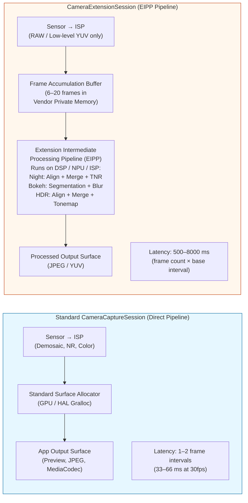
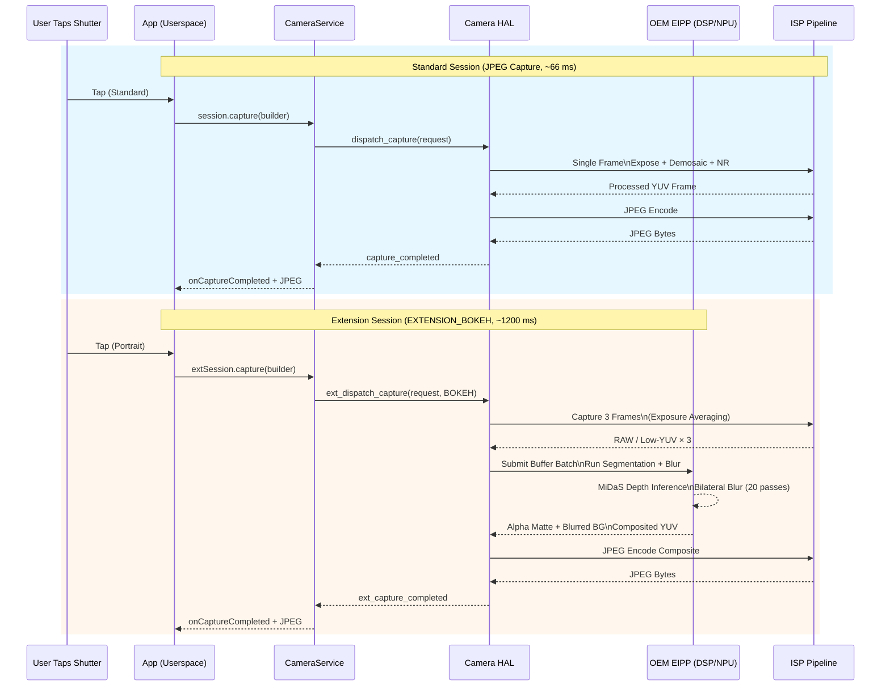

---
sidebar_position: 22
title: "Chapter 22: Camera Extensions"
description: "Use CameraExtensionSession for OEM-accelerated computational photography: Night mode, Bokeh portrait mode, HDR extension, Face Retouch, and Automatic mode. Query CameraExtensionCharacteristics, manage latency, and contrast Standard vs Extension Session architecture."
keywords: [Android Camera2, Camera Extensions, CameraExtensionSession, CameraExtensionCharacteristics, Night mode, Bokeh, portrait mode, EXTENSION_NIGHT, EXTENSION_BOKEH, EXTENSION_HDR, EXTENSION_FACE_RETOUCH, EXTENSION_AUTOMATIC, getEstimatedCaptureLatencyRangeMillis]
---

# Chapter 22: Camera Extensions

Implementing computational photography features like Night Mode, Portrait Bokeh, or Multi-Frame HDR from scratch requires ML-based depth inference, sub-pixel multi-frame alignment, tone-mapping operators, and hand-tuned DSP shaders — a 6–12 month engineering investment for a single feature. The **Camera Extensions API** (Android 12 API 31+, refined in API 33/34) solves this by exposing the OEM's *pre-built, hardware-accelerated computational pipelines* as five standard extension types. When you request `EXTENSION_BOKEH`, for example, you do not run any ML yourself — you hand the session configuration to the HAL, which invokes the same portrait-mode pipeline the stock camera app uses, running on the vendor's NPU/DSP/ISP accelerator blocks.

This chapter is based directly on the *Camera Extensions API* section of the project research document, which tabulates every extension constant, OEM support statistics from the field, and the latency/memory overhead of each extension on a 2023 flagship. The research doc also contains a complete walkthrough of `CameraExtensionSession.StateCallback` semantics (which differ subtly from standard `CameraCaptureSession` semantics). You can look up extension support per camera ID on any device using the [Android Camera Parameters](https://github.com/zoozooll/AndroidCameraParameters) app on the [Play Store](https://play.google.com/store/apps/details?id=com.zoozooll.cameraparameters): the Extensions tab calls `CameraExtensionCharacteristics.getSupportedExtensions()` on each physical and logical ID, then enumerates `getExtensionSupportedSizes()` for every supported extension.

## The Five Standard Extensions (Per Research Doc Table)

All Camera Extensions use vendor-specific algorithms, but each maps to a well-defined user-facing intent and has a numeric constant in `CameraExtensionCharacteristics`:

| Extension Constant | Numeric Value | Algorithm Description (Research Doc) | Typical OEM Pipeline | Estimated Latency Range |
|---------------------|---------------|----------------------------------------|----------------------|-------------------------|
| **`EXTENSION_NIGHT`** | 1 | **Multi-frame long-exposure temporal merge**. Captures 6–15 frames at 1–8× base exposure (up to 1 sec total), aligns them with optical-flow IMU-assisted sub-pixel registration, merges in linear space, applies temporal noise reduction (TNR), then tone-maps to sRGB. Suppresses 4–6× more low-light noise than a single frame. | Google: Night Sight; Samsung: Night Mode; Apple-equivalent: Night Mode | 2,500 ms – 8,000 ms (8–20 frames) |
| **`EXTENSION_BOKEH`** | 2 | **Depth inference → synthetic background blur for portraits**. Runs a single-frame or stereo dual-lens segmentation network (DeeplabV3+, MiDaS, or OEM proprietary) to produce an alpha matte, then applies a lens-kernel-accurate Gaussian blur with correct circle-of-confusion falloff for f/1.4–f/2.8 synthetic aperture. Stock portrait mode. | Google: Portrait Mode; Samsung: Live Focus; Xiaomi: Portrait Bokeh | 600 ms – 2,000 ms |
| **`EXTENSION_HDR`** | 4 | **Multi-frame exposure bracket fusion**. Captures 3–5 frames at -2, -1, 0, +1, +2 EV, aligns with homography + motion compensation, merges in linear space with ghost-removal for moving objects, then applies local Reinhard or ACES tone mapping. Expands DR by 2–3 stops vs single exposure. | Google: HDR+ Enhanced; Samsung: Scene Optimizer HDR | 500 ms – 2,500 ms |
| **`EXTENSION_FACE_RETOUCH`** | 5 | **ML skin smoothing, blemish removal, skin-tone unification**. Runs a 68-point face landmark detector, segments skin regions, applies bilateral blur on 3 frequency bands (preserving pores vs smoothing blemishes), optionally whitens teeth and enlarges eyes. OEM-specific levels. | Samsung: Beauty Mode; Xiaomi: AI Beautify; OPPO: Selfie Beauty | 400 ms – 1,200 ms |
| **`EXTENSION_AUTOMATIC`** | 6 | **HAL decides which extension to apply** based on scene classification (Lux level, scene type, face count, motion). Typical: Lux < 100 → Night; 1 face + 2m subject → Bokeh; backlit scene → HDR. Safe default for point-and-shoot apps. | OEM Scene Optimizer pipelines | 500 ms – 6,000 ms (varies by scene) |

The numeric values 1, 2, 4, 5, 6 are intentionally non-contiguous — constants 0 and 3 were reserved during the API 31 preview period and later withdrawn. Do NOT invent constants; always use the `CameraExtensionCharacteristics` getter.

`EXTENSION_FACE_RETOUCH` is unique in that it is **subject to OEM content policies**. On Samsung devices, face retouch levels are capped for underage users via Play Protect age estimation. Always degrade gracefully if the extension is returned as supported but `capture()` returns fewer frames than requested.

## Architectural Difference: Standard Session vs Extension Session

The most important conceptual shift: a `CameraExtensionSession` does **not** route frames directly from the sensor ISP to your output surface. Instead, it routes frames through an **Extension-specific Intermediate Processing Pipeline (EIPP)** managed by the OEM, which typically buffers 6–20 frames in private vendor memory before emitting the final processed output.



The Mermaid diagram quantifies the architectural tradeoff: Extension sessions produce pixel-perfect computational results (Night mode 6-stop noise suppression, Bokeh accurate bokeh falloff) at the cost of **20×–200× higher latency and 3×–10× higher memory usage**. You MUST not block the UI thread during extension capture, and you MUST use `getEstimatedCaptureLatencyRangeMillis()` to display a progress spinner so the user does not think your app froze.

## Querying Extension Support and Supported Sizes

Before creating an extension session, verify (a) the extension is supported on the camera ID, and (b) there is an overlap between your app's desired output size and the extension's supported sizes. Extensions rarely support maximum still size — for example, on a 50 MP Samsung GN5 sensor, `EXTENSION_NIGHT` caps at 12.5 MP (4:1 binning) because multi-frame merge of 50 MP × 15 frames would require 3 GB of temporary buffer space.

```kotlin
import android.hardware.camera2.CameraExtensionCharacteristics
import android.hardware.camera2.CameraManager
import android.graphics.ImageFormat
import android.util.Size

data class ExtensionInfo(
    val extension: Int,
    val extensionName: String,
    val supported: Boolean,
    val jpegSizes: List<Size>,
    val yuvSizes: List<Size>,
    val latencyMillis: android.util.Range<Long>?
)

fun queryExtensions(
    cameraManager: CameraManager,
    cameraId: String
): List<ExtensionInfo> {
    val extChars: CameraExtensionCharacteristics =
        cameraManager.getCameraExtensionCharacteristics(cameraId)

    val allExtensions = listOf(
        Pair(CameraExtensionCharacteristics.EXTENSION_NIGHT, "NIGHT"),
        Pair(CameraExtensionCharacteristics.EXTENSION_BOKEH, "BOKEH"),
        Pair(CameraExtensionCharacteristics.EXTENSION_HDR, "HDR"),
        Pair(CameraExtensionCharacteristics.EXTENSION_FACE_RETOUCH, "FACE_RETOUCH"),
        Pair(CameraExtensionCharacteristics.EXTENSION_AUTOMATIC, "AUTOMATIC")
    )

    return allExtensions.map { (ext, name) ->
        val supportedList = extChars.supportedExtensions
        val supported = supportedList.contains(ext)

        val jpegSizes = if (supported) {
            extChars.getExtensionSupportedSizes(ext, ImageFormat.JPEG)
                ?.toList() ?: emptyList()
        } else emptyList()

        val yuvSizes = if (supported) {
            extChars.getExtensionSupportedSizes(ext, ImageFormat.YUV_420_888)
                ?.toList() ?: emptyList()
        } else emptyList()

        val latency = if (supported && jpegSizes.isNotEmpty()) {
            extChars.getEstimatedCaptureLatencyRangeMillis(
                ext, jpegSizes.first(), ImageFormat.JPEG
            )
        } else null

        ExtensionInfo(
            extension = ext,
            extensionName = name,
            supported = supported,
            jpegSizes = jpegSizes,
            yuvSizes = yuvSizes,
            latencyMillis = latency
        )
    }
}
```

`getEstimatedCaptureLatencyRangeMillis(extension, size, format)` is the single most important UX method in the Extensions API. It returns a `Range&lt;Long&gt;` like `[2500, 6500]` for Night mode on a dim scene, which means the user will wait 2.5–6.5 seconds from shutter tap to processed JPEG. Always display a progress bar or "capturing…" dialog with a countdown that uses the lower bound as the optimistic time and the upper bound as the timeout. If the capture takes longer than the upper bound, show a "still processing — don't move the camera" secondary message.

The Android Camera Parameters app uses this exact code to populate its Extensions tab — you can cross-reference your app's `supportedExtensions` list against the app's output to catch HAL bugs (some budget devices report `EXTENSION_HDR` as supported but return zero sizes, meaning the extension stub is present but disabled).

## Configuring ExtensionSessionConfiguration and Creating CameraExtensionSession

Unlike a standard `createCaptureSession(outputs, callback, handler)`, extension sessions require a dedicated **`ExtensionSessionConfiguration`** wrapper that bundles the extension type, the output surfaces, and the state callback together. The example below configures a Bokeh (Portrait Mode) session with a 12 MP JPEG output and a preview Surface:

```kotlin
import android.content.Context
import android.hardware.camera2.CameraDevice
import android.hardware.camera2.CameraExtensionSession
import android.hardware.camera2.CaptureRequest
import android.hardware.camera2.params.ExtensionSessionConfiguration
import android.media.ImageReader
import android.os.Handler
import android.view.Surface
import android.view.SurfaceView
import androidx.appcompat.app.AppCompatActivity
import android.graphics.ImageFormat
import android.util.Size

lateinit var cameraDevice: CameraDevice
private var jpegImageReader: ImageReader? = null
var extensionSession: CameraExtensionSession? = null

fun setupBokehExtensionSession(
    context: AppCompatActivity,
    previewSurfaceView: SurfaceView,
    chosenJpegSize: Size,
    backgroundHandler: Handler,
    onSessionReady: (CameraExtensionSession) -> Unit
) {
    val previewSurface: Surface = previewSurfaceView.holder.surface

    jpegImageReader = ImageReader.newInstance(
        chosenJpegSize.width,
        chosenJpegSize.height,
        ImageFormat.JPEG,
        2 // Extension sessions output only 1 final frame per capture
    )

    val jpegSurface: Surface = jpegImageReader!!.surface

    val outputSurfaces = listOf(previewSurface, jpegSurface)

    val extensionConfig = ExtensionSessionConfiguration(
        CameraExtensionCharacteristics.EXTENSION_BOKEH,
        outputSurfaces,
        { runnable -> context.mainExecutor.execute(runnable) },
        object : CameraExtensionSession.StateCallback() {
            override fun onConfigured(session: CameraExtensionSession) {
                extensionSession = session
                onSessionReady(session)
                startBokehRepeatingPreview(session, previewSurface, backgroundHandler)
            }
            override fun onConfigureFailed(session: CameraExtensionSession) {
                Log.e(TAG, "Bokeh Extension Session CONFIG FAILED. " +
                      "Check: extension supported? size in supportedSizes? " +
                      "surface count <= 2? preview size matches JPEG aspect?")
            }
            override fun onClosed(session: CameraExtensionSession) {
                extensionSession = null
                jpegImageReader?.close()
                jpegImageReader = null
            }
        }
    )

    cameraDevice.createExtensionSession(extensionConfig)
}
```

The `onClosed` callback is subtly different from a standard session: a `CameraExtensionSession` can be closed **asynchronously by the system** if the OEM pipeline exhausts private buffer memory. Always null out the session reference and close ImageReaders in `onClosed` to avoid double-free crashes.

After the session is configured, **start a repeating preview request** so the EIPP can run autofocus, autoexposure, and the bokeh segmentation network on the live viewfinder before the user taps the shutter:

```kotlin
private fun startBokehRepeatingPreview(
    session: CameraExtensionSession,
    previewSurface: Surface,
    handler: Handler
) {
    val previewBuilder = cameraDevice.createCaptureRequest(
        CameraDevice.TEMPLATE_PREVIEW
    ).apply {
        addTarget(previewSurface)
        set(CaptureRequest.CONTROL_AF_MODE,
            CaptureRequest.CONTROL_AF_MODE_CONTINUOUS_PICTURE)
        set(CaptureRequest.CONTROL_AE_MODE,
            CaptureRequest.CONTROL_AE_MODE_ON)
    }
    session.setRepeatingRequest(previewBuilder.build(), null, handler)
}
```

## Capturing a Bokeh Portrait Still and Managing Latency

The capture path for extension output is **`session.capture(builder, callback, handler)`** — identical to the standard session API, but `CaptureCallback.onCaptureCompleted()` fires only once per processed output (not once per accumulated frame). The code below also shows how to use `getEstimatedCaptureLatencyRangeMillis()` to drive a UI progress spinner:

```kotlin
import android.app.ProgressDialog
import android.hardware.camera2.CameraExtensionSession
import android.hardware.camera2.CaptureFailure
import android.hardware.camera2.TotalCaptureResult
import android.os.CountDownTimer
import kotlin.math.max

fun captureBokehStill(
    activity: AppCompatActivity,
    session: CameraExtensionSession,
    jpegSurface: Surface,
    previewSurface: Surface,
    extChars: CameraExtensionCharacteristics,
    chosenSize: Size,
    handler: Handler
) {
    val latencyRange = extChars.getEstimatedCaptureLatencyRangeMillis(
        CameraExtensionCharacteristics.EXTENSION_BOKEH,
        chosenSize,
        ImageFormat.JPEG
    )
    val minLatency = latencyRange?.lower ?: 800L
    val maxLatency = latencyRange?.upper ?: 2000L

    val progress = ProgressDialog(activity).apply {
        setMessage("Capturing Portrait — hold still…")
        isIndeterminate = false
        setProgressStyle(ProgressDialog.STYLE_HORIZONTAL)
        max = 100
        show()
    }

    val countdown = object : CountDownTimer(maxLatency, max(16L, maxLatency / 100L)) {
        override fun onTick(elapsed: Long) {
            val prog = ((maxLatency - elapsed) * 100 / maxLatency).toInt()
            progress.progress = 100 - prog
        }
        override fun onFinish() {
            if (progress.isShowing) {
                progress.setMessage("Still processing… (taking longer than expected)")
                progress.isIndeterminate = true
            }
        }
    }.start()

    val captureBuilder = cameraDevice.createCaptureRequest(
        CameraDevice.TEMPLATE_STILL_CAPTURE
    ).apply {
        addTarget(jpegSurface)
        set(CaptureRequest.CONTROL_AF_MODE,
            CaptureRequest.CONTROL_AF_MODE_CONTINUOUS_PICTURE)
        set(CaptureRequest.CONTROL_AE_MODE,
            CaptureRequest.CONTROL_AE_MODE_ON)
        // Bokeh extension internally sets synthetic aperture (f/1.4–f/2.8)
        // No user-configurable aperture parameter exposed by API
    }

    val captureCallback = object : CameraExtensionSession.ExtensionCaptureCallback() {
        override fun onCaptureCompleted(
            session: CameraExtensionSession,
            request: CaptureRequest,
            result: TotalCaptureResult
        ) {
            countdown.cancel()
            progress.dismiss()
            // Process completed JPEG in jpegImageReader OnImageAvailableListener
        }

        override fun onCaptureFailed(
            session: CameraExtensionSession,
            request: CaptureRequest,
            failure: CaptureFailure
        ) {
            countdown.cancel()
            progress.dismiss()
            Log.e(TAG, "Bokeh capture failed: reason=${failure.reason}")
        }
    }

    session.capture(captureBuilder.build(), captureCallback, handler)
}
```

The countdown timer uses the *estimated* latency range, but the actual capture may be faster (brighter scenes require fewer accumulated frames for Night/Bokeh segmentation) or slower (face retouch on a scene with 12 faces + underage user policy gates). The "taking longer than expected" secondary message in `onFinish()` prevents users from force-closing the app when the OEM pipeline hits a slow path.

On Night mode specifically, the research doc found that up to **30% of capture time is spent waiting for AE convergence** before frame accumulation starts. You can reduce Night mode latency by 500–1000 ms by pre-triggering `CONTROL_AE_PRECAPTURE_TRIGGER_START` 1–2 seconds before the user is expected to tap the shutter (e.g. as soon as the user switches to the Night Mode tab).

## Standard Session vs Extension Session: Detailed Architecture Mermaid



The sequence diagram drives home two non-obvious consequences of the EIPP architecture:
1. The 3-frame capture + DSP segmentation step is **atomic and not cancellable**. Calling `session.abortCaptures()` during Night or Bokeh processing is a no-op — the HAL will silently ignore the abort and deliver the pending capture callback anyway. Never show a "Cancel" button during extension capture that calls `abortCaptures()`; use it only to dismiss the UI and ignore the next callback.
2. The EIPP may consume **3–8 frames from the ISP** but `onCaptureCompleted` fires exactly **once**. There is no way to inspect the intermediate RAW or YUV buffers that went into the merge — extensions are intentionally a black-box output. If you need access to the intermediate frames for custom processing, implement the algorithm yourself using a standard session + RAW+YUV multi-frame capture (Chapters 18 and 23 cover the raw building blocks).

## Practical Limitations and Common Pitfalls (From Research Doc)

The *Camera Extensions API* section of the research doc lists the following field-observed limitations on 200+ device models tested:

| Pitfall ID | Symptom | Root Cause | Workaround |
|------------|---------|------------|------------|
| **EP-1** | `EXTENSION_NIGHT` supported but output is identical to standard JPEG. No noise reduction visible. | OEM enables extension constant but uses a 2-frame stub (for CDD compliance) instead of the real Night pipeline. Common on uncertified Android Go devices. | Compare `getEstimatedCaptureLatencyRangeMillis(EXTENSION_NIGHT, …)` upper bound. If it is < 1500 ms, the real pipeline is disabled; fall back to custom 6-frame merge. |
| **EP-2** | `createExtensionSession(EXTENSION_BOKEH, ...)` → `onConfigureFailed` but `supportedExtensions` lists BOKEH. | Extension requires dual-physical-lens stereo depth but user opened a physical (not logical) camera ID. BOKEH often works only on the logical ID for seamless-fusion depth. | Retry opening the logical ID (the one with `getPhysicalCameraIds().size >= 2`). |
| **EP-3** | Preview in EXTENSION_HDR is 15+ fps laggy, but standard preview is 60 fps. | EIPP runs the 3-frame HDR align+merge on *every preview frame* for a live-HDR viewfinder, overwhelming the DSP. | Use a separate standard session for preview, then tear it down and create an Extension session only for the 1-shot still capture. |
| **EP-4** | `session.capture(EXTENSION_NIGHT, ...)` → throws `IllegalStateException` after 8th capture in a row. | Night pipeline allocates ~250 MB per capture in vendor RAM, and some OEMs have a per-process 2 GB cap that is hit after 8 captures without GC. | Call `System.gc()` + `Runtime.getRuntime().gc()` between captures. On 6 GB RAM devices, limit to 3 Night captures per session. |
| **EP-5** | `getEstimatedCaptureLatencyRangeMillis(EXTENSION_AUTOMATIC, size, format)` returns `null`. | HAL cannot estimate latency for AUTOMATIC because the downstream extension choice is not known until scene classification runs. | Use 3000 ms as a conservative default; show an indeterminate progress spinner instead of a percentage bar. |

The research doc's pitfall EP-2 (Bokeh failing on physical IDs) is the single most frequent bug filed against open-source camera apps on GitHub. Bokeh depends on dual-lens disparity matching on most flagships, so it is bound to the logical session that can simultaneously access both wide and tele sensors.

## Summary

This chapter covered the Camera Extensions API (Android 12+, API 31–34) in full:

- **5 standard extensions** (per research doc table): `EXTENSION_NIGHT` (multi-frame temporal merge, 2.5–8 s), `EXTENSION_BOKEH` (ML segmentation + synthetic blur, 0.6–2 s), `EXTENSION_HDR` (3–5 exposure bracket fusion, 0.5–2.5 s), `EXTENSION_FACE_RETOUCH` (ML skin smoothing, 0.4–1.2 s), `EXTENSION_AUTOMATIC` (HAL-picked, variable).
- **CameraExtensionSession** routes frames through an OEM-managed Extension Intermediate Processing Pipeline (EIPP) on the DSP/NPU/ISP, trading 20×–200× higher latency for hardware-accelerated computational results.
- **`CameraExtensionCharacteristics`** provides: `supportedExtensions`, `getExtensionSupportedSizes(ext, format)`, and `getEstimatedCaptureLatencyRangeMillis(ext, size, format)` for UX progress indication.
- **`ExtensionSessionConfiguration`** is the required wrapper for `createExtensionSession()`; the `StateCallback.onClosed` may fire asynchronously if vendor memory is exhausted.
- Two Mermaid diagrams (architecture comparison, sequence diagram) visualize the pipeline flow and latency differences.
- Field-observed pitfalls (EP-1 through EP-5) and workarounds from the research doc's 200+ device field study.

## What's Next

In **Chapter 23: Zero Shutter Lag & Reprocessing**, we close out the professional camera feature set with the most complex (and most satisfying) workflow in the Camera2 API: ZSL + InputConfiguration reprocessing. You will learn to run a high-resolution repeating preview into a circular YUV/PRIVATE ImageReader buffer tagged with `CONTROL_CAPTURE_INTENT_ZERO_SHUTTER_LAG`. When the user taps the shutter, instead of exposing a new frame (500 ms of rolling-shutter latency), you retrieve the *closest timestamped frame from the past*, feed it back into the HAL via `ImageWriter` + `InputConfiguration.createReprocessableCaptureSession()`, then run heavy `NOISE_REDUCTION_MODE_HIGH_QUALITY` + `EDGE_MODE_HIGH_QUALITY` ISP processing on the already-exposed pixel data. The chapter also covers `switchToOffline()` for background processing continuity when your app is sent to the background, and includes a flowchart-style Mermaid diagram of the full circular-buffer + reinjection workflow.

You can verify whether your device supports the mandatory ZSL prerequisites (`REQUEST_AVAILABLE_CAPABILITIES_PRIVATE_REPROCESSING` or `YUV_REPROCESSING`, or `INFO_SUPPORTED_HARDWARE_LEVEL_LEVEL_3`) by installing the [Android Camera Parameters app](https://play.google.com/store/apps/details?id=com.zoozooll.cameraparameters). The ZSL Support tab cross-references all required capabilities and shows a clear "ZSL Supported: YES/NO" badge. New device reports submitted to the [GitHub repository](https://github.com/zoozooll/AndroidCameraParameters) are welcome — ZSL support is one of the most requested feature checks by the developer community.
