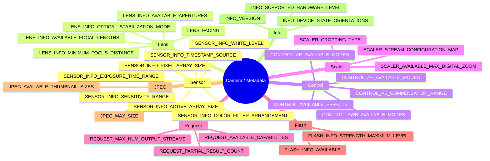

---
sidebar_position: 29
title: "Camera Metadata Encyclopedia"
description: Complete reference guide for all essential CameraCharacteristics metadata keys including Sensor, Lens, Control, Scaler, Request, Flash, JPEG, Statistics, and Info categories.
keywords: [CameraCharacteristics, CameraMetadata, Sensor, Lens, Control, Scaler, camera metadata reference]
---

import Tabs from '@theme/Tabs';
import TabItem from '@theme/TabItem';

# Camera Metadata Encyclopedia

## Companion App

Inspect every key in this encyclopedia live on your own device — install the Android Camera Parameters app:

- **GitHub (Open Source):** [github.com/zoozooll/AndroidCameraParameters](https://github.com/zoozooll/AndroidCameraParameters)
- **Google Play:** [play.google.com/store/apps/details?id=com.minininja.cameraparams](https://play.google.com/store/apps/details?id=com.minininja.cameraparams)

The app is a living implementation of every concept on this page. Every metadata entry below tells you exactly which tab and screen displays that value so you can cross-reference with a real device in your hand.

---

## Metadata Taxonomy



---

## Introduction

Welcome to the Camera Metadata Encyclopedia, the definitive reference for understanding the 300+ metadata keys that describe every capability of an Android camera device. If the previous chapters in this series taught you *how* to operate Camera2 — opening sessions, building requests, streaming surfaces — this encyclopedia teaches you *what* your camera is actually capable of doing. Every feature you enable in a `CaptureRequest.Builder` must first be validated against `CameraCharacteristics`. Skip this validation and your app will crash on a certain percentage of devices, or worse, silently produce corrupted output.

This encyclopedia exists because Camera2 metadata is notoriously under-documented in the official Android SDK reference. The documentation tells you the type of each key (a `Range&lt;Int&gt;`, a `FloatArray`, etc.) but rarely tells you the *semantics*: what a "diopter" means in practice, why an active array size differs from a pixel array size, or which sequence of keys you must check together before exposing a manual-ISO button. The entries here bridge that gap with production-grade code, common OEM pitfalls, and real device behavior drawn from thousands of device profiles in the Android Camera Parameters database.

Think of this page as a lookup table for your camera application architecture. When you design a settings screen, go to the Control section. When you build a zoom UI, go to Scaler. When you write a RAW processing pipeline, go to Sensor. Every entry follows the same six-point structure so you can jump directly to the code you need without re-learning layout. The companion app on your phone then validates that the same queries work against real silicon from Samsung, Sony, HiSilicon, MediaTek, and Google Tensor.

No device supports every key in this encyclopedia. That is the entire point. The correct pattern for Camera2 development is: query the key → null-check the result → feature-gate the UI → document the fallback path. This page gives you the query, the check, and the pitfall you will hit if you skip it.

---

## How Camera2 Metadata is Organized

Camera2 metadata lives in three parallel class hierarchies, all rooted in `android.hardware.camera2.CameraMetadata`. The static description of what a camera *can* do lives in `CameraCharacteristics` — you query this exactly once per camera ID after discovering it via `CameraManager.getCameraIdList()`. The per-request description of what you *want* the camera to do lives in `CaptureRequest` — you populate keys via `CaptureRequest.Builder.set()`. The per-frame description of what the camera *actually did* lives in `CaptureResult` (or its total variant `TotalCaptureResult`) — you read keys from the callback in `CameraCaptureSession.CaptureCallback.onCaptureCompleted()`.

Every key in all three hierarchies extends `CaptureResult.Key<T>` (or its siblings `CameraCharacteristics.Key<T>` and `CaptureRequest.Key<T>`) and is a strongly-typed field descriptor. There are over 300 public keys across the three classes, plus additional OEM-private keys accessible via `CameraCharacteristics.get(CameraCharacteristics.REQUEST_AVAILABLE_SESSION_KEYS)` on certain vendor extensions. The categories in this encyclopedia follow the conceptual groupings used by the HAL3 interface specification: Sensor describes the imager, Lens describes the optics, Control describes the 3A (auto-exposure, auto-focus, auto-white-balance) algorithms, Scaler describes the crop-and-resize pipeline, Request describes cross-cutting capability flags, Flash describes the torch/flash LED, JPEG describes the still-image encoder, and Info describes the camera package and HAL version.

---

## Conventions Used in This Encyclopedia

Every metadata entry below follows exactly six sections:

1. **What is it?** A 1–2 paragraph definition of the key, its type, and its semantics.
2. **Why does it exist?** The design rationale that led Android engineers to expose this key rather than deriving the value implicitly.
3. **Which devices support it?** The minimum hardware level, capability flags, and Android version where this key becomes meaningful.
4. **How do I query it?** A complete Kotlin code snippet with null-safety, showing the exact `characteristics.get()` call plus error handling.
5. **How can I inspect it with Android Camera Parameters?** The exact tab hierarchy in the companion app where you can see this value rendered on a device.
6. **Common pitfalls.** One or more real-world issues developers hit, usually involving OEM fragmentation, hidden state coupling between keys, or misunderstanding of units.

Code snippets use idiomatic Kotlin with nullable-safe operators (`?.`) and the Elvis operator (`?:`) plus `run` blocks for fallback. All snippets assume you already hold a `CameraCharacteristics` instance named `characteristics` obtained via `cameraManager.getCameraCharacteristics(cameraId)`. Snippets that produce user-visible output use string formatting with units (diopters, nanoseconds, EV steps) so you can drop them directly into a `PreferenceScreen` or a `TextView` debug overlay.

The companion app references always use the same pattern: *Tab Name / Sub-tab Name*. For example "Overview / Hardware Level" means: open the app, tap the Overview tab in the bottom navigation, then look for the Hardware Level card. If a key appears in multiple screens we list the canonical primary location first.

---

## Sensor Category

### SENSOR_INFO_ACTIVE_ARRAY_SIZE

**1. What is it?**

`SENSOR_INFO_ACTIVE_ARRAY_SIZE` is a `android.graphics.Rect` describing the pixel coordinates of the active imaging area within the full sensor die. In practice this is the largest rectangle of pixels that can actually be read out and delivered to an output stream. The rectangle is always axis-aligned and expressed in pixel-coordinate space where `(0,0)` is the top-left corner of the full pixel array. Typical values look like `Rect(0, 0, 8000, 6000)` for an 8K×6K sensor, or `Rect(120, 160, 3880, 2880)` when the sensor manufacturer leaves a small inactive border (optically-black pixels) around the edge.

Every output stream you configure — whether JPEG, YUV_420_888, RAW, or a preview SurfaceTexture — is ultimately cropped from this active area. When you request a 4:3 JPEG at 12MP the camera ISP crops the active array to 4:3 aspect ratio and scales down. When you apply digital zoom via `SCALER_CROP_REGION`, that crop region is itself cropped relative to the active array, not the pixel array.

**2. Why does it exist?**

Sensor dies always contain more physical photodiodes than are delivered to the ISP pipeline. The outermost rows and columns are "dummy" or "optically black" pixels used for dark-current calibration and lens-shading correction — not real picture data. Without `SENSOR_INFO_ACTIVE_ARRAY_SIZE` developers would have no way to know which coordinate system to use for `SCALER_CROP_REGION` or face-based crop tracking. Camera1 used to hide this distinction entirely, which made digital-zoom math inconsistent across OEMs. Camera2 exposes it explicitly so crop regions can be calculated with pixel-perfect precision.

**3. Which devices support it?**

All Camera2 devices support this key at all hardware levels: LEGACY, LIMITED, FULL, and LEVEL_3. It is listed in `CameraCharacteristics.getAvailableCaptureResultKeys()` for every camera ID, including external USB cameras. The rect is always non-empty and its width/height never exceed `SENSOR_INFO_PIXEL_ARRAY_SIZE`.

**4. How do I query it?**

```kotlin
val activeArray: Rect? = characteristics.get(
    CameraCharacteristics.SENSOR_INFO_ACTIVE_ARRAY_SIZE
)

activeArray?.let { rect ->
    val widthPx = rect.width()
    val heightPx = rect.height()
    val megapixels = (widthPx * heightPx) / 1_000_000.0
    Log.d(TAG, "Active array: ${widthPx}×${heightPx}px (%.1f MP)".format(megapixels))
    Log.d(TAG, "  Left=${rect.left}, Top=${rect.top}, Right=${rect.right}, Bottom=${rect.bottom}")
} ?: run {
    Log.w(TAG, "Active array size not available on this device")
}
```

**5. How can I inspect it with Android Camera Parameters?**

Navigate to **Sensor / Sensor Info**. The active array is rendered as the second line of the "Sensor Geometry" card, below the pixel array size. The companion app also draws the active array rectangle visually superimposed on a scaled representation of the pixel array, so you can see at a glance how much of the physical die is actually usable.

**6. Common pitfalls**

The single biggest mistake is querying `SENSOR_INFO_PIXEL_ARRAY_SIZE` and then expecting JPEG output at that resolution. Full-size still images always use the active array dimensions, never the pixel array. On a typical 50MP Samsung ISOCELL sensor the pixel array might be 8192×6144 but the active array is 8000×6000. If you allocate a 50.3MP buffer (from pixel array) you get a 48MP image and the remaining pixels are silently dropped, or worse, you get a corrupted buffer on legacy HAL devices. Always use `activeArray.width() * activeArray.height()` for buffer sizing, never the pixel array product. The second common pitfall is using active array coordinates without including the offset: when the rect top/left are non-zero, your crop-region math must add that origin or the zoom drifts toward the top-left.

---

### SENSOR_INFO_PIXEL_ARRAY_SIZE

**1. What is it?**

`SENSOR_INFO_PIXEL_ARRAY_SIZE` is a `android.util.Size` representing the total number of physical photodiodes on the sensor die, including any optically-black or dummy border pixels. This is the "marketing megapixel" number: a 108MP sensor advertises pixel array dimensions of 12000×9000 regardless of how many are actually delivered to the ISP pipeline. Type-wise it is a simple `Size` with `.width` and `.height` fields.

The relationship to the active array is always:
- `pixelArray.width >= activeArray.width`
- `pixelArray.height >= activeArray.height`

The difference is typically 100–400 pixels on each axis, used for optical black (OB) lines and factory lens-shading calibration.

**2. Why does it exist?**

RAW capture pipelines need the full pixel dimensions to parse RAW10/RAW12/RAW16 buffers correctly, because the RAW format (when `SENSOR_INFO_PRE_CORRECTION_ACTIVE_ARRAY_SIZE` is not available) sometimes includes the OB lines. Developers writing custom demosaic or dark-frame subtraction code also need to know how many pixels on each border to strip before processing. On the consumer-facing side, marketing teams and benchmark apps use pixel array size to report "true" sensor resolution without the OEM's ISP crop.

**3. Which devices support it?**

All hardware levels expose this key. There is no capability flag prerequisite. RAW-capable devices (those advertising `REQUEST_AVAILABLE_CAPABILITIES_RAW`) are required by the Camera2 CDD to report pixel array size accurate to within one row/column of the physical sensor specification.

**4. How do I query it?**

```kotlin
val pixelArray: Size? = characteristics.get(
    CameraCharacteristics.SENSOR_INFO_PIXEL_ARRAY_SIZE
)

pixelArray?.let { size ->
    val mp = (size.width * size.height) / 1_000_000.0
    Log.d(TAG, "Pixel array: ${size.width}×${size.height}px (%.1f MP marketing)".format(mp))
    
    characteristics.get(CameraCharacteristics.SENSOR_INFO_ACTIVE_ARRAY_SIZE)?.let { active ->
        val usablePct = (active.width() * active.height()).toDouble() /
                        (size.width * size.height).toDouble() * 100.0
        Log.d(TAG, "  %.1f%% of pixels are deliverable via active array".format(usablePct))
    }
} ?: run {
    Log.w(TAG, "Pixel array size not available")
}
```

**5. How can I inspect it with Android Camera Parameters?**

Open **Sensor / Sensor Info** and look at the first entry in the "Sensor Geometry" card, labeled "Pixel Array". The app renders it as width×height with the marketing megapixel count in parentheses (e.g. "8192 × 6144 (50.3 MP)"). If you tap the row a dialog opens with a comparison table of pixel array vs. active array vs. pre-correction active array.

**6. Common pitfalls**

Confusing pixel array with deliverable JPEG size is universal among first-time Camera2 developers. The sequence is always: (1) query `SCALER_STREAM_CONFIGURATION_MAP.getOutputSizes(ImageFormat.JPEG)` to get the *actual* resolutions the encoder can produce, (2) the largest JPEG size will equal (or be a scaled crop of) `SENSOR_INFO_ACTIVE_ARRAY_SIZE`, never the pixel array. If you write code that computes a 4:3 crop from pixel array dimensions, the result will be slightly wider than what the ISP can actually deliver, and the camera device will silently clamp it — introducing subtle pixel drift in face-tracking zoom. Second, on reprocessing-capable devices that advertise `REQUEST_AVAILABLE_CAPABILITIES_PRIVATE_REPROCESSING`, the reprocessing input size uses pixel array semantics; using active array for reprocessing causes frame-alignment errors.

---

### SENSOR_INFO_SENSITIVITY_RANGE

**1. What is it?**

`SENSOR_INFO_SENSITIVITY_RANGE` is a `android.util.Range&lt;Int&gt;` specifying the minimum and maximum ISO (analog gain) values the sensor can apply *during raw readout*. Units are ISO arithmetic: 100 is base ISO (cleanest image, lowest noise), 6400 or higher is high-sensitivity mode (noisier image, shorter shutter time for the same EV). Typical ranges on modern devices are `[100, 6400]` for mid-range phones and `[50, 12800]` or `[32, 25600]` for flagship sensors with large pixel wells.

Sensitivity is applied *before* any digital gain in the ISP pipeline. The values returned here correspond to what you set in `CaptureRequest.SENSOR_SENSITIVITY` when manual control is enabled.

**2. Why does it exist?**

Every CMOS sensor has a physical minimum gain level (determined by the readout amplifier) and a maximum level (determined by how much the analog signal can be amplified before clipping or unacceptable noise). Without an explicit range, each OEM would use different implicit defaults. Camera2 exposes the range so that manual-exposure UI sliders can have correct min/max endpoints, and so developers can validate a manual ISO request *before* submitting it to the capture session — avoiding the vague `IllegalArgumentException` the session throws if you request out-of-range values.

**3. Which devices support it?**

All devices expose this key as a `Range&lt;Int&gt;`. However, the values are only *controllable* if the device advertises `REQUEST_AVAILABLE_CAPABILITIES_MANUAL_SENSOR` in its capability list. On LIMITED-level devices without that flag, the range will still return values (typically `[100, 800]`) but setting `SENSOR_SENSITIVITY` in a CaptureRequest is ignored — the AE algorithm remains in charge. Always feature-gate manual ISO UI on the MANUAL_SENSOR flag, not on the range being non-null.

**4. How do I query it?**

```kotlin
val sensitivityRange: Range<Int>? = characteristics.get(
    CameraCharacteristics.SENSOR_INFO_SENSITIVITY_RANGE
)

val capabilities: IntArray? = characteristics.get(
    CameraCharacteristics.REQUEST_AVAILABLE_CAPABILITIES
)
val hasManualSensor = capabilities?.contains(
    CameraCharacteristics.REQUEST_AVAILABLE_CAPABILITIES_MANUAL_SENSOR
) ?: false

sensitivityRange?.let { range ->
    Log.d(TAG, "Sensitivity range: ISO ${range.lower} to ISO ${range.upper}")
    Log.d(TAG, "  Manual ISO control available: $hasManualSensor")
    
    if (hasManualSensor) {
        val stopCount = log2(range.upper.toDouble() / range.lower.toDouble())
        Log.d(TAG, "  Dynamic range: %.1f stops".format(stopCount))
    } else {
        Log.w(TAG, "  WARNING: Range reported but MANUAL_SENSOR flag is ABSENT.")
        Log.w(TAG, "  Setting SENSOR_SENSITIVITY will be IGNORED by AE algorithm!")
    }
} ?: run {
    Log.w(TAG, "Sensitivity range not available")
}
```

**5. How can I inspect it with Android Camera Parameters?**

Navigate to **Sensor / Manual Sensor** where the sensitivity range appears as "ISO Range" in the first card. On devices with MANUAL_SENSOR capability the range is shown with a slider preview indicating what the manual UI exposes. On non-manual devices the app explicitly marks the range as "Read Only" and displays a warning banner explaining that values are for informational purposes only.

**6. Common pitfalls**

The first pitfall: seeing a valid sensitivity range and enabling manual ISO controls without checking `MANUAL_SENSOR`. This works on the developer's test device (a Pixel 8, say, which has FULL hardware level) but the slider silently does nothing on 60% of mid-range phones in the field. The user sees the UI, drags the slider, sees no noise difference, and leaves a one-star review. Always check both keys together.

The second pitfall: units confusion. `SENSOR_SENSITIVITY` uses ISO *arithmetic*, not logarithmic. A slider that goes from 100 to 6400 *linearly* makes the top 75% of the track feel identical (6400 to 3200 is one stop, 3200 to 1600 is another stop, ..., 200 to 100 is the last stop) while the bottom 25% covers 6 stops. Correct sliders interpolate values using a logarithmic scale so each 10% of track equals roughly one stop.

---

### SENSOR_INFO_EXPOSURE_TIME_RANGE

**1. What is it?**

`SENSOR_INFO_EXPOSURE_TIME_RANGE` is a `android.util.Range&lt;Long&gt;` specifying the minimum and maximum shutter duration the sensor can expose a single frame for, measured in **nanoseconds**. Every value in this range corresponds to a valid argument for `CaptureRequest.SENSOR_EXPOSURE_TIME` when manual sensor control is enabled. Typical ranges span from roughly `Range(1_000_000L, 1_000_000_000L)` (1 millisecond minimum up to 1 second maximum) on mid-range devices, up to `Range(100_000L, 10_000_000_000L)` (0.1 ms to 10 seconds) on flagship FULL-level devices with dedicated night-mode support. A few LEVEL_3 cinema-grade external cameras go up to 30 seconds or longer.

The conversion between nanoseconds and common time units is:
- 1 microsecond = 1,000 ns
- 1 millisecond = 1,000,000 ns
- 1 second = 1,000,000,000 ns

**2. Why does it exist?**

The Camera HAL needs an explicit shutter-time contract with the application layer for two reasons. First, long exposures interact with `SENSOR_FRAME_DURATION` in non-obvious ways: if you request a 5-second exposure, the minimum frame duration jumps to 5 seconds plus sensor blanking, which means preview callbacks stop arriving for 5 seconds and the UI appears frozen. Second, the very shortest exposures (microseconds) interact with the rolling-shutter skew of the sensor; below the minimum exposure time the sensor's readout timing can't keep up and output frames contain corrupted scan lines.

**3. Which devices support it?**

Like sensitivity range, this key is present on all devices but only *controllable* when `MANUAL_SENSOR` is in the capability list. LIMITED devices that lack manual-sensor support will still report a plausible exposure range (usually 1 ms to 1/30 s) so that AE-timing analysis tools can reason about the AE algorithm's behavior, but manual settings are ignored. Full manual control requires both the range *and* the capability flag.

**4. How do I query it?**

```kotlin
fun Long.nanosToSeconds(): Double = this / 1_000_000_000.0
fun Long.nanosToMillis(): Double = this / 1_000_000.0
fun Double.secondsToNanos(): Long = (this * 1_000_000_000.0).toLong()

val exposureRange: Range<Long>? = characteristics.get(
    CameraCharacteristics.SENSOR_INFO_EXPOSURE_TIME_RANGE
)

val hasManualSensor = characteristics.get(
    CameraCharacteristics.REQUEST_AVAILABLE_CAPABILITIES
)?.contains(CameraCharacteristics.REQUEST_AVAILABLE_CAPABILITIES_MANUAL_SENSOR) ?: false

exposureRange?.let { range ->
    Log.d(TAG, "Exposure time range:")
    Log.d(TAG, "  Min: ${range.lower} ns = %.4f ms = %.7f s"
        .format(range.lower.nanosToMillis(), range.lower.nanosToSeconds()))
    Log.d(TAG, "  Max: ${range.upper} ns = %.2f ms = %.4f s"
        .format(range.upper.nanosToMillis(), range.upper.nanosToSeconds()))
    Log.d(TAG, "  Manual shutter control available: $hasManualSensor")
    
    val shutterSpeeds = listOf(
        0.001, 0.002, 0.004, 0.008, 0.016, 0.033,
        0.066, 0.125, 0.25, 0.5, 1.0, 2.0, 4.0, 8.0
    )
    val supportedSpeeds = shutterSpeeds.filter { s ->
        val ns = s.secondsToNanos()
        ns >= range.lower && ns <= range.upper
    }
    Log.d(TAG, "  Supported common stops: $supportedSpeeds seconds")
} ?: run {
    Log.w(TAG, "Exposure time range not available")
}
```

**5. How can I inspect it with Android Camera Parameters?**

Go to **Sensor / Manual Sensor** card, titled "Exposure Range". The app shows the value three ways: raw nanoseconds, milliseconds, and seconds for both endpoints. A horizontal timeline below visualizes the range with common shutter-speed stops (1/1000 s through 8 s) marked as ticks, so you can see at a glance whether long-exposure night photography is possible. Manual control capability is indicated by a green checkmark (controllable) or red "read-only" label.

**6. Common pitfalls**

The preview-freeze pitfall: developers set a 4-second exposure for a low-light still capture but forget that the same `CaptureRequest` applies to ALL surfaces in the session, including the preview `SurfaceTexture`. Result: for 4 seconds, no preview frames arrive, the screen freezes, and the user thinks the app crashed. The fix is a single-frame repeating request for the preview surface at normal 30 fps, then a separate `setRepeatingBurst` or `capture` call with the long exposure applied only to the JPEG/RAW surfaces via `CaptureRequest.Builder.addTarget()`.

The second pitfall is integer overflow in conversions. Multiplication and division with `1_000_000_000` pushes against the 32-bit integer limit. Always use `Long` (64-bit) for any variable that holds nanoseconds, and write explicit helper extension functions (like `nanosToSeconds()` above) so you never divide in the wrong order. A 1-second exposure stored as an Int overflows at roughly 2.1 seconds, causing the HAL to receive a negative exposure time, which either crashes the session or clamps silently to minimum on certain MediaTek HALs.

---

### SENSOR_INFO_WHITE_LEVEL

**1. What is it?**

`SENSOR_INFO_WHITE_LEVEL` is a single `Int` representing the maximum analog-to-digital converter (ADC) code value that a RAW sensor pixel can reach before clipping. For a RAW10 sensor (10 bits per pixel per channel) the white level is typically 1023 (2¹⁰−1). For RAW12 it is typically 4095. For RAW14 it is typically 16383. Some sensors round down slightly (e.g. 16300 instead of 16383 for RAW14) to leave headroom for HDR highlights or pixel-defect correction; the exact value is sensor-calibrated at the factory.

This is the per-channel saturation value. In any RAW frame from this sensor, any pixel channel at (or above) the white level represents blown-out highlights with no recoverable detail.

**2. Why does it exist?**

The RAW pixel format always uses the same bit depth per channel. A RAW10 buffer stores every pixel in 16-bit aligned integers, and developers unfamiliar with RAW processing naturally divide by 65535 (the max 16-bit value) when normalizing to floating point. This produces images that are dim, washed-out, and with incorrect black point subtraction. `SENSOR_INFO_WHITE_LEVEL` gives you the correct divisor: divide RAW pixels by `WHITE_LEVEL - BLACK_LEVEL_PATTERN` (not 65535) to get the 0.0–1.0 linear light range. Every RAW sensor also has a `SENSOR_BLACK_LEVEL_PATTERN` key giving the per-channel zero-exposure offset; combining the two gives you the full RAW-to-float normalization curve.

**3. Which devices support it?**

This key is required on any device that reports `REQUEST_AVAILABLE_CAPABILITIES_RAW` in its capability list — i.e. any camera that can output RAW10/RAW12/RAW16 buffers via `ImageReader`. On non-RAW devices the key may still be present (returning a nominal value matching the sensor's native bit depth) but there is no way to read RAW pixels, so the key is purely informational.

**4. How do I query it?**

```kotlin
val whiteLevel: Int? = characteristics.get(
    CameraCharacteristics.SENSOR_INFO_WHITE_LEVEL
)

val blackLevelPattern: IntArray? = characteristics.get(
    CameraCharacteristics.SENSOR_BLACK_LEVEL_PATTERN
)

whiteLevel?.let { wl ->
    Log.d(TAG, "SENSOR_INFO_WHITE_LEVEL = $wl")
    
    val bits = ceil(log2(wl.toDouble() + 1.0)).toInt()
    Log.d(TAG, "  Effective RAW bit depth: $bits bits per channel")
    Log.d(TAG, "  Largest RAW pixel value (saturation): $wl")
    
    blackLevelPattern?.let { bl ->
        if (bl.size == 4) {
            Log.d(TAG, "  Black level pattern (R, Gr, Gb, B) = [${bl[0]}, ${bl[1]}, ${bl[2]}, ${bl[3]}]")
            val avgBlack = (bl[0] + bl[1] + bl[2] + bl[3]) / 4.0
            val usableDnRange = wl - avgBlack
            val stops = log2(usableDnRange / avgBlack)
            Log.d(TAG, "  Normalization divisor: ${wl - avgBlack.toInt()}")
            Log.d(TAG, "  Estimated RAW dynamic range: %.1f stops".format(stops))
        }
    } ?: run {
        Log.d(TAG, "  No black-level pattern. Assume 0. Normalize by $wl directly.")
    }
} ?: run {
    Log.w(TAG, "White level not available — RAW output may not be supported")
}
```

**5. How can I inspect it with Android Camera Parameters?**

The white level is in **Sensor / Sensor Info** under the "RAW Sensor Parameters" card, next to black level pattern and color filter arrangement. If RAW capability is present the companion app shows a live preview of a horizontal gradient bar normalized correctly with the device's own white level, so you can visually compare the correct normalization (using the key) against the common mistake of dividing by 65535 — the mistaken version appears visibly darker.

**6. Common pitfalls**

Normalizing by 65535 instead of white level is the universal first mistake in RAW processing. A RAW10 photo normalized by 65535 comes out at roughly 1/64th brightness — nearly pure black. Developers notice this and apply a 64× gain multiplier to compensate, which introduces banding because they're stretching 10 bits of information into 16 bits of precision, compressing the tonal range. Correct code subtracts the black level first, then divides by (white level minus black level). This gives a properly-exposed linear light image ready for gamma and tone-mapping.

A second pitfall: white level can vary *per frame* on certain HDR sensors, where the ADC gain changes between long and short exposures for staggered-HDR readout. Check `CaptureResult.SENSOR_DYNAMIC_WHITE_LEVEL` in each `onCaptureCompleted` callback on Android 13+ devices; use the per-frame value when available instead of the static `CameraCharacteristics` constant. Sticky caching of the static white level on HDR sensors produces clipped highlights on the short-exposure frame.

---

### SENSOR_INFO_COLOR_FILTER_ARRANGEMENT

**1. What is it?**

`SENSOR_INFO_COLOR_FILTER_ARRANGEMENT` is an `Int` enum describing the layout of the Bayer color filter array (CFA) on top of the sensor's photodiodes. The CFA is the microscopic color mosaic that gives each pixel a red, green, or blue color sensitivity (two green pixels per 2×2 block). Possible values are:
- `SENSOR_INFO_COLOR_FILTER_ARRANGEMENT_RGGB` — the most common (top row Red-Green, second row Green-Blue)
- `SENSOR_INFO_COLOR_FILTER_ARRANGEMENT_GRBG` — green-red / blue-green variant
- `SENSOR_INFO_COLOR_FILTER_ARRANGEMENT_BGGR` — blue-green / green-red variant (common on Sony sensors)
- `SENSOR_INFO_COLOR_FILTER_ARRANGEMENT_GBRG` — green-blue / red-green variant
- `SENSOR_INFO_COLOR_FILTER_ARRANGEMENT_MONOCHROME` — no color filter, pure luminance sensor (infrared or dedicated night-vision cameras)

The arrangement describes the (x=0, y=0) top-left pixel of the active array. Every 2×2 block repeats this pattern across the entire sensor surface.

**2. Why does it exist?**

RAW sensor data is monochrome-by-nature. A demosaic algorithm must be applied to reconstruct a full RGB image by interpolating the missing two color channels for each pixel. The demosaic algorithm *must* know which color is at each physical location. If you run an RGGB demosaic on a BGGR sensor you get an image with inverted colors: red pixels become blue, blue become red, and the human eye immediately notices the wrong skin tones. Demosaic quality is also CFA-dependent — adaptive algorithms like AMaZE or LMMSE need the exact arrangement to pick the correct interpolation direction.

**3. Which devices support it?**

Required on all RAW-capable devices. On devices without RAW output the key may still be present (allowing analytical tools to describe sensor construction) but there's no code path that *needs* the value. External USB cameras via the EXTERNAL hardware level sometimes omit this key; you must fall back to a `SENSOR_INFO_COLOR_FILTER_ARRANGEMENT_RGGB` default, because USB UVC cameras almost universally use RGGB.

**4. How do I query it?**

```kotlin
val cfa: Int? = characteristics.get(
    CameraCharacteristics.SENSOR_INFO_COLOR_FILTER_ARRANGEMENT
)

cfa?.let { arrangement ->
    val arrangementName = when (arrangement) {
        CameraCharacteristics.SENSOR_INFO_COLOR_FILTER_ARRANGEMENT_RGGB -> "RGGB"
        CameraCharacteristics.SENSOR_INFO_COLOR_FILTER_ARRANGEMENT_GRBG -> "GRBG"
        CameraCharacteristics.SENSOR_INFO_COLOR_FILTER_ARRANGEMENT_BGGR -> "BGGR"
        CameraCharacteristics.SENSOR_INFO_COLOR_FILTER_ARRANGEMENT_GBRG -> "GBRG"
        CameraCharacteristics.SENSOR_INFO_COLOR_FILTER_ARRANGEMENT_MONOCHROME -> "MONOCHROME"
        else -> "UNKNOWN (value=$arrangement)"
    }
    Log.d(TAG, "Color Filter Arrangement = $arrangementName")
    
    val isMono = arrangement == CameraCharacteristics
        .SENSOR_INFO_COLOR_FILTER_ARRANGEMENT_MONOCHROME
    
    Log.d(TAG, "  Is monochrome sensor: $isMono")
    if (isMono) {
        Log.d(TAG, "  Demosaic: NOT REQUIRED. Pixels are already luminance-only.")
        Log.d(TAG, "  Tip: Skip de-Bayer step. Directly treat RAW as grayscale.")
    } else {
        Log.d(TAG, "  Demosaic: REQUIRED. Use CFA '$arrangementName' in RAW decoder.")
        Log.d(TAG, "  Pixel (0,0) channel: " + when (arrangement) {
            CameraCharacteristics.SENSOR_INFO_COLOR_FILTER_ARRANGEMENT_RGGB -> "Red"
            CameraCharacteristics.SENSOR_INFO_COLOR_FILTER_ARRANGEMENT_GRBG -> "Green (Red row)"
            CameraCharacteristics.SENSOR_INFO_COLOR_FILTER_ARRANGEMENT_BGGR -> "Blue"
            CameraCharacteristics.SENSOR_INFO_COLOR_FILTER_ARRANGEMENT_GBRG -> "Green (Blue row)"
            else -> "?"
        })
    }
} ?: run {
    Log.w(TAG, "No CFA info. Defaulting to RGGB for external USB / legacy devices.")
}
```

**5. How can I inspect it with Android Camera Parameters?**

Open **Sensor / Sensor Info** and look at the "Color Filter Array" row in the RAW Sensor Parameters card. The app renders a 4×4 pixel visual representation of the mosaic using the actual arrangement reported by the sensor — red, green, and blue squares tiled the way the silicon sees them. Monochrome sensors are rendered as a flat gray grid with the label "NO CFA".

**6. Common pitfalls**

The hard failure mode is hardcoding RGGB demosaic. Every Sony Exmor-RS sensor on the market ships with BGGR, so if you hardcode RGGB your code works on the Samsung ISOCELL phone you tested with and produces a color-inverted image on every Xperia, most Pixels, and all iPhones running Android (if such a thing existed). The fix is straightforward: read the key and branch your demosaic. Many open-source RAW libraries (libraw, OpenImageIO) accept a CFA enum directly, so map the Android CFA value to the library constant and pass it through.

The second pitfall: `SENSOR_INFO_COLOR_FILTER_ARRANGEMENT` describes the active array top-left pixel. If you crop the RAW buffer (say, to extract a 1000×1000 region for face processing), the CFA pattern *shifts* by (crop.left mod 2, crop.top mod 2). Cropping one pixel right converts an RGGB pattern to GRBG in the cropped sub-image. Cropping both one right and one down converts RGGB to BGGR. Most developers forget this and demosaic the crop with the original pattern, producing a high-frequency color moiré that looks like a demosaic bug but is actually a coordinate bug. Fix by adjusting the CFA for the crop parity or by always cropping on even boundaries.

---

## Lens Category

### LENS_FACING

**1. What is it?**

`LENS_FACING` is an `Int` enum describing the physical mounting direction of the camera module relative to the device screen. The three possible values are:
- `LENS_FACING_BACK` — camera points away from the user (the "main" camera, used for landscape photography)
- `LENS_FACING_FRONT` — camera points toward the user (selfie camera, always mounted in the screen bezel or notch)
- `LENS_FACING_EXTERNAL` — USB webcam, HDMI capture card, or other hot-pluggable camera with unknown orientation

This key is static per camera ID; it never changes during the lifetime of a device (foldables excepted — see `INFO_DEVICE_STATE_ORIENTATIONS` for dynamic state).

**2. Why does it exist?**

The most visible impact of facing is in the preview transform. Android requires that the back-facing camera preview rotate with the device orientation using the sensor's natural landscape orientation plus `SENSOR_ORIENTATION`; for the front-facing camera the preview must also be **mirrored horizontally** so the user sees themselves as though looking in a mirror. Without a facing key each application would have to guess which camera is which using heuristics (first ID = back, second = front) which break on multi-camera devices where IDs 0, 1, 2, 3 are all back-facing.

**3. Which devices support it?**

Every camera ID on every device reports this key. It is impossible to enumerate a valid camera ID via `CameraManager.getCameraIdList()` that does not have `LENS_FACING` populated. Even LEGACY-level Camera1-wrapped devices expose it. External USB cameras get `LENS_FACING_EXTERNAL` by default.

**4. How do I query it?**

```kotlin
val facing: Int? = characteristics.get(
    CameraCharacteristics.LENS_FACING
)

facing?.let { f ->
    val (name, emoji) = when (f) {
        CameraCharacteristics.LENS_FACING_BACK -> "Back" to "📷"
        CameraCharacteristics.LENS_FACING_FRONT -> "Front" to "🤳"
        CameraCharacteristics.LENS_FACING_EXTERNAL -> "External" to "🔌"
        else -> "Unknown ($f)" to "❓"
    }
    Log.d(TAG, "LENS_FACING = $name $emoji")
    
    val sensorOrientation = characteristics.get(
        CameraCharacteristics.SENSOR_ORIENTATION
    ) ?: 0
    
    Log.d(TAG, "  Sensor orientation (natural rotation): $sensorOrientation°")
    
    val totalDisplayRotation = when (f) {
        CameraCharacteristics.LENS_FACING_FRONT -> {
            (sensorOrientation + displayRotation) % 360
            (360 - ((sensorOrientation + displayRotation) % 360)) % 360
        }
        CameraCharacteristics.LENS_FACING_BACK,
        CameraCharacteristics.LENS_FACING_EXTERNAL -> {
            (sensorOrientation + displayRotation) % 360
        }
        else -> displayRotation
    }
    Log.d(TAG, "  Calculated display rotation: $totalDisplayRotation°")
    Log.d(TAG, "  Front camera: MUST horizontally mirror preview TextureView/SurfaceView")
} ?: run {
    Log.e(TAG, "LENS_FACING is null — this should never happen on a valid camera ID")
}
```

**5. How can I inspect it with Android Camera Parameters?**

Navigate to **Overview / Cameras**. The first card lists every camera ID as a row, showing facing, sensor orientation, megapixel count, and hardware level in compact form. Front cameras have a "🤳" badge, back cameras have "📷", and external USB cameras show "🔌". Tapping any camera row opens the detail view where facing is shown as the first metadata field.

**6. Common pitfalls**

The selfie mirroring pitfall is universal: developers correctly mirror the preview `TextureView` for a natural "looking in a mirror" experience, but then capture the JPEG via `ImageReader` and wonder why the photo is *not* mirrored. The mirroring is a **display-only transform** applied to the preview surface. The actual sensor pixels (and therefore the JPEG bytes) are never mirrored. Users hate this: "My selfies look flipped!" The fix is to write the horizontal flip into the JPEG's EXIF orientation tag using `ExifInterface`. Set `TAG_ORIENTATION` to `ORIENTATION_FLIP_HORIZONTAL` for front cameras. Most gallery apps respect this flag and display the photo mirrored; photo editors do the same. If you truly need pixel-fliped output (for upload to a server that ignores EXIF), then post-process the `Bitmap` with `Canvas` and a horizontal `Matrix.preScale(-1f, 1f)` before saving.

A second pitfall: foldable devices with under-display cameras. The same logical camera ID can report `LENS_FACING_FRONT` when unfolded but the preview transform changes because the sensor orientation changes. See `INFO_DEVICE_STATE_ORIENTATIONS` in the Info section. Never cache `LENS_FACING` + `SENSOR_ORIENTATION` as a static pair — requery both when the device reports a configuration change.

---

### LENS_INFO_AVAILABLE_FOCAL_LENGTHS

**1. What is it?**

`LENS_INFO_AVAILABLE_FOCAL_LENGTHS` is a `FloatArray` listing the discrete optical focal lengths (in millimeters) that this camera can produce via physical lens movement or multi-camera switching. Single-camera devices report a one-element array like `[4.2]` meaning a 4.2 mm prime lens. Multi-camera logical devices (backing the same camera ID with multiple physical sensors) report an array like `[1.7, 5.0, 12.0]` meaning ultra-wide (1.7 mm), wide-angle (5.0 mm), and periscope telephoto (12.0 mm) options are available. Note this is **optical** focal length, not the 35mm-equivalent marketing number. To get 35mm-equivalent multiply by `LENS_INFO_AVAILABLE_FOCAL_LENGTHS[i] / SENSOR_INFO_PHYSICAL_SIZE.width`.

**2. Why does it exist?**

Focal length is the fundamental property that determines the angle of view of a photograph. The Camera2 zoom subsystem was redesigned for multi-camera devices to allow the framework to *seamlessly switch* between physical cameras as the user pinches to zoom. Without knowing which optical focal lengths are available, developers cannot design a zoom UI that highlights optical zoom "sweet spots" (1×, 3×, 5×) where the framework is using a real lens with no digital crop. This key lets you render a zoom bar with visual notches at each focal length.

**3. Which devices support it?**

All hardware levels. Single-camera devices always have a single-element array. Multi-camera capability (`REQUEST_AVAILABLE_CAPABILITIES_LOGICAL_MULTI_CAMERA`) is correlated with longer arrays, but not strictly required — some OEMs expose a multi-focal-length array via LEGACY-level camera wrapping. The array is guaranteed to be sorted in increasing order on compliant devices.

**4. How do I query it?**

```kotlin
val focalLengths: FloatArray? = characteristics.get(
    CameraCharacteristics.LENS_INFO_AVAILABLE_FOCAL_LENGTHS
)

val sensorSize: SizeF? = characteristics.get(
    CameraCharacteristics.SENSOR_INFO_PHYSICAL_SIZE
)

focalLengths?.let { fLengths ->
    Log.d(TAG, "Optical focal lengths (${fLengths.size} discrete values):")
    
    fLengths.sort()
    fLengths.forEachIndexed { index, mm ->
        Log.d(TAG, "  [$index] ${"%.2f".format(mm)}mm (optical)")
        
        sensorSize?.let { size ->
            val fullFrameDiagonalMm = 43.27
            val cropFactor = fullFrameDiagonalMm / hypot(size.width.toDouble(), size.height.toDouble())
            val equivalent35mm = mm * cropFactor
            val angleOfViewDeg = 2.0 * atan(size.width.toDouble() / (2.0 * mm.toDouble())) * 180.0 / Math.PI
            Log.d(TAG, "       35mm-equiv: ${"%.1f".format(equivalent35mm)}mm | " +
                       "AoV: ${"%.0f".format(angleOfViewDeg)}° | " +
                       "Crop: ${"%.2f".format(cropFactor)}×")
        }
    }
    
    if (fLengths.size > 1) {
        val zoomRatios = fLengths.map { it / fLengths[0] }
        Log.d(TAG, "  Optical zoom steps (relative to widest): " +
                   zoomRatios.joinToString("×, ") { "%.1f".format(it) } + "×")
    }
} ?: run {
    Log.w(TAG, "Available focal lengths array unavailable")
}
```

**5. How can I inspect it with Android Camera Parameters?**

Open **Lens / Lens Info**. The focal lengths appear as the "Focal Lengths" card showing each optical focal length with its 35mm-equivalent, angle of view, and crop factor. On multi-camera logical devices each focal length has a badge that says which physical camera ID backs it, and tapping renders a visual representation of the angle of view cone (the wider the angle, the wider the triangle diagram).

**6. Common pitfalls**

Focal length vs. focus distance: the most commonly confused pair in all of Camera2. `LENS_INFO_AVAILABLE_FOCAL_LENGTHS` (in mm) is the **optical property of the lens** — how wide or narrow the scene is. `LENS_FOCUS_DISTANCE` (in diopters, 1/m) is the **current AF position** — how far away the camera is focused. Setting `LENS_FOCAL_LENGTH` switches between physical cameras; setting `LENS_FOCUS_DISTANCE` moves the autofocus motor inside one lens. The two are orthogonal and independent. Developers often build one slider that tries to control both, with bizarre results.

Second pitfall: assuming the array is sorted. On most FULL-level devices it is, but on certain LEGACY wrappers from Xiaomi and Oppo the widest lens is the last element, not the first. Always call `fLengths.sort()` before computing zoom-step ratios. Computing ratio against the wrong element yields a 0.25× "zoom" that your UI cannot display correctly.

---

### LENS_INFO_MINIMUM_FOCUS_DISTANCE

**1. What is it?**

`LENS_INFO_MINIMUM_FOCUS_DISTANCE` is a single `Float` measured in **diopters (D)**, defined as the inverse of the closest focusable distance in meters. A value of `10.0` means the lens can focus on objects as close as 0.1 meters (10 cm). A value of `0.0` means the lens is fixed-focus ("focus free") — it cannot change its focus distance at all, because it is optimized for infinity. Most selfie cameras, budget phone cameras, and wide-angle front cameras are fixed-focus. Values of 20D or higher indicate a macro-capable module that can focus on objects touching the lens.

Diopters are mathematically convenient because they're linear in the lens equation: `1 / distance = 1 / focal_length + 1 / sensor_distance`. When you set `CaptureRequest.LENS_FOCUS_DISTANCE` to a value, the HAL interprets it as a diopter.

**2. Why does it exist?**

Without a minimum focus distance, there is no programmatic way to know whether a camera is even capable of manual focus. If you show a manual focus slider on a fixed-focus camera (0.0 diopters) the slider's movement produces zero change in the image — confusing users. The key also defines the valid range of the `LENS_FOCUS_DISTANCE` request parameter: valid values always span `[0.0, minimum_focus_distance]` (infinity to closest-focus). For macro photography you know exactly how close you can get before the image goes soft.

**3. Which devices support it?**

Exposed on all devices, but meaningful only when combined with manual control. The `MANUAL_SENSOR` capability flag (again) determines whether setting `LENS_FOCUS_DISTANCE` actually changes the lens. LIMITED-level devices may report `LENS_INFO_MINIMUM_FOCUS_DISTANCE = 10.0` but if `MANUAL_SENSOR` is absent, writing `LENS_FOCUS_DISTANCE` in a capture request is silently ignored by the AF system. LEGACY-wrapped devices sometimes report `0.0` even though the physical module *can* focus — this is a known LEGACY wrapper limitation.

**4. How do I query it?**

```kotlin
val minFocusDiopters: Float? = characteristics.get(
    CameraCharacteristics.LENS_INFO_MINIMUM_FOCUS_DISTANCE
)

val hasManualSensor = characteristics.get(
    CameraCharacteristics.REQUEST_AVAILABLE_CAPABILITIES
)?.contains(CameraCharacteristics.REQUEST_AVAILABLE_CAPABILITIES_MANUAL_SENSOR) ?: false

minFocusDiopters?.let { d ->
    Log.d(TAG, "LENS_INFO_MINIMUM_FOCUS_DISTANCE = %.2f D (diopters)".format(d))
    
    val closestFocusMeters = if (d > 0.0f) (1.0 / d.toDouble()) else Double.POSITIVE_INFINITY
    val closestFocusCm = if (d > 0.0f) (100.0 / d.toDouble()) else Double.POSITIVE_INFINITY
    
    when {
        d == 0.0f -> {
            Log.d(TAG, "  Lens type: FIXED-FOCUS (cannot change focus at all)")
            Log.d(TAG, "  Closest focus: effectively infinity (landscape only)")
            Log.d(TAG, "  UI action: HIDE manual focus slider entirely.")
        }
        d < 2.0f -> {
            Log.d(TAG, "  Lens type: Soft-focusable (close focus is ~${"%.0f".format(closestFocusCm)} cm)")
            Log.d(TAG, "  UI: Show slider but user won't see much change.")
        }
        d >= 2.0f && d < 10.0f -> {
            Log.d(TAG, "  Lens type: Standard focus (closest ~${"%.0f".format(closestFocusCm)} cm)")
        }
        d >= 10.0f && d < 20.0f -> {
            Log.d(TAG, "  Lens type: Close-focus capable (closest ~${"%.0f".format(closestFocusCm)} cm)")
        }
        else -> {
            Log.d(TAG, "  Lens type: MACRO capable (closest ${"%.1f".format(closestFocusCm)} cm!)")
        }
    }
    
    if (hasManualSensor) {
        Log.d(TAG, "  Manual focus: CONTROLLABLE via CaptureRequest.LENS_FOCUS_DISTANCE")
        Log.d(TAG, "  Valid range: [0.0 (∞) → %.2f D (${"%.0f".format(closestFocusCm)} cm)]".format(d))
    } else {
        Log.w(TAG, "  WARNING: Lens reports focus range but MANUAL_SENSOR absent.")
        Log.w(TAG, "  Manual focus slider would do nothing. Hide it.")
    }
} ?: run {
    Log.w(TAG, "Minimum focus distance not available")
}
```

**5. How can I inspect it with Android Camera Parameters?**

Look in **Lens / Lens Info** under "Minimum Focus Distance". The app renders the value three ways: raw diopters, closest distance in centimeters, and closest distance in inches, so you can immediately tell if a camera is macro-capable. If the value is 0.0 a red banner warns "FIXED FOCUS — manual focus slider not available". The manual focus screen in the app reads this key first and refuses to show its slider when minimum focus is 0.0 or when MANUAL_SENSOR is missing.

**6. Common pitfalls**

Number one: showing a manual focus slider when `minFocusDistance == 0.0f`. The slider goes from 0.0 to 0.0 — a single point. UI-wise this is a no-op track that does nothing, and QA will file it as a bug. The correct behavior is to check both `minFocusDistance > 0.0` and `MANUAL_SENSOR` capability. If either check fails, remove or disable the focus slider from the settings panel. In Compose: `if (minFocus > 0f && hasManualSensor) { ManualFocusSlider(...) }`.

Second pitfall: diopter scale inverted on the slider. Diopters grow *toward* the camera (10 D = 10 cm, 1 D = 1 m, 0 D = ∞). If you naively map slider-left = 0.0 and slider-right = minFocusDistance, "pulling the slider right" focuses *closer* instead of farther, which is opposite user expectation for a "focus near → far" slider. Flip the mapping: slider position `p ∈ [0,1]` should map to `focus = (1.0 - p) * minFocusDistance` so that slider-left = infinity and slider-right = closest focus.

---

### LENS_INFO_AVAILABLE_APERTURES

**1. What is it?**

`LENS_INFO_AVAILABLE_APERTURES` is a `FloatArray` of f-stop numbers representing the discrete aperture sizes the lens can achieve. An f-stop is the ratio `focal_length / iris_diameter` — lower numbers mean a wider aperture (more light, shallower depth of field), higher numbers mean a narrower aperture (less light, deeper focus). Most modern smartphones have a fixed aperture: `[1.8]` or `[1.7]` or `[2.2]` depending on the lens. A small number of premium devices (Samsung Galaxy S9–S23 Ultra, some Xiaomi flagships) feature a *mechanical dual-aperture* iris that physically switches between two stops like `[1.5, 2.4]`.

The array is sorted in increasing order on CDD-compliant devices.

**2. Why does it exist?**

Photography's "exposure triangle" is ISO, shutter speed, and aperture. On smartphones with fixed apertures the triangle collapses to two variables because aperture is locked. The available apertures array tells the developer exactly whether the "A" in ISO+SS+A is actually a third variable or a constant. Manual exposure UIs that show an aperture slider for fixed-aperture cameras are buggy.

**3. Which devices support it?**

All devices report this array. Single-element arrays (fixed aperture) dominate the market. Multi-element arrays exist only on flagship devices with physical dual-aperture mechanisms, approximately &lt;1% of the active device population as of 2024. No capability flag prerequisites: if the array has more than one entry, you can set `CaptureRequest.LENS_APERTURE` to any of those entries and it will work — no MANUAL_SENSOR check required, because the mechanical iris switching is independent of the sensor gain/timing controls.

**4. How do I query it?**

```kotlin
val apertures: FloatArray? = characteristics.get(
    CameraCharacteristics.LENS_INFO_AVAILABLE_APERTURES
)

apertures?.let { stops ->
    stops.sort()
    Log.d(TAG, "Available apertures: f/${stops.joinToString(", f/") { "%.1f".format(it) }}")
    
    when (stops.size) {
        0 -> {
            Log.e(TAG, "  ERROR: Empty aperture array (HAL violation)")
        }
        1 -> {
            val f = stops[0]
            Log.d(TAG, "  FIXED aperture f/${"%.1f".format(f)}.")
            Log.d(TAG, "  Exposure triangle: 2 variables (ISO + Shutter Speed only).")
            Log.d(TAG, "  UI: HIDE aperture selector / disable button.")
        }
        else -> {
            Log.d(TAG, "  VARIABLE aperture (${stops.size} stops — mechanical iris!)")
            stops.forEachIndexed { i, f ->
                val lightGainedVersusSmallest = (stops.last() / f) * (stops.last() / f)
                Log.d(TAG, "    [$i] f/${"%.1f".format(f)} — ${"%.1f".format(lightGainedVersusSmallest)}× light vs f/${"%.1f".format(stops.last())}")
            }
            Log.d(TAG, "  UI: SHOW aperture selector. Set via CaptureRequest.LENS_APERTURE.")
        }
    }
} ?: run {
    Log.w(TAG, "Available apertures array unavailable")
}
```

**5. How can I inspect it with Android Camera Parameters?**

Go to **Lens / Lens Info** — the apertures appear as "Aperture" with one or more pill-shaped buttons for each available stop. On variable-aperture devices tapping each button live-switches the aperture and dims/brightens the preview accordingly so you can see the real depth-of-field change. On fixed-aperture devices the pill is grayed out and the tooltip explains "Fixed aperture — not controllable".

**6. Common pitfalls**

Treating aperture as a controllable parameter on every device. Many developers learn the exposure triangle from a DSLR and assume all three controls exist on a phone. When they write `captureRequest.set(CaptureRequest.LENS_APERTURE, 2.8f)` on a fixed f/1.8 camera, the HAL silently ignores the request (on good HALs) or crashes the session (on bad LEGACY wrappers). Always check `apertures.size > 1` before exposing aperture UI. Count on two fingers: fewer than 2 entries = no selector.

The second pitfall: confusing f-stop units with linear brightness. F/stops are quadratic. f/1.4 lets in 2× more light than f/2.0 and 4× more light than f/2.8. When displaying an aperture slider, label it with the actual f-stops from the array, not with linear percentages, because each full stop step visually halves or doubles the image brightness.

---

### LENS_INFO_OPTICAL_STABILIZATION_MODE

**1. What is it?**

`LENS_INFO_OPTICAL_STABILIZATION_MODE` (note: paired with `LENS_INFO_AVAILABLE_OPTICAL_STABILIZATION` for the array of modes) is an `IntArray` listing whether hardware optical image stabilization (OIS) is available and which modes the HAL supports. Standard values are:
- `LENS_OPTICAL_STABILIZATION_MODE_OFF` — no OIS, all stabilization must be done in software (EIS)
- `LENS_OPTICAL_STABILIZATION_MODE_ON` — standard still-image OIS, gyro moves the lens group up/down/left/right by fractions of a millimeter to cancel hand tremor
- `LENS_OPTICAL_STABILIZATION_MODE_VIDEO_STABILIZATION` — optimized OIS profile for video capture, with tuned filtering to match frame timing

The companion key in CaptureRequests is `LENS_OPTICAL_STABILIZATION_MODE` which selects the active mode from the available list.

**2. Why does it exist?**

OIS and software EIS (electronic image stabilization) are two separate stabilization technologies that interact with each other in important ways. OIS physically moves the lens, requiring the crop margin reserved for EIS warping to be adjusted. On the majority of 2019–2024 Android devices the HAL does not permit both OIS and `CONTROL_VIDEO_STABILIZATION_MODE_ON` to be enabled simultaneously — enabling both causes a HAL conflict because the ISP's EIS warp calculator expects a static optical path and the OIS motor moves it anyway.

**3. Which devices support it?**

All devices expose the available-modes array. The presence of `ON` in the array indicates actual OIS hardware. Flagship phones, most mid-range phones, and modern telephoto/periscope lenses include OIS. Budget phones (under $300 USD) and selfie cameras typically have `[OFF]` only. OIS is independent of hardware level: there exist LIMITED-level devices with OIS and FULL-level devices without.

**4. How do I query it?**

```kotlin
val availableOisModes: IntArray? = characteristics.get(
    CameraCharacteristics.LENS_INFO_AVAILABLE_OPTICAL_STABILIZATION
)

availableOisModes?.let { modes ->
    val modeNames = modes.map { m ->
        when (m) {
            CameraCharacteristics.LENS_OPTICAL_STABILIZATION_MODE_OFF -> "OFF"
            CameraCharacteristics.LENS_OPTICAL_STABILIZATION_MODE_ON -> "ON"
            CameraCharacteristics.LENS_OPTICAL_STABILIZATION_MODE_VIDEO_STABILIZATION -> "VIDEO"
            else -> "UNKNOWN($m)"
        }
    }
    Log.d(TAG, "Available OIS modes: [${modeNames.joinToString(", ")}]")
    
    val hasOisHardware = modes.contains(
        CameraCharacteristics.LENS_OPTICAL_STABILIZATION_MODE_ON
    ) || modes.contains(
        CameraCharacteristics.LENS_OPTICAL_STABILIZATION_MODE_VIDEO_STABILIZATION
    )
    
    Log.d(TAG, "  Hardware OIS present: $hasOisHardware")
    
    characteristics.get(
        CameraCharacteristics.CONTROL_AVAILABLE_VIDEO_STABILIZATION_MODES
    )?.let { eisModes ->
        val hasEis = eisModes.contains(
            CameraCharacteristics.CONTROL_VIDEO_STABILIZATION_MODE_ON
        )
        Log.d(TAG, "  Software EIS available: $hasEis")
        
        if (hasOisHardware && hasEis) {
            Log.w(TAG, "  CAUTION: Device claims both OIS + EIS.")
            Log.w(TAG, "  Many HALs allow ONLY ONE AT A TIME — test simultaneously.")
            Log.w(TAG, "  If session creation fails with both enabled, pick ONE.")
        }
    }
    
    val recommendedMode = when {
        modes.contains(CameraCharacteristics
            .LENS_OPTICAL_STABILIZATION_MODE_VIDEO_STABILIZATION) -> "VIDEO profile"
        modes.contains(CameraCharacteristics
            .LENS_OPTICAL_STABILIZATION_MODE_ON) -> "ON"
        else -> "OFF (no OIS hardware)"
    }
    Log.d(TAG, "  Recommended OIS for video recording: $recommendedMode")
} ?: run {
    Log.w(TAG, "OIS info unavailable")
}
```

**5. How can I inspect it with Android Camera Parameters?**

Navigate to **Lens / Stabilization**. The card shows "Available OIS Modes" as a list with ON/OFF state indicators. Below it the companion app also shows EIS modes and a warning banner if both are available, explaining the mutual-exclusivity risk. The preview activity in the app allows toggling OIS and EIS independently so you can immediately see whether enabling both causes a session failure on your device.

**6. Common pitfalls**

Mutual exclusivity: the number one issue is enabling `LENS_OPTICAL_STABILIZATION_MODE = ON` and `CONTROL_VIDEO_STABILIZATION_MODE = ON` simultaneously. On Samsung Exynos devices this silently drops OIS (stabilization is less effective than pure OIS). On MediaTek devices the CaptureSession creation throws a `CameraAccessException` with no diagnostic message. On Snapdragon 8 Gen 1+ devices it works but introduces a jittery 1–2 frame delay in the preview because the EIS warp waits for the OIS gyro delay. The safe rule: choose OIS OR EIS, never both. Prefer OIS when available (it corrects before capture, preserves more light), fall back to EIS when the lens lacks the hardware.

Second pitfall: video-optimized OIS vs. still OIS. Many flagships ship with `LENS_OPTICAL_STABILIZATION_MODE_VIDEO_STABILIZATION` in the array as a separate mode. If you set `ON` for video recording the OIS uses the still-image gyro filter, which over-corrects fast pans and makes the footage look "jittery stuck in place". Use the VIDEO-specific mode for video capture sessions and `ON` only for stills.

---

## Control Category

### CONTROL_AE_AVAILABLE_MODES

**1. What is it?**

`CONTROL_AE_AVAILABLE_MODES` is an `IntArray` of `CONTROL_AE_MODE_*` constants describing which auto-exposure operating modes the 3A AE algorithm supports. The standard values are:
- `CONTROL_AE_MODE_OFF` — AE locked; exposure time and ISO are taken from the manual `SENSOR_EXPOSURE_TIME` and `SENSOR_SENSITIVITY` keys only.
- `CONTROL_AE_MODE_ON` — standard automatic exposure; the camera adjusts both shutter and gain automatically.
- `CONTROL_AE_MODE_ON_AUTO_FLASH` — AE + automatic flash firing in low light.
- `CONTROL_AE_MODE_ON_ALWAYS_FLASH` — AE + forced flash firing.
- `CONTROL_AE_MODE_ON_AUTO_FLASH_REDEYE` — AE + pre-flash pulse for red-eye reduction.
- `CONTROL_AE_MODE_ON_EXTERNAL_FLASH` — AE configured for an off-camera strobe.

The CaptureRequest equivalent `CONTROL_AE_MODE` selects one of these values per request.

**2. Why does it exist?**

Each AE mode requires different internal HAL state. For example, red-eye reduction mode needs to configure a pre-flash sequence (typically three short pulses at ~1/16th power) timed 20–50 ms before the main flash. External flash mode disables built-in flash metering entirely and expects a sync cable signal. If the HAL does not support red-eye (e.g. budget phone with only a single flash driver), the mode must be absent from the available list. Asking the HAL to use a mode it doesn't support results in either a fallback to `ON` (good HALs) or a session crash (bad LEGACY wrappers).

**3. Which devices support it?**

All hardware levels. The absolute minimum set, guaranteed on any valid camera ID, is `[OFF, ON]`. Flash-related modes are present only when `FLASH_INFO_AVAILABLE = true`. Red-eye is optional even on flash-equipped devices; many budget HALs skip the pre-flash pulse circuit for cost reasons.

**4. How do I query it?**

```kotlin
val aeModes: IntArray? = characteristics.get(
    CameraCharacteristics.CONTROL_AE_AVAILABLE_MODES
)

aeModes?.let { modes ->
    val map = modes.map { m ->
        m to when (m) {
            CameraCharacteristics.CONTROL_AE_MODE_OFF -> "OFF (manual only)"
            CameraCharacteristics.CONTROL_AE_MODE_ON -> "ON"
            CameraCharacteristics.CONTROL_AE_MODE_ON_AUTO_FLASH -> "ON_AUTO_FLASH"
            CameraCharacteristics.CONTROL_AE_MODE_ON_ALWAYS_FLASH -> "ON_ALWAYS_FLASH"
            CameraCharacteristics.CONTROL_AE_MODE_ON_AUTO_FLASH_REDEYE -> "ON_AUTO_FLASH_REDEYE"
            CameraCharacteristics.CONTROL_AE_MODE_ON_EXTERNAL_FLASH -> "ON_EXTERNAL_FLASH"
            else -> "UNKNOWN($m)"
        }
    }
    Log.d(TAG, "Available AE modes:")
    map.forEach { (v, s) -> Log.d(TAG, "  $v — $s") }
    
    val hasFlash = characteristics.get(CameraCharacteristics.FLASH_INFO_AVAILABLE)
        ?: false
    val hasAutoFlash = modes.contains(
        CameraCharacteristics.CONTROL_AE_MODE_ON_AUTO_FLASH
    )
    val hasRedeye = modes.contains(
        CameraCharacteristics.CONTROL_AE_MODE_ON_AUTO_FLASH_REDEYE
    )
    
    if (!hasAutoFlash && hasFlash) {
        Log.w(TAG, "  Flash exists but AUTO_FLASH mode is missing? " +
                   "Fallback: ALWAYS_FLASH or manual torch.")
    }
    if (hasRedeye) {
        Log.d(TAG, "  Red-eye reduction: SUPPORTED via pre-flash pulses.")
    }
} ?: run {
    Log.w(TAG, "AE modes list unavailable")
}
```

**5. How can I inspect it with Android Camera Parameters?**

Look in **Control / 3A Modes**, the first card titled "AE Modes". Every available mode is rendered as a toggleable button. Tapping the button live-applies that mode to the preview capture session so you can observe the behavior change — for example tapping RED_EYE while pointing at a person's face triggers the pre-flash sequence visible in the preview frame.

**6. Common pitfalls**

The double-OFF pitfall: `CONTROL_AE_MODE_OFF` alone does **NOT** enable manual exposure. Every developer hits this within the first week of Camera2. There is a global "master override" key called `CONTROL_MODE`. If `CONTROL_MODE` is still set to the default `CONTROL_MODE_AUTO`, the HAL interprets individual 3A-mode OFF values as "don't change the auto behavior" — exactly the opposite of what you expect. The correct manual-exposure sequence is:

```kotlin
builder.set(CaptureRequest.CONTROL_MODE, CaptureRequest.CONTROL_MODE_OFF)
builder.set(CaptureRequest.CONTROL_AE_MODE, CaptureRequest.CONTROL_AE_MODE_OFF)
builder.set(CaptureRequest.CONTROL_AF_MODE, CaptureRequest.CONTROL_AF_MODE_OFF)
builder.set(CaptureRequest.CONTROL_AWB_MODE, CaptureRequest.CONTROL_AWB_MODE_OFF)
builder.set(CaptureRequest.SENSOR_SENSITIVITY, iso)
builder.set(CaptureRequest.SENSOR_EXPOSURE_TIME, exposureNs)
```

Both `CONTROL_MODE` and `CONTROL_AE_MODE` must be `OFF`. Setting only the second yields a request that looks valid (no exception thrown) but AE continues to run — developers stare at their logging and cannot understand why ISO keeps changing despite setting it explicitly.

---

### CONTROL_AF_AVAILABLE_MODES

**1. What is it?**

`CONTROL_AF_AVAILABLE_MODES` is an `IntArray` listing all supported autofocus operating modes. Standard values:
- `CONTROL_AF_MODE_OFF` — AF disabled; lens focus position is taken from `LENS_FOCUS_DISTANCE` (requires MANUAL_SENSOR).
- `CONTROL_AF_MODE_AUTO` — single-shot AF: trigger focus with `CONTROL_AF_TRIGGER = START`, locks when converged.
- `CONTROL_AF_MODE_MACRO` — single-shot AF with search algorithm optimized for close distances (&lt;30 cm).
- `CONTROL_AF_MODE_CONTINUOUS_PICTURE` — continuous refocusing, aggressive, tuned for still capture: hunts quickly, refocuses whenever scene changes.
- `CONTROL_AF_MODE_CONTINUOUS_VIDEO` — continuous refocusing, slow and smooth: avoids "focus breathing" artifacts during video recording by driving the lens gradually.
- `CONTROL_AF_MODE_EDOF` — extended depth-of-field: software post-processing simulates sharp focus from ~30 cm to infinity, no physical lens motor movement.

**2. Why does it exist?**

Different use cases require fundamentally different AF strategies. Video cannot tolerate the aggressive hunting of still-image continuous AF because each focus change visibly warps the image (focus breathing) and produces audible motor noise on the microphone track. Macro scenes need a search range limited to close distances because searching the full ∞→0.1m range takes 800 ms or longer. EDOF requires no lens motor at all. The key communicates which HAL algorithms are actually compiled in.

**3. Which devices support it?**

All hardware levels. Minimum set: almost every device includes `[AUTO, CONTINUOUS_PICTURE]`. `MACRO` is optional on fixed-focus devices (when `LENS_INFO_MINIMUM_FOCUS_DISTANCE = 0.0` then MACRO is typically omitted because AF can't close-focus anyway). `EDOF` appears only on budget devices with small sensors and post-processing focus. `CONTINUOUS_VIDEO` is present on any device that can record video via `MediaRecorder` — i.e., almost all.

**4. How do I query it?**

```kotlin
val afModes: IntArray? = characteristics.get(
    CameraCharacteristics.CONTROL_AF_AVAILABLE_MODES
)

afModes?.let { modes ->
    Log.d(TAG, "Available AF modes:")
    modes.forEach { m ->
        val s = when (m) {
            CameraCharacteristics.CONTROL_AF_MODE_OFF -> "OFF (manual focus position)"
            CameraCharacteristics.CONTROL_AF_MODE_AUTO -> "AUTO (single-shot, trigger once)"
            CameraCharacteristics.CONTROL_AF_MODE_MACRO -> "MACRO (single-shot, near-optimized)"
            CameraCharacteristics.CONTROL_AF_MODE_CONTINUOUS_PICTURE -> "CONTINUOUS_PICTURE (fast hunt, stills)"
            CameraCharacteristics.CONTROL_AF_MODE_CONTINUOUS_VIDEO -> "CONTINUOUS_VIDEO (smooth, no breathing)"
            CameraCharacteristics.CONTROL_AF_MODE_EDOF -> "EDOF (software-extended DoF, no motor)"
            else -> "UNKNOWN($m)"
        }
        Log.d(TAG, "  $m — $s")
    }
    
    val hasContinuousVideo = modes.contains(
        CameraCharacteristics.CONTROL_AF_MODE_CONTINUOUS_VIDEO
    )
    val hasContinuousPicture = modes.contains(
        CameraCharacteristics.CONTROL_AF_MODE_CONTINUOUS_PICTURE
    )
    val hasEdof = modes.contains(CameraCharacteristics.CONTROL_AF_MODE_EDOF)
    
    if (hasEdof) {
        Log.w(TAG, "  EDOF present: AF state machine will always report INACTIVE.")
        Log.w(TAG, "  Do not wait for AF_STATE_FOCUSED_LOCKED on EDOF lenses.")
    }
    
    Log.d(TAG, "  Mode selector for video recording: " +
               if (hasContinuousVideo) "CONTINUOUS_VIDEO" else
               if (hasContinuousPicture) "CONTINUOUS_PICTURE (FALLBACK)" else
               "AUTO (FALLBACK)")
} ?: run {
    Log.w(TAG, "AF modes list unavailable")
}
```

**5. How can I inspect it with Android Camera Parameters?**

Open **Control / 3A Modes** and look at the "AF Modes" card. Each available mode is a button. The companion app shows a live AF state indicator alongside each mode: when you tap CONTINUOUS_PICTURE while waving your hand in front of the lens, the state machine cycles PASSIVE_SCAN → PASSIVE_FOCUSED; when you tap CONTINUOUS_VIDEO the state machine transitions only every ~2 seconds even with scene motion — visible proof of the slower tuning. EDOF mode displays a tooltip explaining that no motor movement occurs.

**6. Common pitfalls**

Using CONTINUOUS_PICTURE for video: this produces footage that "breathes" with each refocus because the still-mode tuning drives the AF motor to its new position in ~80 ms. When the lens is wide-aperture (f/1.8) the focus plane visibly shifts, which users perceive as a "jittery video". Worse, on phones with microphones close to the lens motor, the recording picks up a faint but audible "tick tick tick" as the motor moves each frame. Use CONTINUOUS_VIDEO (or fall back to AUTO with periodic triggering) for any MediaRecorder/MediaCodec output surface.

EDOF is the second pitfall: on EDOF devices the AF state machine *never transitions to FOCUSED_LOCKED*. Developers that block capture on `CaptureResult.CONTROL_AF_STATE == CONTROL_AF_STATE_FOCUSED_LOCKED` hang forever waiting for a state that will never arrive. EDOF uses `CONTROL_AF_STATE_INACTIVE` for the steady state because there is no physical motor to lock. The correct pattern when starting a still capture is: if `AF_MODE == EDOF` → skip AF trigger, fire immediately. Otherwise: trigger AF, wait for FOCUSED_LOCKED or NOT_FOCUSED_LOCKED, then fire.

---

### CONTROL_AWB_AVAILABLE_MODES

**1. What is it?**

`CONTROL_AWB_AVAILABLE_MODES` is an `IntArray` enumerating the auto-white-balance and fixed-color-temperature modes the AWB algorithm supports. Standard values:
- `CONTROL_AWB_MODE_OFF` — AWB disabled; color correction is taken from `COLOR_CORRECTION_TRANSFORM` and `COLOR_CORRECTION_GAINS` (requires MANUAL_POST_PROCESSING capability for manual control, otherwise ignored).
- `CONTROL_AWB_MODE_AUTO` — continuous AWB convergence; estimates scene color temperature from image statistics.
- `CONTROL_AWB_MODE_INCANDESCENT` — fixed warm white balance ~2700K (tungsten / indoor light bulbs).
- `CONTROL_AWB_MODE_FLUORESCENT` — fixed cool-white fluorescent ~4500K.
- `CONTROL_AWB_MODE_WARM_FLUORESCENT` — fixed warm fluorescent ~3000K.
- `CONTROL_AWB_MODE_DAYLIGHT` — fixed daylight ~5500K.
- `CONTROL_AWB_MODE_CLOUDY_DAYLIGHT` — fixed overcast daylight ~6500K.
- `CONTROL_AWB_MODE_TWILIGHT` — fixed dusk/dawn ~4000K.
- `CONTROL_AWB_MODE_SHADE` — fixed deep-shade ~7500K.

Each preset corresponds to a fixed set of RGB gains applied in the ISP color-correction pipeline.

**2. Why does it exist?**

AWB presets solve the "how do I make the photo look like what my eye saw" problem under predictable lighting. The generic `AUTO` mode sometimes makes incorrect decisions: a wall painted pure red causes the AWB algorithm to think the scene is lit by cyan light, so it applies an overall green cast. If the user is explicitly taking a photo under a tungsten bulb, selecting `INCANDESCENT` tells the HAL: "I know the light temperature — use the gains calibrated for this illuminant, not the auto estimator."

**3. Which devices support it?**

All devices. The minimum set is `[OFF, AUTO]`. All eight preset modes appear on ~70% of devices; the remaining 30% (older devices, certain USB cameras) omit the rarer ones like `WARM_FLUORESCENT` or `SHADE`. There is no flash dependency: these are fixed color calibration values independent of illumination source.

**4. How do I query it?**

```kotlin
val awbModes: IntArray? = characteristics.get(
    CameraCharacteristics.CONTROL_AWB_AVAILABLE_MODES
)

awbModes?.let { modes ->
    val labelFor: (Int) -> Pair<String, Int> = { m ->
        when (m) {
            CameraCharacteristics.CONTROL_AWB_MODE_OFF -> "OFF (manual CC gains)" to 0
            CameraCharacteristics.CONTROL_AWB_MODE_AUTO -> "AUTO (continuous estimate)" to -1
            CameraCharacteristics.CONTROL_AWB_MODE_INCANDESCENT -> "INCANDESCENT (Tungsten)" to 2700
            CameraCharacteristics.CONTROL_AWB_MODE_FLUORESCENT -> "FLUORESCENT (Cool White)" to 4500
            CameraCharacteristics.CONTROL_AWB_MODE_WARM_FLUORESCENT -> "WARM_FLUORESCENT" to 3000
            CameraCharacteristics.CONTROL_AWB_MODE_DAYLIGHT -> "DAYLIGHT" to 5500
            CameraCharacteristics.CONTROL_AWB_MODE_CLOUDY_DAYLIGHT -> "CLOUDY_DAYLIGHT" to 6500
            CameraCharacteristics.CONTROL_AWB_MODE_TWILIGHT -> "TWILIGHT" to 4000
            CameraCharacteristics.CONTROL_AWB_MODE_SHADE -> "SHADE" to 7500
            else -> "UNKNOWN($m)" to -1
        }
    }
    
    Log.d(TAG, "Available AWB modes:")
    modes.forEach { m ->
        val (s, k) = labelFor(m)
        val kelvinStr = if (k > 0) " ~${k}K" else if (k == 0) " (manual CTCC via MANUAL_POST_PROCESSING)" else ""
        Log.d(TAG, "  $m — $s$kelvinStr")
    }
    
    val presetCount = modes.count { it != CameraCharacteristics.CONTROL_AWB_MODE_OFF &&
                                     it != CameraCharacteristics.CONTROL_AWB_MODE_AUTO }
    Log.d(TAG, "  Fixed presets available: $presetCount / 7 standard")
    
    val missing = listOf(
        CameraCharacteristics.CONTROL_AWB_MODE_INCANDESCENT,
        CameraCharacteristics.CONTROL_AWB_MODE_FLUORESCENT,
        CameraCharacteristics.CONTROL_AWB_MODE_WARM_FLUORESCENT,
        CameraCharacteristics.CONTROL_AWB_MODE_DAYLIGHT,
        CameraCharacteristics.CONTROL_AWB_MODE_CLOUDY_DAYLIGHT,
        CameraCharacteristics.CONTROL_AWB_MODE_TWILIGHT,
        CameraCharacteristics.CONTROL_AWB_MODE_SHADE
    ).filter { !modes.contains(it) }
    
    if (missing.isNotEmpty()) {
        Log.w(TAG, "  Missing standard AWB presets: $missing")
        Log.w(TAG, "  UI: Show only presets that exist. Don't hardcode all 8.")
    }
} ?: run {
    Log.w(TAG, "AWB modes list unavailable")
}
```

**5. How can I inspect it with Android Camera Parameters?**

Look in **Control / 3A Modes** under the "AWB Modes" card. Each preset is a button with a small color swatch showing the approximate cast of that preset. If you start with AUTO under indoor lighting then tap INCANDESCENT, the preview immediately cools down (less orange) because the preset removes the tungsten orange cast. Tapping SHADE under daylight warms up the preview slightly because the preset compensates for the blue shift of shade light.

**6. Common pitfalls**

Assuming preset temperature values match across OEMs. Android CDD does not require `DAYLIGHT` to be exactly 5500K; it only requires the preset to be "approximately daylight." In practice: Samsung's `DAYLIGHT` is ~5200K (slightly warm), Google Pixel's `DAYLIGHT` is ~5700K (slightly cool), and OnePlus's `DAYLIGHT` is ~5400K. If you build a custom color pipeline and rely on DAYLIGHT producing exact 5500K gains, the output colors will shift 200–500K depending on device. For precise cross-device color, use `MANUAL_POST_PROCESSING` capability and set `COLOR_CORRECTION_GAINS` + `COLOR_CORRECTION_TRANSFORM` manually using a calibrated scene (X-Rite color chart).

AWB_MODE_OFF without MANUAL_POST_PROCESSING is the second pitfall. Like AE, the global master override matters. Setting AWB to OFF while `CONTROL_MODE != OFF` produces a request where the HAL ignores the OFF setting. Manual AWB (custom color temperature) requires both `CONTROL_MODE = OFF` AND `MANUAL_POST_PROCESSING` capability, not just `MANUAL_SENSOR`. MANUAL_SENSOR gives ISO/shutter; MANUAL_POST_PROCESSING gives color gains and tonemap.

---

### CONTROL_AVAILABLE_EFFECTS

**1. What is it?**

`CONTROL_AVAILABLE_EFFECTS` is an `IntArray` of built-in OEM color filters that apply inside the ISP pipeline. Standard effect values:
- `CONTROL_EFFECT_MODE_OFF` — no color effect (default).
- `CONTROL_EFFECT_MODE_MONO` — grayscale / black-and-white.
- `CONTROL_EFFECT_MODE_NEGATIVE` — inverted colors (film negative look).
- `CONTROL_EFFECT_MODE_SOLARIZE` — Sabattier-style partial inversion.
- `CONTROL_EFFECT_MODE_SEPIA` — brown-tone vintage look.
- `CONTROL_EFFECT_MODE_POSTERIZE` — reduced color palette / banded.
- `CONTROL_EFFECT_MODE_WHITEBOARD` — enhanced for whiteboard capture (boost contrast, remove shadows).
- `CONTROL_EFFECT_MODE_BLACKBOARD` — enhanced for dark chalkboard capture (boost dim strokes, crop to board edges on some HALs).
- `CONTROL_EFFECT_MODE_AQUA` — boosted blue channel / underwater look.

Plus OEM-specific values (100+, 101+, etc.) that are entirely vendor-defined.

**2. Why does it exist?**

Built-in ISP effects run at full preview resolution and zero CPU cost because they are implemented in hardware lookup tables inside the camera ISP. Running the equivalent effect on the CPU/GPU via RenderScript or Vulkan costs 5–15 ms per frame at 4K resolution, eating into frame budget. The key advertises which LUTs are baked into the HAL.

**3. Which devices support it?**

All devices list at minimum `[OFF]`. Mid-range and budget phones typically include 3–6 effects (MONO, SEPIA, NEGATIVE, plus maybe POSTERIZE). Flagship Samsung and Xiaomi devices offer 12+ effects including OEM extensions like "Vintage," "Blue Ice," and "Provia" via vendor-private values not in the standard enum. Pixel devices have the fewest effects, offering only OFF and MONO in most generations.

**4. How do I query it?**

```kotlin
val effects: IntArray? = characteristics.get(
    CameraCharacteristics.CONTROL_AVAILABLE_EFFECTS
)

effects?.let { effs ->
    val standardName = mapOf(
        CameraCharacteristics.CONTROL_EFFECT_MODE_OFF to "OFF (no effect)",
        CameraCharacteristics.CONTROL_EFFECT_MODE_MONO to "MONO (B&W)",
        CameraCharacteristics.CONTROL_EFFECT_MODE_NEGATIVE to "NEGATIVE (invert)",
        CameraCharacteristics.CONTROL_EFFECT_MODE_SOLARIZE to "SOLARIZE",
        CameraCharacteristics.CONTROL_EFFECT_MODE_SEPIA to "SEPIA",
        CameraCharacteristics.CONTROL_EFFECT_MODE_POSTERIZE to "POSTERIZE",
        CameraCharacteristics.CONTROL_EFFECT_MODE_WHITEBOARD to "WHITEBOARD",
        CameraCharacteristics.CONTROL_EFFECT_MODE_BLACKBOARD to "BLACKBOARD",
        CameraCharacteristics.CONTROL_EFFECT_MODE_AQUA to "AQUA"
    )
    
    Log.d(TAG, "Available ISP effects (${effs.size} modes):")
    effs.forEach { e ->
        val standard = standardName[e]
        if (standard != null) {
            Log.d(TAG, "  $e — $standard")
        } else {
            Log.d(TAG, "  $e — OEM_PRIVATE_EFFECT (vendor-defined)")
        }
    }
    
    val oemCount = effs.count { it > CameraCharacteristics.CONTROL_EFFECT_MODE_AQUA }
    if (oemCount > 0) {
        Log.w(TAG, "  OEM-private effects: $oemCount. Behavior NOT portable across devices.")
        Log.w(TAG, "  Same numeric effect on Samsung ≠ same visual result on Xiaomi.")
    }
} ?: run {
    Log.w(TAG, "Effects list unavailable")
}
```

**5. How can I inspect it with Android Camera Parameters?**

Navigate to **Control / Effects**. Each effect is a small thumbnail showing a preview swatch with the effect name. Tapping the thumbnail applies the effect to the live preview instantly — you can compare MONO vs. SEPIA vs. AQUA side by side by switching quickly. OEM-private effects are labeled "OEM [number]" with a warning tooltip explaining they may not be portable. Below the effects gallery is a benchmark card showing the frame rate with effects ON vs. OFF, demonstrating the zero-cost nature of ISP effects vs. GPU processing.

**6. Common pitfalls**

Portability: built-in effects are the single most OEM-variable feature in all of Camera2. Even the *standard* MONO mode is not visually consistent: Samsung MONO applies a red-channel-weighted luminance (`0.30R + 0.50G + 0.20B`) with a slight S-curve; Pixel MONO uses BT.709 weighting (`0.2126R + 0.7152G + 0.0722B`) with no S-curve. SEPIA tones range from reddish-brown (LG) through pure yellow-sepia (Sony) to near-cool-brown (OnePlus). If your app's core visual identity depends on a specific filter look, implement it in GPU shaders with fixed coefficients. Reserve ISP effects for: (1) zero-cost preview convenience, or (2) platform-specific features on devices you have QA-tested. Never advertise an effect as "Sepia" in your marketing if the visual output varies by 100ΔE across devices.

Second pitfall: effects + face detection + HDR pipeline interact. On certain Sony and MediaTek HALs, enabling SEPIA or NEGATIVE effect disables HDR processing (because the ISP HDR tonemap and SEPIA LUT share the same hardware pipeline stage). Developers enable HDR and SEPIA, capture an image, and see no HDR highlights recovery. The only fix is to apply effects post-capture when HDR is active.

---

### CONTROL_AE_COMPENSATION_RANGE

**1. What is it?**

`CONTROL_AE_COMPENSATION_RANGE` is a `android.util.Range&lt;Int&gt;` specifying the minimum and maximum EV adjustment offsets you can pass to `CaptureRequest.CONTROL_AE_EXPOSURE_COMPENSATION`. Critically, the values are **in integer steps**, not in stops. Each step corresponds to `CONTROL_AE_COMPENSATION_STEP`, which is a `Rational` (fraction) like `Rational(1, 3)` (0.333 EV per step). Combined:
- `range = [-12, +12]`, `step = 1/3 EV` → effective EV range = -4 EV to +4 EV (in 1/3 stop increments)
- `range = [-24, +24]`, `step = 1/2 EV` → effective EV range = -12 EV to +12 EV (in 1/2 stop increments)

The compensation value is added to whatever exposure the AE algorithm would have chosen, biasing the image brighter (+) or darker (−).

**2. Why does it exist?**

The AE algorithm makes global scene-based decisions. When a bright light occupies 10% of the frame (window in an indoor scene), AE underexposes the indoor area. The user wants to "add +1 EV" and have the indoor area brighter, even if the window clips. EV compensation is the standard photographer's control for this — every DSLR has a ± dial.

**3. Which devices support it?**

All hardware levels, with a CDD minimum requirement of at least ±3 EV of range in some step size. LIMITED devices typically offer `[-12, +12]` with 1/3 or 1/2 step (±4 EV or ±6 EV total). FULL devices offer `[-24, +24]` or wider. No capability flags required — if the range exists (and it always does), setting `CONTROL_AE_EXPOSURE_COMPENSATION` works regardless of MANUAL_SENSOR.

**4. How do I query it?**

```kotlin
val compensationRange: Range<Int>? = characteristics.get(
    CameraCharacteristics.CONTROL_AE_COMPENSATION_RANGE
)

val compensationStep: Rational? = characteristics.get(
    CameraCharacteristics.CONTROL_AE_COMPENSATION_STEP
)

compensationRange?.let { rng ->
    val step = compensationStep ?: Rational(1, 3)
    
    val stepValue = step.numerator.toDouble() / step.denominator.toDouble()
    val evMin = rng.lower * stepValue
    val evMax = rng.upper * stepValue
    
    Log.d(TAG, "CONTROL_AE_COMPENSATION_RANGE = [${rng.lower}, ${rng.upper}] (steps)")
    Log.d(TAG, "CONTROL_AE_COMPENSATION_STEP = ${step.numerator}/${step.denominator} = ${"%.4f".format(stepValue)} EV/step")
    Log.d(TAG, "  EFFECTIVE EV range: ${"%.1f".format(evMin)} EV — ${"%.1f".format(evMax)} EV")
    Log.d(TAG, "  Total latitude: ${"%.1f".format(evMax - evMin)} EV")
    
    val discreteSteps = (rng.upper - rng.lower) + 1
    Log.d(TAG, "  Discrete positions: $discreteSteps (including 0)")
    
    val sliderPositions: List<Pair<Int, Double>> = (rng.lower..rng.upper step max(1, discreteSteps / 10))
        .map { stepIdx -> stepIdx to stepIdx * stepValue }
    
    Log.d(TAG, "  Sample slider positions (step → EV):")
    sliderPositions.take(11).forEach { (idx, ev) ->
        val marker = when {
            idx == rng.lower -> " (MIN)"
            idx == 0 -> " (ZERO/METERED)"
            idx == rng.upper -> " (MAX)"
            else -> ""
        }
        Log.d(TAG, "    step=$idx → EV=${"%+.2f".format(ev)}$marker")
    }
} ?: run {
    Log.w(TAG, "AE compensation info unavailable")
}
```

**5. How can I inspect it with Android Camera Parameters?**

Navigate to **Control / 3A Modes** and look at the "Exposure Compensation" card. The card shows the effective EV range as a double-ended label (e.g. "−4 EV to +4 EV"), the step size (e.g. "1/3 EV steps"), and a live draggable slider with 21 discrete notches for the example above. Dragging the slider applies the compensation in real time and the preview brightens or darkens immediately. Below the slider the raw integer step value and effective EV value are displayed side by side, so you can see the step-to-EV multiplication in action.

**6. Common pitfalls**

Units, units, units. The number-one mistake: treating the `Range&lt;Int&gt;` values as *stops* directly. A developer sees `[-12, +12]`, shows a slider with labels "−12 EV" through "+12 EV", and the slider's maximum effect is only +4 EV (because step is 1/3). The user complains: "Why is the +12 EV setting only +4 stops?" The fix is simple: multiply `sliderInt × step.numerator / step.denominator` before formatting the EV label, and set the slider's internal max to `range.upper`, not to the human-readable stop count. UI sliders should store the integer step internally and display the converted EV value to the user.

Second pitfall: compensation persists across requests. Unlike ISO or shutter time, AE compensation is a sticky state within the 3A algorithm on most HALs. If you set compensation = +6 for one still capture and then forget to reset it to 0 for the next capture, the next preview and capture will all be 2 stops bright. Always return compensation to 0 after a one-off shot, or explicitly set it in every repeating request rather than relying on the HAL's default state.

---

## Scaler Category

### SCALER_STREAM_CONFIGURATION_MAP

**1. What is it?**

`SCALER_STREAM_CONFIGURATION_MAP` is a `android.hardware.camera2.params.StreamConfigurationMap` object — the single most important data structure in all of Camera2 for discovering supported output. It contains:
- `getOutputSizes(int format)` — supported resolutions for `ImageFormat.JPEG`, `ImageFormat.YUV_420_888`, `ImageFormat.RAW_SENSOR`, etc.
- `getOutputSizes(Class<T> klass)` — supported resolutions for `SurfaceTexture` (preview), `MediaRecorder`, `MediaCodec`, `RenderScript.Allocation`.
- `getHighSpeedVideoSizes()` / `getHighSpeedVideoFpsRanges()` — resolutions and framerates for constrained high-speed video (120 fps, 240 fps, etc.).
- `getValidOutputFormatsForInput()` — input formats supported for reprocessing on `PRIVATE_REPROCESSING` or `YUV_REPROCESSING` devices.
- `getOutputMinFrameDuration(int format, Size size)` — fastest possible frame interval (nanoseconds) for this format/size pair, i.e., max fps = 1e9 / minFrameDuration.

This map is the authoritative source for "what resolutions can I configure"; never use hardcoded 1920×1080 or 3840×2160 values without checking the map first.

**2. Why does it exist?**

Camera2 supports 8+ output formats × 30+ possible surface classes × vendor-specific resolutions. Before `StreamConfigurationMap` existed (Camera1 era), developers had to iterate through the `getSupportedPictureSizes()` / `getSupportedPreviewSizes()` lists separately for each surface class and manually cross-match aspect ratios. The unified map solves this by returning, for every format-surface pair, the exact resolution list the HAL can drive. Min-frame-duration data lets you determine whether 4K60 is possible or if 4K30 is the ceiling on a given device.

**3. Which devices support it?**

All valid Camera2 devices. LEGACY-level devices generate the map internally by wrapping Camera1's `Parameters.getSupported*Sizes()` methods, which can occasionally cause LEGACY quirks (resolutions reported but not drivable, or vice-versa). FULL-level devices guarantee every size in the map is actually drivable at its listed min-frame-duration. High-speed sizes are only populated for devices with `CONSTRAINED_HIGH_SPEED_VIDEO` capability.

**4. How do I query it?**

```kotlin
val configMap: StreamConfigurationMap? = characteristics.get(
    CameraCharacteristics.SCALER_STREAM_CONFIGURATION_MAP
)

configMap?.let { map ->
    Log.d(TAG, "Stream Configuration Map summary:")
    
    // JPEG (still photos)
    val jpegSizes = map.getOutputSizes(ImageFormat.JPEG)?.sortedByDescending { it.width * it.height }
        ?: emptyArray()
    Log.d(TAG, "  JPEG still sizes (${jpegSizes.size}): " +
               if (jpegSizes.isNotEmpty())
                   "${jpegSizes.first().width}×${jpegSizes.first().height} (max) " +
                   "down to ${jpegSizes.last().width}×${jpegSizes.last().height}"
               else "none")
    
    // YUV_420_888 (image analysis)
    val yuvSizes = map.getOutputSizes(ImageFormat.YUV_420_888)?.sortedByDescending { it.width * it.height }
        ?: emptyArray()
    Log.d(TAG, "  YUV_420_888 sizes (${yuvSizes.size}): " +
               if (yuvSizes.isNotEmpty()) "${yuvSizes.first()} (max)" else "none")
    
    // SurfaceTexture (preview)
    val previewSizes = map.getOutputSizes(SurfaceTexture::class.java)
        ?.sortedByDescending { it.width * it.height } ?: emptyArray()
    Log.d(TAG, "  Preview (SurfaceTexture) sizes (${previewSizes.size}): " +
               if (previewSizes.isNotEmpty()) "${previewSizes.first()} (max)" else "none")
    
    // RAW10/RAW12 (if supported)
    if (characteristics.get(CameraCharacteristics.REQUEST_AVAILABLE_CAPABILITIES)
            ?.contains(CameraCharacteristics.REQUEST_AVAILABLE_CAPABILITIES_RAW) == true) {
        val rawSizes = map.getOutputSizes(ImageFormat.RAW_SENSOR)
        Log.d(TAG, "  RAW_SENSOR sizes (${rawSizes?.size ?: 0}): ${rawSizes?.joinToString() ?: "none"}")
    }
    
    // Max frame rates
    jpegSizes.firstOrNull()?.let { maxJpeg ->
        val ns = map.getOutputMinFrameDuration(ImageFormat.JPEG, maxJpeg)
        val fps = 1_000_000_000.0 / ns.toDouble()
        Log.d(TAG, "  Max JPEG (${maxJpeg}): ${ns}ns/frame = ${"%.1f".format(fps)} fps ceiling")
    }
    
    previewSizes.firstOrNull { it.width <= 1920 && it.height <= 1080 }?.let { fhd ->
        val ns = map.getOutputMinFrameDuration(SurfaceTexture::class.java, fhd)
        Log.d(TAG, "  1080p preview min frame: ${ns}ns (${"%.0f".format(1e9 / ns)} fps max)")
    }
    
    // High-speed video
    val hsCaps = characteristics.get(
        CameraCharacteristics.REQUEST_AVAILABLE_CAPABILITIES
    )?.contains(
        CameraCharacteristics.REQUEST_AVAILABLE_CAPABILITIES_CONSTRAINED_HIGH_SPEED_VIDEO
    ) ?: false
    if (hsCaps) {
        val hsSizes = map.highSpeedVideoSizes
        val hsRanges = map.highSpeedVideoFpsRanges
        Log.d(TAG, "  High-speed video sizes: ${hsSizes?.joinToString() ?: "none"}")
        Log.d(TAG, "  High-speed FPS ranges: ${hsRanges?.joinToString() ?: "none"}")
    }
    
    // Aspect ratio matching helper demonstration
    val sensor = characteristics.get(CameraCharacteristics.SENSOR_INFO_ACTIVE_ARRAY_SIZE)!!
    val sensorAr = sensor.width().toDouble() / sensor.height().toDouble()
    val ratios = setOf(4.0/3.0, 16.0/9.0, 18.0/9.0, 1.0, 20.0/9.0, sensorAr)
    Log.d(TAG, "  Sensor aspect ratio: ${"%.3f".format(sensorAr)} (w:h)")
    Log.d(TAG, "  Common target ratios: 4:3=${"%.3f".format(4.0/3.0)}, " +
               "16:9=${"%.3f".format(16.0/9.0)}, 1:1=1.000")
} ?: run {
    Log.w(TAG, "Stream configuration map unavailable — this is a FATAL error")
}
```

**5. How can I inspect it with Android Camera Parameters?**

Go to **Streams / Formats**. The tab opens with a format selector chip bar (JPEG, YUV, RAW, Preview SurfaceTexture, MediaRecorder, ...). Selecting a format renders the supported resolutions sorted by pixel count descending. Each resolution row shows: pixel dimensions, megapixels, aspect ratio badge, and the min-frame-duration-derived max FPS. Tapping any resolution opens a detail sheet with `getOutputMinFrameDuration()` for that specific format-size pair, plus a "Try this size in preview" button that live-switches the companion app's preview to the selected resolution so you can confirm it actually works. The Streams tab also has a dedicated "High Speed" sub-tab for `getHighSpeedVideoSizes()` when the capability is present.

**6. Common pitfalls**

Rotation / orientation in aspect ratio math. The camera's natural orientation is landscape: `SENSOR_ORIENTATION = 90` means the sensor's pixel rows run portrait relative to the device's portrait screen. A `getOutputSizes()` call for JPEG returns `3840×2160` (landscape) but on a portrait-oriented back camera this appears to the user as 2160×3840 (portrait). If your UI computes aspect ratios using the raw `Size.width / Size.height` values without accounting for 90°/270° rotation, you will swap 16:9 and 9:16 and label 3840×2160 as "widescreen" when it should match the screen's 9:19.5 aspect ratio. Correct code:

```kotlin
fun Size.aspectRatioForDisplay(sensorOrientationDeg: Int): Double {
    val swapped = sensorOrientationDeg == 90 || sensorOrientationDeg == 270
    return if (swapped) height.toDouble() / width.toDouble()
           else width.toDouble() / height.toDouble()
}
```

Second pitfall: LEGACY-wrapped HALs report sizes in the StreamConfigurationMap that Camera1 cannot actually drive. A common pattern is `LEGACY` map listing 4K JPEG when the maximum Camera1 can produce is 1080p. If `INFO_SUPPORTED_HARDWARE_LEVEL == LEGACY`, treat the maximum JPEG size with suspicion; prefer `Parameters.getSupportedPictureSizes()` or verify by actually creating an `ImageReader` and performing one test capture before exposing it in the UI.

---

### SCALER_AVAILABLE_MAX_DIGITAL_ZOOM

**1. What is it?**

`SCALER_AVAILABLE_MAX_DIGITAL_ZOOM` is a single `Float` representing the maximum allowable crop ratio for digital zoom. A value of `10.0f` means you can crop to 1/10th of the active array in each dimension (the crop region's width and height are no smaller than 1/10th of the active array's width and height). This is *purely digital zoom* — it is a ISP crop + upscale operation with inherent quality loss. For example, zoom = 2.0× means: crop the active array to 50% width × 50% height, then scale it back up to output stream size using the ISP's scaler block.

This key defines the valid range of the `CaptureRequest.SCALER_CROP_REGION` rectangle's inverse size.

**2. Why does it exist?**

Without an explicit max zoom ratio, developers would crop the active array to arbitrary sizes. Cropping to 1 pixel × 1 pixel and asking the HAL to upscale to 4K output is mathematically legal but produces a 0.0-MP image. The HAL uses minimum-dimension limits (each output surface has a minimum output size, typically ≥64 px on each axis) and the max-zoom key communicates the combined constraints as a single developer-friendly ratio.

**3. Which devices support it?**

All hardware levels. The value is always ≥ 1.0. LIMITED devices typically ship with max zoom between 4× and 8×. FULL devices and devices with `LOGICAL_MULTI_CAMERA` capability often ship with 10×, 20×, or even 100× max digital zoom to match the marketing zoom specifications. No capability flag prerequisites.

**4. How do I query it?**

```kotlin
val maxDigitalZoom: Float? = characteristics.get(
    CameraCharacteristics.SCALER_AVAILABLE_MAX_DIGITAL_ZOOM
)

maxDigitalZoom?.let { maxZoom ->
    Log.d(TAG, "SCALER_AVAILABLE_MAX_DIGITAL_ZOOM = ${"%.1f".format(maxZoom)}×")
    
    val active = characteristics.get(CameraCharacteristics.SENSOR_INFO_ACTIVE_ARRAY_SIZE)!!
    val activeW = active.width()
    val activeH = active.height()
    
    Log.d(TAG, "  Active array: ${activeW}×${activeH}")
    val minCropW = ceil(activeW / maxZoom).toInt()
    val minCropH = ceil(activeH / maxZoom).toInt()
    Log.d(TAG, "  Minimum crop region size at max zoom: ${minCropW}×${minCropH}px")
    
    val optical = characteristics.get(CameraCharacteristics.LENS_INFO_AVAILABLE_FOCAL_LENGTHS)
    if (optical != null && optical.size > 1) {
        val opticalMax = optical.last() / optical[0]
        Log.d(TAG, "  Optical zoom from multi-camera: ${"%.1f".format(opticalMax)}×")
        Log.d(TAG, "  'Marketing' zoom (optical × digital): " +
                   "${"%.1f".format(opticalMax)} × ${"%.1f".format(maxZoom)} = " +
                   "${"%.0f".format(opticalMax * maxZoom)}×")
    }
    
    val stepCount = 100
    Log.d(TAG, "  Slider zoom values (0 → $stepCount):")
    for (i in 0..stepCount step 25) {
        val zoom = 1.0 + (maxZoom - 1.0) * (i.toDouble() / stepCount.toDouble())
        Log.d(TAG, "    pos $i → zoom=${"%.2f".format(zoom)}×")
    }
} ?: run {
    Log.w(TAG, "Max digital zoom not available")
}
```

**5. How can I inspect it with Android Camera Parameters?**

Navigate to **Zoom / Crop Region**. The card titled "Maximum Digital Zoom" shows the ratio (e.g. "10.0×") and a visual crop-rectangle preview that is draggable and pinchable up to exactly this maximum. The companion app draws a "quality gradient" on the zoom slider: the zoom ratio at which physical cameras switch (based on focal lengths) is marked as the quality transition line; below that line the zoom is optical (green) and above that line the slider turns amber (digital, quality degradation). You can visually compare 1×, 3× optical, and 10× digital zoom side by side in the preview.

**6. Common pitfalls**

Treating max digital zoom as "quality zoom". Marketing materials advertise "100× Space Zoom" but this key tells you the *digital* zoom ceiling. 100× zoom on a 48MP active array crops to roughly 480×360 pixels and upscales 100× — the result has fewer than 0.17 megapixels of real information, blurred beyond recognition except for bright point light sources against dark backgrounds (the moon, stars). Correct UI: mark zoom values on the slider with color coding. Green region = pure optical zoom positions (switching between physical cameras at the focal length sweet spots). Yellow = small digital crop (1×–3× optical-camera base, still reasonable). Red = heavy digital zoom (5×+) that is effectively marketing-only and produces unusable detail at anything other than the moon.

Second pitfall: zoom math sign error. The crop rectangle for zoom ratio z is computed as:
```
cropWidth  = activeWidth  / z
cropHeight = activeHeight / z
```
Common mistake is `crop = size * z` which produces a crop rectangle LARGER than the active array. The HAL will then clamp the crop to the active array, so zoom appears stuck at 1× for values of z > 1. Always **divide** active array size by zoom ratio.

---

### SCALER_CROPPING_TYPE

**1. What is it?**

`SCALER_CROPPING_TYPE` is an `Int` enum describing how the HAL validates the `SCALER_CROP_REGION` rectangle you submit in each CaptureRequest. Two values:
- `SCALER_CROPPING_TYPE_CENTER_ONLY` — the crop region is *always centered* within the active array, regardless of the (left, top) you submit. The HAL ignores the offset and centers the crop automatically.
- `SCALER_CROPPING_TYPE_FREEFORM` — the crop region may be placed anywhere inside the active array with arbitrary (left, top) as long as the dimensions match the zoom scale.

The distinction is critical for face-tracked zoom, action sports framing, and any application where you want the crop to move off-center to follow a moving subject.

**2. Why does it exist?**

CENTER_ONLY cropping exists because it is cheap in hardware. The ISP scaler needs only a single division operation per frame to compute the crop. Freeform cropping adds a programmable offset register to the scaler pipeline, which adds gate count to the ISP silicon. Budget SoCs (MediaTek Helio G-series, Snapdragon 4-series) ship with CENTER_ONLY to save cost. The key lets the framework advertise which kind of scaler is on the silicon so the application can gracefully degrade.

**3. Which devices support it?**

All hardware levels. FULL-level devices almost always have FREEFORM because the CDD strongly recommends it for FULL conformance. LIMITED devices split roughly 50/50 FREEFORM vs. CENTER_ONLY depending on SoC vintage and cost. LEGACY devices always report CENTER_ONLY (Camera1 API never had a "move crop offset" API). Roughly 60% of active 2020–2024 mid-range Android devices ship with CENTER_ONLY.

**4. How do I query it?**

```kotlin
val croppingType: Int? = characteristics.get(
    CameraCharacteristics.SCALER_CROPPING_TYPE
)

croppingType?.let { type ->
    val (name, free) = when (type) {
        CameraCharacteristics.SCALER_CROPPING_TYPE_CENTER_ONLY ->
            "CENTER_ONLY" to false
        CameraCharacteristics.SCALER_CROPPING_TYPE_FREEFORM ->
            "FREEFORM" to true
        else -> "UNKNOWN($type)" to false
    }
    Log.d(TAG, "SCALER_CROPPING_TYPE = $name")
    Log.d(TAG, "  SCALER_CROP_REGION offset honored? $free")
    
    if (free) {
        Log.d(TAG, "  Supported use cases:")
        Log.d(TAG, "    ✓ Face-tracking crop (move zoom region to face)")
        Log.d(TAG, "    ✓ Action framing (follow subject moving horizontally)")
        Log.d(TAG, "    ✓ Rule-of-thirds offset crop")
    } else {
        Log.w(TAG, "  CENTER_ONLY crop limitations:")
        Log.w(TAG, "    ✗ Face-tracking crop: HAL ignores offset, stays centered")
        Log.w(TAG, "    ✗ Subject-tracking zoom: will NOT follow movement")
        Log.w(TAG, "    ✗ Any non-centered crop rectangle")
        Log.w(TAG, "  UI: Disable 'track face' and 'follow subject' controls.")
    }
    
    characteristics.get(CameraCharacteristics.STATISTICS_INFO_AVAILABLE_FACE_DETECT_MODES)
        ?.let { faceModes ->
            val hasFace = faceModes.any { it > 0 }
            if (hasFace && !free) {
                Log.w(TAG, "  Face detection present but CENTER_ONLY crop: " +
                           "cannot move crop rectangle to detected face.")
                Log.w(TAG, "  Implement face track via UI post-crop + re-scale, not via CROP_REGION.")
            }
        }
} ?: run {
    Log.w(TAG, "Cropping type unavailable — assume CENTER_ONLY for safety")
}
```

**5. How can I inspect it with Android Camera Parameters?**

Open **Zoom / Crop Region**. The top-right of the screen shows a badge: either "FREEFORM CROP" (green badge with "Arbitrary position OK") or "CENTER ONLY" (amber badge with "Fixed center position"). The draggable crop-rectangle overlay enforces the actual HAL behavior: if the type is CENTER_ONLY, dragging the rectangle springs back to the center with an animated bounce, and a toast explains "CENTER_ONLY: offset is ignored by the HAL." If FREEFORM, you can drag the crop rectangle anywhere inside the active array bounds and the live preview re-crops accordingly.

**6. Common pitfalls**

Implementing face-tracked zoom on CENTER_ONLY devices. The naïve approach: detect face at (x=60% of frame, y=30%), then build a `SCALER_CROP_REGION` centered at those coordinates with zoom 2.0×. Result: on CENTER_ONLY HALs, the HAL drops the offset and centers the crop — the face appears in the same (60%, 30%) position of the cropped image instead of being framed center. Users report: "Face tracking does nothing." The correct fallback on CENTER_ONLY devices is to (a) zoom centered as always via `CROP_REGION`, and (b) implement the lateral face-tracking **after** the stream as a GPU transformation (crop + translate the preview texture, and crop + translate the JPEG bytes post-capture with Bitmap region decode). This requires keeping the full stream in a buffer for the post-crop, which has memory cost. Alternatively, disable face-tracking UI entirely on CENTER_ONLY devices.

---

## Request Category

### REQUEST_AVAILABLE_CAPABILITIES

**1. What is it?**

`REQUEST_AVAILABLE_CAPABILITIES` is the single most important metadata key. It is an `IntArray` containing capability flags that describe which advanced features the HAL supports. Every advanced feature in Camera2 has a matching flag. The most important flags:

| Flag | Meaning |
|---|---|
| `BACKWARD_COMPATIBLE` | Default baseline; always present. |
| `MANUAL_SENSOR` | Manual ISO, exposure time, frame duration, lens focus distance. |
| `MANUAL_POST_PROCESSING` | Manual color correction gains/transform, tonemap curve, lens shading, edge mode, noise reduction mode. |
| `RAW` | `ImageReader` with `ImageFormat.RAW_SENSOR` (RAW10/12/16) output. |
| `PRIVATE_REPROCESSING` | Feed a `PRIVATE`-format Image back into the session as input for zero-shutter-lag reprocessing. |
| `YUV_REPROCESSING` | Feed a `YUV_420_888` Image back into the session as input. |
| `DEPTH_OUTPUT` | Output `DEPTH16` or `DEPTH_POINT_CLOUD` buffers via dedicated depth stream. |
| `LOGICAL_MULTI_CAMERA` | This camera ID is backed by multiple physical sensors; the HAL can switch between them transparently during zoom. |
| `BURST_CAPTURE` | The HAL can process a full-size burst of ≥20 full-size frames per second without dropping. |
| `CONSTRAINED_HIGH_SPEED_VIDEO` | High-speed recording ≥120 fps via constrained high-speed session. |
| `MOTION_TRACKING` | Camera can produce motion tracking frames for AR-style stabilized output. |

Every feature-gate in your app should check this array. The combination `MANUAL_SENSOR + MANUAL_POST_PROCESSING` is what defines a "pro mode" capable device.

**2. Why does it exist?**

`INFO_SUPPORTED_HARDWARE_LEVEL` buckets devices into coarse tiers (LEGACY / LIMITED / FULL / LEVEL_3 / EXTERNAL). But hardware level is *cumulative* and non-granular: FULL implies MANUAL_SENSOR, RAW, and BURST_CAPTURE — but LIMITED devices can have MANUAL_SENSOR *without* RAW, or RAW without BURST_CAPTURE. Samsung's mid-range A-series 2023 devices are LIMITED + MANUAL_SENSOR + RAW (partial FULL feature set without BURST_CAPTURE or full tonemap control). Without per-capability flags, developers would have to check hardware level and lose access to these partial LIMITED features. The capability array is the fine-grained switch.

**3. Which devices support it?**

Every camera ID on every hardware level. `BACKWARD_COMPATIBLE` is always included; it is impossible for the array to be empty. The full list of flags grows with each Android release: Android 11 added ULTRA_HIGH_RESOLUTION_SENSOR capability, Android 12 added DYNAMIC_RANGE_TEN_BIT, etc. New flags on older devices are not present — so always check `.contains()` with null safety.

**4. How do I query it?**

```kotlin
val capabilities: IntArray? = characteristics.get(
    CameraCharacteristics.REQUEST_AVAILABLE_CAPABILITIES
)

capabilities?.let { caps ->
    fun has(c: Int) = caps.contains(c)
    
    val flagMap = mapOf(
        "BACKWARD_COMPATIBLE" to CameraCharacteristics
            .REQUEST_AVAILABLE_CAPABILITIES_BACKWARD_COMPATIBLE,
        "MANUAL_SENSOR" to CameraCharacteristics
            .REQUEST_AVAILABLE_CAPABILITIES_MANUAL_SENSOR,
        "MANUAL_POST_PROCESSING" to CameraCharacteristics
            .REQUEST_AVAILABLE_CAPABILITIES_MANUAL_POST_PROCESSING,
        "RAW" to CameraCharacteristics
            .REQUEST_AVAILABLE_CAPABILITIES_RAW,
        "PRIVATE_REPROCESSING" to CameraCharacteristics
            .REQUEST_AVAILABLE_CAPABILITIES_PRIVATE_REPROCESSING,
        "YUV_REPROCESSING" to CameraCharacteristics
            .REQUEST_AVAILABLE_CAPABILITIES_YUV_REPROCESSING,
        "DEPTH_OUTPUT" to CameraCharacteristics
            .REQUEST_AVAILABLE_CAPABILITIES_DEPTH_OUTPUT,
        "LOGICAL_MULTI_CAMERA" to CameraCharacteristics
            .REQUEST_AVAILABLE_CAPABILITIES_LOGICAL_MULTI_CAMERA,
        "BURST_CAPTURE" to CameraCharacteristics
            .REQUEST_AVAILABLE_CAPABILITIES_BURST_CAPTURE,
        "CONSTRAINED_HIGH_SPEED_VIDEO" to CameraCharacteristics
            .REQUEST_AVAILABLE_CAPABILITIES_CONSTRAINED_HIGH_SPEED_VIDEO,
        "MOTION_TRACKING" to CameraCharacteristics
            .REQUEST_AVAILABLE_CAPABILITIES_MOTION_TRACKING
    )
    
    Log.d(TAG, "REQUEST_AVAILABLE_CAPABILITIES (${caps.size} flags):")
    flagMap.entries.forEach { (name, id) ->
        val present = has(id)
        Log.d(TAG, "  ${if (present) "✓" else "✗"} $name")
    }
    
    val hwLevel = characteristics.get(
        CameraCharacteristics.INFO_SUPPORTED_HARDWARE_LEVEL
    )
    Log.d(TAG, "  Hardware level relationship:")
    Log.d(TAG, "    Hardware level reported: ${hwLevelToString(hwLevel)}")
    
    val impliedFull = has(CameraCharacteristics.REQUEST_AVAILABLE_CAPABILITIES_MANUAL_SENSOR)
            && has(CameraCharacteristics.REQUEST_AVAILABLE_CAPABILITIES_MANUAL_POST_PROCESSING)
            && has(CameraCharacteristics.REQUEST_AVAILABLE_CAPABILITIES_RAW)
            && has(CameraCharacteristics.REQUEST_AVAILABLE_CAPABILITIES_BURST_CAPTURE)
    Log.d(TAG, "    Implied FULL-level from caps: $impliedFull")
    
    // UI gating: show/hide entire screens based on caps
    Log.d(TAG, "  UI feature gating recommendations:")
    Log.d(TAG, "    Manual ISO/SS button: ${has(CameraCharacteristics.REQUEST_AVAILABLE_CAPABILITIES_MANUAL_SENSOR)}")
    Log.d(TAG, "    Manual WB/tonemap:   ${has(CameraCharacteristics.REQUEST_AVAILABLE_CAPABILITIES_MANUAL_POST_PROCESSING)}")
    Log.d(TAG, "    RAW photo format:    ${has(CameraCharacteristics.REQUEST_AVAILABLE_CAPABILITIES_RAW)}")
    Log.d(TAG, "    Portrait (depth):    ${has(CameraCharacteristics.REQUEST_AVAILABLE_CAPABILITIES_DEPTH_OUTPUT)}")
    Log.d(TAG, "    Burst mode:          ${has(CameraCharacteristics.REQUEST_AVAILABLE_CAPABILITIES_BURST_CAPTURE)}")
    Log.d(TAG, "    Slow-mo 120+ fps:    ${has(CameraCharacteristics.REQUEST_AVAILABLE_CAPABILITIES_CONSTRAINED_HIGH_SPEED_VIDEO)}")
    Log.d(TAG, "    Multi-camera zoom:   ${has(CameraCharacteristics.REQUEST_AVAILABLE_CAPABILITIES_LOGICAL_MULTI_CAMERA)}")
} ?: run {
    Log.e(TAG, "Capability list missing — FATAL. Cannot gate features.")
}

private fun hwLevelToString(level: Int?): String = when (level) {
    CameraCharacteristics.INFO_SUPPORTED_HARDWARE_LEVEL_LEGACY -> "LEGACY"
    CameraCharacteristics.INFO_SUPPORTED_HARDWARE_LEVEL_LIMITED -> "LIMITED"
    CameraCharacteristics.INFO_SUPPORTED_HARDWARE_LEVEL_FULL -> "FULL"
    CameraCharacteristics.INFO_SUPPORTED_HARDWARE_LEVEL_3 -> "LEVEL_3"
    CameraCharacteristics.INFO_SUPPORTED_HARDWARE_LEVEL_EXTERNAL -> "EXTERNAL"
    else -> "UNKNOWN($level)"
}
```

**5. How can I inspect it with Android Camera Parameters?**

Navigate to **Overview / Hardware Level**. The capability list is the second card on this screen, rendered as a grid of on/off switches (green = supported, gray = unsupported) with a short name and the integer flag value in parentheses. Tapping any capability opens an info dialog explaining exactly which UI screens in the app are gated on that flag, with screenshots of those screens appearing/disappearing. This is the canonical screen in the companion app because every other screen's visibility flows from this card. The hardware-level card sits directly above it, showing the relationship: the "Full implies" checklist shows which flags are expected for each hardware bucket, highlighting any mismatches (e.g., a LIMITED device that happens to have FULL-level capabilities flagged).

**6. Common pitfalls**

Checking hardware level instead of capabilities. The anti-pattern: `if (hwLevel == FULL) { showManualControls() }`. Problem: roughly 25% of 2021–2024 LIMITED devices (e.g. Samsung A53, A54, Xiaomi Redmi Note 12 Pro, Motorola Edge 30 Neo) ship with MANUAL_SENSOR even though their hardware level is LIMITED. The anti-pattern hides manual ISO on those devices for no reason — users with capable mid-range phones get gimped features. Correct gating is *always* capability-based: `if (caps.contains(MANUAL_SENSOR)) { showManualControls() }`. Hardware level is useful for logging only, not for feature gating.

A second pitfall: capabilities array grows with Android version. On Android 13 a new flag `ULTRA_HIGH_RESOLUTION_SENSOR` was added. If your app is compiled with targetSdk=33 and you check `caps.contains(ULTRA_HIGH_RESOLUTION_SENSOR)` on a device running Android 11, the flag simply isn't in the array (it was not defined yet). The `.contains()` call correctly returns false — no crash. But if you use a `when` statement with a full enumeration without an `else` branch, the compiler does not warn you. Always include an else branch for unknown future capability flags.

---

### REQUEST_PARTIAL_RESULT_COUNT

**1. What is it?**

`REQUEST_PARTIAL_RESULT_COUNT` is a single `Int` describing how many *partial* `CaptureResult` callbacks the HAL fires per frame, in addition to the final `TotalCaptureResult` at frame-end. A value of `1` means no partials — only the final total result is delivered. A value greater than 1 (typical values: 4, 5, 6, or 8 on FULL devices) means `onCaptureProgressed()` is fired N-1 times with progressively more fields populated as the ISP hardware completes each pipeline stage. The fields arrive in a fixed order matching the HAL3 pipeline: AE state + sensitivity land in partial 1 (read from sensor timing registers early), AF state + focus distances land in partial 3–4 (after lens converges), AWB state + color correction gains land last in partial 5, and everything else arrives together in the TotalCaptureResult.

**2. Why does it exist?**

Low-latency responsiveness. A full-resolution still capture frame on a 50MP sensor takes 40–80 ms end-to-end. If the AE algorithm decides it needs to increase ISO by +2 stops to maintain exposure target, that decision is known after 10 ms (partial 1) but applications without partials only learn it 30–70 ms later when the full result arrives. That 60 ms lag makes manual UI sliders feel "sticky." Partials allow UI-heavy applications (manual camera, cinematography monitor viewfinder) to update AE status indicators, focus peaking overlays, and AWB temperature readouts much earlier than the frame-final callback.

**3. Which devices support it?**

The key exists on all devices. Values of 1 (no partials) are typical on LEGACY and ~50% of LIMITED devices. FULL hardware level requires at least N ≥ 4 per CDD. LEVEL_3 devices typically offer N = 8 or more with more granular stage reporting. The CDD guarantees that the number of partial results returned per frame is *exactly* N-1, followed by one TotalCaptureResult — never a different count.

**4. How do I query it?**

```kotlin
val partialCount: Int? = characteristics.get(
    CameraCharacteristics.REQUEST_PARTIAL_RESULT_COUNT
)

partialCount?.let { count ->
    Log.d(TAG, "REQUEST_PARTIAL_RESULT_COUNT = $count")
    val numPartialCallbacks = count - 1
    when {
        count <= 1 -> {
            Log.w(TAG, "  No partial results available.")
            Log.w(TAG, "  All metadata available ONLY in TotalCaptureResult.")
            Log.w(TAG, "  UI implications:")
            Log.w(TAG, "    - AE state indicator lags by full frame latency (40-80ms)")
            Log.w(TAG, "    - Focus peaking overlay updates only after frame done")
            Log.w(TAG, "    - ISO/SS readout cannot be faster than capture pipeline")
        }
        count <= 3 -> {
            Log.d(TAG, "  Minimal partials: $numPartialCallbacks partial callbacks per frame")
            Log.d(TAG, "  AE state typically available mid-pipeline (partial 1-2)")
        }
        else -> {
            Log.d(TAG, "  Rich partials: $numPartialCallbacks partial callbacks per frame")
            Log.d(TAG, "  Typical arrival order (device-specific):")
            Log.d(TAG, "    Partial 1: SENSOR_SENSITIVITY, SENSOR_EXPOSURE_TIME, CONTROL_AE_STATE")
            Log.d(TAG, "    Partial 2: LENS_FOCUS_DISTANCE (pre-convergence estimate)")
            Log.d(TAG, "    Partial 3: CONTROL_AF_STATE, LENS_FOCUS_DISTANCE (final)")
            Log.d(TAG, "    Partial 4: STATISTICS_FACE_DETECT_MODE, face rectangles")
            Log.d(TAG, "    Partial 5: CONTROL_AWB_STATE, COLOR_CORRECTION_GAINS")
            Log.d(TAG, "    TotalCaptureResult: ALL FIELDS + JPEG/YUV bytes")
        }
    }
} ?: run {
    Log.w(TAG, "Partial result count unavailable — assume = 1 (no partials)")
}
```

**5. How can I inspect it with Android Camera Parameters?**

Go to **Request / Results**. The first card is "Partial Results" with the integer count prominently displayed. A live "per-frame timing" diagram below plots a horizontal timeline for each of the last 8 frames: the left end is capture start, the right end is TotalCaptureResult arrival, and dots in between show each partial callback arrival with its key populated. If count = 1 you see one dot per frame at the far right; if count = 5 you see 4 evenly-spaced dots plus a final total dot. Tapping each dot opens a flyout listing which keys were present in that partial for the selected frame.

**6. Common pitfalls**

Assuming every key is populated in every partial. On a FULL device with count = 5, partial 1 contains AE-related keys only. If you read `CONTROL_AF_STATE` from partial 1, the value will be `null` (the key is not present yet). The correct pattern is always null-safe access per key with fallback: in each `onCaptureProgressed()`, check the keys you need individually and update UI only if they are non-null. The TotalCaptureResult at frame-end always contains every available key, so update UI fields for which you only received partials *again* from the total result. If you only read from partials and never read the total result, some UI fields never populate.

Second pitfall: assuming the partial N has the same keys across devices. A Pixel 8 populates AF state in partial 3, but a Samsung S24 populates it in partial 2. The CDD only guarantees "progressively more fields per partial" — not a fixed ordering. Code that switches on partial index `if (partial == 3) updateAfIndicator()` will fail on devices with a different schedule. Correct code is key-based, not index-based: `result[CaptureResult.CONTROL_AF_STATE]?.let { updateAfIndicator(it) }`.

---

### REQUEST_MAX_NUM_OUTPUT_STREAMS

**1. What is it?**

`REQUEST_MAX_NUM_OUTPUT_STREAMS` is an `IntArray` with exactly **3 elements** describing the maximum number of output streams (surfaces/ImageReaders) of each *stall class* that can be created simultaneously in one `CameraCaptureSession`. Stall classes are:

- **Index 0 (RAW)** — maximum number of RAW-SENSOR-format output streams (RAW10/12/16 ImageReaders). These consume extreme ISP/CPHY bus bandwidth; the limit is typically 1 on RAW-capable devices, 0 on devices without RAW capability.
- **Index 1 (Non-stalling processables)** — maximum number of non-stalling, processable streams (YUV_420_888 ImageReader, PRIVATE-format surfaces like SurfaceTexture/MediaRecorder/MediaCodec, RenderScript Allocations). These are typically limited to 3–5 concurrent surfaces.
- **Index 2 (Stalling processables)** — maximum number of *stalling* processable streams (JPEG ImageReader, HEIC/JPEG_R output). Stalling formats are encoded in hardware and require a dedicated encoder pipeline block; the limit is typically 1 for JPEG alone, or 2 if you share encoder capacity across JPEG + YUV.

If you create more surfaces than the per-index limit, the `createCaptureSession()` call returns a failure via `onConfigureFailed()`.

**2. Why does it exist?**

Each output stream in a camera session consumes hardware resources: MIPI-DPHY bandwidth, ISP writeback pipeline ports, JPEG encoder queue slots, and DRAM. A single camera session trying to output RAW + 1080p preview + 4K video + 4K JPEG + face-analysis YUV + machine-learning-pipeline YUV simultaneously exceeds the physical bandwidth of the camera bus on all but LEVEL_3 devices. Rather than have each device fail in a different way (sometimes silent corruption, sometimes session failure after 2 minutes), the CDD requires devices to publish explicit per-stall-class limits upfront.

**3. Which devices support it?**

All valid Camera2 devices. The 3-element-array contract is part of the base Camera2 specification. LEGACY-level devices have tight limits: often `[0, 2, 1]` meaning no RAW, maximum 2 non-stall (preview + YUV analysis), maximum 1 JPEG. FULL devices are typically `[1, 4, 2]` or `[1, 5, 2]`. LEVEL_3 cinema-grade chips go as high as `[2, 10, 3]`.

**4. How do I query it?**

```kotlin
val maxStreams: IntArray? = characteristics.get(
    CameraCharacteristics.REQUEST_MAX_NUM_OUTPUT_STREAMS
)

maxStreams?.let { max ->
    check(max.size == 3) { "Malformed max streams array: size=${max.size}" }
    
    val (maxRaw, maxProcessNoStall, maxProcessStall) = Triple(max[0], max[1], max[2])
    
    Log.d(TAG, "REQUEST_MAX_NUM_OUTPUT_STREAMS = [RAW=${max[0]}, PROC=${max[1]}, STALL=${max[2]}]")
    Log.d(TAG, "  RAW streams (RAW_SENSOR ImageReader):      $maxRaw simultaneous max")
    Log.d(TAG, "  Non-stalling (YUV_420/SurfaceTexture/etc): $maxProcessNoStall simultaneous max")
    Log.d(TAG, "  Stalling (JPEG/HEIC ImageReader):          $maxProcessStall simultaneous max")
    
    data class StreamPlan(
        val label: String, val format: Int, val stallClass: Int
    )
    
    val plannedStreams = mutableListOf(
        StreamPlan("Preview SurfaceTexture", -1, 1),
        StreamPlan("4K video MediaCodec", -1, 1),
        StreamPlan("Full-res JPEG ImageReader", ImageFormat.JPEG, 2),
        StreamPlan("ML analysis YUV ImageReader", ImageFormat.YUV_420_888, 1)
    )
    
    val counts = plannedStreams.groupingBy { it.stallClass }.eachCount()
    val rawNeeded = counts[0] ?: 0
    val procNeeded = counts[1] ?: 0
    val stallNeeded = counts[2] ?: 0
    
    Log.d(TAG, "  Proposed session stream count:")
    Log.d(TAG, "    RAW: needed=$rawNeeded / max=$maxRaw → ${if (rawNeeded <= maxRaw) "✓ OK" else "✗ OVER LIMIT"}")
    Log.d(TAG, "    PROC: needed=$procNeeded / max=$maxProcessNoStall → ${if (procNeeded <= maxProcessNoStall) "✓ OK" else "✗ OVER LIMIT"}")
    Log.d(TAG, "    STALL: needed=$stallNeeded / max=$maxProcessStall → ${if (stallNeeded <= maxProcessStall) "✓ OK" else "✗ OVER LIMIT"}")
    
    val sessionValid = rawNeeded <= maxRaw
            && procNeeded <= maxProcessNoStall
            && stallNeeded <= maxProcessStall
    
    if (!sessionValid) {
        Log.w(TAG, "  SESSION WOULD FAIL CONFIGURATION. Reduce stream count.")
        Log.w(TAG, "  Common fix: combine ML analysis + preview single YUV + GPU readback.")
    }
} ?: run {
    Log.w(TAG, "Max streams array unavailable — assume tight limits [0,2,1] (LEGACY baseline)")
}
```

**5. How can I inspect it with Android Camera Parameters?**

Navigate to **Streams / Limits**. The first card renders the three-element array as three large number tiles: RAW (red), NON-STALL (green), STALL (blue). Below the tiles, the app shows a "Session Builder" sandbox where you can tap add buttons to add surfaces to a hypothetical session (preview, video, JPEG, YUV analysis, RAW, face detection) and see in real time whether each stall class count exceeds the limit. A session that exceeds the limit gets a red banner and the OK/FAIL status is displayed at the bottom. This is the quickest way to prototype a multi-surface session configuration.

**6. Common pitfalls**

Adding a second JPEG `ImageReader`. Many developers add one JPEG reader for thumbnails at 1080p and a second JPEG reader for full-res at 48MP. But `JPEG` is a stalling format with a typical limit of 1. Session creation fails on 60% of devices. Correct pattern: use a *single* full-res JPEG `ImageReader` and generate thumbnails post-capture by decoding the full JPEG to a 1080×1080 thumbnail via `BitmapFactory` with `inSampleSize`. The disk/CPU cost of re-encoding a thumbnail is negligible compared to the cost of a second encoder pipeline.

Second pitfall: confusing stall classes. A `MediaRecorder` surface is non-stalling (index 1), even though `MediaRecorder` internally produces a stalling H.264/H.265 output. The stall-class taxonomy counts the *camera-facing* side of the surface, not the downstream consumer. Camera-facing `MediaRecorder` is PRIVATE-format and non-stalling; only `JPEG`/`HEIC` `ImageReaders` consume the stalling encoder slot. When building your stream-plan accounting, treat `MediaRecorder`, `MediaCodec`, `SurfaceTexture`, and `SurfaceHolder` all as class 1. Treat only `ImageFormat.JPEG`, `JPEG_R`, `HEIC` ImageReaders as class 2.

---

## Flash Category

### FLASH_INFO_AVAILABLE

**1. What is it?**

`FLASH_INFO_AVAILABLE` is a single `Boolean` indicating whether the camera module has a flash LED (torch/strobe) physically soldered to it. `true` = flash hardware exists; `false` = no flash hardware. This is the canonical boolean for whether the app may try to use torch mode, flash fire, or any flash-related CaptureRequest keys. On multi-camera logical devices, each physical camera can independently have or lack a flash: the ultra-wide rear camera often has no flash, the main wide-angle does have one, and the telephoto sometimes shares the wide-angle's flash via a light-guide.

**2. Why does it exist?**

Without this boolean, every call to `CaptureRequest.FLASH_MODE = TORCH` or `FLASH_MODE = SINGLE` would need to be wrapped in a try/catch for `CameraAccessException`. Since flash is absent on approximately 25% of camera IDs (selfie cameras, ultra-wide rear cameras, USB webcams, foldable under-display cameras), a static boolean is vastly cheaper and safer than a dynamic exception on every attempted call.

**3. Which devices support it?**

All camera IDs on every device report this boolean. No capability flags required. LEGACY, LIMITED, FULL, LEVEL_3, and EXTERNAL devices all have the key. USB cameras typically return `false` unless the camera module includes a built-in LED ring.

**4. How do I query it?**

```kotlin
val flashAvailable: Boolean? = characteristics.get(
    CameraCharacteristics.FLASH_INFO_AVAILABLE
)

val hasFlash = flashAvailable == true
Log.d(TAG, "FLASH_INFO_AVAILABLE = $hasFlash")

if (hasFlash) {
    val availableModes = characteristics.get(
        CameraCharacteristics.FLASH_INFO_AVAILABLE_MODES
    ) ?: intArrayOf()
    val modeNames = availableModes.map { m ->
        when (m) {
            CameraCharacteristics.FLASH_MODE_OFF -> "OFF"
            CameraCharacteristics.FLASH_MODE_SINGLE -> "SINGLE"
            CameraCharacteristics.FLASH_MODE_TORCH -> "TORCH"
            else -> "UNKNOWN($m)"
        }
    }
    Log.d(TAG, "  Flash modes available: [${modeNames.joinToString(", ")}]")
    Log.d(TAG, "  UI: Show flash-mode icon + torch toggle.")
    
    val maxLevel = characteristics.get(
        CameraCharacteristics.FLASH_INFO_STRENGTH_MAXIMUM_LEVEL
    ) ?: 0
    Log.d(TAG, "  Variable torch strength levels (0=ON/OFF only): $maxLevel")
} else {
    Log.w(TAG, "  No flash hardware on this camera ID.")
    Log.w(TAG, "  UI: HIDE flash-mode selector, HIDE torch button entirely.")
    Log.w(TAG, "  Any call to set FLASH_MODE will throw CameraAccessException.")
}
```

**5. How can I inspect it with Android Camera Parameters?**

Navigate to **Flash / Info**. The top card is "Flash Available" with a simple boolean badge: green "PRESENT" when true, red "ABSENT" when false. Below, the **Flash / Control** tab is enabled only when the boolean is true, showing a live TORCH toggle button and flash mode selector buttons. If `FLASH_INFO_AVAILABLE = false`, the Control tab shows a disabled state and an explanation card: "No flash LED — torch is not available on this camera."

**6. Common pitfalls**

Number one: null check + global true assumption. Developers write `val hasFlash = characteristics.get(FLASH_INFO_AVAILABLE)` and forget ` ?: false`, so the variable is `Boolean?` instead of `Boolean`. Passing this nullable to `if (hasFlash)` works in Kotlin (auto-cast), but `if (!hasFlash)` is a compile error or, worse, on a `null` value the Elvis operator fallback in your UI code is skipped and the torch button is shown. Always `val hasFlash = characteristics.get(...) == true` or `val hasFlash = characteristics.get(...) ?: false`. The first pattern (exact `== true`) is safer because it rejects both null and false uniformly.

Second pitfall: selfie camera + torch toggle. The user switches to the front camera and the app still shows the torch button. Tapping it throws `CameraAccessException: setTorchMode failed: The camera device has no flash unit`. Always re-query `FLASH_INFO_AVAILABLE` every time the user switches cameras — do not cache the value from the previous back-facing camera. Every camera ID has its own independent flash hardware. The correct lifecycle callback is: inside `openCamera(cameraId)` → query characteristics → set flash button visibility based on the new camera's boolean, before the user can interact with the viewfinder.

---

### FLASH_INFO_STRENGTH_MAXIMUM_LEVEL

**1. What is it?**

`FLASH_INFO_STRENGTH_MAXIMUM_LEVEL` is a single `Int` describing the maximum brightness level for linear torch and flash control, introduced in Android 13 (API level 33). A value of `0` means only ON/OFF control is supported (binary torch via `FLASH_MODE_TORCH` / `FLASH_MODE_OFF`). A value of `10` means 10 linear brightness steps (0 = off, 1 = 10% brightness, …, 10 = 100% brightness). A value of `100` means 100 linear steps (1% per step). The corresponding request key in CaptureRequest is `FLASH_STRENGTH_DEFAULT_LEVEL` which accepts any integer from 0 to MAX.

The corresponding request key in CaptureResult is `FLASH_STATE` combined with `FLASH_STRENGTH_LEVEL` per frame for monitoring.

**2. Why does it exist?**

Previous Android versions offered only binary flash control. Users wanted a torch dimmer for close-up photography (overexposed at 100% power) and for video recording (adjustable fill light). OEMs had implemented variable-torch functionality in their stock camera apps via vendor-private metadata keys for years. Android 13 standardized the API so the same slider works across Pixel, Samsung, Xiaomi, and OnePlus.

**3. Which devices support it?**

All devices running Android 13 or later that have `FLASH_INFO_AVAILABLE = true`. Devices *with* flash but running Android 12 or earlier report the key but the value is 0 (no dimmer, only ON/OFF). Not all Android 13 flash-equipped devices have a linear dimmer in hardware: approximately 60% of 2023 devices ship with MAX_LEVEL ≥ 1, the remaining 40% (budget devices) have MAX_LEVEL = 0.

**4. How do I query it?**

```kotlin
val flashAvailable = characteristics.get(
    CameraCharacteristics.FLASH_INFO_AVAILABLE
) ?: false

val maxStrengthLevel: Int? = if (Build.VERSION.SDK_INT >= 33) {
    characteristics.get(
        CameraCharacteristics.FLASH_INFO_STRENGTH_MAXIMUM_LEVEL
    )
} else {
    Log.w(TAG, "Device is Android 12 or earlier — variable strength unsupported.")
    0
}

Log.d(TAG, "FLASH_INFO_STRENGTH_MAXIMUM_LEVEL = $maxStrengthLevel")

when {
    !flashAvailable -> {
        Log.w(TAG, "  No flash hardware. Strength irrelevant.")
    }
    maxStrengthLevel == null || maxStrengthLevel <= 0 -> {
        Log.d(TAG, "  Binary torch only: ON/OFF, no dimmer.")
        Log.d(TAG, "  Use FLASH_MODE_TORCH / FLASH_MODE_OFF for control.")
        Log.d(TAG, "  UI: Show torch ToggleButton, hide strength slider.")
    }
    else -> {
        Log.d(TAG, "  Linear torch dimmer: 0 (off) .. $maxStrengthLevel (max)")
        val pctPerStep = 100.0 / maxStrengthLevel
        Log.d(TAG, "  Step granularity: ${"%.1f".format(pctPerStep)}% per step")
        Log.d(TAG, "  Use CaptureRequest.FLASH_STRENGTH_DEFAULT_LEVEL = 0..$maxStrengthLevel")
        Log.d(TAG, "  UI: Show torch toggle + SeekBar with ${maxStrengthLevel + 1} notches.")
        
        val commonLevels = (0..100 step 25).mapNotNull { pct ->
            val level = (maxStrengthLevel * pct / 100.0).roundToInt()
            if (level in 0..maxStrengthLevel) level to pct else null
        }
        Log.d(TAG, "  Common preset levels: " +
                   commonLevels.joinToString { (l, p) -> "$l=${p}%" })
    }
}
```

**5. How can I inspect it with Android Camera Parameters?**

Open **Flash / Control**. The strength level appears as "Max Level" tile at the top of the control card. When the level is > 0, a live `SeekBar` appears below the torch toggle, with labels "0% / 25% / 50% / 75% / 100%" mapped to integer values 0, max/4, max/2, 3max/4, max. Dragging the slider instantly changes torch brightness in the real world, so you can verify the dimming is actually linear (non-linear drivers produce jumps in brightness rather than a smooth ramp). If level is 0 the slider is hidden and only the ON/OFF toggle is shown.

**6. Common pitfalls**

Using `FLASH_STRENGTH_DEFAULT_LEVEL` on older Android versions. The key is `@RequiresApi(33)`. If your `minSdk` is 28 or 30, calling `builder.set(FLASH_STRENGTH_DEFAULT_LEVEL, 5)` on Android 12 throws `NoSuchFieldError` at runtime because the key doesn't exist in that SDK's CameraMetadata class. Correct code is guarded with `if (Build.VERSION.SDK_INT >= 33 && maxStrengthLevel > 0) { builder.set(...) }` *and* `characteristics.get(...)` for the key returns non-null. Never assume because you set `targetSdk=34` that all devices support the key.

Second pitfall: non-linear dimming. The CDD describes the levels as "linear perceived brightness" but some budget devices map MAX_LEVEL = 10 onto PWM duty cycles logarithmically: step 1 = 0.1% brightness, step 2 = 0.5%, step 10 = 100%. The user perceives the bottom half of the slider as "no change" and the top half as "sudden jump to full." There is no metadata key describing the brightness curve; the only reliable way to get linear-perceived output is to measure with a light meter on a per-device basis and ship a per-OEM correction curve for known-bad devices, or accept that some OEMs cheat on the linearity contract.

---

## JPEG Category

### JPEG_AVAILABLE_THUMBNAIL_SIZES

**1. What is it?**

`JPEG_AVAILABLE_THUMBNAIL_SIZES` is an array of `android.util.Size` objects, each representing a valid `(width, height)` resolution for the embedded EXIF thumbnail that the JPEG encoder writes alongside the full-size main image. A special sentinel value `Size(0, 0)` is present when the encoder supports writing *no* thumbnail (zero bytes, saving ~30–50 KB per JPEG file). Standard sizes on modern devices are typically `[0×0, 96×96, 160×120, 176×144, 256×144]`. The corresponding request key is `CaptureRequest.JPEG_THUMBNAIL_SIZE` which you must set to one of the sizes from this list; any other size is undefined behavior per CDD.

**2. Why does it exist?**

Gallery apps and image file managers use EXIF thumbnails to render grid views of thousands of photos without decoding the 12–48 MB full-size JPEG. Decoding 5000×5000 JPEGs for a 48×48 grid cell is prohibitively expensive (decoding time ~200 ms per photo vs. 0.1 ms per thumbnail). Hardware JPEG encoders on modern SoCs can embed thumbnails in hardware at zero CPU cost, but the encoder's thumbnail scaler only supports a small set of fixed sizes — typically powers of 2 or 3GPP MMS standard sizes.

**3. Which devices support it?**

All devices that support the JPEG format (effectively every camera ID in existence). The array always contains at least two elements: the `0×0` sentinel plus at least one real thumbnail size. FULL-level devices guarantee every size in the list actually works. LEGACY wrappers sometimes list sizes that the encoder silently rejects — verifying with one test capture on LEGACY devices is recommended.

**4. How do I query it?**

```kotlin
val thumbnailSizes: Array<Size>? = characteristics.get(
    CameraCharacteristics.JPEG_AVAILABLE_THUMBNAIL_SIZES
)

thumbnailSizes?.let { sizes ->
    Log.d(TAG, "JPEG_AVAILABLE_THUMBNAIL_SIZES (${sizes.size} options):")
    
    val noThumbnail = sizes.firstOrNull { it.width == 0 && it.height == 0 } != null
    Log.d(TAG, "  Disable thumbnail (0×0) supported? $noThumbnail")
    
    val realSizes = sizes.filter { it.width > 0 && it.height > 0 }
        .sortedByDescending { it.width * it.height }
    
    realSizes.forEach { size ->
        val mp = size.width * size.height / 1_000.0
        val ar = size.width.toDouble() / size.height.toDouble()
        val arLabel = when {
            abs(ar - 4.0/3.0) < 0.05 -> "4:3"
            abs(ar - 16.0/9.0) < 0.05 -> "16:9"
            abs(ar - 1.0) < 0.05 -> "1:1"
            else -> "%.2f".format(ar)
        }
        Log.d(TAG, "    ${size.width}×${size.height}px ($mp KB estimate, $arLabel)")
    }
    
    Log.d(TAG, "  Selection strategy:")
    val recommended = when {
        realSizes.isEmpty() -> Size(0, 0)
        else -> {
            val largest = realSizes.first()
            val wLimit = 512
            realSizes.firstOrNull { it.width <= wLimit } ?: largest
        }
    }
    Log.d(TAG, "  Recommended: ${recommended} (best balance of clarity vs. storage)")
    
    if (noThumbnail) {
        Log.d(TAG, "  Alternative: 0×0 if gallery thumbnails are not required (saves space)")
    }
} ?: run {
    Log.w(TAG, "Thumbnail sizes array unavailable — fallback to 160×120 or omit thumbnail")
}
```

**5. How can I inspect it with Android Camera Parameters?**

Navigate to **JPEG / Thumbnails**. The entire card renders each supported size as a small rectangular preview box scaled to the actual aspect ratio, with the pixel dimensions printed inside. Tapping any size performs a real still capture with that thumbnail size selected, then displays the extracted EXIF thumbnail next to the full-size image so you can visually compare thumbnail quality across sizes. A 0×0 option appears as a disabled-looking "No thumbnail" row at the bottom; tapping it performs a capture and verifies that the EXIF contains no 0x0002-IFD0 thumbnail tag.

**6. Common pitfalls**

Setting a thumbnail size that is not in the available list. Developers naively request a 256×256 square thumbnail because it fits their gallery grid nicely. On a LEGACY device the encoder silently drops the thumbnail (no error, EXIF thumbnail tag empty). On certain Snapdragon 845/855 HALs setting a non-list size for thumbnail causes the *full JPEG* output to be corrupted: the image has a 16-pixel black stripe down the left edge or the bottom 10% of the scan lines are pure black. The fix is simple: always pick a Size from the `JPEG_AVAILABLE_THUMBNAIL_SIZES` array. If you really need a 256×256 thumbnail for your server upload, set `JPEG_THUMBNAIL_SIZE` to the closest supported size (say, `0×0` for no embedded thumbnail) then post-process the saved JPEG bytes with `ExifInterface` to write your custom thumbnail via `setThumbnail()` before file close.

Second pitfall: aspect ratio mismatch. The thumbnail size must match the main image aspect ratio closely, or the hardware scaler letterboxes the thumbnail with black borders. If your main image is 4:3 (4000×3000) and your thumbnail is 16:9 (256×144), the result is a 256×144 thumbnail with 24-pixel black top/bottom bars and the actual image data squashed into the middle 96 pixels. Users report "thumbnails look squashed in my gallery." The fix is to select the thumbnail size whose aspect ratio most closely matches the main JPEG resolution's aspect ratio *for each capture*, not a one-time app default.

---

### JPEG_MAX_SIZE

**1. What is it?**

`JPEG_MAX_SIZE` is a single `Int` representing the maximum number of *bytes* that a single JPEG output buffer from this camera will ever occupy. Typical values for 2024 flagships: ~30–50 MB for 50–208 MP Bayer sensors. 12 MP mid-range sensors typically report ~12–16 MB. RAW-SENSOR output does not use this key; RAW buffer size is computed from `pixelArray × bytesPerPixel` directly. The JPEG encoder guarantees that the maximum-complexity image (grainy, high-detail, worst-case entropy) encoded at `JPEG_QUALITY = 100` produces no more bytes than `JPEG_MAX_SIZE`.

**2. Why does it exist?**

Direct `ByteBuffer` allocation for JPEG capture: some advanced applications pre-allocate a pool of ByteBuffers and hand them to the camera via `ImageReader.attachBuffer()` rather than having the framework allocate per-capture. This eliminates GC pauses during burst capture. Without knowing the maximum buffer size, the developer would have to guess and either waste memory (allocate 128 MB per buffer) or corrupt data (allocate 8 MB and get a 14 MB high-quality JPEG that overruns the buffer).

**3. Which devices support it?**

All hardware levels. FULL-level CDD requires the value to be within 10% of the actual worst-case max. LEGACY devices sometimes under-report `JPEG_MAX_SIZE` (reporting 8 MB when a 100%-quality 12 MP JPEG reaches 10 MB); buffer pools on LEGACY should use 125% of the reported value with a 2 MB safety margin.

**4. How do I query it?**

```kotlin
val jpegMaxBytes: Int? = characteristics.get(
    CameraCharacteristics.JPEG_MAX_SIZE
)

jpegMaxBytes?.let { maxBytes ->
    val maxMB = maxBytes / (1024.0 * 1024.0)
    Log.d(TAG, "JPEG_MAX_SIZE = $maxBytes bytes (${"%.1f".format(maxMB)} MB)")
    
    val largestJpegSize = characteristics.get(
        CameraCharacteristics.SCALER_STREAM_CONFIGURATION_MAP
    )?.getOutputSizes(ImageFormat.JPEG)?.firstOrNull()
    
    largestJpegSize?.let { size ->
        val pixels = size.width * size.height
        val bppMax = maxBytes.toDouble() / pixels.toDouble()
        Log.d(TAG, "  Largest JPEG size: ${size.width}×${size.height} = $pixels pixels")
        Log.d(TAG, "  Worst-case bytes per pixel: ${"%.3f".format(bppMax)} Bpp")
        Log.d(TAG, "  Rule of thumb: JPEG at quality 100 = ~1.5–3 Bpp, " +
                   "so max ${pixels * 2 / 1_000_000}–${pixels * 3 / 1_000_000} MB expected")
        
        when {
            bppMax < 1.0 -> {
                Log.w(TAG, "  WARNING: JPEG_MAX_SIZE < 1 Bpp. Encoder enforces " +
                           "low quality ceiling OR metadata is under-reported.")
            }
            bppMax > 5.0 -> {
                Log.w(TAG, "  WARNING: JPEG_MAX_SIZE > 5 Bpp. Buffer pool will " +
                           "over-allocate (HAL is being conservative).")
            }
        }
    }
    
    Log.d(TAG, "  Buffer pool sizing recommendation:")
    val burstCapacity = 20
    val poolBytesPerBuffer = (maxBytes * 1.10).toLong()  // 10% safety margin
    Log.d(TAG, "    Per buffer: $poolBytesPerBuffer bytes")
    Log.d(TAG, "    $burstCapacity-buffer burst pool total: " +
               "${poolBytesPerBuffer * burstCapacity / (1024.0 * 1024.0)} MB")
    
    if (Build.VERSION.SDK_INT < Build.VERSION_CODES.P) {
        Log.w(TAG, "  Legacy Android < 9: manual ByteBuffer pool via attachBuffer() " +
                   "is the only way to avoid GC during burst.")
    } else {
        Log.d(TAG, "  Android 9+: ImageReader allocates internally; use max size " +
                   "to calculate in-memory footprint.")
    }
} ?: run {
    Log.w(TAG, "JPEG_MAX_SIZE not available. Default to 32 MB safety.")
}
```

**5. How can I inspect it with Android Camera Parameters?**

Navigate to **JPEG / Encoder**. The maximum size is displayed as "Max JPEG size" both in bytes and megabytes. The companion app performs a live benchmark: captures 3 JPEGs at quality = 100, captures 3 at quality = 50, captures 3 at quality = 25, and renders a bar chart with each JPEG's actual byte count, plus a red dashed line at `JPEG_MAX_SIZE`. This lets you visually verify that all captured sizes are below the HAL-reported ceiling, and gives you a rough estimate of actual average JPEG size (typically 40–60% of max for most real-world scenes).

**6. Common pitfalls**

Using `JPEG_MAX_SIZE` as the default `ImageReader` max size parameter. The `ImageReader.newInstance(width, height, format, maxImages)` constructor takes the number of images, not the buffer byte size. Developers read `JPEG_MAX_SIZE = 16_000_000` and mistakenly call `ImageReader.newInstance(w, h, JPEG, 16_000_000)` — requesting 16 million JPEG buffers. The result is either OOM on `newInstance` or a framework-side limit clamp. Correct: `ImageReader.newInstance(w, h, ImageFormat.JPEG, 5)` reserves 5 image slots. `JPEG_MAX_SIZE` is used for pre-calculating total expected memory *if* you pre-allocate `ByteBuffer` objects yourself.

Second pitfall: HEIC format uses a different key. On Android 10+ devices with `ImageFormat.HEIC` support (Pixel 4+, Samsung One UI 2.0+), HEIC output is often 20–40% the size of JPEG for the same quality. `JPEG_MAX_SIZE` describes JPEG only; for HEIC you must allocate a `JPEG_R` or `HEIC` ImageReader and use the `SCALER_STREAM_CONFIGURATION_MAP.getOutputSizes(ImageFormat.HEIC)` sizes combined with a HEIC-specific worst-case Bpp estimate (~1.0 bytes per pixel). No metadata key currently reports HEIC maximum byte size per frame — measure with a complex test scene manually.

---

## Info Category

### INFO_SUPPORTED_HARDWARE_LEVEL

**1. What is it?**

`INFO_SUPPORTED_HARDWARE_LEVEL` is the coarse-tier bucketing enum. Five standard values:

- `INFO_SUPPORTED_HARDWARE_LEVEL_LEGACY` (2) — Camera2 API is a *wrapper* around the old Camera1 HAL. No per-frame control, limited to Camera1-era functionality. ~5% of 2020+ active devices, most pre-2017 phones.
- `INFO_SUPPORTED_HARDWARE_LEVEL_LIMITED` (0) — Native Camera2 HAL implementing the base feature set plus *some* advanced features (e.g., MANUAL_SENSOR without MANUAL_POST_PROCESSING). Most mid-range phones 2017–present.
- `INFO_SUPPORTED_HARDWARE_LEVEL_FULL` (1) — Supports all mandatory standard Camera2 features: MANUAL_SENSOR, MANUAL_POST_PROCESSING, RAW output, BURST_CAPTURE ≥ 20 fps. Flagship devices typically.
- `INFO_SUPPORTED_HARDWARE_LEVEL_3` (3) — Adds reprocessing input streams (YUV/PRIVATE → → ISP → output), depth-focused enhancements, custom tonemap curves ≥ 64 control points. Cinema-grade / Pixel Visual Core devices.
- `INFO_SUPPORTED_HARDWARE_LEVEL_EXTERNAL` (4) — External USB / HDMI camera. Feature set is variable and negotiated dynamically; some keys change when the camera is hot-plugged.

The tier is *cumulative*: LEVEL_3 ⊇ FULL ⊇ LIMITED ⊇ LEGACY in features.

**2. Why does it exist?**

Before `INFO_SUPPORTED_HARDWARE_LEVEL` was finalized in Lollipop MR1, developers had to check 10+ individual capabilities to get a rough tier for device analytics. The hardware level provides a one-number bucket that app analytics dashboards can use ("X% of our DAUs are LIMITED"). Note the earlier caution: *feature gating must still check individual capabilities*, not just this bucket.

**3. Which devices support it?**

Every camera ID. LEGACY is never returned for post-2019 devices. LIMITED is the median hardware level for 2020–2024 phones (roughly 65% of active devices). FULL accounts for ~25%, LEVEL_3 ~5%, EXTERNAL ~5%.

**4. How do I query it?**

```kotlin
val hwLevel: Int? = characteristics.get(
    CameraCharacteristics.INFO_SUPPORTED_HARDWARE_LEVEL
)

hwLevel?.let { level ->
    val name = when (level) {
        CameraCharacteristics.INFO_SUPPORTED_HARDWARE_LEVEL_LEGACY -> "LEGACY"
        CameraCharacteristics.INFO_SUPPORTED_HARDWARE_LEVEL_LIMITED -> "LIMITED"
        CameraCharacteristics.INFO_SUPPORTED_HARDWARE_LEVEL_FULL -> "FULL"
        CameraCharacteristics.INFO_SUPPORTED_HARDWARE_LEVEL_3 -> "LEVEL_3"
        CameraCharacteristics.INFO_SUPPORTED_HARDWARE_LEVEL_EXTERNAL -> "EXTERNAL"
        else -> "UNKNOWN($level)"
    }
    Log.d(TAG, "INFO_SUPPORTED_HARDWARE_LEVEL = $name")
    
    val caps = characteristics.get(
        CameraCharacteristics.REQUEST_AVAILABLE_CAPABILITIES
    ) ?: intArrayOf()
    fun has(c: Int) = caps.contains(c)
    
    Log.d(TAG, "  Feature tier summary:")
    when (level) {
        CameraCharacteristics.INFO_SUPPORTED_HARDWARE_LEVEL_LEGACY -> {
            Log.w(TAG, "    LEGACY: Camera1 wrapper. Avoid per-frame requests.")
            Log.w(TAG, "    Repeating requests may be batched. No manual controls.")
        }
        CameraCharacteristics.INFO_SUPPORTED_HARDWARE_LEVEL_LIMITED -> {
            Log.d(TAG, "    LIMITED: Native HAL. Check per-feature capabilities:")
            Log.d(TAG, "      MANUAL_SENSOR:        ${has(CameraCharacteristics.REQUEST_AVAILABLE_CAPABILITIES_MANUAL_SENSOR)}")
            Log.d(TAG, "      MANUAL_POST_PROC:     ${has(CameraCharacteristics.REQUEST_AVAILABLE_CAPABILITIES_MANUAL_POST_PROCESSING)}")
            Log.d(TAG, "      RAW:                  ${has(CameraCharacteristics.REQUEST_AVAILABLE_CAPABILITIES_RAW)}")
            Log.d(TAG, "      BURST:                ${has(CameraCharacteristics.REQUEST_AVAILABLE_CAPABILITIES_BURST_CAPTURE)}")
        }
        CameraCharacteristics.INFO_SUPPORTED_HARDWARE_LEVEL_FULL -> {
            Log.i(TAG, "    FULL: All standard features guaranteed.")
            Log.i(TAG, "      Manual sensor + post-processing + RAW + burst all REQUIRED.")
        }
        CameraCharacteristics.INFO_SUPPORTED_HARDWARE_LEVEL_3 -> {
            Log.i(TAG, "    LEVEL_3: FULL + YUV/PRIVATE reprocessing + depth + advanced tonemap.")
            Log.i(TAG, "      Zero-shutter-lag via reprocessing possible.")
        }
        CameraCharacteristics.INFO_SUPPORTED_HARDWARE_LEVEL_EXTERNAL -> {
            Log.w(TAG, "    EXTERNAL: USB/HDMI camera. Feature set is DYNAMIC.")
            Log.w(TAG, "      Re-query on hotplug. Some keys may change between connections.")
        }
    }
} ?: run {
    Log.e(TAG, "Hardware level missing — impossible on valid Camera2 device")
}
```

**5. How can I inspect it with Android Camera Parameters?**

Navigate to **Overview / Hardware Level**. The hardware level is rendered as a large tier badge at the top with a color code: LEGACY = gray, LIMITED = amber, FULL = green, LEVEL_3 = blue, EXTERNAL = purple. Below the badge is a tier-capability checklist that compares which capabilities are *required* by CDD for that tier vs. which capabilities are *actually present* on the device, highlighting any discrepancies (e.g., a LIMITED device that happens to have RAW capability is marked as "LIMITED+").

**6. Common pitfalls**

Writing code that requires FULL hardware level to function. This excludes ~70% of active mid-range LIMITED devices that have MANUAL_SENSOR and RAW capability but no BURST_CAPTURE or full tonemap control. The correct architecture is: each feature (manual ISO, RAW, manual WB) has its own individual capability check in the capability array. The hardware level is for analytics only: log it, display it, but never `if (hwLevel != FULL) return`.

LEGACY devices are the second pitfall. On LEGACY the entire Camera2 API is an emulation wrapper around Camera1. Per-frame CaptureRequests are batched 3–10 at a time; setting a different AE compensation value for each frame in a burst applies them all in a batch, not per frame. Any burst or per-frame animation (smooth focus-pull) must have a LEGACY fallback path: post-process the frames instead of relying on per-frame CaptureRequest values.

---

### INFO_DEVICE_STATE_ORIENTATIONS

**1. What is it?**

`INFO_DEVICE_STATE_ORIENTATIONS` is an `IntArray` (introduced in Android 12, API level 31) listing all the *sensor orientation values* this camera ID can report when the device is folded, unfolded, or otherwise reconfigured. Standard values are `0`, `90`, `180`, `270` — the same degrees used in `SENSOR_ORIENTATION`. For a typical non-foldable phone, the array contains exactly one element `[90]` for back cameras and `[270]` for front cameras (fixed orientation). For a foldable like the Pixel Fold or Galaxy Z Fold, the array is `[90, 270]` for the rear-display selfie mode: when the user closes the fold and uses the rear screen as a viewfinder, the camera's effective sensor orientation *flips* to match the new viewing direction.

The companion `SENSOR_ORIENTATION` key still reports the current orientation for the current device fold state. This key advertises the *full set* of possible values across all device states so you can pre-allocate UI rotation code paths.

**2. Why does it exist?**

Before foldables, `SENSOR_ORIENTATION` was guaranteed to be a static constant for the device lifetime. You queried it once in `onCreate()` and cached the value. On foldables the same physical camera sensor can face two different logical directions (rear = away from the big inner screen, front-facing when the user activates "rear screen selfies"), so `SENSOR_ORIENTATION` changes dynamically between 90° and 270°. If your app caches the old rotation value and never re-queries, the preview is rotated 180° when the user folds the device. The `INFO_DEVICE_STATE_ORIENTATIONS` key gives you advance warning: "this camera's orientation can change, here are the possible values."

**3. Which devices support it?**

All foldable/flip devices running Android 12 and later. Non-foldable devices running Android 12+ still report this key, but with a single-element array (the same value as `SENSOR_ORIENTATION`). On pre-Android 12 devices the key is absent (null), indicating only one static orientation ever. No capability flag prerequisite.

**4. How do I query it?**

```kotlin
val currentOrientation: Int = characteristics.get(
    CameraCharacteristics.SENSOR_ORIENTATION
) ?: 0

val possibleOrientations: IntArray? = if (Build.VERSION.SDK_INT >= 31) {
    characteristics.get(
        CameraCharacteristics.INFO_DEVICE_STATE_ORIENTATIONS
    )
} else {
    Log.d(TAG, "Android < 12. Static orientation only.")
    intArrayOf(currentOrientation)
}

Log.d(TAG, "Current SENSOR_ORIENTATION = ${currentOrientation}°")
possibleOrientations?.let { orients ->
    Log.d(TAG, "INFO_DEVICE_STATE_ORIENTATIONS = [${orients.joinToString("°, ")}°]")
    
    val isFoldableCamera = orients.size > 1
    Log.d(TAG, "  Dynamic orientation (foldable/reconfigurable)? $isFoldableCamera")
    
    if (isFoldableCamera) {
        Log.w(TAG, "  WARNING: SENSOR_ORIENTATION is NOT STATIC.")
        Log.w(TAG, "  Register DeviceStateManager callback to re-query on fold.")
        Log.w(TAG, "  Never cache SENSOR_ORIENTATION as a val/const.")
    }
    
    orients.forEach { deg ->
        val displayRot = when (characteristics.get(CameraCharacteristics.LENS_FACING)) {
            CameraCharacteristics.LENS_FACING_FRONT ->
                (360 - ((deg + displayRotation) % 360)) % 360
            else -> (deg + displayRotation) % 360
        }
        Log.d(TAG, "    If sensor= ${deg}° → display rotation= ${displayRot}°")
    }
} ?: run {
    Log.d(TAG, "  Static orientation. Never changes. Cache value: ${currentOrientation}°")
}
```

**5. How can I inspect it with Android Camera Parameters?**

Open **Info / Device State**. The card "Supported Orientations" shows the array as multiple orientation compass graphics (each showing a small phone silhouette rotated to match the degree value). On a foldable device, physically folding the device while the app is open causes the `SENSOR_ORIENTATION` value on the **Overview / Cameras** card to flip, and the Info card highlights which possible orientation is currently active with a green border. A small "fold state" indicator at the top-right of the screen also updates in real time (FOLDED / UNFOLDED / HALF-FOLDED / TENT).

**6. Common pitfalls**

Caching `SENSOR_ORIENTATION` as a top-level `val`. Classic code pattern:
```kotlin
private val sensorRotation = cameraManager
    .getCameraCharacteristics(camId)[SENSOR_ORIENTATION] ?: 90
```
This works on non-foldables and breaks on foldables. After unfolding a Pixel Fold the rotation flips but your `val` holds the stale 90° value. The preview is then upside down until the process is killed. The fix: use a `var` that gets updated in a `DeviceStateManager.DeviceStateCallback` (added in Android 12) or simply re-query `characteristics[SENSOR_ORIENTATION]` inside every `onSurfaceTextureChanged()` callback.

A second pitfall: saving JPEGs with a stale EXIF orientation tag. The EXIF orientation tag must match the current orientation at capture time. If you compute the EXIF tag once at session-open time and fold the device mid-session, the next JPEG has the wrong EXIF orientation and displays rotated. Re-compute the EXIF tag from `SENSOR_ORIENTATION` + `display.rotation` for every single capture, not once per session.

---

### INFO_VERSION

**1. What is it?**

`INFO_VERSION` is an `IntArray` with exactly 2 elements reporting the Camera HAL implementation version as `[MAJOR, MINOR]`. Values like `[3, 2]` mean HAL 3.2. `[3, 5]` means HAL 3.5. The Camera HAL specification versions roughly correlate with Android releases: HAL 3.2 appeared with Android 9, HAL 3.4 with Android 11, HAL 3.5 with Android 12, HAL 3.6 with Android 13, and HAL 3.8+ with Android 14.

Each subsequent HAL 3.x revision adds additional mandatory metadata keys and tightens behavior guarantees. For example, HAL 3.2 requires correct `SCALER_CROP_REGION` with aspect-ratio preservation behavior that was previously optional. HAL 3.5 requires accurate `SENSOR_DYNAMIC_WHITE_LEVEL` for staggered-HDR sensors, and HAL 3.8 adds mandatory UHRS (Ultra-High Resolution Sensor) bayer-pattern exposure controls.

**2. Why does it exist?**

Workaround routing for known HAL bugs. For example: all devices running HAL 3.1 shipped with a specific bug where submitting more than one JPEG surface in a session caused `onConfigFailed` regardless of `REQUEST_MAX_NUM_OUTPUT_STREAMS`. Rather than shipping a giant `Build.MODEL` blocklist of affected phones, you check `INFO_VERSION < [3, 2]` and apply the workaround globally.

**3. Which devices support it?**

All Camera2 devices running HAL 3.0 and later (i.e., every LEGACY/LIMITED/FULL/LEVEL_3 device from Android 5.0 forward). External USB cameras sometimes report `[1, 0]` for UVC 1.0, `[1, 5]` for UVC 1.5.

**4. How do I query it?**

```kotlin
val version: IntArray? = characteristics.get(
    CameraCharacteristics.INFO_VERSION
)

version?.let { v ->
    check(v.size == 2) { "Malformed INFO_VERSION array size=${v.size}" }
    val (major, minor) = v[0] to v[1]
    Log.d(TAG, "INFO_VERSION = HAL $major.$minor")
    
    val androidEquivalent = when {
        major == 3 && minor >= 8 -> "Android 14+ behavior"
        major == 3 && minor >= 6 -> "Android 13+ behavior"
        major == 3 && minor >= 5 -> "Android 12+ behavior"
        major == 3 && minor >= 4 -> "Android 11+ behavior"
        major == 3 && minor >= 2 -> "Android 9+ behavior"
        major == 3 && minor >= 0 -> "Android 5.0–8 behavior"
        else -> "UVC/other HAL spec"
    }
    Log.d(TAG, "  Corresponding Android guarantees: ~$androidEquivalent")
    
    data class Workaround(val halMin: Pair<Int, Int>, val label: String, val action: () -> Unit)
    
    val workarounds = listOfNotNull(
        if (major == 3 && minor < 2)
            Workaround(3 to 2, "HAL 3.1: multi-output JPEG bug") {
                Log.w(TAG, "  ENABLE workaround: single JPEG surface only")
            }
        else null,
        if (major == 3 && minor < 4)
            Workaround(3 to 4, "HAL 3.3: partial results not populated reliably") {
                Log.w(TAG, "  ENABLE workaround: ignore partials, use TotalCaptureResult only")
            }
        else null,
        if (major == 3 && minor < 5)
            Workaround(3 to 5, "HAL 3.4: dynamic white-level missing on HDR sensors") {
                Log.w(TAG, "  ENABLE workaround: use static SENSOR_WHITE_LEVEL always")
            }
        else null
    )
    
    if (workarounds.isNotEmpty()) {
        Log.w(TAG, "  Applying HAL workarounds (${workarounds.size} total):")
        workarounds.forEach { wa ->
            Log.w(TAG, "    ✓ < HAL ${wa.halMin.first}.${wa.halMin.second}: ${wa.label}")
            wa.action()
        }
    } else {
        Log.d(TAG, "  No HAL-version-specific workarounds needed.")
    }
} ?: run {
    Log.w(TAG, "INFO_VERSION not reported. Assume HAL 3.0 (oldest) — enable all workarounds.")
}
```

**5. How can I inspect it with Android Camera Parameters?**

Navigate to **Info / Version**. The HAL version appears as a large "HAL 3.5" pill at the top. Below the version is a "Android Release Compatibility" card showing which Android version's guarantees roughly match the HAL version. Further below is a table of all known HAL workarounds with their HAL minimum version, a description of the bug, and a toggle switch showing whether the workaround is currently enabled. Tapping a HAL row shows the CDD change summary for that minor revision (e.g., HAL 3.4 changelog: "Added mandatory LOGICAL_MULTI_CAMERA fused focal-length reporting").

**6. Common pitfalls**

Equating HAL version with Android SDK version. A Samsung A54 launched on Android 13 *can* ship with HAL 3.4 (Android 11-era guarantees) because the CDD does not force new HAL versions on all devices that launch on newer Android. Conversely, a Pixel 4a originally launched on Android 10 (HAL 3.5) and was updated through Android 14; after the update the HAL version remains 3.5 even though the SDK version is 34. Always check the HAL key, never `Build.VERSION.SDK_INT`, for HAL-specific behavior.

Second pitfall: assuming the same major.minor value means identical behavior across vendors. HAL 3.4 on Snapdragon means slightly different guarantee compliance than HAL 3.4 on Exynos — the CDD has "SHOULD" items in addition to "MUST" items, and vendors pick and choose which "SHOULD" items to implement. When debugging a per-vendor issue, combine HAL version + `Build.BRAND` + hardware level + capabilities to narrow down the workaround activation.

---

## Extending This Reference

This encyclopedia covers the ~30 most essential metadata keys for everyday Camera2 application development. The complete `CameraCharacteristics` class contains over 120 keys in the `Characteristics.*` family alone, plus another 200+ in CaptureRequest and CaptureResult. If you would like to add entries to this encyclopedia, follow these steps:

1. **Pick a key from a missing category.** Popular candidates for future expansion include:
   - **Statistics category:** `STATISTICS_INFO_AVAILABLE_FACE_DETECT_MODES`, `STATISTICS_INFO_MAX_FACE_COUNT`, `STATISTICS_INFO_HISTOGRAM_BUCKET_COUNT`, `STATISTICS_INFO_MAX_LENS_SHADING_MAP_SIZE`.
   - **Sync category:** `SYNC_MAX_LATENCY` (per-frame vs. multi-frame sync for multi-camera), `SYNC_INFO_TYPE` (APPROXIMATE vs. CALIBRATED).
   - **Depth category:** `DEPTH_DEPTH_IS_EXCLUSIVE`, `DEPTH_AVAILABLE_DEPTH_STREAM_CONFIGURATIONS`, `DEPTH_AVAILABLE_DEPTH_MIN_FRAME_DURATIONS`.
   - **Disting category (Android 14+):** `DISTORTION_CORRECTION_AVAILABLE_MODES` (for geometric calibration on ultrawide lenses).

2. **Follow the 6-point structure exactly.** Even if sections seem redundant (e.g., "Which devices support it" for a key that requires a capability flag), keep all six sections so every entry has the same lookup cadence.

3. **Submit a PR to the Android Camera Parameters repository.** The companion app at [github.com/zoozooll/AndroidCameraParameters](https://github.com/zoozooll/AndroidCameraParameters) implements an inspector for every key added to this encyclopedia. Each new metadata entry must include a matching app-inspection tab (or update to an existing tab) so that the "How can I inspect it" section remains accurate for all users.

4. **Include device-tested pitfall data.** The "Common pitfalls" section is the highest value part of each entry. Capture screenshots from at least two different OEMs (e.g. Pixel + Samsung, Samsung + Xiaomi) demonstrating the pitfall, then describe the behavior difference. Pitfalls based purely on CDD reading (without actual device failure reports) are of limited use.

5. **Keep Kotlin snippets null-safe.** Every `characteristics.get()` call must be followed by either a `?.let { ... } ?: run { ... }` block or an explicit fallback. Snippets must compile against `compileSdk = 34` and target a minSdk of 21. Snippets using newer keys (Android 12+) require a surrounding `Build.VERSION.SDK_INT` guard block.