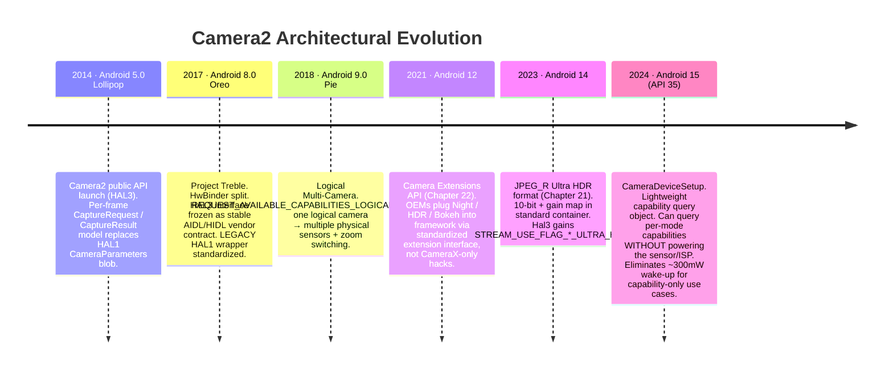

---
sidebar_position: 28
title: "Chapter 28: Camera2 Architecture"
description: "The grand architecture finale of Camera2. Travel the full stack from your Kotlin app down through Binder IPC, the Framework, CameraService in native, Camera3Device, HAL3 with camera3_device_t, the V4L2 kernel driver, and finally the physical sensor, ISP, VCM lens and flash hardware. Includes the Treble HAL requirement, the LEGACY HAL1 wrapper, and Android 15's CameraDeviceSetup. Complete reader's journey map to layers."
keywords: [camera2 architecture, hal3, camera3_device_t, cameraservice, binder ipc, v4l2 driver, mipi csi-2, camera devicesetup, android treble hal, legacy hal1 wrapper, kernel camera driver, camera isp, vcm voice coil]
---

# Chapter 28: Camera2 Architecture

## Summary

This is the chapter you have earned. In Chapters 1–27 you used `CameraManager`, `CameraCharacteristics`, `CaptureRequest`, `CaptureResult`, `CameraCaptureSession`, `ImageReader`, CameraX, the NDK native stack, coroutine wrappers, and test mocks. You know every public API surface. Now we peel back every abstraction in sequence, from the Kotlin line of code you write all the way to the individual electrons crossing the MIPI CSI-2 bus between sensor and SoC, the voice-coil motor nudging the lens group by 10 micrometers, and the flash LED controller pulsing a xenon or LED strobe in microsecond lock-step with the sensor's rolling shutter.

By the end of this chapter you will be able to look at any `CaptureRequest` and map, layer by layer, where each part of it goes, who translates it, who validates it, and who finally executes it on silicon. You will also understand the Android 15 (API 35) `CameraDeviceSetup` abstraction as an example of a decade-long architectural trend: progressively decoupling *capability queries* from *hardware power states* so apps can probe a camera without burning the ~300mW needed to power up the sensor and ISP.

To inspect the exact capabilities of any real device and cross-reference them against the architecture layers described here, install **Android Camera Parameters** ([Google Play](https://play.google.com/store/apps/details?id=com.minininja.cameraparams), [GitHub](https://github.com/zoozooll/AndroidCameraParameters)). It reads every `CameraCharacteristics` key that the layers below expose to the public API.

---

## The Full Stack Layer Diagram

This is the single most important diagram in the entire book. Every layer from here down is real code with a real path in the Android Open Source Project (AOSP), a real owner, and a real Binder or function-call boundary. We will walk each layer from top to bottom, then show the evolution of the stack over the past decade, then map your learning journey across the layers.

```mermaid
graph TB
    subgraph APP["App Layer (your code)"]
        direction TB
        A1["Kotlin / Java / C++ NDK<br/>cameraManager.openCamera(id, cb, handler)<br/>session.capture(request, cb, handler)<br/>captureResult.get(SENSOR_EXPOSURE_TIME)"]
    end
    subgraph FRAME["Java/Kotlin Framework Layer — android.hardware.camera2.*"]
        direction TB
        F1["CameraManager · CameraCharacteristics<br/>CaptureRequest.Builder · CaptureResult<br/>CameraDevice · CameraCaptureSession"]
        F2["CameraBinderWrapper (AOSP frameworks/base)<br/>Translates Java objects → AIDL Binder parcel"]
    end
    subgraph BIND["IPC Layer — Binder / HwBinder"]
        direction TB
        B1["AIDL ICameraService (AOSP)<br/>Framework ↔ CameraService"]
        B2["HIDL / AIDL HAL Binder (Treble)<br/>CameraService ↔ Vendor HAL"]
    end
    subgraph NS["Native Mediaserver Layer (system/bin/cameraserver)"]
        direction TB
        N1["CameraService (frameworks/av/services/camera/)"]
        N2["Camera3Device<br/>frameworks/av/services/camera/libcameraservice/device3/<br/>— Validates request vs session outputs<br/>— Builds camera3_capture_request_t<br/>— Parses camera3_capture_result_t"]
        N3["CameraProviderManager (frameworks/av)<br/>Enumerates vendor HAL implementations"]
    end
    subgraph HAL["Vendor HAL Layer (OEM / SoC code)"]
        direction TB
        H1["HAL3 Interface: camera3_device_t<br/>— process_capture_request()<br/>— process_capture_result()<br/>— flush()"]
        H2["HAL1 Wrapper (Legacy)<br/>camera2compat::Camera2Compat<br/>Translates HAL3 request→HAL1 CameraParameters<br/>for < INFO_SUPPORTED_HARDWARE_LEVEL_LIMITED"]
        H3["Vendor Implementation<br/>Qualcomm QCamera2 · MediaTek CamHAL · Samsung Exynos Camera HAL"]
    end
    subgraph K["Kernel Layer (Linux)"]
        direction TB
        K1["/dev/videoX — V4L2 Video Capture Driver<br/>VIDIOC_S_FMT · VIDIOC_REQBUFS · VIDIOC_QBUF / DQBUF"]
        K2["ISP Driver (Qualcomm CAMSS / MediaTek ISP Driver)<br/>Memory-to-memory processing V4L2 m2m node"]
        K3["Sensor Subdev Driver<br/>I2C writes for mode / exposure / gain / VCM"]
        K4["MIPI CSI-2 Receiver Driver (SoC)<br/>Lane configuration, LP/HS transitions, ECC/CRC check"]
    end
    subgraph HW["Physical Hardware Layer"]
        direction TB
        HW1["Lens Assembly<br/>VCM Voice Coil Motor (I2C)<br/>Moves lens group for focus / OIS"]
        HW2["Camera Sensor Pixel Array<br/>CMOS sensor (Sony IMX / Samsung ISOCELL / OmniVision)<br/>Expose → Readout → A/D"]
        HW3["MIPI CSI-2 Physical Bus<br/>2/4/8 differential pairs at 1.5 – 2.5 Gbps/lane"]
        HW4["ISP Image Signal Processor (on SoC)<br/>Demosaic · Noise Reduction · Sharpen · HDR merge · Face detect in hardware"]
        HW5["Flash LED Controller (I2C)<br/>Xenon strobe or LED current sink<br/>Synced to sensor EXRST pin"]
    end

    APP -->|function call| FRAME
    FRAME -->|AIDL parcel| BIND
    BIND -->|HwBinder| NS
    NS -->|HAL3 AIDL/HIDL| HAL
    HAL -->|ioctl() syscalls| K
    K -->|I2C writes + MIPI lane signals + ISP command queues| HW

    style APP fill:#e6d9f2
    style FRAME fill:#d9e6f2
    style BIND fill:#fff3cd,stroke:#ffc107,stroke-width:2px
    style NS fill:#d9f2e6
    style HAL fill:#f2d9e6
    style K fill:#e6d9e6
    style HW fill:#f2e6d9,stroke:#d4a373,stroke-width:2px
```

Now go top to bottom.

---

## Layer 1 — App Layer (Your Code)

This is the code you wrote. `cameraManager.openCamera(id, stateCallback, cameraHandler)`. You know this layer by heart. Two facts you may not have internalized:
- Every single `CaptureRequest.Builder.set(key, value)` call you make appends a *tagged metadata entry* to a parcelable structure that exactly mirrors the `camera_metadata_t` C struct in `system/media/camera/include/system/camera_metadata.h`. There is no magic translation between your Kotlin `CaptureRequest` and the HAL's request — they are the same binary metadata format, just wrapped with different language bindings.
- Every `CaptureResult.get(key)` call you make reads the exact bytes the HAL wrote into the response buffer. If a HAL mis-reports exposure time on a specific OTA build, your app reads exactly that wrong value. There is no framework-level validation layer above the HAL correcting vendor errors. That is why Chapter 27's real-hardware sanity test exists.

---

## Layer 2 — Java/Kotlin Framework Layer (`android.hardware.camera2.*`)

The Framework layer (AOSP `frameworks/base/core/java/android/hardware/camera2/`) does two things only:
1. Exposes the public API surface (`CameraManager`, `CameraDevice`, etc.) you call.
2. Translates between `CaptureRequest` / `CaptureResult` Java objects and their Binder-parcelable on-the-wire representations.

It does no policy enforcement above the HAL. It does no metadata rewriting. It does not "fix" requests. It is a thin translation layer plus a cache for the immutable `CameraCharacteristics` blob fetched once per camera ID at device boot.

The Binder boundary is in `CameraManager` → `ICameraService` AIDL, which is the next layer.

---

## Layer 3 — IPC Layer: Binder / HwBinder (Treble)

This is the critical architectural contract that Project Treble (Android 8.0, 2017) locked down. Two Binder domains are involved:

| Binder Domain     | Connects                                              | Protocol        | Who Enforces ABI Stability      |
|-------------------|-------------------------------------------------------|-----------------|---------------------------------|
| `/dev/binder`     | Framework ↔ cameraserver (system_server side)         | AIDL            | Platform (same partition build) |
| `/dev/hwbinder`   | cameraserver ↔ vendor camera HAL                      | HIDL / AIDL HAL | Treble (stable vendor interface)|

Before Treble, the HAL was a `.so` dlopen'd directly into `cameraserver`'s process. Every OTA from the OEM had to rebuild camera *and* framework together. Treble's HwBinder split means the vendor HAL is its own process, its own partition, its own 3-year security update timeline, and the contract between it and `cameraserver` is versioned and frozen for the device's lifetime. For you as an app developer, this is the single biggest reason Camera2 API behavior is predictable across OTAs: the HAL interface literally cannot change without breaking the Treble compliance test.

The LEGACY HAL1 wrapper lives below this boundary, inside the vendor HAL process, so it is invisible to you at the app layer except via `INFO_SUPPORTED_HARDWARE_LEVEL_LEGACY`.

---

## Layer 4 — Native Mediaserver Layer: `CameraService` / `Camera3Device`

`/system/bin/cameraserver` is a native daemon started at boot by `init.rc`. It runs always, owns every open camera on the device, and is the single arbiter of which app gets camera access (the top-foreground app wins; everything else is disconnected).

Its two most important classes:

1. **`CameraService`** (`frameworks/av/services/camera/libcameraservice/CameraService.cpp`):
   - Exposes `ICameraService` AIDL to the framework.
   - Enforces `android.permission.CAMERA` permission checks for every binder call (a non-CAMERA-permissioned app's call is rejected *in cameraserver* before ever reaching the HAL).
   - Handles concurrent open arbitration (two apps request same camera → top activity gets it; background app gets `onDisconnected`).
   - Manages `CameraProviderManager` for enumerating vendor HAL modules.

2. **`Camera3Device`** (`frameworks/av/services/camera/libcameraservice/device3/Camera3Device.cpp`):
   - The heart of the pipeline.
   - Validates that every output surface in a capture request is actually part of the session's configured output set. (This is where the framework throws `IllegalArgumentException: Surface not in configured outputs`.)
   - Packages your parceled `CaptureRequest` into a HAL3 `camera3_capture_request_t` struct.
   - Streams requests one-by-one into the HAL via `process_capture_request(request)`.
   - Receives `camera3_capture_result_t` back from the HAL, parcels metadata + fences, and forwards them *back* up the Binder chain to your `CaptureCallback.onCaptureCompleted`.
   - Handles `flush()` for you, the error paths, the `notify()` shutter and error callbacks, and output buffer release fences for EGL/Vulkan interop.

`Camera3Device` is ~15,000 lines of C++ and is the most heavily-tested piece of the whole stack (Chapter 27's CTS tests target `Camera3Device` behavior directly from the framework side). If you ever read a bug report saying "this request key works on Camera2 NDK but not on Java Camera2," the discrepancy is almost always a missing validation or conversion path inside `Camera3Device`.

---

## Layer 5 — Vendor HAL Layer: HAL3 (`camera3_device_t`)

This is where OEM differentiation actually lives. Every SoC vendor ships their own HAL3 implementation:

| Vendor       | HAL Codename                              | AOSP Interface                              |
|--------------|-------------------------------------------|----------------------------------------------|
| Qualcomm     | QCamera2 / QCamera3 (mm-camera codebase)  | `camera3_device_t` + `vendor.qti.hardware.camera*` extensions |
| MediaTek     | CamHAL (mtkcam)                           | Same `camera3_device_t` + MediaTek extensions |
| Samsung      | Exynos Camera HAL                         | Same `camera3_device_t` + Samsung extensions |
| Google Tensor| Google Camera HAL (Pixels)                | Same `camera3_device_t` + Google custom logic for Night Sight / Computational Raw |

The HAL3 contract (defined in `hardware/libhardware/include/hardware/camera3.h`) is exactly four core operations on an open device:

```cpp
// HAL3 simplified contract — this is the entire interface
typedef struct camera3_device {
    hw_device_t common;

    int (*configure_streams)(
        const struct camera3_device *,
        camera3_stream_configuration_t *stream_list
    );

    int (*process_capture_request)(
        const struct camera3_device *,
        camera3_capture_request_t *request
    );

    void (*get_metadata_vendor_tag_ops)(...);

    int (*flush)(const struct camera3_device *);

    void (*dump)(...);
} camera3_device_t;
```

The HAL receives requests, produces results and output buffers. That's it. The request/response model is HAL3's signature — HAL1 was a single `CameraParameters` string blob (`"preview-size=1920x1080;picture-size=..."`) that the entire industry hated for its lack of per-frame control. HAL3's request/response model is what *enables* every advanced feature you have used in this book: per-frame manual exposure, RAW capture, multi-camera physical streams, reprocessing, ZSL input surfaces. All impossible under HAL1.

### The LEGACY HAL1 Wrapper

`INFO_SUPPORTED_HARDWARE_LEVEL_LEGACY` means the vendor *still* only shipped a HAL1 `.so` and the device uses AOSP's `camera2compat::Camera2Compat` shim to translate HAL3 request/response calls back into the old `CameraParameters` blob + `startPreview()`/`takePicture()` HAL1 entry points. This translation layer is why Chapter 24 warned you that `CONTROL_MODE_OFF` silently does nothing on `LEGACY` devices — HAL1 has no per-frame `CONTROL_MODE` concept to translate *to*. The shim drops that metadata entry on the floor.

---

## Layer 6 — Kernel Layer: V4L2 + MIPI CSI-2 + Sensor Drivers

The HAL3 process calls down into the Linux kernel exclusively via `ioctl()` syscalls on device nodes. Four categories of kernel driver interact to process a single frame:

1. **MIPI CSI-2 Receiver Driver** (`/dev/v4l-subdevX`): Configures the PHY lane count and data rate, handles Low-Power to High-Speed transitions on the differential pairs, validates packet ECC/CRC, and DMA's received pixel lines into the ISP's input ring buffer. You never touch this driver from user space. A bad CSI-2 CRC manifests to you as a corrupted output buffer with a matching `camera3_stream_buffer_t.status == BUFFER_ERROR`.

2. **Sensor Subdev Driver** (`/dev/v4l-subdevY`, I2C-controlled):
   - Writes sensor registers over I2C (a slow, ~100KHz side-band bus, which is why exposure changes and mode switches have ~2-3 frame latency even for `HARDWARE_LEVEL_3` devices).
   - Sets exposure time (per-frame rolling shutter start/stop), analog gain, digital gain, resolution, binning mode.
   - Controls VCM focus via an I2C DAC that sources current into the voice coil (see HW layer).
   - Controls flash strobe synchronization via a sensor-side EXRST output pin that the flash controller listens to.

3. **V4L2 Video Capture Node** (`/dev/video0` etc.): The HAL calls `VIDIOC_REQBUFS` to allocate gralloc-backed buffers (the exact same `AHardwareBuffer` handles you imported into Vulkan in Chapter 25), then `VIDIOC_QBUF` (enqueue a buffer) in a loop. As frames arrive from the CSI-2 receiver + ISP, the HAL calls `VIDIOC_DQBUF` (dequeue a buffer) and ships it up to `Camera3Device` as a `camera3_stream_buffer_t`.

4. **ISP Memory-to-Memory Driver** (`/dev/videoN m2m` node): Separately from the capture path, the HAL queues reprocessing input buffers (for ZSL, Chapter 23) into the ISP m2m queue to run demosaic, denoise, HDR merge, or face detection on previously-captured RAW frames. The result emerges as a processed JPEG/YUV/PRIVATE output buffer.

---

## Layer 7 — Physical Hardware Layer

Finally, electrons. Every layer above is code executing on the SoC. The hardware layer is where photons are converted to electrons and processed:

```mermaid
graph LR
    LENS["Lens Group<br/>Glass elements<br/>~10–20mm focal length"] --> VCM["VCM Voice Coil Motor<br/>I2C DAC → coil current →<br/>lens displacement ±50 µm<br/>Focus + OIS stabilization"]
    VCM --> SENSOR[CMOS Sensor Pixel Array<br/>Sony IMX / Samsung ISOCELL<br/>~12MP – 200MP<br/>rolling shutter: readout line-by-line<br/>Global shutter (rare) on industrial sensors]
    SENSOR -->|A/D converted 10/12/14-bit Bayer| CSI[MIPI CSI-2 PHY<br/>2/4/8 pairs<br/>up to 20 Gbps aggregate]
    CSI -->|SoC-internal interconnect| ISP[ISP — on SoC die<br/>Demosaic · CCM · NR · 3A stats · HDR merge<br/>often 1 TOPS+ of DNN for face/segmentation]
    ISP -->|Gralloc buffers → DRAM| CPU[CPU / GPU<br/>Your app's process reads them]
    FLASH["Flash LED / Xenon<br/>I2C flash controller<br/>Strobe synced to sensor EXRST"] --> SENSOR
```

Each physical sub-system:
- **Lens & VCM**: A 10µm movement of the lens is one step of AF. OIS (Optical Image Stabilization) adds closed-loop gyro feedback to the VCM, nudging the lens 500–5000 times per second to cancel hand shake. The kernel driver writes I²C DAC values; your app controls it via `LENS_FOCUS_DISTANCE` and `LENS_OPTICAL_STABILIZATION_MODE` metadata keys.
- **Sensor pixel array**: Photodiodes accumulate charge proportional to incident photon count. Readout is rolling-shutter (line by line top to bottom), which is why your AE slider in Chapter 14 had a 2–3 frame latency — exposure for frame N is programmed during frame N-1's readout.
- **MIPI CSI-2 bus**: Differential pairs at up to 2.5Gbps/lane × 8 lanes = 20Gbps raw. More than enough for 60fps 4K 12-bit Bayer. Packet errors trigger CRC retransmission in hardware but a corrupted frame reaches you as `BUFFER_ERROR`.
- **ISP**: The underrated hero. Its demosaic + noise reduction + sharpening hardware runs at 1+ Gigapixel/sec and saves your CPU from doing it. On modern Tensor / Snapdragon SoCs it also runs DNN accelerators for scene segmentation, face detection, and HDR merge in-sensor before the CPU even sees the frame.
- **Flash controller**: The flash pulse must fire *exactly during* the rolling-shutter exposure window of the frame it is supposed to illuminate. The `FLASH_STATE_FIRED` bit in `CaptureResult` confirms alignment; misalignment yields partially-exposed frames.

---

## Architectural Evolution: Camera2 through the Android Versions

Camera2 was not built in a day. Every 2–3 Android versions added a new architectural primitive that unlocked real features for developers:



The trend in every release is clear: **decoupling**.
- Android 8 decoupled HAL from framework (Treble).
- Android 9 decoupled logical camera ID from physical sensors.
- Android 12 decoupled OEM extensions from app code.
- Android 14 decoupled HDR encoding from RAW pipeline.
- **Android 15's `CameraDeviceSetup` decouples capability queries from hardware power.**

### Spotlight: Android 15 `CameraDeviceSetup` — Architectural Decoupling in Action

`CameraDeviceSetup` (Android 15, API 35) is the purest example of this trend. Before API 35, if an app wanted to know "does this 4K@60 stream combo with YUV_420_888 analysis at the same time?", the only way to call `isSessionConfigurationSupported` was through a `CameraCharacteristics` instance fetched via `CameraManager.getCameraCharacteristics(id)`. Internally, this forced the HAL to power the sensor (≈250–350mW) and ISP for several milliseconds just to read a capability table that is effectively static for the device's lifetime. On a battery-constrained app this was a non-starter for any "pre-flight feature check" UX.

`CameraDeviceSetup` fixes this by providing a lightweight, non-power-grabbing representation:

```kotlin
// Requires API 35+
val setup: CameraDeviceSetup = cameraManager.getCameraDeviceSetup(cameraId)
val supported: Boolean = setup.isSessionConfigurationSupported(sessionConfig)
// getCameraDeviceSetup() does NOT power sensor or ISP
// Result can be cached for the device's entire uptime
```

Architecturally, the capability table now lives in a pre-fetched, signed, partition-independent blob in the vendor partition, and `getCameraDeviceSetup` reads it via a separate HwBinder call that skips `Camera3Device`'s power-on sequence entirely. This is the next decade's direction: *every* API that can be answered statically will eventually have a no-power lightweight counterpart. Expect `getCameraDeviceSetup` to gain more and more capability queries in Android 16+.

---

## The Reader's Journey Mapped to Architecture Layers

Finally, map your own journey across this book onto the layers. Every chapter corresponds to a specific layer or interface boundary:

```mermaid
flowchart TB
    subgraph Journey["Your Journey Across This Book (Chapters → Layers)"]
        direction LR
        C1["Ch. 1–4<br/>Foundations<br/>Hardware layer concepts"] ~~~ H_L1["↔ HW Layer"]
        C2["Ch. 5–9<br/>First Camera2 app<br/>CameraManager · Session · ImageReader"] ~~~ H_L2["↔ App + Framework"]
        C3["Ch. 10–12<br/>Pipeline · Capture Types<br/>Characteristics Deep Dive"] ~~~ H_L3["↔ Parcel metadata + HAL3 contract"]
        C4["Ch. 13–17<br/>Manual 3A · Exposure · Focus · WB"] ~~~ H_L4["↔ Metadata keys → HAL3 → I²C sensor driver"]
        C5["Ch. 18–23<br/>RAW · HDR · Multi-Cam · ZSL · Extensions"] ~~~ H_L5["↔ HAL3 request model · ISP m2m reprocessing"]
        C6["Ch. 24 CameraX<br/>UseCase facade + Interop"] ~~~ H_L6["↔ App-side abstraction over Framework"]
        C7["Ch. 25 Native NDK<br/>ACamera + AHB → Vulkan"] ~~~ H_L7["↔ NDK shim directly above Camera3Device"]
        C8["Ch. 26 Coroutines/Flow<br/>Async wrapping of callbacks"] ~~~ H_L8["↔ App-layer async around Binder boundaries"]
        C9["Ch. 27 Testing ITS/CTS<br/>Mock vs Real hardware"] ~~~ H_L9["↔ Validate every layer via test harness"]
        C10["Ch. 28 THIS CHAPTER<br/>Full stack architecture"] ~~~ H_L10["↔ ALL layers, end-to-end"]
    end
    H_L1 --> HW
    H_L2 --> FRAME
    H_L3 --> HAL
    H_L4 --> K
    H_L5 --> HAL
    H_L6 --> APP
    H_L7 --> NS
    H_L8 --> APP
    H_L9 --> BIND
    H_L10 --> HW
```



By reading this chapter last, you have matched the architecture with the practice. You did not learn HAL3 abstractly at day one and struggle to map it to real code. You learned by *doing*: open → configure → capture → result, for 27 chapters, then pulled back the curtain to see who was really responding to every one of those calls.

---

## Summary

Camera2 is a seven-layer stack: App → Framework (Java/Kotlin `android.hardware.camera2.*`) → Binder/HwBinder IPC → Native `CameraService` + `Camera3Device` → Vendor HAL3 (`camera3_device_t`, with a LEGACY HAL1 wrapper) → V4L2 Kernel drivers (MIPI CSI-2, sensor, capture, ISP m2m) → Physical hardware (lens/VCM, sensor, MIPI bus, ISP, flash controller). Project Treble locked the HAL contract via HwBinder, ensuring long-term stability. The decade-long architectural trend is progressive decoupling, culminating in Android 15's `CameraDeviceSetup`, which can query capabilities without powering the sensor. You have now mapped every feature — from manual ISO in Chapter 14 to ZSL in Chapter 23 to native Vulkan zero-copy in Chapter 25 — to the exact layer that executes it.

## What's Next: Part VII — Camera Metadata Encyclopedia

This closes Part VI: Modern Android Camera Development. The remaining frontier is a detailed, encyclopedic reference for every `CameraCharacteristics`, `CaptureRequest`, and `CaptureResult` metadata key you have been using across all 28 chapters. Part VII is the Metadata Encyclopedia: SENSOR, LENS, CONTROL, SCALER, REQUEST — every tag defined, explained, queried, cross-checked against real devices, and validated through the Android Camera Parameters app. Open it when you need to know exactly what `SCALER_CROPPING_TYPE` means, which devices support `REQUEST_AVAILABLE_CAPABILITIES_OFFLINE_PROCESSING`, or how a specific key actually behaves on a real `LEGACY` HAL.
