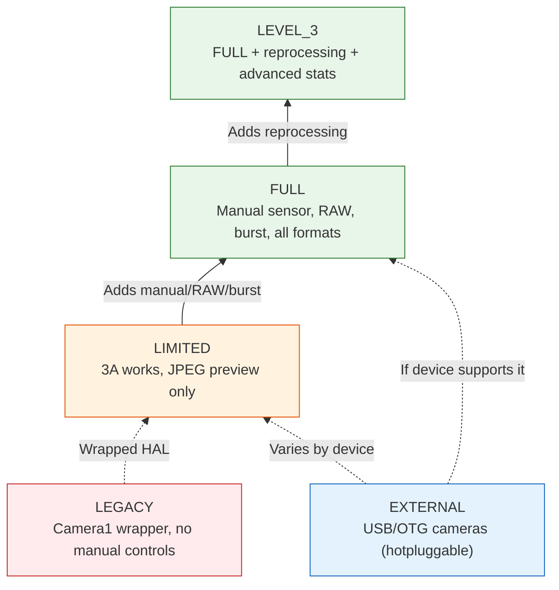
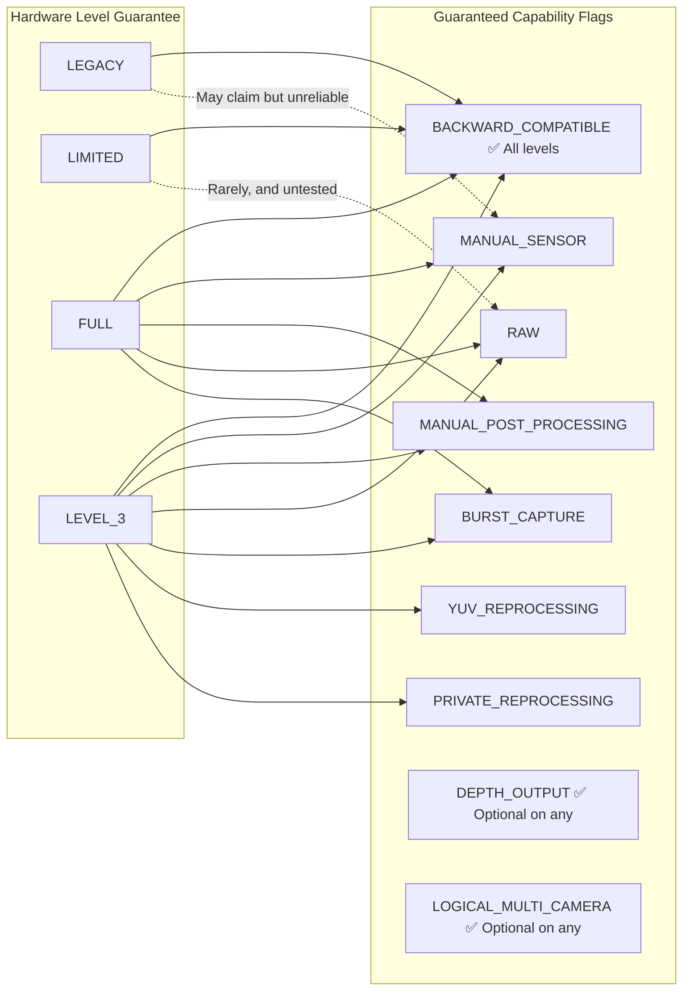
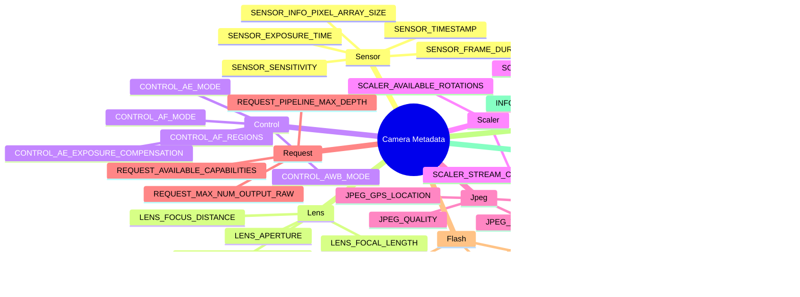

## 12.1 The Spec Sheet in Your Pocket

Before you can call `openCamera()`, before you can build a `CaptureRequest`, before you can configure a session — there is `CameraCharacteristics`. It is the immutable, power-on-free window into *everything* a camera can do. Think of it as the camera's spec sheet, exposed as a structured queryable object.

`CameraCharacteristics` is your most important tool for writing apps that work across Android's 10,000+ device models. You cannot assume manual ISO works. You cannot assume RAW is available. You cannot even assume the camera supports 1080p preview — unless you ask `CameraCharacteristics`.

In [Chapter 6](discovering-cameras.md) we touched on the basics: lens facing, sensor size, focal length. In this deep dive we go much further:
- The five **hardware levels** (LEGACY → LIMITED → FULL → LEVEL_3 → EXTERNAL) and what each guarantees
- The ten+ **capability flags** (`MANUAL_SENSOR`, `RAW`, `DEPTH_OUTPUT`, etc.) and which hardware levels provide them
- How metadata keys are **organized hierarchically** by subsystem (`android.sensor.*`, `android.lens.*`, `android.control.*`, ...)
- How to write a **comprehensive runtime capability query** with graceful fallbacks

The Android Camera Parameters app ([GitHub](https://github.com/zoozooll/AndroidCameraParameters), [Play Store](https://play.google.com/store/apps/details?id=com.minininja.cameraparams)) is essentially a `CameraCharacteristics` browser on steroids. Open it to any camera and you'll see exactly the keys we discuss in this chapter, organized by category, with human-readable labels and live-value rendering.

## 12.2 What CameraCharacteristics Actually Is

Formally, `CameraCharacteristics` is:

- **Immutable** — Once obtained from `CameraManager.getCameraCharacteristics(id)`, the object never changes (with one documented exception: foldable `SENSOR_ORIENTATION` on API 32+).
- **Power-free** — Querying it does **not** power on the sensor or ISP. You can call it in `onCreate()` of your first Activity without battery impact.
- **Per-camera** — Every logical camera ID has its own `CameraCharacteristics` object.
- **Type-safe and keyed** — Data is accessed via ``<Key<T>> get(Key<T> key)`` where each key has a documented type (Int, Long, Float, Rect, Array, etc.).

You obtain one with a single call:

```kotlin
val cameraManager = getSystemService(CAMERA_SERVICE) as CameraManager
val cameraIdList = cameraManager.cameraIdList  // e.g. ["0", "1", "2", "3"]

for (id in cameraIdList) {
    val characteristics: CameraCharacteristics = cameraManager.getCameraCharacteristics(id)
    // Query away — no sensor power used!
}
```

On Android 15 (API 35) you can use `CameraManager.getCameraDeviceSetup(id)` for lightweight session-configuration queries without opening the camera (see [Chapter 28](camera2-architecture.md) for `CameraDeviceSetup` details).

## 12.3 Hardware Level: INFO_SUPPORTED_HARDWARE_LEVEL

The single most important `CameraCharacteristics` key is **`INFO_SUPPORTED_HARDWARE_LEVEL`**. It defines the entire tier of the camera HAL and tells you (broadly) what features are guaranteed to work. There are five hardware levels:

### The Five Hardware Levels

| Level | Constant | Typical Devices | What It Means In Practice |
|-------|----------|----------------|---------------------------|
| **LEGACY** | `INFO_SUPPORTED_HARDWARE_LEVEL_LEGACY` | Pre-2015 budget devices, very old chipsets | Camera2 API is a wrapper around the old `android.hardware.Camera` API. No per-frame controls, no manual settings, RAW impossible, burst unreliable. Treat these devices as "Camera1-era with Camera2 syntax." |
| **LIMITED** | `INFO_SUPPORTED_HARDWARE_LEVEL_LIMITED` | Budget phones (Android Go, entry-level SoCs like MediaTek Helio, Snapdragon 4xx) | Native Camera2 HAL but only subset of features. 3A (AF/AE/AWB) work. Preview + JPEG work. But **no** manual sensor control, **no** RAW, **no** guaranteed burst, **no** YUV reprocessing. This is Android's "baseline functional" camera level. |
| **FULL** | `INFO_SUPPORTED_HARDWARE_LEVEL_FULL` | Mid-range and flagship phones (Snapdragon 6xx/7xx/8xx, Exynos mid+, Dimensity 7xxx+) | The "pro camera" tier. Guarantees MANUAL_SENSOR, MANUAL_POST_PROCESSING, BURST_CAPTURE, per-frame settings, 30fps full-res, RAW, all output formats, predictable pipeline depth. What you want for any serious camera app. |
| **LEVEL_3** | `INFO_SUPPORTED_HARDWARE_LEVEL_3` | High-end flagships with advanced ISP (Snapdragon 8 Gen 1+, Pixel 6+, Exynos 2xxx+) | FULL + extra: YUV reprocessing (input stream support, offline reprocessing), private reprocessing, advanced statistics, hardware JPEG + RAW at max resolution simultaneously. Required for ZSL with RAW output. |
| **EXTERNAL** | `INFO_SUPPORTED_HARDWARE_LEVEL_EXTERNAL` | USB cameras, webcams connected via OTG | External camera HAL. Behaves like LIMITED or FULL depending on the USB device. Key caveat: camera can be hotplugged/disconnected at any time, so listen for `ACTION_CAMERA_DEVICE_STATE_CHANGED`. |



:::important
Hardware level is a **guarantee**, not a best-effort flag. If a device reports FULL, Google's CTS (Compatibility Test Suite) has verified that every FULL-level feature works. If a device reports LIMITED, you cannot rely on any FULL-level feature — even if it happens to work on one specific LIMITED device, it will break on another.
:::

### Checking Hardware Level at Runtime

```kotlin
val hardwareLevel = characteristics.get(CameraCharacteristics.INFO_SUPPORTED_HARDWARE_LEVEL)

when (hardwareLevel) {
    CameraCharacteristics.INFO_SUPPORTED_HARDWARE_LEVEL_LEGACY -> {
        Log.w("CamCaps", "LEGACY hardware — manual/RAW disabled. Falling back to basic JPEG.")
        disableManualControls()
        disableRawCapture()
    }
    CameraCharacteristics.INFO_SUPPORTED_HARDWARE_LEVEL_LIMITED -> {
        Log.i("CamCaps", "LIMITED hardware — basic photo + preview only.")
        disableManualControls()
        disableRawCapture()
        disableBurstCapture()
    }
    CameraCharacteristics.INFO_SUPPORTED_HARDWARE_LEVEL_FULL -> {
        Log.i("CamCaps", "FULL hardware — enabling manual controls, RAW, and burst.")
        enableManualControls()
        enableRawCapture()
        enableBurstCapture()
    }
    CameraCharacteristics.INFO_SUPPORTED_HARDWARE_LEVEL_3 -> {
        Log.i("CamCaps", "LEVEL_3 hardware — FULL + reprocessing + ZSL + advanced stats.")
        enableManualControls()
        enableRawCapture()
        enableBurstCapture()
        enableReprocessing()
        enableZeroShutterLag()
    }
    CameraCharacteristics.INFO_SUPPORTED_HARDWARE_LEVEL_EXTERNAL -> {
        Log.i("CamCaps", "EXTERNAL camera — may be LIMITED or FULL; registering disconnect listener.")
        registerHotplugListener()
        // Dynamically probe capabilities rather than assuming
    }
    else -> {
        Log.w("CamCaps", "Unknown hardware level $hardwareLevel — assuming LIMITED for safety.")
        safeDefaultFeatures()
    }
}
```

## 12.4 Capabilities: REQUEST_AVAILABLE_CAPABILITIES

The hardware level is a *coarse* tier. For fine-grained feature detection, Camera2 exposes `REQUEST_AVAILABLE_CAPABILITIES` — a `IntArray` of capability flags. Each flag describes one specific thing the camera can do.

The formal relationship between hardware level and capabilities:



### The Capability Flags, Explained

| Flag Constant | Meaning | Hardware Level Guarantee | Practical Implication |
|--------------|---------|--------------------------|----------------------|
| `BACKWARD_COMPATIBLE` | Camera implements the baseline Camera2 API | **All 5 levels** (LEGACY–EXTERNAL) | If this is missing, the camera device is effectively non-functional for your app. |
| `MANUAL_SENSOR` | App can manually control `SENSOR_EXPOSURE_TIME`, `SENSOR_SENSITIVITY`, `SENSOR_FRAME_DURATION`, `LENS_FOCUS_DISTANCE`, `LENS_APERTURE` | Guaranteed on **FULL** and **LEVEL_3** | Pro-mode and manual camera UIs require this. Without it, all manual ISO/exposure sliders must be hidden. |
| `MANUAL_POST_PROCESSING` | App can manually control ISP stages: noise reduction, edge enhancement, tone curve, color correction gains, color correction transform | Guaranteed on **FULL** and **LEVEL_3** | Needed for custom "film look" LUTs, manual white balance via gains, sharpness/blur control. |
| `RAW` | Sensor outputs RAW Bayer data via `ImageFormat.RAW_SENSOR`, `RAW10`, or `RAW12` | Guaranteed on **FULL** and **LEVEL_3** | DNG capture, RAW-to-JPEG editing pipeline, computational photography all start here. |
| `PRIVATE_REPROCESSING` | Camera supports `InputSurface` + offline reprocessing of HAL-private-format images into JPEG/YUV | Guaranteed on **LEVEL_3**. Rare on FULL. | Enables Zero-Shutter-Lag (ZSL): circular-buffer past frames, reprocess a recent one into a high-quality still. |
| `YUV_REPROCESSING` | Camera supports `InputSurface` + reprocessing of app-provided YUV_420_888 images back through the ISP | Guaranteed on **LEVEL_3** | Enables "apply cinematic LUT to recorded video" or "re-focus portrait depth in post" pipelines. |
| `DEPTH_OUTPUT` | Camera can output depth maps (`DEPTH16` / `DEPTH_POINT_CLOUD` formats) | **Optional on ANY** level. Check the array explicitly. | Portrait mode bokeh, AR measurement, 3D scanning. Often paired with `LOGICAL_MULTI_CAMERA` (dual physical cameras for stereo depth). |
| `LOGICAL_MULTI_CAMERA` | This logical camera is backed by 2+ physical sensors (e.g. ultra-wide + wide + telephoto) | **Optional on ANY** level. Usually only flagships. | Enables seamless optical zoom (see [Chapter 20](multi-camera.md)). You can query `LOGICAL_MULTI_CAMERA_PHYSICAL_IDS` to get the physical camera IDs. |
| `BURST_CAPTURE` | `captureBurst()` with > 1 frame works at full resolution without frame drops | Guaranteed on **FULL** and **LEVEL_3** | Without this, burst capture may stutter, drop frames, or silently fail. Exposure / focus bracketing require this. |
| `CONSTRAINED_HIGH_SPEED_VIDEO` | Supports `createHighSpeedRequestList()` + high-speed video (120fps, 240fps) | **Optional on FULL/LEVEL_3**. Rare on LIMITED. | Slow-motion recording (see [Chapter 19](high-speed-video.md)). |
| `MOTION_TRACKING` | Camera can track objects / faces at high frame rate with low latency | Optional (rare). Found on Pixel and some flagships. | AR motion tracking, sports autofocus. |
| `LOGICAL_MULTI_CAMERA_SYNC` | Multiple physical cameras in a logical device can capture synchronized frames | Optional. Required for true simultaneous multi-sensor capture. | Computational photography that uses multiple lenses at once (e.g. fusion zoom). |

### Querying All Capabilities at Runtime

```kotlin
val capabilities = characteristics.get(
    CameraCharacteristics.REQUEST_AVAILABLE_CAPABILITIES
) ?: intArrayOf()

fun hasCapability(cap: Int): Boolean = capabilities.contains(cap)

val supportsManualSensor = hasCapability(
    CameraCharacteristics.REQUEST_AVAILABLE_CAPABILITIES_MANUAL_SENSOR
)
val supportsRaw = hasCapability(
    CameraCharacteristics.REQUEST_AVAILABLE_CAPABILITIES_RAW
)
val supportsBurst = hasCapability(
    CameraCharacteristics.REQUEST_AVAILABLE_CAPABILITIES_BURST_CAPTURE
)
val supportsDepth = hasCapability(
    CameraCharacteristics.REQUEST_AVAILABLE_CAPABILITIES_DEPTH_OUTPUT
)
val supportsLogicalMultiCam = hasCapability(
    CameraCharacteristics.REQUEST_AVAILABLE_CAPABILITIES_LOGICAL_MULTI_CAMERA
)
val supportsHighSpeed = hasCapability(
    CameraCharacteristics.REQUEST_AVAILABLE_CAPABILITIES_CONSTRAINED_HIGH_SPEED_VIDEO
)
val supportsYuvReprocessing = hasCapability(
    CameraCharacteristics.REQUEST_AVAILABLE_CAPABILITIES_YUV_REPROCESSING
)
val supportsPrivateReprocessing = hasCapability(
    CameraCharacteristics.REQUEST_AVAILABLE_CAPABILITIES_PRIVATE_REPROCESSING
)

// Build human-readable report
val capabilityReport = buildString {
    appendLine("=== Camera Capabilities Report ===")
    appendLine("BACKWARD_COMPATIBLE:     ${hasCapability(
        CameraCharacteristics.REQUEST_AVAILABLE_CAPABILITIES_BACKWARD_COMPATIBLE
    )}")
    appendLine("MANUAL_SENSOR:           $supportsManualSensor")
    appendLine("MANUAL_POST_PROCESSING:  ${hasCapability(
        CameraCharacteristics.REQUEST_AVAILABLE_CAPABILITIES_MANUAL_POST_PROCESSING
    )}")
    appendLine("RAW:                     $supportsRaw")
    appendLine("BURST_CAPTURE:           $supportsBurst")
    appendLine("YUV_REPROCESSING:        $supportsYuvReprocessing")
    appendLine("PRIVATE_REPROCESSING:    $supportsPrivateReprocessing")
    appendLine("DEPTH_OUTPUT:            $supportsDepth")
    appendLine("LOGICAL_MULTI_CAMERA:    $supportsLogicalMultiCam")
    appendLine("CONSTRAINED_HIGH_SPEED:  $supportsHighSpeed")
}

Log.i("CamCaps", capabilityReport)

// Now gate your UI features
manualIsoSlider.isEnabled = supportsManualSensor
manualExposureSlider.isEnabled = supportsManualSensor
rawCaptureToggle.isEnabled = supportsRaw
burstCaptureButton.isEnabled = supportsBurst
depthPortraitMode.isEnabled = supportsDepth
zoomSwitcher.isEnabled = supportsLogicalMultiCam
slowMoButton.isEnabled = supportsHighSpeed
zslMode.isEnabled = supportsPrivateReprocessing  // LEVEL_3
```

:::tip
The Android Camera Parameters app renders this exact query as color-coded checkboxes in the **Capabilities** card of the camera summary view. Green = supported, gray = unsupported. You can compare multiple cameras side-by-side to see how the ultra-wide's capabilities differ from the main camera's.
:::

## 12.5 Metadata Organization: The android.* Namespace

Every key in `CameraCharacteristics`, `CaptureRequest`, and `CaptureResult` follows a hierarchical naming convention: `android.<subsystem>.<parameter>`. The dot-separated components group related settings by the hardware/software subsystem they control.

### The Subsystem Classes

| Subsystem Prefix | Kotlin Metadata Class | What It Covers |
|-----------------|----------------------|---------------|
| `android.sensor.*` | `CameraCharacteristics.SensorInfo*`, `CaptureRequest.SENSOR_*`, `CaptureResult.SENSOR_*` | Sensor readout: exposure time, ISO sensitivity, frame duration, timestamp, pixel array, active array, rolling shutter direction, test pattern modes |
| `android.lens.*` | `LensInfo*`, `Lens.*` | Optics: focus distance, aperture, focal length, optical stabilization (OIS), filter density (ND), focus range, available apertures |
| `android.control.*` | `Control*` | 3A algorithms: auto-exposure (AE) modes / state / target / regions, auto-focus (AF) modes / state / trigger / regions, auto-white-balance (AWB) modes / state / regions, anti-banding, scene modes, effect modes, video stabilization (EIS) |
| `android.scaler.*` | `Scaler.*` | Output pipeline configuration: crop region (digital zoom), rotation, stream configuration map (output formats, sizes, durations), available minimum frame durations |
| `android.jpeg.*` | `Jpeg*` | JPEG encoding: quality, orientation, GPS coordinates, thumbnail size, thumbnail quality |
| `android.request.*` | `Request*` | Pipeline-wide capabilities: available capabilities array, pipeline max depth, max num output raw/proc, metadata object keys, available template list |
| `android.flash.*` | `FlashInfo*`, `Flash*` | Flash unit: availability, charge state, color temperature, max brightness, mode (off / single / torch) |
| `android.statistics.*` | `Statistics*` | ISP statistics output: face detection, face IDs, face landmarks, face scores, histogram, sharpness map, lens shading map, hot pixel map |
| `android.info.*` | `Info*` | Static camera info: supported hardware level, device version, supported hardware level, available face detect modes, available noise reduction modes |
| `android.black.*` | `BlackLevel*` | Black level lock, black level pattern (fixed pattern noise correction) |
| `android.colorCorrection.*` | `ColorCorrection*` | Color pipeline: transform matrix, color correction gains (R, G, B channels), aberration correction mode |
| `android.tonemap.*` | `Tonemap*` | Tone mapping: tonemap curve (custom gamma), tonemap mode, contrast, saturation |
| `android.edge.*` | `Edge*` | Edge enhancement / sharpening: mode, strength |
| `android.noiseReduction.*` | `NoiseReduction*` | Noise reduction: mode, strength, temporal NR strength |
| `android.shading.*` | `Shading*` | Lens shading / vignetting correction: mode, strength |
| `android.hotPixel.*` | `HotPixel*` | Hot pixel correction: mode, hot pixel map |
| `android.distortionCorrection.*` | `DistortionCorrection*` | Lens geometric distortion correction: mode |
| `android.depth.*` | `Depth*` | Depth output: depth is exclusive, maximum depth samples, depth format |
| `android.logicalMultiCamera.*` | `LogicalMultiCamera*` | Logical multi-camera: physical camera IDs, physical sensor sync |



### A Note on Key Availability

Not every key exists on every device. If you call `get(KEY)` on a key the device doesn't support, you get `null` — hence the `?: 0` or `?.let` patterns you see throughout this book.

The safe pattern is: **check if the key exists before reading it**, or use Kotlin's null-safety to provide a default.

```kotlin
// Safe access with fallback defaults
val exposureTimeNs: Long = characteristics.get(
    CameraCharacteristics.SENSOR_INFO_EXPOSURE_TIME_RANGE
)?.upper ?: 1_000_000L  // default 1ms max if key missing

// Optional processing if key exists
characteristics.get(CameraCharacteristics.LENS_INFO_AVAILABLE_APERTURES)?.let { apertures ->
    Log.d("CamCaps", "Device supports ${apertures.size} apertures: ${apertures.contentToString()}")
    buildApertureSelector(apertures)
} ?: run {
    Log.d("CamCaps", "No variable aperture on this device")
    hideApertureControl()
}
```

## 12.6 A Complete Runtime Capability Query (Production-Grade)

Putting it all together, here is a production-ready capability query that you can drop into any Camera2 app. It combines hardware level, capability flags, and individual key checks:

```kotlin
data class CameraCapabilityProfile(
    val cameraId: String,
    val lensFacing: Int,
    val hardwareLevel: Int,
    val hardwareLevelName: String,
    val supportsManualSensor: Boolean,
    val supportsManualPostProcessing: Boolean,
    val supportsRaw: Boolean,
    val supportsBurst: Boolean,
    val supportsDepth: Boolean,
    val supportsLogicalMultiCam: Boolean,
    val supportsHighSpeedVideo: Boolean,
    val supportsYuvReprocessing: Boolean,
    val supportsPrivateReprocessing: Boolean,
    val maxBurstRaw: Int,
    val maxBurstProcessed: Int,
    val pipelineMaxDepth: Int,
    val availableFocalLengths: FloatArray?,
    val availableApertures: FloatArray?,
    val minFocusDistanceDiopters: Float?,
    val maxDigitalZoom: Float?
)

fun buildCapabilityProfile(
    cameraManager: CameraManager,
    cameraId: String
): CameraCapabilityProfile {
    val c = cameraManager.getCameraCharacteristics(cameraId)

    val hwLevel = c.get(CameraCharacteristics.INFO_SUPPORTED_HARDWARE_LEVEL)
        ?: CameraCharacteristics.INFO_SUPPORTED_HARDWARE_LEVEL_LEGACY

    val hwLevelName = when (hwLevel) {
        CameraCharacteristics.INFO_SUPPORTED_HARDWARE_LEVEL_LEGACY -> "LEGACY"
        CameraCharacteristics.INFO_SUPPORTED_HARDWARE_LEVEL_LIMITED -> "LIMITED"
        CameraCharacteristics.INFO_SUPPORTED_HARDWARE_LEVEL_FULL -> "FULL"
        CameraCharacteristics.INFO_SUPPORTED_HARDWARE_LEVEL_3 -> "LEVEL_3"
        CameraCharacteristics.INFO_SUPPORTED_HARDWARE_LEVEL_EXTERNAL -> "EXTERNAL"
        else -> "UNKNOWN($hwLevel)"
    }

    val caps = c.get(CameraCharacteristics.REQUEST_AVAILABLE_CAPABILITIES) ?: intArrayOf()
    fun has(cap: Int) = caps.contains(cap)

    // Hardware level provides capability guarantees, but check flags for safety
    val atLeastFull = hwLevel == CameraCharacteristics.INFO_SUPPORTED_HARDWARE_LEVEL_FULL ||
                      hwLevel == CameraCharacteristics.INFO_SUPPORTED_HARDWARE_LEVEL_3

    return CameraCapabilityProfile(
        cameraId = cameraId,
        lensFacing = c.get(CameraCharacteristics.LENS_FACING)
            ?: CameraCharacteristics.LENS_FACING_BACK,
        hardwareLevel = hwLevel,
        hardwareLevelName = hwLevelName,

        // Use flag check + hardware level guarantee fallback for safety
        supportsManualSensor = has(
            CameraCharacteristics.REQUEST_AVAILABLE_CAPABILITIES_MANUAL_SENSOR
        ) || atLeastFull,
        supportsManualPostProcessing = has(
            CameraCharacteristics.REQUEST_AVAILABLE_CAPABILITIES_MANUAL_POST_PROCESSING
        ) || atLeastFull,
        supportsRaw = has(
            CameraCharacteristics.REQUEST_AVAILABLE_CAPABILITIES_RAW
        ) || atLeastFull,
        supportsBurst = has(
            CameraCharacteristics.REQUEST_AVAILABLE_CAPABILITIES_BURST_CAPTURE
        ) || atLeastFull,
        supportsDepth = has(
            CameraCharacteristics.REQUEST_AVAILABLE_CAPABILITIES_DEPTH_OUTPUT
        ),
        supportsLogicalMultiCam = has(
            CameraCharacteristics.REQUEST_AVAILABLE_CAPABILITIES_LOGICAL_MULTI_CAMERA
        ),
        supportsHighSpeedVideo = has(
            CameraCharacteristics.REQUEST_AVAILABLE_CAPABILITIES_CONSTRAINED_HIGH_SPEED_VIDEO
        ),
        supportsYuvReprocessing = has(
            CameraCharacteristics.REQUEST_AVAILABLE_CAPABILITIES_YUV_REPROCESSING
        ),
        supportsPrivateReprocessing = has(
            CameraCharacteristics.REQUEST_AVAILABLE_CAPABILITIES_PRIVATE_REPROCESSING
        ),

        maxBurstRaw = c.get(CameraCharacteristics.REQUEST_MAX_NUM_OUTPUT_RAW) ?: 1,
        maxBurstProcessed = c.get(CameraCharacteristics.REQUEST_MAX_NUM_OUTPUT_PROC) ?: 1,
        pipelineMaxDepth = c.get(CameraCharacteristics.REQUEST_PIPELINE_MAX_DEPTH) ?: 1,

        availableFocalLengths = c.get(CameraCharacteristics.LENS_INFO_AVAILABLE_FOCAL_LENGTHS),
        availableApertures = c.get(CameraCharacteristics.LENS_INFO_AVAILABLE_APERTURES),
        minFocusDistanceDiopters = c.get(CameraCharacteristics.LENS_INFO_MINIMUM_FOCUS_DISTANCE),
        maxDigitalZoom = c.get(CameraCharacteristics.SCALER_AVAILABLE_MAX_DIGITAL_ZOOM)
    )
}

// Usage:
val profile = buildCapabilityProfile(cameraManager, "0")
Log.d("CamCaps", "Camera 0 profile: ${profile.hardwareLevelName}, " +
    "Manual=${profile.supportsManualSensor}, RAW=${profile.supportsRaw}, " +
    "Burst=${profile.supportsBurst}, Depth=${profile.supportsDepth}, " +
    "Zoom=${profile.maxDigitalZoom}x")
```

## 12.7 Visualizing in the Android Camera Parameters App

The Android Camera Parameters app ([GitHub](https://github.com/zoozooll/AndroidCameraParameters), [Play Store](https://play.google.com/store/apps/details?id=com.minininja.cameraparams)) is the ideal companion to this chapter. It turns the raw `CameraCharacteristics` key/value pairs into a browsable UI:

- **Summary card** — Hardware level (with color-coded badge: red=LEGACY, orange=LIMITED, green=FULL, teal=LEVEL_3, blue=EXTERNAL), lens facing, sensor resolution, focal lengths
- **Capabilities card** — Checkmark list of every `REQUEST_AVAILABLE_CAPABILITIES` flag, green if present
- **Category tabs** — Organized exactly by the `android.*` subsystems: Sensor, Lens, Control, Scaler, Jpeg, Flash, Statistics, Info, Request
- **Raw JSON tab** — The complete serialized `CameraCharacteristics` object for copy/paste into bug reports
- **Compare mode** — Swipe between cameras (0, 1, 2, 3) to see how hardware levels and capabilities differ across lenses

## 12.8 Summary

| Concept | Key Takeaway |
|---------|-------------|
| **Hardware Level** | 5 tiers: LEGACY (wrapper) → LIMITED (baseline) → FULL (pro + manual/RAW) → LEVEL_3 (FULL + reprocessing) → EXTERNAL (USB). FULL is the minimum for any serious camera work. CTS-verified guarantees. |
| **Capability Flags** | Fine-grained feature detection via `REQUEST_AVAILABLE_CAPABILITIES`. Key flags: `MANUAL_SENSOR`, `MANUAL_POST_PROCESSING`, `RAW`, `BURST_CAPTURE`, `DEPTH_OUTPUT`, `LOGICAL_MULTI_CAMERA`, `PRIVATE_REPROCESSING`, `YUV_REPROCESSING`, `CONSTRAINED_HIGH_SPEED_VIDEO`. |
| **Level → Capability Mapping** | FULL guarantees MANUAL_SENSOR, MANUAL_POST_PROCESSING, RAW, BURST. LEVEL_3 adds YUV/PRIVATE_REPROCESSING. DEPTH and LOGICAL_MULTI_CAMERA are optional on all levels. |
| **Metadata Namespace** | Keys organized as `android.<subsystem>.<param>`. Main subsystems: sensor, lens, control, scaler, jpeg, request, flash, statistics, info. Each subsystem has static info (CameraCharacteristics), request inputs (CaptureRequest), and result outputs (CaptureResult). |
| **Safe Queries** | Always provide null-safety defaults for `get()` — many keys are optional. Use hardware level as coarse gate, capability flags as fine gate, individual key presence for per-device tuning. |

## What's Next

Now that you understand what a camera can do (characteristics) and how to control it (the pipeline + capture types), you have the complete foundation for Part IV.

In **Chapter 13: Manual Camera ISO and Exposure**, you will learn to use the `MANUAL_SENSOR` capability to manually control `SENSOR_EXPOSURE_TIME` and `SENSOR_SENSITIVITY` — implementing a pro-mode exposure slider with live preview, exposure compensation, and the exposure triangle trade-offs.
