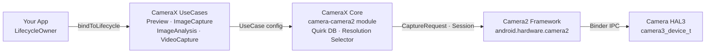

---
sidebar_position: 24
title: "Chapter 24: CameraX"
description: "Master CameraX, Jetpack's lifecycle-aware camera library that wraps Camera2. Learn UseCase architecture, Camera2Interop for injecting manual parameters, and a decision framework for choosing CameraX vs Camera2."
keywords: [camerax, jetpack camera, camerax architecture, usecase model, camera2interop, processcameraprovider, preview usecase, imagecapture, imageanalysis, videocapture, camerax vs camera2]
---

# Chapter 24: CameraX

## Summary

By the time you reach this chapter, you have mastered the raw Camera2 API: opening `CameraDevice` instances by hand, constructing `CaptureRequest.Builder` objects, managing `CameraCaptureSession` lifecycles, juggling three different callback types, and carefully releasing every resource on every edge case. You have earned your scars. Now we step back and ask: what if 80% of that boilerplate could disappear?

CameraX is Google's Jetpack library that wraps Camera2 in a lifecycle-aware, declarative, use-case-driven API. It does not replace Camera2 — it is Camera2 under the hood. What it replaces is hundreds of lines of session configuration code, device-specific quirk handling, and manual lifecycle bookkeeping. In this chapter you will learn CameraX's architecture, understand the `UseCase` model, see how to inject raw Camera2 parameters *into* CameraX via `Camera2Interop`, and walk away with a decision table for exactly when to reach for CameraX and when you must drop down to raw Camera2.

To follow along and inspect every camera capability on your own device before deciding which layer to target, install **Android Camera Parameters** from [Google Play](https://play.google.com/store/apps/details?id=com.minininja.cameraparams) or browse the source at [github.com/zoozooll/AndroidCameraParameters](https://github.com/zoozooll/AndroidCameraParameters).

---

## CameraX Architecture

CameraX ships as five Jetpack artifacts: `camera-core`, `camera-camera2`, `camera-lifecycle`, `camera-view`, and `camera-extensions`. The architectural spine is the `UseCase` model — instead of thinking in surfaces and sessions, you think in *what you want the camera to do*.

### The UseCase Model

There are four canonical use cases, and you bind any subset of them simultaneously to a lifecycle:

| UseCase          | Purpose                                                        |
|------------------|----------------------------------------------------------------|
| `Preview`        | Streams frames to a `PreviewView` or `Surface`. Analogous to setting up a repeating request targeting a `SurfaceTexture`. |
| `ImageAnalysis`  | Streams `ImageProxy` frames to your analyzer on a background thread. Replaces hand-rolling an `ImageReader` with `YUV_420_888` and plumbing its listener into a repeating request. |
| `ImageCapture`   | One-shot or burst photo capture. Handles the capture request, `ImageReader` plumbing, rotation, and EXIF for you. |
| `VideoCapture`   | Merged into CameraX as of 1.1; wraps a `MediaRecorder` or `ParcelFileDescriptor` pipeline with correct pause/resume semantics and audio routing. |

Binding all four is perfectly legal — CameraX internally resolves the stream combination against `SCALER_STREAM_CONFIGURATION_MAP` and calls `isSessionConfigurationSupported` on your behalf, falling back to lower resolutions if your exact combination is not supported. This is one of the single biggest wins: you will never again spend three hours discovering that the 2019 midrange Samsung in your test matrix does not support `4:3 PRIV + 16:9 JPEG_MAX` simultaneously. CameraX just works.

### ProcessCameraProvider and Lifecycle Awareness

The binding point is `ProcessCameraProvider`, a singleton owned by your application process. The key line is:

```kotlin
val cameraProviderFuture = ProcessCameraProvider.getInstance(context)
cameraProviderFuture.addListener({
    val cameraProvider = cameraProviderFuture.get()
    val camera: Camera = cameraProvider.bindToLifecycle(
        lifecycleOwner,
        cameraSelector,
        preview,
        imageCapture,
        imageAnalysis
    )
}, ContextCompat.getMainExecutor(context))
```

That is it. No `openCamera` callback hell, no `StateCallback`, no session configuration callback, no teardown. When `lifecycleOwner` (your `Fragment` or `Activity`) reaches `ON_STOP`, CameraX closes the `CameraDevice`. On `ON_DESTROY`, it tears down the session and releases every surface. Resource leaks of the kind you hunted down in Chapter 7 simply cannot happen — the lifecycle contract enforces it.

### CameraX Internally Wraps Camera2

Internally, CameraX is Camera2. The `camera-camera2` artifact contains `Camera2Camera`, `Camera2CameraCaptureResult`, and `Camera2RequestProcessor`, all of which translate your high-level UseCase declarations into the exact `CameraManager.openCamera`, `createCaptureSession`, and `setRepeatingRequest` calls you wrote by hand over the preceding 23 chapters. Vendor-specific workarounds are encoded in per-device XML files inside the library — the famous "CameraX quirk database."

The full architecture looks like this:



Follow the arrows left to right: your app declares *what* it wants (use cases), CameraX resolves *how* to get it (surface sizes, session config, quirks) and then issues the identical Camera2 calls you would have written. The value add is the middle two boxes — hundreds of thousands of lines of Google-authored device compatibility code you do not have to write.

---

## Camera2Interop: Injecting Camera2 Parameters Into CameraX

CameraX is brilliant for the 80% case. But you, dear reader, are a Camera2 master. You know what `CONTROL_AE_MODE_OFF` means. You know the difference between `SENSOR_SENSITIVITY` and `CONTROL_AE_EXPOSURE_COMPENSATION`. When the product spec says "let the user lock ISO to 400 and exposure to 1/60s even when using CameraX," you do not rewrite the whole feature in raw Camera2. You reach for `Camera2Interop`.

### The Extender Pattern

Every `UseCase.Builder` has a matching `Camera2Interop.Extender`. Call it *before* `build()` to inject raw Camera2 keys at either the session level or the per-request level:

| Method                                         | Camera2 Equivalent                           |
|------------------------------------------------|----------------------------------------------|
| `extender.setCaptureRequestOption(key, value)` | `CaptureRequest.Builder.set(key, value)`     |
| `extender.setSessionOption(key, value)`        | Session init params (less commonly used)     |

The extender is additive: CameraX still sets its own defaults for every key you do not override. If you only set `SENSOR_SENSITIVITY`, CameraX still handles AF, AWB, rotation, and metadata.

### Real-World Example: Manual ISO and Exposure in CameraX

Here is a complete `ImageCapture` builder that locks the camera to manual AE with a fixed ISO of 400 and an exposure time of 1/60 second, then snaps a photo:

```kotlin
val iso = 400
val exposureTimeNanos = 1_000_000_000L / 60 // 1/60 s

val imageCapture = ImageCapture.Builder()
    .setTargetResolution(Size(4032, 3024))
    .setCaptureMode(ImageCapture.CAPTURE_MODE_MAXIMIZE_QUALITY)
    .apply {
        val interop = Camera2Interop.Extender(this)
        interop.setCaptureRequestOption(
            CaptureRequest.CONTROL_AE_MODE,
            CaptureRequest.CONTROL_AE_MODE_OFF
        )
        interop.setCaptureRequestOption(
            CaptureRequest.CONTROL_AE_LOCK,
            false
        )
        interop.setCaptureRequestOption(
            CaptureRequest.SENSOR_SENSITIVITY,
            iso
        )
        interop.setCaptureRequestOption(
            CaptureRequest.SENSOR_EXPOSURE_TIME,
            exposureTimeNanos
        )
        interop.setCaptureRequestOption(
            CaptureRequest.CONTROL_MODE,
            CaptureRequest.CONTROL_MODE_OFF
        )
    }
    .build()

cameraProvider.bindToLifecycle(
    viewLifecycleOwner,
    CameraSelector.DEFAULT_BACK_CAMERA,
    preview,
    imageCapture
)

// Later, trigger the shot:
imageCapture.takePicture(
    ContextCompat.getMainExecutor(context),
    object : ImageCapture.OnImageCapturedCallback() {
        override fun onCaptureSuccess(imageProxy: ImageProxy) {
            // imageProxy contains the manually-exposed frame
            imageProxy.close()
        }

        override fun onError(exception: ImageCaptureException) {
            Log.e(TAG, "Capture failed: ${exception.imageCaptureError}", exception)
        }
    }
)
```

**Critical caveat:** setting `CONTROL_MODE_OFF` disables *all* 3A. If you only want to lock exposure but still run AF and AWB, set only `CONTROL_AE_MODE_OFF` (or `CONTROL_AE_LOCK = true`) and leave `CONTROL_MODE` at the default (`CONTROL_MODE_AUTO`). CameraX defaults every key you do not touch.

And yes — you can do the same thing with `Preview.Builder` and `ImageAnalysis.Builder` for repeating manual streams. The extender applies to every single repeating or single request issued for that UseCase's lifetime.

### Reading Camera2 Results Back Out

Going the other direction — extracting a `TotalCaptureResult` from a CameraX callback — is equally straightforward via `Camera2CameraCaptureResult`:

```kotlin
imageCapture.takePicture(
    executor,
    object : ImageCapture.OnImageCapturedCallback() {
        override fun onCaptureSuccess(imageProxy: ImageProxy) {
            val camera2Result = imageProxy.imageInfo
                .cameraCaptureResult as? Camera2CameraCaptureResult
            val totalResult: TotalCaptureResult? = camera2Result?.captureResult
            val actualIso = totalResult?.get(CaptureResult.SENSOR_SENSITIVITY)
            Log.d(TAG, "Actual ISO on sensor: $actualIso")
            imageProxy.close()
        }
    }
)
```

This lets you verify that your injected parameters actually made it to the sensor. Use **Android Camera Parameters** to cross-check which `SENSOR_INFO_SENSITIVITY_RANGE` your device claims — if your injected ISO falls outside that range, CameraX silently clamps it (or the HAL does), and reading the result back is the only way to know.

---

## Choosing CameraX vs Camera2

The hardest architectural question is not "how do I use CameraX?" but "should I use CameraX at all?" Here is the decision framework distilled from real production work.

### Decision Flowchart

```mermaid
flowchart TD
    A["Start"] --> B{Need RAW capture,<br/>ZSL reprocessing,<br/>multi-camera physical streams,<br/>high-speed &gt;60fps?}
    B -->|Yes| D[Use raw Camera2]
    B -->|No| C{Need per-frame CaptureRequest<br/>templating per physical camera,<br/>custom session config<br/>(input reprocess surfaces),<br/>or offline sessions?}
    C -->|Yes| D
    C -->|No| E{Simple Preview + Photo<br/>+ Video + Analysis,<br/>broad device compatibility?}
    E -->|Yes| F[Use CameraX]
    E -->|No| G{CameraX quirk DB covers<br/>your device set?<br/>Verify via Android Camera Parameters}
    G -->|Yes| F
    G -->|No| D
```

### Decision Table

| Scenario                                                              | CameraX | Raw Camera2 |
|-----------------------------------------------------------------------|:-------:|:-----------:|
| Instagram-style preview + one-tap photo + video                       |    ✅    |      ⛔      |
| QR code / barcode / ML Kit face detection with no frame customization |    ✅    |      ⛔      |
| Manual exposure with fixed ISO + shutter (Camera2Interop covers it)   |    ✅    |      ⚠️       |
| Custom 3A state machine overriding OEM algorithms                     |    ⛔    |      ✅      |
| `RAW_SENSOR` / `RAW_PRIVATE` / DNG professional photography           |    ⛔    |      ✅      |
| Zero Shutter Lag (Chapter 23) with reprocessing input surfaces        |    ⛔    |      ✅      |
| Logical multi-camera physical stream access (Chapter 20)              |    ⛔    |      ✅      |
| High speed 120/240fps with constrained-high-speed-sessions            |    ⛔    |      ✅      |
| Camera Extensions (Night / Bokeh / HDR) via OEM extensions            |    ✅    |      ✅      |
| Automotive rear-view camera with early-boot EVS migration             |    ⛔    |      ✅ (NDK)  |
| Cross-device compatibility is #1 non-functional requirement           |    ✅    |      ⚠️       |

The middle ground (⚠️) is where judgment matters. Manual exposure control via `Camera2Interop` works reliably on `HARDWARE_LEVEL_FULL` devices but silently fails on `LEGACY` devices because `LEGACY` HALs ignore `CONTROL_MODE_OFF` entirely. Run **Android Camera Parameters** on your test fleet, check `INFO_SUPPORTED_HARDWARE_LEVEL` for each device, and if 20% of your fleet is `LEGACY`, either drop to raw Camera2 with a fallback path or accept that manual controls will no-op on those devices.

### Basic CameraX Preview + ImageCapture Setup (Full)

For reference, here is the complete, minimal setup that replaces ~300 lines of the raw Camera2 code you wrote in Chapters 6–9.

```kotlin
class CameraXFragment : Fragment() {

    private lateinit var viewBinding: FragmentCameraXBinding
    private lateinit var imageCapture: ImageCapture

    override fun onViewCreated(view: View, savedInstanceState: Bundle?) {
        super.onViewCreated(view, savedInstanceState)
        viewBinding = FragmentCameraXBinding.bind(view)

        val cameraProviderFuture = ProcessCameraProvider.getInstance(requireContext())
        cameraProviderFuture.addListener({
            val cameraProvider = cameraProviderFuture.get()
            bindCameraUseCases(cameraProvider)
        }, ContextCompat.getMainExecutor(requireContext()))
    }

    private fun bindCameraUseCases(cameraProvider: ProcessCameraProvider) {
        val preview = Preview.Builder().build().also {
            it.setSurfaceProvider(viewBinding.previewView.surfaceProvider)
        }

        imageCapture = ImageCapture.Builder()
            .setCaptureMode(ImageCapture.CAPTURE_MODE_MINIMIZE_LATENCY)
            .setTargetRotation(viewBinding.previewView.display.rotation)
            .build()

        val cameraSelector = CameraSelector.Builder()
            .requireLensFacing(CameraSelector.LENS_FACING_BACK)
            .build()

        cameraProvider.unbindAll()
        try {
            cameraProvider.bindToLifecycle(
                viewLifecycleOwner,
                cameraSelector,
                preview,
                imageCapture
            )
        } catch (exc: Exception) {
            Log.e(TAG, "UseCase binding failed", exc)
        }
    }

    private fun takePhoto() {
        val photoFile = File(
            outputDirectory,
            "PHOTO_${System.currentTimeMillis()}.jpg"
        )
        val outputOptions = ImageCapture.OutputFileOptions
            .Builder(photoFile)
            .build()

        imageCapture.takePicture(
            outputOptions,
            ContextCompat.getMainExecutor(requireContext()),
            object : ImageCapture.OnImageSavedCallback {
                override fun onImageSaved(output: ImageCapture.OutputFileResults) {
                    val savedUri = Uri.fromFile(photoFile)
                    Toast.makeText(requireContext(),
                        "Saved: $savedUri", Toast.LENGTH_SHORT).show()
                }
                override fun onError(exc: ImageCaptureException) {
                    Log.e(TAG, "Photo capture failed: ${exc.message}", exc)
                }
            }
        )
    }

    companion object {
        private const val TAG = "CameraXFragment"
    }
}
```

That is the entire preview + photo pipeline. Note the total absence of `HandlerThread`, `CameraDevice.StateCallback`, `CameraCaptureSession.StateCallback`, `ImageReader.OnImageAvailableListener`, or manual `close()` calls. CameraX handles every one.

---

## Summary

CameraX is Camera2 with a lifecycle-aware, use-case-driven facade backed by Google's cross-device quirk database. The architecture stacks your app → UseCases → CameraX Core → Camera2 → HAL, and the `ProcessCameraProvider.bindToLifecycle()` call replaces hundreds of lines of manual setup. For the 20% of parameters CameraX does not expose at the UseCase level, `Camera2Interop.Extender` injects raw `CaptureRequest` keys and reads raw `TotalCaptureResult` values back out. The decision of when to use it is straightforward: CameraX is the default unless your feature explicitly requires RAW, ZSL, physical multi-camera streams, high-speed video, or a custom session topology that CameraX's resolver cannot express.

## What's Next

CameraX is still Java/Kotlin Dalvik/ART code sitting above the Binder boundary. What if even that overhead is too much for your AR engine's 16ms frame budget? In Chapter 25 we cross the JNI line entirely and open the camera directly from C++ using the NDK's native camera stack, binding frames as Vulkan textures with zero copies.
