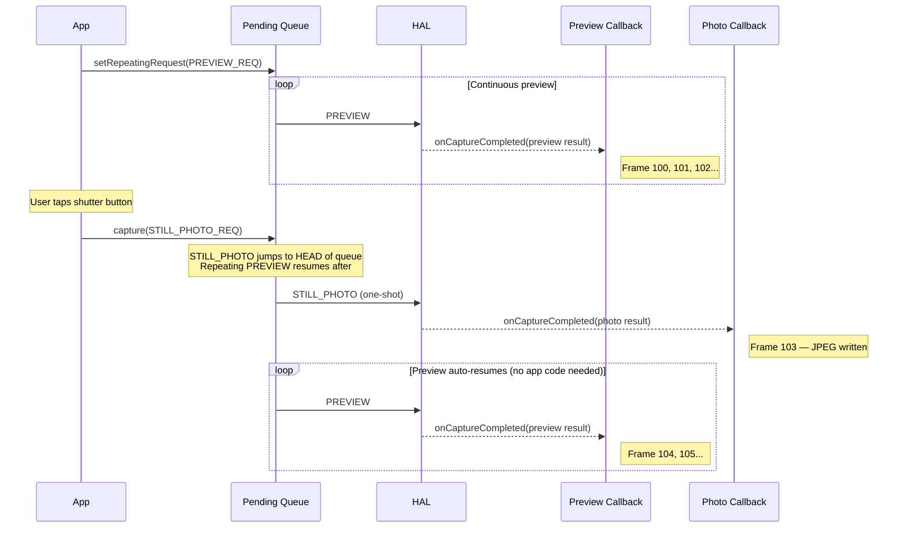
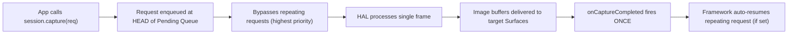
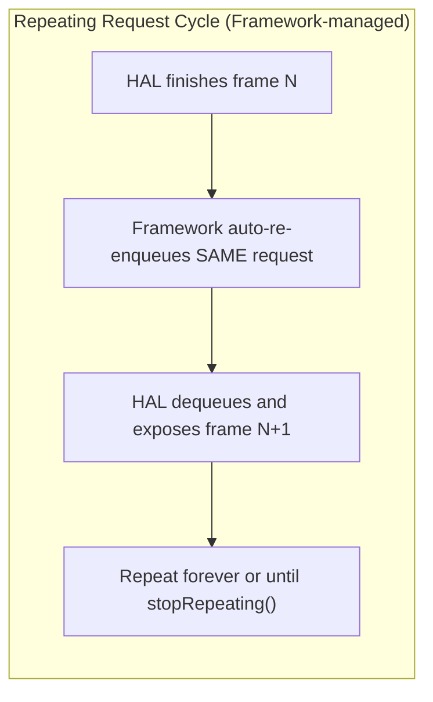
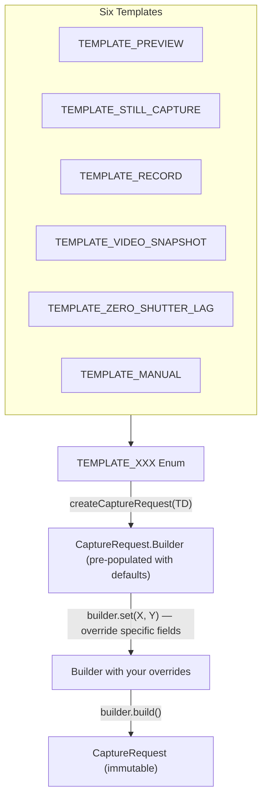

---
sidebar_position: 11
title: "Chapter 11: Capture Types"
description: Learn the three Camera2 capture types — one-shot (capture), burst (captureBurst), and repeating (setRepeatingRequest) — plus built-in templates (TEMPLATE_PREVIEW, TEMPLATE_STILL_CAPTURE, TEMPLATE_RECORD, and more).
keywords: [Camera2 capture types, one-shot capture, burst capture, repeating request, captureBurst, setRepeatingRequest, TEMPLATE_PREVIEW, TEMPLATE_STILL_CAPTURE, camera templates]
---

## 11.1 Three Ways to Feed the Pipeline

In [Chapter 10](the-camera2-pipeline.md) you saw how requests travel through the Camera2 pipeline: from the Pending Queue to the In-Flight Queue to the HAL to your callback and output surfaces. But *how you submit* those requests matters enormously. Camera2 gives you three submission mechanisms, each with fundamentally different behavior:

1. **One-shot** (`capture()`) — execute a single request once
2. **Burst** (`captureBurst()`) — execute a list of requests contiguously, back-to-back
3. **Repeating** (`setRepeatingRequest()`) — execute the same request continuously forever (or until interrupted)

On top of those three submission modes, the framework provides six **capture templates** that pre-populate a `CaptureRequest.Builder` with sensible defaults for common use cases (preview, still capture, video recording, zero-shutter-lag, manual control, etc.).

By the end of this chapter you will know exactly when to use each capture type and template — including why preview always uses repeating requests, why burst is the only way to do exposure bracketing, and why still photos use one-shot even when a preview is running.

The Android Camera Parameters app ([GitHub](https://github.com/zoozooll/AndroidCameraParameters), [Play Store](https://play.google.com/store/apps/details?id=com.minininja.cameraparams)) demonstrates all three capture types in its **Capture Demo** tab. Flip between "Preview (Repeating)," "Single Photo (One-Shot)," and "Burst (3 Frames)" modes to see the callback behavior and timing differences live on your device.

## 11.2 One-Shot: capture()

The simplest submission mode is **one-shot capture** via `CameraCaptureSession.capture()`. It does exactly what it says on the tin: submits a single `CaptureRequest` to the pipeline, executes it exactly once, and is done.

```kotlin
// One-shot: capture a single still frame to JPEG ImageReader
fun captureStillPhoto() {
    val builder = cameraDevice.createCaptureRequest(CameraDevice.TEMPLATE_STILL_CAPTURE)
    builder.addTarget(jpegReader.surface)
    builder.set(CaptureRequest.JPEG_QUALITY, 100)
    builder.set(CaptureRequest.CONTROL_AF_MODE, CaptureRequest.CONTROL_AF_MODE_CONTINUOUS_PICTURE)
    builder.set(CaptureRequest.CONTROL_AE_MODE, CaptureRequest.CONTROL_AE_MODE_ON)

    val request = builder.build()

    captureSession.capture(request, object : CameraCaptureSession.CaptureCallback() {
        override fun onCaptureCompleted(
            session: CameraCaptureSession,
            request: CaptureRequest,
            result: TotalCaptureResult
        ) {
            super.onCaptureCompleted(session, request, result)
            Log.d("Capture", "One-shot photo done. Frame #${result.frameNumber}")
        }
    }, backgroundHandler)
}
```

### When to Use One-Shot

| Use Case | Why One-Shot? |
|----------|--------------|
| Single still photograph | Execute exactly once per shutter click |
| Single AF/AE trigger | Fire `CONTROL_AF_TRIGGER_START` for one tap-to-focus event |
| Snapshot during video | Grab one high-res frame while a repeating video request is active |
| Capture a single RAW frame | RAW + JPEG dual capture for one photo |

### How One-Shot Interacts with the Repeating Preview

A critical design pattern in Camera2 is: **preview runs as a repeating request, and still photos are injected as one-shot requests**. The one-shot jumps ahead of the repeating request in the Pending Queue (as we discussed in Chapter 10's queue model), so it executes immediately. After the one-shot completes, the framework automatically resumes the repeating preview request — you don't need to resubmit it.



:::tip
This auto-resume behavior is baked into the Camera2 framework. You never need to manually "restart preview" after a one-shot capture — the framework re-enqueues the repeating request for you.
:::

### One-Shot Execution Flow



## 11.3 Burst: captureBurst()

Where `capture()` submits one request, `captureBurst()` submits a **`List&lt;CaptureRequest&gt;`** and guarantees that all N frames in the list execute **contiguously and in order, with no interleaving frames from other sources (including the repeating request)**.

This atomic, gap-free guarantee is what makes burst capture essential for:

- **Exposure bracketing** — Capture 3-5 frames at ±1EV, ±2EV, then merge them into HDR
- **Focus bracketing** — Sweep through focus distances, then stack for depth-of-field effects
- **Action / motion capture** — Shoot 10-30 frames of a fast-moving subject, then pick the sharpest
- **Slow-motion video (high-speed)** — `createHighSpeedRequestList()` + constrained high-speed burst
- **3A convergence sampling** — Fire AF/AE trigger, then burst until converged

```kotlin
// Burst: 3-frame exposure bracketing (-2EV, 0EV, +2EV)
fun captureExposureBracket() {
    val baseIso = 100
    val baseExposure = 10_000_000L  // 10ms = "0EV" baseline

    val burstList: MutableList<CaptureRequest> = mutableListOf()

    // Frame 0: -2EV (4x shorter exposure = darker)
    burstList += cameraDevice.createCaptureRequest(CameraDevice.TEMPLATE_STILL_CAPTURE).apply {
        addTarget(jpegReader.surface)
        set(CaptureRequest.SENSOR_SENSITIVITY, baseIso)
        set(CaptureRequest.SENSOR_EXPOSURE_TIME, baseExposure / 4)
        set(CaptureRequest.CONTROL_AE_MODE, CaptureRequest.CONTROL_AE_MODE_OFF)
    }.build()

    // Frame 1: 0EV (correct exposure)
    burstList += cameraDevice.createCaptureRequest(CameraDevice.TEMPLATE_STILL_CAPTURE).apply {
        addTarget(jpegReader.surface)
        set(CaptureRequest.SENSOR_SENSITIVITY, baseIso)
        set(CaptureRequest.SENSOR_EXPOSURE_TIME, baseExposure)
        set(CaptureRequest.CONTROL_AE_MODE, CaptureRequest.CONTROL_AE_MODE_OFF)
    }.build()

    // Frame 2: +2EV (4x longer exposure = brighter)
    burstList += cameraDevice.createCaptureRequest(CameraDevice.TEMPLATE_STILL_CAPTURE).apply {
        addTarget(jpegReader.surface)
        set(CaptureRequest.SENSOR_SENSITIVITY, baseIso)
        set(CaptureRequest.SENSOR_EXPOSURE_TIME, baseExposure * 4)
        set(CaptureRequest.CONTROL_AE_MODE, CaptureRequest.CONTROL_AE_MODE_OFF)
    }.build()

    captureSession.captureBurst(burstList, object : CameraCaptureSession.CaptureCallback() {
        private var completedCount = 0

        override fun onCaptureCompleted(
            session: CameraCaptureSession,
            request: CaptureRequest,
            result: TotalCaptureResult
        ) {
            super.onCaptureCompleted(session, request, result)
            completedCount++
            Log.d("Burst", "Burst frame $completedCount/${burstList.size} done. Frame #${result.frameNumber}")

            if (completedCount == burstList.size) {
                Log.d("Burst", "All $burstList.size bracketed frames captured!")
                // TODO: Merge HDR, focus stack, or let user pick the best frame
            }
        }
    }, backgroundHandler)
}
```

### The Contiguous Guarantee in Action

The key property of burst is that **the entire list is enqueued atomically** — even if a `setRepeatingRequest()` is active, the N burst frames will all run back-to-back before the repeating request resumes. The repeating request is not interleaved between burst frames.

```mermaid
flowchart TB
    subgraph QueueBefore ["Before Burst Submit"]
        direction LR
        R1["PREVIEW (repeating)"] --> R2["PREVIEW (repeating)"] --> R3["PREVIEW (repeating)"]
    end

    subgraph Arrow ["app calls captureBurst([B1,B2,B3])"]
        style Arrow fill:#fff3e0
    end

    subgraph QueueAfter ["After Burst Submit (atomic enqueue)"]
        direction LR
        B1["BURST FRAME 1"] --> B2["BURST FRAME 2"] --> B3["BURST FRAME 3"] --> R4["PREVIEW (repeating) resumes"] --> R5["PREVIEW"]
    end

    QueueBefore --> Arrow --> QueueAfter

    Note over B1,B3: No preview frames sneak in between!
```

### Burst Size Limits

The maximum burst size you can submit in a single `captureBurst()` call is determined by:
- `CameraCharacteristics.REQUEST_MAX_NUM_OUTPUT_RAW` — for RAW outputs
- `CameraCharacteristics.REQUEST_MAX_NUM_OUTPUT_PROC` — for processed (YUV/JPEG) outputs
- Practical hardware bandwidth (4K bursts will be shorter than 1080p bursts)

For typical FULL devices, processed JPEG bursts of 10-50 frames are fine. RAW bursts may be limited to 5-10 frames depending on sensor and memory.

### High-Speed Burst for Slow-Motion

For slow-motion video, Camera2 provides `CameraDevice.createHighSpeedRequestList()` which converts a normal `CaptureRequest` into a list of burst requests suitable for high-speed, constrained-capture video (e.g., 120fps or 240fps). This is paired with `CameraCaptureSession.captureBurst()` and requires the `CONSTRAINED_HIGH_SPEED_VIDEO` capability:

```kotlin
// Burst: High-speed slow-motion (120fps)
fun captureHighSpeedSlowMo() {
    val capabilities = characteristics.get(CameraCharacteristics.REQUEST_AVAILABLE_CAPABILITIES)
    val supportsHighSpeed = capabilities?.contains(
        CameraCharacteristics.REQUEST_AVAILABLE_CAPABILITIES_CONSTRAINED_HIGH_SPEED_VIDEO
    ) ?: false

    if (!supportsHighSpeed) {
        Log.w("HighSpeed", "Device does not support constrained high-speed video")
        return
    }

    // Build a single base request (targeting the MediaRecorder Surface)
    val baseBuilder = cameraDevice.createCaptureRequest(CameraDevice.TEMPLATE_RECORD)
    baseBuilder.addTarget(mediaRecorderSurface)
    val baseRequest = baseBuilder.build()

    // Expand into high-speed burst list — framework optimizes for 120fps
    val highSpeedBurst = cameraDevice.createHighSpeedRequestList(listOf(baseRequest))

    // Submit the optimized burst list via captureBurst
    captureSession.captureBurst(highSpeedBurst, highSpeedCallback, backgroundHandler)
}
```

## 11.4 Repeating: setRepeatingRequest()

The workhorse of Camera2 is the **repeating request**, submitted via `CameraCaptureSession.setRepeatingRequest()`. Instead of executing once, the framework re-enqueues *the same request* after every frame, forever — producing a continuous stream of frames at the hardware's native frame rate.

```kotlin
// Repeating: Start camera preview (30fps continuous stream)
fun startPreview() {
    val builder = cameraDevice.createCaptureRequest(CameraDevice.TEMPLATE_PREVIEW)
    builder.addTarget(previewSurface)
    builder.set(CaptureRequest.CONTROL_AF_MODE, CaptureRequest.CONTROL_AF_MODE_CONTINUOUS_PICTURE)
    builder.set(CaptureRequest.CONTROL_AE_MODE, CaptureRequest.CONTROL_AE_MODE_ON)
    builder.set(CaptureRequest.CONTROL_AWB_MODE, CaptureRequest.CONTROL_AWB_MODE_AUTO)

    val repeatingRequest = builder.build()

    captureSession.setRepeatingRequest(
        repeatingRequest,
        object : CameraCaptureSession.CaptureCallback() {
            private var frameCount = 0
            private var lastFpsLogMs = 0L

            override fun onCaptureCompleted(
                session: CameraCaptureSession,
                request: CaptureRequest,
                result: TotalCaptureResult
            ) {
                super.onCaptureCompleted(session, request, result)
                frameCount++
                val now = System.currentTimeMillis()
                if (now - lastFpsLogMs > 1000) {
                    Log.d("Preview", "Preview FPS: $frameCount")
                    frameCount = 0
                    lastFpsLogMs = now
                }
            }
        },
        backgroundHandler
    )
}
```

### Why Preview *Must* Use Repeating Requests

If you tried to implement a 30fps preview using `capture()` called 30 times per second from a timer, you would:
1. Waste CPU re-submitting identical requests every 33ms
2. Accumulate drift if your timer is late
3. Get frame gaps if one-shot callbacks block
4. Fight with the framework's queue management

The repeating request is handled entirely inside the framework/HAL. After each frame completes, the HAL automatically schedules the next exposure — no app-thread involvement. This produces smooth, gap-free preview with zero app CPU overhead.



### Stopping Repeating Requests

To stop the repeating stream, call `stopRepeating()`. This removes the repeating request from the queue but does not flush already-in-flight frames. Call `abortCaptures()` to forcibly flush everything (and trigger `onCaptureFailed` with `REASON_FLUSHED` for in-flight frames).

```kotlin
// Temporarily pause preview
fun pausePreview() {
    captureSession.stopRepeating()
    Log.d("Preview", "Repeating stopped. In-flight frames will still complete.")
}

// Emergency stop — drop everything right now
fun emergencyStopAllCaptures() {
    captureSession.stopRepeating()
    captureSession.abortCaptures()
    // All in-flight frames will fail with REASON_FLUSHED
}
```

### Repeating Requests Are Also for Video Recording

In addition to preview, repeating requests are used for **video recording** (targeting a `MediaRecorder` or `MediaCodec` `Surface`) and **continuous image analysis** (targeting a low-res YUV `ImageReader` for face detection, ML inference, etc.).

The pattern is always the same: set it once, let it stream, update the request parameters when you want to change settings (e.g., change digital zoom mid-stream by updating the crop region in a new repeating request).

```kotlin
// Repeating: Update zoom level live during preview/video
fun updateDigitalZoom(cropRegion: Rect) {
    val builder = cameraDevice.createCaptureRequest(CameraDevice.TEMPLATE_PREVIEW)
    builder.addTarget(previewSurface)
    builder.addTarget(mediaRecorderSurface)
    builder.set(CaptureRequest.SCALER_CROP_REGION, cropRegion)
    builder.set(CaptureRequest.CONTROL_AF_MODE, CaptureRequest.CONTROL_AF_MODE_CONTINUOUS_PICTURE)

    // Replace the old repeating request with a new one (same targets, new crop)
    captureSession.setRepeatingRequest(builder.build(), currentCallback, backgroundHandler)
    Log.d("Zoom", "Repeating request updated with crop ${cropRegion.width()}x${cropRegion.height()}")
}
```

## 11.5 Capture Templates

Every `CaptureRequest.Builder` starts from a **template**: you call `cameraDevice.createCaptureRequest(TEMPLATE_XXX)` and the framework populates the builder with hardware-optimized defaults for that use case. You then override only the specific settings you need.

Templates exist because a phone's camera pipeline has dozens of knobs (noise reduction strength, edge enhancement, tone curve, anti-banding mode, frame rate range, ...). Templates set sensible baselines so you don't have to configure every single one from scratch.



### The Six Templates, What They Preconfigure, and When to Use Them

| Template | Use Case | Key Preconfigured Settings |
|----------|----------|---------------------------|
| `TEMPLATE_PREVIEW` | Live viewfinder / preview | Low-latency priority, 3A (AF/AE/AWB) in continuous auto, modest NR/sharpen, high frame rate (30fps). Trades minor quality for smoothness. |
| `TEMPLATE_STILL_CAPTURE` | Single-shot photo | Max quality priority, AF in picture mode, full NR/sharpen, high-quality JPEG encoding, may lower frame rate to improve quality for that one frame. |
| `TEMPLATE_RECORD` | Video recording | Stable frame rate (matches MediaRecorder output), continuous AF, audio-video sync timestamps, anti-banding enabled, medium NR — tuned for motion + compression. |
| `TEMPLATE_VIDEO_SNAPSHOT` | High-res still *during* video recording | Like STILL_CAPTURE but preserves video frame settings — grabs a high-res photo without stopping the video recording stream. |
| `TEMPLATE_ZERO_SHUTTER_LAG` | ZSL still capture (Chapter 14) | Builds a circular buffer of recent frames. When shutter is pressed, a *past* frame is returned for zero blackout. Requires burst capability and private reprocessing. |
| `TEMPLATE_MANUAL` | Manual / pro controls | All 3A modes set to OFF by default so you can manually set sensor exposure, ISO, lens focus, and color correction gains without interference. Baseline for a pro-camera UI. |

```kotlin
// Template examples — see what happens when you start with each one

// TEMPLATE_PREVIEW — smooth, low-latency
val previewBuilder = cameraDevice.createCaptureRequest(CameraDevice.TEMPLATE_PREVIEW)
val previewRequest = previewBuilder.build()
Log.d("Template", "PREVIEW AF_MODE = ${previewRequest.get(CaptureRequest.CONTROL_AF_MODE)}")
// ^ Typically CONTROL_AF_MODE_CONTINUOUS_PICTURE (always re-focusing)

// TEMPLATE_STILL_CAPTURE — highest quality per frame
val stillBuilder = cameraDevice.createCaptureRequest(CameraDevice.TEMPLATE_STILL_CAPTURE)
val stillRequest = stillBuilder.build()
Log.d("Template", "STILL_CAPTURE JPEG_QUALITY = ${stillRequest.get(CaptureRequest.JPEG_QUALITY)}")
// ^ Typically 100 (max quality encoding)

// TEMPLATE_MANUAL — all automatic controls disabled
val manualBuilder = cameraDevice.createCaptureRequest(CameraDevice.TEMPLATE_MANUAL)
val manualRequest = manualBuilder.build()
Log.d("Template", "MANUAL AE_MODE = ${manualRequest.get(CaptureRequest.CONTROL_AE_MODE)}")
Log.d("Template", "MANUAL AF_MODE = ${manualRequest.get(CaptureRequest.CONTROL_AF_MODE)}")
Log.d("Template", "MANUAL AWB_MODE = ${manualRequest.get(CaptureRequest.CONTROL_AWB_MODE)}")
// ^ Typically AE_MODE_OFF, AF_MODE_OFF, AWB_MODE_OFF — manual from the start
```

:::tip
Always start with a template and override specific fields. Starting from `TEMPLATE_PREVIEW` and then overriding 2-3 settings (e.g., crop region for zoom, AE target bias for exposure compensation) is massively less error-prone than creating a request from an empty template (which isn't even possible — every `createCaptureRequest` requires a template).
:::

## 11.6 Comparing the Three Capture Types

| Dimension | One-Shot `capture()` | Burst `captureBurst()` | Repeating `setRepeatingRequest()` |
|-----------|---------------------|----------------------|---------------------------------|
| **Execution** | Single request runs once | List of N requests runs contiguously | Same request runs every frame (auto re-enqueued) |
| **Priority** | Highest — jumps to HEAD of Pending Queue | High — all N frames inserted atomically at HEAD | Lowest — one-shot/burst cut in front and repeating resumes after |
| **Interruption** | Interrupts repeating; repeating resumes after | Interrupts repeating; entire burst completes before repeating resumes | Interrupted by any one-shot or burst; resumes automatically after |
| **Queue Behavior** | Single request enqueued | N requests enqueued contiguously (no gaps) | One conceptual request re-enqueued each cycle |
| **Typical Uses** | Single photo, single AF trigger, flash photo | Exposure bracketing, focus stacking, action burst, slow-motion, HDR | Preview, video recording, continuous ML analysis, live face detection |
| **Result Callback** | `onCaptureCompleted` fires exactly once | `onCaptureCompleted` fires N times (once per burst frame) | `onCaptureCompleted` fires continuously for every frame (30-60x/sec) |

```mermaid
quadrantChart
    title Capture Type Usage Patterns
    x-axis ["Low Frame Count", "High Frame Count"]
    y-axis ["Single Configuration", "Varying Per-Frame Config"]
    quadrant-1 ["Burst: Exposure / Focus Bracketing"]
    quadrant-2 ["Burst: High-Speed Slow-Mo"]
    quadrant-3 ["One-Shot: Still Photo"]
    quadrant-4 ["Repeating: Preview + Video"]
    "Single JPEG capture": [0.15, 0.2]
    "Tap-to-focus trigger": [0.1, 0.15]
    "3-frame HDR bracket": [0.4, 0.75]
    "7-frame focus stack": [0.45, 0.8]
    "120fps slow-mo 2sec": [0.85, 0.25]
    "CameraFinder preview 30fps": [0.9, 0.1]
    "4K video recording": [0.88, 0.18]
```

## 11.7 Seeing Capture Types in the Android Camera Parameters App

Open the Android Camera Parameters app ([GitHub](https://github.com/zoozooll/AndroidCameraParameters), [Play Store](https://play.google.com/store/apps/details?id=com.minininja.cameraparams)) and navigate to the **Capture Demo** tab. The app exposes all three capture types side-by-side:

- Tap **Start Preview** to call `setRepeatingRequest(TEMPLATE_PREVIEW)` and see a live `CaptureCallback` log (frames 1, 2, 3, ... scrolling every ~33ms)
- Tap **Take Photo** to inject a `capture(TEMPLATE_STILL_CAPTURE)` one-shot while preview is running. You'll see the callback count pause briefly for the high-quality frame, then resume seamlessly as repeating auto-resumes.
- Tap **Burst 5 Frames** to call `captureBurst(List<CaptureRequest(5)>)`. Observe that exactly 5 frames complete back-to-back before the preview scroll continues — proving the contiguous guarantee.

You can also inspect `REQUEST_MAX_NUM_OUTPUT_RAW` and `REQUEST_MAX_NUM_OUTPUT_PROC` in the **Raw JSON** tab to see your device's burst size limits.

## 11.8 Summary

| Concept | Key Takeaway |
|---------|-------------|
| **One-shot `capture()`** | Single request, runs once, highest priority. For still photos, AF triggers. Auto-resumes repeating after. |
| **Burst `captureBurst()`** | List&lt;CaptureRequest&gt; runs contiguously, no interleaving. For bracketing, motion, slow-mo. Whole list jumps queue atomically. |
| **Repeating `setRepeatingRequest()`** | One request streams continuously. Framework auto-re-enqueues. For preview, video, analysis. Lowest priority. |
| **Templates** | Six baselines populate Builder with defaults. Start with TEMPLATE_PREVIEW/STILL_CAPTURE/RECORD/ZSL/MANUAL and override only what you need. |
| **Interruption rules** | One-shot and burst *always* preempt repeating. Repeating auto-resumes after. Burst frames are never split apart. |

## What's Next

In [Chapter 12: CameraCharacteristics Deep Dive](cameracharacteristics-deep-dive.md), we'll dig into the static metadata object that describes *what your camera can even do* before you open it. We'll break down hardware levels (LEGACY → LIMITED → FULL → LEVEL_3 → EXTERNAL), the capability flag system (MANUAL_SENSOR, RAW, DEPTH_OUTPUT, etc.), and how to query all of it at runtime to write apps that work across 10,000+ Android device models.
