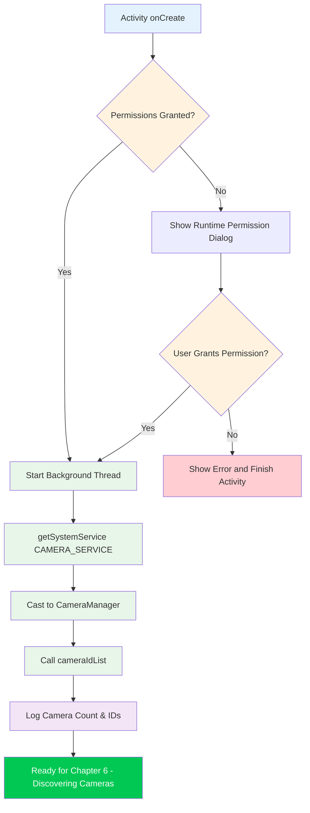

---
sidebar_position: 5
title: "Chapter 5: Creating Your First Camera2 Project"
description: Set up a complete Android Camera2 project from scratch. Learn about camera permissions, CameraManager initialization, background threading with HandlerThread, and the project configuration needed for TextureView hardware acceleration.
keywords: [Camera2 project setup, Android camera permissions, HandlerThread, CameraManager, TextureView hardwareAccelerated]
---

Welcome to the hands-on portion of the Camera2 tutorial series. In the previous chapters, you learned about smartphone camera hardware and the theoretical foundations of the Camera2 API. Now it's time to roll up your sleeves and write real code. By the end of this chapter, you'll have a working Android project that successfully initializes the Camera2 API and accesses the CameraManager service — the critical first step before you can enumerate cameras, open devices, or show previews.

If you want to see a production example of everything we'll build in this series, check out the **Android Camera Parameters** app on [GitHub](https://github.com/zoozooll/AndroidCameraParameters) and [Google Play](https://play.google.com/store/apps/details?id=com.minininja.cameraparams). It demonstrates advanced Camera2 usage including full CameraCharacteristics enumeration, manual capture controls, and multi-camera support.

## Why Start with Project Setup?

Before you can write a single line of Camera2 code, your application must be properly configured. Camera2 is a low-level, performance-sensitive API, and cutting corners on setup will lead to mysterious crashes, ANRs (Application Not Responding), or frames that never arrive. The three pillars of a correct Camera2 project setup are:

1. **Permissions** — The Android framework restricts camera access at both install-time (manifest) and runtime (user consent).
2. **Threading Architecture** — Camera2 callbacks must never block the main thread; we need a dedicated background thread.
3. **View Configuration** — If you plan to use TextureView for preview (the recommended approach), hardware acceleration must be enabled.

Let's tackle each one systematically.

## Step 1: Creating a New Android Studio Project

Launch Android Studio and create a new project. For this tutorial series, we recommend:

- **Template**: Empty Activity (the simplest starting point)
- **Language**: Kotlin (the modern standard for Android development; all examples in this series are in Kotlin)
- **Minimum SDK**: API 21 (Lollipop) — this is the first SDK level that supports Camera2 natively. If you need to support external USB cameras via OTG, target API 23 or higher. If you need scoped storage support for photo saving (Chapter 9), API 29+ is relevant, but we'll handle backward compatibility there.
- **Build configuration language**: Kotlin DSL or Groovy — either works; our examples will be build-system agnostic.

Once the project is generated, open your module-level `build.gradle` (or `build.gradle.kts`) file. The default Empty Activity template includes most dependencies you need, but verify you have at minimum:

```kotlin
dependencies {
    implementation("androidx.core:core-ktx:1.12.0")
    implementation("androidx.appcompat:appcompat:1.6.1")
    implementation("com.google.android.material:material:1.11.0")
    implementation("androidx.constraintlayout:constraintlayout:2.1.4")
    // Camera2 is part of the Android framework, so NO extra dependency is needed
    // for the basic API. androidx.camera.camera2 is for CameraX interop only.
}
```

:::tip
You do **not** need to add any external Camera2 dependency. The entire `android.hardware.camera2` package is part of the Android framework. The Jetpack CameraX library is a separate higher-level abstraction built on top of Camera2; we are using the **native Camera2 API directly** in this tutorial.
:::

## Step 2: Declaring Permissions in AndroidManifest.xml

Every camera application must declare the `CAMERA` permission in `AndroidManifest.xml`. This tells the Google Play Store that your app uses the camera hardware, and it enables the runtime permission dialog on Android 6.0 (API 23) and above.

Open `app/src/main/AndroidManifest.xml` and add the following elements **as children of the root `<manifest>` tag** (not inside `<application>`):

```xml
<?xml version="1.0" encoding="utf-8"?>
<manifest xmlns:android="http://schemas.android.com/apk/res/android"
    xmlns:tools="http://schemas.android.com/tools">

    <!-- ✅ Camera permission declaration -->
    <uses-permission android:name="android.permission.CAMERA" />

    <!-- Optional feature declarations (used by Google Play filtering) -->
    <uses-feature
        android:name="android.hardware.camera"
        android:required="true" />
    <uses-feature
        android:name="android.hardware.camera.autofocus"
        android:required="false" />

    <application
        android:allowBackup="true"
        ...>
        <activity
            android:name=".MainActivity"
            android:exported="true"
            android:hardwareAccelerated="true">
            ...
        </activity>
    </application>
</manifest>
```

Let's break down the important parts:

### `<uses-permission android:name="android.permission.CAMERA" />`

This is the core permission. Without it, any call to the camera service will throw a `SecurityException`. On API 22 and below, users grant this at install time; on API 23+, you must also request it at runtime (covered next).

### `<uses-feature android:name="android.hardware.camera" android:required="true" />`

This declaration tells Google Play to filter your app onto devices that have at least one camera. Set `android:required="false"` if your app can function without a camera (for example, a gallery app with optional capture). If you don't declare this at all, Google Play assumes camera is **not** required, which may install your app on devices without cameras.

### `android:hardwareAccelerated="true"` on the `<activity>`

This is **critical** for TextureView preview rendering. TextureView uses the GPU composition pipeline to display camera frames efficiently. Without hardware acceleration enabled at the Activity or Application level, TextureView will silently fail to render or display a black screen. The default in modern Android is `true` for the entire application, but it is good practice to declare it explicitly on any Activity that hosts a TextureView.

## Step 3: Runtime Permission Request

On Android 6.0 (Marshmallow, API 23) and later, declaring the permission in the manifest is only half the story. You must also **explicitly ask the user for permission** at runtime, using the Activity Compat library. The standard pattern is:

1. Check if permission is already granted with `ContextCompat.checkSelfPermission`.
2. If granted, proceed to camera initialization.
3. If not granted, call `ActivityCompat.requestPermissions` to show the system dialog.
4. Handle the result in `onRequestPermissionsResult`.

Here's the complete permission flow in `MainActivity.kt`:

```kotlin
package com.example.camera2tutorial

import android.Manifest
import android.content.pm.PackageManager
import android.os.Bundle
import android.widget.Toast
import androidx.appcompat.app.AppCompatActivity
import androidx.core.app.ActivityCompat
import androidx.core.content.ContextCompat

class MainActivity : AppCompatActivity() {

    override fun onCreate(savedInstanceState: Bundle?) {
        super.onCreate(savedInstanceState)
        setContentView(R.layout.activity_main)

        if (allPermissionsGranted()) {
            initializeCamera()
        } else {
            ActivityCompat.requestPermissions(
                this,
                REQUIRED_PERMISSIONS,
                REQUEST_CODE_PERMISSIONS
            )
        }
    }

    private fun allPermissionsGranted() = REQUIRED_PERMISSIONS.all {
        ContextCompat.checkSelfPermission(baseContext, it) == PackageManager.PERMISSION_GRANTED
    }

    override fun onRequestPermissionsResult(
        requestCode: Int,
        permissions: Array<out String>,
        grantResults: IntArray
    ) {
        super.onRequestPermissionsResult(requestCode, permissions, grantResults)
        if (requestCode == REQUEST_CODE_PERMISSIONS) {
            if (allPermissionsGranted()) {
                initializeCamera()
            } else {
                Toast.makeText(
                    this,
                    "Camera permission is required to use this app.",
                    Toast.LENGTH_LONG
                ).show()
                finish()
            }
        }
    }

    private fun initializeCamera() {
        // TODO: We'll implement this method in the sections below.
        // This is where CameraManager setup will happen.
        // For now, just log success.
        android.util.Log.d(TAG, "Permissions granted. Ready to initialize camera.")
    }

    companion object {
        private const val TAG = "Camera2Tutorial"
        private const val REQUEST_CODE_PERMISSIONS = 10
        private val REQUIRED_PERMISSIONS = arrayOf(Manifest.permission.CAMERA)
    }
}
```

### Why `allPermissionsGranted()` Uses an Array Pattern

Even though we only need `CAMERA` right now, defining a `REQUIRED_PERMISSIONS` array makes it trivial to add additional permissions later (such as `WRITE_EXTERNAL_STORAGE` for legacy photo saving, or `RECORD_AUDIO` for video). The `all { ... }` function checks that **every** permission in the array is granted before proceeding.

## Step 4: The Background Thread (HandlerThread)

This is the single most commonly-missed detail in beginner Camera2 code, and it causes **random, hard-to-reproduce bugs**. Let's understand why Camera2 needs a background thread, then implement it correctly.

### Why Camera2 MUST NOT Run on the Main Thread

The Android main (UI) thread is responsible for:
- Drawing the UI at 60-120 FPS
- Handling user touch events
- Dispatching lifecycle callbacks
- Running all Activity/Fragment code by default

The Camera2 API delivers several critical callbacks synchronously:
- `CameraDevice.StateCallback` — when a camera opens, disconnects, or errors
- `CameraCaptureSession.StateCallback` — when a capture session is configured
- `CameraCaptureSession.CaptureCallback` — for every single frame (up to 60+ times per second!)

If these callbacks run on the main thread, two catastrophic things happen:

1. **Jank and dropped frames**: If processing a callback takes even 10ms, a 60FPS frame is skipped, and the user sees stutter.
2. **Deadlocks and ANRs**: Some Camera2 methods (like `close()`) are synchronous and wait for callbacks. If the callback must run on the same thread that called `close()`, you get a deadlock.

The solution is a **dedicated background thread** with its own Looper, implemented via `HandlerThread`.

### Implementing HandlerThread Correctly

The lifecycle of the background thread must match the lifecycle of the camera operations. We start the thread when the Activity starts/resumes, and we quit the thread when the Activity stops/pauses.

```kotlin
package com.example.camera2tutorial

import android.Manifest
import android.content.Context
import android.content.pm.PackageManager
import android.hardware.camera2.CameraManager
import android.os.Bundle
import android.os.Handler
import android.os.HandlerThread
import android.util.Log
import android.widget.Toast
import androidx.appcompat.app.AppCompatActivity
import androidx.core.app.ActivityCompat
import androidx.core.content.ContextCompat

class MainActivity : AppCompatActivity() {

    // --- Background threading components ---
    private lateinit var backgroundThread: HandlerThread
    private lateinit var backgroundHandler: Handler

    override fun onCreate(savedInstanceState: Bundle?) {
        super.onCreate(savedInstanceState)
        setContentView(R.layout.activity_main)

        if (allPermissionsGranted()) {
            initializeCamera()
        } else {
            ActivityCompat.requestPermissions(
                this,
                REQUIRED_PERMISSIONS,
                REQUEST_CODE_PERMISSIONS
            )
        }
    }

    override fun onResume() {
        super.onResume()
        startBackgroundThread()
        // Re-initialize if permissions were granted while app was in background
        if (allPermissionsGranted() && this::cameraManager.isInitialized) {
            // (cameraManager is declared below)
        }
    }

    override fun onPause() {
        stopBackgroundThread()
        super.onPause()
    }

    private fun startBackgroundThread() {
        backgroundThread = HandlerThread("Camera2Background").apply {
            start()
        }
        backgroundHandler = Handler(backgroundThread.looper)
        Log.d(TAG, "Background thread started: ${backgroundThread.name}")
    }

    private fun stopBackgroundThread() {
        backgroundThread.quitSafely()
        try {
            backgroundThread.join(1000) // Wait up to 1 second for cleanup
            Log.d(TAG, "Background thread stopped cleanly")
        } catch (e: InterruptedException) {
            Log.e(TAG, "Interrupted while joining background thread", e)
        }
    }

    // --- CameraManager initialization ---
    private lateinit var cameraManager: CameraManager

    private fun initializeCamera() {
        cameraManager = getSystemService(Context.CAMERA_SERVICE) as CameraManager

        val cameraIdList = cameraManager.cameraIdList
        Log.d(TAG, "Successfully accessed CameraManager. Found ${cameraIdList.size} camera(s).")
        cameraIdList.forEachIndexed { index, cameraId ->
            Log.d(TAG, "Camera $index: ID = $cameraId")
        }

        Toast.makeText(
            this,
            "CameraManager initialized! Found ${cameraIdList.size} camera(s).",
            Toast.LENGTH_LONG
        ).show()
    }

    // --- Permission handling (same as before) ---
    private fun allPermissionsGranted() = REQUIRED_PERMISSIONS.all {
        ContextCompat.checkSelfPermission(baseContext, it) == PackageManager.PERMISSION_GRANTED
    }

    override fun onRequestPermissionsResult(
        requestCode: Int,
        permissions: Array<out String>,
        grantResults: IntArray
    ) {
        super.onRequestPermissionsResult(requestCode, permissions, grantResults)
        if (requestCode == REQUEST_CODE_PERMISSIONS) {
            if (allPermissionsGranted()) {
                initializeCamera()
            } else {
                Toast.makeText(
                    this,
                    "Camera permission is required to use this app.",
                    Toast.LENGTH_LONG
                ).show()
                finish()
            }
        }
    }

    companion object {
        private const val TAG = "Camera2Tutorial"
        private const val REQUEST_CODE_PERMISSIONS = 10
        private val REQUIRED_PERMISSIONS = arrayOf(Manifest.permission.CAMERA)
    }
}
```

### Key Threading Patterns Explained

1. **`startBackgroundThread()` in `onResume()`**: Every time the Activity comes to the foreground, we create a fresh `HandlerThread`, start it, and create a `Handler` bound to the thread's `Looper`. This Handler will be passed to all Camera2 callback-accepting methods (`openCamera`, `createCaptureSession`, etc.).

2. **`stopBackgroundThread()` in `onPause()`**: Before the Activity goes to the background, we call `quitSafely()` on the thread. This tells the Looper to stop processing new messages after the current one finishes (unlike `quit()`, which discards pending messages). We then call `join(1000)` to block the main thread for at most one second while the background thread finishes its cleanup. This prevents resource leaks.

3. **Why `HandlerThread` instead of `CoroutineDispatcher`?** Camera2 predates Kotlin Coroutines by several years, and its callback system is fundamentally Handler/Looper-based. While you can use `Dispatchers.Default.asExecutor()` or wrap callbacks in `suspendCoroutine` for higher-level code, the underlying Camera2 API still needs a Looper thread for callbacks. Using `HandlerThread` directly is the canonical, documented approach in the official Android samples.

## Step 5: The Complete Initialization Flow (Combined)

Let's now look at the full sequence of events that must happen when your application starts. The order is critical: permissions → thread → CameraManager. If you reverse any step, the code will crash or behave inconsistently.



The flowchart above illustrates why each step exists:

- **Permission Gate**: The entire camera subsystem is protected; we cannot proceed until the user grants consent.
- **Thread Before CameraManager**: While `getSystemService()` itself is thread-safe, we want the background thread already running before we perform any callback-driven Camera2 operations (which start in the next chapter).
- **CameraManager → cameraIdList**: Calling `cameraIdList` is the cheapest way to verify that CameraManager is working. If this call succeeds without throwing, your manifest declaration, runtime permission, and service binding are all correct.

## Putting It All Together: Run and Verify

At this point, you have a complete, runnable Camera2 project that:
1. Creates an Android project with the correct SDK targets.
2. Declares the CAMERA permission in the manifest.
3. Requests the permission at runtime, handling both accept and reject paths.
4. Starts a dedicated HandlerThread in `onResume` and stops it cleanly in `onPause`.
5. Retrieves the `CAMERA_SERVICE` system service and casts it to `CameraManager`.
6. Calls `cameraIdList` and logs the number of cameras and their IDs.

### What You Should See When You Run It

1. On the first launch, Android shows the permission dialog: *"Allow Camera2Tutorial to take pictures and record video?"*
2. Tap **Allow**.
3. A Toast appears: *"CameraManager initialized! Found X camera(s)."*
4. In Logcat (filter by `Camera2Tutorial`), you should see entries like:
   ```
   D/Camera2Tutorial: Background thread started: Camera2Background
   D/Camera2Tutorial: Successfully accessed CameraManager. Found 4 camera(s).
   D/Camera2Tutorial: Camera 0: ID = 0
   D/Camera2Tutorial: Camera 1: ID = 1
   D/Camera2Tutorial: Camera 2: ID = 2
   D/Camera2Tutorial: Camera 3: ID = 3
   ```
5. When you press the Home button or navigate away, Logcat shows:
   ```
   D/Camera2Tutorial: Background thread stopped cleanly
   ```

If you see these logs, **congratulations**! You have successfully set up the foundation of a Camera2 application. There is no camera preview yet — that comes in Chapter 8 — but the plumbing is correct. If you get a `SecurityException`, double-check that you accepted the permission dialog. If `cameraIdList` returns an empty array, the device may have no cameras (unlikely on a phone) or the permission was denied.

## Troubleshooting Common Setup Errors

### `SecurityException: Lacking privileges to access camera service`

This means the runtime permission was not granted. Check that:
- You added `<uses-permission android:name="android.permission.CAMERA" />` to the manifest.
- You called `ActivityCompat.requestPermissions` with the correct request code.
- The user tapped **Allow** on the dialog.
- If you're testing on a physical device, go to Settings → Apps → Your App → Permissions and ensure Camera is enabled.

### `NullPointerException` on `backgroundHandler`

This happens if you try to use `backgroundHandler` before `startBackgroundThread()` runs. Make sure all Camera2 operations that accept a Handler only execute **after** `onResume` has been called and the thread is running. In our code, `initializeCamera()` is called from `onCreate`, but it only uses CameraManager synchronously; callbacks that need `backgroundHandler` will be added in later chapters and properly gated on `onResume`.

### `TextureView` shows a black screen in later chapters

If you skip ahead and add a TextureView now, ensure `android:hardwareAccelerated="true"` is set on your Activity in the manifest. Also make sure the TextureView is attached to the view hierarchy and visible in your layout XML.

## Summary

In this chapter, you built the complete scaffolding of an Android Camera2 application. You learned:

1. **Project Structure**: How to create a new Android Studio project with Empty Activity template, targeting API 21+, using Kotlin, and verifying that no external Camera2 dependencies are needed.
2. **Manifest Configuration**: The `CAMERA` permission declaration, `uses-feature` tags for Google Play filtering, and `hardwareAccelerated="true"` on the Activity for TextureView rendering.
3. **Runtime Permissions**: The full check → request → result cycle using `ContextCompat.checkSelfPermission` and `ActivityCompat.requestPermissions`, with handling for both the accept and deny paths.
4. **Background Threading**: Why Camera2 callbacks must not run on the main thread, and how to implement a properly lifecycle-managed `HandlerThread` + `Handler` pair with `startBackgroundThread()` in `onResume` and `stopBackgroundThread()` with `quitSafely()` + `join()` in `onPause`.
5. **CameraManager Initialization**: Retrieving the `CAMERA_SERVICE` system service, casting to `CameraManager`, calling `cameraIdList` to verify the service works, and logging the discovered camera IDs.

The code in this chapter is the bedrock for everything that follows. The Android Camera Parameters app ([GitHub](https://github.com/zoozooll/AndroidCameraParameters), [Google Play](https://play.google.com/store/apps/details?id=com.minininja.cameraparams)) uses exactly these patterns — multiple `HandlerThread`s for different workloads, careful permission checking, and robust lifecycle management.

## What's Next

Now that `CameraManager` is successfully initialized and we have a list of camera IDs, the next step is to **query the capabilities of each camera**. In **Chapter 6: Discovering Cameras**, you will:

- Learn what camera ID strings represent (and why you should never hardcode assumptions about them).
- Distinguish front-facing, back-facing, and external (USB OTG) cameras using `LENS_FACING`.
- Query the hardware level of each camera (`INFO_SUPPORTED_HARDWARE_LEVEL`) to determine if it's LEGACY, LIMITED, FULL, or LEVEL_3.
- Iterate over every camera on the device and log its properties using `CameraCharacteristics`.

By the end of Chapter 6, you'll have a working camera enumeration utility that extracts real Camera2 metadata from the device — something you can already use to compare camera hardware across phones!
