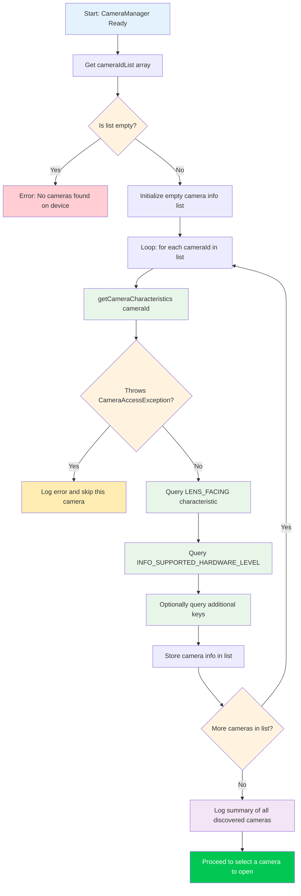

---
sidebar_position: 6
title: "Chapter 6: Discovering Cameras"
description: Enumerate and query every camera on an Android device using CameraCharacteristics. Learn camera ID semantics, lens facing directions (front/back/external), external USB OTG cameras, and the hardware level hierarchy from LEGACY through LEVEL_3.
keywords: [CameraCharacteristics, LENS_FACING, camera enumeration, INFO_SUPPORTED_HARDWARE_LEVEL, external USB camera]
---

In Chapter 5, you successfully initialized `CameraManager` and retrieved the list of camera IDs — but a string like `"0"` or `"2"` tells you nothing about what that camera actually **is**. Is it the ultra-wide rear camera? The selfie cam? An external USB webcam attached via OTG? This chapter teaches you how to answer those questions using `CameraCharacteristics`, the metadata container that describes every capability of a camera device.

For a production-grade reference implementation of camera enumeration and characteristics inspection, look at the **Android Camera Parameters** app ([GitHub](https://github.com/zoozooll/AndroidCameraParameters), [Google Play](https://play.google.com/store/apps/details?id=com.minininja.cameraparams)). It walks every key in `CameraCharacteristics` for every camera on the device and presents the results in a searchable, filterable UI — exactly the tool you'll want when debugging hardware-specific Camera2 issues.

## Understanding Camera IDs

Before diving into characteristics, we need to address a fundamental source of confusion for new Camera2 developers: **what do the numeric camera ID strings actually mean?**

When you call `cameraManager.cameraIdList`, you get back an `Array&lt;String&gt;` — for example: `["0", "1", "2", "3", "4"]`. It is **tempting** to hardcode assumptions like:
- `"0"` = rear wide camera
- `"1"` = front camera
- `"2"` = telephoto

**Never do this.** The mapping of ID → physical camera is:
1. **Device-specific**: A Pixel 8 may use ID `"1"` for the front camera, while a Samsung Galaxy S24 uses ID `"3"`.
2. **Version-specific**: An OEM OTA update can change the ID list after a device ships.
3. **Rebuild-specific**: Some multi-camera logical devices (covered in a later Part III chapter) dynamically expose or hide underlying physical cameras based on modes.

The **only** correct approach is to **query the characteristics of every ID** and select a camera based on the properties you care about (lens facing, hardware level, focal length range, etc.). This is what well-written Camera2 apps do, and it is the pattern we will implement here.

## Camera Enumeration Flow

The overall algorithm for discovering cameras is straightforward on the surface, but has important edge cases around error handling. Let's first see the process as a flowchart, then implement it in code.



Key observations from the flowchart:
1. **Always handle empty ID lists**: Rare on phones, but common on Android TV, headless devices, or emulators without a virtual camera.
2. **Always wrap `getCameraCharacteristics` in try/catch**: A camera could be disconnected mid-enumeration (especially an external USB camera), or a locked-down device policy could restrict certain cameras.
3. **Iterate fully, then choose**: Collect all candidates first, then select the best one based on your criteria. Don't open the first "good" camera you find — you might miss a better one.

## Introducing CameraCharacteristics

`CameraCharacteristics` is an immutable, read-only key-value map that describes the hardware-level capabilities of a camera. It contains several hundred keys covering everything from lens focal length to sensor pixel array size to supported output formats.

You retrieve a characteristics object with:
```kotlin
val characteristics: CameraCharacteristics =
    cameraManager.getCameraCharacteristics(cameraId)
```

And you query individual keys with the generic `get` method:
```kotlin
val lensFacing: Int? = characteristics.get(CameraCharacteristics.LENS_FACING)
```

The return type is nullable (`Int?` in this case) because some keys are optional and may not be present on all devices. In practice, the keys we query in this chapter (`LENS_FACING` and `INFO_SUPPORTED_HARDWARE_LEVEL`) are guaranteed to be present for every valid camera, but it is still good practice to handle nulls defensively.

:::note
This chapter intentionally covers only `LENS_FACING` and `INFO_SUPPORTED_HARDWARE_LEVEL`. The deeper internals of `CameraCharacteristics` (sensor characteristics, output configurations, available capabilities) are the subject of Part III, Chapter 10: The CameraCharacteristics Encyclopedia. We're staying focused on the minimum information you need to pick a camera to open.
:::

## Key 1: LENS_FACING — Front, Back, or External

The first thing almost every camera app needs to know is which direction the lens points. Camera2 defines three constants:

| Constant | Value | Meaning | Typical Use Case |
|---|---|---|---|
| `LENS_FACING_BACK` | `0` | Camera is on the back of the device, facing away from the user | Photo capture, landscape video, AR |
| `LENS_FACING_FRONT` | `1` | Camera is on the front of the device, facing toward the user | Selfies, video calls |
| `LENS_FACING_EXTERNAL` | `2` | Camera is external to the device (e.g., USB OTG webcam) | External accessories, specialty cameras |

Here's how you convert the raw integer to a human-readable string:

```kotlin
fun lensFacingToString(facing: Int?): String = when (facing) {
    CameraCharacteristics.LENS_FACING_BACK -> "Back (LENS_FACING_BACK)"
    CameraCharacteristics.LENS_FACING_FRONT -> "Front (LENS_FACING_FRONT)"
    CameraCharacteristics.LENS_FACING_EXTERNAL -> "External / USB OTG (LENS_FACING_EXTERNAL)"
    null -> "Unknown (null)"
    else -> "Unknown (value=$facing)"
}
```

### Special Case: External Cameras (USB OTG)

`LENS_FACING_EXTERNAL` was added in API 23 (Marshmallow). Before opening an external camera, consider:

1. **USB Host Feature Declaration**: If your app specifically targets external cameras, add `<uses-feature android:name="android.hardware.usb.host" />` to your manifest. Set `required="false"` if the app also works with built-in cameras.
2. **Permission for External Devices**: On many devices, accessing a USB camera requires the `CAMERA` permission alone. However, some USB webcam chipsets require additional USB host permission confirmation via `UsbManager.requestPermission()`. Handle the `UsbManager.ACTION_USB_DEVICE_ATTACHED` broadcast if you want to auto-detect when a camera is plugged in.
3. **Hardware Level**: External cameras almost always report `INFO_SUPPORTED_HARDWARE_LEVEL_EXTERNAL` (see below), which means their feature set is limited by the USB Video Class (UVC) driver. Don't expect manual controls or RAW output from a generic webcam.

On a phone with a USB webcam attached, `cameraIdList` might return something like `["0", "1", "100"]` where `"100"` is the dynamically-assigned external camera ID. External camera IDs are typically higher numbers and are **not** stable across reboots or re-plugs.

## Key 2: INFO_SUPPORTED_HARDWARE_LEVEL — What Can This Camera Do?

The hardware level is the single most important capability classification in Camera2. It tells you whether the camera hardware and HAL (Hardware Abstraction Layer) implement the full Camera2 pipeline or are using a legacy compatibility wrapper around the old Camera API. There are five values:

| Level | Value | Meaning | Real-World Devices |
|---|---|---|---|
| `LEGACY` | `2` | Legacy HAL mode. The camera runs on top of the old Camera API via a shim. Very limited functionality, no manual controls, no RAW. | Budget phones, pre-2015 devices, many emulators |
| `LIMITED` | `0` | Limited HAL3 support. Basic capture, basic 3A (Auto-Exposure, Auto-Focus, Auto-White-Balance), but missing advanced features. | Mid-range phones, some front cameras on flagship devices |
| `FULL` | `1` | Full HAL3 support. Manual sensor controls, per-frame settings, RAW output, reprocessing. | Flagship phone main/rear cameras, Pixel series main cameras |
| `LEVEL_3` | `3` | Extended HAL3 support. Adds YUV reprocessing, multi-frame input, high-speed resolution configurations. | Latest flagships, Pixel 6+ main cameras |
| `EXTERNAL` | `4` | External camera (USB/OTG). Limited features, UVC-class device. | USB webcams, HDMI capture sticks |

A good way to think about this hierarchy is as a capability ladder:

```
LEGACY → LIMITED → FULL → LEVEL_3
          ↑
       EXTERNAL (parallel branch for USB cams)
```

Each step builds on the previous one: `FULL` includes everything in `LIMITED`, `LEVEL_3` includes everything in `FULL`. When writing feature detection code, check from the highest level downward — if a camera is `LEVEL_3`, you automatically know it supports `FULL` features too.

Here's the helper function to convert the level to a description:

```kotlin
fun hardwareLevelToString(level: Int?): String = when (level) {
    CameraMetadata.INFO_SUPPORTED_HARDWARE_LEVEL_LEGACY ->
        "LEGACY (old Camera API shim — limited manual controls)"
    CameraMetadata.INFO_SUPPORTED_HARDWARE_LEVEL_LIMITED ->
        "LIMITED (basic HAL3 — standard photo/video)"
    CameraMetadata.INFO_SUPPORTED_HARDWARE_LEVEL_FULL ->
        "FULL (full HAL3 — manual controls + RAW)"
    CameraMetadata.INFO_SUPPORTED_HARDWARE_LEVEL_3 ->
        "LEVEL_3 (extended HAL3 — reprocessing + multi-frame)"
    CameraMetadata.INFO_SUPPORTED_HARDWARE_LEVEL_EXTERNAL ->
        "EXTERNAL (USB/OTG camera — UVC class)"
    null -> "Unknown (null)"
    else -> "Unknown (value=$level)"
}
```

:::tip
If you want to write code that only runs on capable hardware, use `>= LIMITED` for basic capture, `>= FULL` for manual controls, and `>= LEVEL_3` for reprocessing pipelines. Never assume a camera is FULL or better — always check. The Android Camera Parameters app on [Google Play](https://play.google.com/store/apps/details?id=com.minininja.cameraparams) shows the hardware level as a prominent badge for every camera so you can quickly see what each device supports.
:::

## Complete Kotlin Code: Camera Discovery Utility

Now let's combine everything into a working implementation. We'll extend the `MainActivity.kt` from Chapter 5 with a `discoverAndLogCameras()` method that iterates all cameras, queries each one's `LENS_FACING` and `INFO_SUPPORTED_HARDWARE_LEVEL`, and logs the results to Logcat.

```kotlin
package com.example.camera2tutorial

import android.Manifest
import android.content.Context
import android.content.pm.PackageManager
import android.hardware.camera2.CameraAccessException
import android.hardware.camera2.CameraCharacteristics
import android.hardware.camera2.CameraManager
import android.hardware.camera2.CameraMetadata
import android.os.Bundle
import android.os.Handler
import android.os.HandlerThread
import android.util.Log
import android.widget.Toast
import androidx.appcompat.app.AppCompatActivity
import androidx.core.app.ActivityCompat
import androidx.core.content.ContextCompat

class MainActivity : AppCompatActivity() {

    private lateinit var backgroundThread: HandlerThread
    private lateinit var backgroundHandler: Handler
    private lateinit var cameraManager: CameraManager

    override fun onCreate(savedInstanceState: Bundle?) {
        super.onCreate(savedInstanceState)
        setContentView(R.layout.activity_main)

        if (allPermissionsGranted()) {
            initializeCameraManager()
        } else {
            ActivityCompat.requestPermissions(
                this,
                REQUIRED_PERMISSIONS,
                REQUEST_CODE_PERMISSIONS
            )
        }
    }

    override fun onResume() {
        super.onResume()
        startBackgroundThread()
    }

    override fun onPause() {
        stopBackgroundThread()
        super.onPause()
    }

    private fun startBackgroundThread() {
        backgroundThread = HandlerThread("Camera2Background").apply { start() }
        backgroundHandler = Handler(backgroundThread.looper)
    }

    private fun stopBackgroundThread() {
        backgroundThread.quitSafely()
        try {
            backgroundThread.join(1000)
        } catch (e: InterruptedException) {
            Log.e(TAG, "Interrupted while joining background thread", e)
        }
    }

    private fun initializeCameraManager() {
        cameraManager = getSystemService(Context.CAMERA_SERVICE) as CameraManager
        discoverAndLogCameras()
    }

    // -------------------------------------------------------------------------
    // 📸 CHAPTER 6 ADDITIONS: Camera Discovery & Characteristics Query
    // -------------------------------------------------------------------------
    data class CameraInfo(
        val id: String,
        val lensFacing: Int?,
        val hardwareLevel: Int?
    ) {
        fun description(): String = buildString {
            append("Camera ID: $id | ")
            append("Facing: ${lensFacingToString(lensFacing)} | ")
            append("HW Level: ${hardwareLevelToString(hardwareLevel)}")
        }
    }

    private fun discoverAndLogCameras() {
        val cameraIdList: Array<String> = try {
            cameraManager.cameraIdList
        } catch (e: CameraAccessException) {
            Log.e(TAG, "Failed to get camera ID list", e)
            Toast.makeText(this, "Camera service unavailable", Toast.LENGTH_LONG).show()
            return
        }

        if (cameraIdList.isEmpty()) {
            Log.w(TAG, "No cameras found on this device")
            Toast.makeText(this, "No cameras available", Toast.LENGTH_LONG).show()
            return
        }

        val discoveredCameras = mutableListOf<CameraInfo>()
        Log.i(TAG, "═══════════════════════════════════════════")
        Log.i(TAG, "Starting camera discovery (${cameraIdList.size} camera(s))")
        Log.i(TAG, "═══════════════════════════════════════════")

        for ((index, cameraId) in cameraIdList.withIndex()) {
            try {
                val characteristics = cameraManager.getCameraCharacteristics(cameraId)

                val lensFacing = characteristics.get(CameraCharacteristics.LENS_FACING)
                val hardwareLevel =
                    characteristics.get(CameraCharacteristics.INFO_SUPPORTED_HARDWARE_LEVEL)

                val info = CameraInfo(cameraId, lensFacing, hardwareLevel)
                discoveredCameras.add(info)

                Log.i(TAG, "── Camera $index ──")
                Log.i(TAG, info.description())

            } catch (e: CameraAccessException) {
                Log.e(TAG, "Failed to access characteristics for camera $cameraId", e)
            } catch (e: IllegalArgumentException) {
                Log.e(TAG, "Invalid camera ID: $cameraId", e)
            }
        }

        Log.i(TAG, "═══════════════════════════════════════════")
        Log.i(TAG, "Discovery complete. ${discoveredCameras.size} camera(s) successfully enumerated.")

        // Group and summarize by facing
        val byFacing = discoveredCameras.groupBy { it.lensFacing }
        Log.i(TAG, "  Back-facing:    ${byFacing[CameraCharacteristics.LENS_FACING_BACK]?.size ?: 0}")
        Log.i(TAG, "  Front-facing:   ${byFacing[CameraCharacteristics.LENS_FACING_FRONT]?.size ?: 0}")
        Log.i(TAG, "  External/OTG:   ${byFacing[CameraCharacteristics.LENS_FACING_EXTERNAL]?.size ?: 0}")

        // Group and summarize by hardware level
        val byLevel = discoveredCameras.groupBy { it.hardwareLevel }
        Log.i(TAG, "  LEGACY cameras:  ${byLevel[CameraMetadata.INFO_SUPPORTED_HARDWARE_LEVEL_LEGACY]?.size ?: 0}")
        Log.i(TAG, "  LIMITED cameras: ${byLevel[CameraMetadata.INFO_SUPPORTED_HARDWARE_LEVEL_LIMITED]?.size ?: 0}")
        Log.i(TAG, "  FULL cameras:    ${byLevel[CameraMetadata.INFO_SUPPORTED_HARDWARE_LEVEL_FULL]?.size ?: 0}")
        Log.i(TAG, "  LEVEL_3 cameras: ${byLevel[CameraMetadata.INFO_SUPPORTED_HARDWARE_LEVEL_3]?.size ?: 0}")
        Log.i(TAG, "  EXTERNAL cams:   ${byLevel[CameraMetadata.INFO_SUPPORTED_HARDWARE_LEVEL_EXTERNAL]?.size ?: 0}")
        Log.i(TAG, "═══════════════════════════════════════════")

        val summary = buildString {
            append("Discovered ${discoveredCameras.size} camera(s)!\n")
            append("Back: ${byFacing[CameraCharacteristics.LENS_FACING_BACK]?.size ?: 0} • ")
            append("Front: ${byFacing[CameraCharacteristics.LENS_FACING_FRONT]?.size ?: 0} • ")
            append("External: ${byFacing[CameraCharacteristics.LENS_FACING_EXTERNAL]?.size ?: 0}")
        }

        Toast.makeText(this, summary, Toast.LENGTH_LONG).show()

        // Store for later chapters (selecting camera to open)
        this.discoveredCameras = discoveredCameras
    }

    private var discoveredCameras: List<CameraInfo> = emptyList()

    // Helper: get the "default" back camera ID (first back-facing we find)
    fun getDefaultBackCameraId(): String? =
        discoveredCameras.firstOrNull {
            it.lensFacing == CameraCharacteristics.LENS_FACING_BACK
        }?.id

    // Helper: get the "default" front camera ID
    fun getDefaultFrontCameraId(): String? =
        discoveredCameras.firstOrNull {
            it.lensFacing == CameraCharacteristics.LENS_FACING_FRONT
        }?.id

    companion object {
        private const val TAG = "Camera2Tutorial"
        private const val REQUEST_CODE_PERMISSIONS = 10
        private val REQUIRED_PERMISSIONS = arrayOf(Manifest.permission.CAMERA)

        fun lensFacingToString(facing: Int?): String = when (facing) {
            CameraCharacteristics.LENS_FACING_BACK -> "Back"
            CameraCharacteristics.LENS_FACING_FRONT -> "Front"
            CameraCharacteristics.LENS_FACING_EXTERNAL -> "External/USB"
            null -> "Unknown(null)"
            else -> "Unknown($facing)"
        }

        fun hardwareLevelToString(level: Int?): String = when (level) {
            CameraMetadata.INFO_SUPPORTED_HARDWARE_LEVEL_LEGACY -> "LEGACY"
            CameraMetadata.INFO_SUPPORTED_HARDWARE_LEVEL_LIMITED -> "LIMITED"
            CameraMetadata.INFO_SUPPORTED_HARDWARE_LEVEL_FULL -> "FULL"
            CameraMetadata.INFO_SUPPORTED_HARDWARE_LEVEL_3 -> "LEVEL_3"
            CameraMetadata.INFO_SUPPORTED_HARDWARE_LEVEL_EXTERNAL -> "EXTERNAL"
            null -> "Unknown(null)"
            else -> "Unknown($level)"
        }
    }

    private fun allPermissionsGranted() = REQUIRED_PERMISSIONS.all {
        ContextCompat.checkSelfPermission(baseContext, it) == PackageManager.PERMISSION_GRANTED
    }

    override fun onRequestPermissionsResult(
        requestCode: Int,
        permissions: Array<out String>,
        grantResults: IntArray
    ) {
        super.onRequestPermissionsResult(requestCode, permissions, grantResults)
        if (requestCode == REQUEST_CODE_PERMISSIONS) {
            if (allPermissionsGranted()) {
                initializeCameraManager()
            } else {
                Toast.makeText(
                    this,
                    "Camera permission is required to use this app.",
                    Toast.LENGTH_LONG
                ).show()
                finish()
            }
        }
    }
}
```

### Key Patterns in the Code

1. **`data class CameraInfo`**: Instead of passing around raw tuples, we encapsulate the properties we care about in a typed data class. This makes the code readable and trivially extensible (just add a new field like `focalLengths` later without changing the call sites).

2. **`CameraAccessException` try/catch inside the loop**: If one camera fails (for example, an external camera is unplugged mid-enumeration), the loop continues and the remaining cameras are still discovered. Failure of one camera must not poison the entire enumeration.

3. **Dual `groupBy` summaries**: Grouping cameras by both facing and hardware level, then counting each group, gives you an immediate at-a-glance picture of the device's camera topology. This pattern is lifted directly from the Android Camera Parameters app's overview screen ([GitHub](https://github.com/zoozooll/AndroidCameraParameters)).

4. **`getDefaultBackCameraId()` and `getDefaultFrontCameraId()`**: These helper functions demonstrate the correct way to select a camera — by querying characteristics, not by hardcoding ID `"0"` or `"1"`. We will use these helpers in Chapter 7 when we actually open a camera.

## Expected Logcat Output

When you run this on a real device (e.g., a modern flagship with 4+ cameras), the Logcat output filtered by `Camera2Tutorial` should look something like this:

```
I/Camera2Tutorial: ═══════════════════════════════════════════
I/Camera2Tutorial: Starting camera discovery (5 camera(s))
I/Camera2Tutorial: ═══════════════════════════════════════════
I/Camera2Tutorial: ── Camera 0 ──
I/Camera2Tutorial: Camera ID: 0 | Facing: Back | HW Level: LEVEL_3
I/Camera2Tutorial: ── Camera 1 ──
I/Camera2Tutorial: Camera ID: 1 | Facing: Front | HW Level: FULL
I/Camera2Tutorial: ── Camera 2 ──
I/Camera2Tutorial: Camera ID: 2 | Facing: Back | HW Level: LIMITED
I/Camera2Tutorial: ── Camera 3 ──
I/Camera2Tutorial: Camera ID: 3 | Facing: Back | HW Level: LIMITED
I/Camera2Tutorial: ── Camera 4 ──
I/Camera2Tutorial: Camera ID: 4 | Facing: Back | HW Level: LIMITED
I/Camera2Tutorial: ═══════════════════════════════════════════
I/Camera2Tutorial: Discovery complete. 5 camera(s) successfully enumerated.
I/Camera2Tutorial:   Back-facing:    4
I/Camera2Tutorial:   Front-facing:   1
I/Camera2Tutorial:   External/OTG:   0
I/Camera2Tutorial:   LEGACY cameras:  0
I/Camera2Tutorial:   LIMITED cameras: 3
I/Camera2Tutorial:   FULL cameras:    1
I/Camera2Tutorial:   LEVEL_3 cameras: 1
I/Camera2Tutorial:   EXTERNAL cams:   0
I/Camera2Tutorial: ═══════════════════════════════════════════
```

In this example output, we have:
- **Camera 0** (LEVEL_3, Back): The main wide-angle rear camera, the highest-quality shooter.
- **Camera 1** (FULL, Front): The front selfie camera, FULL-level so manual controls are available.
- **Cameras 2, 3, 4** (LIMITED, Back): Ultra-wide, telephoto, and possibly a depth or macro sensor — all LIMITED-level, meaning they support basic capture but not full manual control (this is extremely common on auxiliary rear cameras even on flagships).

## Troubleshooting Camera Discovery Issues

### `cameraIdList` returns an empty array on an emulator

Most Android emulators ship with a simulated rear and front camera, but they must be enabled in the AVD (Android Virtual Device) settings. Open the AVD Manager, edit your virtual device, go to **Advanced Settings**, and set **Back camera** and **Front camera** to either `Emulated` (uses the host's webcam) or `VirtualScene` (renders a fake 3D scene). Then cold-boot the emulator.

### All cameras report LEGACY on a phone that should have FULL support

This happens in two scenarios:
1. **You're on a custom ROM or rooted device with an old camera HAL**: The OEM didn't implement HAL3, so the compatibility shim is used even though the sensor hardware is capable.
2. **You're using a work profile or managed device**: Some MDM (Mobile Device Management) policies restrict camera capabilities, and the camera service may report a degraded level to apps in the work profile.

Install the Android Camera Parameters app from [Google Play](https://play.google.com/store/apps/details?id=com.minininja.cameraparams) to cross-reference. If the Play Store app also shows LEGACY, it's a device-level limitation, not a bug in your code.

### External USB camera doesn't appear in the list

First, verify your USB OTG adapter works: plug in a USB mouse and check if it moves the cursor. If the hardware works, verify:
- The device is running API 23+ (external camera support was added in Marshmallow).
- The webcam is USB Video Class (UVC) compliant. Most consumer webcams are, but specialty industrial cameras may need a custom driver.
- Some devices block USB host mode when the battery is below a certain level. Charge the device and try again.

## Summary

In this chapter, you turned a meaningless array of camera ID strings into actionable information about the camera hardware on a device. You learned:

1. **Camera ID Semantics**: Why you should never hardcode assumptions about which ID maps to which camera, and how IDs can vary across devices, OTAs, and reboots.
2. **CameraCharacteristics Basics**: How to retrieve a characteristics object via `cameraManager.getCameraCharacteristics(cameraId)` and query individual keys using the generic `get` method.
3. **LENS_FACING**: The three possible lens directions (`LENS_FACING_BACK`, `LENS_FACING_FRONT`, `LENS_FACING_EXTERNAL`), with deep dives into USB OTG external camera requirements (USB host feature, dynamic IDs, UVC limitations).
4. **INFO_SUPPORTED_HARDWARE_LEVEL**: The five-level capability ladder (LEGACY → LIMITED → FULL → LEVEL_3, plus EXTERNAL for USB cams), what each level guarantees in terms of feature support, and how to write feature-gating code based on the minimum required level.
5. **Robust Camera Discovery**: The complete `discoverAndLogCameras()` implementation with per-camera try/catch, a `CameraInfo` data class, human-readable description strings, group-by summaries for facing and hardware level, and helper functions to select the default back/front camera.

You now have real Camera2 metadata flowing through your application. This is a major milestone — the enumeration code you wrote here is reusable in every Camera2 project you'll ever build.

## What's Next

With a camera selected (via `getDefaultBackCameraId()`), it's time to actually power it on and talk to the hardware. In **Chapter 7: Opening a Camera**, you will:

- Learn what `CameraDevice` represents (an active, opened connection to a physical camera).
- Implement the `CameraDevice.StateCallback` with handlers for `onOpened`, `onDisconnected`, and `onError`.
- Understand the lifecycle rules for when to open, reopen, and close the camera in sync with `onPause` and `onResume`.
- Handle every common `CameraAccessException` error code: `CAMERA_IN_USE`, `MAX_CAMERAS_IN_USE`, `CAMERA_DISABLED`, and `CAMERA_ERROR`.
- Use a `Semaphore` to prevent concurrent open operations, with `tryAcquire` timeout for deadlock safety.

By the end of Chapter 7, your code will hold an active, open `CameraDevice` object — the prerequisite for creating a capture session and, finally, showing camera preview.
