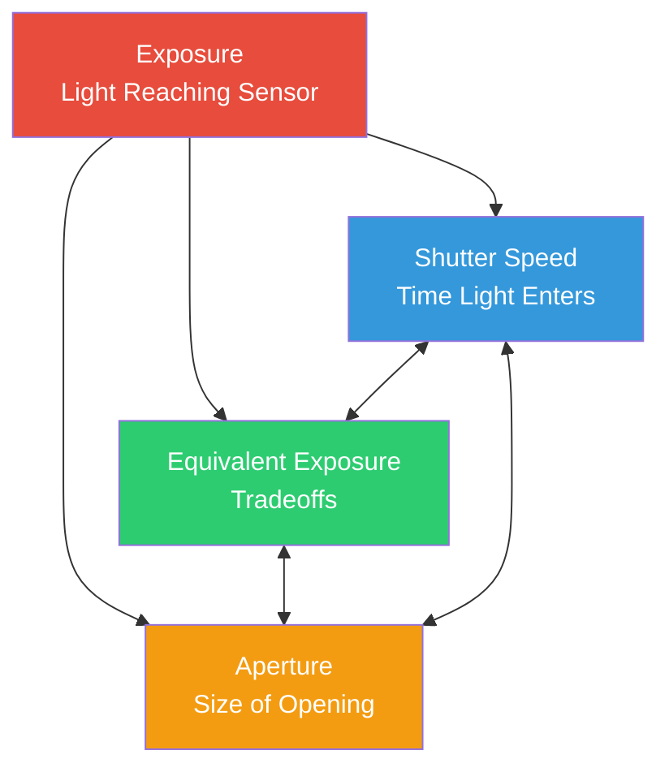

---
sidebar_position: 13
title: "Chapter 13: Exposure"
description: Master the fundamentals of photographic exposure—the Exposure Triangle of ISO, shutter speed, and aperture. Understand EV stops, the Sunny 16 rule, and how different combinations create the same exposure with creative tradeoffs.
keywords: [android camera2, exposure triangle, ISO, shutter speed, aperture, exposure value, sunny 16 rule, photography basics]
---

# Chapter 13: Exposure

## The Exposure Triangle: Three Knobs, One Goal

When you take a photo with a smartphone camera, you're capturing light. The *amount* of light that reaches the sensor determines whether your photo is too dark (underexposed), too bright (overexposed), or just right (correctly exposed). Three fundamental controls govern this — together they form the **Exposure Triangle**.



**The core idea:** Each corner of the triangle controls light, but each also introduces a *creative tradeoff*. You can achieve the *same* total exposure with different combinations of the three settings — but each combination yields a different *look* to your photograph.

Before we dive into Android Camera2 API specifics in the next chapter, let's build a solid intuitive foundation for each element.

---

## ISO: Sensor Sensitivity (Gain Control)

In the days of film, **ISO** described the *film stock's sensitivity to light* — ISO 100 film was "slow" and needed bright light, while ISO 800 film was "fast" and could shoot indoors.

**In digital photography (including smartphone cameras), ISO is sensor gain / electronic amplification.** When you double the ISO value, you're effectively doubling the amplification applied to the sensor's analog signal before it's digitized.

### How ISO Works

Imagine the sensor's pixel wells collecting photons (light particles). After the exposure period ends:

1. Each pixel converts accumulated photons into a tiny electrical charge
2. An **analog gain amplifier** multiplies this signal by a factor corresponding to your ISO setting
3. The amplified signal is converted from analog to digital (ADC)
4. Digital processing then applies further processing (noise reduction, tone-mapping)

**ISO 100 = base / lowest gain.** The signal is amplified least, so:
- Photos are *clean* with minimal digital noise (grain)
- Dynamic range (difference between brightest and darkest recordable tones) is highest
- Colors are most accurate

**ISO 3200 = high gain.** The signal is amplified 32×:
- You can shoot in dimmer scenes without increasing shutter time
- But you get *visible noise* (color speckle, luminance grain)
- Dynamic range and color accuracy degrade significantly

### Typical Smartphone ISO Range

| ISO Range | Characteristic | Use Case |
|-----------|---------------|----------|
| 50–200 | Base ISO, cleanest image | Bright daylight, studio lighting |
| 200–800 | Moderate gain, minor noise | Overcast day, shaded areas |
| 800–3200 | Visible noise, still usable | Indoor lighting, dusk |
| 3200–12800+ | Heavy noise / heavy NR applied | Night scenes, low-light events |

> **Smartphone Reality Note:** Flagship phones often apply heavy computational noise reduction at high ISO values (vendor-specific "night mode" processing). When you later disable the auto pipeline in Camera2, you *lose* many of these OEM optimizations — a critical caveat we'll return to in Chapter 14.

---

## Shutter Speed (Exposure Time)

**Shutter speed** is simply *how long the sensor is exposed to light*. In traditional cameras, a mechanical shutter physically opens and closes. In smartphones, it's almost always an **electronic shutter** — the sensor is reset, allowed to collect photons for a precise duration, then read out.

Shutter speed is measured in **seconds**, typically expressed as fractions:

| Shutter Speed | What It Does | Typical Use |
|--------------|-------------|-------------|
| 1/2000s – 1/1000s | Very short exposure, freezes all motion | Sports, birds, fast-moving vehicles |
| 1/500s – 1/250s | Freezes typical human motion | Walking people, children playing |
| 1/125s – 1/60s | "Safe" handheld speed with stabilization | General photography on stable hands |
| 1/30s – 1/15s | Slight motion blur visible, needs tripod | Creative motion, low light |
| 1s – 30s | Long exposure, heavy motion blur | Waterfalls, star trails, smooth water |
| 30s+ | Ultra-long exposure (specialized) | Astrophotography, light painting |

### The Motion Blur Effect

There are **two** reasons to deliberately choose a specific shutter speed beyond "enough light":

1. **Freeze action:** A bird in flight at 1/1000s shows every feather crisply because the bird moved almost zero distance during the exposure.

2. **Create motion blur:** A waterfall at 2 seconds renders the moving water as smooth, silky white trails — because each water droplet traveled across many pixels on the sensor while it was exposed.

Think of it like a long-exposure painting: *anything that moves while the shutter is open becomes a streak.*

**Important for video:** When shooting 30fps video, each frame is exposed for ~1/30s *maximum*. Cinematographers follow the **180° shutter rule**: set shutter speed to double the frame rate → 1/60s for 30fps video. This gives natural, "film-like" motion blur without being too choppy or too smeary.

---

## Aperture

**Aperture** is the size of the opening in the lens through which light passes. It's measured in **f-stops** (f/1.4, f/2.0, f/2.8, f/4.0, f/5.6, f/8.0, etc.) — a *counterintuitive scale where smaller numbers = wider opening*.

```
  f/1.4     f/2.0     f/2.8     f/4.0     f/5.6     f/8.0
█████████████████████████████████████████████████████████
█████████████████                              █████████
███████████████                                  ███████
█████████████                                    ██████
████████████                                      █████
███████████                                      ██████
```

**Halving the light each stop:** Moving from f/1.4 → f/2.0 → f/2.8 → f/4.0 each *halves* the area of the opening, so half the total light gets through. This is one "stop" darker per step.

### Aperture Tradeoffs (Creative & Practical)

1. **Depth of Field (DoF):** Wide aperture (f/1.8) = *shallow* DoF — only a narrow plane is in focus; everything in front/behind blurs out (bokeh). Narrow aperture (f/8) = *deep* DoF — everything from foreground to background is sharp.

2. **Light gathering:** f/1.4 gathers 4× more light than f/2.8. This is why "fast lenses" (wide maximum aperture) are prized for low-light shooting.

3. **Diffraction:** At very narrow apertures (f/11+), light waves bend around the aperture blades, slightly softening the image. This is usually irrelevant on smartphones.

### Smartphone Reality Check

Most smartphones have **fixed aperture lenses** — you cannot change the f-stop. Budget phones might have f/2.4–f/2.8; flagships often reach f/1.4–f/1.8. The [Android Camera Parameters app](https://play.google.com/store/apps/details?id=com.minininja.cameraparams) lets you check your lens' fixed aperture in `CameraCharacteristics`.

A few premium phones (e.g., Samsung Galaxy S23 Ultra, Xperia series) offer a *dual aperture* mechanism that mechanically switches between two stops (e.g., f/1.5 and f/2.4). In Camera2, query `LENS_INFO_AVAILABLE_APERTURES` to see if your device supports multiple apertures.

**The practical takeaway:** For most Android Camera2 development, aperture is *fixed*, so you control exposure via **ISO + shutter speed only**. Two knobs instead of three — which actually simplifies things!

---

## EV: Exposure Value (The Logarithmic Scale)

When photographers say "adjust by one stop," they mean **double or halve the total light**. To make stop-based thinking precise, the industry standardized on **Exposure Value (EV)**.

**EV 0** is defined as the exposure combination that produces a standard reference brightness: **1 second exposure, f/1.0 aperture, ISO 100**.

Every **+1 EV doubles the light** (brighter). Every **−1 EV halves the light** (darker):

| EV Change | Meaning |
|-----------|---------|
| +3 EV | 8× more light (2³) |
| +2 EV | 4× more light |
| +1 EV | 2× more light |
| 0 EV | Reference: 1s @ f/1.0 ISO 100 |
| −1 EV | ½ the light |
| −2 EV | ¼ the light |
| −3 EV | ⅛ the light |

The beautiful thing: **any combination of ISO + shutter + aperture that sums to the same EV value produces the same total exposure**. This is the *equivalent exposure* principle connecting the three triangle corners.

### EV and ISO/Shutter Combinations

With fixed aperture, the EV equation simplifies dramatically. For a smartphone at f/1.8:

| Scene | Typical EV | ISO 100 Shutter | ISO 400 Shutter | ISO 1600 Shutter |
|-------|-----------|----------------|-----------------|------------------|
| Bright sunny beach | 15 | 1/4000s | 1/1000s | 1/250s |
| Hazy / overcast day | 12 | 1/500s | 1/125s | 1/30s |
| Indoor bright office | 8 | 1/30s | 1/8s | 1/2s |
| Living room at night | 4 | 2s | 0.5s | 1/8s |
| Starry night scene | −2 | 30s | 8s | 2s |

### The Famous Sunny 16 Rule

Before matrix metering and sophisticated autoexposure algorithms, photographers relied on a rule of thumb to nail daylight exposure without a meter:

> **On a sunny day, set aperture to f/16, shutter speed to 1/ISO seconds.**

| Sunny 16 (f/16) | Equivalent at f/1.8 (Smartphone) |
|-----------------|----------------------------------|
| ISO 100, 1/100s, f/16 → EV 15 | ISO 100, 1/4000s, f/1.8 → EV 15 ✓ |
| ISO 200, 1/200s, f/16 → EV 15 | ISO 200, 1/8000s, f/1.8 → EV 15 ✓ |

The math checks out: f/1.8 is about **6⅓ stops wider** than f/16. Each stop quadruples? No — each stop *doubles* the light area. 2^(6.33) ≈ 80× more light. So the shutter must be 80× faster to compensate: 1/100s ÷ 80 ≈ 1/8000s (at ISO 200). Close enough for field work.

---

## The Look of Underexposed / Correct / Overexposed

Let's mentally compare three shots of the same scene (e.g., a person outdoors with sky behind them):

**Underexposed (−2 EV):** The subject is too dark. Shadows are *crushed* to pure black with no detail. In a histogram, all data piles up on the left (dark) side. The sky might look good, but the person appears as a silhouette. You *can* try to "push" underexposed raw data in post-processing, but the shadows will reveal heavy noise because you're amplifying a weak signal.

**Correct Exposure (0 EV):** Mid-tones show proper texture. The person's face has visible skin detail, shirt wrinkles, eye catchlights. Histogram has data spread across the full range without hard clipping at either end. On phones with limited dynamic range, this may mean *some* bright sky highlights clip to white (no blue detail) — that's a classic tradeoff vs. underexposing the subject.

**Overexposed (+2 EV):** Highlights are *blown out* to pure white with no recovery. Sky is a uniform white flat field; bright shirt buttons and specular reflections are clipped. The person's face might look flattering (bright skin), but you've permanently lost all highlight detail. Unlike underexposed shadows (which you can often partially recover with noise), *blown highlights are gone forever* — there's simply no data in those pixels.

**The Photographer's Mantra:** *Expose for the highlights, recover the shadows.* In RAW capture (which we'll cover later), this is especially powerful because 14-bit RAW stores enough shadow detail to pull +2 EV or more without catastrophic noise.

---

## Real-World EV Reference Table

Memorizing a few landmark EV values lets you estimate exposure anywhere:

| Scene | Typical EV (at ISO 100) | Rough Shutter @ f/1.8, ISO 400 |
|-------|------------------------|--------------------------------|
| Snow landscape in direct sun | 16 | 1/4000s |
| Sunny beach, bright day | 15 | 1/2000s |
| Typical sunny day | 14 | 1/1000s |
| Overcast / cloudy day | 12 | 1/250s |
| Very cloudy / rain | 11 | 1/125s |
| Open shade (person in shadow, sunlit background) | 9 | 1/30s |
| Sunset / golden hour | 7 | 1/8s |
| Bright indoor office | 8 | 1/15s |
| Home living room, lamps only | 4 | 1/2s |
| Dark restaurant interior | 2 | 2s |
| City street at night (neon signs) | 1 | 4s |
| Night landscape, distant city lights | −2 | 30s |
| Moonlit landscape (full moon) | −3 | 1 minute |
| Starry sky, no moon | −6 | 8 minutes |

You can verify these approximations against what your phone's auto-exposure actually chooses. Launch the [Android Camera Parameters app](https://github.com/zoozooll/AndroidCameraParameters), go into Live Preview, and observe `SENSOR_EXPOSURE_TIME` and `SENSOR_SENSITIVITY` as you walk from bright sun to a dark room — you'll see real values that map roughly to this table.

---

## Putting It All Together: Equivalent Exposures

Let's say you want the *same total exposure* (EV 12 = overcast day, f/1.8 smartphone). Here are three valid combinations producing identical sensor brightness:

| Combination | ISO | Shutter Speed | Look & Feel |
|-------------|-----|---------------|-------------|
| Clean & Sharp | 100 | 1/500s | Cleanest noise, sharpest freeze of motion |
| Middle Ground | 400 | 1/125s | Minor noise, good balance |
| Smooth Motion | 1600 | 1/30s | Visible noise; slight blur on moving subjects |

All three land at the same EV. All three *look equally bright*. But the *texture* (noise grain) and *motion portrayal* are completely different. **That's the art of exposure.**

### What If You Need Both?

This is where computational photography shines. A phone in "night mode" doesn't take *one* 2-second shot — it captures *dozens* of 1/60s frames (freezing motion in each), then aligns and averages them computationally. The result approximates the light gathering of a long exposure without the motion blur penalty.

Once you understand manual exposure at the Camera2 level, you can implement techniques like this yourself.

---

## Summary

In this chapter, we covered the *photography fundamentals* without touching a line of Android code:

- **Exposure Triangle:** Shutter Speed (time), ISO (sensor gain), and Aperture (opening size) combine to control total light. Each has a creative tradeoff.
- **ISO** in digital photography = analog sensor gain. Low ISO = clean, high ISO = noisy. Smartphones commonly support ISO 100–6400+ with OEM noise reduction.
- **Shutter Speed** is exposure time in seconds. Fast shutters (1/1000s) freeze action; slow shutters (1s+) create motion blur. The 180° shutter rule applies to video.
- **Aperture** is f-stop-controlled lens opening. Most smartphones have fixed aperture, so we rely on ISO + shutter only.
- **EV (Exposure Value)** is the logarithmic stop scale where each ±1 step doubles/halves light. EV 0 = 1s @ f/1.0 ISO 100.
- **Sunny 16 Rule** and the EV reference table let you ballpark exposures without metering.
- **Correct exposure** balances mid-tone detail, avoiding crushed shadows and blown highlights. RAW preserves recovery headroom.

## What's Next

In **Chapter 14: Manual Exposure in Camera2**, we translate this entire conceptual model into concrete Camera2 API calls. You'll learn:

- How to disable the auto-exposure pipeline (`CONTROL_MODE = OFF`, `CONTROL_AE_MODE = OFF`)
- How to translate ISO values to `SENSOR_SENSITIVITY`
- How to convert human-readable seconds ↔ nanoseconds for `SENSOR_EXPOSURE_TIME`
- Complete working Kotlin code for fixed timelapse exposure, long night exposure, and a 3-shot exposure bracketing series
- The critical caveat about OEM noise reduction being disabled when you turn off 3A

Grab your thinking cap — the code starts next.
