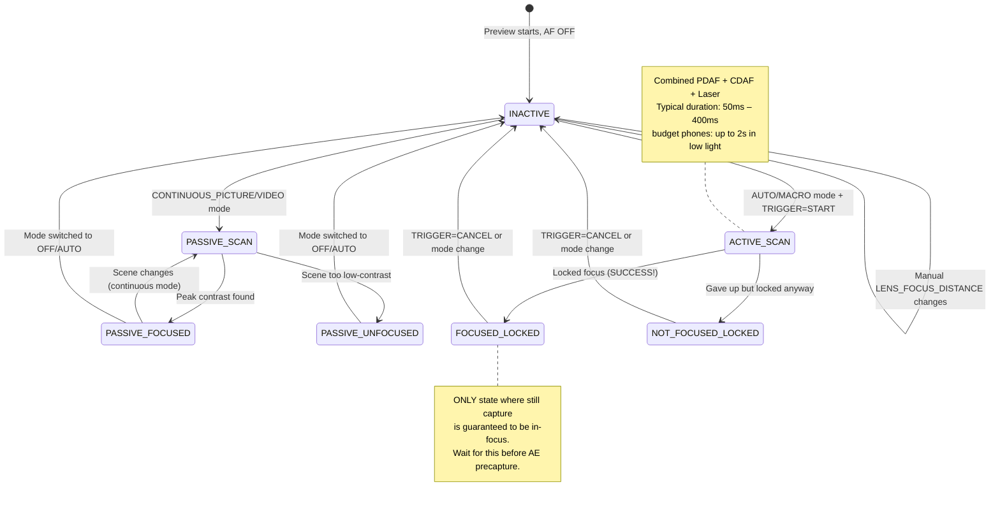

# Chapter 15: Focus

Exposure controls brightness. **Focus controls what is sharp.** A perfectly-exposed photo with soft focus is a failed photo. In this chapter, you'll learn how smartphone focus systems work, how to drive Auto Focus (AF) reliably via Camera2, and how to implement a silky-smooth manual focus slider using `LENS_FOCUS_DISTANCE`.

The [Android Camera Parameters app](https://github.com/zoozooll/AndroidCameraParameters) demonstrates all of this in its Focus panel — you can watch the AF state machine transition live and drag the manual focus slider to see the lens rack from infinity to minimum focus distance.

---

## Auto Focus (AF) in Modern Smartphones

Before diving into API specifics, let's understand the three physical focus mechanisms smartphones use.

### 1. Contrast-Detect AF (CDAF) — Passive Scan

The software technique: analyze the image frame, look for maximum edge contrast (sharp edges = highest spatial frequency), and move the lens until peak contrast is found.

- **Advantage:** Works on any camera hardware (no special pixels needed)
- **Disadvantage:** Slow. The lens must *hunt* back and forth across the focus range. Scene text labels like "AF SCANNING" in the Camera2 state map to this.

### 2. Phase-Detect AF (PDAF) — Active Scan

Special photodiodes on the sensor are split into two halves. The phase difference between left/right halves directly measures *how far and which direction* the lens must move — no hunting required. Flagship phones today use Dual-Pixel PDAF where *every* pixel does phase detection.

- **Advantage:** Extremely fast (< 100ms lock in good light); works reliably in video
- **Disadvantage:** Struggles in low-light (not enough photons to compute phase reliably), and has minimum focus distance limits

### 3. Laser AF / ToF AF (Active) — Range Finder

A dedicated hardware module fires an infrared laser pulse, times the reflection, and directly reports subject distance to the ISP. Very common on mid-range to premium phones.

- **Advantage:** Blazing-fast lock on any target, even in pure darkness (if target reflects IR)
- **Disadvantage:** Limited effective range (~50cm–5m max), fails on glass or IR-transparent objects

Real phones combine **all three**: PDAF for fast coarse lock, CDAF for fine-tuning, and Laser AF for low-light or close-up scenes. Camera2 exposes this unified pipeline as a single abstract state machine.

---

## AF Modes: CONTROL_AF_MODE

Camera2 defines these AF modes in `CameraMetadata`:

| Mode (CONTROL_AF_MODE_*) | Behavior | Use Case |
|-------------------------|----------|----------|
| `OFF` | No AF at all. You set `LENS_FOCUS_DISTANCE` manually. | Manual focus, focus stacking, astrophotography (infinity lock) |
| `AUTO` | One-shot AF. Does nothing until you send `CONTROL_AF_TRIGGER = START`, then scans once and locks. | Classic point-and-shoot still photography |
| `MACRO` | Same as AUTO but biased toward near-subject detection. | Close-ups, document scanning, "food mode" |
| `CONTINUOUS_PICTURE` | Constantly refocuses, but **pauses refocusing when you trigger a still capture** to avoid focus shift during the shot. | Still photography default |
| `CONTINUOUS_VIDEO` | Constantly refocuses — never pauses. May hunt visibly but keeps video in focus. | Video recording, video chats |
| `EDOF` | Extended Depth of Field: software/firmware-simulated deep focus. No physical lens movement. | Budget devices without moving lens actuators |

**Two critical notes:**

1. `EDOF` devices (cheap phones, selfie cameras) have a *fixed* focal plane. You will never get `FOCUSED_LOCKED` from them — the best you get is `PASSIVE_SCAN` → `PASSIVE_FOCUSED` → `INACTIVE`. The [Android Camera Parameters app](https://play.google.com/store/apps/details?id=com.minininja.cameraparams) explicitly shows "Fixed Focus" for these cameras.

2. `CONTINUOUS_*` modes return to `INACTIVE` after idle rather than staying locked. Don't expect `FOCUSED_LOCKED` in continuous mode — that's only for `AUTO`/`MACRO` + explicit trigger.

---

## The AF State Machine

Camera2 reports AF status via `CaptureResult.CONTROL_AF_STATE`. Understanding these states is *make-or-break* for reliable still capture sequences.



State reference table:

| CONTROL_AF_STATE | Meaning | Next Action |
|------------------|---------|-------------|
| `INACTIVE` (0) | AF is off, idle, or continuous mode not currently scanning | If in AUTO mode: send TRIGGER_START |
| `PASSIVE_SCAN` (1) | Continuous mode is passively scanning | Wait; don't trigger still capture yet |
| `PASSIVE_FOCUSED` (2) | Continuous found focus, but NOT locked (can drift) | Safe to trigger still in CONTINUOUS_PICTURE (it will lock) |
| `ACTIVE_SCAN` (3) | Explicit trigger started a scan | Just wait... |
| `NOT_FOCUSED_LOCKED` (4) | Failed to find focus, but lens is locked anyway | User-warning prompt; optionally retry or capture anyway |
| `FOCUSED_LOCKED` (5) | **SUCCESS.** Focus found and hardware-locked. | Proceed immediately to AE precapture trigger |
| `PASSIVE_UNFOCUSED` (6) | Continuous couldn't lock, still scanning | Improve lighting or different target |

**Non-negotiable rule for still photography:** *Never* submit a still capture (especially with flash!) until you see `FOCUSED_LOCKED`. Skip this step, and you will ship an app that intermittently produces soft photos.

---

## Focus Distance: Diopters, Not Meters

Here's the second "gotcha" that trips Camera2 developers (after the shutter-in-nanoseconds surprise):

**`LENS_FOCUS_DISTANCE` uses diopters (D), not meters.** Diopters are the *mathematical reciprocal* of focus distance:

```
Focus Distance (meters) = 1.0 / Diopters
Diopters = 1.0 / Focus Distance (meters)
```

| Diopters (LENS_FOCUS_DISTANCE) | Physical Focus Distance |
|--------------------------------|-------------------------|
| **0.0** | **Infinity** (∞) — stars, distant mountains |
| 0.1 | 10 meters |
| 0.25 | 4 meters |
| 0.5 | 2 meters |
| 1.0 | 1 meter |
| 2.0 | 0.5 meter (50 cm) |
| 5.0 | 0.2 meter (20 cm) |
| 10.0 | 0.1 meter (10 cm) |
| 20.0 | 0.05 meter (5 cm) |

Why diopters? Because the lens actuator moves linearly with *optical power*, not physical distance. A focus sweep from 0.0D → 20.0D corresponds to uniform lens movement, whereas a "meters" sweep from 10m → 5cm would be highly non-linear.

### Query Minimum Focus Distance

Every lens has a closest focus distance (you cannot physically focus an object pressed against the glass). Query it:

```kotlin
// Maximum useful diopter value for this lens
val maxDiopters = characteristics.get(
    CameraCharacteristics.LENS_INFO_MINIMUM_FOCUS_DISTANCE
) ?: 0.0f // 0.0f = fixed-focus EDOF lens (no focus control at all!)

if (maxDiopters == 0.0f) {
    Log.w("Focus", "This is a fixed-focus lens. Manual AF disabled.")
} else {
    // Valid diopter range is [0.0f .. maxDiopters]
    Log.d("Focus", "Focus range: 0.0D (inf) → $maxDiopters D (${1/maxDiopters}m close)")
}
```

Typical values:
- Budget phone rear camera: ~10D (10 cm minimum focus)
- Flagship wide camera: ~15–25D (4–7 cm minimum)
- Macro camera: ~30–50D (2–3 cm minimum)
- Front selfie camera: Often 0.0D (fixed focus, EDOF)

### Hyperfocal Distance (Concept)

Landscape photographers love this: set focus to the **hyperfocal distance**, and everything from half that distance to infinity is "acceptably sharp." On a phone with f/1.8 aperture and a standard wide lens, hyperfocal is roughly 0.5–1.0 meter.

**Rule of thumb for smartphones:** Setting `LENS_FOCUS_DISTANCE = 2.0D` (50 cm focus distance) approximates hyperfocal on most wide-angle phone lenses. Good for landscape and street photography where you don't want to wait for AF.

```kotlin
// Pre-set hyperfocal "everything sharp" preset
const val HYPERFOCAL_DIOPTERS_APPROX = 2.0f

fun setHyperfocal(builder: CaptureRequest.Builder, characteristics: CameraCharacteristics) {
    val maxD = characteristics.get(
        CameraCharacteristics.LENS_INFO_MINIMUM_FOCUS_DISTANCE
    ) ?: 0.0f
    val diopters = min(HYPERFOCAL_DIOPTERS_APPROX, maxD.takeIf { it > 0 } ?: 0.0f)
    builder.set(CaptureRequest.CONTROL_AF_MODE, CameraMetadata.CONTROL_AF_MODE_OFF)
    builder.set(CaptureRequest.LENS_FOCUS_DISTANCE, diopters)
}
```

Want to calculate precise hyperfocal for your exact lens? You'll also need `LENS_INFO_AVAILABLE_FOCAL_LENGTHS` (focal length in mm) and the sensor's physical pixel pitch. For 95% of smartphone use cases, 2.0D is close enough.

---

## Complete Example 1: One-Shot AF Trigger-and-Capture

This is the bread-and-butter still-photography flow for `AUTO` / `MACRO` mode. It's also the exact sequence the 3A orchestration in Chapter 17 will reuse.

**Goal:** User taps "Capture" → drive AF to locked focus → once locked, submit the still capture.

```kotlin
class AutoFocusCaptureHelper(
    private val characteristics: CameraCharacteristics,
    private val captureSession: CameraCaptureSession,
    private val previewSurface: Surface,
    private val jpegReaderSurface: Surface
) {
    private var afTriggered = false
    private var capturePlanned = false

    fun triggerAutoFocusAndCapture(onCaptureComplete: () -> Unit) {
        // ---- STEP 1: Build repeating request with explicit AF trigger ----
        val triggerRequest = captureSession.device.createCaptureRequest(
            CameraDevice.TEMPLATE_PREVIEW
        ).apply {
            addTarget(previewSurface)

            // Use AUTO mode to guarantee LOCKED state at the end
            set(CaptureRequest.CONTROL_AF_MODE,
                CameraMetadata.CONTROL_AF_MODE_AUTO)

            // Fire the one-shot AF trigger NOW
            set(CaptureRequest.CONTROL_AF_TRIGGER,
                CameraMetadata.CONTROL_AF_TRIGGER_START)
        }

        afTriggered = true
        capturePlanned = true

        // ---- STEP 2: Subscribe our state-tracking callback ----
        captureSession.setRepeatingRequest(
            triggerRequest.build(),
            object : CameraCaptureSession.CaptureCallback() {
                override fun onCaptureCompleted(
                    session: CameraCaptureSession,
                    request: CaptureRequest,
                    result: TotalCaptureResult
                ) {
                    val afState = result.get(CaptureResult.CONTROL_AF_STATE)
                        ?: return
                    Log.d("AF", "AF state: $afState")

                    when (afState) {
                        // --- SUCCESS PATH ---
                        CaptureResult.CONTROL_AF_STATE_FOCUSED_LOCKED -> {
                            if (capturePlanned) {
                                capturePlanned = false
                                submitStillCapture()
                                onCaptureComplete()
                            }
                        }
                        // --- FAILURE PATH: could not lock, but we'll try anyway ---
                        CaptureResult.CONTROL_AF_STATE_NOT_FOCUSED_LOCKED -> {
                            Log.w("AF", "AF couldn't lock — capturing anyway (blurry?)")
                            if (capturePlanned) {
                                capturePlanned = false
                                submitStillCapture()
                                onCaptureComplete()
                            }
                        }
                        // --- STILL SCANNING: ignore ---
                        CaptureResult.CONTROL_AF_STATE_ACTIVE_SCAN,
                        CaptureResult.CONTROL_AF_STATE_PASSIVE_SCAN -> {
                            // Still working, don't do anything yet
                        }
                    }
                }
            },
            null // Handler on current thread
        )
    }

    private fun submitStillCapture() {
        val stillRequest = captureSession.device.createCaptureRequest(
            CameraDevice.TEMPLATE_STILL_CAPTURE
        ).apply {
            addTarget(previewSurface)
            addTarget(jpegReaderSurface)

            // Keep AF locked for this still — do NOT release the trigger yet
            set(CaptureRequest.CONTROL_AF_MODE,
                CameraMetadata.CONTROL_AF_MODE_AUTO)
            // Leave AF_TRIGGER as-is (START remains until we explicitly CANCEL)

            set(CaptureRequest.JPEG_QUALITY, 95)
        }

        captureSession.capture(
            stillRequest.build(),
            object : CameraCaptureSession.CaptureCallback() {
                override fun onCaptureCompleted(
                    session: CameraCaptureSession,
                    request: CaptureRequest,
                    result: TotalCaptureResult
                ) {
                    // Photo captured — now release AF lock, go back to continuous
                    resetFocusToContinuous()
                }
            },
            null
        )
    }

    private fun resetFocusToContinuous() {
        val resumePreview = captureSession.device.createCaptureRequest(
            CameraDevice.TEMPLATE_PREVIEW
        ).apply {
            addTarget(previewSurface)
            set(CaptureRequest.CONTROL_AF_MODE,
                CameraMetadata.CONTROL_AF_MODE_CONTINUOUS_PICTURE)
            set(CaptureRequest.CONTROL_AF_TRIGGER,
                CameraMetadata.CONTROL_AF_TRIGGER_CANCEL)
        }
        afTriggered = false
        captureSession.setRepeatingRequest(resumePreview.build(), null, null)
    }
}
```

**Critical detail:** You cancel the trigger *after* the still capture completes — not before. Cancel too early, and the lens unlocks during the shot, producing a soft photo.

**Timeout safeguard (not shown):** Real apps add a 2–3 second timeout on the AF scan. If `ACTIVE_SCAN` runs for 3 seconds and never reaches `FOCUSED_LOCKED`, cancel and surface a "Tap to focus on a high-contrast area" user hint.

---

## Complete Example 2: Manual Focus SeekBar Slider

This is the user-facing Manual Focus feature you've seen in pro camera apps. A SeekBar maps the physical 0.0D → maxD focus range smoothly.

### Layout (res/layout/fragment_manual_focus.xml)

```xml
<LinearLayout
    xmlns:android="http://schemas.android.com/apk/res/android"
    android:layout_width="match_parent"
    android:layout_height="wrap_content"
    android:orientation="vertical"
    android:padding="16dp">

    <TextView
        android:id="@+id/tvFocusLabel"
        android:layout_width="match_parent"
        android:layout_height="wrap_content"
        android:text="Focus: ∞ (infinity)"
        android:textSize="14sp"/>

    <SeekBar
        android:id="@+id/seekFocus"
        android:layout_width="match_parent"
        android:layout_height="wrap_content"
        android:max="1000"/>
</LinearLayout>
```

### Kotlin: Fragment / Activity Wiring

```kotlin
class ManualFocusController(
    private val seekBar: SeekBar,
    private val labelView: TextView,
    private val characteristics: CameraCharacteristics,
    private val captureSessionProvider: () -> CameraCaptureSession?,
    private val previewSurface: Surface
) {
    // Slider uses 1000 integer steps for sub-diopter precision
    private val sliderSteps = 1000
    private val maxDiopters = characteristics.get(
        CameraCharacteristics.LENS_INFO_MINIMUM_FOCUS_DISTANCE
    ) ?: 0.0f

    private var currentDiopters = 0.0f

    init {
        if (maxDiopters == 0.0f) {
            seekBar.isEnabled = false
            labelView.text = "Fixed Focus (No manual AF)"
        } else {
            bindSeekBar()
            applyFocus(0.0f) // Start at infinity
        }
    }

    private fun bindSeekBar() {
        // Convert slider int [0..1000] ↔ diopters [0.0 .. maxDiopters]
        seekBar.setOnSeekBarChangeListener(object : SeekBar.OnSeekBarChangeListener {
            private var lastUpdate = 0L

            override fun onProgressChanged(seekBar: SeekBar, progress: Int, fromUser: Boolean) {
                if (!fromUser) return

                // Throttle to ~30fps (33ms) — avoids overwhelming HAL with requests
                val now = SystemClock.elapsedRealtime()
                if (now - lastUpdate < 33L) return
                lastUpdate = now

                val diopters = progress.toFloat() / sliderSteps.toFloat() * maxDiopters
                applyFocus(diopters)
            }
            override fun onStartTrackingTouch(seekBar: SeekBar) {
                // Switch to full manual AF mode immediately when user starts dragging
                switchToManualMode()
            }
            override fun onStopTrackingTouch(seekBar: SeekBar) {
                // Apply final exact value to remove throttle error
                val diopters = seekBar.progress.toFloat() / sliderSteps.toFloat() * maxDiopters
                applyFocus(diopters, force = true)
            }
        })
    }

    private fun switchToManualMode() {
        // CONTROL_AF_MODE_OFF disables AF motor auto-drive
        val session = captureSessionProvider() ?: return
        val request = session.device.createCaptureRequest(
            CameraDevice.TEMPLATE_PREVIEW
        ).apply {
            addTarget(previewSurface)
            set(CaptureRequest.CONTROL_AF_MODE, CameraMetadata.CONTROL_AF_MODE_OFF)
            set(CaptureRequest.CONTROL_MODE, CameraMetadata.CONTROL_MODE_USE_SCENE_MODE)
        }
        session.setRepeatingRequest(request.build(), null, null)
    }

    fun applyFocus(diopters: Float, force: Boolean = false) {
        currentDiopters = diopters.coerceIn(0.0f, maxDiopters)

        // Update label: show "∞" for < 0.1D, "X.Y m" otherwise
        labelView.text = when {
            currentDiopters < 0.1f -> "Focus: ∞ (infinity)"
            else -> {
                val meters = 1.0f / currentDiopters
                String.format("Focus: %.1f D  (%.2f m)", currentDiopters, meters)
            }
        }

        // Build and submit a repeating request with the new focus distance
        val session = captureSessionProvider() ?: return
        val request = session.device.createCaptureRequest(
            CameraDevice.TEMPLATE_PREVIEW
        ).apply {
            addTarget(previewSurface)
            set(CaptureRequest.CONTROL_AF_MODE, CameraMetadata.CONTROL_AF_MODE_OFF)
            set(CaptureRequest.LENS_FOCUS_DISTANCE, currentDiopters)
        }

        // Use setRepeatingRequest so every preview frame honours the new focus
        session.setRepeatingRequest(request.build(), null, null)
    }

    // --- Preset helpers ---
    fun setInfinity() { seekBar.progress = 0; applyFocus(0.0f, true) }
    fun setHyperfocalApprox() {
        val d = min(2.0f, maxDiopters)
        seekBar.progress = (d / maxDiopters * sliderSteps).toInt()
        switchToManualMode()
        applyFocus(d, true)
    }
    fun setNearest() { seekBar.progress = sliderSteps; applyFocus(maxDiopters, true) }
}
```

**Key implementation details:**

1. **Throttle.** SeekBars fire `onProgressChanged` up to 200Hz. Submitting a `setRepeatingRequest` on every event floods the HAL with work, causing lag. A 33ms throttle caps updates to ~30fps — plenty smooth for the lens motor's physical speed.

2. **Switch to CONTROL_AF_MODE_OFF early.** If you're in `CONTINUOUS_PICTURE` and set `LENS_FOCUS_DISTANCE` without disabling AF, the AF algorithm will *fight you* — snapping focus back to what it thinks is right a frame later. The switch must happen first, in `onStartTrackingTouch`.

3. **Update via `setRepeatingRequest`**, not one-off `capture()`. Manual focus needs to stick on *every* preview frame until the user moves the slider again.

4. **Force-apply on release.** The throttle skips intermediate positions; when the user lifts their finger, apply the exact final slider value.

---

## Focus Regions (Touch-to-Focus)

Modern camera apps let you *tap the viewfinder* to pick a focus target. Camera2 implements this via `CONTROL_AF_REGIONS` — a list of rectangles (in the active-array coordinate space) with weights.

```kotlin
// Convert a Viewfinder (x,y) tap into a CameraCharacteristics Sensor coordinate region
fun createTapFocusRegion(viewfinderWidth: Int, viewfinderHeight: Int,
                         tapX: Float, tapY: Float,
                         characteristics: CameraCharacteristics): MeteringRectangle {
    val activeArray = characteristics.get(
        CameraCharacteristics.SENSOR_INFO_ACTIVE_ARRAY_SIZE
    )!!
    // Normalize tap [0..1] in each axis
    val nx = tapX / viewfinderWidth.toFloat()
    val ny = tapY / viewfinderHeight.toFloat()
    // Map to sensor active array, create a 200×200 region centered on the tap
    val cx = (nx * activeArray.width()).toInt()
    val cy = (ny * activeArray.height()).toInt()
    val rSize = 200
    return MeteringRectangle(
        max(0, cx - rSize/2), max(0, cy - rSize/2),
        rSize, rSize,
        MeteringRectangle.METERING_WEIGHT_MAX
    )
}

// Attach region to a request builder
fun applyTapFocus(builder: CaptureRequest.Builder, region: MeteringRectangle) {
    builder.set(CaptureRequest.CONTROL_AF_REGIONS, arrayOf(region))
    builder.set(CaptureRequest.CONTROL_AE_REGIONS, arrayOf(region)) // Couple AE spot too!
    builder.set(CaptureRequest.CONTROL_AF_TRIGGER,
        CameraMetadata.CONTROL_AF_TRIGGER_CANCEL) // Cancel any prior lock
    builder.set(CaptureRequest.CONTROL_AF_TRIGGER,
        CameraMetadata.CONTROL_AF_TRIGGER_START)  // Trigger scan on new region
}
```

**Pro tip:** Always couple `CONTROL_AE_REGIONS` to match `CONTROL_AF_REGIONS`. The user tapped on a face because they want that face *both* in focus *and* correctly exposed — not focused on the face but metered for the bright sky behind it.

---

## Troubleshooting Focus Issues

| Symptom | Root Cause | Fix |
|---------|-----------|-----|
| AF state never moves past ACTIVE_SCAN | Low-contrast scene (white wall, pure blue sky) or hardware failure | Timeout after ~3s; prompt user; fall back to hyperfocal preset |
| Manual focus slider does nothing | Forgot to set `CONTROL_AF_MODE = OFF` → AF is fighting you | Call `switchToManualMode()` in onStartTrackingTouch |
| Still capture comes out blurry despite FOCUSED_LOCKED | Cancelled AF trigger *before* still capture completed | Cancel only in `onCaptureCompleted` of the *still* request |
| Front camera ignores focus commands | Fixed-focus EDOF lens (`MINIMUM_FOCUS_DISTANCE == 0`) | Graceful degradation: disable focus UI for that camera |
| Video AF "hunts" a lot | Using `CONTINUOUS_PICTURE` instead of `CONTINUOUS_VIDEO` for video recording | Switch mode to CONTINUOUS_VIDEO when MediaRecorder starts |

---

## Summary

Focus in Camera2 is a state machine you must drive explicitly, not a "set and forget" setting:

- **AF Hardware:** Smartphones combine Contrast-Detect AF, Phase-Detect AF (Dual-Pixel), and Laser AF for fast reliable locks.
- **Modes:** `AUTO` (one-shot, locks), `CONTINUOUS_PICTURE` (refocuses, pauses for stills), `CONTINUOUS_VIDEO` (always refocusing), `MACRO`, `OFF` (manual). EDOF lenses have no moving focus.
- **States:** Wait for `FOCUSED_LOCKED` (not just `PASSIVE_FOCUSED`) before high-value still captures.
- **Diopters:** `LENS_FOCUS_DISTANCE` uses reciprocal distance (0.0D = ∞, 10D = 10 cm). Range is `[0.0 .. LENS_INFO_MINIMUM_FOCUS_DISTANCE]`.
- **One-shot AF capture:** `TRIGGER = START` → wait `FOCUSED_LOCKED` → submit still → then `CANCEL`.
- **Manual focus slider:** SeekBar with 1000 steps, throttled to 30fps; switch mode to `AF_MODE_OFF` first so the auto algorithm doesn't fight your manual setting.
- **Touch-to-Focus uses `CONTROL_AF_REGIONS`** in sensor active-array coordinates. Couple with `AE_REGIONS` for pro results.

## What's Next

Brightness ✓ Sharpness ✓. Now let's fix the **color**. In **Chapter 16: White Balance & Color**, we cover:

- Auto White Balance (AWB) and the 7 presets (Incandescent → Shade)
- Manual color correction with `COLOR_CORRECTION_GAINS` (4-channel R/G/B/G) and `COLOR_CORRECTION_TRANSFORM` (3×3 RGB matrix)
- Color temperature concept (2000K candle → 10000K shade) and how it maps to white balance
- Working code for a warm-tone "sunset look" preset and full manual AWB off-mode

Color is the final leg of the manual-controls trilogy.
