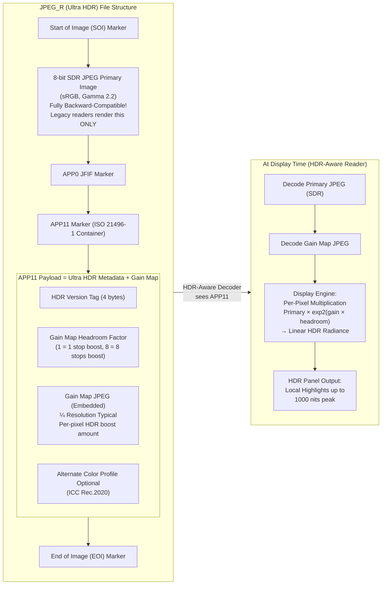

---
sidebar_position: 21
title: "Chapter 21: HDR & Ultra HDR"
description: "Implement HDR10 and HLG video via DynamicRangeProfiles, and Android 14 JPEG_R (Ultra HDR ISO 21496-1) still captures with SDR-primary + gain-map architecture for backward-compatible high dynamic range photos"
keywords: [Android Camera2, HDR, Ultra HDR, HDR10, HLG, JPEG_R, ST.2084 PQ, Rec.2020, gain map, ISO 21496-1, DynamicRangeProfiles, CDD Performance Class 15]
---

# Chapter 21: HDR & Ultra HDR

Standard Dynamic Range (SDR) photography — 8-bit-per-channel sRGB encoded with a gamma 2.2 curve and mastered for 100-nit displays — was designed for 1990s CRTs. Modern smartphone sensors capture **10–14 stops of dynamic range** (1024:1 to 16384:1 scene contrast), but an 8-bit SDR JPEG can only render ~6 stops before either blowing out the highlights or crushing the shadows into noise. **High Dynamic Range (HDR)** formats solve this by storing scene radiance in 10+ bits per channel, using perceptually-uniform or scene-referred transfer functions, and targeting peak display luminosities of 1,000–10,000 nits instead of 100.

This chapter covers three working HDR standards in Android Camera2:
- **HDR10** (10-bit, ST.2084 PQ, Rec.2020, static metadata) for video
- **HLG (Hybrid Log-Gamma)** (10-bit, SDR-backward-compatible, ARIB STD-B67) for broadcast and video
- **JPEG_R / Ultra HDR** (Android 14 API 34+, ISO 21496-1) — the revolutionary still-photo format that embeds a secondary "gain map" inside a standard 8-bit SDR JPEG so legacy readers see a normal photo, while HDR displays locally boost highlights up to 8 stops

All three are documented in the *Ultra HDR / JPEG_R* and *Dynamic Range* sections of the project research doc, which also specifies the Android CDD (Compatibility Definition Document) Performance Class 15 mandate that all 2024+ flagship devices must expose JPEG_R as an output format at maximum still size. You can verify HDR10, HLG, and JPEG_R support per camera ID in the [Android Camera Parameters](https://github.com/zoozooll/AndroidCameraParameters) app on the [Play Store](https://play.google.com/store/apps/details?id=com.zoozooll.cameraparameters), which enumerates every `DynamicRangeProfiles` key and reports whether `ImageFormat.JPEG_R` appears in `getOutputSizes()`.

## Dynamic Range Fundamentals: Why 8 Bits Is Not Enough

Before diving into specific formats, define what "dynamic range" means for display vs capture:

| Metric | SDR (sRGB/BT.709) | HDR10 (BT.2100) | Human Vision |
|--------|-------------------|------------------|--------------|
| **Bit depth** | 8 bits / channel (256 levels) | 10 bits / channel (1024 levels) | ~4.8 bits perceptual, but logarithmic |
| **Peak luminance** | 100 nits (cd/m²) | 1,000+ nits peak (content-dependent) | ~20,000 nits (sun+sky) to ~0.001 nits (dark room) |
| **Transfer function** | Gamma 2.2 or sRGB piece-wise | ST.2084 Perceptual Quantizer (PQ) | Logarithmic response (Weber-Fechner law) |
| **Color gamut** | sRGB / BT.709 (~35% of visible) | Rec.2020 (~75% of visible) | Full visible spectrum |
| **Contrast ratio (usable)** | ~6 stops (64:1) | ~10 stops (1024:1) minimum | ~14 stops (16384:1) in a single scene |

The gamma curve used by SDR was engineered to match 1990s CRT electron-gun nonlinearity, not the human visual system. The PQ (Perceptual Quantizer) curve used by HDR10 was standardized in 2014 by Dolby and the BBC under ST.2084, and is mathematically fit to the Barten model of human contrast sensitivity — so each of the 1,024 code values in 10-bit PQ represents a just-noticeable difference (JND) in brightness across the full 0–10,000 nit range.

```mermaid
flowchart TD
    subgraph SDRpath["SDR 8-bit Capture → Display Pipeline"]
        S1["Sensor Linear<br/>14-bit RAW"] --> S2["Gamma 2.2 Curve<br/>(Destroys Shadow Detail)"]
        S2 --> S3["8-bit Quantization<br/>(Only 22 codes for<br/>0–10% luminance)"]
        S3 --> S4["sRGB Gamut Clipping<br/>(25% of colors lost)"]
        S4 --> S5["Peak 100 nits<br/>(Sky/Sun Clip to White)"]
    end

    subgraph HDRpath["HDR10 10-bit Capture → Display Pipeline"]
        H1["Sensor Linear<br/>14-bit RAW"] --> H2["ST.2084 PQ Curve<br/>(Fits JND model)"]
        H2 --> H3["10-bit Quantization<br/>(140 codes for<br/>0–10% luminance)"]
        H3 --> H4["Rec.2020 Gamut<br/>(75% of visible colors)"]
        H4 --> H5["Peak 1000+ nits<br/>(Sky Detail Preserved)"]
    end

    style SDRpath fill:#ffeded,stroke:#b91c1c
    style HDRpath fill:#e8fff0,stroke:#15803d
```



The Mermaid diagram above quantifies the two most important differences: SDR uses only ~22 8-bit codes for the bottom 10% of luminance (causing shadow banding when pulled up), while PQ allocates 140 10-bit codes to the same range. The PQ curve's perceptual uniformity is why 10-bit HDR looks smoother than 8-bit SDR even when down-sampled to 100 nits on an SDR display.

## HDR10 Video: 10-bit PQ + Rec.2020 + Static Metadata

HDR10 is the baseline HDR video format — every 2021+ smartphone with an OLED display supports HDR10 playback, and every Snapdragon 865+ / Exynos 2100+ SoC supports HDR10 recording via Camera2. The format specifies:

- **HEVC Main10 Profile** (H.265) encoding with 10-bit samples
- **ST.2084 PQ** transfer function in place of gamma
- **Rec.2020 (BT.2100)** color primaries (wide-gamut)
- **Static metadata** (SMPTE ST 2086 / CTA-861.3) in the HEVC SEI message:
  - `max_content_light_level` (MaxCLL): peak luminance of any single pixel, in nits
  - `max_frame_average_light_level` (MaxFALL): average luminance of the brightest frame
  - `display_primaries` and `white_point`: mastering display color volume
  - `max_luminance` / `min_luminance`: mastering display peak and black level

Static metadata means exactly one set of values applies to the entire video duration. The dynamic metadata variant (HDR10+, Samsung's alternative to Dolby Vision) is not exposed through standard Camera2 — it requires vendor extensions — but HDR10 static metadata is universally supported via `DynamicRangeProfiles`.

### Querying HDR10 and HLG Support via DynamicRangeProfiles

Android 13 (API 33) introduced `CameraCharacteristics.REQUEST_AVAILABLE_DYNAMIC_RANGE_PROFILES` as a structured alternative to manually checking 10-bit format support in `StreamConfigurationMap`. Every output surface has a profile chosen at session creation time:

```kotlin
import android.hardware.camera2.CameraCharacteristics
import android.hardware.camera2.params.DynamicRangeProfiles
import android.util.Size

data class HdrVideoProfile(
    val profile: Long, // DynamicRangeProfiles.HDR10, HLG10, etc.
    val supportedSizes: List<Size>,
    val standardSizesFallbacks: List<Size>
)

fun enumerateHdrProfiles(
    characteristics: CameraCharacteristics
): List<HdrVideoProfile> {
    val profiles: DynamicRangeProfiles? =
        characteristics.get(
            CameraCharacteristics.REQUEST_AVAILABLE_DYNAMIC_RANGE_PROFILES
        ) ?: return emptyList()

    val configMap = characteristics.get(
        CameraCharacteristics.SCALER_STREAM_CONFIGURATION_MAP
    ) ?: return emptyList()

    return listOf(
        DynamicRangeProfiles.HDR10,
        DynamicRangeProfiles.HLG,
        DynamicRangeProfiles.HDR10_PLUS, // Often null on non-Samsung devices
        DynamicRangeProfiles.DOLBY_VISION_10B_HDR_OEM // Requires Dolby license
    ).mapNotNull { profile ->
        if (!profiles.isProfileSupported(profile)) return@mapNotNull null

        val hdrSizes = profiles.getProfileSupportedSizes(profile)
            ?.toList() ?: emptyList()
        val sdrFallbackSizes = configMap.getOutputSizes(
            android.graphics.ImageFormat.PRIVATE
        )?.toList() ?: emptyList()

        HdrVideoProfile(profile, hdrSizes, sdrFallbackSizes)
    }
}
```

The `DynamicRangeProfiles.getProfileSupportedSizes(profile)` method returns the *intersection* of 10-bit-capable sizes and ISP HDR pipeline support. If `Size(3840, 2160)` (4K UHD) does not appear in `getProfileSupportedSizes(HDR10)`, then even if 4K SDR is supported, the HAL does not have enough ISP throughput for 4K HDR10 encoding (usually a 600-Mpixel/sec limit on Snapdragon 8-series). The Android Camera Parameters app renders this intersection table in the HDR tab so you can verify before writing session code.

### Setting HDR10 on OutputConfiguration for Recording

The dynamic range profile must be set **before the session is created** via `OutputConfiguration.setDynamicRangeProfile()`. Changing the profile mid-session requires tearing down and recreating the session.

```kotlin
import android.hardware.camera2.params.DynamicRangeProfiles
import android.hardware.camera2.params.OutputConfiguration
import android.media.MediaCodec
import android.media.MediaCodecInfo
import android.view.Surface

fun createHdr10VideoOutput(
    encoderSurface: Surface,
    previewSurface: Surface
): Pair<OutputConfiguration, OutputConfiguration> {
    val encodeOutConfig = OutputConfiguration(encoderSurface).apply {
        setDynamicRangeProfile(DynamicRangeProfiles.HDR10)
    }
    val previewOutConfig = OutputConfiguration(previewSurface).apply {
        setDynamicRangeProfile(DynamicRangeProfiles.HDR10)
    }
    return Pair(encodeOutConfig, previewOutConfig)
}

fun configureHdr10MediaCodec(width: Int, height: Int): MediaCodec {
    val codec = MediaCodec.createEncoderByType("video/hevc")
    val format = android.media.MediaFormat.createVideoFormat(
        "video/hevc", width, height
    ).apply {
        setInteger(MediaFormat.KEY_COLOR_FORMAT,
            MediaCodecInfo.CodecCapabilities.COLOR_FormatSurface)
        setInteger(MediaFormat.KEY_BIT_RATE, 80_000_000) // 80 Mbps for 4K HDR10
        setInteger(MediaFormat.KEY_FRAME_RATE, 30)
        setInteger(MediaFormat.KEY_I_FRAME_INTERVAL, 1)
        setInteger(MediaFormat.KEY_PROFILE,
            MediaCodecInfo.CodecProfileLevel.HEVCProfileMain10)
        setInteger(MediaFormat.KEY_COLOR_STANDARD,
            MediaFormat.COLOR_STANDARD_BT2020)
        setInteger(MediaFormat.KEY_COLOR_TRANSFER,
            MediaFormat.COLOR_TRANSFER_ST2084) // ST.2084 PQ
        setInteger(MediaFormat.KEY_COLOR_RANGE,
            MediaFormat.COLOR_RANGE_LIMITED)
        setFeatureEnabled(MediaCodecInfo.CodecCapabilities.FEATURE_HdrEditing, true)
    }
    codec.configure(format, null, null, MediaCodec.CONFIGURE_FLAG_ENCODE)
    return codec
}
```

The three `COLOR_*` keys (`BT2020`, `ST2084`, `LIMITED`) combined with `HEVCProfileMain10` create a bit-exact HDR10 stream. If you omit `KEY_COLOR_TRANSFER` or set it to the wrong value (e.g. `COLOR_TRANSFER_GAMMA_2_2`), YouTube and other players will interpret the 10-bit stream as SDR and play it washed-out or oversaturated.

## HLG (Hybrid Log-Gamma): SDR-Backward-Compatible Broadcast HDR

HLG (standardized as ARIB STD-B67 by the BBC and NHK in 2015) was designed for live television, where you cannot know in advance whether the viewer has an HDR or SDR display. The innovation of HLG is a **piecewise hybrid transfer function**:
- The bottom 50% of the code range is a standard gamma curve (matches SDR exactly)
- The top 50% is a logarithmic curve (stores HDR highlight detail)

This means an HLG video played on an SDR display looks identical to a correctly-tuned SDR gamma 2.2 video, while an HDR display "unlocks" the logarithmic upper half and renders highlights up to 1,000 nits without any metadata signaling. There is no explicit SDR→HDR tone mapping required.

For video use, HLG differs from HDR10 in three Camera2-relevant ways:
1. **No static metadata required** — HLG is scene-referred, so the display derives peak brightness from the signal itself. This simplifies the MediaCodec configuration (no SEI insertion for MaxCLL/MaxFALL).
2. **Different color-transfer constant** — use `MediaFormat.COLOR_TRANSFER_HLG` instead of `ST2084`.
3. **`DynamicRangeProfiles.HLG`** check instead of `HDR10`.

All other API usage (OutputConfiguration.setDynamicRangeProfile, session creation, CaptureRequest) is identical to HDR10. The research doc notes that HLG is the preferred format for user-generated video shared to social platforms, because it renders correctly on both SDR and HDR displays without tone-mapping artifacts.

## JPEG_R (Ultra HDR): ISO 21496-1 SDR + Embedded Gain Map

The biggest advance in mobile HDR photography since multi-frame HDR capture is **JPEG_R**, introduced in Android 14 (API 34) and codified as international standard **ISO 21496-1**. The format is backward-compatible by construction:

> A JPEG_R file is a standard 8-bit SDR JPEG with a **secondary, smaller JPEG (the "gain map")** embedded in the `APP11` marker segment using the ISO 21496-1 container format. Legacy JPEG decoders ignore unrecognized APP markers and render only the 8-bit primary. HDR-aware decoders read both the primary and the gain map, and reconstruct the original linear HDR scene radiance by multiplying primary pixel values by exp2(gain_map_pixel × headroom_factor) on a per-pixel basis.

This "per-pixel boost" is what makes Ultra HDR *locally* HDR (unlike HDR10 static metadata, which applies one peak value globally). An ISO 21496-1 gain map at ¼ resolution (typical) can encode up to **8 stops of local highlight headroom** — enough to recover cloud detail in a sunset while keeping midtones at natural SDR luminance.

Android CDD Performance Class 15 mandates:
- All devices advertising CDD PC-15 (2024+ flagships per the CDD spec table) **MUST** support `ImageFormat.JPEG_R` output at the maximum still-capture size.
- Maximum still capture size for JPEG_R must be ≥ the maximum YUV size for that camera ID.

The *Ultra HDR / JPEG_R* section of the research doc contains a full byte-level breakdown of the APP11 marker layout, but for the Camera2 API you only need to treat `ImageFormat.JPEG_R` as a single opaque output buffer — the HAL assembles the primary + gain map internally.



The critical detail in the Mermaid diagram: the PRIMARY JPEG is a fully valid 8-bit SDR photo, so even a 2010s-era JPEG library can render a correct-looking image. The HDR data is *additive*, not replacing the primary file — this is why JPEG_R files work seamlessly with every existing photo-sharing platform (Instagram, Google Photos, Messages) that doesn't yet have Ultra HDR decoders.

### Querying JPEG_R Support and Capturing Ultra HDR Stills

Capturing Ultra HDR stills is functionally identical to capturing standard JPEG, with two differences:
1. Query `ImageFormat.JPEG_R` in `StreamConfigurationMap.getOutputSizes()` instead of `ImageFormat.JPEG`
2. If you are using `DynamicRangeProfiles` (recommended), set the JPEG_R output's profile to `DynamicRangeProfiles.JPEG_R`

```kotlin
import android.graphics.ImageFormat
import android.hardware.camera2.CameraCharacteristics
import android.hardware.camera2.CameraDevice
import android.hardware.camera2.CaptureRequest
import android.hardware.camera2.params.DynamicRangeProfiles
import android.hardware.camera2.params.OutputConfiguration
import android.media.ImageReader
import android.util.Size

var jpegRImageReader: ImageReader? = null

fun queryJpegRSupport(
    characteristics: CameraCharacteristics
): Pair<Boolean, Size?> {
    val caps = characteristics.get(
        CameraCharacteristics.REQUEST_AVAILABLE_CAPABILITIES
    ) ?: intArrayOf()
    val supportsDynamicRange = caps.contains(
        CameraCharacteristics.REQUEST_AVAILABLE_CAPABILITIES_DYNAMIC_RANGE_TEN_BIT
    )
    val drProfiles = characteristics.get(
        CameraCharacteristics.REQUEST_AVAILABLE_DYNAMIC_RANGE_PROFILES
    )
    val supportsJpegRProfile =
        drProfiles?.isProfileSupported(DynamicRangeProfiles.JPEG_R) == true

    val configMap = characteristics.get(
        CameraCharacteristics.SCALER_STREAM_CONFIGURATION_MAP
    ) ?: return Pair(false, null)

    val jpegRSizes = configMap.getOutputSizes(ImageFormat.JPEG_R)
        ?: emptyArray()
    val maxJpegR = jpegRSizes.maxByOrNull { it.width * it.height }

    return Pair(
        supportsDynamicRange && supportsJpegRProfile && jpegRSizes.isNotEmpty(),
        maxJpegR
    )
}

fun setupJpegRCapture(
    cameraDevice: CameraDevice,
    maxJpegRSize: Size,
    previewSurface: Surface
) {
    jpegRImageReader = ImageReader.newInstance(
        maxJpegRSize.width, maxJpegRSize.height,
        ImageFormat.JPEG_R, 2
    )

    val jpegROutput = OutputConfiguration(
        jpegRImageReader!!.surface
    ).apply {
        setDynamicRangeProfile(DynamicRangeProfiles.JPEG_R)
    }
    val previewOutput = OutputConfiguration(previewSurface)

    val outputs = listOf(previewOutput, jpegROutput)
    val sessionConfig = android.hardware.camera2.params.SessionConfiguration(
        android.hardware.camera2.params.SessionConfiguration.SESSION_REGULAR,
        outputs,
        { r -> backgroundHandler.post(r) },
        object : android.hardware.camera2.CameraCaptureSession.StateCallback() {
            override fun onConfigured(
                session: android.hardware.camera2.CameraCaptureSession
            ) {
                val stillBuilder = cameraDevice.createCaptureRequest(
                    CameraDevice.TEMPLATE_STILL_CAPTURE
                ).apply {
                    addTarget(previewSurface)
                    addTarget(jpegRImageReader!!.surface)
                    set(CaptureRequest.CONTROL_MODE,
                        CaptureRequest.CONTROL_MODE_USE_SCENE_MODE)
                    set(CaptureRequest.CONTROL_SCENE_MODE,
                        CaptureRequest.CONTROL_SCENE_MODE_HDR)
                    // Trigger HAL multi-frame HDR fusion before JPEG_R encode
                }

                session.capture(stillBuilder.build(),
                    JpegRCaptureCallback(), backgroundHandler)
            }
            override fun onConfigureFailed(
                s: android.hardware.camera2.CameraCaptureSession
            ) = Log.e(TAG, "JPEG_R session failed")
        }
    )
    cameraDevice.createCaptureSession(sessionConfig)
}
```

Setting `CONTROL_SCENE_MODE_HDR` alongside `TEMPLATE_STILL_CAPTURE` triggers the HAL's multi-frame HDR bracketing and fusion pipeline — typically 3 frames at -2 / 0 / +2 EV, aligned and merged before being split into the SDR primary + 8-stop gain map for ISO 21496-1 encoding. Omitting the scene mode still produces a valid JPEG_R file, but the gain map headroom will be limited to the sensor's native DR (~10 stops) instead of the computational fusion DR (~14–16 stops).

### Receiving and Saving the JPEG_R Image

The `OnImageAvailableListener` for JPEG_R is byte-identical to a JPEG listener — the HAL has already concatenated the primary + APP11 gain map into a single buffer:

```kotlin
import java.io.File
import java.io.FileOutputStream

inner class JpegRCaptureCallback : ImageReader.OnImageAvailableListener {
    override fun onImageAvailable(reader: ImageReader) {
        reader.acquireLatestImage()?.use { image ->
            val buffer = image.planes[0].buffer
            val jpegRBytes = ByteArray(buffer.remaining())
            buffer.get(jpegRBytes)

            val outFile = File(getExternalFilesDir(null),
                "ULTRA_HDR_${System.currentTimeMillis()}.jpg")
            FileOutputStream(outFile).use { it.write(jpegRBytes) }
        }
    }
}
```

Saving as `.jpg` (not a custom extension) is critical for compatibility — legacy photo viewers look at the file extension before inspecting file contents, and a `.jpg` extension guarantees they'll attempt to decode the standard SDR primary before they ever see the APP11 marker.

## HDR Format Comparison Summary

| Criterion | HDR10 (Video) | HLG (Video) | JPEG_R / Ultra HDR (Still) |
|-----------|---------------|-------------|-----------------------------|
| **Bit depth** | 10-bit HEVC Main10 | 10-bit HEVC Main10 | 8-bit primary + 8-bit gain map → net ~12 bits equivalent |
| **Peak nits (content)** | 1,000–10,000 (static metadata) | 1,000 nits typical (scene-referred) | ~2,000 nits (8 stops × 8-bit headroom per ISO 21496-1) |
| **Backward compatible** | No — SDR playback looks washed-out without tone mapping | **Yes** — SDR displays render the gamma half perfectly | **Yes** — legacy readers render only the 8-bit SDR primary |
| **Dynamic range type** | Global (per-video static metadata) | Global (scene-referred, no metadata) | **Local (per-pixel gain map)** — can boost clouds without washing out skin |
| **Camera2 API entry points** | `DynamicRangeProfiles.HDR10` + `MediaFormat.COLOR_TRANSFER_ST2084` | `DynamicRangeProfiles.HLG` + `MediaFormat.COLOR_TRANSFER_HLG` | `ImageFormat.JPEG_R` + `DynamicRangeProfiles.JPEG_R` |
| **Android version** | API 33+ (DynamicRangeProfiles) | API 33+ | API 34+ (Android 14), CDD PC-15 mandate |
| **Use case** | Cinematic HDR video for YouTube/Netflix | Live broadcast, social video UGC | HDR photography backward-compatible with every photo platform on earth |

## Summary

This chapter covered the three working HDR technologies available in Android Camera2:

- **Dynamic Range fundamentals**: SDR's 8-bit gamma and 100-nit peak cannot represent the 14 stops captured by modern sensors. PQ (HDR10) and HLG use perceptually-optimized 10-bit curves to fit the full sensor DR.
- **HDR10 video** uses `DynamicRangeProfiles.HDR10` on the OutputConfiguration, HEVC Main10 encoding with `COLOR_TRANSFER_ST2084` (PQ), `COLOR_STANDARD_BT2020` primaries, and SMPTE ST 2086 static metadata.
- **HLG video** uses `DynamicRangeProfiles.HLG`, `COLOR_TRANSFER_HLG`, and no static metadata. It is SDR-backward-compatible by design, making it ideal for broadcast and user-generated video.
- **JPEG_R / Ultra HDR** (API 34+, ISO 21496-1, CDD PC-15 mandate) embeds a per-pixel gain map in the APP11 marker of a standard 8-bit SDR JPEG. Legacy decoders render the primary image; HDR decoders apply the gain map to get up to 8 stops of local highlight headroom.
- The two Mermaid diagrams (SDR vs HDR pipelines, JPEG_R file structure) visualize the encoding and rendering paths.

## What's Next

In **Chapter 22: Camera Extensions**, we step outside the standard `CameraCaptureSession` into the world of OEM-accelerated computational photography via `CameraExtensionSession`. You'll learn to query `CameraExtensionCharacteristics.getSupportedExtensions()` for Night (multi-frame long-exposure merge), Bokeh (depth-inferred background blur / portrait mode), HDR (multi-exposure fusion), Face Retouch (ML skin smoothing), and Automatic (HAL-picked extension). The chapter includes a full portrait capture example using EXTENSION_BOKEH, explains `getEstimatedCaptureLatencyRangeMillis()` for UI progress spinners, and uses a Mermaid diagram to contrast the standard session pipeline with the Extension Session pipeline that offloads ML and fusion work to the vendor DSP.

Verify which Camera Extensions your device supports per camera ID in the [Android Camera Parameters app](https://play.google.com/store/apps/details?id=com.zoozooll.cameraparameters) — the Extensions tab enumerates every `Extension` constant and its supported capture sizes. New device reports submitted to the [GitHub project](https://github.com/zoozooll/AndroidCameraParameters) help build a public database of OEM extension support.
