# Chapter 19: High-Speed Video

Slow-motion video captures moments the human eye cannot resolve: water droplets detaching from a faucet at 120 fps (4× slow), a hummingbird's wings beating at 240 fps (8× slow), or a balloon popping at 960 fps (32× slow on some Samsung flagships). Implementing high-frame-rate capture in Android Camera2 is not simply a matter of setting `SENSOR_FRAME_DURATION` to a small number — you must use a dedicated session type called **`CameraConstrainedHighSpeedCaptureSession`**, submit pre-validated frame bursts via **`createHighSpeedRequestList`**, and restrict your output sizes/resolutions to a device-specific list of "high-speed approved" configurations returned by **`SCALER_STREAM_CONFIGURATION_MAP.getHighSpeedVideoSizes`**.

This chapter draws directly on the *High-Speed Sessions* section of the project research document, which benchmarks the CPU cost of submitting 240 individual CaptureRequests per second (prohibitive — up to 70% CPU usage on a Snapdragon 8 Gen 2, vs < 5% with the constrained burst list) and enumerates the exact constraints the HAL enforces on output counts, FPS ranges, and template types. You can look up which FPS ranges your device supports for every camera ID in the [Android Camera Parameters](https://github.com/zoozooll/AndroidCameraParameters) app — also available on the [Google Play Store](https://play.google.com/store/apps/details?id=com.zoozooll.cameraparameters) — which exposes the raw output of `getHighSpeedVideoSizes()` and `getHighSpeedVideoFpsRangesFor()` in its Stream Configurations panel.

## Why Standard Sessions Won't Work at 240 FPS

Before diving into the dedicated high-speed API, understand what makes 240 fps fundamentally different from 30 fps capture:

- **Throughput**: A 1080p frame at 8-bit YUV_420_888 is ~3.0 MB. At 240 fps this is **720 MB/s** of pixel data flowing through memory — 8× the 30 fps load, and enough to saturate a MIPI D-PHY v1.2 link at full bandwidth.
- **Latency budget**: A single frame interval at 240 fps is **4.167 ms**. If the Android camera service spends > 2 ms just marshalling a CaptureRequest parcel from userspace to HAL, you have already burned 50% of your budget before the sensor starts exposing.
- **Jitter tolerance**: Individual `capture()` / `setRepeatingRequest()` calls go through the Framework → CameraService → HAL bridge via binder IPC, which introduces ±1 ms jitter under load. At 240 fps, even ±1 ms jitter causes visible frame-duration inconsistencies and A/V sync drift.
- **CPU overhead**: Each `CaptureRequest` requires object construction, parcel marshalling, binder transaction, and HAL-side validation. Doing this 240×/sec in userspace was measured by the research team at **68–74% sustained CPU usage on a Snapdragon 8 Gen 2** (Cortex-X3 + A715), which will kill preview smoothness, drain the battery in 20 minutes, and crash the Thermal HAL long before you record a usable clip.

The **Constrained High-Speed Capture Session** solves all of these problems by collapsing N individual CaptureRequests into **one pre-validated burst list that the HAL hardware scheduler consumes directly**, bypassing the per-frame binder overhead entirely.

```mermaid
flowchart TD
    subgraph Standard["Standard CaptureSession (30/60 FPS)"]
        S1["App Builds CaptureRequest\nper frame via Builder"] --> S2["Binder IPC to CameraService\n(1 call per frame)"]
        S2 --> S3["CameraService Validates +\nDispatches to HAL"]
        S3 --> S4["HAL Schedules Frame\non Sensor ISP Pipeline"]
        S4 --> S5["Frame Output\n→ Surface / MediaCodec"]
    end

    subgraph HighSpeed["CameraConstrainedHighSpeedCaptureSession (120/240 FPS)"]
        H1["App Calls createHighSpeedRequestList()\nONCE — builds burst list"] --> H2["HAL Pre-Validates ALL Frames\nin Burst List (timings, sizes, FPS)"]
        H2 --> H3["Burst List Loaded into\nHAL Hardware Scheduler"]
        H3 --> H4["Scheduler Drives Sensor + ISP\nDirectly — No Per-Frame Binder"]
        H4 --> H5["240 Frames/sec Output\n→ MediaCodec Video Encoder"]
    end
```



The diagram makes the architectural difference explicit: the standard path has a binder IPC waterfall for every frame, while the high-speed path constructs and validates the schedule once, then lets the HAL's dedicated hardware sequencer deliver frames uninterrupted.

## Supported FPS Ranges and Slow-Motion Factors

The Android Camera2 API does not expose "slow motion" as a feature — it exposes **`FpsRange`** pairs `[min, max]` where min == max for fixed-FPS capture. The slow-motion playback factor is derived by dividing the capture FPS by the playback FPS (which is almost always 30 fps for consumer video):

| Capture FPS | Fixed `FpsRange` | Playback @ 30 fps → Slow-Motion Factor | Typical Minimum Resolution | Typical Device Tier |
|-------------|------------------|----------------------------------------|----------------------------|---------------------|
| 120 | `[120, 120]` | 120 ÷ 30 = **4× slower** | 1280×720 (720p) | Mid-range and above |
| 240 | `[240, 240]` | 240 ÷ 30 = **8× slower** | 1280×720 or 1920×1080 | Flagship (Snapdragon 8-series, Exynos 2xxx) |
| 480 | `[480, 480]` | 480 ÷ 30 = **16× slower** | 720p (usually cropped) | Gaming phones (Black Shark, ROG Phone, RedMagic) |
| 960 | `[960, 960]` | 960 ÷ 30 = **32× slower** | 720p (DRAM-buffered, short &lt;0.5 sec bursts) | Samsung Galaxy S/Ultra, Sony Xperia 1-series |

Crucially, **960 fps and 480 fps modes are typically "super-slow-motion" modes that require on-sensor DRAM buffering** and only capture ~0.33–0.5 seconds of footage before filling the buffer — these modes are NOT exposed through `CameraConstrainedHighSpeedCaptureSession` (the standard session cannot keep up), and are instead handled by vendor-specific extensions or via the CameraX ExtensionsManager on OEM-whitelisted devices. This chapter focuses on 120 fps and 240 fps, which are the two ranges the standard Camera2 constrained-high-speed API universally supports.

## Querying High-Speed Sizes and FPS Ranges

The correct way to enumerate supported high-speed configurations is **NOT** `getOutputSizes()` — regular output sizes often include 1080p, but the HAL may refuse 1080p at 240 fps due to MIPI bandwidth limits. You must call two dedicated methods on `StreamConfigurationMap`:

```kotlin
import android.hardware.camera2.CameraCharacteristics
import android.hardware.camera2.params.StreamConfigurationMap
import android.util.Range
import android.util.Size

data class HighSpeedProfile(
    val size: Size,
    val fpsRanges: List<Range<Int>>
)

fun queryHighSpeedProfiles(
    characteristics: CameraCharacteristics
): List<HighSpeedProfile> {
    val configMap: StreamConfigurationMap? =
        characteristics.get(CameraCharacteristics.SCALER_STREAM_CONFIGURATION_MAP)
            ?: return emptyList()

    val highSpeedSizes: Array<Size> =
        configMap.highSpeedVideoSizes ?: return emptyList()

    return highSpeedSizes.map { size ->
        val fpsRangesForSize =
            configMap.getHighSpeedVideoFpsRangesFor(size)?.toList()
                ?: emptyList()
        HighSpeedProfile(size, fpsRangesForSize)
    }
}
```

The `highSpeedVideoSizes` property is the authoritative list. If a 1080p size does not appear here, then attempting to create a constrained high-speed session at 1080p will throw `IllegalArgumentException` even if `getOutputSizes(PRAGMA)` lists it. The research doc notes that 2021–2024 flagships universally support `Size(1920, 1080)` with both `[120,120]` and `[240,240]`, while mid-range devices support only `Size(1280, 720)` with `[120,120]`.

The Android Camera Parameters app renders the exact output of `highSpeedVideoSizes` and `getHighSpeedVideoFpsRangesFor()` in the Stream Config → High-Speed tab, so you can confirm your code's output against a proven enumerator.

## Constraints Enforced by the HAL

The *High-Speed Sessions* section of the project research document enumerates the exact input/output constraints that `createCaptureSession` will validate before a `CameraConstrainedHighSpeedCaptureSession` is created. Violate any constraint and you will receive a `onConfigureFailed()` callback with no explanation:

| Constraint ID | Requirement |
|---------------|-------------|
| **HS-1** | Output surface count must be ≤ 2. Typical combo: `MediaCodec input surface` + `SurfaceView preview`. Adding a 3rd surface (e.g. `ImageReader` for stills) is NOT allowed. |
| **HS-2** | All output surfaces MUST have sizes listed in `highSpeedVideoSizes` (same size for both surfaces, or one size from the list per surface). |
| **HS-3** | FPS range in every CaptureRequest in the burst MUST come from `getHighSpeedVideoFpsRangesFor(size)` for the chosen size. `[30,120]` adaptive FPS is NOT allowed — min must equal max for fixed-FPS. |
| **HS-4** | Only templates `TEMPLATE_RECORD` and `TEMPLATE_PREVIEW` are allowed. `TEMPLATE_STILL_CAPTURE`, `TEMPLATE_MANUAL`, and `TEMPLATE_VIDEO_SNAPSHOT` are rejected by `createHighSpeedRequestList`. |
| **HS-5** | Burst length from `createHighSpeedRequestList()` must be ≥ 2 frames. The HAL scheduler needs at least one complete frame interval to pre-load timing. |
| **HS-6** | Output format is restricted to `PRIVATE` (SurfaceView / MediaCodec surface) or `YUV_420_888` (ImageReader for on-device processing). `JPEG`, `RAW_SENSOR`, and `HEIC` are disallowed. |
| **HS-7** | `CONTROL_AE_TARGET_FPS_RANGE` is locked to the burst's FPS value once the session is active. Attempting to change it in a later burst will cause that burst to be silently dropped. |

Constraint **HS-1** is the most commonly violated in practice — developers try to attach an ImageReader for per-frame YUV analysis alongside MediaCodec encoding, and the HAL silently refuses the configuration. If you need simultaneous preview + encode + per-frame processing at 240 fps, use the MediaCodec output surface **and** read YUV frames back from the encoder's output ByteBuffer via `MediaCodec.dequeueOutputBuffer()` with `BUFFER_FLAG_KEY_FRAME` filtering — never attach two independent YUV outputs.

## Setting Up the Constrained High-Speed Session and Recording

### Step 1: Build the MediaRecorder / MediaCodec Encoder

For simplicity the code below uses `MediaRecorder` (which handles audio muxing internally). For HEVC encoding or low-latency streaming you would use `MediaCodec.createEncoderByType("video/hevc")` directly, but the Surface feeding either is identical.

```kotlin
import android.hardware.camera2.CameraDevice
import android.hardware.camera2.CameraConstrainedHighSpeedCaptureSession
import android.hardware.camera2.CaptureRequest
import android.media.MediaRecorder
import android.util.Size
import android.view.SurfaceView
import java.io.File

lateinit var cameraDevice: CameraDevice
lateinit var mediaRecorder: MediaRecorder
lateinit var recordingSurface: Surface
lateinit var previewSurface: Surface
var chosenHighSpeedSize: Size = Size(1920, 1080)
var chosenFpsRange: Range<Int> = Range(240, 240)

fun setupMediaRecorder(outputFile: File,
                       size: Size,
                       fps: Int) {
    mediaRecorder = MediaRecorder().apply {
        setAudioSource(MediaRecorder.AudioSource.MIC)
        setVideoSource(MediaRecorder.VideoSource.SURFACE)
        setOutputFormat(MediaRecorder.OutputFormat.MPEG_4)
        setOutputFile(outputFile.absolutePath)

        setVideoEncodingBitRate(40_000_000) // 40 Mbps for 240fps 1080p
        setVideoFrameRate(fps)
        setVideoSize(size.width, size.height)
        setVideoEncoder(MediaRecorder.VideoEncoder.HEVC) // H.265 for better size

        setAudioEncodingBitRate(192_000)
        setAudioSamplingRate(48_000)
        setAudioChannels(2)
        setAudioEncoder(MediaRecorder.AudioEncoder.AAC)

        setCaptureRate(fps.toDouble()) // THIS IS WHAT TRIGGERS SLOW-MOTION
        // ^ Captures at fps variable, but playback in MP4 metadata = 30 fps
        //   resulting in (fps / 30)× slow-motion

        prepare()
    }
    recordingSurface = mediaRecorder.surface
}
```

The critical line that actually creates slow motion (rather than just high-framerate playback) is **`setCaptureRate(fps.toDouble())`**. This writes an MP4 `tkhd` box with a 30 fps playback timescale and a per-frame duration equal to `1/fps` seconds at capture time. Most video players (YouTube, Instagram, Google Photos, ExoPlayer) honor the capture-rate metadata and play the clip at 30 fps, giving the 4× (120÷30) or 8× (240÷30) slowdown that users expect.

### Step 2: Create the CameraConstrainedHighSpeedCaptureSession

The session constructor name is a clear signal: instead of `createCaptureSession`, you call **`createConstrainedHighSpeedCaptureSession`** and provide an output list limited to the constraint rules (≤ 2 surfaces, both from highSpeedVideoSizes).

```kotlin
import android.hardware.camera2.CameraCaptureSession
import android.os.Handler
import android.view.Surface

fun createHighSpeedSession(
    previewSurfaceView: SurfaceView,
    backgroundHandler: Handler
) {
    previewSurface = previewSurfaceView.holder.surface

    val outputSurfaces = listOf(previewSurface, recordingSurface)

    cameraDevice.createConstrainedHighSpeedCaptureSession(
        outputSurfaces,
        object : CameraCaptureSession.StateCallback() {
            override fun onConfigured(session: CameraCaptureSession) {
                val highSpeedSession =
                    session as CameraConstrainedHighSpeedCaptureSession

                val recordBuilder = cameraDevice.createCaptureRequest(
                    CameraDevice.TEMPLATE_RECORD
                ).apply {
                    addTarget(previewSurface)
                    addTarget(recordingSurface)
                    set(
                        CaptureRequest.CONTROL_AE_TARGET_FPS_RANGE,
                        chosenFpsRange
                    )
                    set(
                        CaptureRequest.CONTROL_MODE,
                        CaptureRequest.CONTROL_MODE_AUTO
                    )
                }

                val highSpeedRequestList =
                    highSpeedSession.createHighSpeedRequestList(
                        recordBuilder.build()
                    )

                highSpeedSession.setRepeatingBurst(
                    highSpeedRequestList,
                    null, // Skip per-frame callbacks at 240fps!
                    backgroundHandler
                )

                // Now start the MediaRecorder when user taps RECORD button
                mediaRecorder.start()
            }

            override fun onConfigureFailed(session: CameraCaptureSession) {
                Log.e(TAG, "High-speed session config FAILED. " +
                      "Check HS-1..HS-7 constraints are satisfied.")
            }
        },
        backgroundHandler
    )
}
```

Every line here is deliberate and directly maps to a research-doc constraint:
- **`TEMPLATE_RECORD`** → satisfies constraint HS-4.
- **`CONTROL_AE_TARGET_FPS_RANGE = [240,240]`** → satisfies constraint HS-3.
- **Exactly 2 output surfaces** (preview + recording) → satisfies constraint HS-1.
- **`createHighSpeedRequestList(recordBuilder.build())`** → creates the minimum-length (2 frame) pre-validated burst that the HAL scheduler consumes directly.
- **Per-frame CaptureCallback is `null`** → another performance optimization. Enabling per-frame callbacks at 240 fps causes binder IPC floods of ~2 MB/s of CaptureResult parcels, which is measurable in the Thermal HAL CPU throttling. Only enable callbacks for short debugging windows, never in production recording.

## Architecture: Normal Pipeline vs High-Speed Pipeline (Detailed Mermaid)

```mermaid
flowchart LR
    subgraph NormalPipeline["Normal 30/60 FPS Recording Pipeline"]
        NP1[Sensor 30fps Readout] --> NP2[Full ISP Pipeline:\nDemosaic + NR + Color + Tone]
        NP2 --> NP3[Framework Queue\neach CaptureRequest via Binder]
        NP3 --> NP4[Hardware JPEG/HEVC\nEncoder Block]
        NP4 --> NP5[File Writer /\nNetwork Streamer]
    end

    subgraph HSPipeline["240 FPS Constrained High-Speed Pipeline"]
        HP1[Sensor 240fps Readout\nvia MIPI D-PHY High-Speed Mode] --> HP2[Minimal / Fast ISP:\nBinning + Lite Noise Reduction\n(No Heavy Tone Mapping)]
        HP2 --> HP3["HAL Hardware Scheduler\nBurst List (pre-validated)\n← NO binder per-frame"]
        HP3 --> HP4["Dedicated HEVC/H.264\nEncoder (High-Throughput Mode)"]
        HP4 --> HP5[MediaRecorder Muxes\nAudio + MP4 Container]
    end

    style HSPipeline fill:#fff4dd,stroke:#c58111
    style NormalPipeline fill:#e5f3ff,stroke:#2563eb
```

The high-speed ISP (HP2 block) is intentionally **lightweight**: most flagships drop demosaic resolution by 2× binning, skip multi-frame temporal noise reduction (only single-frame spatial), and apply a linear tone curve instead of the standard non-linear gamma, all to stay within the 4.167 ms/frame budget. This is why 240 fps video looks softer and noisier than 30 fps video at the same resolution — it is not your imagination, it is a deliberate ISP tradeoff mandated by physics.

## CPU Overhead Benchmarks from Research Doc

The *High-Speed Sessions* section of the project research document contains the following empirical measurements on a Snapdragon 8 Gen 2 (Xiaomi 13) at 1920×1080 resolution:

| Configuration | CPU Usage (Big Cores) | CPU Usage (Little Cores) | Thermal Throttle Time | Frames Dropped/10 min |
|---------------|----------------------|--------------------------|-----------------------|----------------------|
| **Standard Session, 60 fps, repeatingRequest** | 8% | 12% | > 30 min | 0 |
| **Standard Session, 120 fps, repeatingRequest** | 34% | 41% | ~11 min | 218 frames |
| **Standard Session, 240 fps, repeatingRequest** | **68–74%** | **59–62%** | **~3.5 min** | **4,890 frames** |
| **Constrained HS Session, 120 fps, repeatingBurst** | **< 3%** | **< 5%** | **> 30 min** | **0** |
| **Constrained HS Session, 240 fps, repeatingBurst** | **< 5%** | **< 7%** | **> 30 min** | **2 frames** |

The numbers speak for themselves. The constrained burst list at 240 fps uses **~8× less CPU** than the standard session approach, never throttles, and drops only 2 frames over 10 minutes (due to a single thermal interrupt). This is why `CameraConstrainedHighSpeedCaptureSession` is **the only supported path for high-speed recording** — any other approach is technically functional but practically unusable due to thermal, battery, and frame-drop issues.

## Stopping Recording and Releasing Resources

The shutdown sequence for high-speed sessions is order-sensitive: stop the MediaRecorder **before** aborting the repeating burst, because stopping the burst first flushes the encoder's input surface and can drop the final keyframe required for the MP4 `moov` atom.

```kotlin
import android.hardware.camera2.CameraConstrainedHighSpeedCaptureSession

fun stopHighSpeedRecording(
    highSpeedSession: CameraConstrainedHighSpeedCaptureSession
) {
    try {
        // 1. STOP MEDIARECORDER FIRST
        mediaRecorder.stop()
        mediaRecorder.reset()
    } catch (e: RuntimeException) {
        // No valid frames recorded — no MP4 atom written; ignore
    }

    // 2. Abort repeating burst
    highSpeedSession.stopRepeating()

    // 3. Abort any pending captures
    highSpeedSession.abortCaptures()

    // 4. Close session
    highSpeedSession.close()

    // 5. Release MediaRecorder LAST
    mediaRecorder.release()
}
```

## Summary

This chapter covered the full implementation of 120 fps and 240 fps slow-motion recording via the Android Camera2 constrained high-speed path:

- **CameraConstrainedHighSpeedCaptureSession** is the only supported API for high frame rates, because individual per-frame CaptureRequests via binder cause prohibitive CPU overhead (68%+ at 240 fps, thermal throttling in 3.5 minutes per research benchmarks).
- **`getHighSpeedVideoSizes()` + `getHighSpeedVideoFpsRangesFor(size)`** are the authoritative enumerators — regular `getOutputSizes()` results may be rejected by the HAL.
- **Slow-motion factor** = capture fps ÷ 30 fps playback: 120 fps → 4× slow, 240 fps → 8× slow. Use `MediaRecorder.setCaptureRate(fps)` to embed the correct slow-motion playback metadata in the MP4 container.
- **`createHighSpeedRequestList(builder.build())`** is mandatory. This pre-validates every frame in a burst list and loads it directly into the HAL hardware scheduler, eliminating per-frame binder IPC.
- **7 HAL constraints (HS-1 through HS-7)** are strictly enforced. Most common failure: > 2 output surfaces.
- **Architectural Mermaid diagram** shows the lightweight/fast ISP used at 240 fps (binning, lite NR) vs the full ISP in the 30 fps pipeline.

## What's Next

In **Chapter 20: Multi-Camera**, we enter the world of Android 9+ logical cameras — virtual devices that group multiple same-facing physical cameras (ultra-wide, wide, telephoto) and let the HAL transparently switch lenses at zoom thresholds. You will learn to retrieve `getPhysicalCameraIds()`, differentiate between APPROXIMATE vs CALIBRATED sensor sync, and use **`OutputConfiguration.setPhysicalCameraId()`** to capture frames from BOTH the wide and telephoto sensors simultaneously in a single CaptureRequest for computational-photography disparity matching.

Check the [Android Camera Parameters](https://play.google.com/store/apps/details?id=com.zoozooll.cameraparameters) app to see if your device reports `REQUEST_AVAILABLE_CAPABILITIES_LOGICAL_MULTI_CAMERA` and browse the full list of physical camera IDs per logical device in the open-source [GitHub repository](https://github.com/zoozooll/AndroidCameraParameters) — contributions of new device reports are always welcome.
