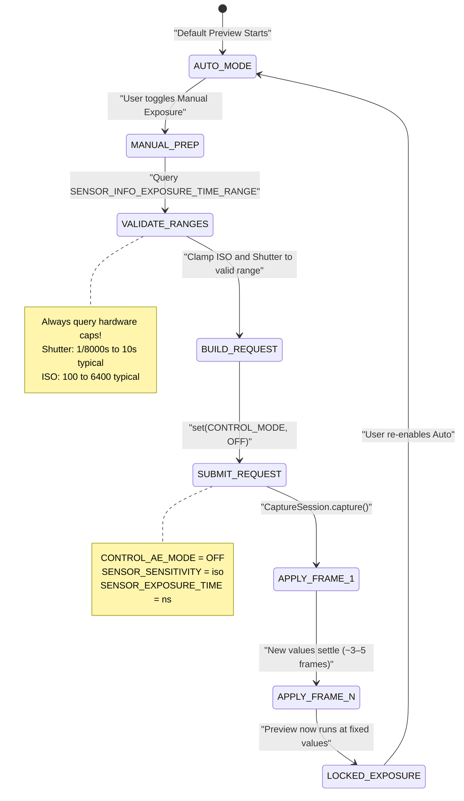

# Chapter 14: Manual Exposure in Camera2

With the photographic theory of Chapter 13 under your belt, it's time to translate concepts into code. In this chapter, you'll learn how to **completely take over** the camera's auto-exposure (AE) system and set the ISO and shutter speed manually with the Camera2 API.

The [Android Camera Parameters app](https://github.com/zoozooll/AndroidCameraParameters) demonstrates every technique in this chapter — you can follow along live by switching to Manual mode in the app and adjusting the ISO and Shutter sliders to see real-time results.

---

## The Big Switch: From AUTO → MANUAL

By default, every `CaptureRequest` you submit runs under the camera's built-in 3A auto-pipeline (Auto Exposure, Auto Focus, Auto White Balance). To go manual, you must **explicitly disable** the pipeline.

There are two levels of override:

| Level | Setting | What Happens |
|-------|---------|-------------|
| 1. Disable AE only | `CONTROL_AE_MODE = OFF` | ISO + shutter become manual; AF and AWB still auto-run |
| 2. Disable entire 3A | `CONTROL_MODE = OFF` | **All** 3A algorithms halt; every 3A parameter must be set manually |

For reliable manual exposure, set **both**. Disabling only `CONTROL_AE_MODE` on some devices still leaves OEM post-processing "helping" behind the scenes. Setting `CONTROL_MODE = OFF` is the cleanest, most predictable path.



**Transition latency:** When you submit a manual capture request, the new ISO/shutter values do not appear on the *next* frame. CMOS sensors have pipeline latency — the *current* frame is already being exposed with the old settings. Expect **3–5 frames of transition** before values settle. The [Android Camera Parameters app](https://play.google.com/store/apps/details?id=com.minininja.cameraparams) explicitly waits for `CaptureResult` to confirm the requested values match the applied values before reporting "locked."

---

## Manual Controls in Camera2 API

### SENSOR_SENSITIVITY (ISO)

Camera2 expresses ISO as `CaptureRequest.SENSOR_SENSITIVITY` — an integer that directly maps to the ISO arithmetic scale. On most devices, this is a 1:1 mapping:

| Photographer's ISO | SENSOR_SENSITIVITY value |
|-------------------|--------------------------|
| 100 | 100 |
| 400 | 400 |
| 3200 | 3200 |
| 6400 | 6400 |

**Always query the valid range.** Do not hardcode values:

```kotlin
val sensorSensitivityRange = characteristics.get(
    CameraCharacteristics.SENSOR_INFO_SENSITIVITY_RANGE
)
val minIso = sensorSensitivityRange?.lower ?: 100
val maxIso = sensorSensitivityRange?.upper ?: 6400
```

Some ultra-premium phones report a range like 50–12800, while budget devices may lock you to 100–3200. Values outside the range are clamped by the HAL — which defeats your manual-control purpose.

### SENSOR_EXPOSURE_TIME (Shutter in Nanoseconds)

Here's the first "gotcha" that trips every new Camera2 developer: **shutter speed is stored as nanoseconds (ns), not seconds.** Humans think in 1/60s; the HAL thinks in 16666666 ns.

Converting between them is straightforward arithmetic:

```kotlin
// Seconds → Nanoseconds (multiply by 1,000,000,000)
fun secondsToNs(seconds: Double): Long = (seconds * 1_000_000_000.0).toLong()

// Nanoseconds → Seconds for user display
fun nsToSeconds(ns: Long): Double = ns.toDouble() / 1_000_000_000.0

// Human-friendly string formatter (e.g., "1/60s" or "2.5s")
fun formatShutter(ns: Long): String {
    val seconds = nsToSeconds(ns)
    return when {
        seconds >= 1.0 -> String.format("%.1fs", seconds)
        else -> {
            val fraction = (1.0 / seconds).toInt()
            "1/${fraction}s"
        }
    }
}
```

**Common conversions for reference:**

| Human Shutter | Nanoseconds (ns) |
|--------------|-------------------|
| 1/8000s | 125,000 |
| 1/1000s | 1,000,000 |
| 1/500s | 2,000,000 |
| 1/120s (24fps 180° rule) | 8,333,333 |
| 1/60s | 16,666,666 |
| 1/30s | 33,333,333 |
| 1/15s | 66,666,666 |
| 1s | 1,000,000,000 |
| 2s | 2,000,000,000 |
| 10s | 10,000,000,000 |
| 30s | 30,000,000,000 |

**Again, query the hardware range:**

```kotlin
val exposureTimeRange = characteristics.get(
    CameraCharacteristics.SENSOR_INFO_EXPOSURE_TIME_RANGE
)
val minShutterNs = exposureTimeRange?.lower ?: 1_000_000L   // 1/1000s floor
val maxShutterNs = exposureTimeRange?.upper ?: 10_000_000_000L  // 10s ceiling
```

On devices supporting ultra-long exposure (e.g., some Sony Xperia and Google Pixel models), `SENSOR_INFO_EXPOSURE_TIME_RANGE.upper` can exceed 30,000,000,000 ns (30s). Respect this limit — requests beyond the maximum are silently clamped.

---

## ⚠️ Critical: Manual Mode Quality Degradation

**This is the most important warning in the chapter.** Do not skip it.

When you set `CONTROL_MODE = OFF` (full manual override), you are not just disabling the AE/AF/AWB *algorithms* — on nearly all Android devices, you are also **disabling the OEM's proprietary computational post-processing** that normally runs inside the 3A pipeline.

Specifically, research and HAL3 analysis reveals that disabling 3A typically turns off:

| Processing Step | AUTO Mode | MANUAL Mode (CONTROL_MODE = OFF) |
|-----------------|-----------|-----------------------------------|
| Multi-frame noise reduction | ✓ Active — noise-reduced output | ✗ OFF — visible raw sensor noise |
| Adaptive tone-mapping / HDR merge | ✓ Active — highlights + shadows recovered | ✗ OFF — single-frame curve only |
| Local contrast enhancement (MiraVision, etc.) | ✓ Varies by scene | ✗ Flat generic curve |
| Face metering / scene detection | ✓ Weights exposure to faces | ✗ Ignored |
| Lens shading / vignetting correction | ✓ Calibrated per-lens | ✗ Often reduced or off |

**Result:** A manual-mode photo at ISO 3200 and 1/15s will look *visibly worse* (noisier, flatter contrast) than the same scene captured in AUTO mode with the *identical* ISO and shutter the HAL chose.

**What can you do?** Two realistic options:

1. **Post-process yourself.** Since you've disabled OEM processing, you can apply your own denoising (e.g., OpenCV bilateral filter, MediaPipe denoiser, or custom-trained CNN) in your processing pipeline. RAW capture (see later chapters) + custom RAW development gives maximum artistic control.

2. **Use manual AE overrides instead of CONTROL_MODE = OFF.** If you only need to *lock* specific values while keeping OEM processing enabled, try setting `CONTROL_AE_MODE = ON` but pin `SENSOR_SENSITIVITY` and `SENSOR_EXPOSURE_TIME` on a request-by-request basis. Support for this mixed-mode is device-dependent — test thoroughly.

The [Android Camera Parameters app](https://github.com/zoozooll/AndroidCameraParameters) has a toggle in the Manual panel that switches between both approaches and lets you visually compare the quality difference.

---

## Complete Example 1: Locked Exposure for Timelapse

A classic use case for manual exposure is **timelapse photography**. In AUTO mode, the camera subtly adjusts exposure from frame to frame as clouds move or light changes. The resulting video flickers horribly. Locking ISO + shutter eliminates this.

**Goal:** ISO 100, 1/60s (16,666,666 ns) — locked for every frame.

```kotlin
class TimelapseManualExposure(
    private val characteristics: CameraCharacteristics,
    private val captureSession: CameraCaptureSession,
    private val imageReaderSurface: Surface,
    private val previewSurface: Surface
) {
    companion object {
        private const val TARGET_ISO = 100
        private const val TARGET_SHUTTER_NS = 16_666_666L // 1/60s
    }

    fun captureTimelapseFrame(frameCallback: ImageReader.OnImageAvailableListener) {
        try {
            // ---- STEP 1: Validate requested values are in hardware range ----
            val isoRange = characteristics.get(
                CameraCharacteristics.SENSOR_INFO_SENSITIVITY_RANGE
            )
            val shutterRange = characteristics.get(
                CameraCharacteristics.SENSOR_INFO_EXPOSURE_TIME_RANGE
            )

            val clampedIso = isoRange?.let {
                TARGET_ISO.coerceIn(it.lower, it.upper)
            } ?: TARGET_ISO

            val clampedShutter = shutterRange?.let {
                TARGET_SHUTTER_NS.coerceIn(it.lower, it.upper)
            } ?: TARGET_SHUTTER_NS

            // ---- STEP 2: Build CaptureRequest with manual exposure ----
            val requestBuilder = captureSession.device.createCaptureRequest(
                CameraDevice.TEMPLATE_STILL_CAPTURE
            ).apply {
                addTarget(previewSurface)
                addTarget(imageReaderSurface)

                // --- THE KEY LINES: Disable 3A and pin values ---
                set(CaptureRequest.CONTROL_MODE, CameraMetadata.CONTROL_MODE_OFF)
                set(CaptureRequest.CONTROL_AE_MODE, CameraMetadata.CONTROL_AE_MODE_OFF)
                set(CaptureRequest.SENSOR_SENSITIVITY, clampedIso)
                set(CaptureRequest.SENSOR_EXPOSURE_TIME, clampedShutter)

                // Optional: Pin AWB to Daylight for consistent color too
                set(CaptureRequest.CONTROL_AWB_MODE, CameraMetadata.CONTROL_AWB_MODE_DAYLIGHT)

                // Still-capture JPEG quality
                set(CaptureRequest.JPEG_QUALITY, 95)
            }

            // ---- STEP 3: Submit the still capture ----
            captureSession.capture(
                requestBuilder.build(),
                object : CameraCaptureSession.CaptureCallback() {
                    override fun onCaptureCompleted(
                        session: CameraCaptureSession,
                        request: CaptureRequest,
                        result: TotalCaptureResult
                    ) {
                        // Verify the HAL actually applied our values (it may clamp!)
                        val appliedIso = result.get(CaptureResult.SENSOR_SENSITIVITY)
                        val appliedShutter = result.get(CaptureResult.SENSOR_EXPOSURE_TIME)
                        Log.d("Timelapse", "Applied: ISO=$appliedIso, Shutter=${formatShutter(appliedShutter!!)}")
                    }
                },
                null // Run on current thread's Handler
            )

        } catch (e: CameraAccessException) {
            Log.e("Timelapse", "Manual capture failed", e)
        }
    }
}
```

**Key points:**

- Always use `coerceIn()` against the hardware ranges. If a budget phone min ISO is 120, your request for 100 silently becomes 120. `onCaptureCompleted()` confirms what was *actually* applied.
- For a timelapse, submit this request every N seconds (e.g., every 5s for a 300× speedup at 30fps output).
- Pinning `CONTROL_AWB_MODE_DAYLIGHT` is optional but recommended for timelapses — otherwise AWB may still subtly drift white balance between frames even when exposure is locked.

---

## Complete Example 2: Long Exposure for Night Photography

**Goal:** ISO 3200, 2 seconds (2,000,000,000 ns) — smooth water trails, bright night sky.

**Critical hardware requirement:** The device must support `SENSOR_INFO_EXPOSURE_TIME_RANGE.upper >= 2,000,000,000 ns`. Many mid-range phones max out at ~1/8s to 1s.

```kotlin
class NightLongExposure(
    private val characteristics: CameraCharacteristics,
    private val captureSession: CameraCaptureSession,
    private val previewSurface: Surface,
    private val jpegReaderSurface: Surface,
    private val rawReaderSurface: Surface? // Optional RAW capture
) {
    fun shootLongExposure(onPhotoSaved: (path: String) -> Unit) {
        val shutterNs = 2_000_000_000L  // 2 seconds
        val targetIso = 3200

        // --- Validate the hardware can even do this ---
        val shutterRange = characteristics.get(
            CameraCharacteristics.SENSOR_INFO_EXPOSURE_TIME_RANGE
        )
        if (shutterRange == null || shutterRange.upper < shutterNs) {
            throw UnsupportedOperationException(
                "Device does not support 2s exposure. Max = " +
                "${shutterRange?.upper?.let { nsToSeconds(it) } ?: "unknown"}s"
            )
        }

        val requestBuilder = captureSession.device.createCaptureRequest(
            CameraDevice.TEMPLATE_STILL_CAPTURE
        ).apply {
            addTarget(previewSurface)
            addTarget(jpegReaderSurface)
            // If you configured a RAW-capable OutputConfiguration earlier:
            rawReaderSurface?.let { addTarget(it) }

            // Manual exposure override
            set(CaptureRequest.CONTROL_MODE, CameraMetadata.CONTROL_MODE_OFF)
            set(CaptureRequest.CONTROL_AE_MODE, CameraMetadata.CONTROL_AE_MODE_OFF)
            set(CaptureRequest.SENSOR_SENSITIVITY, targetIso)
            set(CaptureRequest.SENSOR_EXPOSURE_TIME, shutterNs)

            // --- Critical for long exposures ---
            // Disable optical/digital video stabilization (they conflict >1s)
            set(CaptureRequest.LENS_OPTICAL_STABILIZATION_MODE,
                CameraMetadata.LENS_OPTICAL_STABILIZATION_MODE_OFF)
            // No flash for long exposure shots
            set(CaptureRequest.CONTROL_AE_MODE, CameraMetadata.CONTROL_AE_MODE_OFF)
        }

        captureSession.capture(
            requestBuilder.build(),
            object : CameraCaptureSession.CaptureCallback() {
                override fun onCaptureStarted(
                    session: CameraCaptureSession,
                    request: CaptureRequest,
                    timestamp: Long
                ) {
                    super.onCaptureStarted(session, request, timestamp)
                    // Notify UI: "Exposure started — hold very still for 2 seconds"
                    Log.d("LongExposure", "Exposure started @ $timestamp")
                }

                override fun onCaptureCompleted(
                    session: CameraCaptureSession,
                    request: CaptureRequest,
                    result: TotalCaptureResult
                ) {
                    // ImageReader.OnImageAvailableListener fires separately to save the JPEG
                    Log.d("LongExposure", "Long exposure capture complete")
                }
            },
            null
        )
    }
}
```

**Long exposure tips:**

1. **Turn off OIS.** Optical image stabilization in most lenses tries to compensate for camera shake *during* the exposure. For exposures >0.5s, the OIS actuators can saturate and cause visible drift. Disable it and use a tripod.

2. **Expect a freeze.** The camera will not output preview frames while a 2-second exposure is running. Your UI should show an explicit "EXPOSING…" indicator.

3. **RAW is better.** High ISO (3200) + long exposure produces thermal noise (the sensor warms up). Save a RAW frame and use a desktop RAW developer with frame averaging — or implement your own multi-frame long exposure by averaging 8 × 0.25s frames instead of 1 × 2s frame (reduces thermal noise dramatically).

---

## Complete Example 3: 3-Shot Exposure Bracketing

**Goal:** Same ISO, 3 different exposures at −1 EV, 0 EV, +1 EV. The user later merges them into an HDR photo.

From Chapter 13, we know each EV step doubles/halves light. At a fixed ISO, each EV step = multiply/divide shutter speed by 2.

```kotlin
class ExposureBracketing(
    private val characteristics: CameraCharacteristics,
    private val captureSession: CameraCaptureSession,
    private val previewSurface: Surface,
    private val jpegReaderSurface: Surface
) {
    data class BracketFrame(
        val label: String,
        val evShift: Double,  // -1.0, 0.0, +1.0
        val shutterNs: Long,
        val iso: Int
    )

    fun captureBracketSeries(baseIso: Int, baseShutterNs: Long) {
        val isoRange = characteristics.get(
            CameraCharacteristics.SENSOR_INFO_SENSITIVITY_RANGE
        )
        val shutterRange = characteristics.get(
            CameraCharacteristics.SENSOR_INFO_EXPOSURE_TIME_RANGE
        )

        // Build bracket plan: multiply shutter by 2^(evStep)
        val frames = listOf(-1.0, 0.0, +1.0).map { ev ->
            val multiplier = Math.pow(2.0, ev)
            val rawShutter = (baseShutterNs.toDouble() * multiplier).toLong()
            val clampedShutter = shutterRange?.let {
                rawShutter.coerceIn(it.lower, it.upper)
            } ?: rawShutter
            val clampedIso = isoRange?.let {
                baseIso.coerceIn(it.lower, it.upper)
            } ?: baseIso
            BracketFrame("EV${if (ev > 0) "+" else ""}${ev.toInt()}", ev, clampedShutter, clampedIso)
        }

        Log.d("Bracket", "Plan: ${frames.map { "${it.label} ISO${it.iso} ${formatShutter(it.shutterNs)}" }}")

        // Submit each frame as a burst using captureBurst() for atomicity
        val requestList = frames.map { frame ->
            captureSession.device.createCaptureRequest(
                CameraDevice.TEMPLATE_STILL_CAPTURE
            ).apply {
                addTarget(previewSurface)
                addTarget(jpegReaderSurface)

                set(CaptureRequest.CONTROL_MODE, CameraMetadata.CONTROL_MODE_OFF)
                set(CaptureRequest.CONTROL_AE_MODE, CameraMetadata.CONTROL_AE_MODE_OFF)
                set(CaptureRequest.SENSOR_SENSITIVITY, frame.iso)
                set(CaptureRequest.SENSOR_EXPOSURE_TIME, frame.shutterNs)

                // Tag each request so we can sort frames in the callback
                setTag(frame.label)
            }.build()
        }

        captureSession.captureBurst(
            requestList,
            object : CameraCaptureSession.CaptureCallback() {
                override fun onCaptureCompleted(
                    session: CameraCaptureSession,
                    request: CaptureRequest,
                    result: TotalCaptureResult
                ) {
                    val tag = request.tag as? String ?: "?"
                    Log.d("Bracket", "$tag complete — ready for HDR merge")
                }
            },
            null
        )
    }
}
```

**Why `captureBurst()` instead of three separate `capture()` calls?** `captureBurst()` submits the entire list atomically. The HAL guarantees no other preview frames get interleaved, and focus/white-balance state won't drift between frames.

**Want 5 or 7 brackets?** Just change `listOf(-2.0, -1.0, 0.0, +1.0, +2.0)` — the math scales. Many professional HDR apps shoot 9 brackets for extreme dynamic range scenes.

**Merge step:** Once you have the three JPEG (or RAW) frames, you can merge them using:
- Android's built-in HDR pipeline via `CameraExtensionSession` (see HDR chapter)
- A 3rd-party library like OpenCV's `createMergeDebevec()` / `createMergeRobertson()` for true exposure fusion
- Google's Photo Sphere HDR library

---

## Troubleshooting Common Failures

| Problem | Likely Cause | Fix |
|---------|-------------|-----|
| Manual values seem ignored, still looks auto | `CONTROL_MODE` not set to OFF, or values clamped | Set both CONTROL_MODE and CONTROL_AE_MODE to OFF; verify applied values in `onCaptureCompleted()` |
| 2s long exposure request errors immediately | Device can't do 2s exposure | Check `SENSOR_INFO_EXPOSURE_TIME_RANGE.upper`; reduce exposure time or use ISO bump instead |
| Preview stutters or lags when switching manual | Too many `setRepeatingRequest()` calls | Use throttled slider listener (every 30–50 ms); only update repeating request, not still captures |
| Long exposure photo is all black at ISO 100 2s | Scene actually needs more light at ISO 100 | Increase ISO or extend shutter; 2s ISO 100 = EV 0 baseline, not "night bright" |
| Manual shots noisier than Auto at same ISO | OEM NR disabled by CONTROL_MODE = OFF | Expected behavior! See "Manual Mode Quality Degradation" section. Post-process, or use partial manual via AE_LOCK |

---

## Summary

You now have the tools to wrest full control of exposure from the Camera2 HAL:

- **Disable 3A pipeline** with `CONTROL_MODE = OFF` + `CONTROL_AE_MODE = OFF` for fully manual control
- **Map ISO → `SENSOR_SENSITIVITY`** (1:1 mapping on most hardware; always query the range)
- **Map seconds ↔ nanoseconds** for `SENSOR_EXPOSURE_TIME` with simple 10⁹ conversion
- **Timelapse lock:** Fixed ISO 100 + 1/60s repeated for every frame = zero flicker
- **Night long exposure:** ISO 3200 + 2s with OIS disabled = bright smooth night scene (on supported hardware)
- **Exposure bracketing:** Same ISO, shutter ×0.5 / ×1 / ×2 via `captureBurst()` = ready-to-merge HDR input
- **⚠️ Manual quality tradeoff:** Disabling 3A disables OEM noise reduction and tone-mapping — manual photos often look *worse* at identical ISO than Auto. Plan for post-processing.

## What's Next

Exposure controls *brightness*. **Focus controls sharpness.** In **Chapter 15: Focus**, we cover:

- Auto Focus (AF) states and modes — how passive scan works, the difference between continuous picture vs. video
- Manual focus with `LENS_FOCUS_DISTANCE` in diopters (0.0 = infinity, 10D = 0.1m)
- Kotlin code for a one-shot AF trigger-and-capture sequence, and a manual-focus SeekBar slider
- The AF state machine — when `CONTROL_AF_STATE_FOCUSED_LOCKED` actually fires, and how to wait for it

The blur stops here. (Pun very much intended.)
