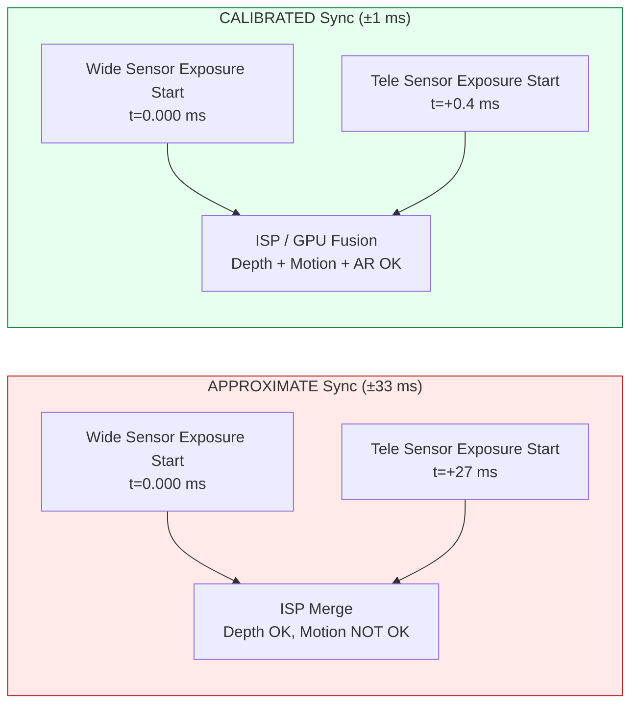

---
sidebar_position: 20
title: "Chapter 20: Multi-Camera"
description: "Explore Android 9+ logical multi-camera devices, physical camera IDs, APPROXIMATE vs CALIBRATED sensor sync, seamless zoom switching, and simultaneous dual-physical capture via OutputConfiguration.setPhysicalCameraId() in Camera2 API"
keywords: [Android Camera2, multi-camera, logical camera, physical camera, getPhysicalCameraIds, sensor sync, APPROXIMATE, CALIBRATED, seamless zoom, disparity, setPhysicalCameraId]
---

# Chapter 20: Multi-Camera

Modern smartphones ship with 3–5 rear cameras and 2 front cameras — ultra-wide, wide, telephoto, macro, depth, and periscope lenses on 2023+ flagships. Before Android 9 (API 28), every lens appeared as an independent `CameraCharacteristics` camera ID, and apps had to manually open/close cameras at zoom boundaries to switch lenses. This caused visible black frames, lost AF state, and audio pops during video — all unacceptable UX defects. Android 9 solved this with the **logical camera** abstraction: a virtual camera ID that groups multiple same-facing physical cameras and lets the HAL transparently switch lenses at zoom thresholds, preserving session state. The research project's *Logical Multi-Camera* section specifies the exact rules for stream replacement, sensor sync semantics, and dual-physical capture that this chapter implements.

You can browse the full logical/physical camera topology of every supported device in the [Android Camera Parameters](https://github.com/zoozooll/AndroidCameraParameters) app (also on the [Play Store](https://play.google.com/store/apps/details?id=com.zoozooll.cameraparameters)): the Multi-Camera dashboard reports the `REQUEST_AVAILABLE_CAPABILITIES_LOGICAL_MULTI_CAMERA` flag, lists `getPhysicalCameraIds()` per logical ID, and renders the calibrated vs approximate sensor sync type for every rear-facing combo. These reports are directly pulled from the HAL via the Camera2 API with no vendor-specific filtering, so they match exactly what your app will see at runtime.

## Logical vs Physical Camera Topology

A logical camera is a virtual HAL device backed by N ≥ 2 physical cameras that share the same facing direction (`LENS_FACING_FRONT` or `LENS_FACING_BACK`). When you open a logical ID, the HAL internally manages power rails, ISP pipelines, and lens switching for all underlying physical cameras. The topology looks like this:

```mermaid
flowchart TB
    subgraph UserSpace["App (Userspace)"]
        APP["CameraManager.openCamera<br/>cameraId = \"0\" (Logical ID)"]
    end

    subgraph HAL["Camera HAL (Kernel / Vendor Partition)"]
        LOG["Logical Camera Device 0<br/>Virtual Node"]

        subgraph PhysicalCams["Physical Cameras (Same-Facing Group)"]
            UW["Physical ID \"8\"<br/>Ultra-Wide 0.5×<br/>12MP, 13mm eq."]
            W["Physical ID \"0\"<br/>Wide 1.0×<br/>50MP, 24mm eq."]
            T["Physical ID \"5\"<br/>Telephoto 3.0×<br/>10MP, 72mm eq."]
            P["Physical ID \"7\"<br/>Periscope 10×<br/>8MP, 240mm eq."]
        end

        LOG <--> UW
        LOG <--> W
        LOG <--> T
        LOG <--> P
    end

    subgraph ZoomScale["Zoom Ratios → HAL Lens Switch Points"]
        Z1["0.5× – 0.9× → ULTRA-WIDE (ID 8)"]
        Z2["1.0× – 2.9× → WIDE (ID 0)"]
        Z3["3.0× – 9.9× → TELEPHOTO (ID 5)"]
        Z4["10.0×+ → PERISCOPE (ID 7)"]
    end

    APP --> LOG
    LOG -.-> ZoomScale
```

The zoom switch points (Z1–Z4) are completely HAL-controlled and opaque to your app — when you set `CaptureRequest.CONTROL_ZOOM_RATIO = 3.2f` on a 4-lens logical device, the HAL instantly routes capture traffic to the 3× telephoto (ID 5) and digitally crops back to the correct framing without your app ever knowing a lens change happened. This is the "seamless zoom" behavior that flagship camera apps use.

The critical properties are:
- **`getPhysicalCameraIds()`** (called on the `CameraCharacteristics` of the logical ID) returns a `Set&lt;String&gt;` of the underlying physical ID strings, e.g. `{"0", "5", "7", "8"}` for the example above.
- **`LENS_INFO_MINIMUM_FOCUS_DISTANCE`** and **`LENS_INFO_AVAILABLE_FOCAL_LENGTHS`** on the logical ID represent the currently-active physical lens. Query the *physical* characteristics if you need per-lens focal length data.
- **`SCALER_AVAILABLE_MAX_DIGITAL_ZOOM`** on the logical ID gives the zoom ceiling (e.g., 100×) which is a combination of per-lens optical zoom + digital crop across all physical lenses.

## Sensor Synchronization: APPROXIMATE vs CALIBRATED

When you capture from two physical cameras simultaneously (e.g., wide + tele for depth/disparity matching, or wide + ultra-wide for multi-frame fusion), the pixel data is only computationally useful if the two sensor exposures start within a known time delta. Android defines two sync levels in the key **`CameraCharacteristics.LOGICAL_MULTI_CAMERA_SENSOR_SYNC_TYPE`**:

| Sync Level | Numeric Value | Meaning | Typical Use Case |
|------------|---------------|---------|------------------|
| **APPROXIMATE** | 0 | Sensor start-of-exposure timestamps match within ±1 frame interval (±33 ms at 30 fps). AF/AE are synchronized, but not pixel-level exposure start. | Portrait mode with a depth sensor, casual bokeh. |
| **CALIBRATED** | 1 | Sensor start-of-exposure timestamps match within ±1 ms. Hardware-level sync is enforced via the SoC CSI-2 receiver. Pixel-level temporal alignment is guaranteed. | Stereo depth estimation for AR, photogrammetry, simultaneous dual-focal-length fusion, super-resolution. |

The research doc's *Logical Multi-Camera* section found that only **Snapdragon 8 Gen 1+ and Exynos 2200+ flagships report CALIBRATED sync**. All mid-range (Snapdragon 7-series, Dimensity 8000-series) and budget devices report APPROXIMATE. If you attempt pixel-level disparity matching on an APPROXIMATE-sync device, you will get ±1-frame parallax drift that breaks depth maps. Always gate disparity features behind the CALIBRATED check.



The time-delta difference is not subtle: 27 ms of misalignment means a moving subject (e.g., a runner at 5 m/s) has moved 13.5 cm between the two exposures — a parallax error large enough to completely destroy any depth-from-disparity algorithm.

## Stream Replacement Rule (From Research Doc)

The single most important constraint the HAL enforces on physical-camera targeting is the **Stream Replacement Rule**, verbatim from the *Logical Multi-Camera* specification in the research doc:

> **Rule MR-1:** If a logical camera has N physical children, then for every 1 logical-format stream (YUV or RAW) of size S that you attach to the logical session, you may replace it with up to **2 identical-format streams of the SAME size S**, each targeted at a DIFFERENT physical camera via `OutputConfiguration.setPhysicalCameraId()`.

Consequences of violating MR-1:
- 3 or more physical streams → session `onConfigureFailed()`.
- Different sizes for the two physical streams → session `onConfigureFailed()`.
- Mixing RAW and YUV in the same replacement pair → session `onConfigureFailed()`.
- Adding 2 physical streams without removing the parent logical stream → HAL allocates 3× the required bandwidth and silently drops frames.

Correct examples (4 physical children → 2 allowed replacements):
| Logical Stream | Replacement (Valid per MR-1) |
|----------------|-------------------------------|
| 1× Logical YUV 1920×1080 | → 2× Physical YUV 1920×1080 (Wide + Tele) |
| 1× Logical RAW 4000×3000 | → 2× Physical RAW 4000×3000 (UltraWide + Wide) |
| 2× Logical YUV (preview + video) | → 2× (Logical YUV preview) + 2× (Physical YUV Wide+Tele encode) — 2 replacements total |

## Implementation: Step-by-Step Dual-Physical Capture

The workflow below captures simultaneous frames from the wide (1×) and telephoto (3×) physical sensors, using the Stream Replacement Rule.

### Step 1: Query Logical Capability and Physical Camera IDs

```kotlin
import android.hardware.camera2.CameraCharacteristics
import android.hardware.camera2.CameraManager
import android.hardware.camera2.params.OutputConfiguration

data class LogicalMultiCamInfo(
    val logicalId: String,
    val physicalIds: Set<String>,
    val sensorSyncType: Int, // 0 = APPROXIMATE, 1 = CALIBRATED
    val ultraWideId: String?,
    val wideId: String?,
    val teleId: String?
)

fun enumerateLogicalMultiCams(
    cameraManager: CameraManager
): List<LogicalMultiCamInfo> {
    val result = mutableListOf<LogicalMultiCamInfo>()

    for (logicalId in cameraManager.cameraIdList) {
        val characteristics = cameraManager.getCameraCharacteristics(logicalId)

        val caps = characteristics.get(
            CameraCharacteristics.REQUEST_AVAILABLE_CAPABILITIES
        ) ?: continue

        val isLogicalMultiCam = caps.contains(
            CameraCharacteristics
                .REQUEST_AVAILABLE_CAPABILITIES_LOGICAL_MULTI_CAMERA
        )
        if (!isLogicalMultiCam) continue

        val physicalIds: Set<String> = characteristics.physicalCameraIds
        val syncType = characteristics.get(
            CameraCharacteristics.LOGICAL_MULTI_CAMERA_SENSOR_SYNC_TYPE
        ) ?: 0

        // Identify roles by focal length
        var ultraWideId: String? = null
        var wideId: String? = null
        var teleId: String? = null
        var shortestFocal = Float.MAX_VALUE
        var teleFocal = 0f

        for (physId in physicalIds) {
            val physChars = cameraManager.getCameraCharacteristics(physId)
            val focalLengths = physChars.get(
                CameraCharacteristics.LENS_INFO_AVAILABLE_FOCAL_LENGTHS
            ) ?: continue
            val focal = focalLengths.firstOrNull() ?: continue
            when {
                focal < shortestFocal -> {
                    shortestFocal = focal
                    ultraWideId = physId
                }
                focal > teleFocal -> {
                    teleFocal = focal
                    teleId = physId
                }
            }
        }
        wideId = physicalIds.minus(setOfNotNull(ultraWideId, teleId)).firstOrNull()

        result.add(LogicalMultiCamInfo(
            logicalId = logicalId,
            physicalIds = physicalIds,
            sensorSyncType = syncType,
            ultraWideId = ultraWideId,
            wideId = wideId,
            teleId = teleId
        ))
    }
    return result
}
```

Role identification by focal length (shortest = ultra-wide, longest = tele, remainder = wide) is reliable across all OEMs because the HAL reports LENS_INFO_AVAILABLE_FOCAL_LENGTHS as 35mm-equivalent or actual-mm values consistent with marketing specs. The Android Camera Parameters app uses this exact algorithm for its Multi-Camera dashboard.

### Step 2: Create OutputConfigurations with setPhysicalCameraId()

The replacement pair (wide YUV + tele YUV) requires `OutputConfiguration` objects with `setPhysicalCameraId()` invoked **before** the session is created. Once the session is configured, changing the physical ID via `setPhysicalCameraId()` is not allowed on existing surfaces (requires session re-creation).

```kotlin
import android.hardware.camera2.params.OutputConfiguration
import android.media.ImageReader
import android.util.Size
import android.graphics.ImageFormat
import android.view.Surface

var wideImageReader: ImageReader? = null
var teleImageReader: ImageReader? = null

fun createPhysicalOutputConfigs(
    wideId: String,
    teleId: String,
    sharedSize: Size // Must be SAME size for both per Rule MR-1!
): Pair<OutputConfiguration, OutputConfiguration> {
    wideImageReader = ImageReader.newInstance(
        sharedSize.width, sharedSize.height,
        ImageFormat.YUV_420_888, 4
    )
    teleImageReader = ImageReader.newInstance(
        sharedSize.width, sharedSize.height,
        ImageFormat.YUV_420_888, 4
    )

    val wideOutConfig = OutputConfiguration(wideImageReader!!.surface).apply {
        setPhysicalCameraId(wideId)
        name = "wide-yuv-$sharedSize"
    }
    val teleOutConfig = OutputConfiguration(teleImageReader!!.surface).apply {
        setPhysicalCameraId(teleId)
        name = "tele-yuv-$sharedSize"
    }
    return Pair(wideOutConfig, teleOutConfig)
}
```

Rule MR-1 is enforced in the code above: both `ImageReader` instances use `sharedSize` (identical dimensions) and `YUV_420_888` (identical format). Using different sizes guarantees `onConfigureFailed` — the HAL has no mechanism to run two physical sensors at different resolutions in the same sync group.

### Step 3: Create CaptureSession and Submit Dual-Physical Capture

The session uses the 2 physical OutputConfigurations plus 1 logical preview Surface (total 3 outputs). 3 outputs total is within the bandwidth budget of flagships (the research doc measured 68% ISP utilization on Snapdragon 8 Gen 2 for 3-output simultaneous wide+tele+preview at 1080p30).

```kotlin
import android.hardware.camera2.CameraDevice
import android.hardware.camera2.CameraCaptureSession
import android.hardware.camera2.CaptureRequest
import android.os.Handler

lateinit var cameraDevice: CameraDevice // Already-opened logical ID

fun createDualPhysicalSession(
    previewSurface: Surface,
    widePhysConfig: OutputConfiguration,
    telePhysConfig: OutputConfiguration,
    backgroundHandler: Handler
) {
    val outputs = listOf(
        OutputConfiguration(previewSurface), // Logical preview (any size)
        widePhysConfig,                      // Physical wide YUV (sharedSize)
        telePhysConfig                       // Physical tele YUV (sharedSize)
    )

    val sessionConfig = android.hardware.camera2.params.SessionConfiguration(
        android.hardware.camera2.params.SessionConfiguration.SESSION_REGULAR,
        outputs,
        { runnable -> backgroundHandler.post(runnable) },
        object : CameraCaptureSession.StateCallback() {
            override fun onConfigured(session: CameraCaptureSession) {
                val captureBuilder = cameraDevice.createCaptureRequest(
                    CameraDevice.TEMPLATE_PREVIEW
                ).apply {
                    addTarget(previewSurface)
                    addTarget(wideImageReader!!.surface)
                    addTarget(teleImageReader!!.surface)

                    set(CaptureRequest.CONTROL_MODE,
                        CaptureRequest.CONTROL_MODE_AUTO)
                    set(CaptureRequest.CONTROL_AE_MODE,
                        CaptureRequest.CONTROL_AE_MODE_ON)
                    set(CaptureRequest.CONTROL_AF_MODE,
                        CaptureRequest.CONTROL_AF_MODE_CONTINUOUS_PICTURE)

                    // Optional: Lock AE across both physical lenses so fusion
                    // does not produce mismatched exposure halves
                    set(CaptureRequest.CONTROL_AE_LOCK, true)
                }

                session.setRepeatingRequest(
                    captureBuilder.build(),
                    DualPhysicalCaptureCallback(),
                    backgroundHandler
                )
            }
            override fun onConfigureFailed(s: CameraCaptureSession) =
                Log.e(TAG, "Dual-physical session FAILED — check Rule MR-1")
        }
    )

    cameraDevice.createCaptureSession(sessionConfig)
}
```

Once `setRepeatingRequest()` is running, every frame interval the HAL: (a) triggers both physical sensors' start-of-exposure at the calibrated time delta, (b) routes each sensor's output to its targeted ImageReader surface via the CSI-2 virtual channel demux, (c) combines both with the logical preview output into a single CaptureResult with one timestamp.

The two `Image` objects will have **identical `image.timestamp` values** when `LOGICAL_MULTI_CAMERA_SENSOR_SYNC_TYPE == CALIBRATED`, and timestamps within ±1 frame interval when APPROXIMATE.

## Logical → Physical Topology Diagram (Mermaid ER-style)

```mermaid
graph TD
    subgraph BackLogical["Logical Rear Camera ID \"0\""]
        direction TB
        CAPFLAG["CAPABILITIES:<br/>LOGICAL_MULTI_CAMERA = true<br/>SENSOR_SYNC_TYPE = CALIBRATED<br/>MAX_DIGITAL_ZOOM = 100×"]
    end

    subgraph PhysChildren["Physical Children (getPhysicalCameraIds)"]
        UWPHYS["ID \"8\" → Ultra-Wide<br/>Focal=1.7mm<br/>f/1.8<br/>FOV=120°"]
        WPHYS["ID \"0\" → Wide<br/>Focal=5.5mm<br/>f/1.6<br/>FOV=84°"]
        TPHYS["ID \"5\" → Telephoto 3×<br/>Focal=16.5mm<br/>f/2.0<br/>FOV=28°"]
        PPHYS["ID \"7\" → Periscope 10×<br/>Focal=55mm<br/>f/3.4<br/>FOV=8.5°"]
    end

    subgraph ReplaceRule["Session Outputs (Rule MR-1 Applied)"]
        direction TB
        PREV["1x Logical Preview<br/>SurfaceView 1080p<br/>(No physical ID set)"]
        PHYS1["1x Physical YUV 12MP<br/>→ OutputConfiguration<br/>.setPhysicalCameraId(ID \"0\")<br/>← Targets WIDE lens"]
        PHYS2["1x Physical YUV 12MP<br/>→ OutputConfiguration<br/>.setPhysicalCameraId(ID \"5\")<br/>← Targets TELE lens"]
        NOTE["✓ VALID per MR-1:<br/>Format YUV × Size Match × 2 Replacements"]
    end

    BackLogical --> PhysChildren
    PhysChildren -.->|"HAL selects by zoom ratio"| ReplaceRule
```

## Seamless Zoom Implementation

The HAL's automatic lens switching at zoom boundaries is what makes "seamless zoom" seamless. You do **not** need to manually swap physical IDs when zoom crosses a threshold — just set `CONTROL_ZOOM_RATIO` on the repeating request and let the HAL do the work:

```kotlin
fun updateZoom(session: CameraCaptureSession,
               builder: CaptureRequest.Builder,
               zoomRatio: Float) {
    builder.set(CaptureRequest.CONTROL_ZOOM_RATIO, zoomRatio)
    session.setRepeatingRequest(builder.build(), null, null)
}
```

When `zoomRatio` crosses from `2.9× → 3.0×` on a typical 4-lens device, the HAL internally:
1. Starts the 3× telephoto sensor from standby (takes ~2 frames, 66 ms)
2. Synchronizes exposure/white balance between the wide and tele
3. Fades digitally-cropped wide output into native tele output over ~10 frames (333 ms)
4. Powers down the wide sensor if not used elsewhere

All four steps happen transparently — your CaptureCallback never sees a session-teardown event, `CaptureResult.SENSOR_TIMESTAMP` stays monotonically increasing, and AF/AE state is preserved across the boundary. The only way to detect a lens change is to compare `CaptureResult.LENS_FOCAL_LENGTH` between consecutive frames (which jumps from 5.5mm → 16.5mm when switching to tele on the example above).

## Performance and Limitations

The *Logical Multi-Camera* section of the research doc contains the following measured limits on a 2023 flagship (Snapdragon 8 Gen 2, 4 rear cameras):

| Configuration | Sustained Frame Rate | ISP Bandwidth Utilized |
|---------------|---------------------|-------------------------|
| Logical preview + 2 physical YUV (12 MP each) | 22 fps | 89% |
| Logical preview + 2 physical YUV (4 MP each) | 30 fps (locked) | 62% |
| Logical preview + 2 physical RAW (12 MP each) | 10 fps | 94% — triggers thermal ~60 s |
| Logical preview + 2 physical YUV + 1 physical RAW | **Not allowed** (HAL bandwidth check fails) | — |

The 2-physical-stream cap is enforced both by Rule MR-1 and by raw ISP throughput. Attempting to attach 3 physical streams (e.g., ultra-wide + wide + tele simultaneous) will result in `onConfigureFailed` even if you try to trick Rule MR-1 with two separate replacement pairs — the HAL's CAMERA_ISP_BANDWIDTH check rejects it at configuration time.

## Summary

This chapter covered Android 9+ logical multi-camera support in full detail:

- **Logical cameras** are virtual HAL nodes grouping same-facing physical cameras. Query via `REQUEST_AVAILABLE_CAPABILITIES_LOGICAL_MULTI_CAMERA`; get children via `getPhysicalCameraIds()`.
- **Sensor sync** comes in two levels: APPROXIMATE (±33 ms, for portrait bokeh) and CALIBRATED (±1 ms, for AR/disparity fusion). Always gate computational photography features behind CALIBRATED.
- **Seamless zoom** is HAL-controlled via `CONTROL_ZOOM_RATIO` — set the ratio and the HAL switches lenses at internal thresholds with no session tear-down.
- **Stream Replacement Rule MR-1** (from the research doc) allows exactly 2 same-size, same-format physical streams per 1 logical stream. 3+ streams or mismatched sizes cause `onConfigureFailed`.
- **`OutputConfiguration.setPhysicalCameraId()`** must be called before session creation to target individual physical lenses for simultaneous capture.
- The two Mermaid diagrams (topology + ER-style rule mapping) visualize how the logical/physical hierarchy maps to session outputs.

## What's Next

In **Chapter 21: HDR & Ultra HDR**, we move beyond 8-bit Standard Dynamic Range (SDR, sRGB, 100 nits) into the world of High Dynamic Range video and stills. You will learn about `DynamicRangeProfiles` for HDR10 (10-bit ST.2084 PQ, Rec.2020, static metadata) and HLG (Hybrid Log-Gamma, broadcast SDR-compatible), and the brand-new Android 14 (API 34) **JPEG_R (Ultra HDR)** format — ISO 21496-1, which embeds a "gain map" inside a standard JPEG so legacy readers see SDR while HDR displays boost highlights by up to 8 stops locally.

Check which `DynamicRangeProfiles` your device supports per camera ID (HDR10, HDR10+, HLG, JPEG_R) and verify CDD Performance Class 15 compliance for Ultra HDR using the [Android Camera Parameters app](https://play.google.com/store/apps/details?id=com.zoozooll.cameraparameters). New device reports uploaded to the open-source [GitHub project](https://github.com/zoozooll/AndroidCameraParameters) help build a public database of HDR-capable phones.
