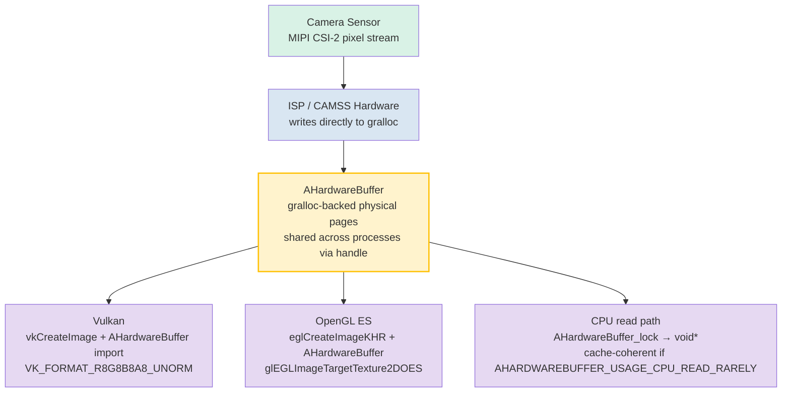

# Chapter 25: Native Camera Development

## Summary

Chapters 1–24 operated in managed code: Kotlin or Java running on ART, crossing a Binder IPC boundary for every `CaptureRequest`, and either allocating `ByteBuffer` copies of frames or accepting the overhead of `SurfaceTexture`-mediated texture streaming. For social camera apps, this is plenty. For AR engines, real-time computer vision pipelines, in-car rear-view cameras, or 3D engines with a 16ms per-frame budget — this is not.

Native camera development moves the entire camera open/configure/capture loop into C/C++ using the NDK's `<camera/NdkCameraManager.h>` and `<android/hardware_buffer.h>` headers. The immediate payoff is zero JNI overhead on the hot path and, critically, the ability to wrap gralloc-allocated `AHardwareBuffer` objects directly as Vulkan `VkImage` or OpenGL `EGLImage` targets without a single byte of memory copy between sensor output and GPU texture sampling.

**Android Camera Parameters** helps you validate that your target devices expose the `INFO_SUPPORTED_HARDWARE_LEVEL_FULL` or `LEVEL_3` guarantees required for predictable low-level native operation. Install it from [Google Play](https://play.google.com/store/apps/details?id=com.minininja.cameraparams) or check the source at [github.com/zoozooll/AndroidCameraParameters](https://github.com/zoozooll/AndroidCameraParameters).

---

## Why Go Native?

Before diving into C++, let us be precise about what native buys you and when it justifies the complexity.

### The Case for Native

1. **Zero JNI overhead on the critical path.** A 60fps pipeline has 16.67ms per frame. A single JNI `CallVoidMethod` crossing the ART/C boundary is ~0.5–2µs microbenchmarked, but the real cost is the call *per frame*, the thread handoff, the JNI local reference bookkeeping, and GC pressure from managed `Image` proxies. Multiply by four cameras feeding an AR session simultaneously and you are burning a millisecond of budget just crossing language boundaries. Native eliminates this.

2. **Direct memory ownership with `AHardwareBuffer`.** In managed code, `Image.getPlanes()[0].getBuffer()` returns a `ByteBuffer` that is a *view* on gralloc memory; reading it forces a CPU cache-invalidate and often an internal copy for formats like `PRIVATE`. In native code, `AHardwareBuffer` is the gralloc handle itself, and the GPU can bind it as texture memory in-place.

3. **AR/3D engine integration.** Unity, Unreal, Ogre, and in-house engines are written in C++ for good reason. Running the camera *inside* the render loop C++ code eliminates the "ART + JNI + render thread" three-process tangle.

4. **Automotive EVS (External View System) migration.** Prior to Android 10, automotive rear-view cameras used the legacy `EVS` stack with its own HAL. The 2020–2024 OEM migrations converged EVS onto the standard Camera2 NDK APIs, reserving `AID_AUTOMOTIVE_EVS_UID = 1071` for early hardware access during boot *before* the `system_server` CameraService is even running. If your code targets automotive, native is non-negotiable.

### The Case Against Native

- Debugging is harder. Crashes in `ACameraDevice` callbacks produce tombstone traces, not nice Kotlin stack traces.
- Lifecycle management is fully manual. `ACameraManager` is *not* lifecycle-aware; forgetting `ACameraCaptureSession_stopRepeating()` + `ACameraDevice_close()` on surface destroy leaks camera resources and can block other apps until reboot.
- Fewer device workarounds. CameraX's quirk database does not exist in NDK-land; you inherit raw HAL behavior exactly as it ships.
- No `DngCreator`, no `ExifInterface` helpers, no `CameraCharacteristics` convenience accessors — you parse metadata tags yourself via `ACameraMetadata_getConstEntry`.

The decision is simple: if you cannot meet your frame budget in managed code, or you need EVS-grade boot-time camera access, go native. Otherwise, stay managed.

---

## ACameraManager: NDK Parallel to Java CameraManager

The NDK camera API surface in `<camera/NdkCameraManager.h>`, `<camera/NdkCameraDevice.h>`, and `<camera/NdkCaptureRequest.h>` maps almost one-to-one onto the Java API you know. Every Java class has a native struct and a set of free functions:

| Java                          | NDK Handle / Function Prefix                          |
|-------------------------------|-------------------------------------------------------|
| `CameraManager`               | `ACameraManager` · `ACameraManager_*`                 |
| `CameraCharacteristics`       | `ACameraMetadata` · `ACameraMetadata_*`               |
| `CameraDevice`                | `ACameraDevice` · `ACameraDevice_*`                   |
| `CaptureRequest.Builder`      | `ACaptureRequest` · `ACaptureRequest_setEntry_*`      |
| `CameraCaptureSession`        | `ACameraCaptureSession` · `ACameraCaptureSession_*`   |
| `TotalCaptureResult`          | `ACameraCaptureResult` · `ACaptureResult`             |
| `ImageReader`                 | `AImageReader` (from `<media/NdkImageReader.h>`)      |

The lifecycle is identical: enumerate cameras → read characteristics → open → create output surfaces → create session → set repeating request → tear down in reverse order.

### Example 1: Enumerate Cameras, Read Characteristics, Open a Device (C++)

```cpp
#include <camera/NdkCameraManager.h>
#include <camera/NdkCameraDevice.h>
#include <camera/NdkCameraMetadata.h>
#include <android/log.h>

#define LOG_TAG "NativeCam"
#define LOGI(...) __android_log_print(ANDROID_LOG_INFO, LOG_TAG, __VA_ARGS__)
#define LOGE(...) __android_log_print(ANDROID_LOG_ERROR, LOG_TAG, __VA_ARGS__)

static ACameraManager* g_cameraManager = nullptr;
static ACameraDevice* g_cameraDevice = nullptr;

void onDeviceDisconnected(void* ctx, ACameraDevice* dev) {
    LOGI("Camera device disconnected");
}

void onDeviceError(void* ctx, ACameraDevice* dev, int err) {
    LOGE("Camera device error: %d", err);
}

static ACameraDevice_stateCallbacks g_deviceCallbacks = {
    .context = nullptr,
    .onDisconnected = onDeviceDisconnected,
    .onError = onDeviceError,
};

bool enumerateAndOpenBackCamera() {
    g_cameraManager = ACameraManager_create();
    if (!g_cameraManager) {
        LOGE("Failed to create ACameraManager");
        return false;
    }

    ACameraIdList* cameraIdList = nullptr;
    camera_status_t status = ACameraManager_getCameraIdList(
        g_cameraManager, &cameraIdList);
    if (status != ACAMERA_OK) {
        LOGE("getCameraIdList failed: %d", status);
        return false;
    }

    const char* chosenId = nullptr;

    for (int i = 0; i < cameraIdList->numCameras; ++i) {
        const char* id = cameraIdList->cameraIds[i];
        ACameraMetadata* chars = nullptr;
        status = ACameraManager_getCameraCharacteristics(
            g_cameraManager, id, &chars);
        if (status != ACAMERA_OK) continue;

        ACameraMetadata_const_entry lensFacingEntry{};
        status = ACameraMetadata_getConstEntry(
            chars,
            ACAMERA_LENS_FACING,
            &lensFacingEntry);

        uint8_t facing = 0;
        if (status == ACAMERA_OK && lensFacingEntry.count > 0) {
            facing = lensFacingEntry.data.u8[0];
        }

        if (facing == ACAMERA_LENS_FACING_BACK) {
            chosenId = id;
            // Also query hardware level for capability check:
            ACameraMetadata_const_entry hwEntry{};
            if (ACameraMetadata_getConstEntry(
                    chars, ACAMERA_INFO_SUPPORTED_HARDWARE_LEVEL,
                    &hwEntry) == ACAMERA_OK && hwEntry.count > 0) {
                LOGI("Back camera %s hw level = %d (expect %d=FULL %d=LEVEL3)",
                     id, hwEntry.data.u8[0],
                     (int)ACAMERA_INFO_SUPPORTED_HARDWARE_LEVEL_FULL,
                     (int)ACAMERA_INFO_SUPPORTED_HARDWARE_LEVEL_3);
            }
            ACameraMetadata_free(chars);
            break;
        }
        ACameraMetadata_free(chars);
    }

    ACameraManager_deleteCameraIdList(cameraIdList);

    if (!chosenId) {
        LOGE("No back-facing camera found");
        return false;
    }

    status = ACameraManager_openCamera(
        g_cameraManager, chosenId,
        &g_deviceCallbacks,
        &g_cameraDevice);

    if (status != ACAMERA_OK) {
        LOGE("openCamera failed: %d", status);
        return false;
    }

    LOGI("Successfully opened camera %s", chosenId);
    return true;
}
```

Notice the lack of exceptions. Every function returns `camera_status_t`, and you *must* check every return. `ACAMERA_OK = 0`; any non-zero value is a specific failure code (`ACAMERA_ERROR_CAMERA_IN_USE`, `ACAMERA_ERROR_CAMERA_DISCONNECTED`, etc.). There is no `CameraAccessException` to catch — if you ignore the return, the function simply silently left the output pointer as `nullptr` and you crash three lines later.

### Creating a Capture Session and Setting a Repeating Request

Once the device is open, the pattern mirrors the Java session creation. Create an `ACameraOutputTarget` per surface, package them into an `ACaptureSessionOutputContainer`, then call `ACameraDevice_createCaptureSession()`. For repeating requests, build an `ACaptureRequest` from a template, add your output target, and call `ACameraCaptureSession_setRepeatingRequest()`. The callback structs (`ACameraCaptureSession_stateCallbacks`, `ACameraCaptureSession_captureCallbacks`) are registered at session-creation time, exactly matching their Java counterparts.

---

## AHardwareBuffer: The Zero-Copy Critical Path

This is the real reason to go native. `AHardwareBuffer` (defined in `<android/hardware_buffer.h>`) is the NDK handle to gralloc-allocated memory — the exact same memory the camera HAL writes sensor pixels into. When you feed an `AHardwareBuffer`-backed surface to `ACameraDevice_createCaptureSession` and then import that same `AHardwareBuffer` into Vulkan or OpenGL, you get true zero-copy:



The `AHardwareBuffer` node is the linchpin: it is a single allocation shared by the camera HAL write endpoint, the GPU's texture sampler, and optionally the CPU. No memcpy, no `glTexImage2D` upload, no `ByteBuffer.wrap()` — the GPU texture is literally pointing at the same physical DRAM pages the camera just wrote.

For AR 60fps pipelines on a 4K stream, this is a ~200ms-per-second bandwidth saving (4K × 60fps × 4 bytes = ~4.7 GB/sec saved) and the difference between a smooth experience and a juddery mess.

### Example 2: AHardwareBuffer to Vulkan VkImage, Step-by-Step (C++)

```cpp
#include <android/hardware_buffer.h>
#include <vulkan/vulkan.h>
#include <vulkan/vulkan_android.h>

VkImage createVkImageFromAHardwareBuffer(
    VkDevice device,
    AHardwareBuffer* aBuffer,
    VkFormat format,
    uint32_t width,
    uint32_t height) {

    // Step 1: Fill AndroidHardwareBufferProperties2KHR
    VkAndroidHardwareBufferPropertiesANDROID ahbProps{};
    ahbProps.sType = VK_STRUCTURE_TYPE_ANDROID_HARDWARE_BUFFER_PROPERTIES_ANDROID;
    VkResult res = vkGetAndroidHardwareBufferPropertiesANDROID(
        device, aBuffer, &ahbProps);
    if (res != VK_SUCCESS) {
        LOGE("vkGetAndroidHardwareBufferPropertiesANDROID failed: %d", res);
        return VK_NULL_HANDLE;
    }

    // Step 2: Describe the image *import* (not allocation)
    VkExternalMemoryImageCreateInfo externalInfo{};
    externalInfo.sType = VK_STRUCTURE_TYPE_EXTERNAL_MEMORY_IMAGE_CREATE_INFO;
    externalInfo.handleTypes =
        VK_EXTERNAL_MEMORY_HANDLE_TYPE_ANDROID_HARDWARE_BUFFER_BIT_ANDROID;

    VkImageCreateInfo imgInfo{};
    imgInfo.sType = VK_STRUCTURE_TYPE_IMAGE_CREATE_INFO;
    imgInfo.pNext = &externalInfo;
    imgInfo.imageType = VK_IMAGE_TYPE_2D;
    imgInfo.format = format;             // e.g. VK_FORMAT_R8G8B8A8_UNORM
    imgInfo.extent = { width, height, 1 };
    imgInfo.mipLevels = 1;
    imgInfo.arrayLayers = 1;
    imgInfo.samples = VK_SAMPLE_COUNT_1_BIT;
    imgInfo.tiling = VK_IMAGE_TILING_OPTIMAL;
    imgInfo.usage = VK_IMAGE_USAGE_SAMPLED_BIT |
                    VK_IMAGE_USAGE_TRANSFER_DST_BIT;
    imgInfo.sharingMode = VK_SHARING_MODE_EXCLUSIVE;
    imgInfo.initialLayout = VK_IMAGE_LAYOUT_UNDEFINED;

    VkImage image = VK_NULL_HANDLE;
    res = vkCreateImage(device, &imgInfo, nullptr, &image);
    if (res != VK_SUCCESS) {
        LOGE("vkCreateImage failed: %d", res);
        return VK_NULL_HANDLE;
    }

    // Step 3: Allocate VkDeviceMemory *importing* the AHB, not allocating new
    VkMemoryRequirements memReqs{};
    vkGetImageMemoryRequirements(device, image, &memReqs);

    VkImportAndroidHardwareBufferInfoANDROID importInfo{};
    importInfo.sType =
        VK_STRUCTURE_TYPE_IMPORT_ANDROID_HARDWARE_BUFFER_INFO_ANDROID;
    importInfo.buffer = aBuffer;

    VkMemoryDedicatedAllocateInfo dedicatedInfo{};
    dedicatedInfo.sType = VK_STRUCTURE_TYPE_MEMORY_DEDICATED_ALLOCATE_INFO;
    dedicatedInfo.pNext = &importInfo;
    dedicatedInfo.image = image;

    VkMemoryAllocateInfo allocInfo{};
    allocInfo.sType = VK_STRUCTURE_TYPE_MEMORY_ALLOCATE_INFO;
    allocInfo.pNext = &dedicatedInfo;
    allocInfo.allocationSize = memReqs.size;
    allocInfo.memoryTypeIndex = ahbProps.memoryTypeBits
        // memoryTypeIndex must be selected from memReqs.memoryTypeBits
        // AND ahbProps.memoryTypeBits intersection. Omitted for brevity.
        ;

    VkDeviceMemory mem = VK_NULL_HANDLE;
    res = vkAllocateMemory(device, &allocInfo, nullptr, &mem);
    if (res != VK_SUCCESS) {
        LOGE("vkAllocateMemory import failed: %d", res);
        vkDestroyImage(device, image, nullptr);
        return VK_NULL_HANDLE;
    }

    // Step 4: Bind imported memory to VkImage
    vkBindImageMemory(device, image, mem, 0);

    // Step 5: Transition to SHADER_READ_ONLY_OPTIMAL layout via command buffer
    // (omitted — standard image memory barrier for VK_IMAGE_LAYOUT_UNDEFINED
    // → VK_IMAGE_LAYOUT_SHADER_READ_ONLY_OPTIMAL)

    LOGI("Successfully imported AHardwareBuffer as VkImage %p", image);
    return image;
}
```

The conceptual leap that trips up most newcomers is Step 3: `vkAllocateMemory` with `VK_STRUCTURE_TYPE_IMPORT_ANDROID_HARDWARE_BUFFER_INFO_ANDROID` does **not** allocate. It registers an existing `AHardwareBuffer` as a `VkDeviceMemory` object. The bytes were already allocated by gralloc when the camera producer created the surface; Vulkan is simply adopting them into its memory model.

The OpenGL ES path is analogous but shorter: `eglCreateImageKHR(..., EGL_NATIVE_BUFFER_ANDROID, aBuffer, ...)` → `glEGLImageTargetTexture2DOES(GL_TEXTURE_2D, eglImage)`. One call and you are sampling.

---

## OpenGL and Vulkan Interop Summary

Both paths work. Which to choose:

| Factor                | OpenGL ES 3.x + EGLImage                    | Vulkan 1.1+ + AHB import                     |
|-----------------------|----------------------------------------------|----------------------------------------------|
| Simplicity            | Shorter setup, less ceremony                 | More boilerplate, explicit synchronization   |
| Synchronization       | Implicit; driver inserts barriers            | Explicit; you write pipeline barriers + semaphores |
| Multi-queue/threading | Tied to single EGLContext per thread         | First-class multi-queue transfers            |
| Automotive/AR cert    | Certified on most EVS targets                | Increasingly required for new AR runtimes    |

If you are integrating with an existing engine, the engine chooses for you. If you are greenfield and want maximum performance, Vulkan is the future. If you want minimal code, OpenGL ES via EGLImage is still the pragmatic choice and ships on every device with a camera.

---

## Automotive EVS Context: Migration to Camera2 NDK

For completeness, a brief note on the automotive migration path referenced in the research notes. Through Android 9, in-car rear-view cameras used the separate `EVS` HAL (`android.hardware.automotive.evs@1.0`), with its own enumeration and streaming pipeline. Starting in Android 10 and mandated in Android 12+ for new IVI systems, the EVS manager was reimplemented *on top of the standard camera HAL3 + NDK camera stack*, with a new reserved UID `AID_AUTOMOTIVE_EVS_UID = 1071` that receives `CAMERA` permission group access as early as `early-boot` — before `system_server`'s `CameraService` is even initialized.

Practically, if you are writing rear-view camera code for cars:
1. Your process runs as UID 1071.
2. You use *exactly* the native APIs in this chapter (`ACameraManager_openCamera`, `AImageReader`, `AHardwareBuffer` → Vulkan import).
3. You must be able to open, configure, and output a frame in under 2 seconds from cold boot (FMVSS 111 requirement). That is why the EVS stack requires native — every ms of ART startup is a ms you do not have.

The EVS → Camera2 NDK migration is one of the largest internal refactors of Android's camera ecosystem in the past five years, and it is why the NDK camera APIs received such heavy investment from Android 10 onward. If you are reading this chapter to ship an in-car camera product, you are using exactly the code path mandated by Google's automotive compliance tests.

---

## Example 3 (Kotlin JNI Bridge Stub)

For completeness, a minimal Kotlin JNI entry point that calls into the C++ code above:

```kotlin
// NativeBridge.kt
class NativeBridge {

    external fun enumerateAndOpenBackCameraNative(): Boolean

    companion object {
        init {
            System.loadLibrary("native_camera")
        }
    }
}
```

```cpp
// native_camera.cpp JNI export
extern "C" JNIEXPORT jboolean JNICALL
Java_com_example_NativeBridge_enumerateAndOpenBackCameraNative(
    JNIEnv* /*env*/, jobject /*thiz*/) {
    return static_cast<jboolean>(enumerateAndOpenBackCamera() ? JNI_TRUE : JNI_FALSE);
}
```

And in `build.gradle`:

```kotlin
android {
    defaultConfig {
        ndk { abiFilters += listOf("arm64-v8a", "armeabi-v7a", "x86_64") }
    }
    externalNativeBuild {
        cmake { path = file("src/main/cpp/CMakeLists.txt") }
    }
}
```

With the corresponding `CMakeLists.txt` linking `-lcamera2ndk`, `-lmediandk`, `-landroid`, and `-lvulkan`.

---

## Summary

Native camera development trades managed-code ergonomics for maximum performance and direct hardware ownership. `ACameraManager` and its companion structs mirror the Java Camera2 API one-to-one, only with C-style error returns and manual lifecycle. The real payoff is `AHardwareBuffer` — the gralloc handle that lets you feed the camera HAL's output directly into Vulkan `VkImage` or OpenGL `EGLImage` textures with zero memory copy, saving gigabytes per second of DRAM bandwidth in 60fps AR pipelines. For automotive, the EVS-to-NDK migration makes native non-negotiable due to the 2-second boot-frame requirement and `AID_AUTOMOTIVE_EVS_UID` early hardware access. Use **Android Camera Parameters** to validate that your target device has `INFO_SUPPORTED_HARDWARE_LEVEL_FULL` or better before committing to a native implementation.

## What's Next

Whether in Kotlin or C++, Camera2 is an inherently asynchronous API: `StateCallbacks`, `CaptureCallbacks`, `AvailabilityCallbacks`, all firing on background threads. Chapter 26 tames this chaos with Kotlin coroutines and Flow, converting the spaghettified callback hell you wrote in the early chapters into a clean, linear, reactive pipeline.
