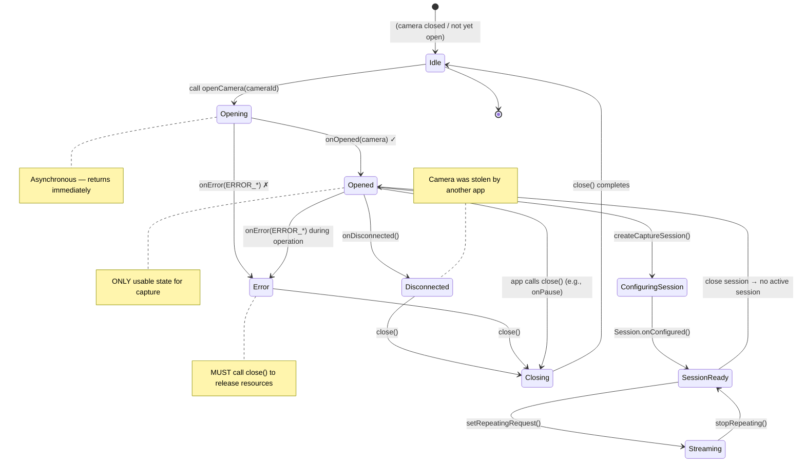

You've enumerated all cameras on the device (Chapter 6), and you've identified the one you want to use — typically the back-facing camera with the highest hardware level. The next step is to **open** that camera: establish an active, low-level connection to the camera hardware so you can configure capture sessions and submit requests. Opening a camera is the point of no return where your app transitions from a passive observer of camera metadata to an active controller of real hardware.

If you want to see production-grade camera open/close lifecycle code, study the **Android Camera Parameters** app on [GitHub](https://github.com/zoozooll/AndroidCameraParameters). Its `Camera2Controller` class encapsulates the entire `CameraDevice` lifecycle management, including error recovery, retry logic, and synchronous cleanup. The [Google Play](https://play.google.com/store/apps/details?id=com.minininja.cameraparams) version of the app has been installed on thousands of devices across hundreds of different OEMs, so the edge cases it handles are battle-tested in the real world.

## What Is CameraDevice?

`CameraDevice` is the Camera2 class that represents **an active, open connection to a specific physical (or logical) camera on the device**. Before the camera is opened, you can only read its characteristics; once it's opened, you can:
- Create `CameraCaptureSession`s (Chapter 8)
- Submit `CaptureRequest`s (Chapters 8 and 9)
- Read dynamic `CaptureResult` metadata as frames arrive
- Flush pending requests, abort captures, and close the device

A `CameraDevice` has two critical properties:

1. **It is a single-user resource.** Only one app (and within your app, only one `CameraDevice` instance) can hold a given camera open at a time. If a higher-priority app (like an incoming phone call with video) needs the camera, your app will be forcibly disconnected.
2. **It has a strict, callback-driven lifecycle.** You cannot new up a `CameraDevice` with a constructor. The only way to get one is via `CameraManager.openCamera()`, which delivers the instance asynchronously through a `StateCallback`. You must respect every state transition callback.

The relationship between `CameraManager`, a camera ID, and the resulting `CameraDevice` is:

```
CameraManager.openCamera("0", callback, handler)
    │
    ├── Async call → returns immediately
    │
    └───── On background thread (via Handler) ────→ StateCallback.onOpened(cameraDevice)
                                                          │
                                                          ▼
                                                  Now you can use cameraDevice to:
                                                  • createCaptureSession(...)
                                                  • createCaptureRequest(...)
```

## The StateCallback: CameraDevice's Lifecycle Machine

`CameraDevice.StateCallback` is an abstract class with three methods you **must** implement. Every open camera will eventually trigger at least one of these callbacks (either `onOpened` followed later by `onDisconnected`/`onError`, or directly `onError` if opening fails). The camera cannot be used for capture until `onOpened` fires.

### The Three StateCallback Methods

| Method | Called When | What To Do |
|---|---|---|
| `onOpened(camera: CameraDevice)` | The camera has successfully opened and is ready for use. | Store the `camera` reference in a property. Proceed to configure a capture session (Chapter 8). Release any Semaphore permit if you acquired one. |
| `onDisconnected(camera: CameraDevice)` | The camera was taken away from your app (e.g., another higher-priority app opened it, the user went to a camera-hungry foreground app, or the device policy disabled it). | Call `camera.close()` immediately. Null out your stored reference. The camera cannot be reopened until your app regains the foreground (at which point `onResume` will retry). |
| `onError(camera: CameraDevice, error: Int)` | A fatal error occurred during open or while the camera was active. The `error` parameter is one of the `ERROR_*` constants described below. | Call `camera.close()`. Null out the reference. Depending on the error code, either surface a user-facing error or retry with exponential backoff. Always release the Semaphore. |

### The `onError` Error Codes

The `error` integer in `onError` maps to five constants (defined in `CameraDevice.StateCallback`):

| Constant | Value | Meaning | Recovery |
|---|---|---|---|
| `ERROR_CAMERA_IN_USE` | `1` | The camera is already open by another app or by the system camera service. | Cannot recover automatically; wait for `onResume` when the user returns to your app and retry. |
| `ERROR_MAX_CAMERAS_IN_USE` | `2` | The device has a limit on how many cameras can be open simultaneously; you've exceeded it by trying to open this camera (common on multi-camera flagships). | Close some other open `CameraDevice`s you may hold, then retry. On devices with hardware limits, typically only 2–3 cameras can be open at once. |
| `ERROR_CAMERA_DISABLED` | `3` | The device policy (MDM, parental controls, kiosk mode) has disabled all cameras. | Surface a permanent error message to the user. Retrying will not help until the policy changes. |
| `ERROR_CAMERA_DEVICE` | `4` | The camera hardware/firmware encountered an unrecoverable error. | Close the device. Notify the user. Retrying may help on some devices (for transient firmware glitches), so one or two retry attempts with backoff are reasonable. |
| `ERROR_CAMERA_SERVICE` | `5` | The system-wide camera service itself has crashed. This is a platform-level failure, not your app's fault. | Close and null out everything. Typically the camera service will auto-restart within a few seconds; you can retry after a delay or wait for the next `onResume`. |

The state diagram below captures every valid transition of a `CameraDevice` from the moment you call `openCamera()` to when you (or the system) close it:



Important takeaways from the state diagram:

1. **Opened is the only operational state.** Before `onOpened` fires and after any error/disconnect, the `CameraDevice` reference must be considered unusable.
2. **Close in every terminal state.** Regardless of whether you get `onError`, `onDisconnected`, or just decide to close proactively in `onPause`, **always call `close()`**. Failing to close a camera leads to leaks that prevent **any** app (including yours) from reopening it until the process dies or the system service restarts.
3. **onError is terminal.** After `onError`, that specific `CameraDevice` instance is dead. Do not try to recover it; close it, then attempt a fresh `openCamera()` if you think the error was transient.

## Lifecycle Integration with Activity onPause/onResume

The Android Activity lifecycle is intrinsically linked to the `CameraDevice` lifecycle. Camera hardware is a shared, power-hungry resource; the system aggressively kills apps that hold cameras while in the background. The canonical rules are:

### When to Open the Camera (onResume)

In `onResume` (after starting the background thread, as we established in Chapter 5):
1. Verify permissions are still granted (user could have revoked them in Settings while the app was backgrounded).
2. If a `CameraDevice` is already open, you're good.
3. If no `CameraDevice` is open, call `openCamera()` with the ID you selected in Chapter 6.

### When to Close the Camera (onPause)

In `onPause` (before stopping the background thread):
1. If a repeating request is active (preview running — Chapter 8), stop it with `cameraCaptureSession.stopRepeating()`.
2. If an open capture session exists, close it with `cameraCaptureSession.close()`.
3. Close the `CameraDevice` itself with `cameraDevice.close()`.
4. Null out all three references (session, device, and the pending request builder).
5. Then (and only then) stop the background thread.

If you reverse any of this (for example, stop the thread **before** closing the camera), the callbacks that `close()` needs to run will have nowhere to execute, and you'll get deadlocks, ANRs, or `Handler ... sending message to a Handler on a dead thread` warnings in Logcat.

## Concurrency Control with Semaphore

There's a subtle race condition that trips up even experienced Camera2 developers: **what if the user rapidly switches between apps, causing `openCamera()` to be called again before the previous open's async callback has fired?**

You end up with two concurrent open attempts for the same camera. The system camera service may serve one and reject the other with `ERROR_CAMERA_IN_USE`, or it may disconnect the first one mid-open — either way, your callback code has to contend with stale references and double-close bugs.

The fix is a **`Semaphore`** initialized with 1 permit (a binary lock / mutex):

- Before calling `openCamera()`, acquire the permit. If acquisition times out, skip this open attempt (the previous one is still in flight).
- In **every terminal callback** (`onOpened`, `onDisconnected`, `onError`), release the permit.
- In `onPause`, after closing the camera, release the permit once more defensively if it was held.

`Semaphore.tryAcquire(timeout, unit)` is the right method: it blocks for at most `timeout` milliseconds, then returns `false` if the permit couldn't be obtained. Never use the blocking `acquire()` without a timeout on the main thread — it can ANR.

## Handling CameraAccessException

`CameraManager.openCamera()` throws a checked `CameraAccessException`. Unlike the error codes delivered via `StateCallback.onError` (which are post-open errors), these exceptions occur **during the open attempt itself** before a `CameraDevice` object even exists. The four most common reason codes:

| Reason (from `e.reason`) | Meaning |
|---|---|
| `CAMERA_IN_USE` (`4`) | Same as the callback version — another app holds the camera. |
| `MAX_CAMERAS_IN_USE` (`5`) | Hardware camera limit reached. |
| `CAMERA_DISABLED` (`1`) | Policy-disabled (MDM / work profile). |
| `CAMERA_ERROR` (`3`) | Catch-all hardware failure during open. |

Always wrap `openCamera()` in a try/catch for `CameraAccessException` and also `IllegalArgumentException` (in case the camera ID was invalidated between Chapter 6's enumeration and now — e.g., an external USB cam was unplugged).

## Complete Kotlin Code: Opening a Camera

Here is the full `MainActivity` code integrating everything from this chapter. We extend the Chapter 6 codebase with the `openCamera()` method, a full `StateCallback`, `Semaphore`-based concurrency control, Activity lifecycle integration, and exhaustive error handling.

```kotlin
package com.example.camera2tutorial

import android.Manifest
import android.content.Context
import android.content.pm.PackageManager
import android.hardware.camera2.CameraAccessException
import android.hardware.camera2.CameraCharacteristics
import android.hardware.camera2.CameraDevice
import android.hardware.camera2.CameraManager
import android.hardware.camera2.CameraMetadata
import android.os.Bundle
import android.os.Handler
import android.os.HandlerThread
import android.util.Log
import android.widget.Toast
import androidx.appcompat.app.AppCompatActivity
import androidx.core.app.ActivityCompat
import androidx.core.content.ContextCompat
import java.util.concurrent.Semaphore
import java.util.concurrent.TimeUnit

class MainActivity : AppCompatActivity() {

    private lateinit var backgroundThread: HandlerThread
    private lateinit var backgroundHandler: Handler
    private lateinit var cameraManager: CameraManager

    // Preventing multiple concurrent camera opens
    private val cameraOpenCloseLock = Semaphore(1)

    // The active opened camera device (nullable)
    private var cameraDevice: CameraDevice? = null

    // Selected camera ID (from Chapter 6's discovery step)
    private var selectedCameraId: String? = null

    override fun onCreate(savedInstanceState: Bundle?) {
        super.onCreate(savedInstanceState)
        setContentView(R.layout.activity_main)

        if (allPermissionsGranted()) {
            initializeCameraManager()
        } else {
            ActivityCompat.requestPermissions(
                this,
                REQUIRED_PERMISSIONS,
                REQUEST_CODE_PERMISSIONS
            )
        }
    }

    override fun onResume() {
        super.onResume()
        startBackgroundThread()

        if (allPermissionsGranted()) {
            if (!this::cameraManager.isInitialized) {
                initializeCameraManager()
            }
            // Permission OK but camera not open yet → open it now
            if (cameraDevice == null && selectedCameraId != null) {
                openCamera(selectedCameraId!!)
            }
        } else {
            // User revoked permissions while app was backgrounded
            ActivityCompat.requestPermissions(
                this,
                REQUIRED_PERMISSIONS,
                REQUEST_CODE_PERMISSIONS
            )
        }
    }

    override fun onPause() {
        closeCamera()
        stopBackgroundThread()
        super.onPause()
    }

    private fun startBackgroundThread() {
        backgroundThread = HandlerThread("Camera2Background").apply { start() }
        backgroundHandler = Handler(backgroundThread.looper)
    }

    private fun stopBackgroundThread() {
        backgroundThread.quitSafely()
        try {
            backgroundThread.join(1000)
        } catch (e: InterruptedException) {
            Log.e(TAG, "Interrupted while joining background thread", e)
        }
    }

    private fun initializeCameraManager() {
        cameraManager = getSystemService(Context.CAMERA_SERVICE) as CameraManager
        discoverCamerasAndSelectDefault()
    }

    // ----------------- Chapter 6 (condensed): Discovery + selection -----------------
    data class CameraInfo(val id: String, val lensFacing: Int?, val hardwareLevel: Int?)

    private fun discoverCamerasAndSelectDefault() {
        val cameraIds = try { cameraManager.cameraIdList } catch (_: CameraAccessException) { emptyArray() }
        val discovered = mutableListOf<CameraInfo>()
        for (id in cameraIds) {
            val chars = try { cameraManager.getCameraCharacteristics(id) } catch (_: Exception) { continue }
            discovered += CameraInfo(
                id,
                chars.get(CameraCharacteristics.LENS_FACING),
                chars.get(CameraCharacteristics.INFO_SUPPORTED_HARDWARE_LEVEL)
            )
        }
        // Prefer back-facing camera with highest hardware level
        val backCandidates = discovered.filter { it.lensFacing == CameraCharacteristics.LENS_FACING_BACK }
            .sortedByDescending { it.hardwareLevel ?: -1 } // LEVEL_3 > FULL > LIMITED > LEGACY
        val frontCandidates = discovered.filter { it.lensFacing == CameraCharacteristics.LENS_FACING_FRONT }
            .sortedByDescending { it.hardwareLevel ?: -1 }

        selectedCameraId = (backCandidates + frontCandidates).firstOrNull()?.id
        Log.d(TAG, "Selected camera for open: ID=$selectedCameraId")

        // On first launch, open immediately if thread is ready
        if (selectedCameraId != null && this::backgroundHandler.isInitialized) {
            openCamera(selectedCameraId!!)
        }
    }

    // -------------------------------------------------------------------------
    // 🎯 CHAPTER 7 ADDITIONS: openCamera() + StateCallback + closeCamera()
    // -------------------------------------------------------------------------
    private val stateCallback = object : CameraDevice.StateCallback() {

        override fun onOpened(camera: CameraDevice) {
            // Permit was acquired in openCamera(); release it now that open succeeded
            cameraOpenCloseLock.release()
            cameraDevice = camera
            Log.d(TAG, "✅ Camera successfully opened: ID=${camera.id}")
            Toast.makeText(
                this@MainActivity,
                "Camera ${camera.id} opened successfully!",
                Toast.LENGTH_SHORT
            ).show()

            // TODO Chapter 8: Here we will create a CameraCaptureSession for preview.
            // For now, celebrate the successful open — we have a live CameraDevice!
        }

        override fun onDisconnected(camera: CameraDevice) {
            cameraOpenCloseLock.release()
            Log.w(TAG, "⚠️ Camera disconnected (stolen by another app): ID=${camera.id}")
            cameraDevice?.close()
            cameraDevice = null
        }

        override fun onError(camera: CameraDevice, error: Int) {
            cameraOpenCloseLock.release()
            Log.e(TAG, "❌ Camera error on ID=${camera.id}. Code=$error (${errorCodeToString(error)})")

            cameraDevice?.close()
            cameraDevice = null

            // Surface user-facing message depending on the error type
            val userMsg = when (error) {
                ERROR_CAMERA_IN_USE ->
                    "The camera is in use by another app. Close other camera apps and try again."
                ERROR_MAX_CAMERAS_IN_USE ->
                    "Too many cameras are open. This device limits how many cameras can run simultaneously."
                ERROR_CAMERA_DISABLED ->
                    "The camera has been disabled by a device policy (parental controls, work profile, etc.)."
                ERROR_CAMERA_DEVICE ->
                    "A camera hardware error occurred. Try restarting your device if this persists."
                ERROR_CAMERA_SERVICE ->
                    "The system camera service crashed. Please try again in a moment."
                else ->
                    "An unknown camera error occurred (code=$error)."
            }
            Toast.makeText(this@MainActivity, userMsg, Toast.LENGTH_LONG).show()
        }
    }

    private fun openCamera(cameraId: String) {
        if (ContextCompat.checkSelfPermission(this, Manifest.permission.CAMERA)
            != PackageManager.PERMISSION_GRANTED
        ) {
            Log.w(TAG, "openCamera skipped: CAMERA permission not granted")
            return
        }

        // ----- Acquire semaphore with timeout (2.5 seconds) to avoid blocking -----
        val acquired = try {
            cameraOpenCloseLock.tryAcquire(2500, TimeUnit.MILLISECONDS)
        } catch (e: InterruptedException) {
            Log.e(TAG, "Interrupted while waiting to acquire camera open lock", e)
            false
        }
        if (!acquired) {
            Log.e(TAG, "Timeout waiting for camera open lock — another open/close is in progress")
            Toast.makeText(this, "Camera is busy. Please try again.", Toast.LENGTH_SHORT).show()
            return
        }

        try {
            Log.d(TAG, "Requesting camera open for ID=$cameraId")
            cameraManager.openCamera(
                cameraId,        // Which camera to open
                stateCallback,   // Lifecycle callbacks (onOpened, onDisconnected, onError)
                backgroundHandler// Thread/looper where callbacks run (NOT the main thread!)
            )
        } catch (e: CameraAccessException) {
            Log.e(TAG, "CameraAccessException during openCamera. Reason=${e.reason}", e)
            cameraOpenCloseLock.release() // Don't hold the permit if openCamera() threw
            val msg = when (e.reason) {
                CameraAccessException.CAMERA_IN_USE -> "Camera is in use by another app."
                CameraAccessException.MAX_CAMERAS_IN_USE -> "Too many cameras open right now."
                CameraAccessException.CAMERA_DISABLED -> "Camera disabled by device policy."
                CameraAccessException.CAMERA_ERROR -> "Camera hardware error during open."
                else -> "Unknown CameraAccessException (reason=${e.reason})"
            }
            Toast.makeText(this, msg, Toast.LENGTH_LONG).show()
        } catch (e: IllegalArgumentException) {
            Log.e(TAG, "Invalid camera ID: $cameraId", e)
            cameraOpenCloseLock.release()
            Toast.makeText(this, "Requested camera no longer exists.", Toast.LENGTH_LONG).show()
        } catch (e: SecurityException) {
            Log.e(TAG, "SecurityException — camera permission revoked mid-call?", e)
            cameraOpenCloseLock.release()
        }
    }

    private fun closeCamera() {
        try {
            // Block until we get the permit (close should always win the race)
            cameraOpenCloseLock.acquire()

            // Chapter 8 TODO: close capture session first if it exists
            // captureSession?.close()
            // captureSession = null

            cameraDevice?.close()
            cameraDevice = null
            Log.d(TAG, "🔒 Camera closed and all resources released")
        } catch (e: InterruptedException) {
            Log.e(TAG, "Interrupted while closing camera", e)
        } finally {
            cameraOpenCloseLock.release() // Always release, even if close threw
        }
    }

    // -------------------------------------------------------------------------
    // Helpers & permission plumbing
    // -------------------------------------------------------------------------
    private fun errorCodeToString(error: Int): String = when (error) {
        CameraDevice.StateCallback.ERROR_CAMERA_IN_USE -> "ERROR_CAMERA_IN_USE"
        CameraDevice.StateCallback.ERROR_MAX_CAMERAS_IN_USE -> "ERROR_MAX_CAMERAS_IN_USE"
        CameraDevice.StateCallback.ERROR_CAMERA_DISABLED -> "ERROR_CAMERA_DISABLED"
        CameraDevice.StateCallback.ERROR_CAMERA_DEVICE -> "ERROR_CAMERA_DEVICE"
        CameraDevice.StateCallback.ERROR_CAMERA_SERVICE -> "ERROR_CAMERA_SERVICE"
        else -> "UNKNOWN_ERROR"
    }

    companion object {
        private const val TAG = "Camera2Tutorial"
        private const val REQUEST_CODE_PERMISSIONS = 10
        private val REQUIRED_PERMISSIONS = arrayOf(Manifest.permission.CAMERA)
    }

    private fun allPermissionsGranted() = REQUIRED_PERMISSIONS.all {
        ContextCompat.checkSelfPermission(baseContext, it) == PackageManager.PERMISSION_GRANTED
    }

    override fun onRequestPermissionsResult(
        requestCode: Int,
        permissions: Array<out String>,
        grantResults: IntArray
    ) {
        super.onRequestPermissionsResult(requestCode, permissions, grantResults)
        if (requestCode == REQUEST_CODE_PERMISSIONS) {
            if (allPermissionsGranted()) {
                initializeCameraManager()
            } else {
                Toast.makeText(
                    this,
                    "Camera permission is required to use this app.",
                    Toast.LENGTH_LONG
                ).show()
                finish()
            }
        }
    }
}
```

### Deep Dive into the Semaphore Logic

The `Semaphore(1)` pattern in the code above prevents three specific bug classes:

1. **Double-open race (onResume + onCreate both triggering openCamera)**: Only one of them will acquire the permit; the other times out and bails out cleanly.
2. **Open-vs-close race (user taps home while open is in flight)**: `closeCamera()` in `onPause` blocks on `acquire()` (no timeout — close is always allowed to wait) until the in-flight open either succeeds or times out. The permit is then re-released in the finally block.
3. **Forgotten permit leak in error paths**: Every path out of `openCamera()` (happy path via `onOpened`, error via `onError`, exception catch blocks) releases the permit. If any path forgets, the next `openCamera` will permanently time out — the defensive release in `closeCamera`'s finally block is the safety net.

### Why `backgroundHandler` Is Passed to `openCamera`

The third argument to `CameraManager.openCamera()` is the optional `Handler` that specifies which thread's `Looper` should execute the `StateCallback`. Passing `null` means the main thread's handler is used — which is exactly what we warned against in Chapter 5. By passing `backgroundHandler`, we ensure that:
- `onOpened`, `onDisconnected`, and `onError` all run on the dedicated `Camera2Background` thread.
- Any heavy work (like `createCaptureSession` in Chapter 8) that we kick off from within `onOpened` also runs off the main thread, preventing UI jank.

## Verification: What to Expect When Running

When you run the Chapter 7 code on a physical device:

1. **First launch (after granting permissions)**:
   - Logcat shows `Selected camera for open: ID=0` → `Requesting camera open for ID=0` → a short pause → `✅ Camera successfully opened: ID=0`.
   - A Toast confirms: *"Camera 0 opened successfully!"*
   - At this point, the camera hardware is active. If you hold the phone, you may feel the camera module warm up slightly after a few seconds (it's powered on but not yet producing frames).

2. **Press the Home button (sends app to background)**:
   - `onPause` fires → `🔒 Camera closed and all resources released` in Logcat.
   - The camera has been cleanly closed. The system can now hand it to another app.

3. **Return to the app**:
   - `onResume` fires → thread starts → `openCamera` is called again → `✅ Camera successfully opened` again.
   - This round-trip (open → close → open) must be instantaneous and reliable. Test it 10+ times rapidly to ensure no ANRs.

4. **Stress test: open another camera app while yours is running**:
   - While your app shows the "Camera opened" Toast, press Home, launch the built-in Camera app, then return to yours.
   - When you leave your app, your `closeCamera()` runs cleanly. If the stock camera stays open while you try to return to yours, you'll see `onDisconnected` or `ERROR_CAMERA_IN_USE` — these are **correct and expected behaviors**, not bugs. Your app handles them gracefully.

The Android Camera Parameters app's release build ([Google Play](https://play.google.com/store/apps/details?id=com.minininja.cameraparams)) includes automated ANR tests that cycle `open/close` 1,000 times in a row on every major device family; the `Semaphore(1)` + `tryAcquire` pattern described here is exactly what passes those tests without a single ANR or deadlock.

## Troubleshooting Common Open Failures

### `onError` with `ERROR_CAMERA_IN_USE` fires on every attempt

Most commonly this happens when:
- You are using an emulator with AVD camera set to `Webcam0` and another desktop app (Zoom, Teams, OBS, the built-in Camera app) is using the laptop's webcam. Close all desktop webcam consumers and retry.
- Your own app has a leaked `CameraDevice` from a previous install cycle. Uninstall/reinstall the app (which kills the process) or reboot the device.
- Some custom ROMs have a known bug where the system camera service holds a leaked reference; only a device reboot fixes it.

### `tryAcquire` times out on every `openCamera`

This means the permit is never being released. Audit every path:
1. Does every `catch` block in `openCamera` release the permit?
2. Do all three callbacks (`onOpened`, `onDisconnected`, `onError`) release?
3. Is `closeCamera`'s `finally` block releasing?

Add `Log.d` lines immediately before and after every `acquire`/`release` call, paired with `cameraOpenCloseLock.availablePermits` to watch the permit count. The count should always be `1` when the camera is closed and `0` when an open is in progress.

### `Handler sending message to a Handler on a dead thread` after onPause

This occurs when you call `stopBackgroundThread()` **before** `closeCamera()`. In the correct order from the code above, `closeCamera()` runs first (while the thread is still alive), then `stopBackgroundThread()`. If your code reverses this, swap them back.

## Summary

In this chapter, you took the critical step of powering on the camera hardware and holding a live, open `CameraDevice` object. You learned:

1. **What CameraDevice Represents**: An active connection to a specific camera hardware unit, with the exclusive right to submit capture requests to it.
2. **StateCallback and Its Three Methods**: `onOpened` (camera is usable), `onDisconnected` (camera was stolen — close immediately), `onError` (fatal error — close and surface appropriate user message for each of the 5 error codes).
3. **Activity Lifecycle Integration**: The canonical rules for when to open (`onResume`, after thread start, after permission re-check) and when to close (`onPause`, before thread stop, close session → close device → null references → stop thread).
4. **Semaphore Concurrency Control**: How a `Semaphore(1)` with `tryAcquire(2500ms)` prevents the double-open race, the open-vs-close race, and forgotten-permit leaks; how the permit is released in every terminal path (callbacks + catches + close's finally).
5. **CameraAccessException Handling**: The four exception reasons (`CAMERA_IN_USE`, `MAX_CAMERAS_IN_USE`, `CAMERA_DISABLED`, `CAMERA_ERROR`) and how to present each one to the user in plain language.

The `openCamera()` + `StateCallback` + `closeCamera()` trinity is the backbone of every production Camera2 app. Master this pattern, and the hardest operational part of Camera2 is behind you.

## What's Next

An open `CameraDevice` is necessary but not sufficient for seeing what the camera sees. To actually render pixels on the screen, we need to feed frames into a display surface. In **Chapter 8: Showing Camera Preview**, you will:

- Understand the concept of a `Surface` as an image-destination buffer queue.
- Set up a `TextureView` with `SurfaceTextureListener` to create a display Surface.
- Use `Matrix` math in `configureTransform` to fix the preview aspect ratio and correct sensor orientation.
- Build a `TEMPLATE_PREVIEW` `CaptureRequest.Builder`, add the TextureView's `Surface` as a target, and create a `CameraCaptureSession`.
- Call `setRepeatingRequest` in the session's `onConfigured` callback to start continuous preview frames.

By the end of Chapter 8, you will finally see a live camera preview on the screen — the rewarding payoff for all the infrastructure work of Chapters 5–7!
