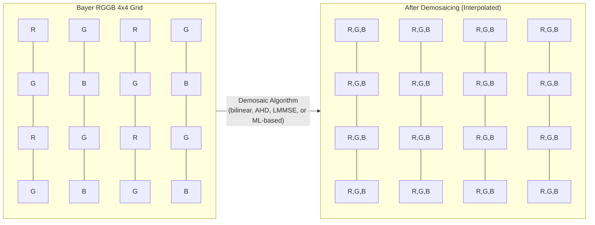
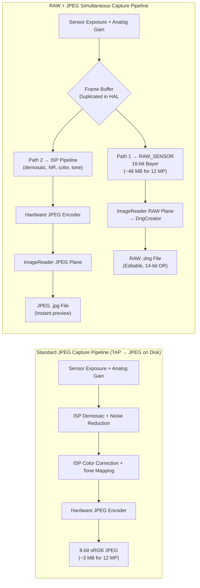

---     
sidebar_position: 18
title: "Chapter 18: RA W Photography"
description: "Master RAW_SENSOR format, DNG file creation with DngCreator, Bayer patterns, and simultaneous RAW+JPEG capture in Android Camera2 API"
keywords: [Android Camera2, RAW photography, RAW_SENSOR, DngCreator, DNG, Bayer pattern, RGGB, JPEG_R, camera metadata]
tags: [RAW, DNG, Advanced]
---

# Chapter 18: RAW Photography

Professional mobile photography demands more than the processed JPEGs that Android's ISP (Image Signal Processor) produces by default. When you capture a JPEG, the sensor's raw data has already been filtered, interpolated, color-corrected, noise-reduced, and tone-mapped — destroying most of the editing headroom that photographers rely on. The Camera2 API gives you direct access to the **RAW_SENSOR** format: 16-bit unprocessed Bayer-pattern data straight from the sensor, with zero ISP interference. Combined with **DngCreator**, the Android framework provides everything you need to produce standards-compliant Adobe DNG (Digital Negative) files that open directly in Lightroom, Capture One, Photoshop, and every professional RAW editor.

This chapter builds on the research documented in the *RAW / DngCreator* section of the project's internal reference, and extends it with practical code you can plug into your own app. You can see these capabilities enumerated for every supported device in the [Android Camera Parameters](https://github.com/zoozooll/AndroidCameraParameters) app — also available on the [Google Play Store](https://play.google.com/store/apps/details?id=com.zoozooll.cameraparameters) — which reports the maximum RAW size, available RAW variants (RAW10, RAW12, RAW14), and whether DngCreator metadata is fully populated for each camera ID.

## Why RAW? The Cost of ISP Processing

Before diving into API details, it is critical to understand exactly what the ISP does when it produces a JPEG, and why bypassing it matters. A typical smartphone ISP pipeline applies the following stages in order:

1. **Black level clamping** — subtracts the sensor's dark-current baseline
2. **Lens shading correction** — removes vignetting using per-pixel gain maps
3. **Demosaicing** — interpolates the 1-color-per-pixel Bayer grid into a full RGB image
4. **Noise reduction** — applies spatial/temporal filtering that erases fine detail along with noise
5. **Color correction** — applies a 3×3 matrix to map sensor color space to sRGB
6. **Gamma / tone mapping** — compresses the scene's linear 14 stops into a non-linear 8-bit curve
7. **Edge enhancement** — sharpens to compensate for the optical low-pass filter
8. **JPEG compression** — applies lossy chroma subsampling (typically 4:2:0) and quantization

The problem with this pipeline is that every stage is **irreversible** and tuned for consumer *previews*, not professional *post-processing*. A JPEG clamps highlights to 100:1 contrast ratios and wraps 14 bits of sensor DR into 8 bits — so when you pull up shadows 2 stops in post, you get banding instead of detail. RAW preserves the entire linear sensor output, enabling 4–6 stops of shadow/highlight recovery and custom white-balance shifts that don't introduce color artifacts.

```mermaid
flowchart TD
    subgraph ISP["ISP Processing Pipeline (JPEG Path)"]
        S1[Sensor RAW Data] --> S2[Black Level Clamp]
        S2 --> S3[Lens Shading Correction]
        S3 --> S4[Demosaic]
        S4 --> S5[Noise Reduction]
        S5 --> S6[Color Correction]
        S6 --> S7[Gamma / Tone Mapping]
        S7 --> S8[Edge Enhancement]
        S8 --> S9[JPEG Compression]
        S9 --> S10["8-bit sRGB JPEG<br/>(≈6 stops usable DR)"]
    end

    subgraph RAW["RAW Path (No ISP Processing)"]
        R1[Sensor RAW Data] --> R2["16-bit Linear Bayer Pattern<br/>(10–14 stops usable DR)"]
        R2 --> R3["DngCreator Writes<br/>Metadata + Pixel Data"]
        R3 --> R4[".dng File<br/>Editable in Lightroom/PS"]
    end
```



Compare the two paths visually above: the JPEG path strips data at every step, while the RAW path preserves the full sensor payload. The tradeoff is that RAW files are **not directly displayable** — they require a separate rendering pass (the "develop" step in Lightroom) to interpret the Bayer grid and convert to a colorspace like sRGB or Rec.2020.

## The Bayer Color Filter Array

RAW data is not RGB. Each photosite on the sensor records only **one color** — red, green, or blue — because a silicon photodiode itself is color-blind and can only measure photon count (luminance). To reconstruct color, manufacturers deposit a **Color Filter Array (CFA)** over the sensor, and the resulting single-channel grid is named after its inventor: the Bayer pattern.

Four common CFA layouts exist in Android devices, identified by the order of the top-left 2×2 tile:

| Pattern | Tile Layout | Typical Use Case |
|---------|-------------|------------------|
| **RGGB** | `R G / G B` | Most smartphones (Samsung, Sony Exmor RS default) |
| **BGGR** | `B G / G R` | Sony IMX sensors in some Xiaomi/OnePlus devices |
| **GRBG** | `G R / B G` | Certain OmniVision sensors |
| **GBRG** | `G B / R G` | Rare; found in some Motorola mid-range devices |

The most striking feature of the Bayer grid is that **50% of pixels are green**, while red and blue each get 25%. This is not an arbitrary choice — the human eye's photopic luminance response peaks in the green wavelengths (around 555 nm), so devoting twice the samples to green maximizes perceived sharpness and noise performance. The luminance channel in any resulting JPEG is derived ~60% from green photosites, so green sampling density directly translates to resolved detail.



The demosaic block above (P11–P44) shows how each pixel is reconstructed: an `R` photosite uses its neighbor `G` and `B` values via interpolation, and vice versa. This interpolation is the single biggest source of image softening in the JPEG pipeline — and exactly why you want to do it yourself in post-production, where modern AI demosaicing (Lightroom's AI Enhance, Topaz DeNoise AI, etc.) can deliver sharper results than the smartphone's real-time hardware ISP.

## RAW_SENSOR Format and Packed Variants (RAW10 / RAW12 / RAW14)

Android's canonical RAW format identifier is `ImageFormat.RAW_SENSOR`, which enumerates as a 16-bit-per-pixel buffer stored in the `Plane` returned by `Image.getPlanes()`. However, the *effective* bit depth is device-dependent and reported via `CameraCharacteristics.SENSOR_INFO_BIT_DEPTH` — the upper bits beyond the sensor's actual ADC resolution are zero-padded.

Most contemporary smartphones use one of three packed raw variants, which are exposed through `StreamConfigurationMap.getOutputSizes()` with dedicated format constants:

| Format Constant | Bits/sample | Storage Layout | Typical Sensor Generation |
|-----------------|-------------|----------------|---------------------------|
| `RAW10`         | 10          | Packed: 4 samples per 5 bytes (MSB-aligned) | Mid-range 2019–2022 sensors (e.g. IMX586, IMX682) |
| `RAW12`         | 12          | Packed: 2 samples per 3 bytes | Flagship 2021–2024 (e.g. IMX800, IMX989 1-inch type) |
| `RAW14`         | 14          | 16-bit padded (MSB-aligned) | Professional-tier / 1-inch+ sensors (IMX989 with DOL-HDR) |

The packed formats are the reason you **must use `Buffer.getByte()` / `Buffer.getShort()` with pixel-stride awareness**, rather than treating the RAW buffer as a flat short[] array — RAW10 and RAW12 samples cross byte boundaries and require bit-shifting to extract. `DngCreator` handles all of this packing/unpacking transparently if you pass the `Image` object directly, which is the recommended approach.

## DNG: Adobe Digital Negative Standard 1.4

Why write `.dng` files instead of a proprietary format like `.arw` (Sony) or `.cr3` (Canon)? Because **DNG is the only universal RAW format**, published as ISO 12234-2 and accepted by every professional photo toolchain. DNG v1.4 (the version Android targets) specifies:

- A TIFF/EP-compatible container (little-endian IFD structure)
- Mandatory TIFF tags for CFA pattern, black levels, and color matrices
- Optional `ColorMatrix2` / `CalibrationIlluminant2` for dual-illuminant profiles
- Optional lens shading map (tag 0xC618) for per-pixel flat-field correction
- Optional "makernotes" IFD for OEM-specific calibration data

Without this metadata, a RAW buffer is just an unlabeled grid of numbers — no RAW editor could correctly render it. The `DngCreator` class in Android's `android.hardware.camera2` package is purpose-built to populate **all required DNG 1.4 metadata automatically** from `CameraCharacteristics` and `CaptureResult`, which means your app does not need to ship sensor calibration data for every device.

The specific metadata fields `DngCreator` writes include:

| DNG Tag | Source | Purpose |
|---------|--------|---------|
| **BlackLevel** (SENSOR_BLACK_LEVEL_PATTERN) | `CameraCharacteristics` | 4-element per-channel dark-current baseline |
| **ColorMatrix1 / ColorMatrix2** (SENSOR_COLOR_TRANSFORM1 / 2) | `CameraCharacteristics` | 3×3 matrices mapping sensor RGB → XYZ at Illuminant A (D65) |
| **CalibrationIlluminant1 / 2** | `CameraCharacteristics` | Standard illuminant enum (17 = Standard A, 21 = D65) |
| **ForwardMatrix1 / ForwardMatrix2** (SENSOR_FORWARD_MATRIX1 / 2) | `CameraCharacteristics` | XYZ → sensor RGB inverse transform |
| **NeutralColorPoint** (SENSOR_NEUTRAL_COLOR_POINT) | `CameraCharacteristics` | Native white-balance (r/g, b/g ratios) |
| **LensShadingMap** (STATISTICS_LENS_SHADING_MAP) | `CaptureResult` | 4-channel per-channel gain grid for vignetting removal |
| **CFA Pattern 2** | `CameraCharacteristics.SENSOR_INFO_COLOR_FILTER_ARRANGEMENT` | Bayer tile encoding |
| **BaselineExposure** | `SENSOR_REFERENCE_ILLUMINANT1` | Default exposure offset to apply during rendering |

This list is taken directly from the *RAW / DngCreator* specification in the project research doc. If any of these fields are reported as `null` by the Camera2 API, `DngCreator` will still produce a valid DNG but the resulting file may require manual calibration in post. You can check which fields are populated for each camera ID using the Android Camera Parameters app.

## Setting Up Simultaneous RAW + JPEG Capture

The correct workflow for RAW capture uses **multiple output targets in a single `CaptureRequest`** — this guarantees the RAW buffer and the JPEG come from the *exact same frame* (identical timestamp, identical sensor exposure), which is essential for RAW+JPEG backup workflows that most photographers expect. Attempting two sequential captures introduces frame-to-frame variability in exposure, AF, and AWB.

### Step 1: Query Capabilities and Maximum RAW Size

```kotlin
import android.hardware.camera2.CameraCharacteristics
import android.hardware.camera2.params.StreamConfigurationMap
import android.util.Size
import android.graphics.ImageFormat

fun getRawCapabilities(cameraId: String,
                       characteristics: CameraCharacteristics): Pair<Boolean, Size?> {
    val caps = characteristics.get(
        CameraCharacteristics.REQUEST_AVAILABLE_CAPABILITIES
    ) ?: intArrayOf()
    val supportsRaw = caps.contains(
        CameraCharacteristics.REQUEST_AVAILABLE_CAPABILITIES_RAW
    )
    if (!supportsRaw) return Pair(false, null)

    val configMap: StreamConfigurationMap? =
        characteristics.get(CameraCharacteristics.SCALER_STREAM_CONFIGURATION_MAP)

    val rawSizes = configMap?.getOutputSizes(ImageFormat.RAW_SENSOR)
        ?: emptyArray()
    val maxRawSize = rawSizes.maxByOrNull { it.width * it.height }

    return Pair(true, maxRawSize)
}
```

`REQUEST_AVAILABLE_CAPABILITIES_RAW` is the mandatory gate — if it is not set, the HAL will refuse any RAW_SENSOR output, and attempting to create an `ImageReader` with that format will throw `IllegalArgumentException`. The Android Camera Parameters app lists this capability per camera ID on its main dashboard.

### Step 2: Create Dual ImageReaders (RAW + JPEG)

```kotlin
import android.media.ImageReader
import android.graphics.ImageFormat

private var rawImageReader: ImageReader? = null
private var jpegImageReader: ImageReader? = null

fun setupDualImageReaders(rawSize: Size, jpegSize: Size) {
    rawImageReader = ImageReader.newInstance(
        rawSize.width,
        rawSize.height,
        ImageFormat.RAW_SENSOR,
        5 // Acquire buffer depth: >= 2, 5 allows headroom for burst capture
    ).apply {
        setOnImageAvailableListener(
            OnRawImageAvailableListener(),
            backgroundHandler
        )
    }

    jpegImageReader = ImageReader.newInstance(
        jpegSize.width,
        jpegSize.height,
        ImageFormat.JPEG,
        2
    ).apply {
        setOnImageAvailableListener(
            OnJpegImageAvailableListener(),
            backgroundHandler
        )
    }
}
```

The RAW `maxImages` buffer depth should be larger (5) because RAW buffers are 2–4× the bandwidth of JPEG, and the HAL may deliver 2–3 frames before the disk writer catches up. Running out of RAW buffer space causes silent frame drops with no error callback.

### Step 3: Create a CaptureSession with Both Surfaces and Issue a Multi-Target Capture

```kotlin
import android.hardware.camera2.CameraDevice
import android.hardware.camera2.CaptureRequest
import android.view.Surface

lateinit var cameraDevice: CameraDevice

fun createCaptureSessionAndCapture(
    rawSurface: Surface,
    jpegSurface: Surface,
    previewSurface: Surface
) {
    val outputSurfaces = listOf(previewSurface, rawSurface, jpegSurface)

    cameraDevice.createCaptureSession(
        outputSurfaces,
        object : CameraCaptureSession.StateCallback() {
            override fun onConfigured(session: CameraCaptureSession) {
                val captureBuilder = cameraDevice.createCaptureRequest(
                    CameraDevice.TEMPLATE_STILL_CAPTURE
                ).apply {
                    addTarget(previewSurface)
                    addTarget(rawSurface)
                    addTarget(jpegSurface)

                    set(CaptureRequest.CONTROL_AF_MODE,
                        CaptureRequest.CONTROL_AF_MODE_CONTINUOUS_PICTURE)
                    set(CaptureRequest.CONTROL_AE_MODE,
                        CaptureRequest.CONTROL_AE_MODE_ON)
                    set(CaptureRequest.CONTROL_AWB_MODE,
                        CaptureRequest.CONTROL_AWB_MODE_OFF) // Lock WB in RAW!
                }

                session.capture(
                    captureBuilder.build(),
                    RawCaptureCallback(),
                    backgroundHandler
                )
            }
            override fun onConfigureFailed(session: CameraCaptureSession) = Unit
        },
        backgroundHandler
    )
}
```

Three details here are non-negotiable:

1. **AWB must be locked (`CONTROL_AWB_MODE_OFF`) for RAW captures.** If AWB is left on, the HAL will apply an RGB gain ramp mid-burst, meaning every RAW frame has a different native white balance — which breaks RAW editors' ability to apply a uniform profile. Use `CaptureResult.SENSOR_NEUTRAL_COLOR_POINT` to derive the correct WB in post instead.

2. **Use `TEMPLATE_STILL_CAPTURE`** as the base template. It configures the sensor for the highest-quality readout mode and disables preview-specific noise reduction that the HAL might otherwise inject.

3. **All three targets (preview, RAW, JPEG) are in one `CaptureRequest`.** The HAL guarantees time-coincident delivery.

### Step 4: Use DngCreator to Write the DNG File

The `OnImageAvailableListener` callback receives `Image` objects from which the RAW pixel data is already accessible. Pass the `Image` *and* the matching `CaptureResult` to `DngCreator`, along with the original `CameraCharacteristics` used to open the camera — this combination is required to populate all DNG 1.4 metadata correctly.

```kotlin
import android.hardware.camera2.CameraCharacteristics
import android.hardware.camera2.CaptureResult
import android.hardware.camera2.DngCreator
import android.media.Image
import java.io.File
import java.io.FileOutputStream
import java.io.IOException

inner class OnRawImageAvailableListener : ImageReader.OnImageAvailableListener {
    private val pendingDngWrites =
        HashMap<Long, CaptureResult>() // timestamp → CaptureResult

    fun registerCaptureResult(timestamp: Long, result: CaptureResult) {
        pendingDngWrites[timestamp] = result
    }

    override fun onImageAvailable(reader: ImageReader) {
        var image: Image? = null
        try {
            image = reader.acquireLatestImage() ?: return
            val timestamp = image.timestamp

            val captureResult = pendingDngWrites.remove(timestamp) ?: return
            val characteristics = latestCameraCharacteristics ?: return

            val dngFile = File(
                getExternalFilesDir(null),
                "RAW_${System.currentTimeMillis()}.dng"
            )

            FileOutputStream(dngFile).use { fos ->
                val dngCreator = DngCreator(characteristics, captureResult)
                dngCreator.writeByteBuffer(
                    fos,
                    image.width,
                    image.height,
                    image.planes[0].buffer,
                    0 // padding, always 0 for RAW_SENSOR
                )
            }

        } catch (e: IOException) {
            Log.e(TAG, "Failed to write DNG file", e)
        } catch (e: IllegalStateException) {
            Log.e(TAG, "DngCreator rejected metadata (missing required field)", e)
        } finally {
            image?.close() // CRITICAL: NEVER leak Image references
        }
    }
}
```

The `DngCreator` constructor takes exactly two arguments:
- **`CameraCharacteristics`** — static, per-camera fields (black levels, color matrices, CFA pattern, neutral color point, illuminants 1&2)
- **`CaptureResult`** — per-frame dynamic fields (sensor exposure, ISO, lens shading map, AF lens position)

If either is `null` or if a required metadata field is missing (e.g. some budget devices report `null` for `SENSOR_COLOR_TRANSFORM1`), the constructor will throw `IllegalArgumentException` at construction time (not at `writeByteBuffer`). This is why the Android Camera Parameters app explicitly reports every DNG-relevant field: developers can pre-filter devices to avoid crashes on devices with incomplete HAL implementations.

The `pendingDngWrites` timestamp map solves a real concurrency problem: `CaptureResult.CaptureCallback.onCaptureCompleted()` fires **before or after** `OnImageAvailableListener.onImageAvailable()` (HAL-dependent). Matching by `image.timestamp` == `CaptureResult.SENSOR_TIMESTAMP` guarantees the right metadata pairs with the right pixel buffer.

## Processing Pipeline Comparison (Detailed Mermaid)



The key insight from this diagram is the frame **duplication node G**: the HAL reads one frame from the sensor, then routes an unmodified copy to the RAW output while feeding the *same* copy into the ISP for JPEG encoding. This guarantees frame parity without doubling sensor readout bandwidth.

## Performance Considerations and Practical Limits

Writing 12–48 MB DNG files to flash storage takes measurable time:
- UFS 3.1 storage: ~250 MB/s sequential write → 12 MP DNG (~48 MB) takes ~190 ms
- eMMC 5.1 storage: ~120 MB/s sequential write → same file takes ~400 ms

This means you **cannot block the UI thread on DNG writes** — always run `writeByteBuffer` on a background thread/Handler, and always close the `Image` in a `finally` block to avoid HAL buffer starvation.

Another important constraint: not all devices support RAW + JPEG in the same session even if `CAPABILITIES_RAW` is set. The correct way to verify is `StreamConfigurationMap.isOutputSupportedFor(surfaceList)` with both surfaces in the list. If this returns `false`, fall back to RAW-only sessions.

## Summary

This chapter covered the full end-to-end RAW photography workflow in Android Camera2:

- **RAW_SENSOR format** delivers the unprocessed 16-bit Bayer grid from the sensor, bypassing every ISP processing stage.
- **Bayer patterns** (RGGB, BGGR, GRBG, GBRG) allocate 50% of photosites to green for human-vision-optimized luminance sampling.
- **Packed variants** — RAW10, RAW12, RAW14 — store samples at native ADC bit depth; DngCreator unpacks them transparently.
- **DNG v1.4** is the universal RAW container. `DngCreator(characteristics, result).writeByteBuffer(...)` populates all required metadata: black levels, color matrices, lens shading map, neutral color point, and calibration illuminants 1 & 2.
- **Multi-target CaptureRequests** route the same frame to both RAW and JPEG ImageReaders, guaranteeing frame parity for RAW+JPEG workflows.
- **Timestamp matching** between `CaptureResult` and `Image` is required because callbacks fire in HAL-dependent order.

## What's Next

In the next chapter, we shift from still photography to video with **Chapter 19: High-Speed Video**, where we use `CameraConstrainedHighSpeedCaptureSession` to achieve 120 fps (4× slow-motion) and 240 fps (8× slow-motion) capture. You will learn why high-speed sessions require `createHighSpeedRequestList` instead of individual CaptureRequests, and how the HAL's dedicated high-speed pipeline bypasses the normal preview path to deliver frame rates that would otherwise be CPU-prohibitive.

You can validate your device's RAW capabilities, maximum RAW size, and DngCreator metadata completeness by installing the [Android Camera Parameters app](https://play.google.com/store/apps/details?id=com.zoozooll.cameraparameters) — and contribute device reports to the open-source [GitHub repository](https://github.com/zoozooll/AndroidCameraParameters) to help other developers know which devices support professional RAW workflows.
