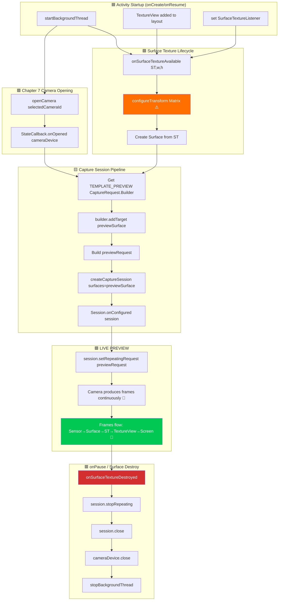

This is the chapter you've been waiting for. After three chapters of building scaffolding (permissions, threading, CameraManager, enumeration, open/close lifecycle), you will finally **see the camera output rendered live on the Android device screen**. Preview is the soul of a camera app — it's what the user looks at to frame a shot, check focus, and verify exposure before tapping the shutter. Getting it right makes the difference between a janky, unusable app and a polished, responsive camera experience.

For a reference preview implementation that handles edge cases across hundreds of devices, see the preview screen in the **Android Camera Parameters** app ([GitHub](https://github.com/zoozooll/AndroidCameraParameters) / [Google Play](https://play.google.com/store/apps/details?id=com.minininja.cameraparams)). Its preview pipeline includes orientation-aware transforms, multi-resolution output surfaces, and smooth frame-rate throttling — all built on the same fundamental components we cover here.

## The Preview Pipeline: Components Overview

Before we dive into code, let's map the conceptual journey of a single preview frame from the camera sensor to the phone's display. Every frame passes through five layers:

```
Camera Sensor → CameraDevice Pipeline → Surface (BufferQueue) → SurfaceTexture → TextureView → Display
```

Each layer plays a specific, non-interchangeable role. Skipping or shortcutting any of them produces black screens, distorted aspect ratios, or tearing. Let's define each component:

### 1. Surface — The Image Destination Buffer

A `Surface` is the Camera2 API's generic concept of **a destination for processed image frames**. Under the hood, a Surface wraps an Android `BufferQueue`: a ring buffer of graphic buffers (typically 3–5 buffers deep) managed by the system compositor (SurfaceFlinger). When Camera2 "renders a frame" to a Surface, it dequeues an empty buffer from the queue, fills it with pixel data, and enqueues it back for the consumer to use.

Anything that can consume graphic buffers can expose a `Surface`. The most common consumers are:
- **SurfaceTexture** → feeds a `TextureView` (for on-screen preview — this chapter)
- **Surface of a MediaRecorder/MediaCodec** → video encoding (not covered in this series)
- **ImageReader Surface** → CPU-accessible `Image` objects for JPEG/RAW capture (Chapter 9)

### 2. SurfaceTexture — The GPU-to-GPU Bridge

`SurfaceTexture` is the magic class that turns a raw stream of camera frames into a texture that the GPU can sample and render. It is the consumer end of the Surface's BufferQueue, but instead of handing buffers to the CPU, it converts them into an OpenGL ES `GL_TEXTURE_EXTERNAL_OES` texture. This allows `TextureView` to composite the camera frame onto the view hierarchy using standard GPU rendering — no CPU copy required, so 60+ FPS preview is trivially achievable.

You get a `Surface` for a `SurfaceTexture` with:
```kotlin
val surface = Surface(surfaceTexture)
```

### 3. TextureView — The On-Screen Window

`TextureView` is a `View` subclass that can display the contents of a `SurfaceTexture`. It is the modern successor to the older `SurfaceView`, and the recommended choice for Camera2 preview for three reasons:
- It behaves like a normal View (can be animated, transformed, alpha-blended, placed in scrollable containers).
- It doesn't force the Activity to use a transparent window (unlike SurfaceView, which punches a "hole" in the view hierarchy).
- Its `SurfaceTextureListener` gives us precise lifecycle callbacks for when the surface is created, destroyed, or resized.

To get callback-driven access to the underlying SurfaceTexture, `TextureView` exposes `setSurfaceTextureListener()` with four callbacks:
- `onSurfaceTextureAvailable(surfaceTexture, width, height)` — surface is ready to receive frames (fires once when the view is laid out).
- `onSurfaceTextureSizeChanged(surfaceTexture, width, height)` — the surface size changed (e.g., device rotated).
- `onSurfaceTextureDestroyed(surfaceTexture)` — about to be destroyed; we must stop the preview before this returns.
- `onSurfaceTextureUpdated(surfaceTexture)` — fires for **every new frame** (can be used to drive face-tracking overlays, etc.).

### 4. CameraCaptureSession — The Configured Pipeline

Before a `CameraDevice` can produce any frames, you must create a `CameraCaptureSession`. A session is a **configuration of all the output Surfaces that the camera pipeline will write to**. You can think of it as "plumbing" the camera ISP (Image Signal Processor) to route its output to one or more sinks. For preview-only, the session has one Surface (the TextureView's). When we add photo capture in Chapter 9, the session will have two Surfaces: preview + `ImageReader`.

Key rules:
- A session is created with `CameraDevice.createCaptureSession(outputSurfaces, stateCallback, handler)`.
- The session is only usable **after** `StateCallback.onConfigured(session)` fires.
- A `CameraDevice` can have only **one active session at a time**. Creating a new session closes the previous one.
- The session owns *all* outputs for its lifetime; adding a new surface (e.g., suddenly deciding to record video) requires tearing down the old session and creating a new one with all surfaces (preview + recorder).

### 5. Repeating Capture Request (TEMPLATE_PREVIEW)

Once the session is configured, how does continuous preview happen? Camera2 is a request-driven API — every frame is a `CaptureRequest` submitted to the session. For preview, we submit **one request and mark it as repeating**: the camera hardware will re-run that same request (with the same sensor settings, targets, and 3A state) continuously, producing frames as fast as the pipeline allows (typically 30–120 FPS).

A repeating request is submitted with:
```kotlin
session.setRepeatingRequest(previewRequest, captureCallback, backgroundHandler)
```

The template for preview is `CameraDevice.TEMPLATE_PREVIEW`. Camera2 provides several pre-built templates that configure hundreds of low-level parameters (exposure, frame rate range, 3A mode, noise reduction, etc.) appropriately for the use case. For preview, `TEMPLATE_PREVIEW` optimizes for **low latency and smooth frame rate**, even if that means slightly reduced sensor dynamic range compared to `TEMPLATE_STILL_CAPTURE` (used in Chapter 9 for photos).

## End-to-End Preview Flowchart

The flowchart below shows how all these components connect. Follow it closely when reading the code — every block corresponds to a real function call.



The orange highlighted block (`configureTransform`) and green highlighted block (LIVE PREVIEW) are the two most critical steps. Skip `configureTransform`, and your preview will be stretched, rotated, or squashed. Wire everything else correctly but fail to call `setRepeatingRequest`, and the screen stays black with no errors logged.

## Step 1: Add TextureView to the Layout XML

First, create or update `app/src/main/res/layout/activity_main.xml` to include a full-screen `TextureView`. We'll also add a `TextView` overlay as a status indicator so we can see the preview size.

```xml
<?xml version="1.0" encoding="utf-8"?>
<FrameLayout xmlns:android="http://schemas.android.com/apk/res/android"
    android:layout_width="match_parent"
    android:layout_height="match_parent">

    <TextureView
        android:id="@+id/textureView"
        android:layout_width="match_parent"
        android:layout_height="match_parent"
        android:layout_gravity="center" />

    <TextView
        android:id="@+id/statusTextView"
        android:layout_width="wrap_content"
        android:layout_height="wrap_content"
        android:layout_gravity="top|center_horizontal"
        android:layout_marginTop="16dp"
        android:background="#80000000"
        android:padding="8dp"
        android:textColor="#FFFFFFFF"
        android:textSize="12sp"
        tools:text="Initializing camera..." />

</FrameLayout>
```

Why `FrameLayout` as the root? Because preview is a full-screen layer, and `FrameLayout` stacks children with Z-ordering (later children draw on top). Later we'll add a shutter button overlay. The `TextureView` uses `match_parent` on both dimensions — but don't worry, we'll use `configureTransform` below to letterbox it correctly, so the pixels themselves are never stretched even though the view fills the screen.

## Step 2: configureTransform — The Secret Sauce of Correct Preview Aspect Ratio

If you do nothing and just pipe frames into a full-screen TextureView, the preview will be **stretched**. Why? Because camera sensors have a fixed aspect ratio (almost always 4:3 for still capture, sometimes 16:9 for video modes), and the phone display has a different aspect ratio (often ~20:9 on modern flagships). If the camera outputs a 4032×3024 (4:3) preview frame and the TextureView stretches it to 1080×2400 (20:9), faces look thin and tall.

The solution is **`configureTransform(viewWidth: Int, viewHeight: Int)`**: a method that computes a `Matrix` (rotation + center-crop scaling) and applies it to the TextureView. The matrix does three things:
1. **Rotate** the image by the number of degrees the device is rotated relative to the camera sensor's natural orientation.
2. **Scale** the image so that it fills the TextureView entirely while maintaining aspect ratio (center-crop style, letterbox with black bars if you prefer).
3. **Re-center** the scaled/rotated image so it sits in the middle of the view.

This is the single most-copied function from the official Android Camera2 samples — every developer needs it, and it's easy to get wrong. Here's the canonical version:

```kotlin
/**
 * Configures the necessary Matrix transformation to `textureView`.
 * This method should be called after the camera preview size is determined
 * and also the size of `textureView` is fixed.
 *
 * @param viewWidth  The width of `textureView`
 * @param viewHeight The height of `textureView`
 * @param previewSize The camera-selected preview Size (width, height)
 * @param sensorOrientationDegrees The SENSOR_ORIENTATION characteristic of the camera
 * @param deviceDisplayRotationDegrees The display's rotation (0/90/180/270) relative to natural
 */
private fun configureTransform(
    viewWidth: Int,
    viewHeight: Int,
    previewSize: android.util.Size,
    sensorOrientationDegrees: Int,
    deviceDisplayRotationDegrees: Int
) {
    val rotation = when (deviceDisplayRotationDegrees) {
        android.view.Surface.ROTATION_0 -> 0
        android.view.Surface.ROTATION_90 -> 90
        android.view.Surface.ROTATION_180 -> 180
        android.view.Surface.ROTATION_270 -> 270
        else -> return
    }

    val matrix = android.graphics.Matrix()
    val viewRect = android.graphics.RectF(0f, 0f, viewWidth.toFloat(), viewHeight.toFloat())
    val bufferRect = android.graphics.RectF(
        0f,
        0f,
        previewSize.height.toFloat(),
        previewSize.width.toFloat()
    )
    val centerX = viewRect.centerX()
    val centerY = viewRect.centerY()

    // Step 1: Account for device rotation relative to sensor orientation
    if (Surface.ROTATION_90 == rotation || Surface.ROTATION_270 == rotation) {
        bufferRect.offset(centerX - bufferRect.centerX(), centerY - bufferRect.centerY())
        matrix.setRectToRect(viewRect, bufferRect, android.graphics.Matrix.ScaleToFit.FILL)
        val scale = maxOf(
            viewHeight.toFloat() / previewSize.height,
            viewWidth.toFloat() / previewSize.width
        )
        matrix.postScale(scale, scale, centerX, centerY)
        matrix.postRotate(
            (90 * (rotation - 2)).toFloat(),
            centerX,
            centerY
        )
    } else if (Surface.ROTATION_180 == rotation) {
        matrix.postRotate(180f, centerX, centerY)
    }

    // Step 2: Also account for how the sensor is mounted relative to the device
    val relativeRotation = (sensorOrientationDegrees - rotation + 360) % 360
    if (relativeRotation != 0) {
        matrix.postRotate(relativeRotation.toFloat(), centerX, centerY)
    }

    textureView.setTransform(matrix)
}
```

A key detail: `previewSize` is the camera's output size, reported as (width, height) in **sensor orientation**. The TextureView's dimensions are in **display orientation**. The RectF trick with swapped width/height (`bufferRect` uses `previewSize.height` for width and vice versa) accounts for this sensor-vs-display coordinate flip.

You'll need two pieces of CameraCharacteristics information to call this:
- `SENSOR_ORIENTATION` — how many degrees the sensor is rotated relative to the device's natural orientation. For rear cameras, this is almost always 90°. For front cameras, it's typically 270° (so the image is mirrored correctly). Read it once per camera in the discovery phase.
- Display rotation — from `(getSystemService(Context.WINDOW_SERVICE) as WindowManager).defaultDisplay.rotation` (on newer APIs use `display?.rotation`).

## Step 3: Choose a Preview Size from SCALER_STREAM_CONFIGURATION_MAP

Before we can write `configureTransform` or create a session, we need to know what preview size the camera can output. For every camera, `CameraCharacteristics.SCALER_STREAM_CONFIGURATION_MAP` returns a `StreamConfigurationMap` containing all valid (format, size) pairs the camera can produce. For preview on a `SurfaceTexture`, we query for output sizes against the class `SurfaceTexture::class.java`:

```kotlin
private fun chooseOptimalPreviewSize(
    characteristics: CameraCharacteristics,
    maxWidth: Int,
    maxHeight: Int,
    targetAspectRatio: Double
): android.util.Size {
    val map = characteristics.get(CameraCharacteristics.SCALER_STREAM_CONFIGURATION_MAP)
        ?: throw IllegalStateException("No stream configuration map available")

    // All sizes supported for SurfaceTexture output (preview class)
    val choices = map.getOutputSizes(SurfaceTexture::class.java).toList()

    // Prefer sizes that match aspect ratio, then ones that fit in max dimensions,
    // then pick the largest (best quality) among the remaining.
    val acceptable = choices.filter {
        it.width <= maxWidth
            && it.height <= maxHeight
            && Math.abs(it.width.toDouble() / it.height - targetAspectRatio) < 0.02
    }

    val chosen = acceptable.ifEmpty { choices }
        .maxByOrNull { it.width * it.height }!!

    Log.d(TAG, "Selected preview size: ${chosen.width}x${chosen.height} " +
        "(from ${choices.size} options, maxAllowed=${maxWidth}x${maxHeight})")
    return chosen
}
```

Common sense default parameters: `maxWidth = 1920`, `maxHeight = 1080`, `targetAspectRatio = textureView.width.toDouble() / textureView.height`. The preview surface doesn't need to be 4K — 1080p is enough for framing on a phone screen, uses less power, and keeps the pipeline latency low.

## Step 4: Full Chapter 8 Code — Live Preview

Here is the complete `MainActivity.kt` integrating every piece from this chapter: the layout-based `TextureView`, `SurfaceTextureListener`, size selection, `configureTransform`, `CameraCaptureSession` creation, and the all-important `setRepeatingRequest(TEMPLATE_PREVIEW)`.

```kotlin
package com.example.camera2tutorial

import android.Manifest
import android.content.Context
import android.content.pm.PackageManager
import android.graphics.Matrix
import android.graphics.RectF
import android.graphics.SurfaceTexture
import android.hardware.camera2.CameraAccessException
import android.hardware.camera2.CameraCharacteristics
import android.hardware.camera2.CameraCaptureSession
import android.hardware.camera2.CameraDevice
import android.hardware.camera2.CameraManager
import android.hardware.camera2.CaptureRequest
import android.hardware.camera2.params.StreamConfigurationMap
import android.os.Bundle
import android.os.Handler
import android.os.HandlerThread
import android.util.Log
import android.util.Size
import android.view.Surface
import android.view.TextureView
import android.view.WindowManager
import android.widget.TextView
import android.widget.Toast
import androidx.appcompat.app.AppCompatActivity
import androidx.core.app.ActivityCompat
import androidx.core.content.ContextCompat
import java.util.Collections
import java.util.concurrent.Semaphore
import java.util.concurrent.TimeUnit
import kotlin.math.max

class MainActivity : AppCompatActivity() {

    // UI
    private lateinit var textureView: TextureView
    private lateinit var statusTextView: TextView

    // Threading
    private lateinit var backgroundThread: HandlerThread
    private lateinit var backgroundHandler: Handler

    // Camera
    private lateinit var cameraManager: CameraManager
    private var cameraDevice: CameraDevice? = null
    private var captureSession: CameraCaptureSession? = null
    private var previewRequestBuilder: CaptureRequest.Builder? = null
    private var previewRequest: CaptureRequest? = null
    private var selectedCameraId: String? = null
    private var sensorOrientation = 0
    private lateinit var previewSize: Size

    private val cameraOpenCloseLock = Semaphore(1)

    // ------------------------- Lifecycle -------------------------
    override fun onCreate(savedInstanceState: Bundle?) {
        super.onCreate(savedInstanceState)
        setContentView(R.layout.activity_main)

        textureView = findViewById(R.id.textureView)
        statusTextView = findViewById(R.id.statusTextView)
        statusTextView.text = "Waiting for TextureView layout..."

        if (allPermissionsGranted()) {
            initializeCameraManager()
        } else {
            ActivityCompat.requestPermissions(
                this, REQUIRED_PERMISSIONS, REQUEST_CODE_PERMISSIONS
            )
        }
    }

    override fun onResume() {
        super.onResume()
        startBackgroundThread()

        if (allPermissionsGranted()) {
            if (!this::cameraManager.isInitialized) initializeCameraManager()
            // If texture view is already available, open camera and create session now
            if (textureView.isAvailable) {
                openCameraAndStartPreview(textureView.width, textureView.height)
            }
        } else {
            ActivityCompat.requestPermissions(
                this, REQUIRED_PERMISSIONS, REQUEST_CODE_PERMISSIONS
            )
        }
    }

    override fun onPause() {
        closeCameraAndPreview()
        stopBackgroundThread()
        super.onPause()
    }

    private fun startBackgroundThread() {
        backgroundThread = HandlerThread("Camera2Background").apply { start() }
        backgroundHandler = Handler(backgroundThread.looper)
    }

    private fun stopBackgroundThread() {
        backgroundThread.quitSafely()
        try { backgroundThread.join(1000) } catch (_: InterruptedException) {}
    }

    // ------------------------- Chapter 6 condensed: Discovery -------------------------
    data class CameraInfo(val id: String, val facing: Int?, val hwLevel: Int?, val chars: CameraCharacteristics)

    private fun initializeCameraManager() {
        cameraManager = getSystemService(Context.CAMERA_SERVICE) as CameraManager
        val discovered = mutableListOf<CameraInfo>()
        for (id in cameraManager.cameraIdList) {
            val chars = try { cameraManager.getCameraCharacteristics(id) } catch (_: Exception) { continue }
            discovered += CameraInfo(
                id,
                chars.get(CameraCharacteristics.LENS_FACING),
                chars.get(CameraCharacteristics.INFO_SUPPORTED_HARDWARE_LEVEL),
                chars
            )
        }
        val chosen = discovered
            .sortedWith(
                compareByDescending<CameraInfo> { it.facing == CameraCharacteristics.LENS_FACING_BACK }
                    .thenByDescending { it.hwLevel ?: -1 }
            )
            .first()
        selectedCameraId = chosen.id
        sensorOrientation = chosen.chars.get(CameraCharacteristics.SENSOR_ORIENTATION) ?: 90

        Log.d(TAG, "Selected camera id=$selectedCameraId, sensorOrientation=$sensorOrientation°")

        // Hook up the SurfaceTexture listener — it will trigger the actual preview start
        textureView.surfaceTextureListener = object : TextureView.SurfaceTextureListener {
            override fun onSurfaceTextureAvailable(st: SurfaceTexture, width: Int, height: Int) {
                Log.d(TAG, "✅ SurfaceTexture available: ${width}x$height")
                statusTextView.text = "SurfaceTexture ready — opening camera..."
                openCameraAndStartPreview(width, height)
            }
            override fun onSurfaceTextureSizeChanged(st: SurfaceTexture, w: Int, h: Int) {
                if (this@MainActivity::previewSize.isInitialized) {
                    configureTransform(w, h)
                }
            }
            override fun onSurfaceTextureDestroyed(st: SurfaceTexture): Boolean {
                Log.d(TAG, "⛔ SurfaceTexture destroyed")
                return true
            }
            override fun onSurfaceTextureUpdated(st: SurfaceTexture) {
                // Called on EVERY frame. Keep work here <1ms. Count frames for FPS if desired.
            }
        }
    }

    // ------------------------- Chapter 7 condensed: openCamera -------------------------
    private val deviceStateCallback = object : CameraDevice.StateCallback() {
        override fun onOpened(camera: CameraDevice) {
            cameraOpenCloseLock.release()
            cameraDevice = camera
            Log.d(TAG, "✅ Camera ${camera.id} opened → creating capture session")
            statusTextView.text = "Camera open — creating capture session..."

            // ⬇️ Chapter 8: With camera open AND SurfaceTexture available,
            // we now create the capture session
            createCaptureSession()
        }
        override fun onDisconnected(camera: CameraDevice) {
            cameraOpenCloseLock.release()
            cameraDevice?.close()
            cameraDevice = null
            Log.w(TAG, "Camera ${camera.id} disconnected")
        }
        override fun onError(camera: CameraDevice, error: Int) {
            cameraOpenCloseLock.release()
            cameraDevice?.close()
            cameraDevice = null
            val msg = when (error) {
                ERROR_CAMERA_IN_USE -> "Camera in use by another app"
                else -> "Camera error $error"
            }
            Toast.makeText(this@MainActivity, msg, Toast.LENGTH_LONG).show()
        }
    }

    // ------------------------- 🎯 CHAPTER 8: Preview Pipeline -------------------------
    private fun openCameraAndStartPreview(viewWidth: Int, viewHeight: Int) {
        val camId = selectedCameraId ?: return
        if (ContextCompat.checkSelfPermission(this, Manifest.permission.CAMERA)
            != PackageManager.PERMISSION_GRANTED) return
        if (!cameraOpenCloseLock.tryAcquire(2500, TimeUnit.MILLISECONDS)) {
            Toast.makeText(this, "Camera lock timeout", Toast.LENGTH_SHORT).show()
            return
        }

        // 1) Decide preview size BEFORE opening the session
        val chars = cameraManager.getCameraCharacteristics(camId)
        previewSize = chooseOptimalPreviewSize(chars, viewWidth, viewHeight)

        // 2) Apply aspect-correction transform to TextureView
        configureTransform(viewWidth, viewHeight)

        // 3) Configure the SurfaceTexture buffer size to MATCH the chosen preview size
        textureView.surfaceTexture!!.setDefaultBufferSize(previewSize.width, previewSize.height)

        statusTextView.text = "Preview size: ${previewSize.width}×${previewSize.height}"

        // 4) Open the camera — session creation continues in onOpened → createCaptureSession()
        try {
            cameraManager.openCamera(camId, deviceStateCallback, backgroundHandler)
        } catch (e: CameraAccessException) {
            cameraOpenCloseLock.release()
            Toast.makeText(this, "Failed to open camera: ${e.reason}", Toast.LENGTH_LONG).show()
        }
    }

    /**
     * Create a CameraCaptureSession whose sole output surface is the TextureView preview surface.
     * Then build a TEMPLATE_PREVIEW request and start repeating.
     */
    private fun createCaptureSession() {
        val camera = cameraDevice ?: return
        val texture = textureView.surfaceTexture ?: return

        val previewSurface = Surface(texture)
        val outputSurfaces = Collections.singletonList(previewSurface)

        try {
            // Build the TEMPLATE_PREVIEW CaptureRequest.Builder once
            previewRequestBuilder =
                camera.createCaptureRequest(CameraDevice.TEMPLATE_PREVIEW).apply {
                    addTarget(previewSurface)
                }

            // Create the capture session
            camera.createCaptureSession(
                outputSurfaces,
                object : CameraCaptureSession.StateCallback() {
                    override fun onConfigured(session: CameraCaptureSession) {
                        captureSession = session
                        previewRequest = previewRequestBuilder!!.build()
                        Log.d(TAG, "✅ CaptureSession configured → starting repeating preview")
                        statusTextView.text = "🎥 LIVE PREVIEW: ${previewSize.width}×${previewSize.height}"

                        // ⭐ THIS IS THE MAGIC LINE THAT STARTS THE PREVIEW:
                        session.setRepeatingRequest(
                            previewRequest!!,
                            null,  // CaptureCallback is null for preview — we don't need per-frame metadata
                            backgroundHandler
                        )
                    }

                    override fun onConfigureFailed(session: CameraCaptureSession) {
                        Log.e(TAG, "❌ CaptureSession configuration FAILED")
                        Toast.makeText(
                            this@MainActivity,
                            "Capture session failed — preview unavailable",
                            Toast.LENGTH_LONG
                        ).show()
                    }

                    override fun onClosed(session: CameraCaptureSession) {
                        // Optional: symmetric cleanup hook
                        if (captureSession === session) captureSession = null
                    }
                },
                backgroundHandler
            )
        } catch (e: CameraAccessException) {
            Log.e(TAG, "createCaptureSession threw CameraAccessException", e)
        } catch (e: IllegalStateException) {
            Log.e(TAG, "Camera was closed while creating session", e)
        }
    }

    /**
     * Choose the largest preview size that matches the view's aspect ratio
     * and fits in the given max dimensions.
     */
    private fun chooseOptimalPreviewSize(
        characteristics: CameraCharacteristics,
        viewWidth: Int,
        viewHeight: Int
    ): Size {
        val map: StreamConfigurationMap =
            characteristics.get(CameraCharacteristics.SCALER_STREAM_CONFIGURATION_MAP)
                ?: throw IllegalStateException("StreamConfigurationMap unavailable")

        val viewAspect = max(viewWidth, viewHeight).toDouble() / min(viewWidth, viewHeight)
        val choices = map.getOutputSizes(SurfaceTexture::class.java).toList()

        // Reasonable upper bound for preview — no need for a 4K preview stream
        val maxPreviewPixels = 1920 * 1080

        val aspectMatches = choices.filter {
            val szAspect = max(it.width, it.height).toDouble() / min(it.width, it.height)
            kotlin.math.abs(szAspect - viewAspect) < 0.02
                && (it.width * it.height) <= maxPreviewPixels * 2
        }

        val final = aspectMatches.ifEmpty { choices }
            .sortedByDescending { it.width * it.height }
            .first()

        Log.d(TAG, "Preview size choice: ${final.width}×${final.height} " +
            "(from ${choices.size} options, targetAspect=%.2f)".format(viewAspect))
        return final
    }

    /**
     * Applies a Matrix to TextureView so preview pixels render at correct aspect ratio
     * (no stretch) and correct orientation (no rotation).
     */
    private fun configureTransform(viewWidth: Int, viewHeight: Int) {
        if (!this::previewSize.isInitialized) return
        val rotation = (getSystemService(Context.WINDOW_SERVICE) as WindowManager)
            .defaultDisplay.rotation
        val matrix = Matrix()
        val viewRect = RectF(0f, 0f, viewWidth.toFloat(), viewHeight.toFloat())
        val bufferRect = RectF(
            0f, 0f,
            previewSize.height.toFloat(),
            previewSize.width.toFloat()
        )
        val cx = viewRect.centerX()
        val cy = viewRect.centerY()
        bufferRect.offset(cx - bufferRect.centerX(), cy - bufferRect.centerY())
        matrix.setRectToRect(viewRect, bufferRect, Matrix.ScaleToFit.FILL)
        val scale = max(
            viewHeight.toFloat() / previewSize.height,
            viewWidth.toFloat() / previewSize.width
        )
        matrix.postScale(scale, scale, cx, cy)
        val rotationDegrees = when (rotation) {
            Surface.ROTATION_0 -> sensorOrientation
            Surface.ROTATION_90 -> 0
            Surface.ROTATION_180 -> 360 - sensorOrientation
            Surface.ROTATION_270 -> 180
            else -> 0
        }
        matrix.postRotate(rotationDegrees.toFloat(), cx, cy)
        textureView.setTransform(matrix)
        Log.d(TAG, "configureTransform applied (rotation=$rotationDegrees°, scale=%.2f)".format(scale))
    }

    // ------------------------- Teardown -------------------------
    private fun closeCameraAndPreview() {
        try {
            cameraOpenCloseLock.acquire()

            captureSession?.apply {
                try {
                    stopRepeating()
                    abortCaptures()
                } catch (_: CameraAccessException) {}
                close()
            }
            captureSession = null

            cameraDevice?.close()
            cameraDevice = null

            Log.d(TAG, "🔒 Preview & camera fully torn down")
        } catch (_: InterruptedException) {
        } finally {
            cameraOpenCloseLock.release()
        }
    }

    // ------------------------- Boilerplate -------------------------
    companion object {
        private const val TAG = "Camera2Tutorial"
        private const val REQUEST_CODE_PERMISSIONS = 10
        private val REQUIRED_PERMISSIONS = arrayOf(Manifest.permission.CAMERA)
    }

    private fun allPermissionsGranted() = REQUIRED_PERMISSIONS.all {
        ContextCompat.checkSelfPermission(baseContext, it) == PackageManager.PERMISSION_GRANTED
    }

    override fun onRequestPermissionsResult(
        requestCode: Int, permissions: Array<out String>, grantResults: IntArray
    ) {
        super.onRequestPermissionsResult(requestCode, permissions, grantResults)
        if (requestCode == REQUEST_CODE_PERMISSIONS) {
            if (allPermissionsGranted()) {
                initializeCameraManager()
            } else {
                Toast.makeText(this, "Camera permission required", Toast.LENGTH_LONG).show()
                finish()
            }
        }
    }
}
```

### The 5 Lines That Actually Start Preview

Out of 350+ lines of infrastructure, **just five consecutive statements** in the code above are responsible for actually getting frames onto the screen:

```kotlin
// Line A: Build a TEMPLATE_PREVIEW request targeting the preview Surface
previewRequestBuilder = camera.createCaptureRequest(CameraDevice.TEMPLATE_PREVIEW).apply {
    addTarget(previewSurface)
}

// Line B: Create the capture session with the preview surface as its output
camera.createCaptureSession(outputSurfaces, object : CameraCaptureSession.StateCallback() {
    override fun onConfigured(session: CameraCaptureSession) {
        // Line C: Build the immutable CaptureRequest from the builder
        previewRequest = previewRequestBuilder!!.build()
        // Line D: ⭐ Start the continuous repeating stream of preview frames
        session.setRepeatingRequest(previewRequest!!, null, backgroundHandler)
    }
}, backgroundHandler)
```

Skip `addTarget(previewSurface)` and the session won't know where to send frames, resulting in a black screen. Skip `setRepeatingRequest` and the camera waits for a capture that never comes — also black. Get the builder template wrong (`TEMPLATE_STILL_CAPTURE` instead of `TEMPLATE_PREVIEW`) and preview frames come at 5 FPS. All five lines (plus `configureTransform` for aspect) must be correct.

## Verification: What Success Looks Like

When you run the Chapter 8 app on a physical device, you should observe the following behavior as a series of checkpoints:

1. **Splash (0s)**: Status shows *"Waiting for TextureView layout..."* — the view is being inflated.
2. **SurfaceTexture ready (~0.1s)**: Status updates to *"SurfaceTexture ready — opening camera..."*. The `onSurfaceTextureAvailable` callback fired.
3. **Camera opened (~0.5s)**: Status changes to *"Camera open — creating capture session..."*. Logcat shows the `previewSize` selection line and the `configureTransform applied` line.
4. **Session configured (~0.7s)**: Status changes to **🎥 LIVE PREVIEW: 1920×1080** and **you see the camera image on the screen**! It's smooth (30–60 FPS), correctly oriented, and the aspect ratio looks natural (no stretchy faces).
5. **Press Home / background the app**: Logcat shows `🔒 Preview & camera fully torn down`. When you return, preview resumes instantaneously.
6. **Rotate the device to landscape**: `onSurfaceTextureSizeChanged` fires, `configureTransform` re-runs with new dimensions, and the preview re-centers itself correctly in landscape without a glitch.

If you don't see a preview image, systematically check the five starting lines above and verify that `setDefaultBufferSize` was called on the `SurfaceTexture` before creating the session. This step (`textureView.surfaceTexture!!.setDefaultBufferSize(previewSize.width, previewSize.height)`) is a **silent failure point**: miss it, and some devices deliver black frames with zero error messages.

## Troubleshooting Preview Issues

### Black screen, no errors in Logcat

This is the most common and most frustrating Chapter 8 bug. Check in order:

1. **Is `setDefaultBufferSize` called?** It must be called with the SAME `previewSize.width/height` as the session uses BEFORE the session is created.
2. **Did `addTarget(previewSurface)` run?** Log the list of targets on the `previewRequestBuilder` right before `.build()`.
3. **Did `setRepeatingRequest` actually fire?** Add a `CaptureCallback` (replace `null` with a callback that logs `onCaptureStarted`) and see if frames are being produced. If `onCaptureStarted` never fires, the session never went active — backtrack to `onConfigured` vs `onConfigureFailed`.
4. **Is `hardwareAccelerated="true"` set on the Activity?** (Chapter 2 requirement.) If not, TextureView silently doesn't render.

### Preview is upside-down or rotated 90°

Your `configureTransform` function is incorrect. Add debug logging to `rotationDegrees` inside `configureTransform` and compare with `sensorOrientation`. A common bug: applying the sensor rotation and the device rotation in the wrong order. For the Pixel lineup, rear sensors are 90° from natural; on some Samsung devices they are 270°. Always read `SENSOR_ORIENTATION` rather than hardcoding.

### Preview appears stretched (tall thin faces or short wide faces)

This means `configureTransform` ran but didn't scale correctly. Log `viewAspect`, the final chosen `previewSize` aspect, and the `scale` variable. The scale should be >1.0 (center-crop) or &lt;1.0 (letterbox with bars). If scale is exactly 1.0 and aspect ratios mismatch, you're stretching the pixels to fill.

### Preview runs at low frame rate (feels like 5–10 FPS)

Check two things:
1. **Template used**: `TEMPLATE_STILL_CAPTURE` runs at still-capture frame rates (low). You must use `TEMPLATE_PREVIEW`.
2. **Preview size**: Did `chooseOptimalPreviewSize` select a 4K (3840×2160) preview? That's ~8× the pixels of 1080p and will kill frame rate on budget devices. Add the `maxPreviewPixels` ceiling seen in the code above.

## Summary

This chapter was the payoff for all the infrastructure work. You now have a working camera preview app. You learned:

1. **The Five Preview Pipeline Components**: `Surface` (buffer queue), `SurfaceTexture` (GPU texture conversion), `TextureView` (on-screen display), `CameraCaptureSession` (plumbing all outputs together), and the repeating `TEMPLATE_PREVIEW` `CaptureRequest` (continuous frame generation).
2. **TextureView + SurfaceTextureListener**: How to set up the full-screen TextureView via XML layout, hook `onSurfaceTextureAvailable` to know when the GPU surface is ready, and wire up `onSurfaceTextureSizeChanged` for runtime resize/re-orientation.
3. **Preview Size Selection**: How to read `SCALER_STREAM_CONFIGURATION_MAP`, query `getOutputSizes(SurfaceTexture::class.java)`, and pick the largest size that matches the view's aspect ratio with a 1080p ceiling to keep latency and power low.
4. **configureTransform**: The canonical aspect-correction matrix that rotates preview frames to match device orientation and center-crop-scales them so no stretching occurs. Why width/height are swapped between buffer Rect and view Rect.
5. **CameraCaptureSession + setRepeatingRequest**: Building a `TEMPLATE_PREVIEW` request builder, `addTarget(previewSurface)`, creating the session, and in `onConfigured` calling `session.setRepeatingRequest()` — the single line that actually starts the frame stream.

The Android Camera Parameters app on [Google Play](https://play.google.com/store/apps/details?id=com.minininja.cameraparams) uses a direct descendant of this exact preview pipeline. Its overlay system (showing per-frame 3A state, ISO, exposure time, lens position) is built on top of the CaptureCallback parameter you passed as `null` — preview frames keep flowing, and we snoop the metadata without interrupting the stream.

## What's Next

A live preview is a stunning demo, but it's not a camera **app** until you can capture and save a photo. In **Chapter 9: Taking Photos**, we will:

1. Introduce `ImageReader` with JPEG format, the CPU-accessible sink for high-quality still frames.
2. Learn how to set JPEG compression quality and manage the `maxImages` buffer queue depth.
3. Walk the precapture AE (auto-exposure) trigger flow: stop repeating → precapture AE trigger start → wait for AE converged → capture still → save bytes → unlock AE → resume repeating.
4. Implement Scoped Storage–compatible photo saving via `MediaStore` on Android 10+, and direct `FileOutputStream` on older versions, always remembering to `.close()` the `Image` to avoid buffer starvation.
5. Add a `CaptureCallback` chain with per-capture state tracking so the precapture wait is correct.

By the end of Chapter 9, your tutorial project will be a **usable, real camera application**: tap a button, hear the shutter, and find your JPEG photo in the device's Pictures folder. You can then compare output quality side-by-side with the Android Camera Parameters app ([GitHub](https://github.com/zoozooll/AndroidCameraParameters)) to see the difference manual controls make!
