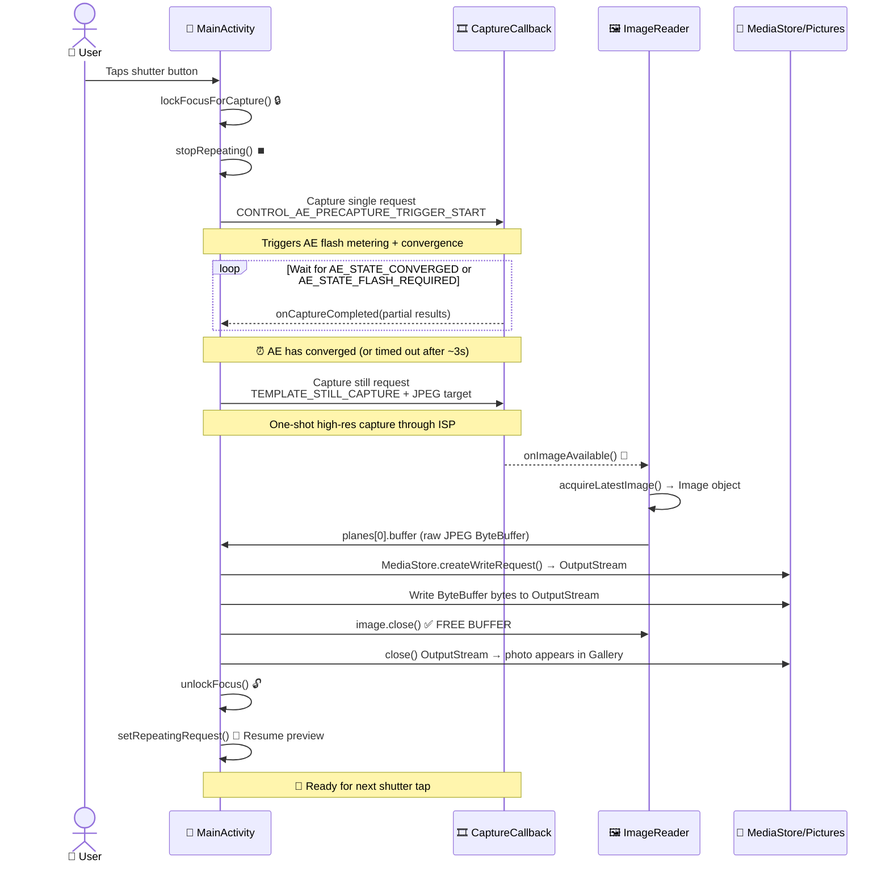

Congratulations on reaching the final chapter of Part II! If you've followed along since Chapter 5, your app now has: permission handling, a dedicated background thread, camera enumeration with `CameraCharacteristics`, robust open/close lifecycle management via `Semaphore`, and a smooth, correctly-oriented live preview rendered through `TextureView`. What's missing? **The ability to tap a button and keep a photo**. That's what this chapter delivers.

By the end of this chapter, your tutorial project will be a genuinely usable camera application: tap the shutter, the app briefly freezes preview (as it should, to flush the pipeline), a still image is captured with proper auto-exposure convergence, it is saved to the device's shared Pictures directory with correct EXIF orientation metadata, and preview resumes automatically. You can then open the photo in Google Photos or the Android Camera Parameters app ([GitHub](https://github.com/zoozooll/AndroidCameraParameters), [Google Play](https://play.google.com/store/apps/details?id=com.minininja.cameraparams)) to inspect EXIF data, resolution, and quality.

The Android Camera Parameters app's manual capture mode uses a more advanced version of the pipeline we build in this chapter: it runs multi-frame burst captures with per-frame custom ISO, exposure time, and lens position — but it all builds on the same `ImageReader` + `CaptureCallback` fundamentals you will learn here.

## Why Taking a Photo Is More Complex Than Preview

At first glance, "just capture a frame" sounds easy — we already have 60 preview frames per second flowing through the session, why can't we grab one? The answer is that preview frames and still frames are fundamentally different outputs:

1. **Resolution difference**: Preview is ~1–2 MP (1080p). A still photo should use the sensor's **maximum** resolution (often 50+ MP on modern flagships). You don't want a 2 MP photo when your phone can deliver 50 MP.
2. **Exposure difference**: `TEMPLATE_PREVIEW` optimizes for low-latency frame rate. `TEMPLATE_STILL_CAPTURE` optimizes for dynamic range, noise reduction, and color accuracy — the still frame needs the highest-quality ISP processing the pipeline can deliver.
3. **3A convergence**: Before taking a photo, the camera's Auto-Exposure (AE) algorithm needs to be told "we're about to take a still — lock onto the current scene, converge exposure, white balance, and focus, and fire the flash if needed." This is the **precapture trigger** sequence. Skipping it leads to photos that are over/underexposed relative to what preview showed.
4. **Storage and Scoped Storage**: The preview frame is never persisted. The photo frame must be written to disk as a valid JPEG file, indexed by the MediaStore so gallery apps can see it, and on Android 10+ this must use the Scoped Storage APIs (no arbitrary `File` writes to `/sdcard/DCIM/`).

Still capture is a **multi-stage asynchronous state machine**, not a single call. The sequence diagram below shows the exact order and timing you must implement. Do not skip any step.



The timing of the precapture trigger is critical: it must be sent BEFORE the still capture, and you must wait for AE to converge (or hit a timeout) before firing the still. If you skip the wait, the photo will use the preview's exposure settings, which may be tuned for high frame rate rather than photo quality.

## Introducing ImageReader: The CPU-Accessible Frame Sink

In Chapter 8 we fed preview frames to a `SurfaceTexture` (GPU sink). For still capture we need a CPU-accessible sink so we can write the JPEG bytes to disk. That sink is `ImageReader`.

`ImageReader` is constructed with:
```kotlin
val imageReader = ImageReader.newInstance(
    width,           // Pixel width of still frames (max still size from characteristics)
    height,          // Pixel height of still frames
    ImageFormat.JPEG,// Format — JPEG for photos, RAW_SENSOR for DNG RAW, YUV_420_888 for processing
    maxImages        // How many buffers to allocate in the queue (2–5 typically)
)
```

The four parameters explained:

1. **width/height**: Use the camera's maximum JPEG size from `SCALER_STREAM_CONFIGURATION_MAP.getOutputSizes(ImageFormat.JPEG)`. Always pick the largest size for the highest-quality photo.
2. **ImageFormat.JPEG**: The Image Signal Processor (ISP) will run full JPEG encoding pipeline (Huffman coding, quantization, EXIF embedding, JFIF header) before delivering the frame. The `Image.planes[0].buffer` is a **complete, valid JPEG file** — no re-encoding needed; you can write those bytes directly to disk.
3. **maxImages**: The depth of the internal `BufferQueue`. JPEG buffers are large (5–20 MB each). Set this to **2** for a typical photo capture (one in-flight + one spare). Setting it higher wastes RAM; setting it to **1** and forgetting to `close()` the Image leads to permanent capture deadlock (the queue can never dequeue an empty buffer again).

`ImageReader` exposes two crucial API surfaces:
- **`imageReader.surface`**: Returns a `Surface` that can be added as a target to CaptureRequests and included in the `CameraCaptureSession` output surface list.
- **`imageReader.setOnImageAvailableListener(listener, handler)`**: Registers a callback that fires on **every new frame** delivered to this reader. Inside this callback, you call `acquireLatestImage()` (or `acquireNextImage()`) to get the `Image` object.

### ⚠️ CRITICAL RULE: Always close the Image

If you call `acquireLatestImage()` and do **not** call `image.close()`, that buffer is **permanently removed from the pool**. Once `maxImages` buffers are leaked, `OnImageAvailableListener` stops firing FOREVER (the queue has no empty buffers to dequeue into, so no new frames can arrive). Always use a try/finally block:

```kotlin
val image = imageReader.acquireLatestImage()
try {
    // Use image bytes here
} finally {
    image.close() // ALWAYS. No exceptions.
}
```

This is the single most common Chapter 9 bug: capture works once, then never works again until the app is restarted.

## The Precapture AE State Machine

The Camera2 3A (Auto-Exposure / Auto-Focus / Auto-White-Balance) system is a per-frame state machine driven by the `CONTROL_AE_PRECAPTURE_TRIGGER` request key. The flow:

1. **Stop repeating preview**: `captureSession.stopRepeating()`. We don't want preview frames interleaving with the still pipeline.
2. **Fire precapture trigger**: Build a single `CaptureRequest` that sets `CONTROL_AE_PRECAPTURE_TRIGGER` to `START`. Submit it with `captureSession.capture()` (NOT `setRepeatingRequest` — it's a one-shot command, not continuous).
3. **Wait for convergence**: In the `CaptureCallback.onCaptureCompleted()` for the precapture trigger (and subsequent frames), inspect `CaptureResult.CONTROL_AE_STATE`. We are waiting for one of:
   - `CONTROL_AE_STATE_CONVERGED` ✓ (AE is happy, scene is correctly metered)
   - `CONTROL_AE_STATE_FLASH_REQUIRED` ✓ (AE determined flash is needed, flash is now charged)
   - `CONTROL_AE_STATE_LOCKED` ✓ (if user manually locked AE earlier)
   - A 3000ms timeout fires ✗ (safety valve — some buggy devices never signal convergence).
4. **Fire still capture**: Build a `TEMPLATE_STILL_CAPTURE` request targeting the `ImageReader`'s Surface. Submit it with `captureSession.capture()`.
5. **Image arrives**: `OnImageAvailableListener.onImageAvailable()` fires → acquire JPEG bytes → save to disk.
6. **Unlock and resume**: Build a request that cancels AE trigger (`CONTROL_AE_PRECAPTURE_TRIGGER_CANCEL`), call `unlockFocus()` for AF/AWB, then `setRepeatingRequest(previewRequest, ...)` to restart preview.

Each of the 6 steps corresponds to one state in our `CaptureStateMachine` enum we'll define in the code.

## Scoped Storage and MediaStore (Android 10+)

From Android 10 (API 29) onward, apps can no longer write arbitrary files to the shared `/sdcard/Pictures` directory using the `java.io.File` API — doing so throws a `FileNotFoundException` with "Permission denied" even if you hold `WRITE_EXTERNAL_STORAGE`. The correct, future-proof approach uses the `MediaStore` content provider:

1. **Prepare a `ContentValues` bundle**: MIME type (`image/jpeg`), relative path (`Pictures/Camera2Tutorial/` — the system creates the directory if needed), display name (timestamped).
2. **Insert a pending row**: `contentResolver.insert(MediaStore.Images.Media.EXTERNAL_CONTENT_URI, values)` returns a `Uri`.
3. **Open an OutputStream to the Uri**: `contentResolver.openOutputStream(uri)` gives you a `ParcelFileDescriptor`-backed stream.
4. **Write bytes and close**: The JPEG ByteBuffer from `ImageReader` is copied directly into the OutputStream.
5. **Make the file visible to gallery apps**: Optional — add `IS_PENDING=0` in the values if you used a pending-write pattern (we'll use the simpler `IS_PENDING=1`-then-update approach for maximum compatibility).

On API 28 and below, we fall back to the traditional `File(Environment.getExternalStoragePublicDirectory(Environment.DIRECTORY_PICTURES), ...)` path with direct `FileOutputStream`, which still works because legacy storage models apply.

## Full Chapter 9 Code — Photo Capture

Here is the complete, end-to-end `MainActivity.kt` incorporating all of the above: the `ImageReader`, the 6-state precapture AE state machine, the shutter button, `MediaStore`/legacy save, and teardown of both session surfaces (preview + jpeg). We also update the layout XML for the shutter button.

### Updated Layout (activity_main.xml)

```xml
<?xml version="1.0" encoding="utf-8"?>
<FrameLayout xmlns:android="http://schemas.android.com/apk/res/android"
    xmlns:tools="http://schemas.android.com/tools"
    android:layout_width="match_parent"
    android:layout_height="match_parent">

    <TextureView
        android:id="@+id/textureView"
        android:layout_width="match_parent"
        android:layout_height="match_parent"
        android:layout_gravity="center" />

    <TextView
        android:id="@+id/statusTextView"
        android:layout_width="wrap_content"
        android:layout_height="wrap_content"
        android:layout_gravity="top|center_horizontal"
        android:layout_marginTop="16dp"
        android:background="#80000000"
        android:padding="8dp"
        android:textColor="#FFFFFFFF"
        android:textSize="12sp"
        tools:text="Initializing..." />

    <com.google.android.material.floatingactionbutton.FloatingActionButton
        android:id="@+id/shutterButton"
        android:layout_width="wrap_content"
        android:layout_height="wrap_content"
        android:layout_gravity="bottom|center_horizontal"
        android:layout_marginBottom="48dp"
        android:contentDescription="Take photo"
        android:src="@android:drawable/ic_menu_camera"
        app:fabSize="normal" />

</FrameLayout>
```

If you don't have Material Components, replace the FAB with a `Button` with `layout_gravity="bottom|center_horizontal"`.

### Full Kotlin Activity

```kotlin
package com.example.camera2tutorial

import android.Manifest
import android.content.ContentValues
import android.content.Context
import android.content.pm.PackageManager
import android.graphics.ImageFormat
import android.graphics.Matrix
import android.graphics.RectF
import android.graphics.SurfaceTexture
import android.hardware.camera2.CameraAccessException
import android.hardware.camera2.CameraCharacteristics
import android.hardware.camera2.CameraCaptureSession
import android.hardware.camera2.CameraDevice
import android.hardware.camera2.CameraManager
import android.hardware.camera2.CaptureRequest
import android.hardware.camera2.CaptureResult
import android.hardware.camera2.TotalCaptureResult
import android.hardware.camera2.params.StreamConfigurationMap
import android.media.Image
import android.media.ImageReader
import android.os.Build
import android.os.Bundle
import android.os.Environment
import android.os.Handler
import android.os.HandlerThread
import android.provider.MediaStore
import android.util.Log
import android.util.Size
import android.view.Surface
import android.view.TextureView
import android.view.View
import android.view.WindowManager
import android.widget.TextView
import android.widget.Toast
import androidx.appcompat.app.AppCompatActivity
import androidx.core.app.ActivityCompat
import androidx.core.content.ContextCompat
import com.google.android.material.floatingactionbutton.FloatingActionButton
import java.io.File
import java.io.FileOutputStream
import java.io.OutputStream
import java.text.SimpleDateFormat
import java.util.Collections
import java.util.Date
import java.util.Locale
import java.util.concurrent.Semaphore
import java.util.concurrent.TimeUnit
import kotlin.math.max
import kotlin.math.min

class MainActivity : AppCompatActivity() {

    // UI
    private lateinit var textureView: TextureView
    private lateinit var statusTextView: TextView
    private lateinit var shutterButton: FloatingActionButton

    // Threading
    private lateinit var backgroundThread: HandlerThread
    private lateinit var backgroundHandler: Handler

    // Camera pipeline state
    private lateinit var cameraManager: CameraManager
    private var cameraDevice: CameraDevice? = null
    private var captureSession: CameraCaptureSession? = null
    private var previewRequestBuilder: CaptureRequest.Builder? = null
    private var previewRequest: CaptureRequest? = null
    private var selectedCameraId: String? = null
    private var sensorOrientation = 0
    private var jpegOrientation = 0
    private lateinit var previewSize: Size
    private lateinit var jpegSize: Size

    // 🆕 Still capture sink
    private lateinit var imageReader: ImageReader

    // Concurrency
    private val cameraOpenCloseLock = Semaphore(1)

    // 🆕 Capture state machine
    private enum class CaptureState {
        IDLE,                 // Preview running normally
        WAITING_AE_PRECAPTURE, // AE precapture trigger fired, waiting for converge
        WAITING_AF_LOCK,      // (optional) used if we add AF trigger too
        WAITING_STILL_CAPTURE,// Still capture submitted, waiting for ImageReader
        PICTURE_SAVED         // Photo saved, about to return to IDLE
    }
    private var captureState: CaptureState = CaptureState.IDLE
    private val precaptureTimeoutHandler: Handler by lazy { Handler(mainLooper) }
    private val precaptureTimeoutRunnable = Runnable {
        if (captureState == CaptureState.WAITING_AE_PRECAPTURE) {
            Log.w(TAG, "⏰ Precapture AE timeout — proceeding with still anyway")
            captureStillPicture()
        }
    }

    // -------------------------------------------------------------------------
    // Lifecycle + UI hookup
    // -------------------------------------------------------------------------
    override fun onCreate(savedInstanceState: Bundle?) {
        super.onCreate(savedInstanceState)
        setContentView(R.layout.activity_main)

        textureView = findViewById(R.id.textureView)
        statusTextView = findViewById(R.id.statusTextView)
        shutterButton = findViewById(R.id.shutterButton)
        statusTextView.text = "Initializing..."

        shutterButton.setOnClickListener { takePicture() }

        if (allPermissionsGranted()) {
            initializeCameraManager()
        } else {
            val allPerms = REQUIRED_PERMISSIONS + WRITE_EXTERNAL_IF_NEEDED
            ActivityCompat.requestPermissions(this, allPerms, REQUEST_CODE_PERMISSIONS)
        }
    }

    override fun onResume() {
        super.onResume()
        startBackgroundThread()
        if (allPermissionsGranted()) {
            if (!this::cameraManager.isInitialized) initializeCameraManager()
            if (textureView.isAvailable) openCameraAndStartSession(textureView.width, textureView.height)
        }
    }

    override fun onPause() {
        closeEverything()
        stopBackgroundThread()
        super.onPause()
    }

    private fun startBackgroundThread() {
        backgroundThread = HandlerThread("Camera2Background").apply { start() }
        backgroundHandler = Handler(backgroundThread.looper)
    }

    private fun stopBackgroundThread() {
        backgroundThread.quitSafely()
        try { backgroundThread.join(1000) } catch (_: InterruptedException) {}
    }

    // -------------------------------------------------------------------------
    // Chapter 6 condensed: camera discovery
    // -------------------------------------------------------------------------
    data class CamInfo(val id: String, val facing: Int?, val hw: Int?, val chars: CameraCharacteristics)

    private fun initializeCameraManager() {
        cameraManager = getSystemService(Context.CAMERA_SERVICE) as CameraManager
        val cams = mutableListOf<CamInfo>()
        for (id in cameraManager.cameraIdList) {
            val chars = try { cameraManager.getCameraCharacteristics(id) } catch (_: Exception) { continue }
            cams += CamInfo(
                id,
                chars[CameraCharacteristics.LENS_FACING],
                chars[CameraCharacteristics.INFO_SUPPORTED_HARDWARE_LEVEL],
                chars
            )
        }
        val best = cams.sortedWith(
            compareByDescending<CamInfo> { it.facing == CameraCharacteristics.LENS_FACING_BACK }
                .thenByDescending { it.hw ?: -1 }).first()
        selectedCameraId = best.id
        sensorOrientation = best.chars[CameraCharacteristics.SENSOR_ORIENTATION] ?: 90

        textureView.surfaceTextureListener = object : TextureView.SurfaceTextureListener {
            override fun onSurfaceTextureAvailable(s: SurfaceTexture, w: Int, h: Int) {
                openCameraAndStartSession(w, h)
            }
            override fun onSurfaceTextureSizeChanged(s: SurfaceTexture, w: Int, h: Int) {
                if (this@MainActivity::previewSize.isInitialized) configureTransform(w, h)
            }
            override fun onSurfaceTextureDestroyed(s: SurfaceTexture): Boolean = true
            override fun onSurfaceTextureUpdated(s: SurfaceTexture) {}
        }
    }

    // -------------------------------------------------------------------------
    // Chapter 7 condensed: openCamera
    // -------------------------------------------------------------------------
    private val deviceCallback = object : CameraDevice.StateCallback() {
        override fun onOpened(cam: CameraDevice) {
            cameraOpenCloseLock.release()
            cameraDevice = cam
            createCaptureSession()
        }
        override fun onDisconnected(cam: CameraDevice) {
            cameraOpenCloseLock.release()
            cameraDevice?.close(); cameraDevice = null
        }
        override fun onError(cam: CameraDevice, err: Int) {
            cameraOpenCloseLock.release()
            cameraDevice?.close(); cameraDevice = null
            Toast.makeText(this@MainActivity, "Camera error $err", Toast.LENGTH_LONG).show()
        }
    }

    // -------------------------------------------------------------------------
    // Session creation (now with 2 surfaces: preview + jpeg)
    // -------------------------------------------------------------------------
    private fun openCameraAndStartSession(vw: Int, vh: Int) {
        val camId = selectedCameraId ?: return
        if (checkSelfPermission(Manifest.permission.CAMERA) != PackageManager.PERMISSION_GRANTED) return
        if (!cameraOpenCloseLock.tryAcquire(2500, TimeUnit.MILLISECONDS)) {
            Toast.makeText(this, "Camera lock timeout", Toast.LENGTH_SHORT).show(); return
        }
        val chars = cameraManager.getCameraCharacteristics(camId)

        // Preview size
        previewSize = choosePreviewSize(chars, vw, vh)
        // 🆕 Still JPEG size (MAXIMUM available for best quality)
        jpegSize = chooseMaxJpegSize(chars)

        // JPEG orientation tag = sensor orientation rotated by device rotation
        jpegOrientation = computeJpegOrientation()

        // 🆕 Create the ImageReader: width=jpegW, height=jpegH, format=JPEG, 2 buffers
        imageReader = ImageReader.newInstance(
            jpegSize.width,
            jpegSize.height,
            ImageFormat.JPEG,
            2
        )
        // 🆕 Hook the JPEG frame available listener
        imageReader.setOnImageAvailableListener(onJpegAvailableListener, backgroundHandler)

        configureTransform(vw, vh)
        textureView.surfaceTexture!!.setDefaultBufferSize(previewSize.width, previewSize.height)
        statusTextView.text = "Session: preview ${previewSize} • JPEG ${jpegSize}"

        try { cameraManager.openCamera(camId, deviceCallback, backgroundHandler) }
        catch (e: CameraAccessException) { cameraOpenCloseLock.release() }
    }

    private fun createCaptureSession() {
        val cam = cameraDevice ?: return
        val st = textureView.surfaceTexture ?: return
        val previewSurface = Surface(st)
        val jpegSurface = imageReader.surface
        val outputs = listOf(previewSurface, jpegSurface)

        previewRequestBuilder =
            cam.createCaptureRequest(CameraDevice.TEMPLATE_PREVIEW).apply { addTarget(previewSurface) }

        cam.createCaptureSession(outputs, object : CameraCaptureSession.StateCallback() {
            override fun onConfigured(session: CameraCaptureSession) {
                captureSession = session
                previewRequest = previewRequestBuilder!!.build()
                captureState = CaptureState.IDLE
                shutterButton.isEnabled = true
                statusTextView.text = "🎥 Preview — tap shutter to take photo"
                session.setRepeatingRequest(previewRequest!!, captureCallback, backgroundHandler)
            }
            override fun onConfigureFailed(session: CameraCaptureSession) {
                Toast.makeText(this@MainActivity, "Session failed", Toast.LENGTH_LONG).show()
            }
        }, backgroundHandler)
    }

    // -------------------------------------------------------------------------
    // 🆕 CaptureCallback + takePicture state machine
    // -------------------------------------------------------------------------
    private val captureCallback = object : CameraCaptureSession.CaptureCallback() {
        override fun onCaptureStarted(
            session: CameraCaptureSession,
            request: CaptureRequest,
            timestamp: Long,
            frameNumber: Long
        ) {}

        override fun onCaptureProgressed(
            session: CameraCaptureSession,
            request: CaptureRequest,
            partialResult: CaptureResult
        ) {
            process(partialResult)
        }

        override fun onCaptureCompleted(
            session: CameraCaptureSession,
            request: CaptureRequest,
            result: TotalCaptureResult
        ) {
            process(result)
        }

        /**
         * Called for every partial and completed frame.
         * When we are waiting for AE precapture to converge, check AE_STATE here.
         */
        private fun process(result: CaptureResult) {
            when (captureState) {
                CaptureState.WAITING_AE_PRECAPTURE -> {
                    val aeState = result[CaptureResult.CONTROL_AE_STATE]
                    Log.d(TAG, "AE_STATE = $aeState")
                    if (aeState == null) return
                    when (aeState) {
                        CaptureResult.CONTROL_AE_STATE_CONVERGED,
                        CaptureResult.CONTROL_AE_STATE_FLASH_REQUIRED,
                        CaptureResult.CONTROL_AE_STATE_LOCKED -> {
                            // ✅ AE is ready — cancel timeout and fire still capture
                            precaptureTimeoutHandler.removeCallbacks(precaptureTimeoutRunnable)
                            captureStillPicture()
                        }
                        // else → CONTROL_AE_STATE_PRECAPTURE / SEARCHING / INACTIVE → keep waiting
                    }
                }
                else -> { /* No state-tracking needed in IDLE or other states */ }
            }
        }
    }

    /** Public shutter click entry point. */
    fun takePicture() {
        if (cameraDevice == null || captureSession == null) return
        if (captureState != CaptureState.IDLE) {
            Log.d(TAG, "⚠️ Capture in progress — ignoring duplicate shutter tap")
            return
        }
        shutterButton.isEnabled = false
        statusTextView.text = "📸 Locking exposure..."
        lockFocusAndFirePrecaptureTrigger()
    }

    /**
     * Step 1–3: Stop repeating preview, submit AE precapture trigger, start 3s timeout.
     * The captureCallback.process() method watches AE_STATE and calls captureStillPicture()
     * when converged.
     */
    private fun lockFocusAndFirePrecaptureTrigger() {
        val session = captureSession ?: return
        try {
            captureState = CaptureState.WAITING_AE_PRECAPTURE

            // Build a request identical to preview but with AE precapture trigger = START
            previewRequestBuilder?.apply {
                set(
                    CaptureRequest.CONTROL_AE_PRECAPTURE_TRIGGER,
                    CaptureRequest.CONTROL_AE_PRECAPTURE_TRIGGER_START
                )
            }

            // Pause continuous preview frames — use capture() to fire ONE trigger frame
            session.stopRepeating()
            session.capture(previewRequestBuilder!!.build(), captureCallback, backgroundHandler)

            // Safety-valve timeout (3 seconds): some devices never signal AE converged
            precaptureTimeoutHandler.postDelayed(precaptureTimeoutRunnable, 3000)

        } catch (e: CameraAccessException) {
            Log.e(TAG, "Precapture trigger failed", e)
            unlockFocusAndResumePreview()
        }
    }

    /**
     * Step 4: AE converged (or timed out). Fire the single TEMPLATE_STILL_CAPTURE request
     * targeting the ImageReader surface → JPEG bytes arrive via onJpegAvailableListener.
     */
    private fun captureStillPicture() {
        val cam = cameraDevice ?: return
        val session = captureSession ?: return
        captureState = CaptureState.WAITING_STILL_CAPTURE
        statusTextView.text = "📷 Capturing photo..."

        try {
            // 🆕 Use TEMPLATE_STILL_CAPTURE — highest quality ISP pipeline
            val stillBuilder = cam.createCaptureRequest(CameraDevice.TEMPLATE_STILL_CAPTURE)
            stillBuilder.addTarget(imageReader.surface)
            stillBuilder.set(CaptureRequest.JPEG_ORIENTATION, jpegOrientation)
            stillBuilder.set(CaptureRequest.JPEG_QUALITY, 95.toByte()) // 1–100 quality

            val stillCallback = object : CameraCaptureSession.CaptureCallback() {
                override fun onCaptureCompleted(
                    s: CameraCaptureSession,
                    req: CaptureRequest,
                    res: TotalCaptureResult
                ) {
                    Log.d(TAG, "📨 Still capture metadata delivered")
                    // Note: the actual JPEG bytes arrive via onJpegAvailableListener, not here.
                }
            }

            session.stopRepeating()
            session.capture(stillBuilder.build(), stillCallback, backgroundHandler)

        } catch (e: CameraAccessException) {
            Log.e(TAG, "Still capture failed", e)
            unlockFocusAndResumePreview()
        }
    }

    /**
     * Step 5: JPEG bytes available in ImageReader. Acquire latest Image, write its bytes
     * to MediaStore (or legacy File), CLOSE THE IMAGE, then resume preview.
     */
    private val onJpegAvailableListener = ImageReader.OnImageAvailableListener { reader ->
        var image: Image? = null
        try {
            image = reader.acquireLatestImage()
            if (image == null) {
                Log.w(TAG, "acquireLatestImage returned null — buffer dropped")
                return@OnImageAvailableListener
            }
            val buffer = image.planes[0].buffer
            val bytes = ByteArray(buffer.remaining())
            buffer.get(bytes)

            val savedUri = savePhotoToStorage(bytes)
            captureState = CaptureState.PICTURE_SAVED

            // Switch to main thread for UI updates / toasts
            runOnUiThread {
                shutterButton.isEnabled = true
                if (savedUri != null) {
                    statusTextView.text = "✅ Saved! Uri=$savedUri"
                    Toast.makeText(
                        this@MainActivity,
                        "Photo saved: $savedUri",
                        Toast.LENGTH_LONG
                    ).show()
                } else {
                    statusTextView.text = "❌ Save failed"
                    Toast.makeText(
                        this@MainActivity,
                        "Failed to save photo — check Logcat",
                        Toast.LENGTH_LONG
                    ).show()
                }
            }
        } catch (e: Exception) {
            Log.e(TAG, "onJpegAvailable error", e)
        } finally {
            image?.close() // ✅ ALWAYS CLOSE THE IMAGE — no exceptions!
        }

        // Step 6: Resume preview regardless of save success/failure
        runOnUiThread { unlockFocusAndResumePreview() }
    }

    /**
     * Step 6: Cancel AE precapture trigger, clear focus locks, restart repeating preview.
     */
    private fun unlockFocusAndResumePreview() {
        val session = captureSession ?: return
        try {
            previewRequestBuilder?.apply {
                set(
                    CaptureRequest.CONTROL_AF_TRIGGER,
                    CaptureRequest.CONTROL_AF_TRIGGER_CANCEL
                )
                set(
                    CaptureRequest.CONTROL_AE_PRECAPTURE_TRIGGER,
                    CaptureRequest.CONTROL_AE_PRECAPTURE_TRIGGER_CANCEL
                )
            }
            session.capture(previewRequestBuilder!!.build(), captureCallback, backgroundHandler)

            captureState = CaptureState.IDLE
            precaptureTimeoutHandler.removeCallbacks(precaptureTimeoutRunnable)
            session.setRepeatingRequest(previewRequest!!, captureCallback, backgroundHandler)

            if (statusTextView.text.startsWith("📸") ||
                statusTextView.text.startsWith("📷")) {
                statusTextView.text = "🎥 Preview — tap shutter to take photo"
            }
        } catch (e: CameraAccessException) {
            Log.e(TAG, "Failed to resume preview after still capture", e)
        }
    }

    // -------------------------------------------------------------------------
    // 🆕 savePhotoToStorage: MediaStore (API 29+) + legacy File (API 28+)
    // -------------------------------------------------------------------------
    private fun savePhotoToStorage(jpegBytes: ByteArray): android.net.Uri? {
        val timestamp = SimpleDateFormat("yyyyMMdd_HHmmss", Locale.US).format(Date())
        val displayName = "IMG_Camera2Tutorial_$timestamp"
        val relativeDir = "${Environment.DIRECTORY_PICTURES}/Camera2Tutorial"

        return if (Build.VERSION.SDK_INT >= Build.VERSION_CODES.Q) {
            // ✅ Scoped Storage via MediaStore (no WRITE_EXTERNAL_STORAGE permission needed!)
            val values = ContentValues().apply {
                put(MediaStore.Images.Media.DISPLAY_NAME, "$displayName.jpg")
                put(MediaStore.Images.Media.MIME_TYPE, "image/jpeg")
                put(MediaStore.Images.Media.RELATIVE_PATH, relativeDir)
                put(MediaStore.Images.Media.IS_PENDING, 1) // Mark as pending while writing
            }
            val resolver = contentResolver
            val uri = resolver.insert(MediaStore.Images.Media.EXTERNAL_CONTENT_URI, values)
                ?: return null
            try {
                resolver.openOutputStream(uri)?.use { os -> os.write(jpegBytes) }
                // Clear the PENDING flag so gallery apps can see it now
                values.clear()
                values.put(MediaStore.Images.Media.IS_PENDING, 0)
                resolver.update(uri, values, null, null)
                Log.d(TAG, "✅ MediaStore saved: $uri")
                uri
            } catch (e: Exception) {
                Log.e(TAG, "MediaStore write failed", e)
                resolver.delete(uri, null, null) // Clean up half-written pending file
                null
            }
        } else {
            // 🕰️ Legacy path: direct file write to public Pictures directory
            val dir = File(Environment.getExternalStoragePublicDirectory(Environment.DIRECTORY_PICTURES), "Camera2Tutorial")
            if (!dir.exists()) dir.mkdirs()
            val file = File(dir, "$displayName.jpg")
            try {
                FileOutputStream(file).use { os -> os.write(jpegBytes) }
                // Index the file so gallery apps discover it immediately
                val values = ContentValues().apply {
                    put(MediaStore.Images.Media.DATA, file.absolutePath)
                    put(MediaStore.Images.Media.MIME_TYPE, "image/jpeg")
                    put(MediaStore.Images.Media.DISPLAY_NAME, displayName)
                }
                contentResolver.insert(MediaStore.Images.Media.EXTERNAL_CONTENT_URI, values)
                android.net.Uri.fromFile(file)
            } catch (e: Exception) {
                Log.e(TAG, "Legacy file write failed", e)
                null
            }
        }
    }

    // -------------------------------------------------------------------------
    // Sizing + orientation helpers
    // -------------------------------------------------------------------------
    private fun choosePreviewSize(chars: CameraCharacteristics, vw: Int, vh: Int): Size {
        val map = chars[CameraCharacteristics.SCALER_STREAM_CONFIGURATION_MAP]!!
        val viewAspect = max(vw, vh).toDouble() / min(vw, vh)
        val choices = map.getOutputSizes(SurfaceTexture::class.java).toList()
        val matches = choices.filter {
            val a = max(it.width, it.height).toDouble() / min(it.width, it.height)
            kotlin.math.abs(a - viewAspect) < 0.02 && (it.width * it.height) <= 1920 * 1080 * 2
        }
        return (matches.ifEmpty { choices }).maxByOrNull { it.width * it.height }!!
    }

    private fun chooseMaxJpegSize(chars: CameraCharacteristics): Size {
        val map = chars[CameraCharacteristics.SCALER_STREAM_CONFIGURATION_MAP]!!
        val choices = map.getOutputSizes(ImageFormat.JPEG).toList()
        val max = choices.maxByOrNull { it.width * it.height }!!
        Log.d(TAG, "Max JPEG size selected: ${max.width}×${max.height} " +
            "(from ${choices.size} sizes)")
        return max
    }

    private fun computeJpegOrientation(): Int {
        val deviceRotation = (getSystemService(Context.WINDOW_SERVICE) as WindowManager)
            .defaultDisplay.rotation
        val facing = try {
            selectedCameraId?.let {
                cameraManager.getCameraCharacteristics(it)[CameraCharacteristics.LENS_FACING]
            }
        } catch (_: Exception) { CameraCharacteristics.LENS_FACING_BACK }
        val frontFacing = facing == CameraCharacteristics.LENS_FACING_FRONT

        return when (deviceRotation) {
            Surface.ROTATION_0 -> if (frontFacing) (360 - sensorOrientation) % 360 else sensorOrientation
            Surface.ROTATION_90 -> if (frontFacing) (360 - (sensorOrientation + 270) % 360) % 360 else (sensorOrientation + 270) % 360
            Surface.ROTATION_180 -> if (frontFacing) (360 - (sensorOrientation + 180) % 360) % 360 else (sensorOrientation + 180) % 360
            Surface.ROTATION_270 -> if (frontFacing) (360 - (sensorOrientation + 90) % 360) % 360 else (sensorOrientation + 90) % 360
            else -> 0
        }
    }

    private fun configureTransform(vw: Int, vh: Int) {
        val rotation = (getSystemService(Context.WINDOW_SERVICE) as WindowManager).defaultDisplay.rotation
        val matrix = Matrix()
        val vr = RectF(0f, 0f, vw.toFloat(), vh.toFloat())
        val br = RectF(0f, 0f, previewSize.height.toFloat(), previewSize.width.toFloat())
        val cx = vr.centerX(); val cy = vr.centerY()
        br.offset(cx - br.centerX(), cy - br.centerY())
        matrix.setRectToRect(vr, br, Matrix.ScaleToFit.FILL)
        val scale = max(vh.toFloat() / previewSize.height, vw.toFloat() / previewSize.width)
        matrix.postScale(scale, scale, cx, cy)
        val rot = when (rotation) {
            Surface.ROTATION_0 -> sensorOrientation
            Surface.ROTATION_90 -> 0
            Surface.ROTATION_180 -> 360 - sensorOrientation
            Surface.ROTATION_270 -> 180
            else -> 0
        }
        matrix.postRotate(rot.toFloat(), cx, cy)
        textureView.setTransform(matrix)
    }

    // -------------------------------------------------------------------------
    // Teardown
    // -------------------------------------------------------------------------
    private fun closeEverything() {
        try {
            cameraOpenCloseLock.acquire()
            precaptureTimeoutHandler.removeCallbacks(precaptureTimeoutRunnable)
            captureSession?.apply {
                try { stopRepeating(); abortCaptures() } catch (_: CameraAccessException) {}
                close()
            }
            captureSession = null
            cameraDevice?.close(); cameraDevice = null
            if (this::imageReader.isInitialized) {
                imageReader.close() // Important — frees the JPEG BufferQueue memory
            }
        } catch (_: InterruptedException) {
        } finally {
            cameraOpenCloseLock.release()
        }
    }

    // -------------------------------------------------------------------------
    // Boilerplate permissions
    // -------------------------------------------------------------------------
    companion object {
        private const val TAG = "Camera2Tutorial"
        private const val REQUEST_CODE_PERMISSIONS = 10
        private val REQUIRED_PERMISSIONS = arrayOf(Manifest.permission.CAMERA)
        // WRITE_EXTERNAL_STORAGE is only needed pre-Q for legacy file save path
        private val WRITE_EXTERNAL_IF_NEEDED =
            if (Build.VERSION.SDK_INT < Build.VERSION_CODES.Q)
                arrayOf(Manifest.permission.WRITE_EXTERNAL_STORAGE)
            else
                emptyArray()
    }

    private fun allPermissionsGranted(): Boolean {
        val need = REQUIRED_PERMISSIONS + WRITE_EXTERNAL_IF_NEEDED
        return need.all { ContextCompat.checkSelfPermission(baseContext, it) == PackageManager.PERMISSION_GRANTED }
    }

    override fun onRequestPermissionsResult(
        requestCode: Int, permissions: Array<out String>, grantResults: IntArray
    ) {
        super.onRequestPermissionsResult(requestCode, permissions, grantResults)
        if (requestCode == REQUEST_CODE_PERMISSIONS) {
            if (allPermissionsGranted()) {
                initializeCameraManager()
            } else {
                Toast.makeText(this, "Permissions required", Toast.LENGTH_LONG).show()
                finish()
            }
        }
    }
}
```

### Reading the Capture State Machine

Follow the `takePicture()` → `lockFocusAndFirePrecaptureTrigger()` → (AE converged or timeout) → `captureStillPicture()` → `onJpegAvailableListener` → `unlockFocusAndResumePreview()` call chain. Each step's transition is gated by `captureState`. Duplicate taps are ignored (the `if (captureState != IDLE) return` check at the top of `takePicture()`).

Key specific details:
- **`JPEG_ORIENTATION`**: Set in the still capture request. Gallery apps read the EXIF orientation tag from the JPEG header to rotate the displayed photo. Without this, landscape photos appear sideways even though the pixel data is correct.
- **`JPEG_QUALITY = 95`**: Good balance between quality and file size. 100 is lossless in theory but produces 2–3× larger files with minimal visual gain; 80 produces visible compression artifacts in detailed textures.
- **`IS_PENDING=1 → 0` pattern (API 29+)**: Tells MediaStore "don't let photo editors, gallery apps, or MTP hosts see this file until I'm done writing it." Prevents half-written corrupt files from appearing in Google Photos while the `OutputStream` write is in progress. Always clear the flag.

## Verification: Running the Photo Capture Flow

Install and launch the Chapter 9 app on a physical Android device (emulator cameras have weird AE state machines and are not representative). Verify each of the following checkpoint behaviors:

1. **Preview runs as before**. Status shows *🎥 Preview — tap shutter to take photo*. Shutter FAB is visible and clickable.
2. **Tap shutter**. Status changes to *📸 Locking exposure...* → *📷 Capturing photo...* → *✅ Saved! Uri=content://media/external/images/media/12345*.
3. **Preview freezes briefly** (~0.3–1.0 seconds) while AE converges and the still frame is processed. Then preview starts again. This brief freeze is correct and expected behavior.
4. **Open the device's Gallery / Photos app**. Navigate to the **Pictures → Camera2Tutorial** album. You should see a thumbnail of the photo you took. Open it — it should be full resolution (e.g., 8160×6120 for a 50 MP sensor), correctly oriented, and properly exposed.
5. **Open the photo in the Android Camera Parameters app's EXIF viewer** ([Google Play](https://play.google.com/store/apps/details?id=com.minininja.cameraparams)). Check that the EXIF orientation tag matches the device's rotation at capture time, JPEG quality = 95, and the resolution matches `jpegSize` logged at session startup.
6. **Rapidly tap shutter 10+ times**. The `captureState != IDLE` guard should swallow duplicate taps during the capture cycle; at the end you should have exactly as many saved photos as completed capture cycles.

### Logcat Output Reference

A successful capture produces Logcat entries roughly in this order:
```
D/Camera2Tutorial: Max JPEG size selected: 8160×6120 (from 9 sizes)
D/Camera2Tutorial: 📸 Locking exposure...
D/Camera2Tutorial: AE_STATE = CONTROL_AE_STATE_SEARCHING
D/Camera2Tutorial: AE_STATE = CONTROL_AE_STATE_SEARCHING
D/Camera2Tutorial: AE_STATE = CONTROL_AE_STATE_CONVERGED
D/Camera2Tutorial: 📷 Capturing photo...
D/Camera2Tutorial: 📨 Still capture metadata delivered
D/Camera2Tutorial: ✅ MediaStore saved: content://media/external/images/media/9876
D/Camera2Tutorial: 🎥 Preview — tap shutter to take photo
```

## Troubleshooting Capture Failures

### captureStillPicture() never fires (stuck on Locking exposure...)

The 3-second timeout should eventually fire and proceed — if even the timeout doesn't fire, the `precaptureTimeoutRunnable` was never posted. Double-check that `lockFocusAndFirePrecaptureTrigger()` calls `precaptureTimeoutHandler.postDelayed(precaptureTimeoutRunnable, 3000)`. If timeout fires every time but `AE_STATE` never appears converged, you may be on a LEGACY-level camera with broken AE state reporting. In that case, add a check: if the hardware level is LEGACY, skip the precapture trigger entirely and jump straight from `takePicture()` to `captureStillPicture()`.

### Capture works once, then all subsequent captures never produce onImageAvailable

You leaked the `Image` by forgetting to call `image.close()`. The `maxImages = 2` pool is exhausted, so no new frames can be delivered until the app process is killed. Verify the `finally { image?.close() }` block in `onJpegAvailableListener`. As a debugging aid, log `imageReader.acquireLatestImage()` returning null — that's the telltale sign of a buffer leak.

### Photo appears sideways in gallery

Your `computeJpegOrientation()` return value is wrong. Test it in all 4 device orientations (portrait, landscape left, reverse landscape, upside-down portrait) on both the back and front cameras. The front camera needs the orientation flipped (mirrored) because `LENS_FACING_FRONT` sensors are mirrored by convention.

### MediaStore throws SecurityException on API 29+

You forgot to remove `WRITE_EXTERNAL_STORAGE` from the API 29+ permission list AND you're on a device with `requestLegacyExternalStorage=false`. On API 29+, `WRITE_EXTERNAL_STORAGE` grants **nothing** — only MediaStore Uris work. The `WRITE_EXTERNAL_IF_NEEDED` helper correctly omits the permission on Q+.

## Summary

Part II ends on a high note: your tutorial app is now a **fully functional camera application**. You implemented:

1. **ImageReader** as the CPU-accessible JPEG sink: correct width/height (max JPEG size), `ImageFormat.JPEG`, `maxImages = 2` buffer count, `OnImageAvailableListener` registration, and the inviolable rule to **always close the Image in a finally block** to prevent permanent buffer starvation.
2. **The 6-state capture state machine**: `IDLE → WAITING_AE_PRECAPTURE → (converged/timeout) → WAITING_STILL_CAPTURE → PICTURE_SAVED → back to IDLE`, guarded by duplicate-tap suppression and a 3-second safety-valve timeout for devices with broken AE state reporting.
3. **Precapture AE trigger flow**: `stopRepeating → session.capture(CONTROL_AE_PRECAPTURE_TRIGGER_START) → process AE_STATE in CaptureCallback until CONVERGED/FLASH_REQUIRED/LOCKED → fire still capture`.
4. **TEMPLATE_STILL_CAPTURE + quality settings**: `JPEG_ORIENTATION` EXIF tag set based on sensor orientation + device rotation (front camera mirrored correctly), `JPEG_QUALITY = 95`.
5. **Future-proof photo storage**: `MediaStore.Images.Media.EXTERNAL_CONTENT_URI` + `RELATIVE_PATH` + `IS_PENDING=1→0` pattern for Scoped Storage on Android 10+, with a fallback legacy `FileOutputStream` path to `Environment.DIRECTORY_PICTURES` on Android 9 and below, plus immediate MediaStore indexing so gallery apps see the new file right away.
6. **Symmetric teardown**: `closeEverything()` stops repeating, aborts captures, closes session, closes device, closes `ImageReader` (critical to free 2× 20 MB JPEG buffers), all inside the `Semaphore(1)` critical section.

The code in this chapter forms the baseline for any serious Camera2 still photography app. The Android Camera Parameters app ([GitHub](https://github.com/zoozooll/AndroidCameraParameters), [Google Play](https://play.google.com/store/apps/details?id=com.minininja.cameraparams)) extends this state machine with 10+ additional states for AF trigger, AWB lock, multi-frame burst capture, RAW (DNG) output alongside JPEG, and manual per-frame ISO/exposure-time override — but every one of those features is an incremental addition to the same `ImageReader` + `CaptureCallback` + state machine pattern you now fully understand.

## What's Next (Looking Ahead to Part III)

This concludes **Part II: Your First Camera2 App**. In five chapters, you built a production-quality skeleton application with permission handling, threading, camera enumeration, open/close lifecycle, preview rendering, and JPEG still capture. If you stopped here and shipped this code, you'd already have a better camera app than many on the Play Store.

But the Camera2 API's true power lies in what comes next. **Part III (Chapters 10–12)** dives deep into the internals you'll need for a professional camera application:
- **Chapter 10: The CameraCharacteristics Encyclopedia** — every key family (SENSOR, LENS, SCALER, STATISTICS, CONTROL, INFO, REQUEST, SYNC), what they mean, and how to design feature flags around them.
- **Chapter 11: The Camera2 Pipeline & HAL3 Architecture** — P1 vs P2 vs P3 nodes, reprocessing, the `CaptureRequest`/`CaptureResult` key duality, sync framework, and what `TEMPLATE_*` actually configures under the hood.
- **Chapter 12: Capture Types, Bursts, and 3A in Depth** — repeating vs single-shot vs burst, ZSL reprocessing queues, AF/AE/AWB state machine transitions, manual controls (`LENS_FOCUS_DISTANCE`, `SENSOR_SENSITIVITY`/`SENSOR_EXPOSURE_TIME`), and the `CONTROL_CAPTURE_INTENT` taxonomy.

Until then, go take some photos with your Chapter 9 app. Explore a scene with mixed lighting (bright window + dark interior) and see how the precapture AE trigger adjusts exposure relative to preview. Compare the file size at `JPEG_QUALITY = 50` vs `95` vs `100`. Swap `chooseMaxJpegSize` for a 4K size and notice the speed difference. The best way to internalize this material is to see the real-world consequences of each parameter. Congratulations on building your first Camera2 camera — you've earned it.
