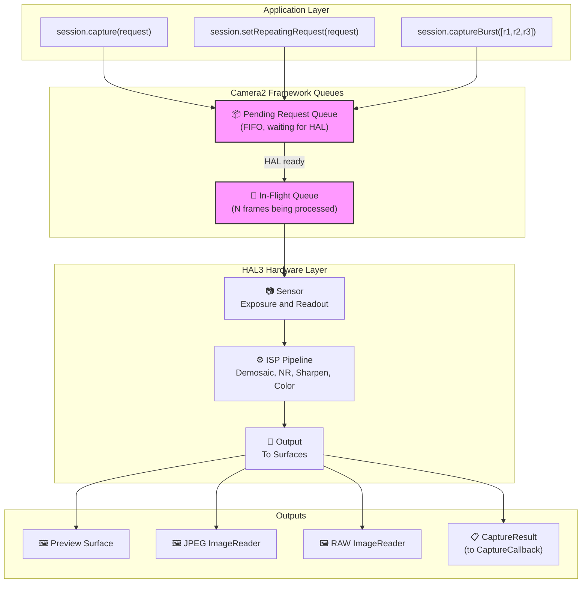
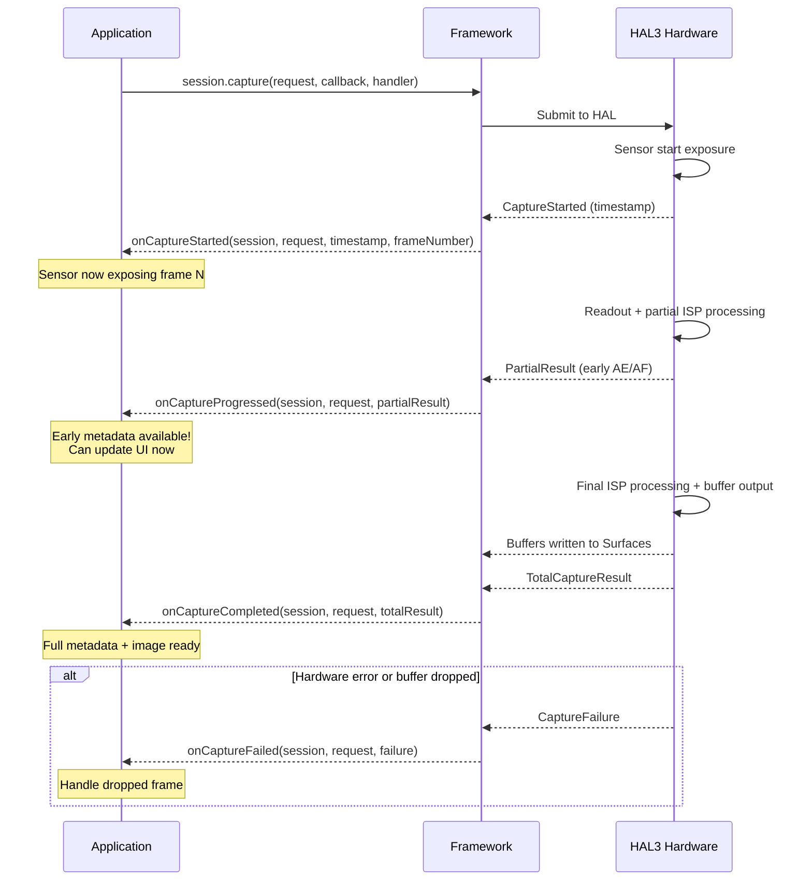
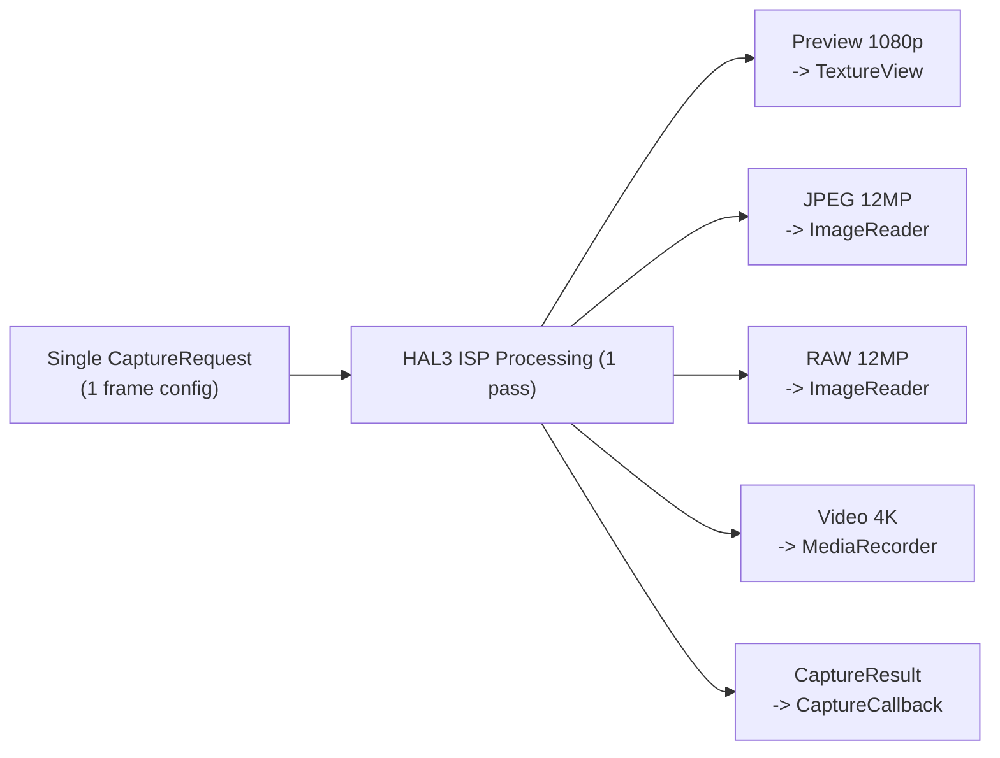
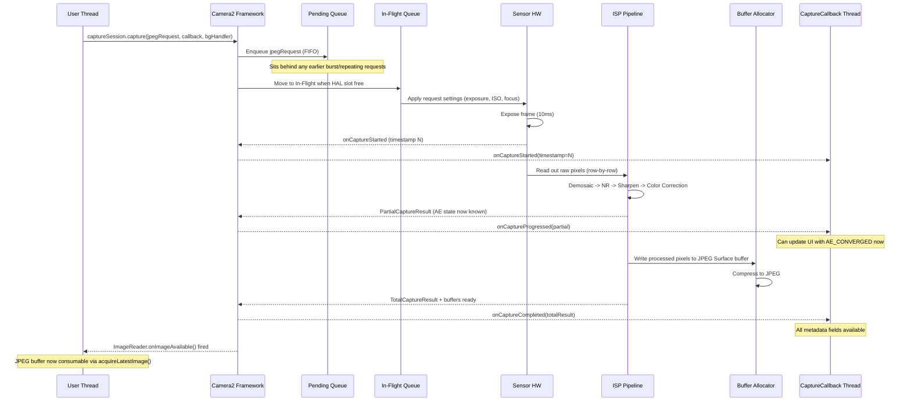

## 10.1 From Usage to Understanding

In the previous chapters of this series, you *used* Camera2: you showed previews, captured photos, and worked with RAW files. Now it's time to flip the lens and look inward — **how does Camera2 actually deliver those frames?**

Understanding the pipeline is not just academic. When you know how requests flow through the system, you can:
- Diagnose frame drops in high-speed capture
- Explain why changing settings takes 1-2 frames to appear
- Optimize burst capture for zero blackout
- Build correct mental models for callback timing

The Android Camera Parameters app ([GitHub](https://github.com/zoozooll/AndroidCameraParameters), [Play Store](https://play.google.com/store/apps/details?id=com.minininja.cameraparams)) visualizes pipeline behavior in real time — look at the **Frame Timing** and **Raw JSON** tabs to see the concepts from this chapter live on your device.

## 10.2 The Core Data Structures

Before looking at the pipeline itself, let's deeply examine the two objects that travel through it: `CaptureRequest` (what goes in) and `CaptureResult` (what comes out).

### CaptureRequest: The Immutable Frame Blueprint

A `CaptureRequest` is a **complete, immutable configuration for a single frame**. It describes *everything* the sensor, lens, and ISP should do for one exposure: sensor exposure time, ISO, lens focus distance, 3A modes, output targets, JPEG quality, crop region, and more.

The key properties of `CaptureRequest`:

- **Immutable after build()** — Once you call `.build()`, the request is frozen. To change settings, you must create a new Builder.
- **Builder pattern** — Constructed via `CaptureRequest.Builder`, obtained from `CameraDevice.createCaptureRequest(template)`.
- **Per-frame** — Every individual frame gets its own request object. Even repeating captures create (implicitly) a new request per frame.
- **Targeted to surfaces** — Each request explicitly lists which output surfaces receive the processed image buffers.

```kotlin
// Build a CaptureRequest using the Builder pattern
val builder = cameraDevice.createCaptureRequest(CameraDevice.TEMPLATE_STILL_CAPTURE)

// Sensor-level parameters
builder.set(CaptureRequest.SENSOR_EXPOSURE_TIME, 10_000_000L)   // 10ms
builder.set(CaptureRequest.SENSOR_SENSITIVITY, 400)             // ISO 400
builder.set(CaptureRequest.SENSOR_FRAME_DURATION, 33_333_333L)  // ~30fps max

// Lens parameters
builder.set(CaptureRequest.LENS_FOCUS_DISTANCE, 0.1f)           // 10cm focus
builder.set(CaptureRequest.LENS_APERTURE, 1.8f)                 // f/1.8

// 3A control modes
builder.set(CaptureRequest.CONTROL_AF_MODE, CaptureRequest.CONTROL_AF_MODE_OFF)
builder.set(CaptureRequest.CONTROL_AE_MODE, CaptureRequest.CONTROL_AE_MODE_OFF)
builder.set(CaptureRequest.CONTROL_AWB_MODE, CaptureRequest.CONTROL_AWB_MODE_OFF)

// Output targets
builder.addTarget(previewSurface)
builder.addTarget(jpegReader.surface)

// Build — now immutable!
val request: CaptureRequest = builder.build()

// request.set(...) would fail — no set() on the built object!
```

:::note
The immutability is critical to pipeline correctness. Because the HAL reads the request asynchronously, if you could modify it after submission, you'd create race conditions between the app thread and the hardware processing thread.
:::

### CaptureResult: The Metadata Report (Not the Image!)

A `CaptureResult` is the **metadata output** for a processed frame. Crucially: **CaptureResult does NOT contain image pixel data**. The pixels go to the `Surface` targets you added to the request; the `CaptureResult` goes to your `CaptureCallback` carrying the *story* of what happened during capture.

Here are the most important fields in a `CaptureResult`:

| Result Key | Type | Description |
|-----------|------|-------------|
| `SENSOR_EXPOSURE_TIME` | `Long` | Actual exposure time used in nanoseconds (may differ from request) |
| `SENSOR_SENSITIVITY` | `Int` | Actual ISO gain applied |
| `SENSOR_TIMESTAMP` | `Long` | Nanosecond timestamp at start of exposure (from `SystemClock.elapsedRealtimeNanos()`) |
| `CONTROL_AE_STATE` | `Int` | Auto-exposure state: INACTIVE, SEARCHING, CONVERGED, LOCKED, FLASH_REQUIRED |
| `CONTROL_AF_STATE` | `Int` | Autofocus state: INACTIVE, PASSIVE_SCAN, ACTIVE_SCAN, FOCUSED_LOCKED, NOT_FOCUSED_LOCKED |
| `CONTROL_AWB_STATE` | `Int` | Auto-white balance state |
| `LENS_FOCUS_DISTANCE` | `Float` | Actual focus distance set by lens |
| `SCALER_CROP_REGION` | `Rect` | Actual crop region used for digital zoom |
| `JPEG_GPS_LOCATION` | `Location` | GPS tag written to JPEG (if requested) |
| `STATISTICS_FACE_DETECT_MODE` | `Int` | Face detection mode actually used |

The result fields are your **ground truth**. The `CaptureRequest` is what you *asked* for; the `CaptureResult` is what the hardware *actually did*. On LEGACY or LIMITED devices, the HAL may silently clamp, round, or override your requested values — the result lets you detect that.

```kotlin
val captureCallback = object : CameraCaptureSession.CaptureCallback() {
    override fun onCaptureCompleted(
        session: CameraCaptureSession,
        request: CaptureRequest,
        result: TotalCaptureResult
    ) {
        val timestampNs = result.get(CaptureResult.SENSOR_TIMESTAMP)
        val exposureNs = result.get(CaptureResult.SENSOR_EXPOSURE_TIME)
        val iso = result.get(CaptureResult.SENSOR_SENSITIVITY)
        val aeState = result.get(CaptureResult.CONTROL_AE_STATE)
        val afState = result.get(CaptureResult.CONTROL_AF_STATE)
        val focusDistance = result.get(CaptureResult.LENS_FOCUS_DISTANCE)
        val cropRegion = result.get(CaptureResult.SCALER_CROP_REGION)

        val aeStateStr = when (aeState) {
            CaptureResult.CONTROL_AE_STATE_INACTIVE -> "INACTIVE"
            CaptureResult.CONTROL_AE_STATE_SEARCHING -> "SEARCHING"
            CaptureResult.CONTROL_AE_STATE_CONVERGED -> "CONVERGED"
            CaptureResult.CONTROL_AE_STATE_LOCKED -> "LOCKED"
            CaptureResult.CONTROL_AE_STATE_FLASH_REQUIRED -> "FLASH_REQUIRED"
            else -> "UNKNOWN($aeState)"
        }

        val afStateStr = when (afState) {
            CaptureResult.CONTROL_AF_STATE_INACTIVE -> "INACTIVE"
            CaptureResult.CONTROL_AF_STATE_PASSIVE_SCAN -> "PASSIVE_SCAN"
            CaptureResult.CONTROL_AF_STATE_ACTIVE_SCAN -> "ACTIVE_SCAN"
            CaptureResult.CONTROL_AF_STATE_FOCUSED_LOCKED -> "FOCUSED_LOCKED"
            CaptureResult.CONTROL_AF_STATE_NOT_FOCUSED_LOCKED -> "NOT_FOCUSED_LOCKED"
            else -> "UNKNOWN($afState)"
        }

        Log.d("Pipeline", buildString {
            append("Frame @${timestampNs?.let { it / 1_000_000 } ?: "?"}ms | ")
            append("Exposure: ${exposureNs?.let { "%.2fms".format(it / 1_000_000.0) } ?: "?"} | ")
            append("ISO: $iso | ")
            append("Focus: ${focusDistance?.let { "%.3f".format(it) } ?: "?"} diopters | ")
            append("AE: $aeStateStr | ")
            append("AF: $afStateStr | ")
            append("Crop: ${cropRegion?.width()}x${cropRegion?.height()}")
        })
    }
}
```

:::tip
In the Android Camera Parameters app, enable **Live Result Logging** in settings and watch this exact stream of metadata flow in real time. You'll see AE_SEARCHING transition to AE_CONVERGED as exposure settles, and AF_SCAN transition to FOCUSED_LOCKED when you tap to focus.
:::

## 10.3 The Request Queues

Camera2 uses a **two-queue pipeline model** at the framework level. Understanding these queues explains almost every timing behavior you observe.

### Pending Request Queue (FIFO)

When you call `session.capture()`, `session.captureBurst()`, or `session.setRepeatingRequest()`, the request does not go to the HAL immediately. Instead, it lands in the **Pending Request Queue** — a FIFO (First-In, First-Out) queue managed by the Camera2 framework.

Think of this as the "waiting room." Requests sit here until the HAL has capacity to accept a new request for processing.

Key properties:
- **FIFO ordering** — Requests are processed in the exact order submitted.
- **Burst atomicity** — All frames in a `captureBurst()` are enqueued contiguously and processed without interleaving repeating requests.
- **Priority override** — One-shot/burst requests jump *ahead* of the repeating request in the queue (the repeating request is re-enqueued automatically after the one-shot completes).
- **Bounded** — The queue has a finite depth (typically 4-8 requests); overflow triggers errors.

### In-Flight Queue

When the HAL dequeues a request from the Pending Queue and begins sensor readout / ISP processing, the request moves to the **In-Flight Queue**. This queue contains all requests currently being processed by the hardware.

The depth of the In-Flight Queue (`CameraCharacteristics.REQUEST_PIPELINE_MAX_DEPTH`) tells you how many frames the hardware works on simultaneously. On typical FULL devices, this is 3–4 frames deep, meaning: while frame N is being exposed, frame N-1 is being processed by the ISP, frame N-2 is being written to memory, and frame N-3 is being returned to the app. This is how Camera2 achieves 30+ fps despite each frame taking ~100ms end-to-end.



## 10.4 Result Callbacks: The CaptureCallback Lifecycle

Results come back through `CameraCaptureSession.CaptureCallback`. The HAL can return results in multiple stages, giving you early access to partial metadata before the full frame is ready.

### The Four Callback Methods

| Method | When Called | Contains | Use Case |
|--------|------------|----------|----------|
| `onCaptureStarted` | Sensor *begins* exposure for this frame | Minimal info: frame number, timestamp | Exact timing synchronization |
| `onCaptureProgressed` | ISP partially processed the frame | PartialCaptureResult — some metadata fields ready | Early AE/AF state updates |
| `onCaptureCompleted` | Full frame done, all buffers delivered | TotalCaptureResult — all fields | Final metadata logging |
| `onCaptureFailed` | Frame was dropped / error occurred | CaptureFailure — error code, reason | Error recovery |

### Partial vs. Total Results

A `PartialCaptureResult` is returned when the ISP has computed *some* metadata fields but hasn't finished the full pipeline. A `TotalCaptureResult` is returned when everything is done.



```kotlin
val fullPipelineCallback = object : CameraCaptureSession.CaptureCallback() {
    override fun onCaptureStarted(
        session: CameraCaptureSession,
        request: CaptureRequest,
        timestamp: Long,
        frameNumber: Long
    ) {
        super.onCaptureStarted(session, request, timestamp, frameNumber)
        Log.d("Pipeline", "Frame #$frameNumber started exposure @ ${timestamp / 1_000_000}ms")
    }

    override fun onCaptureProgressed(
        session: CameraCaptureSession,
        request: CaptureRequest,
        partialResult: CaptureResult
    ) {
        super.onCaptureProgressed(session, request, partialResult)
        val aeState = partialResult.get(CaptureResult.CONTROL_AE_STATE)
        val afState = partialResult.get(CaptureResult.CONTROL_AF_STATE)
        Log.v("Pipeline", "Partial: AE=$aeState AF=$afState")
    }

    override fun onCaptureCompleted(
        session: CameraCaptureSession,
        request: CaptureRequest,
        result: TotalCaptureResult
    ) {
        super.onCaptureCompleted(session, request, result)
        val totalFrames = result.frameNumber
        Log.d("Pipeline", "Frame #$totalFrames completed fully")
    }

    override fun onCaptureFailed(
        session: CameraCaptureSession,
        request: CaptureRequest,
        failure: CaptureFailure
    ) {
        super.onCaptureFailed(session, request, failure)
        val reason = when (failure.reason) {
            CaptureFailure.REASON_ERROR -> "Internal error"
            CaptureFailure.REASON_FLUSHED -> "Flushed by abortCaptures()"
            else -> "Unknown (${failure.reason})"
        }
        Log.e("Pipeline", "Frame #${failure.frameNumber} FAILED: $reason. Dropped: ${failure.wasImageCaptured()}")
    }
}
```

## 10.5 Pipeline Internals: Stateless, Sequential, Async, Multi-Output

The HAL3 pipeline model that Camera2 exposes has four defining properties. Internalize these and most "weird" Camera2 behavior will suddenly make sense.

### 1. Statelessness

The hardware has **no memory between requests**. Every `CaptureRequest` must be self-contained — it includes *every setting*, not just the ones you changed from the previous frame.

This means:
- If you set `SENSOR_EXPOSURE_TIME` on frame N but *omit* it on frame N+1, it reverts to the template default.
- The repeating request is not a "set of overrides" — it is regenerated and re-submitted in full every frame by the framework.
- There is no "set and forget" at the HAL level.

```kotlin
// 🔴 WRONG: Expecting settings to persist
session.setRepeatingRequest(requestWithExposure10ms, callback, handler)
// Later: only change AF trigger, forget to re-set exposure
val triggerBuilder = cameraDevice.createCaptureRequest(CameraDevice.TEMPLATE_PREVIEW)
triggerBuilder.set(CaptureRequest.CONTROL_AF_TRIGGER, CaptureRequest.CONTROL_AF_TRIGGER_START)
triggerBuilder.addTarget(previewSurface)
session.capture(triggerBuilder.build(), callback, handler)
// 🐛 Exposure reverts to TEMPLATE_PREVIEW default for this one-shot frame!

// ✅ CORRECT: Every request is self-contained
val triggerBuilder = cameraDevice.createCaptureRequest(CameraDevice.TEMPLATE_PREVIEW)
triggerBuilder.set(CaptureRequest.SENSOR_EXPOSURE_TIME, 10_000_000L)
triggerBuilder.set(CaptureRequest.CONTROL_AF_TRIGGER, CaptureRequest.CONTROL_AF_TRIGGER_START)
triggerBuilder.addTarget(previewSurface)
session.capture(triggerBuilder.build(), callback, handler)
```

### 2. Sequential Processing

Within a single logical camera stream, requests are processed **one at a time in FIFO order**. There is no reordering, no parallel request evaluation. If frame 50 is behind frame 49 in the queue, frame 50 waits for frame 49 to finish exposure even if frame 50 would be "faster" to process.

This is why burst capture produces contiguous, gap-free frames: the burst's N requests are guaranteed to execute back-to-back.

### 3. Asynchronous Results

The thread that submits a request is **never** the thread that receives the result. Results are delivered on the `Handler` thread you provided (or on a binder thread if you passed `null`).

Practical consequence: **never access shared mutable state from the callback without synchronization**. A common bug is reading/writing `latestExposure` from both the capture button click and the callback.

### 4. Multiple Outputs Per Request

One request → many outputs. A single `CaptureRequest` can target 2, 3, or even 4+ `Surface` targets simultaneously:

- **Preview SurfaceTexture** (for display)
- **JPEG ImageReader** (for still capture)
- **RAW ImageReader** (for DNG)
- **MediaRecorder Surface** (for video encoding)
- **Allocation Surface** (for RenderScript/ML processing)

The HAL is responsible for routing the single sensor readout through multiple ISP branches to produce each output format. You don't duplicate the capture; you declare targets and the hardware fans out.



## 10.6 End-to-End: Tracing One Frame

Let's trace a single JPEG capture request through the entire pipeline to tie everything together:



## 10.7 Seeing the Pipeline in Action

The Android Camera Parameters app ([GitHub](https://github.com/zoozooll/AndroidCameraParameters), [Play Store](https://play.google.com/store/apps/details?id=com.minininja.cameraparams)) includes a **Pipeline Visualizer** debug view that overlays the current Pending Queue depth, In-Flight Queue depth, and per-frame timestamps. Open the app, enable **Developer Mode** in settings, select a camera, and switch to the **Pipeline** tab to see:

- How many requests are queued vs. in-flight
- Per-frame latency from started → completed
- Partial result count per frame (how many `onCaptureProgressed` calls fire)
- Any dropped frames with failure reasons

This tab is the single best way to develop intuition for the concepts in this chapter.

## 10.8 Summary

| Concept | Key Takeaway |
|---------|-------------|
| **CaptureRequest** | Immutable, per-frame blueprint. Build via Builder. Contains ALL settings (no persistence). |
| **CaptureResult** | Metadata only (no pixels). Ground truth for what hardware *actually did*. Check AE/AF state, exposure, crop. |
| **Pending Queue** | FIFO waiting room. Bursts stay contiguous. One-shot jumps ahead of repeating. |
| **In-Flight Queue** | Requests currently being processed. Depth = pipeline max depth. 3-4 frames typical on FULL devices. |
| **CaptureCallback** | Four phases: started → progressed → completed (or failed). Partial vs total results. |
| **Statelessness** | Hardware has no memory. Every request must include every setting you care about. |
| **Sequential + Async** | FIFO order guaranteed. Callback on different thread from submission. |
| **Multi-Output** | One request → many Surfaces (preview + JPEG + RAW + video all at once). |

## What's Next

In [Chapter 11: Capture Types](capture-types.md), we'll look at the three ways to submit requests to this pipeline — one-shot, burst, and repeating — and when to use each. We'll also explore the built-in templates (`TEMPLATE_PREVIEW`, `TEMPLATE_STILL_CAPTURE`, etc.) that preconfigure reasonable defaults for common use cases.
