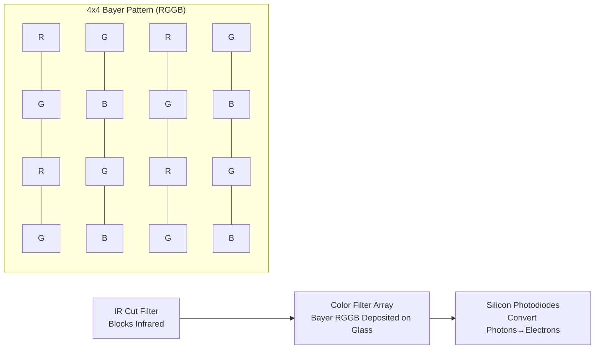
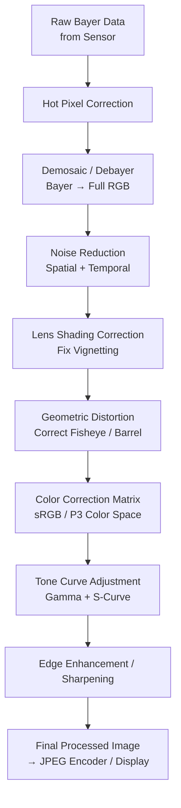
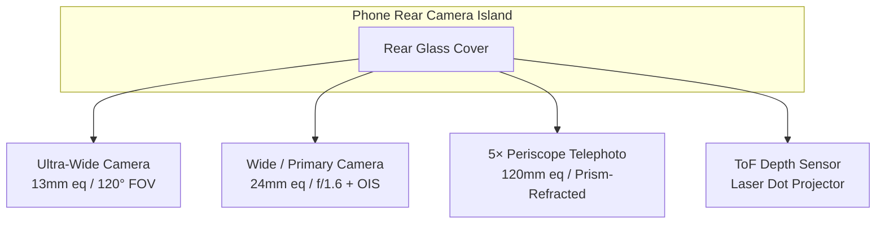
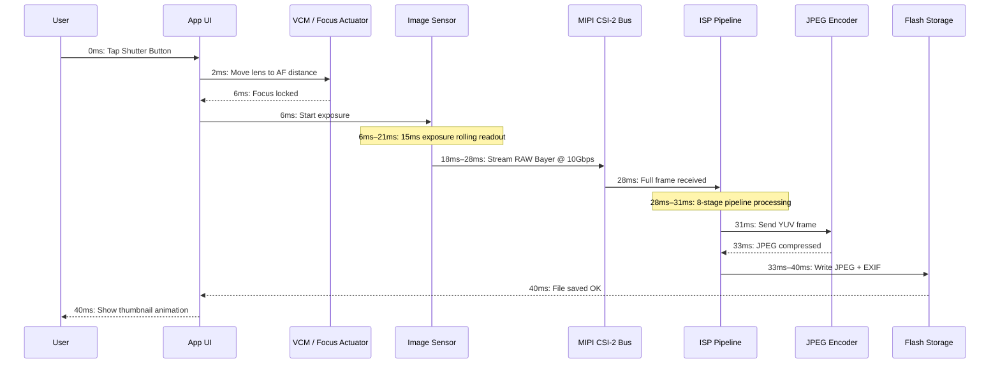

---
sidebar_position: 2
title: "Chapter 2: Understanding Smartphone Cameras"
description: "Explore the camera module hardware inside every smartphone: the lens, image sensor, ISP processor, the difference between RAW and JPEG, multi-camera designs, and the complete journey from photons to a stored photo."
keywords: [smartphone camera, camera module, camera lens, image sensor, ISP, RAW vs JPEG, multi-camera]
---

# Chapter 2: Understanding Smartphone Cameras

Before writing a single line of Camera2 API code, you must understand the physical hardware that your code will be commanding. A smartphone camera is not just "a lens pointed at a sensor." It is a tightly integrated, sealed, precision-engineered assembly containing optics, actuators, filters, semiconductors, and high-speed data buses. This chapter explains every component from the glass that first catches light to the flash memory chip where your final photo is stored.

The goal of this chapter is to build a mental model of the camera pipeline as a physical system. When later chapters ask you to configure a capture request with `CONTROL_AE_TARGET_FPS_RANGE` or `SENSOR_SENSITIVITY`, you will understand exactly which piece of hardware those parameters affect and why the values matter.

## The Camera Module: A Sealed Optical Assembly

When you look at the back of a modern flagship phone — imagine a Pixel 10 or Galaxy S26 Ultra — you see a raised rectangular island protruding 2 to 4 millimeters from the rear glass. That island is not a single camera. One rectangular island houses three separate circular modules: the largest at the bottom is the primary wide, a smaller one above it is the 3× periscope telephoto, and the medium-sized one to the left is the 0.5× ultra-wide. Each circular "bump" within that island is a complete, independent camera module.

A camera module is a hermetically sealed unit manufactured in a dust-free clean room. It contains, stacked in order from the outside world inward:

1. **Protective cover glass**: A scratch-resistant sapphire or Gorilla Glass window that seals the module and keeps dust out.
2. **Lens barrel**: A cylindrical stack of 4 to 6 individual glass (or sometimes plastic aspheric) lens elements, held in precise alignment by thin plastic spacers.
3. **Voice Coil Motor (VCM)**: An electromagnetic actuator that moves the entire lens barrel forward or backward along the optical axis by fractions of a millimeter to achieve autofocus. Some premium VCMs can also shift the lens perpendicular to the axis for optical image stabilization (OIS).
4. **Infrared (IR) cut filter**: A thin, coated glass wafer placed directly in front of the sensor. It blocks infrared light (which the silicon sensor is sensitive to but the human eye is not) so that recorded colors match what humans perceive.
5. **Sensor die**: The silicon CMOS image sensor chip itself, wire-bonded to a substrate. The active pixel array faces upward toward the lens.
6. **Flexible Printed Circuit (FPC)**: A thin, bendable ribbon cable that carries power, ground, control signals (I2C), and high-speed image data (MIPI CSI-2) from the module to the phone's mainboard.
7. **Board-to-board connector**: A tiny, high-density plug at the end of the FPC that snaps into a mating receptacle on the phone's main PCB.

The entire assembly — from cover glass to connector — is typically 5 to 8 millimeters thick for a conventional rear camera, and 10 to 14 millimeters long (inside the phone, oriented horizontally) for a periscope telephoto. The modules are calibrated individually at the factory: lens alignment, sensor tilt, color shading, and autofocus infinity position are all measured and stored in one-time-programmable (OTP) memory on the module itself. The Camera2 API reads this calibration data at device boot so your app does not have to account for unit-to-unit manufacturing variation.

## The Lens: Focal Length, Aperture, and Stabilization

The lens is the first component that light encounters. Its job is to bend incoming light rays so they converge into a sharp image exactly on the plane of the image sensor.

### Focal Length and Full-Frame Equivalence

Focal length determines the field of view (how much of the scene fits in the frame) and magnification (how large distant subjects appear). Smartphone camera specs always advertise **full-frame equivalent focal lengths**. This is a convention that normalizes across different sensor sizes so consumers can compare apples to apples. A full-frame sensor is the 36mm × 24mm size historically used in 35mm film SLR cameras.

Common full-frame equivalent focal lengths on smartphones:

- **10–18mm (Ultra-wide)**: 100° to 130° diagonal field of view. Used for landscapes, architecture, group selfies, and close-up macro shots.
- **22–28mm (Wide / Primary)**: The default "normal" camera on every phone. ~75° field of view, similar to human peripheral vision but flatter.
- **45–80mm (Telephoto, 2× to 3×)**: Narrow 30° to 50° field of view. Used for portraits (natural-looking face proportions, less perspective distortion) and general zoom.
- **100–240mm (Periscope telephoto, 5× to 10×)**: 10° to 25° field of view. The prism-bent periscope design allows long focal lengths without making the phone 2 centimeters thick.

Here is how light travels through a typical 5-element wide-angle lens assembly:

### Aperture

The aperture is the size of the opening through which light passes inside the lens. It is described as an **f-number** (or f-stop): the focal length divided by the diameter of the aperture. A **smaller f-number means a wider hole, which means more light** reaches the sensor.

- f/1.4 to f/1.8: Very wide aperture. Typical flagship primary cameras. Excellent in low light.
- f/2.0 to f/2.4: Moderate aperture. Typical ultra-wide and telephoto cameras on most phones.
- f/2.8 to f/4.0: Narrow aperture. Found on lower-cost front cameras and some periscope modules.

The aperture is usually fixed in smartphone cameras. A few 2020-era Samsung flagships featured a **variable aperture mechanism** with a dual-diaphragm that could mechanically switch between f/1.5 and f/2.4. This is extremely rare today because VCM-based focus and multi-frame computational HDR have made variable aperture unnecessary for most use cases.

### Optical Image Stabilization (OIS)

When you hold a phone, your hands naturally shake by tiny angular amounts — on the order of 0.1° to 0.5° at 1/30th of a second. Over a long enough exposure, this shake causes the entire image to blur. **Optical Image Stabilization (OIS)** solves this problem by physically moving either the lens barrel (lens-shift OIS) or the sensor die itself (sensor-shift OIS) to counteract the detected motion. A tiny gyroscope inside the camera module (or shared from the phone's main IMU) measures angular velocity 1,000 to 8,000 times per second, and the OIS actuator moves the optics accordingly. OIS can typically compensate for 3 to 5 stops of handshake, meaning an exposure that would have required 1/60s to stay sharp can now be shot at 1/8s or 1/4s with equal sharpness.

## The Image Sensor: Where Light Becomes Electricity

The image sensor is a silicon chip containing millions of individual light detectors called **photodiodes**, arranged in a precise rectangular grid. Every smartphone sensor today is a **CMOS (Complementary Metal-Oxide-Semiconductor)** type.

### Pixel Size and Megapixels

Each individual photodiode + readout circuit is called a **pixel**. The physical size of each pixel (measured in micrometers, μm) is arguably more important than the total megapixel count. A larger pixel captures more photons per unit time, which means less shot noise and better low-light performance.

Common pixel sizes in 2026 smartphones:

- **0.6μm to 0.8μm**: Very small pixels. Used in 108MP to 200MP high-resolution sensors. These rely entirely on pixel binning for acceptable noise.
- **1.0μm to 1.2μm**: Mid-size. Used in 48MP to 64MP sensors with default 4:1 binning to 12MP–16MP output.
- **2.0μm to 2.4μm**: Large "flagship" pixels. Used in dedicated 12MP–16MP sensors (Google Pixel, iPhone Pro) or as the binned output of 48MP sensors in "high quality" mode.

Pixel binning is the technique of combining the charge from adjacent 2×2 (or 3×3, or 4×4) pixels into a single "super pixel" during readout. A 48MP sensor with 0.8μm individual pixels, when binned 4-to-1, behaves like a 12MP sensor with 1.6μm effective pixels — dramatically improving signal-to-noise ratio. The Camera2 API exposes both the full-resolution raw mode and the default binned mode as separate stream configurations.

The megapixel count math is straightforward: a 48MP sensor has an active array of approximately 8,000 × 6,000 photodiodes = 48,000,000 individual light sensors.

### Sensor Size Classifications

Sensor size follows a legacy inch-based notation dating back to 1950s Vidicon television tubes. The format is "1/X inch" where X is the divisor; smaller X means a larger sensor:

- 1/3.06" to 1/2.55": Small sensors, typical for front cameras and budget ultra-wides (~5MP to 13MP).
- 1/1.7" to 1/1.3": Large mobile sensors, flagships primary cameras (48MP, 50MP, 108MP).
- 1-inch (Type 1): Very large for a phone. Found in the Xiaomi 13 Ultra, Sharp Aquos R series, and Sony Xperia Pro-I. Approximately 13.2mm × 8.8mm active area — approaching the size of some Micro Four Thirds cameras.

A larger sensor, given equal megapixel count, always has larger individual pixels. That is why the "one-inch sensor" phones produce noticeably better low-light photos.

### The Bayer Color Filter Array (CFA)

A raw silicon photodiode is colorblind — it only measures total photon intensity, not wavelength. To record color, manufacturers deposit a tiny **color filter** on top of each individual pixel. The almost-universal pattern is the **Bayer RGGB filter array**: 50% green pixels, 25% red, and 25% blue, arranged in a repeating 2×2 tile. The human eye is more sensitive to green light, so doubling the green sampling improves perceived luminance resolution and noise performance.

After readout, the sensor data is a mosaic of separate red, green, and blue values — not a full-color image yet. The step that fills in the missing color information for each pixel is called **demosaicing** (or debayering) and it is the first major computational step performed in the ISP.

### Rolling Shutter vs Global Shutter

Nearly every smartphone image sensor uses a **rolling shutter**. The sensor does not expose or read all pixels at once. Instead, it exposes and reads the pixel array row by row, from top to bottom, one horizontal line at a time. A typical 48MP sensor rolling readout takes approximately 15 to 25 milliseconds for a full-frame capture.

Rolling shutter produces characteristic distortions on very fast-moving subjects: a spinning airplane propeller or a ceiling fan appears bent or wavy; the top and bottom of a vertically-panned building lean in opposite directions (the "jello effect" in video). Global shutter sensors, by contrast, expose every pixel simultaneously and read them all at once after the exposure ends. Global shutter is used in machine vision, action cameras, and some specialized front-facing IR face-unlock sensors, but the global shutter pixel design has lower light sensitivity and higher cost, so it is not used in main smartphone cameras.

## The ISP: Image Signal Processor

The **ISP (Image Signal Processor)** is a dedicated hardware block (either a separate chip or, more commonly today, an integrated part of the main SoC alongside the CPU and GPU) whose sole job is to transform the raw, mosaic'd, noisy, distorted data streaming off the sensor into a visually pleasing color image.

The ISP runs a fixed, hardwired pipeline of image processing stages at extremely high throughput. A modern 48MP sensor running at 30 frames per second sends 1.44 billion pixels per second to the ISP. The ISP must process every single pixel through all stages in under 33 milliseconds per frame to keep up.

The canonical ISP pipeline stages, in order, are:

1. **Hot Pixel Correction**: Factory-calibrated "stuck" pixels (always bright or always dark) are replaced with interpolated values from neighbors.
2. **Demosaic / Debayer**: The Bayer RGGB mosaic is converted into a full RGB image by estimating the missing two color channels at each pixel location from surrounding pixels using edge-aware interpolation algorithms.
3. **Noise Reduction (Temporal + Spatial)**: Random shot noise and sensor read noise are suppressed. Spatial NR blurs flat regions while preserving edges. Temporal NR merges information from previous video frames (if available) for even cleaner results.
4. **Lens Shading Correction (Vignetting Correction)**: The corners of the image are naturally darker because light must pass through the lens at a steeper angle. The ISP applies a per-pixel digital gain ramp, brighter at the corners, to flatten the illumination. Calibration data for this ramp is stored in the module's OTP.
5. **Geometric Distortion Correction**: Ultra-wide and fisheye lenses produce barrel distortion (straight lines bow outward). The ISP remaps pixel coordinates using a stored polynomial lens model to produce a rectilinear image where straight lines actually appear straight. This step inherently crops 5–10% of the outer pixel ring.
6. **Color Correction Matrix (CCM)**: The raw sensor RGB spectral response does not match the human eye's trichromatic response. A 3×3 matrix multiplication converts sensor-native RGB into standard sRGB or DCI-P3 color space. The CCM coefficients are tuned per-module per-illuminant (daylight, tungsten, fluorescent).
7. **Tone Curve Adjustment**: A non-linear S-shaped tone mapping curve is applied to the linear RGB data to compress the high-dynamic-range sensor signal into the low-dynamic-range output (typically 8-bit sRGB gamma-encoded). This step is what makes the image "pop" — contrast increases in the midtones, highlights are rolled off, shadows are lifted.
8. **Edge Enhancement / Sharpening**: A subtle unsharp mask is applied to recover high-frequency detail softened by the noise reduction and optical low-pass filter. The sharpening amount is carefully controlled to avoid introducing halos.

The ISP's processing quality is a major differentiator between phone manufacturers. Google, Samsung, Apple, and Xiaomi each tune their ISP pipelines with different artistic priorities: some favor natural colors, some oversaturated "punchy" output, some aggressive noise reduction vs retained detail. The Camera2 API gives you some control over individual ISP stage strengths (via the Android tonemap and color correction controls), but most of the detailed stage parameters are locked behind vendor proprietary APIs.

## RAW vs JPEG: Two Paths from Sensor to Storage

The ISP pipeline above produces a processed image. But the Camera2 API also allows you to bypass the ISP entirely and read the raw sensor data directly. This is the critical distinction between RAW and JPEG output.

### RAW Format

A **RAW file** (on Android this means a DNG file, Digital Negative) contains exactly what the sensor measured before any ISP processing runs. It is a 10-bit, 12-bit, or 14-bit per pixel Bayer mosaic — still in the original RGGB pattern, still with vignetting, still with noise, still linear. The RAW file also contains metadata tags specifying the exact color filter array pattern, the sensor's color profile, black level, white level, and the lens model.

- **Bit depth**: RAW10 = 10 bits per channel = 1,024 levels. RAW12 = 4,096 levels. RAW14 = 16,384 levels. Compare this to JPEG's 8 bits = 256 levels.
- **File size**: 20–40 MB per 48MP photo. Uncompressed or near-lossless compressed.
- **Use case**: Professional post-production editing. The extra stops of headroom allow an editor to "rescue" overexposed highlights (by 2 to 3 stops of EV) or lift underexposed shadows without banding.

### JPEG Format

A **JPEG file** is the fully-cooked output of the ISP. Every single one of the 8 ISP stages above has already been applied to the pixel data. Then the image is converted from RGB to YCbCr 4:2:0 chroma-subsampled color space and compressed with a lossy Discrete Cosine Transform algorithm at roughly a 10:1 to 20:1 compression ratio.

- **Bit depth**: Always 8 bits per channel = 256 levels per color.
- **File size**: 2–5 MB for a 12MP–48MP photo, depending on JPEG quality level.
- **Use case**: Instant sharing, social media, any workflow where the photo is "done" as shot. Adjustments in a mobile editor degrade the image quickly because only 256 levels remain.

### Comparison Table: RAW vs JPEG

| Feature | RAW (DNG) | JPEG |
|---------|-----------|------|
| ISP Processing Applied | None — all stages skipped | All 8 stages applied and irreversible |
| Color Depth | 10–14 bit (1,024–16,384 levels) | 8 bit (256 levels) |
| White Balance | Tagged in metadata, fully changeable in post | Baked into pixels — minor edits only |
| Exposure Latitude | ±2 to 3 stops recoverable | ±1/2 stop at best before banding |
| File Size (48MP) | 25–40 MB | 3–6 MB |
| Color Space | Sensor-native linear RGB | sRGB or Display P3 gamma-encoded |
| Sharpening / Noise Reduction | None — editor's choice | Applied; can't be undone |
| Typical Workflow | Adobe Lightroom / Capture One workflow | Direct share to Instagram / Messages |

## Multi-Camera Phones: Why Not One Giant Zoom Lens?

A traditional point-and-shoot camera uses a single zoom lens with moving internal groups that continuously change focal length from wide to telephoto. Why can't a smartphone do the same? Physics. A 10× zoom lens that covers 24mm–240mm full-frame equivalent with a constant f/2.8 aperture requires an optical path roughly 5 centimeters (2 inches) long. A smartphone is, at most, 0.9 centimeters thick. The math simply does not fit.

The smartphone industry solved this not with a zoom lens, but with **multiple fixed-focal-length cameras**, each optimized for a different purpose, and a "smooth zoom" computational system that fades from one camera to the next at specific zoom ratios.

A typical 2026 flagship rear camera island contains:

1. **Ultra-Wide (0.5× zoom, ~13mm eq, ~120° FOV)**: Short focal length, large depth of field. Ideal for landscapes, architecture, group shots, and close-focus macro when repositioned via software.
2. **Wide / Primary (1× zoom, ~24mm eq, ~75° FOV)**: The default. The largest sensor, the widest aperture, the best OIS. Used for 80% of everyday photos.
3. **Telephoto / Periscope (3× to 10× optical, ~72mm to ~240mm eq)**: A conventional telephoto lens (3×) sits directly above its sensor. A periscope telephoto (5×, 10×) uses a 45° prism near the phone's edge to reflect light 90°, so the lens barrel runs horizontally inside the phone's body rather than vertically through its thickness.
4. **ToF / Depth Sensor**: A near-infrared laser dot projector (or, on iPhones, a structured-light LiDAR scanner) that pulses 30,000+ IR dots onto the scene and measures their round-trip time to produce a per-pixel depth map. Used for accurate portrait bokeh, augmented reality occlusion, and fast autofocus in low light.

When you perform a pinch-zoom gesture in the camera app, the HAL (Hardware Abstraction Layer) smoothly switches the active physical camera at pre-determined thresholds. For example, zooming from 0.5× to 1.0× fades from the ultra-wide to the wide. At 2.9× the app is still digitally cropping the wide camera. At 3.0×, the HAL switches the active source to the periscope telephoto camera. Between those zoom ratios, a sophisticated image-fusing algorithm uses both cameras simultaneously to maintain a seamless transition.

## The Full Journey: From Photon to Saved Photo, Millisecond by Millisecond

Here is the complete, numbered timeline of what physically happens inside a smartphone during a single still photo capture, starting from the moment the user's finger lifts off the virtual shutter button. The numbers are representative of a 2026 flagship capturing a 12MP default-mode JPEG in daylight:

- **0 ms**: User taps shutter. The Camera2 API framework receives the `CaptureRequest` with `TEMPLATE_STILL_CAPTURE`.
- **0–2 ms**: The 3A algorithm (Auto-Focus, Auto-Exposure, Auto-White-Balance) converges to its final values.
- **2–6 ms**: The voice coil motor (VCM) energizes its coil, physically moving the lens barrel by 0.2mm to the exact focus distance the AF algorithm calculated.
- **6–21 ms (15 ms exposure)**: The global reset releases the sensor pixels' charge. For 15 milliseconds, photodiodes accumulate photon-generated electrons. The rolling shutter reads out row-by-row during and after this window.
- **18–28 ms**: The sensor outputs the raw Bayer data over the MIPI CSI-2 high-speed serial bus. A typical configuration is 4 data lanes at 2.5 Gbps per lane = 10 Gbps total bandwidth, which comfortably handles a 12MP frame's raw bit depth plus blanking intervals.
- **28–31 ms**: The ISP's 8-stage pipeline processes the frame through hotpixel correction, demosaic, noise reduction, lens shading, geometric correction, color matrix, tone curve, and sharpening. This happens entirely in hardware — no CPU involvement at the pixel level.
- **31–33 ms**: The processed YUV image is sent to the hardware JPEG encoder, which applies lossy DCT compression at quality level 90–95 and writes the JFIF file headers (EXIF, thumbnail, GPS coordinates if tagged).
- **33–40 ms**: The completed JPEG blob is written via the MediaStore content provider into the app's files directory, for example `/data/data/com.yourpackagename/files/DCIM/Camera/IMG_20260806_151042.jpg`. The MediaScanner is notified, and the photo appears in the system gallery.

The entire process takes approximately 40 milliseconds end-to-end for a daylight still photo. In low light the exposure time itself lengthens (potentially to several seconds for Night Mode multi-frame capture), and the timeline scales proportionally.

## Summary

You now have a complete physical picture of the smartphone camera system. You know that each rear camera bump is a sealed module containing a lens barrel with multiple elements, a VCM autofocus actuator, an IR-cut filter, a CMOS sensor with a Bayer RGGB color filter array, and a flex cable carrying MIPI CSI-2 data. You understand focal length equivalence, aperture, and OIS. You know how the ISP's 8-stage pipeline transforms a raw Bayer mosaic into a finished JPEG, and you can distinguish RAW (sensor-native, 10–14 bit, post-processing headroom) from JPEG (ISP-processed, 8-bit, share-ready). You understand why modern phones use 3+ fixed cameras instead of a zoom lens, and you have walked through the exact millisecond-by-millisecond timeline of a single photo capture.

## What's Next

In Chapter 3, we move from the physical hardware to what that hardware is capable of producing. We will explore the real-world features of modern smartphone photography: HDR multi-frame bracketing, portrait bokeh via stereo / ToF / ML, Night Sight multi-frame long exposures, slow-motion high-speed video capture, ultra-wide distortion correction, and periscope telephoto. You will learn how computational photography — the fusion of optics, sensors, multi-frame signal processing, and on-device machine learning — creates imagery that no single lens/sensor combination could ever produce on its own.
