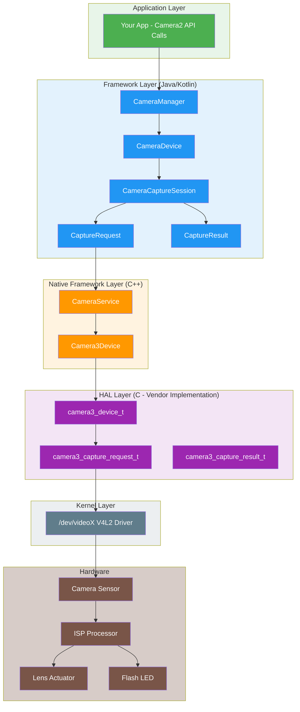
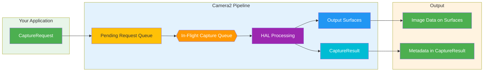
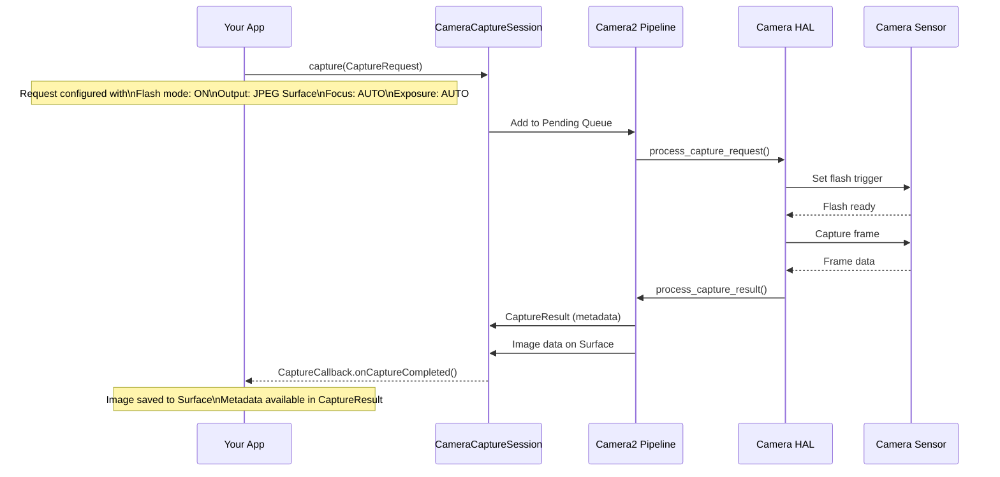
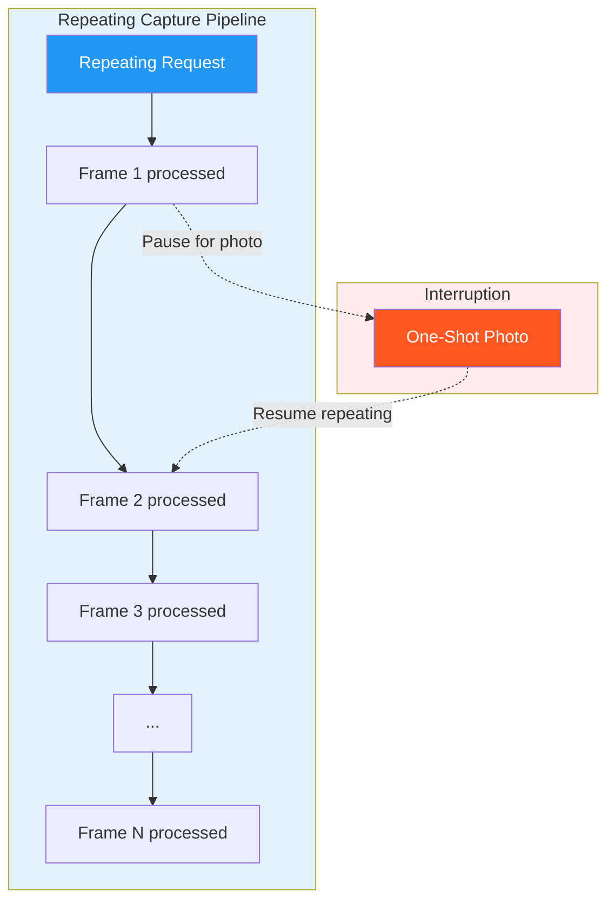
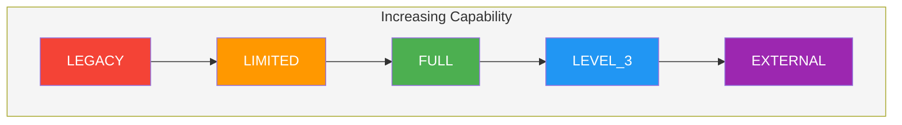
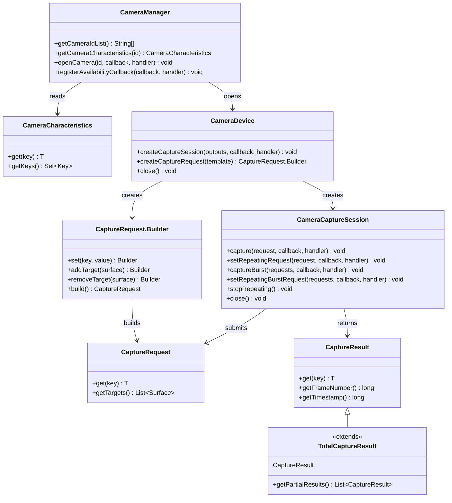
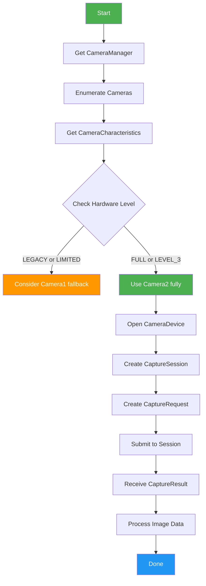
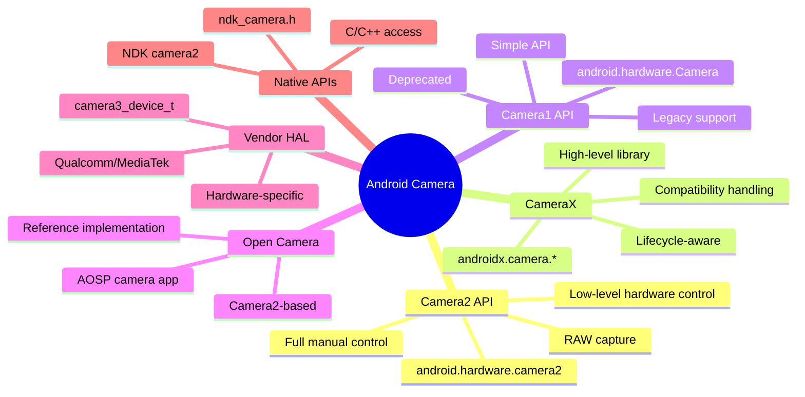

# Chapter 1: Welcome to Android Camera2

> **Chapter Overview:** In this chapter, we will explore the world of Android Camera2 from the ground up. You will understand not just *what* Camera2 is, but *why* it was created, *how* it works, and *where* it sits in the Android camera ecosystem. We will cover the Pipeline model, Capture types, Hardware Level classification, and the full architecture from App to HAL.

---

## 1.1 Why Learn Camera2?

Almost every smartphone today has a powerful camera system. A modern phone can:

- Capture professional-looking photos with computational photography
- Record 4K and 8K videos at high frame rates
- Create portrait effects with depth sensing
- Shoot in extreme low light with night mode
- Capture slow-motion videos at 960 fps
- Generate 3D depth information for AR applications
- Combine multiple cameras together seamlessly

But when you open the default camera app, you only see a simple interface: a shutter button, a zoom control, and a few shooting modes.

Behind this simple interface is a surprisingly complex system. The camera app communicates with hardware components, image processors, and Android frameworks to produce every single frame.

### Who Should Learn Camera2?

As Android developers, we may want to build applications that go beyond the default camera app:

- A **manual photography application** with full control over exposure, ISO, and focus
- A **camera testing tool** for technicians to verify device capabilities
- A **computer vision application** that needs raw frame access
- A **3D scanning application** using depth sensors
- A **professional video recorder** with codec selection and bitrate control
- A **camera capability analyzer** like our very own [Android Camera Parameters](https://github.com/zoozooll/AndroidCameraParameters)

If any of these scenarios sound familiar, Camera2 is the API you need to master.

---

## 1.2 What Is Android Camera2?

**Android Camera2** is the modern camera framework introduced by Google in **Android 5.0 (API level 21)**. It replaced the original `android.hardware.Camera` API (now retroactively called **Camera1**).

### The Problem Camera2 Solved

The old Camera API (Camera1) was designed for a simpler world: one camera, basic photo capture, and simple video recording. But smartphone cameras evolved dramatically:

| Era | Typical Device | Camera API |
|-----|---------------|------------|
| 2010-2014 | Single camera, basic sensor | Camera1 |
| 2015-2018 | Dual cameras, OIS, HDR | Camera2 (limited use) |
| 2019-2022 | Triple cameras, depth, telephoto | Camera2 (standard) |
| 2023+ | Quad cameras, periscope, LiDAR, UWB | Camera2 (essential) |

Modern devices may contain multiple rear cameras (wide, ultra-wide, telephoto, periscope), depth sensors, and even external USB cameras. They support advanced features like:

- Manual exposure and focus
- RAW image capture
- High-speed video recording
- HDR processing
- Optical stabilization (OIS)
- Multi-camera fusion

Camera2 was created to give developers **deep, precise, and granular control** over camera hardware.

---

## 1.3 Camera2 vs Camera1 vs CameraX

Before diving deep into Camera2, let's clarify the relationship between the three major camera APIs.

### Camera1 (`android.hardware.Camera`)

- **Introduced:** Android 1.0 (deprecated in Android 5.0)
- **Model:** Procedural, stateful, single-camera oriented
- **Strengths:** Simple, well-understood, widely compatible
- **Weaknesses:** Limited control, no RAW support, no multi-camera, no burst mode

### Camera2 (`android.hardware.camera2`)

- **Introduced:** Android 5.0 (API 21)
- **Model:** Object-oriented, stateless, request/response pipeline
- **Strengths:** Deep hardware control, RAW support, multi-camera, high-speed video
- **Weaknesses:** Complex, verbose, requires understanding of camera internals

### CameraX (`androidx.camera.*`)

- **Introduced:** Android 10 (pre-release), stable in Android 11+
- **Model:** Declarative, lifecycle-aware, use-case driven
- **Strengths:** Easy to use, automatic compatibility, lifecycle management
- **Weaknesses:** Limited advanced control, may not expose all hardware features

### Comparison Table

| Dimension | Camera1 | Camera2 | CameraX |
|-----------|---------|---------|---------|
| **Level** | Low-level (deprecated) | Low-level (current) | High-level (Jetpack) |
| **Difficulty** | Easy | Hard | Easy |
| **Control** | Minimal | Maximum | Moderate |
| **RAW Support** | No | Yes | Limited |
| **Multi-Camera** | No | Yes | Limited |
| **Burst Mode** | No | Yes | No |
| **Manual Controls** | Limited | Full | Limited |
| **Best For** | Legacy apps | Advanced camera apps | Most camera apps |
| **Status** | Deprecated | Active | Recommended |

### Why This Series Focuses on Camera2

While CameraX is recommended for most applications, understanding Camera2 is essential because:

1. **CameraX is built on Camera2** — CameraX uses Camera2 under the hood. Understanding Camera2 helps you understand what CameraX is doing.
2. **Some features are only available in Camera2** — RAW capture, manual sensor control, and advanced multi-camera scenarios require Camera2.
3. **Debugging requires Camera2 knowledge** — When a CameraX app doesn't work as expected, you often need to understand the underlying Camera2 behavior to diagnose issues.
4. **Camera2 understanding is fundamental** — Even if you use CameraX for your app, understanding Camera2 makes you a better Android camera developer.

---

## 1.4 Camera2 Architecture: The Big Picture

Camera2 sits in the middle of the Android camera stack, bridging application code with hardware drivers. Understanding this architecture is crucial for debugging and optimization.

### Layered Architecture



### Architecture Layer Explanation

| Layer | Location | Language | Responsibility |
|-------|----------|----------|----------------|
| **Application** | Your app code | Kotlin/Java | Create CaptureRequests, handle CaptureResults |
| **Framework (Java)** | `android.hardware.camera2.*` | Java | Public API, manages sessions, converts data |
| **Native Framework** | `frameworks/av/` | C++ | Binder IPC, CameraService, Camera3Device |
| **HAL** | `hardware/libhardware/` + vendor | C | Hardware abstraction, vendor-specific implementation |
| **Kernel** | `/dev/videoX` | C | V4L2 driver, hardware communication |
| **Hardware** | Physical camera module | — | Sensor, ISP, lens, flash |

### Key Design Principle: Camera2 is a Pipeline

The most important concept to understand about Camera2 is that it models camera operations as a **pipeline**. Every action — preview, photo capture, video recording — is expressed as a **Capture Request** that flows through the pipeline and produces a **Capture Result**.

---

## 1.5 The Camera2 Pipeline Model

The Pipeline is the heart of Camera2's design. It replaces the stateful, one-at-a-time model of Camera1 with a stateless, request/response model.

### How the Pipeline Works



### Pipeline Components Explained

| Component | Description |
|-----------|-------------|
| **CaptureRequest** | A configuration object that describes *one frame* of capture. Contains all parameters: exposure time, focus mode, flash, output surfaces, etc. |
| **Pending Request Queue** | A FIFO queue where new CaptureRequests wait to be processed |
| **In-Flight Capture Queue** | Requests currently being processed by the HAL. Usually limited to 1-4 requests depending on device |
| **HAL Processing** | The hardware abstraction layer processes the request: controls sensor, ISP, lens, etc. |
| **Output Surfaces** | Images are written to configured Surfaces (preview Surface, ImageReader Surface, etc.) |
| **CaptureResult** | Metadata about the capture: actual exposure time, AF state, timestamp, etc. Does NOT contain image data |

### Key Pipeline Properties

1. **Requests are stateless** — Each CaptureRequest contains all necessary information. The pipeline has no memory of previous requests.
2. **Processing is sequential** — Requests are processed in FIFO order by the HAL.
3. **Results are asynchronous** — CaptureResults arrive via callbacks, not returned synchronously.
4. **Multiple outputs per request** — One CaptureRequest can write to multiple Surfaces (e.g., preview + photo simultaneously).
5. **Pipeline can be configured** — You can choose templates (preview, still capture, record) or fully manual mode.

### Concrete Example: Taking a Photo with Flash

To understand the Pipeline, let's trace through what happens when you take a photo with flash:



---

## 1.6 Capture Types: One-Shot, Burst, and Repeating

Camera2 defines three fundamental Capture types, each serving different use cases. Understanding these is crucial for designing camera applications correctly.

### Type 1: One-Shot Capture

**One-Shot** captures execute exactly once. They are ideal for single actions like taking a photo or applying a one-time settings change.


**Use Cases:**
- Taking a single photo
- Applying a temporary flash
- Capturing a frame for analysis
- Triggering auto-focus once

**API Call:**
```kotlin
cameraCaptureSession.capture(captureRequest, callback, handler)
```

### Type 2: Burst Capture

**Burst** captures execute multiple times consecutively without interruption. Once started, no other requests can be inserted until the burst completes.


**Key Characteristics:**
- All frames in a burst have identical or incrementally different settings
- No other requests can be processed during a burst
- The burst queue is separate from the pending request queue
- Higher priority than repeating requests

**Use Cases:**
- Continuous photo capture (burst mode)
- Bracketing (capturing same scene at different exposures)
- Motion analysis (capturing fast-moving subjects)
- Sequential multi-frame capture for compositing

**API Call:**
```kotlin
cameraCaptureSession.captureBurst(burstRequests, callback, handler)
```

### Type 3: Repeating Capture

**Repeating** captures execute continuously, forming the basis of live preview and video recording. When a repeating request is active, it occupies the pipeline between other captures.



**Key Characteristics:**
- Only one repeating request can be active at a time (replaces previous)
- Interrupted by one-shot and burst requests, then automatically resumes
- Forms the basis of preview and video recording
- Does not produce individual CaptureResults for every frame (uses partial results for efficiency)

**Use Cases:**
- Live camera preview
- Video recording
- Continuous focus monitoring
- Real-time frame analysis

**API Call:**
```kotlin
cameraCaptureSession.setRepeatingRequest(captureRequest, callback, handler)
// or for video:
cameraCaptureSession.setRepeatingBurstRequest(burstRequests, callback, handler)
```

### Capture Type Comparison

| Feature | One-Shot | Burst | Repeating |
|---------|----------|-------|-----------|
| **Execution** | Once | Multiple (contiguous) | Continuous |
| **Priority** | High | Highest | Lowest |
| **Interruption** | Cannot be interrupted | Cannot be interrupted | Can be interrupted |
| **Queue** | Pending Queue | Separate Burst Queue | Pipeline occupation |
| **Typical Use** | Photo, single frame | Burst mode, bracketing | Preview, video |
| **Result Callback** | One result per call | One result per frame | Results periodically |

### The Capture Template System

Camera2 provides predefined templates for common capture scenarios:

| Template | Description | Use Case |
|----------|-------------|----------|
| `TEMPLATE_PREVIEW` | Optimized for live preview | Camera preview |
| `TEMPLATE_STILL_CAPTURE` | Optimized for photo capture | Taking photos |
| `TEMPLATE_RECORD` | Optimized for video recording | Video capture |
| `TEMPLATE_VIDEO_SNAPSHOT` | Photo during video recording | Snapshot while recording |
| `TEMPLATE_ZERO_SHUTTER_LAG` | High quality, minimal delay | Burst photography |
| `TEMPLATE_MANUAL` | All auto controls disabled | Full manual control |

Templates are shortcuts that pre-configure common parameters. You can then modify individual settings from the template.

---

## 1.7 Supported Hardware Levels

Not all Android devices support the full Camera2 feature set. To address this, Google defined **Supported Hardware Levels** — a classification system that tells developers what to expect from a device's camera implementation.

### Hardware Level Classification



### Level Descriptions

| Level | Description | Camera2 Support |
|-------|-------------|----------------|
| **LEGACY** | Backward-compatible with Camera1. Camera2 calls are converted to Camera1 under the hood. | Only basic Camera1 features |
| **LIMITED** | Some Camera2 features supported. Full Camera2 pipeline not guaranteed. | Partial Camera2 features |
| **FULL** | Complete Camera2 feature set. Full pipeline, manual controls, multi-camera. | All Camera2 features |
| **LEVEL_3** | Everything in FULL, plus YUV reprocessing and additional output streams. | FULL + advanced features |
| **EXTERNAL** | Similar to LIMITED but for external cameras (USB, etc.). | External camera support |

### How to Check Hardware Level

You can query the hardware level using `CameraCharacteristics`:

```kotlin
val cameraManager = getSystemService(Context.CAMERA_SERVICE) as CameraManager
val cameraId = cameraManager.cameraIdList[0]
val characteristics = cameraManager.getCameraCharacteristics(cameraId)

val hardwareLevel = characteristics.get(CameraCharacteristics.INFO_SUPPORTED_HARDWARE_LEVEL)
val levelName = when (hardwareLevel) {
    CameraCharacteristics.INFO_SUPPORTED_HARDWARE_LEVEL_LEGACY -> "LEGACY"
    CameraCharacteristics.INFO_SUPPORTED_HARDWARE_LEVEL_LIMITED -> "LIMITED"
    CameraCharacteristics.INFO_SUPPORTED_HARDWARE_LEVEL_FULL -> "FULL"
    CameraCharacteristics.INFO_SUPPORTED_HARDWARE_LEVEL_3 -> "LEVEL_3"
    CameraCharacteristics.INFO_SUPPORTED_HARDWARE_LEVEL_EXTERNAL -> "EXTERNAL"
    else -> "UNKNOWN"
}
Log.d("Camera", "Hardware Level: $levelName")
```

### Practical Implications

| Level | What It Means for Your App |
|-------|---------------------------|
| **LEGACY** | Camera2 may work but with limitations. Consider Camera1 as fallback. |
| **LIMITED** | Basic Camera2 features work. Some advanced features may be missing. |
| **FULL** | Complete Camera2 support. Safe to use all Camera2 features. |
| **LEVEL_3** | Can use YUV reprocessing and advanced multi-stream features. |
| **EXTERNAL** | Can support USB cameras and other external inputs. |

### Runtime Capability Querying

Beyond hardware level, always check specific capabilities at runtime:

```kotlin
val capabilities = characteristics.get(CameraCharacteristics.REQUEST_AVAILABLE_CAPABILITIES)
capabilities?.forEach { capability ->
    when (capability) {
        CameraMetadata.REQUEST_AVAILABLE_CAPABILITIES_BACKWARD_COMPATIBLE ->
            Log.d("Camera", "Supports backward compatible mode")
        CameraMetadata.REQUEST_AVAILABLE_CAPABILITIES_MANUAL_SENSOR ->
            Log.d("Camera", "Supports manual sensor control")
        CameraMetadata.REQUEST_AVAILABLE_CAPABILITIES_MANUAL_POST_PROCESSING ->
            Log.d("Camera", "Supports manual post-processing")
        CameraMetadata.REQUEST_AVAILABLE_CAPABILITIES_RAW ->
            Log.d("Camera", "Supports RAW capture")
        CameraMetadata.REQUEST_AVAILABLE_CAPABILITIES_PRIVATE_REPROCESSING ->
            Log.d("Camera", "Supports private reprocessing")
        CameraMetadata.REQUEST_AVAILABLE_CAPABILITIES_DEEP_OUTPUT ->
            Log.d("Camera", "Supports deep output")
    }
}
```

---

## 1.8 Camera2 Core Classes Overview

Camera2's API is built around a small set of core classes. Let's meet them before diving deep into each one.

### Core Class Relationship Diagram



### Class Responsibilities

| Class | Package | Responsibility |
|-------|---------|----------------|
| `CameraManager` | `android.hardware.camera2` | Top-level system service. Enumerates cameras, provides access to CameraDevice. |
| `CameraCharacteristics` | `android.hardware.camera2` | Read-only camera capabilities metadata. |
| `CameraDevice` | `android.hardware.camera2` | Represents a connected camera. Creates sessions and capture request builders. |
| `CameraCaptureSession` | `android.hardware.camera2` | The pipeline instance. Submits CaptureRequests, manages repeating captures. |
| `CaptureRequest` | `android.hardware.camera2` | Immutable capture configuration. All parameters for one frame. |
| `CaptureRequest.Builder` | `android.hardware.camera2` | Builder for creating CaptureRequest objects. |
| `CaptureResult` | `android.hardware.camera2` | Metadata output from a completed capture. |
| `TotalCaptureResult` | `android.hardware.camera2` | Complete capture result including all partial results. |

### The Camera2 Workflow



---

## 1.9 Camera2 vs Camera1: Detailed Comparison

If you have worked with Camera1 before, you will appreciate the differences. If you haven't, this section will help you understand why Camera2 is a fundamental redesign.

### Architecture Comparison

| Aspect | Camera1 | Camera2 |
|--------|---------|---------|
| **Programming Model** | Procedural (imperative) | Object-oriented (declarative) |
| **State Management** | Stateful (camera maintains state) | Stateless (each request is self-contained) |
| **Capture Model** | Commands (takePicture(), startPreview()) | Pipeline (CaptureRequest → CaptureResult) |
| **Threading** | Mostly single-threaded | Designed for multi-threaded use |
| **Error Handling** | Exceptions, hard to recover | Error codes + exceptions, more granular |
| **Metadata** | Read-only after capture | Available in real-time during capture |
| **Multiple Outputs** | Not supported | One request → multiple surfaces |
| **Zero-Copy** | Not supported | Supported via ImageReader |

### API Comparison Side-by-Side

#### Opening a Camera

```kotlin
// Camera1 (old API)
val camera = Camera.open()
camera.setPreviewDisplay(surfaceHolder)
camera.startPreview()

// Camera2 (new API)
val cameraManager = getSystemService(Context.CAMERA_SERVICE) as CameraManager
cameraManager.openCamera(cameraId, object : CameraDevice.StateCallback() {
    override fun onOpened(camera: CameraDevice) {
        mCameraDevice = camera
        // Create session and requests...
    }
    override fun onDisconnected(camera: CameraDevice) { camera.close() }
    override fun onError(camera: CameraDevice, error: Int) { camera.close() }
}, handler)
```

#### Taking a Photo

```kotlin
// Camera1 (old API)
camera.takePicture(null, null, object : Camera.PictureCallback() {
    override fun onPictureTaken(data: ByteArray, camera: Camera) {
        // Process image data
    }
})

// Camera2 (new API)
val requestBuilder = mCameraDevice.createCaptureRequest(CameraDevice.TEMPLATE_STILL_CAPTURE)
requestBuilder.addTarget(imageReader.surface)
val captureRequest = requestBuilder.build()
mCameraCaptureSession.capture(captureRequest, object : CameraCaptureSession.CaptureCallback() {
    override fun onCaptureCompleted(session: CameraCaptureSession, 
                                    request: CaptureRequest, 
                                    result: TotalCaptureResult) {
        // Metadata in result
        val exposureTime = result.get(CaptureResult.SENSOR_EXPOSURE_TIME)
    }
}, handler)
// Image data arrives via ImageReader.OnImageAvailableListener
```

#### Key Differences in Practice

| Operation | Camera1 | Camera2 |
|-----------|---------|---------|
| **Preview + Photo** | Must stop preview to take photo, then restart | Can take photo without stopping preview |
| **Multiple Photos** | Only one photo at a time | Burst mode with arbitrary count |
| **Manual Exposure** | Not available | Full control over exposure time and gain |
| **Manual Focus** | Only predefined modes | Full control over lens position |
| **RAW Capture** | Not available | Supported on FULL+ devices |
| **Real-time Metadata** | Not available | Available via partial CaptureResults |

### Migration Tips from Camera1

If you are migrating from Camera1 to Camera2, keep these tips in mind:

1. **Think in terms of CaptureRequests**, not commands. Every action — focus, flash, photo — is a CaptureRequest.
2. **Separate preview from capture**. In Camera1, you had to stop preview to capture. In Camera2, you submit a separate request while the repeating request continues.
3. **Use handlers for callbacks**. Camera2 callbacks run on a Handler's thread. Always provide one to avoid ANRs.
4. **Check hardware level first**. If a device is LEGACY, consider using Camera1 instead.
5. **Use CaptureRequest templates** for common operations. Modify from templates rather than building from scratch.
6. **Don't block the main thread**. All Camera2 operations should run on a background thread.

---

## 1.10 Camera2 in the Android Ecosystem

Camera2 doesn't exist in isolation. It's part of a larger ecosystem of camera-related APIs and libraries.

### Camera API Ecosystem



### When to Use Which API

| Requirement | Recommended API | Reason |
|-------------|----------------|--------|
| Simple photo app | CameraX | Easiest, most compatible |
| Video recording | CameraX | Built-in video support |
| Manual photography | Camera2 | Full control over all parameters |
| Computer vision | Camera2 | Direct frame access, minimal latency |
| Multi-camera fusion | Camera2 | Only API with full multi-camera support |
| RAW capture | Camera2 | Only API with RAW support |
| External camera | Camera2 | External camera support (EXTERNAL level) |
| Legacy device support | Camera1 | Compatibility with older devices |

---

## 1.11 Learning with Android Camera Parameters

Reading documentation is useful, but camera capabilities are easier to understand when you can see real data from a real phone. Throughout this series, we will use [Android Camera Parameters](https://github.com/zoozooll/AndroidCameraParameters) to explore actual camera information from your own device.

You can use the app to discover:

- Available cameras (ID, facing, hardware level)
- Supported resolutions and frame rates
- Sensor information (active array size, focal length)
- Manual control support (ISO range, exposure time range)
- RAW capability and formats
- Hardware level and supported capabilities
- Complete CameraCharacteristics dump

Instead of learning from abstract examples, you can directly investigate your own device and see how the concepts in this chapter apply to real hardware.

---

## 1.12 Key Takeaways

Congratulations on finishing Chapter 1! Here's what you should remember:

### Core Concepts

1. **Camera2 is a pipeline** — Every camera operation is a CaptureRequest that flows through the pipeline and produces a CaptureResult.
2. **Capture types** — One-shot (single), Burst (multiple contiguous), Repeating (continuous)
3. **Hardware Levels** — LEGACY → LIMITED → FULL → LEVEL_3 → EXTERNAL
4. **Architecture layers** — App → Framework → Native Framework → HAL → Kernel → Hardware

### Practical Principles

1. **Always check hardware level** — Not all devices support full Camera2 features
2. **Check capabilities at runtime** — Don't assume features are available
3. **Use templates for common operations** — `TEMPLATE_PREVIEW`, `TEMPLATE_STILL_CAPTURE`, etc.
4. **Run on background threads** — Camera2 operations must not block the main thread
5. **Separate preview from capture** — Use repeating request for preview, one-shot for photos

### What's Next

In the next chapter, **Understanding Smartphone Cameras**, we will leave Android for a moment and explore the camera hardware itself. You will learn about:

- Camera sensor technology (CMOS vs CCD)
- Lens design and focal length
- ISP (Image Signal Processor) processing pipeline
- Why two phones with similar megapixel counts can produce completely different photos
- The complete image pipeline from light to final photo

Once you understand the hardware, Camera2 concepts will become much more intuitive.

---

## 1.13 Summary

Android Camera2 is a powerful, low-level camera framework that gives developers unprecedented control over camera hardware. Its Pipeline-based architecture, three Capture types, and Hardware Level classification provide a robust foundation for building advanced camera applications.

In this chapter, we covered:
- ✅ Camera2 architecture and ecosystem position
- ✅ Pipeline model with request/result flow
- ✅ Capture types: one-shot, burst, repeating
- ✅ Hardware Level classification and runtime checking
- ✅ Core classes overview and relationships
- ✅ Camera1 vs Camera2 detailed comparison

Now let's dive into the camera hardware itself in Chapter 2! 🚀
