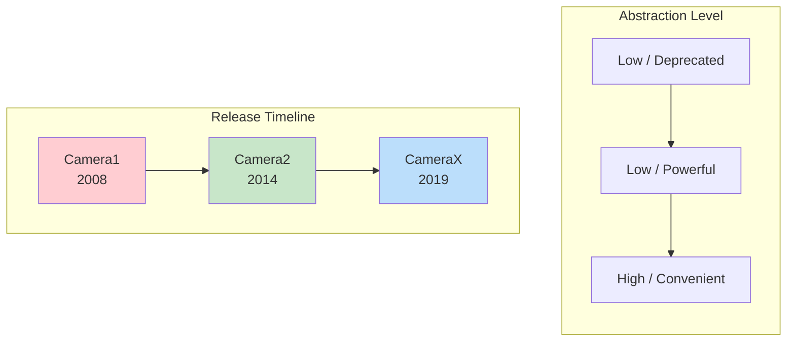
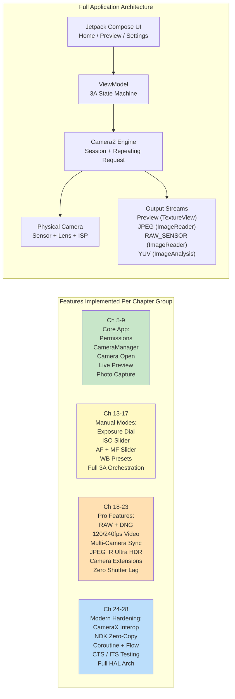

---
sidebar_position: 1
title: "Chapter 1: Welcome to Android Camera2"
description: Learn why Android Camera2 matters, how it compares to Camera1 and CameraX, what it enables, and what you'll build in this series.
keywords: [Android Camera2, Camera1 vs Camera2, CameraX, why learn Camera2, Android camera development]
tags: [Tutorial, Camera2, Basics, Android]
---

# Chapter 1: Welcome to Android Camera2

> **Chapter Overview:** In this opening chapter, we step back and look at the big picture. Why does Camera2 exist? What problems does it solve compared to the older Camera API and the newer CameraX library? Who should invest time in learning Camera2? And, most importantly, what will you actually build by the end of this series? No deep architecture, no HAL layers, and no pipeline diagrams yet — just clear answers to the questions every developer asks before diving in.

***

## 1.1 Why Camera2?

Take out your smartphone.

Look at the back. You probably see two, three, or even more camera lenses. That little rectangular bump houses more optical and silicon power than a professional DSLR from the mid-2000s.

Now open the default camera app.

Tap the shutter. Instantly, a high-resolution photo is stored in your gallery. The picture likely looks great — vibrant colors, sharp subjects, smooth background blur, and bright shadows even in indoor light.

But the camera app you're using only scratches the surface of what the hardware can do. Hidden beneath that friendly shutter button is an incredibly sophisticated imaging pipeline: one that can shoot RAW photos, record 240 fps slow-motion video, fuse 10 frames for a single night shot, or independently control every micron of lens movement.

Most third-party Android apps never access this power. Why? Because **the old Android camera API (retroactively called Camera1) was extremely limited**. Camera1 was designed for a world of single-camera phones with basic photo and video capture. It couldn't:

- Control exposure time or ISO manually
- Capture RAW sensor data
- Record slow-motion at high frame rates
- Use multiple cameras simultaneously
- Access per-frame metadata mid-capture
- Shoot burst photography reliably

Starting in **Android 5.0 (API level 21)**, Google introduced **Camera2 (android.hardware.camera2)** to tear down these walls. Camera2 is not an incremental update — it is a **full redesign**, built from scratch to expose the raw capabilities of modern camera silicon to every Android developer.

In short: **Camera2 exists because smartphone cameras became professional-grade, and the old API couldn't keep up.**

***

## 1.2 Camera1 vs Camera2 vs CameraX

Over a decade of Android camera development has produced **three generations** of camera APIs. Before you write a single line of code, it's essential to understand which API solves which problem.

### Three Generations, Three Philosophies

### Camera1 — `android.hardware.Camera`

The original camera API, introduced with Android 1.0 and **deprecated in Android 5.0**.

- **Model:** Procedural commands. You call methods like `startPreview()`, `takePicture()`, `setFlashMode()`.
- **Design philosophy:** "The camera is a state machine you command."
- **Best for:** Legacy apps targeting very old devices (pre-Lollipop). That's it.
- **Why avoid it:** Google no longer updates it. New hardware features (multi-camera, RAW, HDR) are never back-ported to Camera1. The API surface is tiny. On modern devices, Camera1 is actually **emulated by a Camera2 wrapper** internally, so you pay Camera2 complexity without Camera2 benefits.

### Camera2 — `android.hardware.camera2.*`

The modern low-level framework, introduced in Android 5.0 and continuously expanded through every Android version since.

- **Model:** A request/response pipeline. You build immutable `CaptureRequest` objects, submit them to a `CameraCaptureSession`, and receive `CaptureResult` metadata + image buffers asynchronously.
- **Design philosophy:** "The camera is a programmable pipeline. You control every parameter of every frame."
- **Best for:** Advanced camera apps, manual photography tools, computer vision pipelines, RAW capture, multi-camera research, high-speed video, and any use case where you need hardware-proximate control.
- **Why use it:** Full access to every capability the OEM HAL exposes. Direct frame control. The only API path for professional features. Camera2 is what CameraX calls internally.

### CameraX — `androidx.camera.*`

A **Jetpack library** (not a platform API) introduced in beta in 2019 and stabilized around Android 11.

- **Model:** Declarative use cases. You `bindToLifecycle()` a set of `Preview`, `ImageCapture`, `ImageAnalysis`, or `VideoCapture` use cases and the library does the rest.
- **Design philosophy:** "We've solved the 10,000 edge cases for you. Just tell us what output you need."
- **Best for:** Most applications that need a camera. QR/barcode scanners, photo uploads, document scanning, simple video recording — any scenario where convenience and reliability beat raw control.
- **Why use it:** Lifecycle-aware (no resource leaks), resolution selection is automatic, OEM quirks have built-in workarounds, the exact same code runs on thousands of device models with zero `if` statements.

### Side-by-Side Comparison

| Dimension | Camera1 | Camera2 | CameraX |
|:---|:---|:---|:---|
| **Introduced** | Android 1.0 (2008) | Android 5.0 (2014) | Android 10 (Jetpack) |
| **Status** | Deprecated | Active, maintained | Recommended (Jetpack) |
| **Abstraction** | Low (legacy) | Low | High |
| **Learning curve** | Easy | Very steep | Very gentle |
| **Manual exposure / ISO / focus** | Limited | Full control | Limited via Interop |
| **RAW capture** | No | Yes | With Interop workarounds |
| **Multi-camera (physical streams)** | No | Yes | No |
| **High-speed video (120+ fps)** | No | Yes | Limited |
| **Burst / bracketing** | No | Full control | No |
| **Per-frame metadata** | No | Yes, full + partial results | Exposed via Interop callbacks |
| **Lifecycle safety** | Manual, error-prone | Manual, error-prone | Automatic, lifecycle-bound |
| **OEM quirk handling** | None | None | Built-in (1000+ devices tested) |
| **Code volume for a working app** | Medium | Very high (verbose) | Very low |
| **Performance** | OK (indirect wrapper) | Maximum possible | Near-maximum (thin overhead) |

***

## 1.3 What Can Camera2 Do?

To concretely understand Camera2's power, imagine features you've seen on flagship phones. Camera2 makes **all of these programmatically accessible**:

### Professional-Grade Capture

- **Full Manual Exposure:** Dial in shutter speed from 1/8000 s to 30 s, and ISO from 50 to 102,400. Build a real Pro mode UI.
- **RAW Photography:** Extract 10-bit, 12-bit, 14-bit, or 16-bit **unprocessed Bayer data** directly from the sensor (no demosaic, no noise reduction, no color correction). Write Adobe DNG files using the bundled `DngCreator` for Lightroom editing.
- **Exposure Bracketing:** Shoot 3, 5, 7, or 9 frames at precisely stepped EV values. Feed them into an HDR fusion algorithm.
- **Timelapse Locking:** Freeze exposure, focus, and white balance across **thousands of frames** — no flicker as the sun moves or clouds pass.

### Computational Photography Hardware Access

- **High-Speed Video:** Configure `CameraConstrainedHighSpeedCaptureSession` for 120 fps, 240 fps, or even 960 fps capture. Build slow-motion editors.
- **Logical Multi-Camera:** Access **both** physical cameras under a logical multi-camera ID **simultaneously**. Grab synchronized YUV frames from a wide and a telephoto lens to compute depth maps on-device.
- **YUV / PRIVATE Reprocessing (LEVEL_3 devices):** Maintain a full-resolution **circular buffer in the ISP**, then on shutter tap, grab a frame from the past and re-run heavy noise reduction and sharpening. This is how OEMs implement **Zero Shutter Lag (ZSL)**.
- **Ultra HDR / JPEG_R (Android 14+):** Request and write `ImageFormat.JPEG_R` files that store an 8-bit SDR JPEG **plus** a secondary HDR gain map. Legacy viewers see a normal photo; HDR panels render 1,000+ nit highlights.
- **Camera Extensions (Android 12+):** Delegate Night, Bokeh (portrait), HDR, and Face Retouch modes **to the OEM HAL** — using the exact same multi-frame AI pipeline the stock camera uses.

### Advanced Video and Vision Pipelines

- **Multi-Stream Concurrent Output:** Drive a **preview** Surface, a **YUV analysis** Surface (for ML object detection running at 30 fps), and a **JPEG still** Surface from a single capture request — all without copying memory.
- **Flash Timing Precision:** Explicitly coordinate pre-flash metering, main-flash firing, and rolling-shutter readout on a per-frame basis.
- **Partial Capture Results:** Receive AE state and focus distance metadata **milliseconds before** the final image buffer is ready — enabling "tap anywhere and the UI updates instantly" responsiveness.
- **Offline Sessions (API 30+):** If the user backgrounds your app mid-Night-Mode, hand the inflight multi-frame merge to an isolated `CameraOfflineSession` and the HAL finishes processing asynchronously; your app wakes up to the final picture.

### And That Is Just the Start

Every new Android version expands Camera2. Android 15 (API 35) added `CameraDeviceSetup` so you can probe session configurations **without powering on the sensor at all**, cutting capability-check latency by 10×. The API is alive, evolving, and always one step ahead of the latest camera hardware.

***

## 1.4 Who Should Learn Camera2?

Learning Camera2 properly takes time. The API surface is enormous — 300+ metadata keys, dozens of callbacks, multiple session types, and hundreds of OEM corner cases. You should invest that time if any of these describe you or your project:

### You Are Building an Advanced Camera Application

Your app offers **Pro mode** with manual ISO/shutter/focus/WB dials. Or it captures **RAW photos** and lets users export them for desktop editing. Or it records **slow-motion video**. None of these are possible (or are severely crippled) with CameraX.

### You Are Building a Computer Vision or Research Application

You need **zero-copy, lowest-latency YUV frames** to feed an on-device ML pipeline. Or you require **frame-locked sensor data** (the gyro timestamp in `SENSOR_TIMESTAMP` must match the image within ±1 ms for accurate SLAM / visual-inertial odometry). Or you must control **exact shutter duration per frame** for structured light / depth sensing.

### You Are Building a Camera Capability Diagnostic Tool

Like the companion app to this series — **Android Camera Parameters** ([GitHub](https://github.com/zoozooll/AndroidCameraParameters), [Google Play](https://play.google.com/store/apps/details?id=com.minininja.cameraparams)) — you need to exhaustively dump every `CameraCharacteristics` key to visualize what each device supports. CameraX intentionally hides most of this detail.

### You Are Debugging a CameraX or OEM Camera Issue

CameraX does break sometimes on obscure devices. When your CameraX preview is stretched, or a specific Galaxy model returns green frames on night mode, or the Pixel 9 crashes on `VideoCapture`, you **must** drop to Camera2 to reproduce and isolate the bug.

### You Work in Mobile Imaging, OEM Camera Stacks, or Automotive Camera Pipelines

If you touch vendor HAL code, `frameworks/av/camera`, the Camera NDK, or automotive EVS→Camera2 migration — Camera2 fluency is table stakes.

### Who Does **Not** Need to Learn Camera2?

If your requirements are: *"I need to let users take a profile photo or scan a QR code"* — **use CameraX**. Seriously. CameraX is a masterpiece of engineering. It will save you months of work on device compatibility. Camera2 is a power tool; reach for it when you specifically need that power.

***

## 1.5 What You'll Build Throughout This Book

Theory without code is abstract. Code without progression is confusing.

Throughout this book you will **progressively build a real, fully functional Camera2 application**. Every chapter adds a feature, and every feature compiles and runs on a real phone. By the final chapter, you will have assembled this complete app:

### The Milestones

| Chapter Range | What You Can Do After |
|:---|:---|
| **Ch 1–4** | You understand the hardware. You know how a lens, a sensor, and an ISP interact. You can read the spec sheet of any phone and tell which Camera2 features it supports. You've installed the Android Camera Parameters companion app and explored your own device. |
| **Ch 5–9** | You have a **working camera app**. It opens the back camera, shows a live preview on screen, and saves a JPEG photo when you tap the shutter button. Full aspect-ratio correction, correct portrait rotation, and proper lifecycle cleanup all work. |
| **Ch 10–12** | You understand **why** the code works the way it does. You can trace a CaptureRequest through the pending queue, in-flight queue, HAL, and back out as a CaptureResult. You know how to gate features on the actual hardware level and capabilities reported. |
| **Ch 13–17** | Your app has a **full Pro Mode**. Manual ISO, shutter, focus distance, and WB color temperature dials. Live histogram / EV readback. Full one-shot-AF → precapture-AE → capture sequence that exactly mimics how OEM stock cameras get perfect results. |
| **Ch 18–23** | Your app is now **flagship-grade**: saves RAW+JPEG simultaneously, records 120 fps slow-motion video, can capture dual physical YUV streams for portrait depth, writes Ultra HDR JPEG_R files, delegates Bokeh and Night mode to Camera Extensions, and implements Zero-Shutter-Lag reprocessing on LEVEL_3 devices. |
| **Ch 24–28** | You are a **senior Android Camera engineer**. You can drop-in CameraX via Interop for 90% of apps while using Camera2 for the 10% that need it. You can author NDK native camera pipelines with zero-copy. You wrap all the callbacks in Kotlin Coroutines and Flow for clean, testable code. You understand how to write camera tests that pass CTS ITS. And you can whiteboard the full App→Framework→Binder→Native→HAL→Kernel→Hardware stack on a whiteboard. |
| **Ch 29 (Encyclopedia)** | You have a **desk reference** of 29 of the most important `CameraCharacteristics` keys, each explained with rationale, a Kotlin query, an Android Camera Parameters pointer, and the OEM pitfalls. This chapter stays open as you ship production code. |

That is a genuinely rare skill set. Let's start the journey.

***

## 1.6 Summary

- **Camera2** is the modern low-level Android camera framework, introduced in Android 5.0 to expose the full capability of today's multi-camera, ISP-rich smartphones.
- **Camera1** is deprecated; **CameraX** is convenient for most use cases but hides power that only Camera2 exposes. You choose based on requirements.
- Camera2 unlocks **manual controls, RAW photography, high-speed video, logical multi-camera, YUV reprocessing/ZSL, Ultra HDR, OEM Extensions**, and **Offline Sessions**.
- Invest in Camera2 when you are building Pro-photo tools, vision/research pipelines, diagnostic apps, or debugging deeper layers.
- Throughout this book you will **incrementally build a full-featured Camera2 application** — from a one-button camera in Chapter 9 to a flagship-grade imaging tool by Chapter 23, hardened by modern Android patterns by Chapter 28.

## 1.7 What's Next

Before writing a single line of Camera2 code, we need to understand the hardware we're commanding. In **Chapter 2: Understanding Smartphone Cameras**, you will learn what each part of a phone camera module actually does: the lens, the image sensor, the ISP, and how raw light becomes a compressed JPEG. By the end, you will see why a "48 MP" label on the box tells you almost nothing about real image quality.   