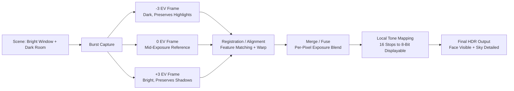
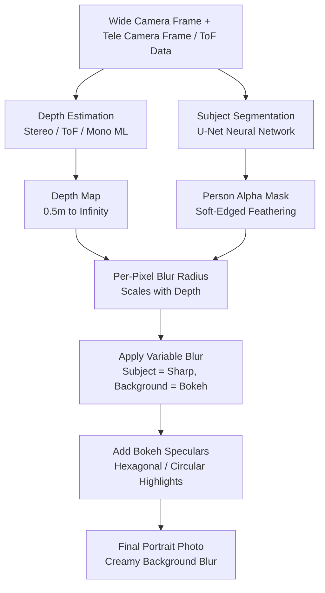
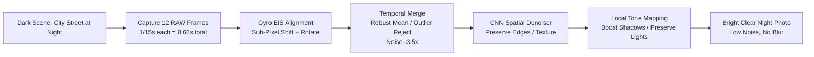
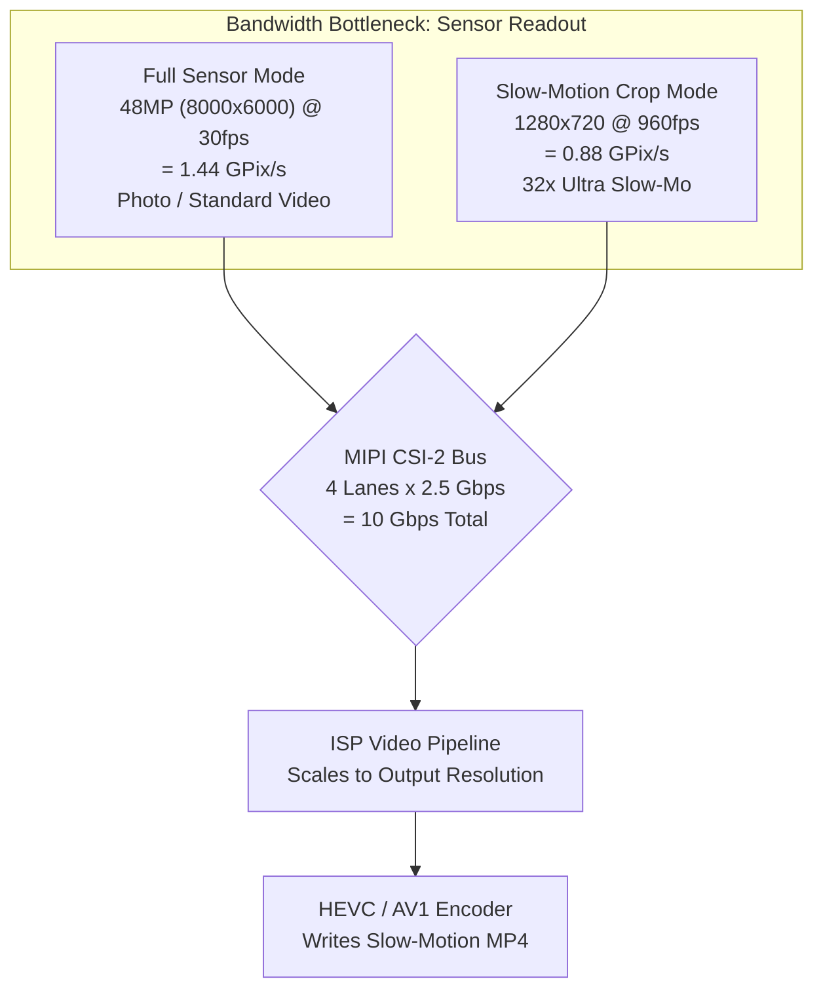
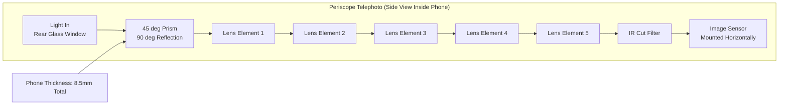
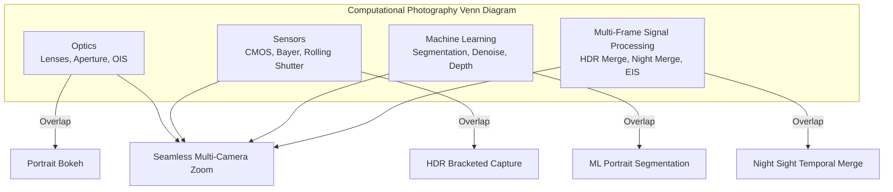

# Chapter 3: Modern Smartphone Photography

Chapter 2 gave you the hardware foundations: lenses, sensors, ISP pipelines, and multi-camera modules. This chapter answers the natural follow-up question: **How do modern camera apps actually use that hardware to produce the photos I see on Instagram?**

A 2010 smartphone took a single exposure, ran it through a basic ISP, and wrote a JPEG. A 2026 smartphone routinely captures 5 to 15 separate frames for a single still photo, aligns them to sub-pixel precision using gyroscope data, fuses them using multi-frame signal processing, runs the result through a neural network for semantic segmentation or depth estimation, and finally tone-maps it into a single shareable image — all within the span of a single shutter button press.

This chapter is a feature-by-feature tour of modern smartphone photography. We will explain how each feature works at the hardware + software level, without any Camera2 API code. The goal is to build a vocabulary of what modern camera systems can do, so that when you later write code to control these features, you know what is happening under the hood.

## HDR: High Dynamic Range Multi-Frame Fusion

**Dynamic range** is the ratio between the brightest and darkest parts of a scene that the imaging system can record simultaneously without clipping. The human eye can perceive roughly 20 stops of dynamic range (a 1,000,000:1 contrast ratio) in a single glance, thanks to saccadic adaptation. A single smartphone sensor exposure can capture roughly 10 to 12 stops at base ISO. The gap between those two numbers is the reason HDR exists.

Imagine you are taking a photo indoors with a bright window behind your subject. If you expose for the person's face (let's say 1/30s, ISO 400), the window blows out to pure clipped white — no sky, no clouds, no detail. If you expose for the window (1/2000s, ISO 50), the person's face becomes a silhouetted black blob. Neither single exposure works.

### How Smartphone HDR Works

Every HDR system on modern phones uses **multi-frame bracketing** followed by computational fusion. The algorithm works like this:

1. **Bracketed capture**: The camera captures a rapid burst of 3 to 10 consecutive frames at different exposure values (EV). A typical set might be frames at -3 EV (very short, preserves highlights), -1 EV, +1 EV, and +3 EV (very long, captures shadows). The sensor and VCM are held perfectly still during the burst; only the electronic shutter timing changes.
2. **Reference frame selection**: The algorithm picks the sharpest mid-exposure frame as the geometric reference.
3. **Image registration / alignment**: Each non-reference frame is computationally aligned to the reference. The algorithm finds distinctive keypoint features (corners, edges) using algorithms like FAST or SIFT, computes an affine or homography transform that maps each frame's features onto the reference frame, and warps the pixels accordingly. Any frames that are too blurred (from micro-shake during the burst) are discarded entirely.
4. **Fusion**: For each pixel location in the final image, the algorithm combines information from the aligned frames. Underexposed pixels contribute their clean, unclipped highlight data. Overexposed pixels contribute their low-noise shadow data. Mid-tone pixels are averaged across all frames to reduce shot noise.
5. **Tone mapping**: The fused linear image — which may now contain 14 to 18 stops of usable dynamic range — is compressed through a sophisticated local tone mapping operator into an 8-bit or 10-bit output image that looks good on a standard sRGB display.

Real-world example: a Galaxy S26 Ultra in the default "Scene Optimizer HDR" mode internally fires 7 bracketed frames totaling approximately 0.2 seconds of capture time. The built-in hand-motion detection discards 2 blurred frames. The remaining 5 frames are aligned, fused, and tone-mapped. The output is written as a **JPEG_R Ultra HDR file** on Android 14+ devices: a standard JPEG primary image (8-bit SDR) with an embedded gain map that HDR-capable viewers (Android 14 Gallery, Chrome 120+, Adobe Lightroom) can use to reconstruct the full 10-bit HDR luminance range on an HDR10 or Dolby Vision display.

### When HDR Works and When It Doesn't

HDR excels at static scenes with both bright highlights and deep shadows: landscapes, backlit portraits, rooms with windows, sunsets over water. It actively fails — producing ghosting artifacts — when objects in the scene move during the bracketed burst: a flying bird, a waving flag, a person blinking, a child running. Modern AI-powered HDR algorithms detect and segment moving objects, blending only the reference frame for those pixels to avoid the classic HDR "ghost."

## Portrait Mode: Bokeh via Depth Estimation

Portrait mode produces the aesthetic where the subject's face is perfectly sharp and the background dissolves into a creamy, out-of-focus blur called **bokeh**. Traditional cameras achieve this optically with large sensors, wide apertures, and long focal lengths. Smartphones achieve it computationally, because a 1/1.3-inch sensor at f/1.6 does not naturally produce enough shallow depth of field for the effect.

### Three Methods of Smartphone Depth Estimation

There are three independent techniques used by modern portrait systems; many phones use a combination of all three.

**Method 1: Stereo Disparity from Dual Cameras.** This is the oldest and most geometrically sound method. The phone fires both the wide camera and the telephoto camera simultaneously at the same subject. Because the two cameras are physically separated by 10 to 15 millimeters (the "baseline"), they see the subject from slightly different horizontal positions. A foreground object's position shifts more between the two viewpoints than a distant background object's position does. This shift is called **disparity**. The algorithm runs a block-matching or semi-global matching (SGM) algorithm over the two rectified images to compute a disparity value for every pixel. Disparity is inversely proportional to depth, so the disparity map is converted directly into a per-pixel depth map.

**Method 2: ToF / LiDAR Active Depth Sensing.** A ToF (Time-of-Flight) or LiDAR depth sensor projects a structured pattern of 30,000+ near-infrared laser dots onto the scene, then measures the round-trip time (for direct ToF) or phase shift (for indirect ToF) of the reflected light to compute a true metric depth in meters for each pixel. ToF produces accurate, dense depth maps even in complete darkness and on textureless surfaces (plain walls, sky) where stereo matching fails. Modern portrait systems typically use ToF as the ground-truth depth cue and stereo disparity as a refinement signal.

**Method 3: Monocular ML Depth Estimation.** For single-camera phones (or for the front-facing selfie camera, which has no stereo partner), a neural network estimates depth from a single RGB image. The model, trained on millions of images with ground-truth depth labels, learns the statistical cues humans use to judge depth: relative size, occlusion, linear perspective, texture gradient, defocus blur, and atmospheric perspective. Google's PortraitNet and Meta's DeepLabV3+ are representative architectures. Monocular depth is less metrically accurate than stereo or ToF, but it is sufficient for plausible-looking portrait bokeh.

### The Portrait Rendering Pipeline

Once a depth map is obtained, the remaining steps are the same regardless of which depth estimation method was used:

1. **Subject Segmentation**: A separate semantic segmentation neural network (usually a U-Net variant) runs on the main RGB camera image and produces a soft alpha mask identifying which pixels belong to "person" vs "background." The mask is feathered at the edges — especially around hair, glasses, and fine foreground detail — to avoid the cutout "paper doll" look of early 2010s portrait mode.
2. **Depth Refinement**: The raw depth map from Method 1/2/3 is multiplied with the segmentation mask. Background pixels keep their depth value; subject pixels are clamped to a single focus plane depth.
3. **Per-Pixel Variable Blur**: Each background pixel is blurred by a Gaussian (or, for premium "optical simulation" modes, a physically rendered lens-kernel convolution) whose radius scales linearly with the pixel's distance from the focus plane. A background object at 5 meters gets a heavy blur; a background object at 1.5 meters gets a mild blur. The subject pixels are copied untouched.
4. **Faux Optical Glare**: A premium touch: bright specular highlights in the blurred background (streetlights, reflections, the sun) are rendered as characteristic lens-shaped bokeh hexagons or circles rather than simple Gaussian blobs. This sells the illusion that the blur came from a real lens diaphragm.

## Night Mode: Multi-Frame Temporal Merging

Before 2018, low-light smartphone photography was essentially unusable without flash. A dimly lit bar or a city street at night produced a noisy, grainy, blurry mess. Then Google released **Night Sight** on the Pixel 3, and everything changed. The core insight was counterintuitive: instead of taking one long 1-second exposure (which would be hopelessly blurred from hand shake), take 15 very short 1/15-second exposures (each individually sharp because OIS is active), then algorithmically align and average them. The total integrated exposure time is still 1 second, but the per-frame exposure is short enough that handshake blur never accumulates.

### The Night Mode Algorithm Step-by-Step

1. **Burst Capture**: The camera captures 8 to 15 raw frames. Each frame uses a moderate exposure time (1/15s to 1/8s is typical) and moderate ISO (800 to 3200). Individual frames are noisy but not blurred. The burst totals 0.5 to 2 seconds of wall-clock time.
2. **Gyro-Aided EIS Alignment**: The phone's main IMU gyroscope records angular velocity at 8,000 Hz throughout the burst. For each frame, the cumulative rotation and translation from the reference frame is computed. Each raw frame is then digitally shifted, rotated, and slightly scaled (Electronic Image Stabilization, EIS) on the NPU to sub-pixel precision, perfectly registering it to the reference frame even if the user's hands moved by several full pixels of blur during the burst.
3. **Temporal Pixel Merging**: For each pixel location across the 12 aligned frames, the algorithm gathers 12 candidate pixel values. It then performs robust statistical merging rather than a simple average: outlier values (caused by hot pixels, cosmic ray hits, or a car's headlights transiting that spot) are identified and discarded. The remaining consistent values are averaged, reducing Gaussian shot noise by a factor equal to the square root of the number of frames kept. A 12-frame merge reduces noise by 3.5×.
4. **Spatial Denoising**: A CNN-based denoiser (trained specifically on raw night imagery) removes any remaining high-frequency noise while preserving real edges and texture.
5. **Local Tone Mapping**: The merged raw image has very high dynamic range. A spatially-varying tone mapping operator (based on bilateral filtering or a learned CNN tone map) lifts shadows without blowing out city lights, boosts color saturation in dark regions (which would otherwise look desaturated), and produces a final 8-bit image that feels bright and clean rather than dim and murky.

Samsung's "Nightography," Apple's "Night Mode," Xiaomi's "Night Mode 2.0," and OPPO's "Ultra Dark Mode" all use substantially the same algorithm architecture. Variations exist in the exact number of frames, the choice of robust merging statistic, the denoiser architecture, and the tone map look, but the core gyro-aligned multi-frame temporal averaging is universal across the industry.

## Slow Motion: High-Frame-Rate Cropped Capture

Slow-motion video stretches time by capturing video frames faster than the standard 30 fps playback rate, then playing them back at the normal 30 fps speed. The common multipliers:

- **120 fps capture → 30 fps playback = 4× slow motion.** A 1-second real-world event becomes 4 seconds of video.
- **240 fps → 30 fps = 8× slow motion.**
- **960 fps → 30 fps = 32× ultra-slow motion.** A water drop splash, a balloon pop, or a hummingbird wingbeat becomes visible.

### Why 960 fps Requires a Sensor Crop

The bottleneck for high-frame-rate capture is **sensor readout bandwidth**. The image sensor has a finite number of MIPI CSI-2 lanes running at a fixed maximum data rate (typically 2.5 Gbps per lane, 4 lanes = 10 Gbps total). The sensor can only output so many pixels per second.

- A full 48MP (8000×6000) frame readout at 960 fps would require 48,000,000 × 960 = 46.08 billion pixels per second. That is 30× the actual readout bandwidth of any 2026 smartphone sensor.
- Therefore, to hit 960 fps the sensor must read out only a small central crop of its pixel array. A 960 fps mode is typically a 1280×720 (720p HD) or sometimes a 1920×1080 (1080p FHD) crop. The total pixel bandwidth becomes manageable: 1280×720×960 fps = 884 megapixels per second, which fits comfortably in 10 Gbps even with 10-bit per pixel encoding.

The numbers in practice: 960 fps capture × 0.3 seconds of real time = 288 individual frames. Played back at 30 fps = 9.6 seconds of buttery slow-motion video. Some Sony Xperia and Samsung Galaxy flagship phones support a brief burst of 960 fps at 1080p resolution by reading the sensor through a limited analog-to-digital converter (ADC) bank only in the central crop region.

Slow-motion modes also often use a staggered HDR technique where alternate rows of the sensor are exposed for different durations to maintain high dynamic range even at 240 fps or 960 fps.

## Ultra-Wide: Distortion Correction and Edge Quality

The ultra-wide camera on a modern flagship offers a 10–18mm full-frame equivalent focal length and a 100° to 130° diagonal field of view. It opens up compositional possibilities that the standard wide camera cannot: sweeping landscapes, towering architecture shots where the entire building fits without stepping into traffic, group selfies that actually include everyone, and a playful "close-up proximity distortion" effect where objects held near the lens appear massively oversized relative to the background.

However, the ultra-wide focal length comes with three characteristic optical flaws that the ISP must correct before the photo is usable:

1. **Geometric (Barrel) Distortion**: Straight lines bow outward like the edges of a fisheye lens. A photo of a rectangular door frame will look pincushioned or barreled. The ISP's Geometric Distortion Correction stage (see Chapter 2) applies a per-pixel coordinate remap using a 4th-order or 6th-order polynomial lens model calibrated for that specific module. The correction necessarily crops the outer 5–10% of the sensor array because the remapping pushes those outer pixels off-canvas.
2. **Lateral Chromatic Aberration (LCA)**: The lens bends different wavelengths of light by slightly different amounts, so red, green, and blue images of the same off-axis point land at slightly different pixel coordinates. The result is visible color fringing (purple/green edges) on high-contrast objects near the corners. The ISP corrects LCA by applying a slightly different magnification factor to the red and blue color planes relative to green.
3. **Vignetting / Corner Softness**: Corner pixels receive significantly less light than center pixels (due to the lens's cos⁴θ natural falloff plus mechanical vignetting from the lens barrel), and the lens's optical MTF (Modulation Transfer Function) is lower at extreme angles so corners look soft. The Lens Shading Correction stage applies a radially symmetric gain boost to flatten the illumination, and an edge-aware sharpening filter is applied more aggressively at the corners than in the center.

## Telephoto: Standard vs Periscope

The telephoto camera captures distant subjects that the wide camera cannot resolve. Modern phones ship two distinct telephoto designs.

**Standard Telephoto (2× to 3× optical):** This is a conventional camera module: the lens barrel sits perpendicular to the phone's back cover, directly above the image sensor, exactly like the wide camera but with a longer focal length lens. A 3× telephoto has an ~72mm full-frame equivalent focal length. The physical stack-up is limited by the phone's thickness (7–9mm), so the lens cannot be longer than that. Hence the 3× practical ceiling for conventional telephoto modules.

**Periscope Telephoto (5× to 10× optical):** To get longer focal lengths without making the phone thicker, engineers folded the optical path 90° using a prism. Light enters through a window in the phone's edge or rear glass, hits a 45° right-angle prism, bounces 90° sideways, and then travels horizontally through a multi-element lens barrel 10–14mm long that runs parallel to the phone's mainboard, finally landing on an image sensor mounted sideways on the PCB. The prism itself is mounted on a 2-axis OIS gimbal, and the sensor is sometimes mounted on a separate sensor-shift OIS, giving 4-axis or 5-axis total stabilization — enough to get sharp handheld 10× photos of text on a distant building sign.

At zoom boundaries between physical cameras (for example, 2.9× still digitally cropped from the wide camera vs 3.1× using the 3× periscope telephoto), the HAL performs a multi-camera fusion trick: for roughly ±0.2× around the switchover point, it captures both cameras simultaneously and performs a cross-fade weighted by zoom ratio, so the user never sees a visible "jump" when the active physical camera changes.

## Macro: Extreme Close-Up Photography

Macro photography captures extreme close-ups of small subjects: the texture of flower petals, the compound eyes of insects, the fibers of a piece of fabric, the individual sugar crystals on a cookie.

Two macro strategies exist in modern phones:

**Dedicated Macro Camera:** Budget and mid-range phones often ship a small, low-resolution (2MP to 5MP) dedicated macro module with a fixed-focus short-focal-length lens. The module is tuned for a specific minimum focus distance (typically 2–4 cm) and produces surprisingly sharp macro images despite its low resolution. The main drawback is that the sensor is tiny, so image quality degrades sharply in anything less than bright daylight.

**Ultra-Wide Re-purposed as Macro:** Flagship phones (Google Pixel, Samsung S-series Ultra, iPhone Pro) do not ship a dedicated macro camera. Instead, they re-task the ultra-wide camera. The ultra-wide's short focal length (13mm eq) gives it a very short minimum focus distance — often 1 to 2 centimeters from the subject. When the user taps "Macro" mode or the camera app detects a close subject via the ToF sensor or phase-detect AF rangefinder, the app switches to the ultra-wide, drives its VCM to the minimum-focus position, applies extra geometric distortion correction (because the subject is now at a field-curvature extreme where the polynomial remap differs significantly from the infinity calibration), and crops the center of the ultra-wide sensor to produce the final macro frame. The large 12MP–50MP ultra-wide sensor gives dramatically better macro image quality than a 5MP dedicated module.

## Computational Photography: The Unifying Philosophy

The features above — HDR, Portrait, Night Mode, Slow Motion, Ultra-Wide correction, Periscope zoom fusion, Macro — share a single unifying idea. **Computational photography** is the philosophy that the camera sensor, the ISP, the gyroscope/IMU, the NPU (Neural Processing Unit), and multi-frame signal processing algorithms can work together to produce imagery that no single lens/sensor combination, no matter how expensive the glass, could ever produce on its own.

The classic DSLR model is: light → lens → sensor → storage. The smartphone model is: light → multiple lenses → multiple sensors → gyro/IMU → multi-frame burst capture → NPU neural inference → per-pixel decision fusion → sophisticated tone mapping → storage. Both start and end at the same place, but the smartphone inserts dozens of additional computational steps in the middle, each of which improves the final result in ways optics alone cannot.

Zooming seamlessly across 0.5× to 10× on a Galaxy S26 Ultra is computational: the HAL blends three different cameras with three different focal lengths across five zoom switch points. Rescuing a backlit portrait where the window behind the subject no longer blows out is computational: 7-frame HDR fusion. A handheld night photo of the Milky Way that would require a tripod and a 30-second exposure on a DSLR is computational: 12-frame gyro-aligned temporal merge. Every feature described in this chapter is computational photography.

This is the most important idea to carry into the Camera2 API chapters that follow. The Camera2 API is not just a tool to "take a picture." It is a low-level control interface that lets your app fire precise multi-frame bursts, read gyro metadata per frame, select which physical camera fires at which zoom ratio, and stream frames through on-device neural networks — the building blocks for implementing your own computational photography features.

## Summary

In this chapter you learned the real-world algorithms behind modern smartphone photography features. HDR uses 3–10 frame exposure bracketing, per-frame feature-based alignment, and tone mapping to capture dynamic range the sensor cannot see in a single exposure. Portrait mode computes a per-pixel depth map via stereo camera disparity, ToF laser ranging, or monocular ML depth estimation, then runs a U-Net subject segmentation and applies a variable per-pixel Gaussian blur scaled by depth. Night mode captures 8–15 short exposures, aligns them using gyro-aided EIS, applies robust temporal pixel merging to reduce noise by 3.5×, and locally tone-maps the result. Slow-motion video at 960 fps must crop the sensor because the MIPI readout bandwidth is the hard bottleneck. Ultra-wide photos undergo geometric distortion correction, chromatic aberration correction, and corner shading correction in the ISP before they become viewable. Periscope telephoto cameras use a 45° prism to fold the light path 90° and fit a 10× optical lens inside an 8.5mm-thick phone. You learned the definition of computational photography: the fusion of Optics, Sensors, Machine Learning, and Multi-Frame Signal Processing to create images beyond the reach of any single lens/sensor system.

## What's Next

Chapter 4 is the hands-on practical chapter. You will install the **Android Camera Parameters** companion app from source or Google Play, launch it on your own phone, and inspect exactly what your own hardware is capable of. You will learn to read Camera IDs and facing directions, check the Hardware Level of each camera (LEGACY / LIMITED / FULL / LEVEL_3), enumerate supported output formats (JPEG, YUV_420_888, PRIVATE, RAW_SENSOR, JPEG_R Ultra HDR), find maximum slow-motion FPS ranges, explore zoom ratios and switch points between your phone's physical cameras, and check whether your primary sensor supports RAW capture — writing down the answers for your specific device, because those answers determine what is and is not possible for your own Camera2 API app to do on that phone.
