# Chapter 16: White Balance & Color

You've mastered brightness (exposure) and sharpness (focus). Now it's time to control the **look** — the *color tone* of the image.

When you take a photo of a white piece of paper under a warm incandescent lamp, the lamp's yellow/orange light hits the paper, and the sensor sees it as orange. *Your brain* corrects for this instantly and still sees "white paper" — but the raw sensor data records the truth: it's orange.

**White Balance (WB)** is the camera's process of compensating for the color of the light source so that neutral whites look neutral. Get it wrong, and your entire photo has an unwanted color cast (too orange, too blue, too green).

The [Android Camera Parameters app](https://github.com/zoozooll/AndroidCameraParameters) showcases every AWB preset in a live grid view and exposes a manual gains slider — open the app, switch to the White Balance panel, and you can watch exactly what we'll implement in this chapter.

---

## Color Temperature: The Warm-to-Cool Spectrum

Light sources are described by their **color temperature** in Kelvin (K). The scale describes the temperature of a theoretical "black body radiator" that glows the same color.

```mermaid
graph LR
    A[1800K<br/>Candlelight] --> B[2800K<br/>Incandescent Lamp]
    B --> C[3500K<br/>Warm Fluorescent]
    C --> D[4500K<br/>Cool Fluorescent]
    D --> E[5500K<br/>Daylight / Flash]
    E --> F[6500K<br/>Overcast Day]
    F --> G[8000K<br/>Open Shade]
    G --> H[10000K+<br/>Blue Sky / Deep Shade]
    style A fill:#e67e22,color:#fff
    style B fill:#f39c12,color:#fff
    style C fill:#f1c40f,color:#333
    style D fill:#f9e79f,color:#333
    style E fill:#ffffff,color:#333,stroke:#333
    style F fill:#d4e6f1,color:#333
    style G fill:#85c1e9,color:#333
    style H fill:#3498db,color:#fff
```



**Counterintuitive rule:** Warm light = *low* Kelvin number (1800K candle = very orange). Cool light = *high* Kelvin number (10000K sky = very blue). Your eyes learn this in childhood; your code must remember it explicitly.

| Scene | Typical Color Temp | Cast if "Daylight" WB Used |
|-------|-------------------|----------------------------|
| Candlelight dinner | 1800–2200K | Very orange / amber |
| Home tungsten bulb | 2700–3000K | Orange / yellow |
| Sunrise / Sunset | 3000–4000K | Warm golden tint (often desirable!) |
| "Cool white" fluorescent | 4000–5000K | Greenish tint |
| Midday sunlight | 5200–5800K | Correct neutral |
| Electronic flash | 5500–6000K | Neutral (matches daylight) |
| Overcast / heavy cloud | 6000–7500K | Slightly blue |
| Open shade (no direct sun) | 7000–9000K | Blue cast |
| Hazy blue sky | 9000–12000K | Very blue |

Auto White Balance's job: detect the likely illuminant from scene statistics, then *subtract* the color cast so neutral objects appear neutral.

---

## Auto White Balance (AWB) Modes in Camera2

Set via `CaptureRequest.CONTROL_AWB_MODE`:

| Mode (CONTROL_AWB_MODE_*) | Effect | Use Case |
|---------------------------|--------|----------|
| `OFF` | Manual white balance only. Use `COLOR_CORRECTION_GAINS` or `_TRANSFORM` explicitly. | Pro mode, custom color grading, RAW + post |
| `AUTO` | Default. The ISP runs illuminant detection continuously. | General photography |
| `INCANDESCENT` (TUNGSTEN) | ~2800K. Strong blue gain to cancel warm tungsten light. | Indoor home lamps, stage lighting |
| `FLUORESCENT` | ~4500K. Gains for typical office fluorescent (tends toward green cast). | Office / classroom |
| `WARM_FLUORESCENT` | ~3200K. Compensates warm-white fluorescent tubes. | Home CFL "warm white" lamps |
| `DAYLIGHT` | ~5500K. Standard noon-sun illuminant profile. | Outdoor sunny day, matches flash |
| `CLOUDY_DAYLIGHT` | ~6500K. Slight warming to cancel cool overcast. | Cloudy / hazy day |
| `TWILIGHT` | Warm twilight golden-hour profile (~4500K). | Sunset, dusk, warm landscape |
| `SHADE` | ~7500K. Strong red/gain against deep blue shade light. | Portrait in shadow, city shade |

**Query supported modes first:** Not every device ships all 9 presets. Flagship phones usually do; budget devices may offer only `AUTO` + `OFF`.

```kotlin
val availableAwbModes = characteristics.get(
    CameraCharacteristics.CONTROL_AWB_AVAILABLE_MODES
) ?: intArrayOf()
Log.d("AWB", "Available modes: ${availableAwbModes.toList()}")
```

### AWB States (Like AF, But Less Talkative)

The AWB state machine is conceptually similar to AF's but simpler — it has fewer states:

| AWB State | Meaning |
|-----------|---------|
| `CONTROL_AWB_STATE_INACTIVE` | AWB disabled (`AWB_MODE = OFF`) |
| `CONTROL_AWB_STATE_SEARCHING` | Looking for correct illuminant (cast may drift) |
| `CONTROL_AWB_STATE_CONVERGED` | Found stable illuminant — color is stable |
| `CONTROL_AWB_STATE_LOCKED` | Explicitly locked via `CONTROL_AWB_LOCK = true` |

Use the same "wait for converged / locked before capture" pattern you applied to AF for color-critical photography (product shots, catalog work).

---

## How White Balance Correction Works: Under the Hood

AWB applies two color transforms to get from sensor RGB → displayable sRGB. Understanding them lets you bypass AWB entirely with manual values.

### Step 1: Channel Gains (White Point Correction)

First, multiply each color channel by a gain so a neutral surface comes out equal in R, G, B:

> If a scene with a 3200K tungsten lamp produces `[R=200, G=150, B=100]` from the sensor for a gray target, AWB applies channel gains of approximately `R: 1.0, G: 1.33, B: 2.0` to normalize to `[200, 200, 200]`.

In Camera2, this is exposed as **`CaptureRequest.COLOR_CORRECTION_GAINS`**: a 4-element float array in the order **[R, Geven, B, Godd]**.

The two green channels (`Geven`, `Godd`) exist because many smartphone sensors use a 2×2 Bayer grid: **GR / BG** alternating rows. Rows starting with Green-R vs Green-B have slightly different spectral sensitivity and need independent digital gains. For everyday work, setting both greens to the same value is fine.

```kotlin
// COLOR_CORRECTION_GAINS = [ R gain, G-even gain, B gain, G-odd gain ]
val warmGains = floatArrayOf(1.0f, 1.2f, 0.8f, 1.2f)  // Warm tint: boost R, reduce B
val coolGains = floatArrayOf(0.85f, 1.0f, 1.25f, 1.0f) // Cool tint: boost B, reduce R
val neutralGains = floatArrayOf(1.0f, 1.0f, 1.0f, 1.0f) // Unity gains (raw sensor color)
```

**Valid range:** Gains are typically clamped to [0.0, 4.0] by the HAL. Use multiplicative factors between 0.5× and 3× for plausible results.

### Step 2: 3×3 Color Transform Matrix (Gamut Mapping)

Channel gains only correct for the *white point*. But different sensors have different native color filter spectral responses, and different output devices have different display gamuts (sRGB/Rec.709 vs DCI-P3 vs Display P3). A **3×3 color correction matrix (CCM)** maps the sensor's native RGB color space → standard output space.

Mathematically:

```
[ R' ]   [ m11  m12  m13 ] [ R ]
[ G' ] = [ m21  m22  m23 ] [ G ]
[ B' ]   [ m31  m32  m33 ] [ B ]
```

Or in code: `output = M × input` where M is a 3×3 matrix.

Camera2 exposes this via **`COLOR_CORRECTION_TRANSFORM`**, which is set using a `Rational[9]` array (row-major: `m11, m12, m13, m21, m22, m23, m31, m32, m33`). Identity matrix = input copied directly:

```kotlin
// Identity 3x3 matrix in Rationals: 1/1 for diagonal, 0/1 for off-diagonal
val identityMatrix = arrayOf(
    Rational(1,1), Rational(0,1), Rational(0,1),
    Rational(0,1), Rational(1,1), Rational(0,1),
    Rational(0,1), Rational(0,1), Rational(1,1)
)
```

**The Rec.709 vs DCI-P3 Gamuts:**

| Color Space | Coverage | Use Case |
|-------------|----------|----------|
| **Rec.709 (sRGB)** | ~35% of visible light | HDTV, web, JPEG default, ~100% of phone displays until ~2020 |
| **DCI-P3** | ~45% of visible light | Digital cinema, 4K UHD, modern iPhone/Android wide-gamut displays |

A P3 display can show richer reds and greens than Rec.709. Your output CCM must pick a target gamut that matches what the viewer's screen expects. On Android, check `Display.isWideColorGamut()` and use an appropriate matrix.

**Practical advice:** Unless you're writing a professional RAW developer or color-managed cinema app, set `COLOR_CORRECTION_MODE = TRANSFORM_MATRIX` and let the OEM's default matrix handle gamut mapping. Most pro-mode apps tweak only `COLOR_CORRECTION_GAINS` (the 4 gains) and leave the matrix alone.

---

## Complete Example 1: Lock AWB to Daylight Preset (Warm Tint Lock)

Let's start simple. Sometimes you don't want full manual — you just want to **prevent AWB from drifting** between frames (e.g., timelapse, video with scene changes). Setting a fixed preset like `DAYLIGHT` guarantees consistent color across shots.

This is the simplest manual color control.

```kotlin
class AwbPresetController(
    private val characteristics: CameraCharacteristics,
    private val captureSession: CameraCaptureSession,
    private val previewSurface: Surface
) {
    // Return true if the HAL actually supports this mode
    fun isModeSupported(mode: Int): Boolean {
        val available = characteristics.get(
            CameraCharacteristics.CONTROL_AWB_AVAILABLE_MODES
        ) ?: intArrayOf()
        return mode in available
    }

    fun setPresetDaylightForWarmTintLock(): Boolean {
        if (!isModeSupported(CameraMetadata.CONTROL_AWB_MODE_DAYLIGHT)) {
            Log.w("AWB", "DAYLIGHT preset not supported on this device")
            return false
        }

        val request = captureSession.device.createCaptureRequest(
            CameraDevice.TEMPLATE_PREVIEW
        ).apply {
            addTarget(previewSurface)

            // Lock white balance to DAYLIGHT (~5500K) mode.
            // This will render indoor tungsten scenes as intentionally warm/orange,
            // which is the "filmic" look preferred in cinematography.
            set(CaptureRequest.CONTROL_AWB_MODE,
                CameraMetadata.CONTROL_AWB_MODE_DAYLIGHT)

            // Keep AE and AF in their defaults (auto) for this example
            set(CaptureRequest.CONTROL_MODE,
                CameraMetadata.CONTROL_MODE_AUTO)
        }

        captureSession.setRepeatingRequest(request.build(),
            object : CameraCaptureSession.CaptureCallback() {
                override fun onCaptureCompleted(
                    session: CameraCaptureSession,
                    request: CaptureRequest,
                    result: TotalCaptureResult
                ) {
                    val awbState = result.get(CaptureResult.CONTROL_AWB_STATE)
                    Log.d("AWB", "Preset DAYLIGHT applied, AWB state=$awbState")
                }
            }, null
        )
        return true
    }
}
```

**Artistic application:** If you're shooting a sunset with `AWB_MODE = DAYLIGHT`, the 3000K sunset light will register as *warm* to the fixed 5500K balance — producing rich, saturated golden-orange tones. Using `AWB_MODE = AUTO` here would *neutralize the sunset* (the entire point!) by pumping in more blue to cancel the golden light. Presets preserve mood.

---

## Complete Example 2: Full Manual AWB — Custom Warm Sunset Gains

For ultimate creative control, disable AWB entirely and write your own gains. Let's build a "warm sunset look" — boosting red slightly, suppressing blue, with a subtle green boost to avoid a purple shift.

```kotlin
class ManualColorGradingController(
    private val characteristics: CameraCharacteristics,
    private val captureSession: CameraCaptureSession,
    private val previewSurface: Surface,
    private val jpegReaderSurface: Surface
) {
    // Canonical color grading presets (R, Geven, B, Godd)
    object Presets {
        val NEUTRAL = floatArrayOf(1.00f, 1.00f, 1.00f, 1.00f)
        val WARM_SUNSET = floatArrayOf(1.00f, 1.20f, 0.80f, 1.20f)  // Warm amber
        val COOL_MORNING = floatArrayOf(0.85f, 1.00f, 1.25f, 1.00f)  // Cool blue
        val VINTAGE_KODAK = floatArrayOf(1.15f, 1.00f, 0.85f, 1.00f) // Classic film-ish
        val GREEN_SHIFT_FLUO = floatArrayOf(1.00f, 1.25f, 1.00f, 1.25f) // Fluorescent fix
    }

    fun applyManualGains(gains: FloatArray, includeMatrix: Boolean = true) {
        // Validate: AWB_MODE = OFF must be supported (it always is on MANUAL capability)
        val hwLevel = characteristics.get(CameraCharacteristics.INFO_SUPPORTED_HARDWARE_LEVEL)
        val supportsManualColor = (hwLevel == CameraMetadata.INFO_SUPPORTED_HARDWARE_LEVEL_3 ||
                                   hwLevel == CameraMetadata.INFO_SUPPORTED_HARDWARE_LEVEL_FULL ||
                                   isModeSupported(CameraMetadata.CONTROL_AWB_MODE_OFF))
        if (!supportsManualColor) {
            Log.e("AWB", "This LEGACY-level device cannot do manual AWB gains")
            return
        }

        val request = captureSession.device.createCaptureRequest(
            CameraDevice.TEMPLATE_PREVIEW
        ).apply {
            addTarget(previewSurface)

            // 1) DISABLE AWB entirely
            set(CaptureRequest.CONTROL_AWB_MODE, CameraMetadata.CONTROL_AWB_MODE_OFF)

            // 2) Apply the 4 channel gains (R, Geven, B, Godd)
            set(CaptureRequest.COLOR_CORRECTION_GAINS, gains)

            // 3) Pick a color correction strategy
            if (includeMatrix) {
                // FAST: let the HAL compute a good matrix for this illuminant
                // (matrix is auto-derived; only gains are user-controlled)
                set(CaptureRequest.COLOR_CORRECTION_MODE,
                    CameraMetadata.COLOR_CORRECTION_MODE_FAST)
            } else {
                // EXPERT: set our own 3x3 transform matrix + gains together
                set(CaptureRequest.COLOR_CORRECTION_MODE,
                    CameraMetadata.COLOR_CORRECTION_MODE_TRANSFORM_MATRIX)
                set(CaptureRequest.COLOR_CORRECTION_TRANSFORM, identityMatrix())
            }
        }

        captureSession.setRepeatingRequest(request.build(), null, null)
        Log.d("AWB", "Manual gains applied: [${gains.joinToString()}]")
    }

    // ------- Still capture with locked manual color -------
    fun captureStillWithColorGrading(gains: FloatArray) {
        applyManualGains(gains)

        val stillRequest = captureSession.device.createCaptureRequest(
            CameraDevice.TEMPLATE_STILL_CAPTURE
        ).apply {
            addTarget(previewSurface)
            addTarget(jpegReaderSurface)

            set(CaptureRequest.CONTROL_AWB_MODE, CameraMetadata.CONTROL_AWB_MODE_OFF)
            set(CaptureRequest.COLOR_CORRECTION_GAINS, gains)
            set(CaptureRequest.COLOR_CORRECTION_MODE,
                CameraMetadata.COLOR_CORRECTION_MODE_FAST)

            set(CaptureRequest.JPEG_QUALITY, 95)
        }

        captureSession.capture(stillRequest.build(), null, null)
    }

    // ------- Helpers -------
    private fun identityMatrix(): Array<Rational> = arrayOf(
        Rational(1,1), Rational(0,1), Rational(0,1),
        Rational(0,1), Rational(1,1), Rational(0,1),
        Rational(0,1), Rational(0,1), Rational(1,1)
    )

    private fun isModeSupported(mode: Int): Boolean {
        val available = characteristics.get(
            CameraCharacteristics.CONTROL_AWB_AVAILABLE_MODES
        ) ?: intArrayOf()
        return mode in available
    }
}
```

### Using the Presets

```kotlin
// User taps "Sunset Warm" button
controller.applyManualGains(ManualColorGradingController.Presets.WARM_SUNSET)

// User taps "Capture" — the same gains flow to the JPEG
controller.captureStillWithColorGrading(ManualColorGradingController.Presets.WARM_SUNSET)
```

### COLOR_CORRECTION_MODE: FAST vs TRANSFORM_MATRIX

Use this decision table:

| Scenario | Choose `COLOR_CORRECTION_MODE =` |
|----------|----------------------------------|
| I only want manual gains; let OEM pick the matrix (most apps) | `FAST` |
| I'm applying a full color-grading LUT / matrix externally, need untouched raw color space | `TRANSFORM_MATRIX` + identity matrix |
| I have a custom color profile (ICC / DCP) derived for this sensor | `TRANSFORM_MATRIX` + custom 3x3 |

**Warning:** `TRANSFORM_MATRIX` with the identity matrix gives you **raw sensor color** without OEM gamut mapping. On many sensors, this looks noticeably desaturated and slightly green-tinted without additional processing. This is correct behavior — it's the raw sensor output ready for your custom processing pipeline.

---

## Manual Kelvin-to-Gains Converter (Color Temperature Slider)

Pro camera apps (including [Android Camera Parameters](https://play.google.com/store/apps/details?id=com.minininja.cameraparams)) expose a **Kelvin temperature slider**. Since Camera2 doesn't accept Kelvin directly, we approximate the R/B gains curve.

A simple approximation that works for most smartphone sensors (calibrate your gain curve empirically on your target hardware):

```kotlin
class KelvinGainsConverter {
    // Convert Kelvin [2000..10000] → approximate gains [R, Geven, B, Godd]
    // Simple Planckian locus approximation (good enough for UI sliders)
    fun kelvinToRgbGains(kelvin: Int): FloatArray {
        val k = kelvin.coerceIn(2000, 10000)
        val temp = k / 100.0

        // Red (warm at low K)
        val r = when {
            temp <= 66 -> 255.0
            else -> {
                var x = temp - 60.0
                x = 329.698727446 * Math.pow(x, -0.1332047592)
                x.coerceIn(0.0, 255.0)
            }
        }

        // Green
        val g = when {
            temp <= 66 -> {
                var x = temp
                x = 99.4708025861 * Math.log(x) - 161.1195681661
                x.coerceIn(0.0, 255.0)
            }
            else -> {
                var x = temp - 60.0
                x = 288.1221695283 * Math.pow(x, -0.0755148492)
                x.coerceIn(0.0, 255.0)
            }
        }

        // Blue (cold at high K)
        val b = when {
            temp >= 66 -> 255.0
            temp <= 19 -> 0.0
            else -> {
                var x = temp - 10.0
                x = 138.5177312231 * Math.log(x) - 305.0447927307
                x.coerceIn(0.0, 255.0)
            }
        }

        // Normalize so GREEN = 1.0, then invert: we want GAINS to compensate for temp.
        // If user picks 2800K (warm), we need MORE blue gain to cancel the warm cast.
        // This function returns the *source* RGB; gains are 1/R : 1/G : 1/B, normalized at G=1
        val rGain = (g / r).toFloat().coerceIn(0.3f, 3.0f)
        val bGain = (g / b).toFloat().coerceIn(0.3f, 3.0f)
        return floatArrayOf(rGain, 1.0f, bGain, 1.0f)  // [R, Geven, B, Godd]
    }
}
```

Use it with a SeekBar (2000–10000 K range):

```kotlin
val converter = KelvinGainsConverter()
seekKelvin.setOnSeekBarChangeListener(object : SeekBar.OnSeekBarChangeListener {
    override fun onProgressChanged(sb: SeekBar, progress: Int, fromUser: Boolean) {
        val kelvin = 2000 + progress * 8   // 0→2000K, 1000→10000K
        val gains = converter.kelvinToRgbGains(kelvin)
        textKelvinLabel.text = "$kelvin K"
        controller.applyManualGains(gains)
    }
    override fun onStartTrackingTouch(sb: SeekBar) = Unit
    override fun onStopTrackingTouch(sb: SeekBar) = Unit
})
```

**Calibration note:** This is a generic Planckian approximation. For perfect results, run a Macbeth ColorChecker or white point calibration on your target device, then fit a curve to measured R/B gain ratios vs. true Kelvin. The [Android Camera Parameters app](https://github.com/zoozooll/AndroidCameraParameters) uses per-device calibration data loaded from the HAL via `SENSOR_CALIBRATION_TRANSFORM1` where available.

---

## Troubleshooting Color Issues

| Symptom | Cause | Fix |
|---------|-------|-----|
| Manual gains set but color is unchanged | Forgot `CONTROL_AWB_MODE = OFF` → AWB still overriding gains | Set AWB_MODE = OFF *before* setting GAINS/TRANSFORM |
| COLOR_CORRECTION_TRANSFORM ignored | Mode still `FAST`; only respected in `TRANSFORM_MATRIX` mode | Set `COLOR_CORRECTION_MODE = TRANSFORM_MATRIX` first |
| AWB drifts between timelapse frames (green/purple tint flash) | AWB still in AUTO and re-evaluating each frame | Set fixed AWB_MODE preset or full manual gains for timelapse |
| JPEG different color than preview | JPEG applied different mode/gains than the last repeating request | Apply SAME gains to both TEMPLATE_PREVIEW and TEMPLATE_STILL_CAPTURE builders |
| LEGACY-level device: manual gains crash | INFO_SUPPORTED_HARDWARE_LEVEL = LEGACY (no manual color) | Graceful fallback; only expose AUTO + presets UI |

---

## Summary

White balance & color correction in Camera2 give you the final piece of the manual controls trilogy:

- **Color Temperature (K):** Low K (1800K candle) = warm/orange; high K (10000K shade) = cool/blue. AWB compensates to neutralize the illuminant.
- **AWB Modes:** 9 presets (`INCANDESCENT` → `SHADE`) + `AUTO` + `OFF`. Query `CONTROL_AWB_AVAILABLE_MODES` before use.
- **AWB States:** `SEARCHING → CONVERGED → LOCKED`. Wait for CONVERGED/LOCKED in color-critical sequences.
- **Manual control has two layers:**
  1. `COLOR_CORRECTION_GAINS` = 4-element float array `[R, Geven, B, Godd]` — white-point correction. Use `COLOR_CORRECTION_MODE = FAST` (OEM matrix, custom gains).
  2. `COLOR_CORRECTION_TRANSFORM` = 3×3 `Rational[9]` matrix — full gamut mapping. Use `TRANSFORM_MATRIX` mode for identity matrix or custom CCM.
- **Rec.709 vs DCI-P3:** The 3×3 matrix maps sensor color space → display-target gamut.
- **Kelvin slider:** Approximate Kelvin→gains via Planckian locus math, apply with AWB OFF.

## What's Next

You now understand **exposure, focus, and white balance individually**. In **Chapter 17: The 3A Pipeline**, we finally orchestrate all three together as a single cohesive still-photo capture sequence:

- The complete `AF trigger → AF locked → AE precapture → AE converged with flash → capture photo` flow
- AE flash modes (`ON_AUTO_FLASH`, `ON_ALWAYS_FLASH`, `ON_AUTO_FLASH_REDEYE`)
- AE states and the precapture trigger sequence
- AWB states coordinated with AE+AF
- A full production-quality Kotlin class that implements the entire 3A orchestration with a Mermaid sequence diagram
- Reference to 3A Control Pipeline research

This is the chapter that ties everything into a working pro-camera app. Don't miss it.
