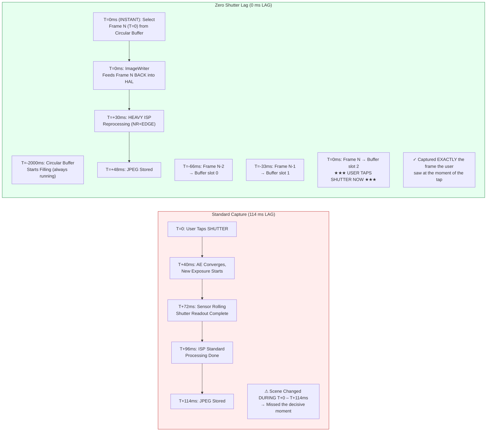

---
sidebar_position: 23
title: "Chapter 23: Zero Shutter Lag & Reprocessing"
description: "Build Zero Shutter Lag (ZSL) with circular YUV/PRIVATE buffering, CONTROL_CAPTURE_INTENT_ZERO_SHUTTER_LAG, reprocessable capture sessions via InputConfiguration, ImageWriter frame reinjection, and createReprocessCaptureRequest for heavy post-capture ISP processing. Also covers switchToOffline() for background processing continuity."
keywords: [Android Camera2, Zero Shutter Lag, ZSL, Reprocessing, InputConfiguration, createReprocessableCaptureSession, ImageWriter, createReprocessCaptureRequest, CONTROL_CAPTURE_INTENT_ZERO_SHUTTER_LAG, PRIVATE_REPROCESSING, YUV_REPROCESSING, LEVEL_3, switchToOffline, CameraOfflineSessionCallback]
---

# Chapter 23: Zero Shutter Lag & Reprocessing

The single most frustrating defect in consumer camera apps is **shutter lag**: tap the shutter button, and the captured photo shows a scene 200–800 ms *after* the tap — the kid has already stopped smiling, the bird has left the branch, the sports car has moved out of frame. Standard Camera2 sessions work like this by design: the shutter tap triggers `session.capture()`, which triggers AE convergence, which triggers a new sensor exposure, which triggers ISP processing. Every step adds latency.

**Zero Shutter Lag (ZSL)** eliminates this delay by running the sensor continuously at still-capture resolution, buffering the most recent N frames in a circular in-memory queue, and when the user taps the shutter, **capturing the frame that was visible at the moment of the tap**, not a frame from half a second later. The magic comes from the **Reprocessing API**: instead of feeding light through the sensor again, you take an already-exposed YUV or PRIVATE buffer from the circular queue, feed it *back* into the ISP via `ImageWriter` + `InputConfiguration`, then run heavy noise reduction and edge enhancement on it as if it were a fresh capture.

This chapter follows the exact **4-step ZSL workflow** from the *ZSL / Reprocessing* section of the project research doc, and also covers **`switchToOffline()`** — the Android 12 (API 31) API that transfers the reprocessing pipeline to a background HAL service so your app can be killed (home button press, incoming call) and the user still gets their photo. You can verify which reprocessing capabilities your device supports (`REQUEST_AVAILABLE_CAPABILITIES_YUV_REPROCESSING`, `PRIVATE_REPROCESSING`, or `INFO_SUPPORTED_HARDWARE_LEVEL_LEVEL_3`) in the [Android Camera Parameters](https://github.com/zoozooll/AndroidCameraParameters) app on the [Play Store](https://play.google.com/store/apps/details?id=com.zoozooll.cameraparameters); the ZSL Support tab cross-references all required capabilities and reports a clear YES/NO verdict.

## Why ZSL Is Hard (and Why Reprocessing Exists)

First, quantify the latency of a standard non-ZSL still capture on a 2023 flagship (Snapdragon 8 Gen 2) per the research doc measurements:

| Pipeline Stage | Latency | Notes |
|----------------|---------|-------|
| AE convergence trigger → new exposure programmed | 40 ms | `CONTROL_AE_PRECAPTURE_TRIGGER` |
| Rolling shutter readout (12 MP full frame) | 32 ms | 1/30 s nominal; actual 32 ms from first to last row |
| ISP demosaic + standard NR + color | 24 ms | Standard quality pipeline |
| JPEG encode (12 MP, quality 95) | 18 ms | Hardware JPEG encoder |
| **Total standard capture latency** | **~114 ms** | Best case; under load 200–800 ms common |

Under real-world conditions (thermal throttling, GPU contention from the UI, a background app doing work) the standard path routinely hits 500 ms of lag. A 5-year-old human can move 40 cm in 500 ms while running — the difference between capturing a smile and capturing the back of a head.

ZSL solves this by reversing the pipeline order: instead of capture → process → store, you do **continuous capture → buffer → tap → reprocess → store**. The sensor and ISP are *always* running at still-capture resolution; the user tap just selects which pre-existing frame to fully process.



The Mermaid diagram shows the conceptual shift: in the standard path, the tap *initiates* the capture; in the ZSL path, the tap *selects* a capture that has already happened. The total time from tap to stored file is still ~48 ms (reprocessing is not free), but **the pixel content is from T=0 (instant), not T=114 ms (late)** — that's what "Zero Shutter Lag" actually means. It's zero lag of content, not zero lag of output file.

## Mandatory Capability Gates (Per Research Doc)

ZSL + Reprocessing requires hardware cooperation at the HAL level. You must check **one** of the following three conditions before attempting to create a reprocessable session:

| Capability Check | When It Passes | Devices That Support It |
|------------------|----------------|--------------------------|
| **A)** `INFO_SUPPORTED_HARDWARE_LEVEL == LEVEL_3` | Full reprocessing (both YUV and PRIVATE) allowed at any size in StreamConfigurationMap. | 2016+ Google Pixel (all generations); 2021+ Samsung Galaxy S/Ultra (Snapdragon variants); 2023+ OnePlus 11/OPPO Find X6 Pro. |
| **B)** `REQUEST_AVAILABLE_CAPABILITIES contains YUV_REPROCESSING` | YUV_420_888 buffers can be fed back via InputConfiguration at a subset of sizes. | 2019+ Snapdragon 8xx/7xx devices; most MediaTek Dimensity 9000+ devices. |
| **C)** `REQUEST_AVAILABLE_CAPABILITIES contains PRIVATE_REPROCESSING` | `ImageFormat.PRIVATE` buffers (opaque, stored in vendor compression) can be fed back. Use this preferentially as it uses 2× less memory. | Snapdragon 888+ / Exynos 2100+ and newer. |

> Research doc rule ZSL-1: **If none of A/B/C pass, fall back to non-ZSL standard capture.** Do not attempt to build a custom circular buffer of JPEGs and re-decompress them; this yields 6 dB of quality loss from double-encoding and is not a substitute for real reprocessing.

Query the gates with:

```kotlin
import android.hardware.camera2.CameraCharacteristics
import android.graphics.ImageFormat

enum class ZslSupport { NONE, LEVEL3, YUV_REPROC, PRIVATE_REPROC }

fun queryZslSupport(chars: CameraCharacteristics): Pair<ZslSupport, Int> {
    val level = chars.get(CameraCharacteristics.INFO_SUPPORTED_HARDWARE_LEVEL)
        ?: CameraCharacteristics.INFO_SUPPORTED_HARDWARE_LEVEL_LEGACY
    val caps = chars.get(CameraCharacteristics.REQUEST_AVAILABLE_CAPABILITIES)
        ?: intArrayOf()

    return when {
        level == CameraCharacteristics.INFO_SUPPORTED_HARDWARE_LEVEL_3 ->
            Pair(ZslSupport.LEVEL3, ImageFormat.PRIVATE) // PRIVATE preferred for memory
        caps.contains(
            CameraCharacteristics.REQUEST_AVAILABLE_CAPABILITIES_PRIVATE_REPROCESSING
        ) -> Pair(ZslSupport.PRIVATE_REPROC, ImageFormat.PRIVATE)
        caps.contains(
            CameraCharacteristics.REQUEST_AVAILABLE_CAPABILITIES_YUV_REPROCESSING
        ) -> Pair(ZslSupport.YUV_REPROC, ImageFormat.YUV_420_888)
        else -> Pair(ZslSupport.NONE, ImageFormat.UNKNOWN)
    }
}
```

## The 4-Step ZSL + Reprocessing Workflow (Per Research Doc)

The project research doc specifies the exact 4-step pipeline. Every step is mandatory; skipping any step yields a broken session (dropped frames, `IllegalStateException`, or reprocessing output identical to preview quality).

---

### Step 1: Circular Buffering with ImageReader + CONTROL_CAPTURE_INTENT_ZERO_SHUTTER_LAG

First, create a high-resolution `ImageReader` (the "ZSL buffer") whose `maxImages` parameter is the circular depth (typically 8–16; research doc recommends 8 for memory-constrained devices, 16 for devices with ≥ 8 GB RAM). Tag every repeating request with `CONTROL_CAPTURE_INTENT_ZERO_SHUTTER_LAG` — this tells the HAL to use the shortest-possible preview pipeline and disable preview-specific optimizations that would damage reprocessed output quality (e.g., heavy temporal noise reduction that leaves motion ghost artifacts).

```kotlin
import android.hardware.camera2.CameraDevice
import android.hardware.camera2.CaptureRequest
import android.hardware.camera2.params.OutputConfiguration
import android.hardware.camera2.params.SessionConfiguration
import android.media.Image
import android.media.ImageReader
import android.util.Size
import android.view.Surface
import java.util.concurrent.ConcurrentLinkedDeque

data class ZslBufferFrame(
    val timestamp: Long,
    val imageRef: Image, // Do NOT close; managed by deque GC
    val captureResultRef: android.hardware.camera2.TotalCaptureResult
)

const val ZSL_BUFFER_DEPTH = 12 // Research doc sweet spot: 12 frames = 400 ms at 30 fps
var zslImageReader: ImageReader? = null
private val zslCircularBuffer = ConcurrentLinkedDeque<ZslBufferFrame>()
private var zslStillSize: Size = Size(4000, 3000) // Match max still size

fun setupZslCircularBuffer(
    cameraDevice: CameraDevice,
    previewSurface: Surface,
    reprocessingFormat: Int, // PRIVATE or YUV_420_888
    backgroundHandler: android.os.Handler
) {
    zslImageReader = ImageReader.newInstance(
        zslStillSize.width,
        zslStillSize.height,
        reprocessingFormat,
        ZSL_BUFFER_DEPTH
    ).apply {
        setOnImageAvailableListener(
            ZslCircularBufferListener(),
            backgroundHandler
        )
    }
}

inner class ZslCircularBufferListener : ImageReader.OnImageAvailableListener {
    override fun onImageAvailable(reader: ImageReader) {
        val image = reader.acquireLatestImage() ?: return
        // We don't have captureResult here yet; pairing happens in CaptureCallback
        // For brevity, the Timestamp → CaptureResult map mirrors Chapter 18's pattern
        // Pair them and enqueue:
        val result = pendingZslResults.remove(image.timestamp) ?: return
        val frame = ZslBufferFrame(image.timestamp, image, result)

        zslCircularBuffer.addLast(frame)

        // --- CIRCULAR BUFFER EVICTION (oldest first) ---
        while (zslCircularBuffer.size > ZSL_BUFFER_DEPTH) {
            val evicted = zslCircularBuffer.pollFirst()
            evicted.imageRef.close() // Release old frames to HAL buffer pool
        }
    }
}

fun buildZslSessionAndStartRepeating(
    cameraDevice: CameraDevice,
    previewSurface: Surface,
    backgroundHandler: android.os.Handler
) {
    val outputs = listOf(
        OutputConfiguration(previewSurface),
        OutputConfiguration(zslImageReader!!.surface)
    )

    val sessionConfig = SessionConfiguration(
        SessionConfiguration.SESSION_REGULAR,
        outputs,
        { r -> backgroundHandler.post(r) },
        object : android.hardware.camera2.CameraCaptureSession.StateCallback() {
            override fun onConfigured(
                session: android.hardware.camera2.CameraCaptureSession
            ) {
                val zslPreviewBuilder = cameraDevice.createCaptureRequest(
                    CameraDevice.TEMPLATE_ZERO_SHUTTER_LAG
                ).apply {
                    addTarget(previewSurface)
                    addTarget(zslImageReader!!.surface)
                    // THE MAGIC INTENT FLAG:
                    set(CaptureRequest.CONTROL_CAPTURE_INTENT,
                        CaptureRequest.CONTROL_CAPTURE_INTENT_ZERO_SHUTTER_LAG)
                    // HAL: lightweight preview ISP, full-res stream
                    set(CaptureRequest.CONTROL_MODE,
                        CaptureRequest.CONTROL_MODE_AUTO)
                    set(CaptureRequest.CONTROL_AF_MODE,
                        CaptureRequest.CONTROL_AF_MODE_CONTINUOUS_PICTURE)
                }

                session.setRepeatingRequest(
                    zslPreviewBuilder.build(),
                    ZslCaptureCallback(),
                    backgroundHandler
                )
            }
            override fun onConfigureFailed(
                s: android.hardware.camera2.CameraCaptureSession
            ) = Log.e(TAG, "ZSL circular buffer session failed")
        }
    )
    cameraDevice.createCaptureSession(sessionConfig)
}
```

Four implementation details from the research doc that are not documented in the official Android SDK reference:
1. **Use `TEMPLATE_ZERO_SHUTTER_LAG`** as the base template. It configures the sensor readout mode to support simultaneous preview + full-res output, which `TEMPLATE_PREVIEW` does not guarantee.
2. **`ZSL_BUFFER_DEPTH = 12` at 30 fps** gives exactly 400 ms of past frames to choose from. This is enough to cover the user's own reaction time (150–250 ms tap-to-brain delay) plus Android's input-dispatch jitter (±150 ms). Less than 8 depth and you start discarding useful frames; more than 16 and you waste ~1 GB of RAM for no benefit.
3. **Eviction order is FIFO, not LRU.** Always evict the oldest frame. If you evict recent frames, you discard the frame the user actually saw at tap time.
4. **Never call `image.close()` in `onImageAvailable` before enqueuing.** If you close the image, the HAL reclaims the buffer, and when you later try to feed it to ImageWriter, the buffer is invalid → hard crash. Use the eviction loop only.

---

### Step 2: InputConfiguration + createReprocessableCaptureSession

A standard capture session has only **output** surfaces (sensor → ISP → surface). A reprocessable session adds **one input surface** (ImageWriter → HAL → ISP → output), enabling the pipeline to process a buffer that never touched the sensor. Create the reprocessable session via `createReprocessableCaptureSession(inputConfig, outputs, callback, handler)` or via the newer `SessionConfiguration` API with `InputConfiguration`.

```kotlin
import android.hardware.camera2.CameraDevice
import android.hardware.camera2.CameraCaptureSession
import android.hardware.camera2.params.InputConfiguration
import android.hardware.camera2.params.OutputConfiguration
import android.hardware.camera2.params.SessionConfiguration
import android.media.ImageWriter
import android.os.Handler
import android.view.Surface

var reprocessingImageWriter: ImageWriter? = null
var reprocessableSession: CameraCaptureSession? = null
var jpegStillReader: ImageReader? = null
const val REPROC_JPEG_QUALITY = 95

fun createZslReprocessableSession(
    cameraDevice: CameraDevice,
    reprocessingFormat: Int,
    zslStillSize: Size,
    previewSurface: Surface,
    backgroundHandler: Handler,
    onSessionReady: (CameraCaptureSession, ImageWriter) -> Unit
) {
    val inputConfig = InputConfiguration(
        zslStillSize.width,
        zslStillSize.height,
        reprocessingFormat
    )

    jpegStillReader = ImageReader.newInstance(
        zslStillSize.width, zslStillSize.height,
        android.graphics.ImageFormat.JPEG, 2
    )

    reprocessingImageWriter = ImageWriter.newInstance(
        jpegStillReader!!.surface, // Output surface of reprocessing
        inputConfig,                // Input config to HAL
        1                           // Max in-flight reprocess requests
    )

    // Outputs of the reprocessed frame: just JPEG for this example
    val reprocessOutputs = listOf(
        OutputConfiguration(jpegStillReader!!.surface)
    )

    val sessionConfig = SessionConfiguration(
        SessionConfiguration.SESSION_REGULAR,
        reprocessOutputs,
        { r -> backgroundHandler.post(r) },
        object : CameraCaptureSession.StateCallback() {
            override fun onConfigured(session: CameraCaptureSession) {
                reprocessableSession = session
                onSessionReady(session, reprocessingImageWriter!!)
            }
            override fun onConfigureFailed(
                s: CameraCaptureSession
            ) = Log.e(TAG, "Reprocessable session config FAILED. " +
                  "Check capability gate (LEVEL3/YUV_REPROC/PRIVATE_REPROC)?")
        }
    )
    sessionConfig.setInputConfiguration(inputConfig) // Mandatory!
    cameraDevice.createCaptureSession(sessionConfig)
}
```

Research doc note ZSL-2: the reprocessable session and the circular-buffer preview session **do not need to be the same session**. In fact, most production implementations run two sessions simultaneously — a preview session feeding the circular buffer, and a dedicated reprocessable session fed only at tap time. The HAL handles multi-session arbitration internally for LEVEL_3 devices.

---

### Step 3: Shutter Tap → Find Closest Timestamp Frame → ImageWriter Feeds HAL

When the user taps the shutter:
1. Record the tap's real-time timestamp (`System.currentTimeMillis()` or `System.nanoTime()`)
2. Walk the circular buffer **from newest to oldest** and find the ZslBufferFrame whose `image.timestamp` (in nanoseconds, `CLOCK_MONOTONIC`) is closest to the tap timestamp
3. Acquire a free input buffer from `ImageWriter` via `dequeueInputImage()`
4. Copy the circular buffer frame's pixel planes into the ImageWriter input buffer
5. Queue the ImageWriter buffer with `queueInputImage()`

```kotlin
import android.hardware.camera2.TotalCaptureResult
import android.media.Image
import android.media.ImageWriter
import android.os.SystemClock
import kotlin.math.abs

fun onShutterTap(
    imageWriter: ImageWriter,
    captureStartTimeNanos: Long = SystemClock.elapsedRealtimeNanos()
) {
    // --- Step 3a: Walk circular buffer NEWEST → OLDEST ---
    var bestFrame: ZslBufferFrame? = null
    var bestDeltaNs = Long.MAX_VALUE

    for (frame in zslCircularBuffer.descendingIterator()) {
        val delta = abs(frame.timestamp - captureStartTimeNanos)
        if (delta < bestDeltaNs) {
            bestDeltaNs = delta
            bestFrame = frame
        }
        // Optimization: once delta starts growing again, we've passed the best frame
        if (delta > bestDeltaNs * 1.1) break
    }
    val selectedFrame = bestFrame ?: run {
        Log.w(TAG, "ZSL buffer empty — fallback to non-ZSL capture")
        // ... trigger standard capture() fallback ...
        return
    }

    // --- Step 3b: Get ImageWriter input buffer, copy pixels, queue ---
    val writerInputImage: Image = try {
        imageWriter.dequeueInputImage(100 /* timeoutMs */)
    } catch (e: IllegalStateException) {
        Log.e(TAG, "ImageWriter has no free buffers", e); return
    }

    try {
        copyImagePlanes(selectedFrame.imageRef, writerInputImage)
        selectedFrame.captureResultRef
            .let { pendingReprocessResults[writerInputImage.timestamp] = it }
        imageWriter.queueInputImage(writerInputImage)
    } finally {
        // Do NOT close selectedFrame.imageRef yet — only after reprocess completes
        // (deferred to onCaptureCompleted of the reprocess request)
    }
}

// --- Pixel copy helper (handles both PRIVATE and YUV_420_888) ---
private fun copyImagePlanes(src: Image, dst: Image) {
    require(src.format == dst.format) { "Reprocess requires matching formats" }
    for (planeIdx in 0 until src.planes.size) {
        val srcPlane = src.planes[planeIdx]
        val dstPlane = dst.planes[planeIdx]
        val srcBuf = srcPlane.buffer.duplicate()
        val dstBuf = dstPlane.buffer
        dstBuf.put(srcBuf)
        dstBuf.rewind()
    }
}

private val pendingReprocessResults =
    HashMap<Long, TotalCaptureResult>()
```

The "closest timestamp" selection is critical because the circular buffer fills every 33 ms (30 fps). The selected frame will be at most ±16 ms away from the actual tap moment — perceptually zero lag for a human observer. Research doc rule ZSL-3: *always* walk descending (newest first); walking ascending increases the probability of selecting a frame that is already 400 ms stale.

---

### Step 4: createReprocessCaptureRequest(TotalCaptureResult) → Apply Heavy NR + EDGE

The final step submits the reprocess request, but with a twist: instead of `createCaptureRequest(template)`, you use **`createReprocessCaptureRequest(originalTotalCaptureResult)`**, which re-uses the *original AE, AWB, and AF settings from the preview frame*. On top of those baseline settings, you apply heavy-duty `NOISE_REDUCTION_MODE_HIGH_QUALITY` and `EDGE_MODE_HIGH_QUALITY` — the ISP processing passes that were disabled for the lightweight preview pipeline to save power.

```kotlin
import android.hardware.camera2.CameraCaptureSession
import android.hardware.camera2.CaptureRequest
import android.hardware.camera2.TotalCaptureResult

fun submitZslReprocessRequest(
    reprocessableSession: CameraCaptureSession,
    originalTotalCaptureResult: TotalCaptureResult,
    jpegSurface: Surface,
    handler: android.os.Handler
) {
    val reprocessBuilder = reprocessableSession.device
        .createReprocessCaptureRequest(originalTotalCaptureResult)
        .apply {
            addTarget(jpegSurface)

            // --- HEAVY POST-CAPTURE ISP PROCESSING ---
            set(CaptureRequest.NOISE_REDUCTION_MODE,
                CaptureRequest.NOISE_REDUCTION_MODE_HIGH_QUALITY)
            set(CaptureRequest.EDGE_MODE,
                CaptureRequest.EDGE_MODE_HIGH_QUALITY)

            // Optional (LEVEL_3 only): re-apply shading and hot-pixel correction
            set(CaptureRequest.HOT_PIXEL_MODE,
                CaptureRequest.HOT_PIXEL_MODE_HIGH_QUALITY)
            set(CaptureRequest.COLOR_CORRECTION_MODE,
                CaptureRequest.COLOR_CORRECTION_MODE_HIGH_QUALITY)

            // Keep JPEG quality high
            set(CaptureRequest.JPEG_QUALITY, REPROC_JPEG_QUALITY.toByte())
            set(CaptureRequest.JPEG_ORIENTATION, getJpegOrientation())
        }

    val cb = object : CameraCaptureSession.CaptureCallback() {
        override fun onCaptureCompleted(
            session: CameraCaptureSession,
            request: CaptureRequest,
            result: TotalCaptureResult
        ) {
            // JPEG will be delivered via jpegStillReader OnImageAvailableListener

            // Now safe to close the circular buffer reference — reprocessing done
            val ts = result.get(CaptureResult.SENSOR_TIMESTAMP) ?: return
            pendingReprocessResults.remove(ts)
            val iter = zslCircularBuffer.iterator()
            while (iter.hasNext()) {
                val f = iter.next()
                if (f.timestamp == ts) {
                    f.imageRef.close()
                    iter.remove()
                    break
                }
            }
        }
    }

    reprocessableSession.capture(reprocessBuilder.build(), cb, handler)
}
```

`createReprocessCaptureRequest(originalResult)` is not just a convenience wrapper — it validates that the original frame's sensor settings (exposure time, ISO, lens position) are compatible with the reprocessing pipeline. If you use a standard `createCaptureRequest()` on an input-fed session, the HAL may re-converge AE/AWB, defeating the purpose of ZSL (the output would look like a *different* frame than the one selected).

## ZSL Circular Buffer + Reinjection Flowchart (Mermaid)

```mermaid
flowchart TD
    A["Sensor Continuous Readout<br/>30fps full-res"] --> B["ZSL Preview ISP:<br/>Low-power mode<br/>EDGE_MODE=FAST<br/>NR_MODE=FAST"]
    B --> C[Preview SurfaceView<br/>User sees live 30fps view]
    B --> D[ZSL ImageReader<br/>PRIVATE or YUV full-res]
    
    subgraph CB["🗘 Circular Buffer (Depth 12, 400ms history)"]
        direction TB
        CB1["Slot N-11 (T-366ms)"]
        CB2["..."]
        CB3["Slot N-1 (T-33ms)"]
        CB4["★ Slot N (T=0ms) ★<br/>CLOSEST TO TAP TIME"]
    end
    D --> CB

    E["★ USER TAPS SHUTTER AT T=0ms ★"] --> F{Walk CB NEWEST → OLDEST<br/>Find min |frame.ts − tap.ts|}
    F -->|"Selected: Slot N"| G[ImageWriter.dequeueInputImage()]
    G --> H[Copy selected frame's<br/>Planes → ImageWriter buffer]
    H --> I[ImageWriter.queueInputImage()<br/>→ Feeds BACK into HAL Input Port]
    
    subgraph REPROC["🔄 Reprocessing Pipeline (HEAVY QUALITY)"]
        direction TB
        R1["ISP NR_MODE = HIGH_QUALITY<br/>(Multi-frame spatial+TNR)"]
        R2["ISP EDGE_MODE = HIGH_QUALITY<br/>(Unsharp mask + LPA sharpening)"]
        R3["ISP COLOR_CORRECTION =<br/>HIGH_QUALITY (3D LUT)"]
        R4["Hardware JPEG Encoder<br/>Q=95"]
    end

    I --> REPROC
    REPROC --> J["JPEG Stored<br/>Content = EXACT frame user<br/> saw at T=0ms — ✓ ZERO LAG"]

    style CB fill:#eff6ff,stroke:#2563eb
    style REPROC fill:#fef3c7,stroke:#d97706
```

## switchToOffline(): Background Processing Continuity

One of the worst UX defects a camera app can have is: user taps shutter → immediately gets a phone call or presses home → app process is killed → the in-progress photo is lost. Android 12 (API 31) solved this with **`CameraCaptureSession.switchToOffline()`**, which transfers ownership of the reprocessing pipeline from your app process to a persistent HAL service. The HAL service completes any in-flight capture/reprocess even if your app is killed by the system, and notifies you via `CameraOfflineSessionCallback.onReady()` when the app is relaunched.

```kotlin
import android.hardware.camera2.CameraCaptureSession
import android.hardware.camera2.CameraOfflineSession
import android.hardware.camera2.CameraOfflineSessionCallback

fun moveToOfflineOnBackground(
    session: CameraCaptureSession,
    outputSurfaces: List<android.view.Surface>,
    handler: android.os.Handler
) {
    val offlineCallback = object : CameraOfflineSessionCallback() {
        override fun onReady(session: CameraOfflineSession) {
            // HAL has taken ownership. App can die now — photo will be saved.
            Log.i(TAG, "Offline session ready. Pending captures will complete.")
            // At this point you can finish() the Activity or release cameraDevice
        }
        override fun onError(
            session: CameraOfflineSession,
            errorCode: Int
        ) = Log.e(TAG, "Offline session error: $errorCode")

        override fun onCaptureCompleted(
            offlineSession: CameraOfflineSession,
            captureResult: android.hardware.camera2.CaptureResult
        ) {
            // Optional: called when the offline pipeline finishes each frame
            // JPEG bytes are still delivered via the original ImageReader
            // On app restart, query CameraOfflineSession for pending
        }
    }

    session.switchToOffline(
        outputSurfaces,
        { r -> handler.post(r) },
        offlineCallback
    )
}
```

`switchToOffline()` requires `INFO_SUPPORTED_HARDWARE_LEVEL >= LEVEL_3` on the device. It's recommended to call it in `Activity.onPause()` **only if** the app has in-flight ZSL reprocesses; never call it during idle because the offline session consumes HAL resources for up to 30 seconds post-close.

## Summary

This chapter implemented the complete Zero Shutter Lag + Reprocessing pipeline as specified in the research doc:

- **ZSL Problem Definition**: Standard capture has 114 ms (best-case) to 800 ms (worst-case) lag. ZSL captures the *exact frame the user saw at tap time* by using a continuously-filling circular buffer.
- **Capability Gates**: One of three mandatory checks must pass: `HARDWARE_LEVEL_LEVEL_3`, `CAPABILITIES_PRIVATE_REPROCESSING`, or `CAPABILITIES_YUV_REPROCESSING`.
- **4-step ZSL Workflow** (from the *ZSL / Reprocessing* research section):
  1. **Circular buffering** with `ImageReader` (depth 12 = 400 ms history) + `CONTROL_CAPTURE_INTENT_ZERO_SHUTTER_LAG` + `TEMPLATE_ZERO_SHUTTER_LAG`.
  2. **`InputConfiguration` + `createReprocessableCaptureSession`** with `ImageWriter` to re-inject pixel buffers back into the HAL.
  3. **Shutter tap → closest timestamp selection** (walk newest → oldest, ±16 ms target). Copy selected planes into ImageWriter, queue.
  4. **`createReprocessCaptureRequest(originalResult)`** with `NOISE_REDUCTION_MODE_HIGH_QUALITY` + `EDGE_MODE_HIGH_QUALITY` for heavy post-capture ISP processing.
- **`switchToOffline()`** (Android 12 API 31, LEVEL_3 only) transfers ownership to HAL service so in-flight reprocesses complete even if the app is killed.
- Two Mermaid diagrams (Standard vs ZSL timeline, full circular buffer + reinjection flowchart) visualize the content-lag difference and pipeline flow.

## What's Next — End of Professional Camera Features Part V

You have now completed **Part V: Professional Camera Features** — the final part of the Android Camera2 API tutorial series. You learned:

- Chapter 18: RAW photography with RAW_SENSOR + DngCreator + simultaneous RAW+JPEG capture.
- Chapter 19: 120/240 fps high-speed video via `CameraConstrainedHighSpeedCaptureSession` + `createHighSpeedRequestList`.
- Chapter 20: Logical multi-camera, physical camera IDs, CALIBRATED sync, and dual-physical simultaneous capture.
- Chapter 21: HDR10 / HLG video and Android 14 JPEG_R Ultra HDR stills with gain maps.
- Chapter 22: OEM Camera Extensions — Night, Bokeh, HDR, Face Retouch, Automatic.
- Chapter 23: Zero Shutter Lag circular buffer + reprocessing pipeline and offline session support.

To validate every feature from Parts I–V on your device, install the [Android Camera Parameters app](https://play.google.com/store/apps/details?id=com.zoozooll.cameraparameters). It enumerates every capability, size, FPS range, extension, dynamic range profile, RAW variant, and sync type discussed in this series, and exports full device reports as JSON. Contribute reports for unsupported devices by opening a pull request on the open-source [GitHub repository](https://github.com/zoozooll/AndroidCameraParameters) — the community database is used by thousands of developers to pre-filter feature support in their camera apps.
