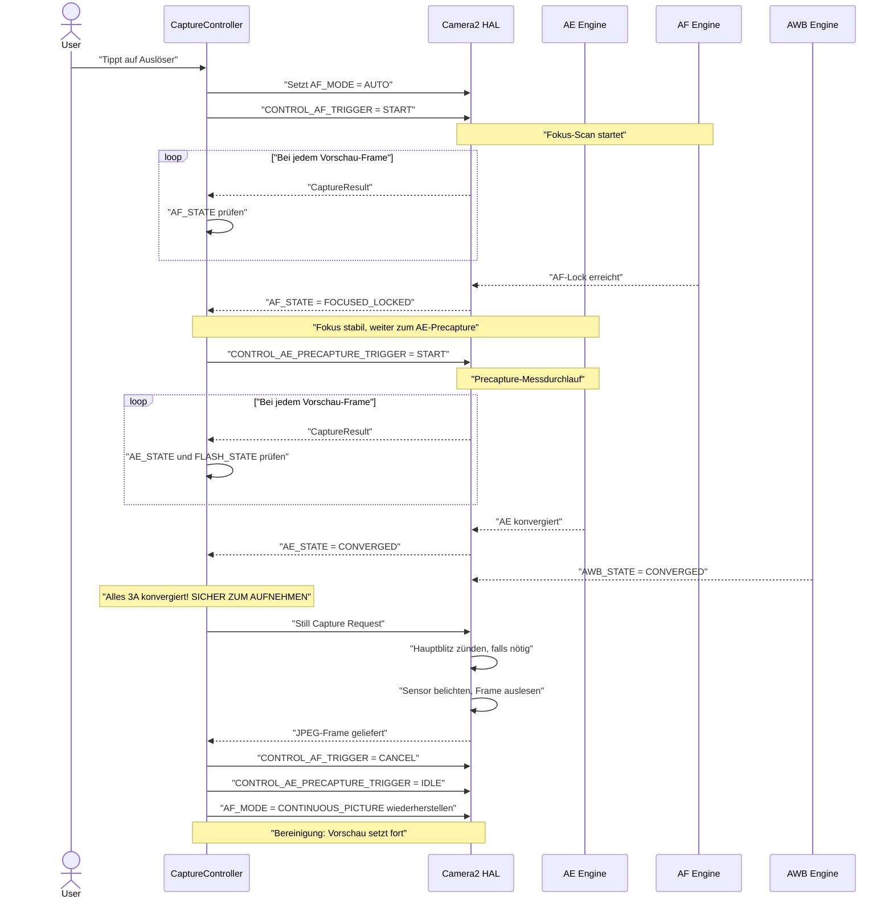
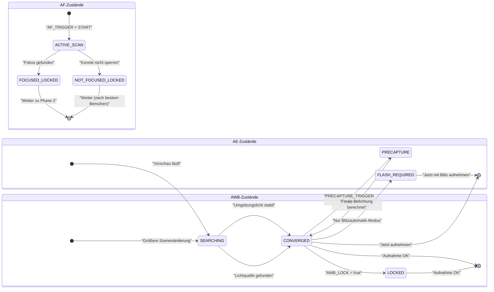

# Kapitel 17: Die 3A-Pipeline

Wir haben **AE** (Belichtungsautomatik, Kapitel 13–14), **AF** (Autofokus, Kapitel 15) und **AWB** (Automatischer Weißabgleich, Kapitel 16) als unabhängige Systeme untersucht. Echte Foto-Apps müssen jedoch alle drei vor jedem Drücken des Auslösers koordinieren – und dabei spielen die *Reihenfolge und das Timing* eine entscheidende Rolle.

Eine naive Implementierung, die `capture()` sofort abfeuert, wenn der Benutzer auf den Auslöser tippt, führt zu inkonsistenten Ergebnissen: Mal ist der Fokus scharf, mal nicht; mal blitzt es, mal nicht; mal führt ein AWB mitten im Durchlauf zu einem Grünstich im Foto. Eine zuverlässige 3A-Pipeline beseitigt all das.

Die Implementierung der 3A-Pipeline in diesem Kapitel ist identisch mit dem Ablauf, der intern in der [App Android Camera Parameters](https://github.com/zoozooll/AndroidCameraParameters) verwendet wird und der Sequenz entspricht, die in den Forschungsdokumenten zur Android-Kameraarchitektur und in Fachartikeln zur professionellen Camera2-Entwicklung beschrieben wird.

---

## Die vollständige 3A-Orchestrierungssequenz (Überblick)

Bevor wir in die einzelnen Subsysteme eintauchen, lassen Sie uns den kompletten Zustandsfluss visualisieren. Dies ist eine echte Produktionssequenz – keine Vereinfachung.



**Jeder Schritt ist blockierend.** Sie fahren erst mit Schritt N+1 fort, wenn der HAL den für Schritt N erforderlichen Zustand bestätigt hat. Überspringen Sie niemals Schritte – so vermeiden Sie, eine App auszuliefern, die zeitweise unscharfe Fotos, schlechte Blitzbelichtungen oder blaustichige Bilder liefert.

---

## Tiefer Einblick in AE (Belichtungsautomatik)

AE ist das komplexeste der drei A's, da es nicht nur Verschlusszeit+ISO umfasst, sondern auch die **Blitzmessung** und den **Precapture-Trigger**.

### AE-Modi: CONTROL_AE_MODE

| Modus | Verhalten | Blitz-Unterstützung |
|------|----------|--------------|
| `OFF` | Vollständig manuell (behandelt in Kap. 14) | Keine |
| `ON` | Belichtungsautomatik, **Blitz deaktiviert** (dauerhaft aus) | Nein |
| `ON_AUTO_FLASH` | Belichtungsautomatik, **Blitzautomatik** – HAL zündet Blitz nur bei wenig Licht | Auto (häufigster Standard) |
| `ON_ALWAYS_FLASH` | Belichtungsautomatik, **Blitz zündet immer** (Aufhellblitz für Porträts bei Gegenlicht) | Immer |
| `ON_AUTO_FLASH_REDEYE` | Belichtungsautomatik + Blitz + Rote-Augen-Reduzierung (zündet Vorblitz-Sequenz zum Verengen der Pupillen) | Auto + Rote Augen |
| `ON_EXTERNAL_FLASH` | Blitz für externes Kamerazubehör | Nur extern (selten) |

**Der Standard für eine normale Kamera-App** ist `ON_AUTO_FLASH`. Benutzer erwarten, dass das Telefon "weiß", wann der Blitz gezündet werden muss.

### AE-Zustände & Precapture-Trigger

Wie AF meldet auch AE seinen Zustand über `CaptureResult.CONTROL_AE_STATE`:

| Zustand | Bedeutung |
|-------|---------|
| `INACTIVE` (0) | AE deaktiviert oder noch nicht gestartet |
| `SEARCHING` (1) | Sucht aktiv nach der korrekten Belichtung |
| `CONVERGED` (2) | Belichtung ist stabil. In Blitzmodi bedeutet dies, dass die *Umgebungsbelichtung* konvergiert ist, aber noch kein Vorblitz-Durchlauf stattgefunden hat. |
| `LOCKED` (3) | Belichtung explizit über `CONTROL_AE_LOCK = true` gesperrt |
| `FLASH_REQUIRED` (4) | Auf Umgebungslicht konvergiert, und der HAL hat entschieden, dass ein **Blitz für eine korrekte Aufnahme erforderlich ist** |
| `PRECAPTURE` (5) | **Wichtiger Zustand.** Der Precapture-Durchlauf läuft – der HAL misst (und zündet Vorblitz-Impulse, falls Blitz benötigt wird), um die endgültige Belichtung + Blitzleistung für die Aufnahme zu berechnen. |

### Warum der Precapture-Trigger wichtig ist

Die AE-Engine, die auf Vorschau-Frames läuft, arbeitet nur *näherungsweise*. Die Vorschau-Pipeline verwendet kleinere Puffer, eine Verarbeitung mit geringerer Bittiefe und berücksichtigt nicht den massiven Lichtbeitrag eines Hauptblitzes, der zum Zeitpunkt der Aufnahme zündet.

`CONTROL_AE_PRECAPTURE_TRIGGER = START` sagt dem HAL:

> "Ich bin im Begriff, ein echtes Standbild aufzunehmen. Hör auf zu schätzen. Führe die hochpräzise Mess-Pipeline aus. Wenn ich mich in einem Blitzautomatik-Modus befinde, zünde einen oder mehrere schwache Vorblitze, miss die Reflexion und berechne die exakte finale Verschlusszeit/ISO/Blitzleistung für die Aufnahme."

**Das Überspringen des Precapture führt dazu, dass Blitzfotos zufällig über- oder unterbelichtet sind.** Der HAL hatte schlichtweg keine Chance, den Blitz in Echtzeit einzumessen.

### AE-Bereiche (Spotmessung)

Genau wie `CONTROL_AF_REGIONS` für den Fokus legt `CONTROL_AE_REGIONS` fest, *wo in der Szene* gemessen werden soll. Ein Tippen auf den Sucher für ein Porträt sollte gleichzeitig denselben Bereich auf die AE anwenden – das Gesicht erhält sowohl Fokus-Priorität ALS AUCH Belichtungs-Priorität und wird nicht basierend auf dem hellen Himmel im Hintergrund eingemessen.

```kotlin
// Verwenden Sie dasselbe MeteringRectangle-Array sowohl für AF- als auch für AE-Bereiche
val focusWeightedRegions = arrayOf(userTapRegion)
builder.set(CaptureRequest.CONTROL_AF_REGIONS, focusWeightedRegions)
builder.set(CaptureRequest.CONTROL_AE_REGIONS, focusWeightedRegions)
```

**Gewichtung:** Jedes `MeteringRectangle` hat eine Gewichtung (`weight`, 0–1000). Bereiche mit höherer Gewichtung beeinflussen die Messung stärker. Ein Modus für "Spotmessung" verwendet ein Rechteck mit hoher Gewichtung (1000). Die "Matrix- / Mehrfeldmessung" verwendet viele Rechtecke mit geringer Gewichtung, die über den Frame verteilt sind.

---

## AWB: Der stille Partner des Trios

Der automatische Weißabgleich (AWB) konvergiert in den meisten Szenen frühzeitig und bleibt stabil – weshalb er oft nur als Nebensache betrachtet wird. Seine Bedeutung für die Farbgenauigkeit ist jedoch entscheidend, und er *kann* sich noch in der Suche befinden, wenn Sie zur Aufnahme bereit sind.

### Rückblick auf AWB-Zustände

| AWB-Zustand | Aufnahmeentscheidung |
|-----------|------------------|
| `INACTIVE` (AWB_MODE = OFF) | OK zum Fortfahren (manuelle Verstärkungswerte) |
| `SEARCHING` | **Warten.** Farben können sich noch verschieben. Normalerweise < 500 ms nach einer größeren Szenenänderung. |
| `CONVERGED` | ✅ Perfekt – fortfahren |
| `LOCKED` | ✅ Ebenfalls perfekt – explizit über `CONTROL_AWB_LOCK = true` gesperrt |

### Kopplung von AWB-Lock mit AE/AF-Locks

Für kritische Studio- oder Produktfotografie sollten Sie alle drei *vor* der Aufnahme sperren:

```kotlin
// In der Still-Capture-Anforderung (nicht früher — wir wollen die finalen konvergierten Werte sperren)
builder.set(CaptureRequest.CONTROL_AWB_LOCK, true)
builder.set(CaptureRequest.CONTROL_AE_LOCK, true)
// AF bleibt gesperrt, da wir ihn zuvor getriggert und noch nicht abgebrochen haben
```

Dies garantiert, dass die Hauptaufnahme *exakt* dasselbe Farb-/Weißabgleichsprofil verwendet wie der letzte Precapture-Messframe.

---

## Vollständiger produktionsreifer 3A Capture Controller (Kotlin)

Fügen wir nun alles in einer wiederverwendbaren Klasse zusammen. Diese Implementierung entspricht dem Orchestrierungsfluss im Abschnitt "3A Control Pipeline" der Forschungsdokumente zur Android-Kameraarchitektur und den Mustern, die in der Android Camera CSDN-Serie empfohlen werden.

```kotlin
class ThreeACaptureController(
    private val characteristics: CameraCharacteristics,
    private val captureSession: CameraCaptureSession,
    private val previewSurface: Surface,
    private val jpegReaderSurface: Surface,
    private val mainHandler: Handler
) {
    // ----------- Öffentliche API -----------
    interface CaptureListener {
        fun onCaptureStarted() {}
        fun onCaptureSuccess(jpegBytes: ByteArray)
        fun onCaptureError(reason: String)
    }

    /**
     * Orchestriert die vollständige 3A-Aufnahmesequenz:
     *   AF-Trigger → AF gesperrt → AE-Precapture → AE konvergiert → Standbildaufnahme → Bereinigung
     */
    fun captureStillPhoto(
        aeMode: Int = CameraMetadata.CONTROL_AE_MODE_ON_AUTO_FLASH,
        listener: CaptureListener
    ) {
        this.listener = listener
        listener.onCaptureStarted()
        beginPhase1_AfTrigger(aeMode)
    }

    // ----------- Interner Zustand -----------
    private var listener: CaptureListener? = null
    private var timeoutRunnable: Runnable? = null
    private var phase: Int = 0
    private lateinit var currentAeMode: Int

    private val SESSION_TIMEOUT_MS = 3500L  // Budget-Handys benötigen bis zu ~3 s

    // ---- PHASE 1: AF auslösen, auf FOCUSED_LOCKED warten ----
    private fun beginPhase1_AfTrigger(aeMode: Int) {
        currentAeMode = aeMode
        phase = 1

        val request = captureSession.device.createCaptureRequest(
            CameraDevice.TEMPLATE_PREVIEW
        ).apply {
            addTarget(previewSurface)

            set(CaptureRequest.CONTROL_AF_MODE,
                CameraMetadata.CONTROL_AF_MODE_AUTO)
            set(CaptureRequest.CONTROL_AE_MODE, aeMode)
            set(CaptureRequest.CONTROL_AWB_MODE,
                CameraMetadata.CONTROL_AWB_MODE_AUTO)

            // Einmaligen AF-Scan starten
            set(CaptureRequest.CONTROL_AF_TRIGGER,
                CameraMetadata.CONTROL_AF_TRIGGER_START)
        }

        startTimeout("AF-Scan")
        captureSession.setRepeatingRequest(request.build(), captureCallback, mainHandler)
    }

    // ---- PHASE 2: AF gesperrt. AE-Precapture-Trigger starten ----
    private fun beginPhase2_AePrecapture() {
        phase = 2
        val request = captureSession.device.createCaptureRequest(
            CameraDevice.TEMPLATE_PREVIEW
        ).apply {
            addTarget(previewSurface)

            // AF gesperrt halten — AF-Trigger noch NICHT abbrechen!
            set(CaptureRequest.CONTROL_AF_MODE,
                CameraMetadata.CONTROL_AF_MODE_AUTO)
            // AF_TRIGGER bleibt im Zustand START aus Phase 1

            set(CaptureRequest.CONTROL_AE_MODE, currentAeMode)

            // ---- DIE ENTSCHEIDENDE ZEILE: Precapture ausführen ----
            set(CaptureRequest.CONTROL_AE_PRECAPTURE_TRIGGER,
                CameraMetadata.CONTROL_AE_PRECAPTURE_TRIGGER_START)

            set(CaptureRequest.CONTROL_AWB_MODE,
                CameraMetadata.CONTROL_AWB_MODE_AUTO)
        }

        restartTimeout("AE-Precapture")
        captureSession.setRepeatingRequest(request.build(), captureCallback, mainHandler)
    }

    // ---- PHASE 3: AE konvergiert + AWB konvergiert. Eigentliche Standbildaufnahme auslösen. ----
    private fun beginPhase3_StillCapture() {
        phase = 3
        cancelTimeout()

        val request = captureSession.device.createCaptureRequest(
            CameraDevice.TEMPLATE_STILL_CAPTURE
        ).apply {
            addTarget(previewSurface)
            addTarget(jpegReaderSurface)

            // AF gesperrt halten, bis die Aufnahme abgeschlossen ist
            set(CaptureRequest.CONTROL_AF_MODE,
                CameraMetadata.CONTROL_AF_MODE_AUTO)

            set(CaptureRequest.CONTROL_AE_MODE, currentAeMode)

            // Sowohl AE als auch AWB für die Standbildaufnahme sperren, um Drift im letzten Frame zu verhindern
            set(CaptureRequest.CONTROL_AE_LOCK, true)
            set(CaptureRequest.CONTROL_AWB_LOCK, true)

            set(CaptureRequest.CONTROL_AWB_MODE,
                CameraMetadata.CONTROL_AWB_MODE_AUTO)

            set(CaptureRequest.JPEG_QUALITY, 95)
            // JPEG-Ausrichtung: Display-Rotation für korrekte finale Ausrichtung verwenden
            val jpegOrient = computeJpegOrientation()
            set(CaptureRequest.JPEG_ORIENTATION, jpegOrient)
        }

        captureSession.capture(request.build(), object : CameraCaptureSession.CaptureCallback() {
            override fun onCaptureCompleted(
                session: CameraCaptureSession,
                request: CaptureRequest,
                result: TotalCaptureResult
            ) {
                super.onCaptureCompleted(session, request, result)
                // Der OnImageAvailableListener des ImageReaders übernimmt das Speichern der Bytes
                // Jetzt aufräumen: zurück in den normalen Vorschaumodus schalten
                resetToContinuousPreview()
            }
        }, mainHandler)
    }

    // ---- Bereinigung: Normale kontinuierliche Vorschau fortsetzen ----
    private fun resetToContinuousPreview() {
        phase = 0
        val request = captureSession.device.createCaptureRequest(
            CameraDevice.TEMPLATE_PREVIEW
        ).apply {
            addTarget(previewSurface)
            set(CaptureRequest.CONTROL_AF_MODE,
                CameraMetadata.CONTROL_AF_MODE_CONTINUOUS_PICTURE)
            set(CaptureRequest.CONTROL_AE_MODE, currentAeMode)
            set(CaptureRequest.CONTROL_AWB_MODE,
                CameraMetadata.CONTROL_AWB_MODE_AUTO)

            // Alle Sperren aufheben & alle Trigger abbrechen
            set(CaptureRequest.CONTROL_AF_TRIGGER,
                CameraMetadata.CONTROL_AF_TRIGGER_CANCEL)
            set(CaptureRequest.CONTROL_AE_PRECAPTURE_TRIGGER,
                CameraMetadata.CONTROL_AE_PRECAPTURE_TRIGGER_IDLE)
            set(CaptureRequest.CONTROL_AE_LOCK, false)
            set(CaptureRequest.CONTROL_AWB_LOCK, false)
        }
        captureSession.setRepeatingRequest(request.build(), null, mainHandler)
    }

    // ----------- Master-Callback: Steuert alle 3 Phasen über Zustandsprüfung -----------
    private val captureCallback = object : CameraCaptureSession.CaptureCallback() {
        override fun onCaptureCompleted(
            session: CameraCaptureSession,
            request: CaptureRequest,
            result: TotalCaptureResult
        ) {
            val afState = result.get(CaptureResult.CONTROL_AF_STATE)
            val aeState = result.get(CaptureResult.CONTROL_AE_STATE)
            val awbState = result.get(CaptureResult.CONTROL_AWB_STATE)

            when (phase) {
                1 -> {
                    // ---- PHASE 1: Auf AF-Sperre warten ----
                    when (afState) {
                        CaptureResult.CONTROL_AF_STATE_FOCUSED_LOCKED -> {
                            Log.d("3A", "✓ AF FOCUSED_LOCKED — Wechsel zu AE-Precapture")
                            beginPhase2_AePrecapture()
                        }
                        CaptureResult.CONTROL_AF_STATE_NOT_FOCUSED_LOCKED -> {
                            Log.w("3A", "⚠ AF NOT_FOCUSED_LOCKED — fahre trotzdem fort (könnte unscharf sein)")
                            beginPhase2_AePrecapture()
                        }
                        // ACTIVE_SCAN / PASSIVE_SCAN → weiter warten
                    }
                }
                2 -> {
                    // ---- PHASE 2: Auf AE-Konvergenz nach Precapture warten ----
                    // Zustände akzeptieren, die bedeuten: "AE ist mit Precapture fertig und bereit zur Aufnahme"
                    val aeReady = (aeState == CaptureResult.CONTROL_AE_STATE_CONVERGED
                                || aeState == CaptureResult.CONTROL_AE_STATE_LOCKED
                                || aeState == CaptureResult.CONTROL_AE_STATE_FLASH_REQUIRED)
                    val awbReady = (awbState == CaptureResult.CONTROL_AWB_STATE_CONVERGED
                                 || awbState == CaptureResult.CONTROL_AWB_STATE_LOCKED
                                 || awbState == CaptureResult.CONTROL_AWB_STATE_INACTIVE)

                    if (aeReady && awbReady) {
                        Log.d("3A", "✓ AE=$aeState, AWB=$awbState — löse Aufnahme aus")
                        beginPhase3_StillCapture()
                    }
                }
            }
        }
    }

    // ----------- Timeout-Schutz: Niemals hängen bleiben, falls der HAL nicht konvergiert -----------
    private fun startTimeout(phaseName: String) {
        cancelTimeout()
        timeoutRunnable = Runnable {
            Log.w("3A", "⏱ Timeout beim Warten auf $phaseName — fahre nach bestem Bemühen fort")
            when (phase) {
                1 -> beginPhase2_AePrecapture()  // Mit bestmöglichem Fokus fortfahren
                2 -> beginPhase3_StillCapture()  // Mit bestmöglicher Belichtung fortfahren
            }
        }
        mainHandler.postDelayed(timeoutRunnable!!, SESSION_TIMEOUT_MS)
    }
    private fun restartTimeout(phaseName: String) = startTimeout(phaseName)
    private fun cancelTimeout() {
        timeoutRunnable?.let { mainHandler.removeCallbacks(it) }
        timeoutRunnable = null
    }

    // ----------- Dienstprogramm: JPEG-Ausrichtung basierend auf der Display-Rotation korrigieren -----------
    private fun computeJpegOrientation(): Int {
        val sensorOrient = characteristics.get(
            CameraCharacteristics.SENSOR_ORIENTATION
        ) ?: 0
        // Mit Display.rotation (0, 90, 180, 270) aus Ihrer Activity kombinieren
        // Typische Impl.: return (sensorOrient + displayRotationDegrees) % 360
        return sensorOrient  // Vereinfacht; mit der Rotation Ihres Displays verknüpfen
    }
}
```

### Verwendung des Controllers

```kotlin
// Innerhalb des OnClick-Listeners des Aufnahme-Buttons Ihres CameraFragments
val controller = ThreeACaptureController(
    characteristics = yourCameraCharacteristics,
    captureSession = yourActiveSession,
    previewSurface = previewView.surface,
    jpegReaderSurface = jpegImageReader.surface,
    mainHandler = yourCameraHandler
)

controller.captureStillPhoto(
    aeMode = CameraMetadata.CONTROL_AE_MODE_ON_AUTO_FLASH
) {
    override fun onCaptureSuccess(jpegBytes: ByteArray) {
        lifecycleScope.launch(Dispatchers.IO) {
            val file = File(requireContext().filesDir, "photo_${System.currentTimeMillis()}.jpg")
            file.writeBytes(jpegBytes)
            withContext(Dispatchers.Main) {
                Toast.makeText(requireContext(), "Gespeichert: ${file.name}", Toast.LENGTH_SHORT).show()
            }
        }
    }
    override fun onCaptureError(reason: String) {
        Toast.makeText(requireContext(), "Aufnahme fehlgeschlagen: $reason", Toast.LENGTH_LONG).show()
    }
}
```

### Kopplung mit ImageReader

Vergessen Sie nicht den `OnImageAvailableListener` an Ihrem JPEG-`ImageReader`, um die `jpegBytes` tatsächlich an den Listener zu liefern. Der obige Controller geht davon aus, dass Sie dies bereits verkabelt haben:

```kotlin
// Dies beim Erstellen des ImageReaders einrichten (siehe Kapitel zur Aufnahme)
jpegImageReader.setOnImageAvailableListener({ reader ->
    val image = reader.acquireLatestImage() ?: return@setOnImageAvailableListener
    image.use {
        val buffer = it.planes[0].buffer
        val bytes = ByteArray(buffer.remaining())
        buffer.get(bytes)
        // Bytes an Ihre UI / den Dateispeicher liefern
        lastCaptureListener?.onCaptureSuccess(bytes)
    }
}, mainHandler)
```

---

## Nuancen bei der Handhabung spezifischer Blitzmodi

Für die Modi `ON_AUTO_FLASH` / `ON_ALWAYS_FLASH` / `ON_AUTO_FLASH_REDEYE` führt der Precapture-Trigger Vorblitz-Impulse aus. Zwei wichtige Überlegungen:

1. **Sichtbarkeit des Vorblitzes:** Vorblitze sind *echte Blitze* – der Benutzer nimmt sie als einen Blitzimpuls geringer Helligkeit vor dem Hauptblitz wahr. Die meisten modernen Kamera-UIs verbergen dies durch eine "Auslöser-Animation" oder durch Abdunkeln der Vorschau.

2. **`FLASH_STATE` muss READY sein:** Überprüfen Sie zusätzlich zu `AE_STATE = CONVERGED` bei Blitzmodi vor der Aufnahme, ob `CaptureResult.FLASH_STATE = FLASH_STATE_READY` (oder `FIRED`) ist. Es ist möglich, dass die AE konvergiert ist, aber der Ladekondensator des Blitzes noch aufgeladen wird.

```kotlin
// Erweiterte aeReady-Prüfung innerhalb des Phase-2-Callbacks für Blitzmodi:
val aeState = result.get(CaptureResult.CONTROL_AE_STATE)
val flashState = result.get(CaptureResult.FLASH_STATE)

val flashModeWantsFlash = (currentAeMode == CameraMetadata.CONTROL_AE_MODE_ON_ALWAYS_FLASH ||
                          (currentAeMode == CameraMetadata.CONTROL_AE_MODE_ON_AUTO_FLASH &&
                           aeState == CaptureResult.CONTROL_AE_STATE_FLASH_REQUIRED))

val aeReady = when {
    flashModeWantsFlash -> {
        // Der HAL muss sowohl die AE konvergiert als auch den Blitz bereit zum Zünden haben
        (aeState == CaptureResult.CONTROL_AE_STATE_CONVERGED
         || aeState == CaptureResult.CONTROL_AE_STATE_FLASH_REQUIRED) &&
        (flashState == CaptureResult.FLASH_STATE_READY
         || flashState == CaptureResult.FLASH_STATE_FIRED)
    }
    else -> {
        // Modus ohne Blitz: einfache AE-Konvergenz reicht aus
        (aeState == CaptureResult.CONTROL_AE_STATE_CONVERGED
         || aeState == CaptureResult.CONTROL_AE_STATE_LOCKED)
    }
}
```

---

## Die 3A-Zustandsübergangsmaschine (Zusammenfassendes Diagramm)

Als Kurzreferenz beim Debuggen dient hier das kombinierte Zustandsdiagramm von AE, AF und AWB, das die erwarteten Übergänge während einer erfolgreichen Aufnahme zeigt.



Der globale Controller fährt erst dann mit der Standbildaufnahme fort, wenn der finale "Aufnahme OK"-Zustand gleichzeitig in allen drei Unterzuständen erreicht ist.

---

## Fehlerbehebung bei der 3A-Pipeline

| Symptom | Ursache | Lösung |
|---------|-----------|-----|
| Blitzfotos sind zufällig unter-/überbelichtet | `AE_PRECAPTURE_TRIGGER = START` wurde übersprungen | Führen Sie in jedem Blitzmodus immer ein Precapture vor der Standbildaufnahme aus |
| Jedes 5. bis 10. Foto ist leicht unscharf | Aufnahme wurde vor `FOCUSED_LOCKED` gestartet | Blockieren Sie beim AF-Zustand (unser Controller tut dies) |
| Kamera hängt sekundenlang und stürzt dann ab | Kein Timeout; HAL bleibt ewig in SEARCHING hängen | Fügen Sie das 3500-ms-Timeout + Fallback wie gezeigt hinzu |
| Blitz zündet, aber das Foto ist trotzdem dunkel | Aufnahme wurde vor `FLASH_STATE = READY` gestartet | Kondensator lädt noch; FLASH_STATE-Prüfung in AE-Ready-Bedingung einbauen |
| Porträt einer Person im Gegenlicht ist unterbelichtet | AE hat auf den Himmel gemessen, nicht auf das Gesicht | Koppeln Sie `CONTROL_AE_REGIONS` mit demselben Tipp-Rechteck wie `CONTROL_AF_REGIONS` |
| Farbtonverschiebung um 2° zwischen Frames in einer Serie | `AWB_LOCK = true` vor der Serienaufnahme vergessen | Sperren Sie den AWB beim ersten konvergierten Frame; halten Sie ihn während der Serie gesperrt |
| Aufnahmesequenz bei Budget-Handy spürbar langsam | `TEMPLATE_STILL_CAPTURE` startet "kalte" Pipeline | Wärmen Sie die Pipeline mit einem Dummy-`TEMPLATE_PREVIEW` mit identischen AE/AF-Einstellungen auf |

---

## Zusammenfassung

Dieses Kapitel hat Belichtung, Fokus und Weißabgleich zu einer einzigen, zuverlässigen **3A-Aufnahme-Pipeline** zusammengeführt – genau die Sequenz, die eine professionelle Kamera-App bei jedem Drücken des Auslösers verwendet:

1. **Phase 1 (AF):** Setzen von `AF_MODE = AUTO` + `AF_TRIGGER = START`. Warten, bis `AF_STATE = FOCUSED_LOCKED` (oder `NOT_FOCUSED_LOCKED` als Fallback).
2. **Phase 2 (AE-Precapture):** Setzen von `AE_PRECAPTURE_TRIGGER = START`. Warten auf `AE_STATE = CONVERGED` / `FLASH_REQUIRED` UND `FLASH_STATE = READY` (bei Blitzmodi). Zudem `AWB_STATE = CONVERGED` voraussetzen.
3. **Phase 3 (Standbildaufnahme):** Übermitteln von `TEMPLATE_STILL_CAPTURE` mit `AE_LOCK = true` und `AWB_LOCK = true`.
4. **Phase 4 (Bereinigung):** Alle Trigger abbrechen, alle Sperren aufheben, `AF_MODE = CONTINUOUS_PICTURE` wiederherstellen.

Wichtige unterstützende Konzepte:
- **AE-Modi:** `ON_AUTO_FLASH` ist der vernünftige Standard für Endverbraucher-Apps.
- **AE-Bereiche** entsprechen der Spotmessung; koppeln Sie diese beim Tippen zum Fokussieren immer mit den AF-Bereichen.
- **AWB konvergiert schnell**, aber blockieren Sie für farbkritische Arbeiten immer auf `CONVERGED` oder `LOCKED`.
- **Timeouts sind unumgänglich.** Budget-Handys und wenig Licht können dazu führen, dass AF/AE ewig scannen; fahren Sie nach ca. 3,5 s immer mit einem Fallback nach bestem Bemühen fort.

## Wie geht es weiter?

Herzlichen Glückwunsch zum Abschluss des Moduls "Manuelle Fotografie mit 3A". Sie verstehen nun auf professionellem Niveau, wie man folgendes steuert:

- **Belichtung (Kap. 13–14):** Das Belichtungsdreieck, ISO + Verschlusszeit, Nanosekunden-Umrechnungen, manuelle Übersteuerung, Langzeitbelichtung, Zeitraffer-Sperre, Belichtungsreihen (Bracketing).
- **Fokus (Kap. 15):** AF-Modi, AF-Zustandsmaschine, One-Shot-Trigger-and-Capture, manuelle Fokus-Dioptrien, hyperfokale Voreinstellungen, Touch-to-Focus-Bereiche.
- **Farbe (Kap. 16):** Farbtemperatur, AWB-Voreinstellungen, manuelle COLOR_CORRECTION_GAINS, 3×3 CCM-Transformationen, Implementierung eines Kelvin-Schiebereglers.
- **Orchestrierung (Kap. 17):** Die vollständige 3A-Pipeline mit Precapture, blitzsicherer AE-Konvergenz, Timeouts pro Phase, Sperren/Freigeben-Bereinigung.

Sie können nun eine vollwertige Kamera-App mit Pro-Modus erstellen, die es mit den Fähigkeiten der [App Android Camera Parameters](https://github.com/zoozooll/AndroidCameraParameters) selbst aufnehmen kann!

In den kommenden Kapiteln verlagern wir den Schwerpunkt von der **Steuerung** der Aufnahme zur **Qualität** der Aufnahme – wir behandeln RAW-Aufnahmen, das Speichern von DNGs, Multi-Frame-Verarbeitung, HDR und Techniken der computergestützten Fotografie, die auf der 3A-Pipeline aufbauen, die Sie nun beherrschen.
