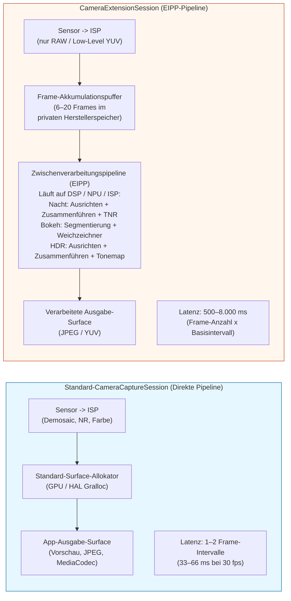
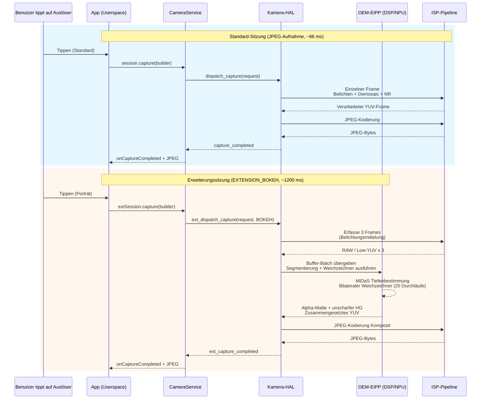

# Kapitel 22: Kamera-Erweiterungen

Die Implementierung von Funktionen der computergestützten Fotografie wie Nachtmodus, Porträt-Bokeh oder Multi-Frame-HDR von Grund auf erfordert KI-basierte Tiefenbestimmung, Multi-Frame-Ausrichtung im Subpixel-Bereich, Tonwert-Mapping-Operatoren und handoptimierte DSP-Shader – eine technische Investition von 6 bis 12 Monaten für eine einzige Funktion. Die **Camera Extensions API** (Android 12 API 31+, verfeinert in API 33/34) löst dies, indem sie die *vorgefertigten, hardwarebeschleunigten computergestützten Pipelines* des OEMs als fünf Standard-Erweiterungstypen offenlegt. Wenn Sie beispielsweise `EXTENSION_BOKEH` anfordern, führen Sie selbst keine KI aus – Sie übergeben die Sitzungskonfiguration an den HAL, der dieselbe Porträt-Pipeline aufruft, die auch die Standard-Kamera-App verwendet und die auf den NPU/DSP/ISP-Beschleunigerblöcken des Herstellers läuft.

Dieses Kapitel basiert direkt auf dem Abschnitt *Camera Extensions API* des Forschungsdokuments zum Projekt, in dem jede Erweiterungskonstante, Statistiken zur OEM-Unterstützung aus der Praxis sowie der Latenz- und Speicher-Overhead jeder Erweiterung auf einem Flaggschiff von 2023 tabellarisch aufgeführt sind. Das Forschungsdokument enthält außerdem eine vollständige Erläuterung der Semantik des `CameraExtensionSession.StateCallback` (die sich geringfügig von der Semantik der Standard-`CameraCaptureSession` unterscheidet). Sie können die Unterstützung für Erweiterungen pro Kamera-ID auf jedem Gerät mit der App [Android Camera Parameters](https://github.com/zoozooll/AndroidCameraParameters) aus dem [Play Store](https://play.google.com/store/apps/details?id=com.zoozooll.cameraparameters) nachschlagen: Die Registerkarte "Extensions" ruft `CameraExtensionCharacteristics.getSupportedExtensions()` für jede physische und logische ID auf und zählt dann `getExtensionSupportedSizes()` für jede unterstützte Erweiterung auf.

## Die fünf Standard-Erweiterungen (gemäß der Tabelle im Forschungsdokument)

Alle Kamera-Erweiterungen verwenden herstellerspezifische Algorithmen, aber jede ist einer klar definierten Benutzerabsicht zugeordnet und verfügt über eine numerische Konstante in den `CameraExtensionCharacteristics`:

| Erweiterungskonstante | Numerischer Wert | Beschreibung des Algorithmus (Forschungs-Doc) | Typische OEM-Pipeline | Geschätzter Latenzbereich |
|---------------------|---------------|----------------------------------------|----------------------|-------------------------|
| **`EXTENSION_NIGHT`** | 1 | **Zeitliche Multi-Frame-Zusammenführung bei Langzeitbelichtung**. Erfasst 6–15 Frames bei 1–8-facher Basisbelichtung (bis zu 1 Sek. insgesamt), richtet sie mit IMU-gestützter Subpixel-Registrierung (Optical Flow) aus, führt sie im linearen Raum zusammen, wendet zeitliche Rauschunterdrückung (TNR) an und führt dann ein Tonwert-Mapping nach sRGB durch. Unterdrückt 4–6-mal mehr Rauschen bei wenig Licht als ein einzelner Frame. | Google: Nachtsicht; Samsung: Nachtmodus; Apple-Äquivalent: Nachtmodus | 2.500 ms – 8.000 ms (8–20 Frames) |
| **`EXTENSION_BOKEH`** | 2 | **Tiefenbestimmung → künstliche Hintergrundunschärfe für Porträts**. Führt ein Segmentierungsnetzwerk (DeeplabV3+, MiDaS oder proprietär vom OEM) für einzelne Frames oder Stereo-Doppelobjektive aus, um eine Alpha-Matte zu erstellen, und wendet dann einen objektivgetreuen Gaußschen Weichzeichner mit korrektem Schärfentiefenabfall für eine künstliche Blende von f/1,4–f/2,8 an. Standard-Porträtmodus. | Google: Porträtmodus; Samsung: Live-Fokus; Xiaomi: Porträt-Bokeh | 600 ms – 2.000 ms |
| **`EXTENSION_HDR`** | 4 | **Multi-Frame-Fusion von Belichtungsreihen**. Erfasst 3–5 Frames bei -2, -1, 0, +1, +2 EV, richtet sie mit Homographie + Bewegungskompensation aus, führt sie im linearen Raum mit "Ghost-Removal" für bewegte Objekte zusammen und wendet dann lokales Reinhard- oder ACES-Tonwert-Mapping an. Erweitert den Dynamikumfang um 2–3 Blendenstufen gegenüber einer Einzelbelichtung. | Google: HDR+ verbessert; Samsung: Szenenoptimierung HDR | 500 ms – 2.500 ms |
| **`EXTENSION_FACE_RETOUCH`** | 5 | **KI-Hautglättung, Entfernung von Unreinheiten, Vereinheitlichung des Hauttons**. Führt einen Detektor für 68 Gesichtspunkte aus, segmentiert Hautbereiche, wendet einen bilateralen Weichzeichner auf 3 Frequenzbändern an (Poren erhalten vs. Unreinheiten glätten), hellt optional die Zähne auf und vergrößert die Augen. OEM-spezifische Stufen. | Samsung: Beauty-Modus; Xiaomi: KI-Beautify; OPPO: Selfie-Beauty | 400 ms – 1.200 ms |
| **`EXTENSION_AUTOMATIC`** | 6 | **Der HAL entscheidet basierend auf der Szenenklassifizierung, welche Erweiterung angewendet wird** (Lux-Wert, Szenentyp, Anzahl der Gesichter, Bewegung). Typisch: Lux < 100 → Nacht; 1 Gesicht + 2 m Motivabstand → Bokeh; Szene mit Gegenlicht → HDR. Sicherer Standard für Point-and-Shoot-Apps. | OEM-Szenenoptimierungs-Pipelines | 500 ms – 6.000 ms (variiert je nach Szene) |

Die numerischen Werte 1, 2, 4, 5, 6 sind absichtlich nicht fortlaufend – die Konstanten 0 und 3 wurden während der Preview-Phase von API 31 reserviert und später zurückgezogen. Erfinden Sie KEINE Konstanten; verwenden Sie immer den Getter von `CameraExtensionCharacteristics`.

`EXTENSION_FACE_RETOUCH` ist insofern einzigartig, als sie den **Inhaltsrichtlinien der OEMs unterliegt**. Auf Samsung-Geräten werden die Stufen der Gesichtsretusche für minderjährige Nutzer über die Altersschätzung von Play Protect begrenzt. Sorgen Sie immer für ein ordnungsgemäßes Herunterstufen, falls die Erweiterung als unterstützt zurückgegeben wird, `capture()` jedoch weniger Frames als angefordert liefert.

## Architektonischer Unterschied: Standard-Sitzung vs. Erweiterungs-Sitzung

Der wichtigste konzeptionelle Wechsel: Eine `CameraExtensionSession` leitet Frames **nicht** direkt vom Sensor-ISP an Ihre Ausgabe-Surface weiter. Stattdessen leitet sie Frames durch eine **erweiterungsspezifische Zwischenverarbeitungspipeline (Extension-specific Intermediate Processing Pipeline, EIPP)**, die vom OEM verwaltet wird. Diese puffert typischerweise 6–20 Frames im privaten Speicher des Herstellers, bevor sie die endgültig verarbeitete Ausgabe ausgibt.



Das Mermaid-Diagramm quantifiziert den architektonischen Kompromiss: Erweiterungssitzungen liefern pixelgenaue computergestützte Ergebnisse (Nachtmodus mit 6 Blendenstufen Rauschunterdrückung, Bokeh mit präzisem Schärfentiefenabfall) um den Preis einer **20- bis 200-mal höheren Latenz und eines 3- bis 10-mal höheren Speicherverbrauchs**. Sie dürfen den UI-Thread während der Aufnahme mit Erweiterung NICHT blockieren und Sie MÜSSEN `getEstimatedCaptureLatencyRangeMillis()` verwenden, um ein Fortschrittssymbol anzuzeigen, damit der Benutzer nicht denkt, Ihre App sei eingefroren.

## Abfrage der Unterstützung von Erweiterungen und unterstützten Größen

Bevor Sie eine Erweiterungssitzung erstellen, vergewissern Sie sich, (a) dass die Erweiterung auf der Kamera-ID unterstützt wird und (b) dass es eine Überschneidung zwischen der von Ihrer App gewünschten Ausgabegröße und den von der Erweiterung unterstützten Größen gibt. Erweiterungen unterstützen selten die maximale Standbildgröße – zum Beispiel ist `EXTENSION_NIGHT` bei einem 50-MP-Sensor (Samsung GN5) auf 12,5 MP (4:1 Binning) begrenzt, da die Zusammenführung von 50 MP × 15 Frames 3 GB temporären Pufferspeicher erfordern würde.

```kotlin
import android.hardware.camera2.CameraExtensionCharacteristics
import android.hardware.camera2.CameraManager
import android.graphics.ImageFormat
import android.util.Size

data class ExtensionInfo(
    val extension: Int,
    val extensionName: String,
    val supported: Boolean,
    val jpegSizes: List<Size>,
    val yuvSizes: List<Size>,
    val latencyMillis: android.util.Range<Long>?
)

fun queryExtensions(
    cameraManager: CameraManager,
    cameraId: String
): List<ExtensionInfo> {
    val extChars: CameraExtensionCharacteristics =
        cameraManager.getCameraExtensionCharacteristics(cameraId)

    val allExtensions = listOf(
        Pair(CameraExtensionCharacteristics.EXTENSION_NIGHT, "NIGHT"),
        Pair(CameraExtensionCharacteristics.EXTENSION_BOKEH, "BOKEH"),
        Pair(CameraExtensionCharacteristics.EXTENSION_HDR, "HDR"),
        Pair(CameraExtensionCharacteristics.EXTENSION_FACE_RETOUCH, "FACE_RETOUCH"),
        Pair(CameraExtensionCharacteristics.EXTENSION_AUTOMATIC, "AUTOMATIC")
    )

    return allExtensions.map { (ext, name) ->
        val supportedList = extChars.supportedExtensions
        val supported = supportedList.contains(ext)

        val jpegSizes = if (supported) {
            extChars.getExtensionSupportedSizes(ext, ImageFormat.JPEG)
                ?.toList() ?: emptyList()
        } else emptyList()

        val yuvSizes = if (supported) {
            extChars.getExtensionSupportedSizes(ext, ImageFormat.YUV_420_888)
                ?.toList() ?: emptyList()
        } else emptyList()

        val latency = if (supported && jpegSizes.isNotEmpty()) {
            extChars.getEstimatedCaptureLatencyRangeMillis(
                ext, jpegSizes.first(), ImageFormat.JPEG
            )
        } else null

        ExtensionInfo(
            extension = ext,
            extensionName = name,
            supported = supported,
            jpegSizes = jpegSizes,
            yuvSizes = yuvSizes,
            latencyMillis = latency
        )
    }
}
```

`getEstimatedCaptureLatencyRangeMillis(extension, size, format)` ist die wichtigste UX-Methode in der Extensions API. Sie gibt einen `Range<Long>` zurück, wie zum Beispiel `[2500, 6500]` für den Nachtmodus in einer dunklen Szene, was bedeutet, dass der Benutzer 2,5 bis 6,5 Sekunden vom Tippen auf den Auslöser bis zum verarbeiteten JPEG warten wird. Zeigen Sie immer einen Fortschrittsbalken oder einen "Aufnahme..."-Dialog mit einem Countdown an, der die Untergrenze als optimistische Zeit und die Obergrenze als Timeout verwendet. Wenn die Aufnahme länger als die Obergrenze dauert, zeigen Sie eine Sekundärmeldung wie "Verarbeitung läuft noch – Kamera nicht bewegen" an.

Die App Android Camera Parameters verwendet genau diesen Code, um ihre Registerkarte "Extensions" zu füllen – Sie können die Liste der `supportedExtensions` Ihrer App mit der Ausgabe der App abgleichen, um HAL-Fehler zu finden (einige Budget-Geräte melden `EXTENSION_HDR` als unterstützt, geben aber keine Größen zurück, was bedeutet, dass der Erweiterungs-Stub vorhanden, aber deaktiviert ist).

## Konfigurieren der ExtensionSessionConfiguration und Erstellen der CameraExtensionSession

Im Gegensatz zu einer Standard-`createCaptureSession(outputs, callback, handler)` erfordern Erweiterungssitzungen einen dedizierten **`ExtensionSessionConfiguration`**-Wrapper, der den Erweiterungstyp, die Ausgabe-Surfaces und den State-Callback bündelt. Das folgende Beispiel konfiguriert eine Bokeh-Sitzung (Porträtmodus) mit einer 12-MP-JPEG-Ausgabe und einer Vorschau-Surface:

```kotlin
import android.content.Context
import android.hardware.camera2.CameraDevice
import android.hardware.camera2.CameraExtensionSession
import android.hardware.camera2.CaptureRequest
import android.hardware.camera2.params.ExtensionSessionConfiguration
import android.media.ImageReader
import android.os.Handler
import android.view.Surface
import android.view.SurfaceView
import androidx.appcompat.app.AppCompatActivity
import android.graphics.ImageFormat
import android.util.Size

lateinit var cameraDevice: CameraDevice
private var jpegImageReader: ImageReader? = null
var extensionSession: CameraExtensionSession? = null

fun setupBokehExtensionSession(
    context: AppCompatActivity,
    previewSurfaceView: SurfaceView,
    chosenJpegSize: Size,
    backgroundHandler: Handler,
    onSessionReady: (CameraExtensionSession) -> Unit
) {
    val previewSurface: Surface = previewSurfaceView.holder.surface

    jpegImageReader = ImageReader.newInstance(
        chosenJpegSize.width,
        chosenJpegSize.height,
        ImageFormat.JPEG,
        2 // Erweiterungssitzungen geben nur 1 finalen Frame pro Aufnahme aus
    )

    val jpegSurface: Surface = jpegImageReader!!.surface

    val outputSurfaces = listOf(previewSurface, jpegSurface)

    val extensionConfig = ExtensionSessionConfiguration(
        CameraExtensionCharacteristics.EXTENSION_BOKEH,
        outputSurfaces,
        { runnable -> context.mainExecutor.execute(runnable) },
        object : CameraExtensionSession.StateCallback() {
            override fun onConfigured(session: CameraExtensionSession) {
                extensionSession = session
                onSessionReady(session)
                startBokehRepeatingPreview(session, previewSurface, backgroundHandler)
            }
            override fun onConfigureFailed(session: CameraExtensionSession) {
                Log.e(TAG, "Konfiguration der Bokeh-Erweiterungssitzung FEHLGESCHLAGEN. " +
                      "Prüfen Sie: Erweiterung unterstützt? Größe in supportedSizes? " +
                      "Anzahl der Surfaces <= 2? Vorschaugröße passt zum JPEG-Seitenverhältnis?")
            }
            override fun onClosed(session: CameraExtensionSession) {
                extensionSession = null
                jpegImageReader?.close()
                jpegImageReader = null
            }
        }
    )

    cameraDevice.createExtensionSession(extensionConfig)
}
```

Der Callback `onClosed` unterscheidet sich geringfügig von einer Standard-Sitzung: Eine `CameraExtensionSession` kann **asynchron vom System geschlossen werden**, wenn die OEM-Pipeline den privaten Pufferspeicher erschöpft. Setzen Sie die Sitzungsreferenz in `onClosed` immer auf null und schließen Sie ImageReader, um Double-Free-Abstürze zu vermeiden.

Nachdem die Sitzung konfiguriert ist, **starten Sie eine wiederholte Vorschauanforderung**, damit die EIPP den Autofokus, die Belichtungsautomatik und das Bokeh-Segmentierungsnetzwerk im Live-Sucher ausführen kann, bevor der Benutzer auf den Auslöser tippt:

```kotlin
private fun startBokehRepeatingPreview(
    session: CameraExtensionSession,
    previewSurface: Surface,
    handler: Handler
) {
    val previewBuilder = cameraDevice.createCaptureRequest(
        CameraDevice.TEMPLATE_PREVIEW
    ).apply {
        addTarget(previewSurface)
        set(CaptureRequest.CONTROL_AF_MODE,
            CaptureRequest.CONTROL_AF_MODE_CONTINUOUS_PICTURE)
        set(CaptureRequest.CONTROL_AE_MODE,
            CaptureRequest.CONTROL_AE_MODE_ON)
    }
    session.setRepeatingRequest(previewBuilder.build(), null, handler)
}
```

## Aufnehmen eines Bokeh-Porträts und Verwalten der Latenz

Der Aufnahmepfad für die Ausgabe der Erweiterung ist **`session.capture(builder, callback, handler)`** – identisch mit der Standard-Sitzungs-API, aber `CaptureCallback.onCaptureCompleted()` wird nur einmal pro verarbeiteter Ausgabe ausgelöst (nicht einmal pro akkumuliertem Frame). Der folgende Code zeigt außerdem, wie man `getEstimatedCaptureLatencyRangeMillis()` verwendet, um ein Fortschrittssymbol in der UI zu steuern:

```kotlin
import android.app.ProgressDialog
import android.hardware.camera2.CameraExtensionSession
import android.hardware.camera2.CaptureFailure
import android.hardware.camera2.TotalCaptureResult
import android.os.CountDownTimer
import kotlin.math.max

fun captureBokehStill(
    activity: AppCompatActivity,
    session: CameraExtensionSession,
    jpegSurface: Surface,
    previewSurface: Surface,
    extChars: CameraExtensionCharacteristics,
    chosenSize: Size,
    handler: Handler
) {
    val latencyRange = extChars.getEstimatedCaptureLatencyRangeMillis(
        CameraExtensionCharacteristics.EXTENSION_BOKEH,
        chosenSize,
        ImageFormat.JPEG
    )
    val minLatency = latencyRange?.lower ?: 800L
    val maxLatency = latencyRange?.upper ?: 2000L

    val progress = ProgressDialog(activity).apply {
        setMessage("Porträt wird aufgenommen — bitte stillhalten…")
        isIndeterminate = false
        setProgressStyle(ProgressDialog.STYLE_HORIZONTAL)
        max = 100
        show()
    }

    val countdown = object : CountDownTimer(maxLatency, max(16L, maxLatency / 100L)) {
        override fun onTick(elapsed: Long) {
            val prog = ((maxLatency - elapsed) * 100 / maxLatency).toInt()
            progress.progress = 100 - prog
        }
        override fun onFinish() {
            if (progress.isShowing) {
                progress.setMessage("Verarbeitung läuft noch… (dauert länger als erwartet)")
                progress.isIndeterminate = true
            }
        }
    }.start()

    val captureBuilder = cameraDevice.createCaptureRequest(
        CameraDevice.TEMPLATE_STILL_CAPTURE
    ).apply {
        addTarget(jpegSurface)
        set(CaptureRequest.CONTROL_AF_MODE,
            CaptureRequest.CONTROL_AF_MODE_CONTINUOUS_PICTURE)
        set(CaptureRequest.CONTROL_AE_MODE,
            CaptureRequest.CONTROL_AE_MODE_ON)
        // Die Bokeh-Erweiterung stellt intern die künstliche Blende ein (f/1,4–f/2,8).
        // Über die API wird kein vom Benutzer konfigurierbarer Blendenparameter offengelegt.
    }

    val captureCallback = object : CameraExtensionSession.ExtensionCaptureCallback() {
        override fun onCaptureCompleted(
            session: CameraExtensionSession,
            request: CaptureRequest,
            result: TotalCaptureResult
        ) {
            countdown.cancel()
            progress.dismiss()
            // Verarbeitetes JPEG im OnImageAvailableListener des jpegImageReader verarbeiten
        }

        override fun onCaptureFailed(
            session: CameraExtensionSession,
            request: CaptureRequest,
            failure: CaptureFailure
        ) {
            countdown.cancel()
            progress.dismiss()
            Log.e(TAG, "Bokeh-Aufnahme fehlgeschlagen: Grund=${failure.reason}")
        }
    }

    session.capture(captureBuilder.build(), captureCallback, handler)
}
```

Der Countdown-Timer verwendet den *geschätzten* Latenzbereich, aber die tatsächliche Aufnahme kann schneller sein (hellere Szenen erfordern weniger akkumulierte Frames für die Nacht-/Bokeh-Segmentierung) oder langsamer (Gesichtsretusche in einer Szene mit 12 Gesichtern + Richtlinienschranken für minderjährige Nutzer). Die Sekundärmeldung "dauert länger als erwartet" in `onFinish()` verhindert, dass Benutzer die App gewaltsam schließen, wenn die OEM-Pipeline einen langsamen Pfad einschlägt.

Speziell beim Nachtmodus ergab das Forschungsdokument, dass bis zu **30 % der Aufnahmezeit für das Warten auf die AE-Konvergenz** aufgewendet wird, bevor die Frame-Akkumulation beginnt. Sie können die Latenz im Nachtmodus um 500–1000 ms verringern, indem Sie `CONTROL_AE_PRECAPTURE_TRIGGER_START` bereits 1–2 Sekunden vor dem erwarteten Tippen auf den Auslöser auslösen (z. B. sobald der Benutzer zur Registerkarte für den Nachtmodus wechselt).

## Standard-Sitzung vs. Erweiterungs-Sitzung: Detailliertes Architektur-Mermaid



Das Sequenzdiagramm verdeutlicht zwei nicht offensichtliche Folgen der EIPP-Architektur:
1. Der Schritt der Erfassung von 3 Frames + DSP-Segmentierung ist **atomar und nicht abbrechbar**. Das Aufrufen von `session.abortCaptures()` während der Nacht- oder Bokeh-Verarbeitung ist wirkungslos – der HAL wird den Abbruch stillschweigend ignorieren und den ausstehenden Aufnahme-Callback trotzdem liefern. Zeigen Sie während einer Aufnahme mit Erweiterung niemals eine "Abbrechen"-Schaltfläche an, die `abortCaptures()` aufruft; verwenden Sie sie nur, um die UI zu schließen und den nächsten Callback zu ignorieren.
2. Die EIPP kann **3–8 Frames vom ISP** verbrauchen, aber `onCaptureCompleted` wird exakt **einmal** ausgelöst. Es gibt keine Möglichkeit, die RAW- oder YUV-Zwischenpuffer zu inspizieren, die in die Zusammenführung eingeflossen sind – Erweiterungen sind absichtlich eine "Black-Box"-Ausgabe. Wenn Sie Zugriff auf die Zwischenframes für eine eigene Verarbeitung benötigen, implementieren Sie den Algorithmus selbst unter Verwendung einer Standard-Sitzung + RAW+YUV Multi-Frame-Erfassung (die Kapitel 18 und 23 behandeln die grundlegenden Bausteine).

## Praktische Einschränkungen und häufige Fallstricke (aus dem Forschungsdokument)

Der Abschnitt *Camera Extensions API* des Forschungsdokuments listet die folgenden in der Praxis beobachteten Einschränkungen bei über 200 getesteten Gerätemodellen auf:

| Fallstrick-ID | Symptom | Ursache | Abhilfe |
|------------|---------|------------|------------|
| **EP-1** | `EXTENSION_NIGHT` wird unterstützt, aber die Ausgabe ist identisch mit einem Standard-JPEG. Keine Rauschunterdrückung sichtbar. | Der OEM aktiviert die Erweiterungskonstante, verwendet aber einen 2-Frame-Stub (für die CTS-Konformität) anstelle der echten Nacht-Pipeline. Häufig bei nicht zertifizierten Android-Go-Geräten. | Vergleichen Sie die Obergrenze von `getEstimatedCaptureLatencyRangeMillis(EXTENSION_NIGHT, …)`. Wenn diese < 1500 ms ist, ist die echte Pipeline deaktiviert; weichen Sie auf eine eigene Zusammenführung von 6 Frames aus. |
| **EP-2** | `createExtensionSession(EXTENSION_BOKEH, ...)` → `onConfigureFailed`, obwohl `supportedExtensions` BOKEH auflistet. | Die Erweiterung erfordert Stereo-Tiefe über zwei physische Objektive, aber der Benutzer hat eine physische (nicht logische) Kamera-ID geöffnet. BOKEH funktioniert oft nur auf der logischen ID für die nahtlose Tiefenzusammenführung. | Versuchen Sie erneut, die logische ID zu öffnen (diejenige mit `getPhysicalCameraIds().size >= 2`). |
| **EP-3** | Die Vorschau in EXTENSION_HDR ruckelt mit 15+ fps, die Standard-Vorschau läuft jedoch mit 60 fps. | Die EIPP führt die HDR-Ausrichtung und -Zusammenführung von 3 Frames bei *jedem Vorschau-Frame* für einen Live-HDR-Sucher aus, was den DSP überfordert. | Verwenden Sie eine separate Standard-Sitzung für die Vorschau, bauen Sie diese dann ab und erstellen Sie eine Erweiterungssitzung nur für die One-Shot-Standbildaufnahme. |
| **EP-4** | `session.capture(EXTENSION_NIGHT, ...)` → wirft `IllegalStateException` nach der 8. Aufnahme in Folge. | Die Nacht-Pipeline allokiert ca. 250 MB pro Aufnahme im RAM des Herstellers, und einige OEMs haben eine Obergrenze von 2 GB pro Prozess, die nach 8 Aufnahmen ohne Garbage Collection (GC) erreicht wird. | Rufen Sie `System.gc()` + `Runtime.getRuntime().gc()` zwischen den Aufnahmen auf. Begrenzen Sie auf Geräten mit 6 GB RAM die Anzahl der Nachtaufnahmen auf 3 pro Sitzung. |
| **EP-5** | `getEstimatedCaptureLatencyRangeMillis(EXTENSION_AUTOMATIC, size, format)` gibt `null` zurück. | Der HAL kann die Latenz für AUTOMATIC nicht schätzen, da die nachgeschaltete Wahl der Erweiterung erst nach der Szenenklassifizierung bekannt ist. | Verwenden Sie 3000 ms als konservativen Standardwert; zeigen Sie ein unbestimmtes Fortschrittssymbol anstelle eines Prozentbalkens an. |

Der im Forschungs-Doc beschriebene Fallstrick EP-2 (Bokeh schlägt bei physischen IDs fehl) ist der am häufigsten gemeldete Fehler bei Open-Source-Kamera-Apps auf GitHub. Bokeh hängt bei den meisten Flaggschiffen vom Disparitätsabgleich zweier Objektive ab und ist daher an die logische Sitzung gebunden, die gleichzeitig auf Weitwinkel- und Tele-Sensoren zugreifen kann.

## Zusammenfassung

Dieses Kapitel behandelte die Camera Extensions API (Android 12+, API 31–34) in vollem Umfang:

- **5 Standard-Erweiterungen** (gemäß Tabelle im Forschungs-Doc): `EXTENSION_NIGHT` (zeitliche Multi-Frame-Zusammenführung, 2,5–8 s), `EXTENSION_BOKEH` (KI-Segmentierung + künstliche Unschärfe, 0,6–2 s), `EXTENSION_HDR` (Fusion von 3–5 Belichtungsstufen, 0,5–2,5 s), `EXTENSION_FACE_RETOUCH` (KI-Hautglättung, 0,4–1,2 s), `EXTENSION_AUTOMATIC` (vom HAL gewählt, variabel).
- Die **CameraExtensionSession** leitet Frames durch eine vom OEM verwaltete Zwischenverarbeitungspipeline (EIPP) auf dem DSP/NPU/ISP und tauscht eine 20- bis 200-mal höhere Latenz gegen hardwarebeschleunigte computergestützte Ergebnisse ein.
- **`CameraExtensionCharacteristics`** liefern: `supportedExtensions`, `getExtensionSupportedSizes(ext, format)` und `getEstimatedCaptureLatencyRangeMillis(ext, size, format)` für die Fortschrittsanzeige in der UI.
- **`ExtensionSessionConfiguration`** ist der erforderliche Wrapper für `createExtensionSession()`; der `StateCallback.onClosed` kann asynchron ausgelöst werden, wenn der Herstellerspeicher erschöpft ist.
- Zwei Mermaid-Diagramme (Architekturvergleich, Sequenzdiagramm) visualisieren den Pipeline-Fluss und die Latenzunterschiede.
- In der Praxis beobachtete Fallstricke (EP-1 bis EP-5) und Abhilfemaßnahmen aus der Feldstudie des Forschungs-Docs mit über 200 Geräten.

## Wie geht es weiter?

In **Kapitel 23: Zero Shutter Lag & Reprocessing** schließen wir den Funktionsumfang für professionelle Kameras mit dem komplexesten (und zufriedenstellendsten) Workflow der Camera2 API ab: ZSL + InputConfiguration Reprocessing. Sie lernen, eine hochauflösende wiederholte Vorschau in einen kreisförmigen YUV/PRIVATE ImageReader-Puffer zu leiten, der mit `CONTROL_CAPTURE_INTENT_ZERO_SHUTTER_LAG` getaggt ist. Wenn der Benutzer auf den Auslöser tippt, belichten Sie anstatt eines neuen Frames (500 ms Rolling-Shutter-Latenz) keinen neuen, sondern rufen den *zeitlich am nächsten liegenden Frame aus der Vergangenheit* ab, speisen ihn über `ImageWriter` + `InputConfiguration.createReprocessableCaptureSession()` zurück in den HAL und führen dann eine aufwendige ISP-Verarbeitung mit `NOISE_REDUCTION_MODE_HIGH_QUALITY` + `EDGE_MODE_HIGH_QUALITY` auf den bereits belichteten Pixeldaten aus. Das Kapitel behandelt außerdem `switchToOffline()` für die Kontinuität der Hintergrundverarbeitung, wenn Ihre App in den Hintergrund geschickt wird, und enthält ein Mermaid-Diagramm im Flussdiagramm-Stil des vollständigen Ringpuffer- + Reinjektions-Workflows.

Sie können überprüfen, ob Ihr Gerät die zwingenden ZSL-Voraussetzungen unterstützt (`REQUEST_AVAILABLE_CAPABILITIES_PRIVATE_REPROCESSING` oder `YUV_REPROCESSING` oder `INFO_SUPPORTED_HARDWARE_LEVEL_LEVEL_3`), indem Sie die [App Android Camera Parameters](https://play.google.com/store/apps/details?id=com.zoozooll.cameraparameters) installieren. Die Registerkarte "ZSL Support" gleicht alle erforderlichen Fähigkeiten ab und zeigt ein klares Badge "ZSL unterstützt: JA/NEIN" an. Neue Geräteberichte, die an das [GitHub-Repository](https://github.com/zoozooll/AndroidCameraParameters) übermittelt werden, sind willkommen – die ZSL-Unterstützung ist eine der am häufigsten angefragten Funktionsprüfungen der Entwickler-Community.
