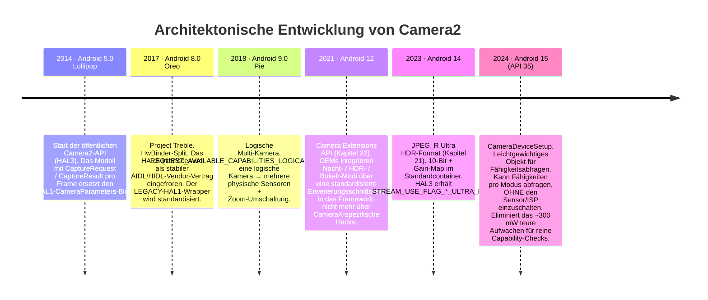

# Kapitel 28: Camera2-Architektur

## Zusammenfassung

Dies ist das Kapitel, das Sie sich verdient haben. In den Kapiteln 1–27 haben Sie `CameraManager`, `CameraCharacteristics`, `CaptureRequest`, `CaptureResult`, `CameraCaptureSession`, `ImageReader`, CameraX, den nativen NDK-Stack, Coroutine-Wrapper und Test-Mocks verwendet. Sie kennen jede öffentliche API-Oberfläche. Jetzt legen wir jede Abstraktion der Reihe nach offen, von der Kotlin-Codezeile, die Sie schreiben, bis hin zu den einzelnen Elektronen, die den MIPI CSI-2-Bus zwischen Sensor und SoC überqueren, dem Voice-Coil-Motor, der die Linsengruppe um 10 Mikrometer verschiebt, und dem Blitz-LED-Controller, der einen Xenon- oder LED-Stroboskop-Blitz im Mikrosekunden-Gleichtakt mit dem Rolling Shutter des Sensors pulsiert.

Am Ende dieses Kapitels werden Sie in der Lage sein, jeden `CaptureRequest` zu betrachten und Schicht für Schicht zuzuordnen, wohin jeder Teil davon geht, wer ihn übersetzt, wer ihn validiert und wer ihn schließlich auf dem Silizium ausführt. Sie werden auch die `CameraDeviceSetup`-Abstraktion von Android 15 (API 35) als Beispiel für einen jahrzehntelangen architektonischen Trend verstehen: die progressive Entkopplung von *Fähigkeitsabfragen* von *Hardware-Energiezuständen*, damit Apps eine Kamera prüfen können, ohne die ~300 mW zu verbrauchen, die zum Einschalten von Sensor und ISP benötigt werden.

Um die exakten Fähigkeiten jedes realen Geräts zu inspizieren und mit den hier beschriebenen Architekturschichten abzugleichen, installieren Sie **Android Camera Parameters** ([Google Play](https://play.google.com/store/apps/details?id=com.minininja.cameraparams), [GitHub](https://github.com/zoozooll/AndroidCameraParameters)). Es liest jeden `CameraCharacteristics`-Schlüssel aus, den die darunter liegenden Schichten der öffentlichen API zur Verfügung stellen.

---

## Das Diagramm des vollständigen Stacks

Dies ist das wichtigste Diagramm im gesamten Buch. Jede Schicht von hier an abwärts ist echter Code mit einem echten Pfad im Android Open Source Project (AOSP), einem echten Besitzer und einer echten Binder- oder Funktionsaufruf-Grenze. Wir werden jede Schicht von oben nach unten durchgehen, dann die Entwicklung des Stacks im letzten Jahrzehnt zeigen und anschließend Ihre Lernreise über die Schichten hinweg abbilden.

```mermaid
graph TB
    subgraph APP["App-Schicht (Ihr Code)"]
        direction TB
        A1["Kotlin / Java / C++ NDK<br/>cameraManager.openCamera(id, cb, handler)<br/>session.capture(request, cb, handler)<br/>captureResult.get(SENSOR_EXPOSURE_TIME)"]
    end
    subgraph FRAME["Java/Kotlin Framework-Schicht — android.hardware.camera2.*"]
        direction TB
        F1["CameraManager · CameraCharacteristics<br/>CaptureRequest.Builder · CaptureResult<br/>CameraDevice · CameraCaptureSession"]
        F2["CameraBinderWrapper (AOSP frameworks/base)<br/>Übersetzt Java-Objekte -> AIDL Binder-Parcel"]
    end
    subgraph BIND["IPC-Schicht — Binder / HwBinder"]
        direction TB
        B1["AIDL ICameraService (AOSP)<br/>Framework ↔ CameraService"]
        B2["HIDL / AIDL HAL Binder (Treble)<br/>CameraService ↔ Vendor HAL"]
    end
    subgraph NS["Native Mediaserver-Schicht (system/bin/cameraserver)"]
        direction TB
        N1["CameraService (frameworks/av/services/camera/)"]
        N2["Camera3Device<br/>frameworks/av/services/camera/libcameraservice/device3/<br/>— Validiert Request vs. Session-Ausgaben<br/>— Erstellt camera3_capture_request_t<br/>— Analysiert camera3_capture_result_t"]
        N3["CameraProviderManager (frameworks/av)<br/>Zählt Vendor-HAL-Implementierungen auf"]
    end
    subgraph HAL["Vendor-HAL-Schicht (OEM / SoC-Code)"]
        direction TB
        H1["HAL3 Interface: camera3_device_t<br/>— process_capture_request()<br/>— process_capture_result()<br/>— flush()"]
        H2["HAL1-Wrapper (Legacy)<br/>camera2compat::Camera2Compat<br/>Übersetzt HAL3 Request -> HAL1 CameraParameters<br/>für < INFO_SUPPORTED_HARDWARE_LEVEL_LIMITED"]
        H3["Vendor-Implementierung<br/>Qualcomm QCamera2 · MediaTek CamHAL · Samsung Exynos Camera HAL"]
    end
    subgraph K["Kernel-Schicht (Linux)"]
        direction TB
        K1["/dev/videoX — V4L2 Video Capture Driver<br/>VIDIOC_S_FMT · VIDIOC_REQBUFS · VIDIOC_QBUF / DQBUF"]
        K2["ISP-Treiber (Qualcomm CAMSS / MediaTek ISP-Treiber)<br/>Memory-to-Memory-Verarbeitung V4L2 m2m Node"]
        K3["Sensor-Subdev-Treiber<br/>I2C-Schreibvorgänge für Modus / Belichtung / Gain / VCM"]
        K4["MIPI CSI-2-Empfänger-Treiber (SoC)<br/>Lane-Konfiguration, LP/HS-Übergänge, ECC/CRC-Prüfung"]
    end
    subgraph HW["Physische Hardware-Schicht"]
        direction TB
        HW1["Objektiv-Baugruppe<br/>VCM Voice Coil Motor (I2C)<br/>Bewegt Linsengruppe für Fokus / OIS"]
        HW2["Kamera-Sensor Pixel-Array<br/>CMOS-Sensor (Sony IMX / Samsung ISOCELL / OmniVision)<br/>Belichten -> Auslesen -> A/D"]
        HW3["MIPI CSI-2 Physischer Bus<br/>2/4/8 Differenzialpaare bei 1,5 – 2,5 Gbit/s pro Lane"]
        HW4["ISP Image Signal Processor (auf SoC)<br/>Demosaic · Rauschunterdrückung · Schärfen · HDR-Merge · Gesichtserkennung in Hardware"]
        HW5["Blitz-LED-Controller (I2C)<br/>Xenon-Strobe oder LED-Stromsenke<br/>Synchronisiert mit Sensor EXRST-Pin"]
    end

    APP -->|Funktionsaufruf| FRAME
    FRAME -->|AIDL Parcel| BIND
    BIND -->|HwBinder| NS
    NS -->|HAL3 AIDL/HIDL| HAL
    HAL -->|ioctl() Systemaufrufe| K
    K -->|I2C-Schreibvorgänge + MIPI-Lane-Signale + ISP-Befehlswarteschlangen| HW

    style APP fill:#e6d9f2
    style FRAME fill:#d9e6f2
    style BIND fill:#fff3cd,stroke:#ffc107,stroke-width:2px
    style NS fill:#d9f2e6
    style HAL fill:#f2d9e6
    style K fill:#e6d9e6
    style HW fill:#f2e6d9,stroke:#d4a373,stroke-width:2px
```

Gehen wir nun von oben nach unten vor.

---

## Schicht 1 — App-Schicht (Ihr Code)

Dies ist der Code, den Sie geschrieben haben. `cameraManager.openCamera(id, stateCallback, cameraHandler)`. Sie kennen diese Schicht in- und auswendig. Zwei Fakten, die Sie vielleicht noch nicht verinnerlicht haben:
- Jeder einzelne `CaptureRequest.Builder.set(key, value)`-Aufruf, den Sie tätigen, fügt einen *getaggten Metadaten-Eintrag* zu einer parzellierbaren Struktur hinzu, die exakt der C-Struktur `camera_metadata_t` in `system/media/camera/include/system/camera_metadata.h` entspricht. Es gibt keine magische Übersetzung zwischen Ihrem Kotlin-`CaptureRequest` und dem Request des HALs – es ist dasselbe binäre Metadatenformat, nur mit unterschiedlichen Sprachbindungen umhüllt.
- Jeder `CaptureResult.get(key)`-Aufruf, den Sie tätigen, liest exakt die Bytes, die der HAL in den Antwortpuffer geschrieben hat. Wenn ein HAL die Belichtungszeit bei einem bestimmten OTA-Build falsch meldet, liest Ihre App exakt diesen falschen Wert. Es gibt keine Validierungsschicht auf Framework-Ebene oberhalb des HALs, die Vendor-Fehler korrigiert. Genau deshalb existiert der Hardware-Sanity-Test aus Kapitel 27.

---

## Schicht 2 — Java/Kotlin Framework-Schicht (`android.hardware.camera2.*`)

Die Framework-Schicht (AOSP `frameworks/base/core/java/android/hardware/camera2/`) tut nur zwei Dinge:
1. Sie legt die öffentliche API-Oberfläche offen (`CameraManager`, `CameraDevice` usw.), die Sie aufrufen.
2. Sie übersetzt zwischen `CaptureRequest`- / `CaptureResult`-Java-Objekten und deren parzellierbaren Binder-Darstellungen "on-the-wire".

Sie führt keine Richtliniendurchsetzung oberhalb des HALs durch. Sie führt kein Metadaten-Rewriting durch. Sie "repariert" keine Requests. Sie ist eine dünne Übersetzungsschicht plus ein Cache für den unveränderlichen `CameraCharacteristics`-Blob, der beim Booten des Geräts einmal pro Kamera-ID abgerufen wird.

Die Binder-Grenze befindet sich in `CameraManager` → `ICameraService` AIDL, was die nächste Schicht darstellt.

---

## Schicht 3 — IPC-Schicht: Binder / HwBinder (Treble)

Dies ist der kritische Architekturvertrag, den Project Treble (Android 8.0, 2017) festgeschrieben hat. Zwei Binder-Domänen sind beteiligt:

| Binder-Domäne      | Verbindet                                             | Protokoll       | Wer erzwingt ABI-Stabilität     |
|--------------------|-------------------------------------------------------|-----------------|---------------------------------|
| `/dev/binder`      | Framework ↔ cameraserver (system_server-seitig)       | AIDL            | Plattform (gleicher Partitions-Build) |
| `/dev/hwbinder`    | cameraserver ↔ Vendor Camera HAL                      | HIDL / AIDL HAL | Treble (stabile Vendor-Schnittstelle) |

Vor Treble war der HAL eine `.so`-Datei, die mittels `dlopen` direkt in den Prozess des `cameraserver` geladen wurde. Jedes OTA-Update des OEMs musste Kamera *und* Framework zusammen neu bauen. Der HwBinder-Split von Treble bedeutet, dass der Vendor-HAL ein eigener Prozess, eine eigene Partition und einen eigenen 3-Jahres-Sicherheitsupdate-Zeitplan hat. Der Vertrag zwischen ihm und dem `cameraserver` ist versioniert und für die Lebensdauer des Geräts eingefroren. Für Sie als App-Entwickler ist dies der wichtigste Grund, warum das Verhalten der Camera2-API über OTA-Updates hinweg vorhersehbar ist: Die HAL-Schnittstelle kann sich buchstäblich nicht ändern, ohne den Treble-Compliance-Test zu verletzen.

Der LEGACY HAL1-Wrapper befindet sich unterhalb dieser Grenze innerhalb des Vendor-HAL-Prozesses und ist daher für Sie auf der App-Ebene unsichtbar, außer über `INFO_SUPPORTED_HARDWARE_LEVEL_LEGACY`.

---

## Schicht 4 — Native Mediaserver-Schicht: `CameraService` / `Camera3Device`

`/system/bin/cameraserver` ist ein nativer Daemon, der beim Booten durch `init.rc` gestartet wird. Er läuft immer, besitzt jede offene Kamera auf dem Gerät und ist der einzige Schiedsrichter darüber, welche App Kamerazugriff erhält (die App im Vordergrund gewinnt; alles andere wird getrennt).

Seine zwei wichtigsten Klassen:

1. **`CameraService`** (`frameworks/av/services/camera/libcameraservice/CameraService.cpp`):
   - Legt `ICameraService` AIDL für das Framework offen.
   - Erzwingt Berechtigungsprüfungen für `android.permission.CAMERA` bei jedem Binder-Aufruf (ein Aufruf einer App ohne CAMERA-Berechtigung wird im `cameraserver` abgelehnt, noch bevor er den HAL erreicht).
   - Handhabt die Schlichtung bei gleichzeitigem Öffnen (zwei Apps fordern dieselbe Kamera an → die Top-Activity erhält sie; die Hintergrund-App erhält `onDisconnected`).
   - Verwaltet den `CameraProviderManager` zur Aufzählung der Vendor-HAL-Module.

2. **`Camera3Device`** (`frameworks/av/services/camera/libcameraservice/device3/Camera3Device.cpp`):
   - Das Herz der Pipeline.
   - Validiert, dass jede Ausgabe-Surface in einem Capture-Request tatsächlich Teil der konfigurierten Ausgabemenge der Sitzung ist. (Dies ist der Ort, an dem das Framework eine `IllegalArgumentException: Surface not in configured outputs` wirft.)
   - Verpackt Ihren parzellierten `CaptureRequest` in eine HAL3-Struktur des Typs `camera3_capture_request_t`.
   - Streamt Requests nacheinander über `process_capture_request(request)` in den HAL.
   - Empfängt `camera3_capture_result_t` vom HAL zurück, parzelliert Metadaten + Fences und leitet sie über die Binder-Kette *zurück* an Ihren `CaptureCallback.onCaptureCompleted`.
   - Handhabt `flush()` für Sie, die Fehlerpfade, die `notify()`-Shutter- und Fehler-Callbacks sowie Ausgabe-Puffer-Release-Fences für die EGL/Vulkan-Interoperabilität.

`Camera3Device` besteht aus ca. 15.000 Zeilen C++ und ist das am intensivsten getestete Teil des gesamten Stacks (die CTS-Tests aus Kapitel 27 zielen direkt auf das Verhalten von `Camera3Device` von der Framework-Seite aus ab). Wenn Sie jemals einen Fehlerbericht lesen, der besagt, dass "dieser Request-Key bei Camera2 NDK funktioniert, aber nicht bei Java Camera2", liegt die Diskrepanz fast immer an einem fehlenden Validierungs- oder Konvertierungspfad innerhalb von `Camera3Device`.

---

## Schicht 5 — Vendor-HAL-Schicht: HAL3 (`camera3_device_t`)

Hier lebt die tatsächliche Differenzierung der OEMs. Jeder SoC-Hersteller liefert seine eigene HAL3-Implementierung aus:

| Vendor       | HAL-Codename                              | AOSP-Schnittstelle                          |
|--------------|-------------------------------------------|----------------------------------------------|
| Qualcomm     | QCamera2 / QCamera3 (mm-camera Codebase)  | `camera3_device_t` + `vendor.qti.hardware.camera*` Erweiterungen |
| MediaTek     | CamHAL (mtkcam)                           | Gleiche `camera3_device_t` + MediaTek Erweiterungen |
| Samsung      | Exynos Camera HAL                         | Gleiche `camera3_device_t` + Samsung Erweiterungen |
| Google Tensor| Google Camera HAL (Pixels)                | Gleiche `camera3_device_t` + Google Custom Logic für Night Sight / Computational Raw |

Der HAL3-Vertrag (definiert in `hardware/libhardware/include/hardware/camera3.h`) besteht aus genau vier Kernoperationen auf einem geöffneten Gerät:

```cpp
// HAL3 vereinfachter Vertrag — dies ist die gesamte Schnittstelle
typedef struct camera3_device {
    hw_device_t common;

    int (*configure_streams)(
        const struct camera3_device *,
        camera3_stream_configuration_t *stream_list
    );

    int (*process_capture_request)(
        const struct camera3_device *,
        camera3_capture_request_t *request
    );

    void (*get_metadata_vendor_tag_ops)(...);

    int (*flush)(const struct camera3_device *);

    void (*dump)(...);
} camera3_device_t;
```

Der HAL empfängt Requests und produziert Ergebnisse sowie Ausgabe-Puffer. Das ist alles. Das Request/Response-Modell ist das Markenzeichen von HAL3 – HAL1 war ein einzelner `CameraParameters`-String-Blob (`"preview-size=1920x1080;picture-size=..."`), den die gesamte Industrie wegen mangelnder Frame-Kontrolle hasste. Das Request/Response-Modell von HAL3 ist das, was *jede* fortgeschrittene Funktion *ermöglicht*, die Sie in diesem Buch verwendet haben: manuelle Belichtung pro Frame, RAW-Erfassung, physische Multi-Kamera-Streams, Reprocessing, ZSL-Eingabe-Surfaces. Alles unmöglich unter HAL1.

### Der LEGACY HAL1-Wrapper

`INFO_SUPPORTED_HARDWARE_LEVEL_LEGACY` bedeutet, dass der Hersteller *immer noch* nur eine HAL1 `.so` ausgeliefert hat und das Gerät AOSP's `camera2compat::Camera2Compat`-Shim verwendet, um HAL3 Request/Response-Aufrufe zurück in den alten `CameraParameters`-Blob + `startPreview()`/`takePicture()` HAL1-Einstiegspunkte zu übersetzen. Diese Übersetzungsschicht ist der Grund, warum Kapitel 24 Sie gewarnt hat, dass `CONTROL_MODE_OFF` auf `LEGACY`-Geräten stillschweigend nichts bewirkt – HAL1 hat kein `CONTROL_MODE`-Konzept pro Frame, in das es übersetzt werden könnte. Der Shim lässt diesen Metadaten-Eintrag einfach unter den Tisch fallen.

---

## Schicht 6 — Kernel-Schicht: V4L2 + MIPI CSI-2 + Sensor-Treiber

Der HAL3-Prozess ruft die Linux-Kernel-Ebene ausschließlich über `ioctl()`-Systemaufrufe auf Device-Nodes auf. Vier Kategorien von Kernel-Treibern interagieren, um einen einzelnen Frame zu verarbeiten:

1. **MIPI CSI-2-Empfänger-Treiber** (`/dev/v4l-subdevX`): Konfiguriert die PHY-Lane-Anzahl und die Datenrate, handhabt Low-Power- zu High-Speed-Übergänge auf den Differenzialpaaren, validiert Paket-ECC/CRC und schreibt empfangene Pixelzeilen per DMA in den Eingangs-Ringpuffer des ISPs. Diesen Treiber berühren Sie vom User-Space aus nie. Ein schlechter CSI-2-CRC äußert sich für Sie in einem beschädigten Ausgabe-Puffer mit dem Status `camera3_stream_buffer_t.status == BUFFER_ERROR`.

2. **Sensor-Subdev-Treiber** (`/dev/v4l-subdevY`, I2C-gesteuert):
   - Schreibt Sensorregister über I2C (ein langsamer Bus mit ca. 100 kHz, weshalb Belichtungsänderungen und Moduswechsel selbst bei `HARDWARE_LEVEL_3`-Geräten eine Latenz von ca. 2–3 Frames haben).
   - Legt die Belichtungszeit (Rolling-Shutter-Start/Stopp pro Frame), den analogen Gain, den digitalen Gain, die Auflösung und den Binning-Modus fest.
   - Steuert den VCM-Fokus über einen I2C-DAC, der Strom in die Voice-Coil einspeist (siehe HW-Schicht).
   - Steuert die Synchronisation des Blitz-Strobes über einen sensorseitigen EXRST-Ausgangs-Pin, den der Blitz-Controller abhört.

3. **V4L2 Video Capture Node** (`/dev/video0` usw.): Der HAL ruft `VIDIOC_REQBUFS` auf, um Gralloc-gestützte Puffer zu allokieren (genau die `AHardwareBuffer`-Handles, die Sie in Kapitel 25 in Vulkan importiert haben), und dann `VIDIOC_QBUF` (Puffer in die Warteschlange stellen) in einer Schleife. Wenn Frames vom CSI-2-Empfänger + ISP eintreffen, ruft der HAL `VIDIOC_DQBUF` (Puffer aus der Warteschlange nehmen) auf und leitet ihn als `camera3_stream_buffer_t` an `Camera3Device` weiter.

4. **ISP Memory-to-Memory-Treiber** (`/dev/videoN m2m` Node): Unabhängig vom Aufnahmepfad stellt der HAL Reprocessing-Eingabe-Puffer (für ZSL, Kapitel 23) in die ISP-m2m-Warteschlange, um Demosaicing, Rauschunterdrückung, HDR-Merge oder Gesichtserkennung auf zuvor erfassten RAW-Frames durchzuführen. Das Ergebnis erscheint als verarbeiteter JPEG/YUV/PRIVATE-Ausgabe-Puffer.

---

## Schicht 7 — Physische Hardware-Schicht

Schließlich Elektronen. Jede Schicht darüber ist Code, der auf dem SoC ausgeführt wird. Die Hardware-Schicht ist der Ort, an dem Photonen in Elektronen umgewandelt und verarbeitet werden:

```mermaid
graph LR
    LENS["Objektiv-Gruppe<br/>Glaselemente<br/>~10–20 mm Brennweite"] --> VCM["VCM Voice Coil Motor<br/>I2C DAC → Spulenstrom →<br/>Linsenverschiebung ±50 µm<br/>Fokus + OIS Stabilisierung"]
    VCM --> SENSOR[CMOS Sensor Pixel-Array<br/>Sony IMX / Samsung ISOCELL<br/>~12 MP – 200 MP<br/>Rolling Shutter: Auslesen Zeile für Zeile<br/>Global Shutter (selten) bei Industriesensoren]
    SENSOR -->|A/D gewandelt 10/12/14-bit Bayer| CSI[MIPI CSI-2 PHY<br/>2/4/8 Paare<br/>bis zu 20 Gbit/s aggregiert]
    CSI -->|SoC-interner Interconnect| ISP[ISP — auf SoC Die<br/>Demosaic · CCM · NR · 3A Stats · HDR Merge<br/>oft 1 TOPS+ an DNN für Gesicht/Segmentierung]
    ISP -->|Gralloc-Puffer → DRAM| CPU[CPU / GPU<br/>Ihre App liest sie aus]
    FLASH["Blitz-LED / Xenon<br/>I2C Blitz-Controller<br/>Strobe synchronisiert mit Sensor EXRST"] --> SENSOR
```

Jedes physische Subsystem:
- **Objektiv & VCM**: Eine Bewegung des Objektivs um 10 µm entspricht einem Schritt des Autofokus (AF). OIS (Optische Bildstabilisierung) fügt dem VCM ein geschlossenes Kreisel-Feedback hinzu, das das Objektiv 500–5000 Mal pro Sekunde bewegt, um das Zittern der Hand auszugleichen. Der Kerneltreiber schreibt I²C-DAC-Werte; Ihre App steuert dies über die Metadaten-Schlüssel `LENS_FOCUS_DISTANCE` und `LENS_OPTICAL_STABILIZATION_MODE`.
- **Sensor-Pixel-Array**: Photodioden sammeln Ladung proportional zur Anzahl der auftreffenden Photonen. Das Auslesen erfolgt per Rolling-Shutter (Zeile für Zeile von oben nach unten), weshalb Ihr AE-Schieberegler in Kapitel 14 eine Latenz von 2–3 Frames hatte – die Belichtung für Frame N wird während des Auslesens von Frame N-1 programmiert.
- **MIPI CSI-2-Bus**: Differenzialpaare mit bis zu 2,5 Gbit/s pro Lane × 8 Lanes = 20 Gbit/s brutto. Mehr als genug für 60 fps 4K 12-Bit Bayer. Paketfehler lösen Hardware-seitige CRC-Wiederholungen aus, aber ein beschädigter Frame erreicht Sie als `BUFFER_ERROR`.
- **ISP**: Die underrated Hero. Seine Demosaicing- + Rauschunterdrückungs- + Schärfungshardware läuft mit über 1 Gigapixel/s und entlastet Ihre CPU. Auf modernen Tensor- / Snapdragon-SoCs führt er auch DNN-Beschleuniger für Szenensegmentierung, Gesichtserkennung und HDR-Merge im Sensor aus, bevor die CPU den Frame überhaupt sieht.
- **Blitz-Controller**: Der Blitzimpuls muss *exakt während* des Rolling-Shutter-Belichtungsfensters des Frames abgefeuert werden, den er beleuchten soll. Das Bit `FLASH_STATE_FIRED` im `CaptureResult` bestätigt die Ausrichtung; eine Fehlausrichtung führt zu teilweise belichteten Frames.

---

## Architektonische Entwicklung: Camera2 durch die Android-Versionen

Camera2 wurde nicht an einem Tag erbaut. Alle 2–3 Android-Versionen kam ein neues Architektur-Primitiv hinzu, das echte Funktionen für Entwickler freischaltete:



Der Trend in jedem Release ist klar: **Entkopplung**.
- Android 8 entkoppelte den HAL vom Framework (Treble).
- Android 9 entkoppelte die logische Kamera-ID von den physischen Sensoren.
- Android 12 entkoppelte die OEM-Erweiterungen vom App-Code.
- Android 14 entkoppelte die HDR-Kodierung von der RAW-Pipeline.
- **Android 15's `CameraDeviceSetup` entkoppelt die Fähigkeitsabfragen von den Hardware-Energiezuständen.**

### Im Fokus: Android 15 `CameraDeviceSetup` — Architektonische Entkopplung in Aktion

`CameraDeviceSetup` (Android 15, API 35) ist das reinste Beispiel für diesen Trend. Vor API 35 musste eine App, die wissen wollte, ob "diese Kombination aus 4K@60-Stream und YUV_420_888-Analyse gleichzeitig funktioniert", `isSessionConfigurationSupported` über eine `CameraCharacteristics`-Instanz aufrufen, die mittels `CameraManager.getCameraCharacteristics(id)` abgerufen wurde. Intern zwang dies den HAL dazu, den Sensor (≈250–350 mW) und den ISP für einige Millisekunden einzuschalten, nur um eine Fähigkeitstabelle zu lesen, die für die Lebenszeit des Geräts faktisch statisch ist. Für eine App mit begrenzter Akkukapazität war dies ein absolutes Ausschlusskriterium für jedes "Pre-Flight-Feature-Check"-UX.

`CameraDeviceSetup` löst dies durch eine leichtgewichtige Darstellung, die keinen Strom verbraucht:

```kotlin
// Erfordert API 35+
val setup: CameraDeviceSetup = cameraManager.getCameraDeviceSetup(cameraId)
val supported: Boolean = setup.isSessionConfigurationSupported(sessionConfig)
// getCameraDeviceSetup() schaltet den Sensor oder ISP NICHT ein
// Das Ergebnis kann für die gesamte Laufzeit des Geräts gecached werden
```

Architektonisch befindet sich die Fähigkeitstabelle nun in einem vorausberechneten, signierten und partitionsunabhängigen Blob in der Vendor-Partition, und `getCameraDeviceSetup` liest diese über einen separaten HwBinder-Aufruf aus, der die Einschaltsequenz von `Camera3Device` komplett überspringt. Dies ist die Richtung für das nächste Jahrzehnt: *Jede* API, die statisch beantwortet werden kann, wird schließlich ein leichtgewichtiges Gegenstück ohne Stromverbrauch erhalten. Es ist zu erwarten, dass `CameraDeviceSetup` in Android 16+ immer mehr Abfragemöglichkeiten für Fähigkeiten erhalten wird.

---

## Die Reise des Lesers, abgebildet auf die Architekturschichten

Zum Abschluss bilden Sie Ihre eigene Reise durch dieses Buch auf die Schichten ab. Jedes Kapitel entspricht einer bestimmten Schicht oder Schnittstellengrenze:

```mermaid
flowchart TB
    subgraph Journey["Ihre Reise durch dieses Buch (Kapitel -> Schichten)"]
        direction LR
        C1["Kap. 1–4<br/>Grundlagen<br/>Konzepte der Hardware-Schicht"] ~~~ H_L1["<-> HW-Schicht"]
        C2["Kap. 5–9<br/>Erste Camera2-App<br/>CameraManager · Session · ImageReader"] ~~~ H_L2["<-> App + Framework"]
        C3["Kap. 10–12<br/>Pipeline · Capture-Typen<br/>Characteristics Deep Dive"] ~~~ H_L3["<-> Parcel-Metadaten + HAL3-Vertrag"]
        C4["Kap. 13–17<br/>Manuelle 3A · Belichtung · Fokus · WB"] ~~~ H_L4["<-> Metadaten-Keys -> HAL3 -> I²C-Sensortreiber"]
        C5["Kap. 18–23<br/>RAW · HDR · Multi-Cam · ZSL · Extensions"] ~~~ H_L5["<-> HAL3 Request-Modell · ISP m2m Reprocessing"]
        C6["Kap. 24 CameraX<br/>UseCase-Fassade + Interop"] ~~~ H_L6["<-> App-seitige Abstraktion über Framework"]
        C7["Kap. 25 Natives NDK<br/>ACamera + AHB -> Vulkan"] ~~~ H_L7["<-> NDK-Shim direkt über Camera3Device"]
        C8["Kap. 26 Coroutines/Flow<br/>Async-Wrapping von Callbacks"] ~~~ H_L8["<-> App-Schicht Async um Binder-Grenzen"]
        C9["Kap. 27 Tests ITS/CTS<br/>Mock vs. Reale Hardware"] ~~~ H_L9["<-> Validierung jeder Schicht über Test-Harness"]
        C10["Kap. 28 DIESES KAPITEL<br/>Full Stack Architektur"] ~~~ H_L10["<-> ALLE Schichten, End-to-End"]
    end
    H_L1 --> HW
    H_L2 --> FRAME
    H_L3 --> HAL
    H_L4 --> K
    H_L5 --> HAL
    H_L6 --> APP
    H_L7 --> NS
    H_L8 --> APP
    H_L9 --> BIND
    H_L10 --> HW
```



Indem Sie dieses Kapitel als letztes gelesen haben, haben Sie die Architektur mit der Praxis in Einklang gebracht. Sie haben HAL3 nicht abstrakt am ersten Tag gelernt und sich dann abgemüht, es auf echten Code abzubilden. Sie haben durch *Tun* gelernt: Öffnen → Konfigurieren → Erfassen → Ergebnis, über 27 Kapitel hinweg, und haben dann den Vorhang gelüftet, um zu sehen, wer wirklich auf jeden dieser Aufrufe geantwortet hat.

---

## Zusammenfassung

Camera2 ist ein Stack aus sieben Schichten: App → Framework (Java/Kotlin `android.hardware.camera2.*`) → Binder/HwBinder IPC → Native `CameraService` + `Camera3Device` → Vendor HAL3 (`camera3_device_t`, mit einem LEGACY HAL1-Wrapper) → V4L2 Kernel-Treiber (MIPI CSI-2, Sensor, Capture, ISP m2m) → Physische Hardware (Objektiv/VCM, Sensor, MIPI-Bus, ISP, Blitz-Controller). Project Treble hat den HAL-Vertrag über HwBinder festgeschrieben und sorgt so für langfristige Stabilität. Der jahrzehntelange architektonische Trend ist die progressive Entkopplung, die in Android 15's `CameraDeviceSetup` gipfelt, das Fähigkeiten abfragen kann, ohne den Sensor einzuschalten. Sie haben nun jede Funktion – vom manuellen ISO in Kapitel 14 über ZSL in Kapitel 23 bis hin zu nativem Vulkan-Zero-Copy in Kapitel 25 – der exakten Schicht zugeordnet, die sie ausführt.

## Wie geht es weiter: Teil VII — Enzyklopädie der Kamera-Metadaten

Damit schließt Teil VI: Moderne Android Kamera-Entwicklung. Die verbleibende Grenze ist eine detaillierte, enzyklopädische Referenz für jeden `CameraCharacteristics`-, `CaptureRequest`- und `CaptureResult`-Metadaten-Schlüssel, den Sie in allen 28 Kapiteln verwendet haben. Teil VII ist die Metadaten-Enzyklopädie: SENSOR, LENS, CONTROL, SCALER, REQUEST – jeder Tag wird definiert, erklärt, abgefragt, mit realen Geräten abgeglichen und über die App Android Camera Parameters validiert. Schlagen Sie darin nach, wenn Sie genau wissen wollen, was `SCALER_CROPPING_TYPE` bedeutet, welche Geräte `REQUEST_AVAILABLE_CAPABILITIES_OFFLINE_PROCESSING` unterstützen oder wie sich ein bestimmter Schlüssel tatsächlich auf einem realen `LEGACY`-HAL verhält.
