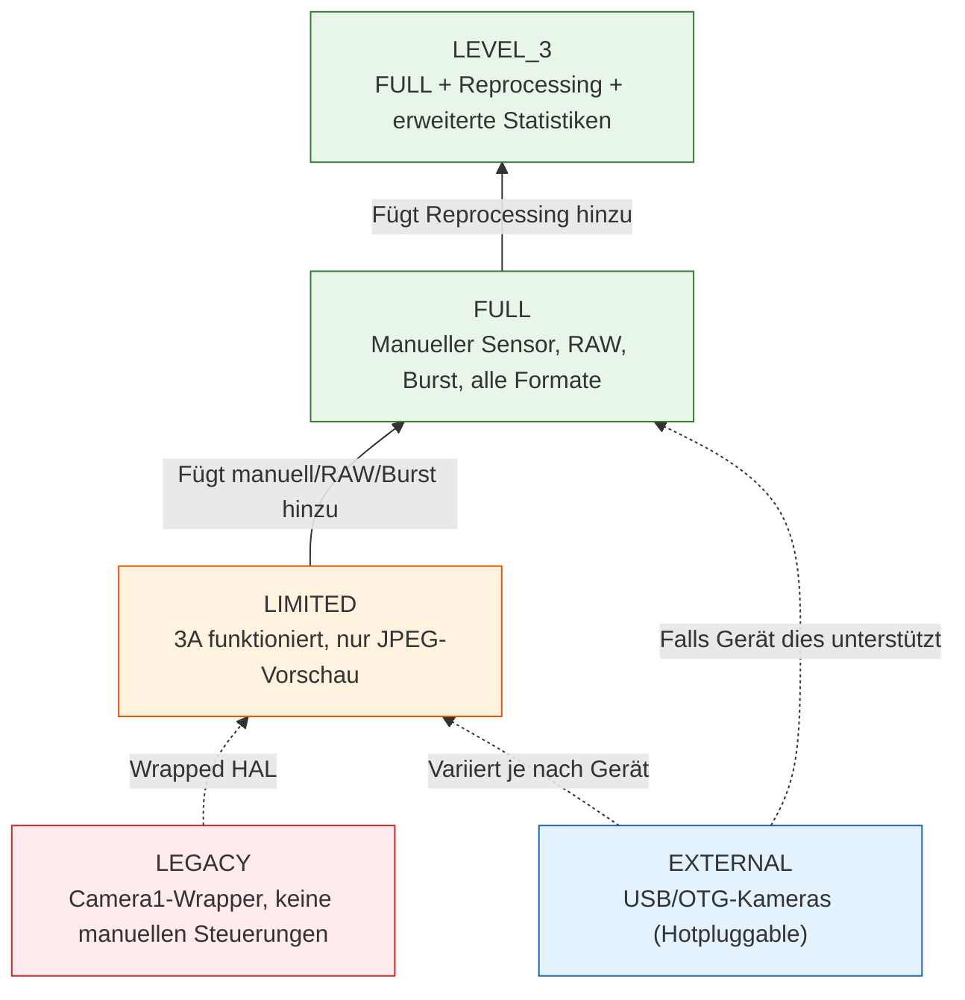
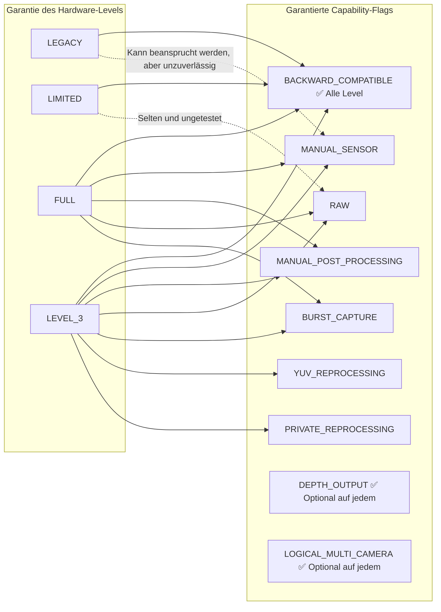
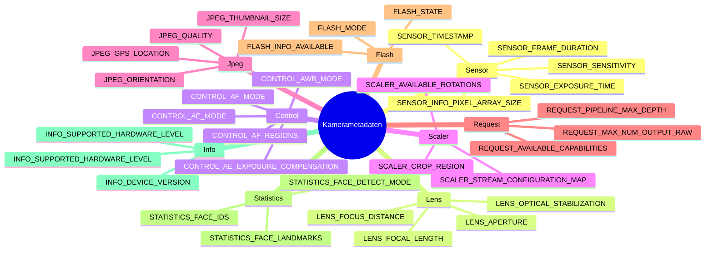

## 12.1 Das Datenblatt in Ihrer Tasche

Bevor Sie `openCamera()` aufrufen, bevor Sie einen `CaptureRequest` erstellen, bevor Sie eine Sitzung konfigurieren können — gibt es die `CameraCharacteristics`. Sie sind das unveränderliche Fenster, das keinen Strom verbraucht, in *alles*, was eine Kamera leisten kann. Betrachten Sie sie als das Datenblatt der Kamera, das als strukturiertes, abfragbares Objekt offengelegt wird.

`CameraCharacteristics` ist Ihr wichtigstes Werkzeug, um Apps zu schreiben, die auf den über 10.000 Android-Gerätemodellen funktionieren. Sie können nicht davon ausgehen, dass der manuelle ISO-Wert funktioniert. Sie können nicht davon ausgehen, dass RAW verfügbar ist. Sie können nicht einmal davon ausgehen, dass die Kamera eine 1080p-Vorschau unterstützt — es sei denn, Sie fragen die `CameraCharacteristics` ab.

In [Kapitel 6](discovering-cameras.md) haben wir die Grundlagen gestreift: Ausrichtung des Objektivs, Sensorgröße, Brennweite. In diesem tiefen Einblick gehen wir viel weiter:
- Die fünf **Hardware-Level** (LEGACY → LIMITED → FULL → LEVEL_3 → EXTERNAL) und was jedes garantiert.
- Die zehn+ **Capability-Flags** (`MANUAL_SENSOR`, `RAW`, `DEPTH_OUTPUT` usw.) und welche Hardware-Level diese bereitstellen.
- Wie Metadaten-Schlüssel **hierarchisch nach Subsystemen organisiert** sind (`android.sensor.*`, `android.lens.*`, `android.control.*`, ...).
- Wie man eine **umfassende Laufzeit-Fähigkeitsabfrage** mit eleganten Fallbacks schreibt.

Die App Android Camera Parameters ([GitHub](https://github.com/zoozooll/AndroidCameraParameters), [Play Store](https://play.google.com/store/apps/details?id=com.minininja.cameraparams)) ist im Grunde ein `CameraCharacteristics`-Browser auf Steroiden. Öffnen Sie sie für eine beliebige Kamera und Sie sehen genau die Schlüssel, die wir in diesem Kapitel besprechen, nach Kategorien geordnet, mit menschenlesbaren Beschriftungen und Live-Werte-Rendering.

## 12.2 Was CameraCharacteristics eigentlich sind

Formal gesehen sind `CameraCharacteristics`:

- **Unveränderlich** — Einmal über `CameraManager.getCameraCharacteristics(id)` erhalten, ändert sich das Objekt niemals (mit einer dokumentierten Ausnahme: `SENSOR_ORIENTATION` bei Foldables ab API 32).
- **Stromlos** — Das Abfragen verbraucht **keinen** Strom vom Sensor oder ISP. Sie können sie in `onCreate()` Ihrer ersten Activity aufrufen, ohne den Akku zu belasten.
- **Pro Kamera** — Jede logische Kamera-ID hat ihr eigenes `CameraCharacteristics`-Objekt.
- **Typsicher und schlüsselbasiert** — Der Zugriff auf Daten erfolgt über `<Key<T>> get(Key<T> key)`, wobei jeder Schlüssel einen dokumentierten Typ hat (Int, Long, Float, Rect, Array usw.).

Sie erhalten eines mit einem einzigen Aufruf:

```kotlin
val cameraManager = getSystemService(CAMERA_SERVICE) as CameraManager
val cameraIdList = cameraManager.cameraIdList  // z. B. ["0", "1", "2", "3"]

for (id in cameraIdList) {
    val characteristics: CameraCharacteristics = cameraManager.getCameraCharacteristics(id)
    // Abfragen nach Belieben — kein Sensorstrom verbraucht!
}
```

Unter Android 15 (API 35) können Sie `CameraManager.getCameraDeviceSetup(id)` für leichtgewichtige Sitzungskonfigurationsabfragen verwenden, ohne die Kamera zu öffnen (siehe [Kapitel 28](camera2-architecture.md) für Details zu `CameraDeviceSetup`).

## 12.3 Hardware-Level: INFO_SUPPORTED_HARDWARE_LEVEL

Der wichtigste Schlüssel in den `CameraCharacteristics` ist **`INFO_SUPPORTED_HARDWARE_LEVEL`**. Er definiert die gesamte Stufe des Kamera-HALs und sagt Ihnen (im Groben), welche Funktionen garantiert funktionieren. Es gibt fünf Hardware-Level:

### Die fünf Hardware-Level

| Level | Konstante | Typische Geräte | Bedeutung in der Praxis |
|-------|----------|----------------|---------------------------|
| **LEGACY** | `INFO_SUPPORTED_HARDWARE_LEVEL_LEGACY` | Budget-Geräte vor 2015, sehr alte Chipsätze | Die Camera2-API ist ein Wrapper um die alte `android.hardware.Camera`-API. Keine Steuerung pro Frame, keine manuellen Einstellungen, RAW unmöglich, Bursts unzuverlässig. Behandeln Sie diese Geräte als "Camera1-Ära mit Camera2-Syntax". |
| **LIMITED** | `INFO_SUPPORTED_HARDWARE_LEVEL_LIMITED` | Budget-Handys (Android Go, Einstiegs-SoCs wie MediaTek Helio, Snapdragon 4xx) | Nativer Camera2-HAL, aber nur eine Teilmenge der Funktionen. 3A (AF/AE/AWB) funktionieren. Vorschau + JPEG funktionieren. Aber **keine** manuelle Sensorsteuerung, **keine** RAW, **keine** garantierter Burst, **kein** YUV-Reprocessing. Dies ist Androids "funktionale Basisstufe" für Kameras. |
| **FULL** | `INFO_SUPPORTED_HARDWARE_LEVEL_FULL` | Mittelklasse- und Flaggschiff-Telefone (Snapdragon 6xx/7xx/8xx, Exynos Mittelklasse+, Dimensity 7xxx+) | Die Stufe für "Profi-Kameras". Garantiert MANUAL_SENSOR, MANUAL_POST_PROCESSING, BURST_CAPTURE, Einstellungen pro Frame, 30 fps bei voller Auflösung, RAW, alle Ausgabeformate, vorhersehbare Pipeline-Tiefe. Was man für jede ernsthafte Kamera-App will. |
| **LEVEL_3** | `INFO_SUPPORTED_HARDWARE_LEVEL_3` | High-End-Flaggschiffe mit fortschrittlichem ISP (Snapdragon 8 Gen 1+, Pixel 6+, Exynos 2xxx+) | FULL + Extras: YUV-Reprocessing (Unterstützung von Eingabeströmen, Offline-Reprocessing), privates Reprocessing, erweiterte Statistiken, Hardware-JPEG + RAW gleichzeitig bei maximaler Auflösung. Erforderlich für ZSL mit RAW-Ausgabe. |
| **EXTERNAL** | `INFO_SUPPORTED_HARDWARE_LEVEL_EXTERNAL` | USB-Kameras, Webcams über OTG | Externer Kamera-HAL. Verhält sich je nach USB-Gerät wie LIMITED oder FULL. Wichtiger Vorbehalt: Die Kamera kann jederzeit angeschlossen/getrennt werden, hören Sie also auf `ACTION_CAMERA_DEVICE_STATE_CHANGED`. |



:::important
Das Hardware-Level ist eine **Garantie**, kein Best-Effort-Flag. Wenn ein Gerät FULL meldet, hat Googles CTS (Compatibility Test Suite) verifiziert, dass jede Funktion der FULL-Stufe funktioniert. Wenn ein Gerät LIMITED meldet, können Sie sich auf keine Funktion der FULL-Stufe verlassen — selbst wenn sie auf einem bestimmten LIMITED-Gerät zufällig funktioniert, wird sie auf einem anderen fehlschlagen.
:::

### Überprüfung des Hardware-Levels zur Laufzeit

```kotlin
val hardwareLevel = characteristics.get(CameraCharacteristics.INFO_SUPPORTED_HARDWARE_LEVEL)

when (hardwareLevel) {
    CameraCharacteristics.INFO_SUPPORTED_HARDWARE_LEVEL_LEGACY -> {
        Log.w("CamCaps", "LEGACY-Hardware — manuell/RAW deaktiviert. Fallback auf Basis-JPEG.")
        disableManualControls()
        disableRawCapture()
    }
    CameraCharacteristics.INFO_SUPPORTED_HARDWARE_LEVEL_LIMITED -> {
        Log.i("CamCaps", "LIMITED-Hardware — nur Basisfoto + Vorschau.")
        disableManualControls()
        disableRawCapture()
        disableBurstCapture()
    }
    CameraCharacteristics.INFO_SUPPORTED_HARDWARE_LEVEL_FULL -> {
        Log.i("CamCaps", "FULL-Hardware — aktiviere manuelle Steuerungen, RAW und Burst.")
        enableManualControls()
        enableRawCapture()
        enableBurstCapture()
    }
    CameraCharacteristics.INFO_SUPPORTED_HARDWARE_LEVEL_3 -> {
        Log.i("CamCaps", "LEVEL_3-Hardware — FULL + Reprocessing + ZSL + erweiterte Statistiken.")
        enableManualControls()
        enableRawCapture()
        enableBurstCapture()
        enableReprocessing()
        enableZeroShutterLag()
    }
    CameraCharacteristics.INFO_SUPPORTED_HARDWARE_LEVEL_EXTERNAL -> {
        Log.i("CamCaps", "EXTERNAL-Kamera — kann LIMITED oder FULL sein; registriere Trennungs-Listener.")
        registerHotplugListener()
        // Fähigkeiten dynamisch prüfen, anstatt sie vorauszusetzen
    }
    else -> {
        Log.w("CamCaps", "Unbekanntes Hardware-Level $hardwareLevel — nehme LIMITED zur Sicherheit an.")
        safeDefaultFeatures()
    }
}
```

## 12.4 Fähigkeiten: REQUEST_AVAILABLE_CAPABILITIES

Das Hardware-Level ist eine *grobe* Einstufung. Für eine fein abgestimmte Erkennung von Funktionen legt Camera2 `REQUEST_AVAILABLE_CAPABILITIES` offen — ein `IntArray` von Capability-Flags. Jedes Flag beschreibt eine spezifische Sache, die die Kamera leisten kann.

Die formale Beziehung zwischen Hardware-Level und Fähigkeiten:



### Die Capability-Flags erklärt

| Flag-Konstante | Bedeutung | Garantie des Hardware-Levels | Praktische Auswirkung |
|--------------|---------|--------------------------|----------------------|
| `BACKWARD_COMPATIBLE` | Die Kamera implementiert die Basis-Camera2-API | **Alle 5 Level** (LEGACY–EXTERNAL) | Wenn dies fehlt, ist das Kameragerät für Ihre App praktisch funktionsunfähig. |
| `MANUAL_SENSOR` | Die App kann `SENSOR_EXPOSURE_TIME`, `SENSOR_SENSITIVITY`, `SENSOR_FRAME_DURATION`, `LENS_FOCUS_DISTANCE`, `LENS_APERTURE` manuell steuern | Garantiert auf **FULL** und **LEVEL_3** | UIs für den Pro-Modus und manuelle Kameras erfordern dies. Ohne dies müssen alle manuellen ISO-/Belichtungs-Schieberegler ausgeblendet werden. |
| `MANUAL_POST_PROCESSING` | Die App kann ISP-Stufen manuell steuern: Rauschunterdrückung, Kantenanhebung, Tonwertkurve, Farbkorrektur-Gains, Farbkorrektur-Transformation | Garantiert auf **FULL** und **LEVEL_3** | Erforderlich für benutzerdefinierte "Filmlook"-LUTs, manuellen Weißabgleich über Gains, Schärfe-/Unschärfe-Steuerung. |
| `RAW` | Der Sensor gibt RAW-Bayer-Daten über die Formate `ImageFormat.RAW_SENSOR`, `RAW10` oder `RAW12` aus | Garantiert auf **FULL** und **LEVEL_3** | DNG-Aufnahme, RAW-zu-JPEG-Bearbeitungspipeline, computergestützte Fotografie — alles beginnt hier. |
| `PRIVATE_REPROCESSING` | Die Kamera unterstützt `InputSurface` + Offline-Reprocessing von Bildern im HAL-privaten Format in JPEG/YUV | Garantiert auf **LEVEL_3**. Selten auf FULL. | Ermöglicht Zero-Shutter-Lag (ZSL): Ringpuffer für vergangene Frames, Reprocessing eines aktuellen Frames in ein hochwertiges Standbild. |
| `YUV_REPROCESSING` | Die Kamera unterstützt `InputSurface` + Reprocessing von App-bereitgestellten YUV_420_888-Bildern zurück durch den ISP | Garantiert auf **LEVEL_3** | Ermöglicht "Anwenden einer cineastischen LUT auf aufgezeichnetes Video" oder Pipelines zur nachträglichen Neufokussierung der Porträttiefe. |
| `DEPTH_OUTPUT` | Die Kamera kann Tiefenkarten ausgeben (Formate `DEPTH16` / `DEPTH_POINT_CLOUD`) | **Optional auf JEDEM** Level. Prüfen Sie das Array explizit. | Porträtmodus-Bokeh, AR-Messungen, 3D-Scannen. Oft gepaart mit `LOGICAL_MULTI_CAMERA` (zwei physische Kameras für Stereo-Tiefe). |
| `LOGICAL_MULTI_CAMERA` | Diese logische Kamera wird von 2+ physischen Sensoren unterstützt (z. B. Ultraweitwinkel + Weitwinkel + Tele) | **Optional auf JEDEM** Level. Meist nur bei Flaggschiffen. | Ermöglicht nahtlosen optischen Zoom (siehe [Kapitel 20](multi-camera.md)). Sie können `LOGICAL_MULTI_CAMERA_PHYSICAL_IDS` abfragen, um die IDs der physischen Kameras zu erhalten. |
| `BURST_CAPTURE` | `captureBurst()` mit > 1 Frame funktioniert bei voller Auflösung ohne Frame-Drops | Garantiert auf **FULL** und **LEVEL_3** | Ohne dies kann die Serienaufnahme ruckeln, Bilder auslassen oder stillschweigend fehlschlagen. Belichtungs- oder Fokusreihen erfordern dies. |
| `CONSTRAINED_HIGH_SPEED_VIDEO` | Unterstützt `createHighSpeedRequestList()` + High-Speed-Video (120 fps, 240 fps) | **Optional auf FULL/LEVEL_3**. Selten auf LIMITED. | Zeitlupenaufnahme (siehe [Kapitel 19](high-speed-video.md)). |
| `MOTION_TRACKING` | Die Kamera kann Objekte / Gesichter bei hoher Bildrate mit niedriger Latenz verfolgen | Optional (selten). Zu finden bei Pixel-Geräten und einigen Flaggschiffen. | AR-Bewegungsverfolgung, Sport-Autofokus. |
| `LOGICAL_MULTI_CAMERA_SYNC` | Mehrere physische Kameras in einem logischen Gerät können synchronisierte Bilder aufnehmen | Optional. Erforderlich für echte simultane Aufnahme mit mehreren Sensoren. | Computergestützte Fotografie, die mehrere Objektive gleichzeitig verwendet (z. B. Fusions-Zoom). |

### Abfrage aller Fähigkeiten zur Laufzeit

```kotlin
val capabilities = characteristics.get(
    CameraCharacteristics.REQUEST_AVAILABLE_CAPABILITIES
) ?: intArrayOf()

fun hasCapability(cap: Int): Boolean = capabilities.contains(cap)

val supportsManualSensor = hasCapability(
    CameraCharacteristics.REQUEST_AVAILABLE_CAPABILITIES_MANUAL_SENSOR
)
val supportsRaw = hasCapability(
    CameraCharacteristics.REQUEST_AVAILABLE_CAPABILITIES_RAW
)
val supportsBurst = hasCapability(
    CameraCharacteristics.REQUEST_AVAILABLE_CAPABILITIES_BURST_CAPTURE
)
val supportsDepth = hasCapability(
    CameraCharacteristics.REQUEST_AVAILABLE_CAPABILITIES_DEPTH_OUTPUT
)
val supportsLogicalMultiCam = hasCapability(
    CameraCharacteristics.REQUEST_AVAILABLE_CAPABILITIES_LOGICAL_MULTI_CAMERA
)
val supportsHighSpeed = hasCapability(
    CameraCharacteristics.REQUEST_AVAILABLE_CAPABILITIES_CONSTRAINED_HIGH_SPEED_VIDEO
)
val supportsYuvReprocessing = hasCapability(
    CameraCharacteristics.REQUEST_AVAILABLE_CAPABILITIES_YUV_REPROCESSING
)
val supportsPrivateReprocessing = hasCapability(
    CameraCharacteristics.REQUEST_AVAILABLE_CAPABILITIES_PRIVATE_REPROCESSING
)

// Erstellung eines menschenlesbaren Berichts
val capabilityReport = buildString {
    appendLine("=== Bericht der Kamerafähigkeiten ===")
    appendLine("BACKWARD_COMPATIBLE:     ${hasCapability(
        CameraCharacteristics.REQUEST_AVAILABLE_CAPABILITIES_BACKWARD_COMPATIBLE
    )}")
    appendLine("MANUAL_SENSOR:           $supportsManualSensor")
    appendLine("MANUAL_POST_PROCESSING:  ${hasCapability(
        CameraCharacteristics.REQUEST_AVAILABLE_CAPABILITIES_MANUAL_POST_PROCESSING
    )}")
    appendLine("RAW:                     $supportsRaw")
    appendLine("BURST_CAPTURE:           $supportsBurst")
    appendLine("YUV_REPROCESSING:        $supportsYuvReprocessing")
    appendLine("PRIVATE_REPROCESSING:    $supportsPrivateReprocessing")
    appendLine("DEPTH_OUTPUT:            $supportsDepth")
    appendLine("LOGICAL_MULTI_CAMERA:    $supportsLogicalMultiCam")
    appendLine("CONSTRAINED_HIGH_SPEED:  $supportsHighSpeed")
}

Log.i("CamCaps", capabilityReport)

// Nun steuern Sie die Sichtbarkeit Ihrer UI-Funktionen
manualIsoSlider.isEnabled = supportsManualSensor
manualExposureSlider.isEnabled = supportsManualSensor
rawCaptureToggle.isEnabled = supportsRaw
burstCaptureButton.isEnabled = supportsBurst
depthPortraitMode.isEnabled = supportsDepth
zoomSwitcher.isEnabled = supportsLogicalMultiCam
slowMoButton.isEnabled = supportsHighSpeed
zslMode.isEnabled = supportsPrivateReprocessing  // LEVEL_3
```

:::tip
Die App Android Camera Parameters stellt genau diese Abfrage als farbcodierte Checkboxen in der Karte **Capabilities** der Kamera-Zusammenfassungsansicht dar. Grün = unterstützt, grau = nicht unterstützt. Sie können mehrere Kameras nebeneinander vergleichen, um zu sehen, wie sich die Fähigkeiten des Ultraweitwinkels von denen der Hauptkamera unterscheiden.
:::

## 12.5 Organisation der Metadaten: Der android.* Namespace

Jeder Schlüssel in den `CameraCharacteristics`, `CaptureRequest` und `CaptureResult` folgt einer hierarchischen Namenskonvention: `android.<subsystem>.<parameter>`. Die durch Punkte getrennten Komponenten gruppieren verwandte Einstellungen nach dem Hardware-/Software-Subsystem, das sie steuern.

### Die Subsystem-Klassen

| Subsystem-Präfix | Kotlin Metadaten-Klasse | Was es abdeckt |
|-----------------|----------------------|---------------|
| `android.sensor.*` | `CameraCharacteristics.SensorInfo*`, `CaptureRequest.SENSOR_*`, `CaptureResult.SENSOR_*` | Sensorauslesung: Belichtungszeit, ISO-Empfindlichkeit, Frame-Dauer, Zeitstempel, Pixel-Array, aktives Array, Rolling-Shutter-Richtung, Testbildmodi |
| `android.lens.*` | `LensInfo*`, `Lens.*` | Optik: Fokusabstand, Blende, Brennweite, optische Stabilisierung (OIS), Filterdichte (ND), Fokusbereich, verfügbare Blenden |
| `android.control.*` | `Control*` | 3A-Algorithmen: Auto-Belichtung (AE) Modi / Status / Ziel / Regionen, Auto-Fokus (AF) Modi / Status / Trigger / Regionen, Auto-Weißabgleich (AWB) Modi / Status / Regionen, Anti-Banding, Szenenmodi, Effektmodi, Videostabilisierung (EIS) |
| `android.scaler.*` | `Scaler.*` | Konfiguration der Ausgabepipeline: Crop-Region (digitaler Zoom), Rotation, Stream-Konfigurations-Map (Ausgabeformate, Größen, Zeitdauern), verfügbare Mindest-Frame-Dauern |
| `android.jpeg.*` | `Jpeg*` | JPEG-Kodierung: Qualität, Ausrichtung, GPS-Koordinaten, Thumbnail-Größe, Thumbnail-Qualität |
| `android.request.*` | `Request*` | Pipeline-weite Fähigkeiten: verfügbares Fähigkeiten-Array, maximale Pipeline-Tiefe, maximale Anzahl an Ausgaben RAW/Proc, Schlüssel für Metadaten-Objekte, Liste der verfügbaren Vorlagen |
| `android.flash.*` | `FlashInfo*`, `Flash*` | Blitzeinheit: Verfügbarkeit, Ladezustand, Farbtemperatur, maximale Helligkeit, Modus (aus / einzeln / Taschenlampe) |
| `android.statistics.*` | `Statistics*` | Ausgabe von ISP-Statistiken: Gesichtserkennung, Face-IDs, Gesichts-Landmarken, Gesichts-Bewertungen, Histogramm, Schärfekarte, Objektivschattierungs-Map, Hot-Pixel-Map |
| `android.info.*` | `Info*` | Statische Kamera-Infos: unterstütztes Hardware-Level, Geräteversion, verfügbare Modi für Gesichtserkennung, verfügbare Modi für Rauschunterdrückung |
| `android.black.*` | `BlackLevel*` | Schwarzpunkt-Sperre, Schwarzpunkt-Muster (Korrektur des Fixed Pattern Noise) |
| `android.colorCorrection.*` | `ColorCorrection*` | Farbpipeline: Transformationsmatrix, Farbkorrektur-Gains (R-, G-, B-Kanäle), Modus für Aberrationskorrektur |
| `android.tonemap.*` | `Tonemap*` | Tonwertkorrektur: Tonwertkurve (benutzerdefiniertes Gamma), Tonwertmodus, Kontrast, Sättigung |
| `android.edge.*` | `Edge*` | Kantenanhebung / Schärfen: Modus, Stärke |
| `android.noiseReduction.*` | `NoiseReduction*` | Rauschunterdrückung: Modus, Stärke, zeitliche NR-Stärke |
| `android.shading.*` | `Shading*` | Objektivschattierung / Vignettierungskorrektur: Modus, Stärke |
| `android.hotPixel.*` | `HotPixel*` | Hot-Pixel-Korrektur: Modus, Hot-Pixel-Map |
| `android.distortionCorrection.*` | `DistortionCorrection*` | Geometrische Verzeichnungskorrektur des Objektivs: Modus |
| `android.depth.*` | `Depth*` | Tiefenausgabe: Tiefe ist exklusiv, maximale Anzahl an Tiefenproben, Tiefenformat |
| `android.logicalMultiCamera.*` | `LogicalMultiCamera*` | Logische Multi-Kamera: physische Kamera-IDs, physischer Sensorsync |



### Ein Hinweis zur Verfügbarkeit von Schlüsseln

Nicht jeder Schlüssel existiert auf jedem Gerät. Wenn Sie `get(KEY)` für einen Schlüssel aufrufen, den das Gerät nicht unterstützt, erhalten Sie `null` — daher die Muster `?: 0` oder `?.let`, die Sie in diesem Buch überall sehen.

Das sichere Muster ist: **Prüfen Sie, ob der Schlüssel existiert, bevor Sie ihn lesen**, oder nutzen Sie Kotlins Null-Sicherheit, um einen Standardwert bereitzustellen.

```kotlin
// Sicherer Zugriff mit Fallback-Standards
val exposureTimeNs: Long = characteristics.get(
    CameraCharacteristics.SENSOR_INFO_EXPOSURE_TIME_RANGE
)?.upper ?: 1_000_000L  // Standard 1 ms max, falls Schlüssel fehlt

// Optionale Verarbeitung, falls Schlüssel existiert
characteristics.get(CameraCharacteristics.LENS_INFO_AVAILABLE_APERTURES)?.let { apertures ->
    Log.d("CamCaps", "Gerät unterstützt ${apertures.size} Blenden: ${apertures.contentToString()}")
    buildApertureSelector(apertures)
} ?: run {
    Log.d("CamCaps", "Keine variable Blende auf diesem Gerät")
    hideApertureControl()
}
```

## 12.6 Eine vollständige Laufzeit-Fähigkeitsabfrage (Produktionsqualität)

Zusammenfassend finden Sie hier eine produktionsreife Fähigkeitsabfrage, die Sie in jede Camera2-App einbauen können. Sie kombiniert Hardware-Level, Capability-Flags und die Überprüfung einzelner Schlüssel:

```kotlin
data class CameraCapabilityProfile(
    val cameraId: String,
    val lensFacing: Int,
    val hardwareLevel: Int,
    val hardwareLevelName: String,
    val supportsManualSensor: Boolean,
    val supportsManualPostProcessing: Boolean,
    val supportsRaw: Boolean,
    val supportsBurst: Boolean,
    val supportsDepth: Boolean,
    val supportsLogicalMultiCam: Boolean,
    val supportsHighSpeedVideo: Boolean,
    val supportsYuvReprocessing: Boolean,
    val supportsPrivateReprocessing: Boolean,
    val maxBurstRaw: Int,
    val maxBurstProcessed: Int,
    val pipelineMaxDepth: Int,
    val availableFocalLengths: FloatArray?,
    val availableApertures: FloatArray?,
    val minFocusDistanceDiopters: Float?,
    val maxDigitalZoom: Float?
)

fun buildCapabilityProfile(
    cameraManager: CameraManager,
    cameraId: String
): CameraCapabilityProfile {
    val c = cameraManager.getCameraCharacteristics(cameraId)

    val hwLevel = c.get(CameraCharacteristics.INFO_SUPPORTED_HARDWARE_LEVEL)
        ?: CameraCharacteristics.INFO_SUPPORTED_HARDWARE_LEVEL_LEGACY

    val hwLevelName = when (hwLevel) {
        CameraCharacteristics.INFO_SUPPORTED_HARDWARE_LEVEL_LEGACY -> "LEGACY"
        CameraCharacteristics.INFO_SUPPORTED_HARDWARE_LEVEL_LIMITED -> "LIMITED"
        CameraCharacteristics.INFO_SUPPORTED_HARDWARE_LEVEL_FULL -> "FULL"
        CameraCharacteristics.INFO_SUPPORTED_HARDWARE_LEVEL_3 -> "LEVEL_3"
        CameraCharacteristics.INFO_SUPPORTED_HARDWARE_LEVEL_EXTERNAL -> "EXTERNAL"
        else -> "UNKNOWN($hwLevel)"
    }

    val caps = c.get(CameraCharacteristics.REQUEST_AVAILABLE_CAPABILITIES) ?: intArrayOf()
    fun has(cap: Int) = caps.contains(cap)

    // Das Hardware-Level bietet Garantien für Fähigkeiten, aber prüfen Sie zur Sicherheit die Flags
    val atLeastFull = hwLevel == CameraCharacteristics.INFO_SUPPORTED_HARDWARE_LEVEL_FULL ||
                      hwLevel == CameraCharacteristics.INFO_SUPPORTED_HARDWARE_LEVEL_3

    return CameraCapabilityProfile(
        cameraId = cameraId,
        lensFacing = c.get(CameraCharacteristics.LENS_FACING)
            ?: CameraCharacteristics.LENS_FACING_BACK,
        hardwareLevel = hwLevel,
        hardwareLevelName = hwLevelName,

        // Nutze Flag-Check + Hardware-Level-Garantie-Fallback zur Sicherheit
        supportsManualSensor = has(
            CameraCharacteristics.REQUEST_AVAILABLE_CAPABILITIES_MANUAL_SENSOR
        ) || atLeastFull,
        supportsManualPostProcessing = has(
            CameraCharacteristics.REQUEST_AVAILABLE_CAPABILITIES_MANUAL_POST_PROCESSING
        ) || atLeastFull,
        supportsRaw = has(
            CameraCharacteristics.REQUEST_AVAILABLE_CAPABILITIES_RAW
        ) || atLeastFull,
        supportsBurst = has(
            CameraCharacteristics.REQUEST_AVAILABLE_CAPABILITIES_BURST_CAPTURE
        ) || atLeastFull,
        supportsDepth = has(
            CameraCharacteristics.REQUEST_AVAILABLE_CAPABILITIES_DEPTH_OUTPUT
        ),
        supportsLogicalMultiCam = has(
            CameraCharacteristics.REQUEST_AVAILABLE_CAPABILITIES_LOGICAL_MULTI_CAMERA
        ),
        supportsHighSpeedVideo = has(
            CameraCharacteristics.REQUEST_AVAILABLE_CAPABILITIES_CONSTRAINED_HIGH_SPEED_VIDEO
        ),
        supportsYuvReprocessing = has(
            CameraCharacteristics.REQUEST_AVAILABLE_CAPABILITIES_YUV_REPROCESSING
        ),
        supportsPrivateReprocessing = has(
            CameraCharacteristics.REQUEST_AVAILABLE_CAPABILITIES_PRIVATE_REPROCESSING
        ),

        maxBurstRaw = c.get(CameraCharacteristics.REQUEST_MAX_NUM_OUTPUT_RAW) ?: 1,
        maxBurstProcessed = c.get(CameraCharacteristics.REQUEST_MAX_NUM_OUTPUT_PROC) ?: 1,
        pipelineMaxDepth = c.get(CameraCharacteristics.REQUEST_PIPELINE_MAX_DEPTH) ?: 1,

        availableFocalLengths = c.get(CameraCharacteristics.LENS_INFO_AVAILABLE_FOCAL_LENGTHS),
        availableApertures = c.get(CameraCharacteristics.LENS_INFO_AVAILABLE_APERTURES),
        minFocusDistanceDiopters = c.get(CameraCharacteristics.LENS_INFO_MINIMUM_FOCUS_DISTANCE),
        maxDigitalZoom = c.get(CameraCharacteristics.SCALER_AVAILABLE_MAX_DIGITAL_ZOOM)
    )
}

// Verwendung:
val profile = buildCapabilityProfile(cameraManager, "0")
Log.d("CamCaps", "Profil für Kamera 0: ${profile.hardwareLevelName}, " +
    "Manuell=${profile.supportsManualSensor}, RAW=${profile.supportsRaw}, " +
    "Burst=${profile.supportsBurst}, Tiefe=${profile.supportsDepth}, " +
    "Zoom=${profile.maxDigitalZoom}x")
```

## 12.7 Visualisierung in der App Android Camera Parameters

Die App Android Camera Parameters ([GitHub](https://github.com/zoozooll/AndroidCameraParameters), [Play Store](https://play.google.com/store/apps/details?id=com.minininja.cameraparams)) ist der ideale Begleiter zu diesem Kapitel. Sie wandelt die rohen `CameraCharacteristics`-Schlüssel-Wert-Paare in eine durchsuchbare UI um:

- **Übersichtskarte** — Hardware-Level (mit farbcodiertem Badge: rot=LEGACY, orange=LIMITED, grün=FULL, blaugrün=LEVEL_3, blau=EXTERNAL), Objektiv-Ausrichtung, Sensorauflösung, Brennweiten.
- **Capabilities-Karte** — Checkliste jedes `REQUEST_AVAILABLE_CAPABILITIES`-Flags, grün wenn vorhanden.
- **Kategorie-Tabs** — Genau nach den `android.*`-Subsystemen organisiert: Sensor, Lens, Control, Scaler, Jpeg, Flash, Statistics, Info, Request.
- **Raw-JSON-Tab** — Das vollständige serialisierte `CameraCharacteristics`-Objekt zum Kopieren/Einfügen in Fehlerberichte.
- **Vergleichsmodus** — Wischen Sie zwischen Kameras (0, 1, 2, 3), um zu sehen, wie sich Hardware-Level und Fähigkeiten zwischen den Objektiven unterscheiden.

## 12.8 Zusammenfassung

| Konzept | Kernaussage |
|---------|-------------|
| **Hardware-Level** | 5 Stufen: LEGACY (Wrapper) → LIMITED (Basis) → FULL (Pro + manuell/RAW) → LEVEL_3 (FULL + Reprocessing) → EXTERNAL (USB). FULL ist das Minimum für jede ernsthafte Kameraarbeit. CTS-verifizierte Garantien. |
| **Capability-Flags** | Fein abgestimmte Erkennung von Funktionen über `REQUEST_AVAILABLE_CAPABILITIES`. Wichtige Flags: `MANUAL_SENSOR`, `MANUAL_POST_PROCESSING`, `RAW`, `BURST_CAPTURE`, `DEPTH_OUTPUT`, `LOGICAL_MULTI_CAMERA`, `PRIVATE_REPROCESSING`, `YUV_REPROCESSING`, `CONSTRAINED_HIGH_SPEED_VIDEO`. |
| **Level → Capability Zuordnung** | FULL garantiert MANUAL_SENSOR, MANUAL_POST_PROCESSING, RAW, BURST. LEVEL_3 fügt YUV/PRIVATE_REPROCESSING hinzu. DEPTH und LOGICAL_MULTI_CAMERA sind auf allen Leveln optional. |
| **Metadaten-Namensraum** | Schlüssel organisiert als `android.<subsystem>.<parameter>`. Wichtigste Subsysteme: Sensor, Lens, Control, Scaler, Jpeg, Request, Flash, Statistics, Info. Jedes Subsystem verfügt über statische Informationen (CameraCharacteristics), Anforderungs-Eingaben (CaptureRequest) und Ergebnisausgaben (CaptureResult). |
| **Sichere Abfragen** | Stellen Sie immer Fallback-Standards für `get()` — viele Schlüssel sind optional. Nutzen Sie das Hardware-Level als groben Filter, Capability-Flags als feinen Filter und das Vorhandensein einzelner Schlüssel für gerätespezifisches Tuning. |

## Wie geht es weiter?

Nachdem Sie nun verstanden haben, was eine Kamera leisten kann (Characteristics) und wie man sie steuert (Pipeline + Aufnahme-Typen), verfügen Sie über die vollständige Grundlage für Teil IV.

In **Kapitel 13: Manuelle Kamera-ISO und Belichtung** lernen Sie, die Fähigkeit `MANUAL_SENSOR` zu nutzen, um `SENSOR_EXPOSURE_TIME` und `SENSOR_SENSITIVITY` manuell zu steuern — und implementieren einen Belichtungsregler für den Pro-Modus mit Live-Vorschau, Belichtungskorrektur und den Kompromissen des Belichtungsdreiecks.
