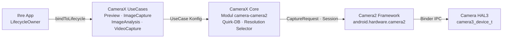

# Kapitel 24: CameraX

## Zusammenfassung

Wenn Sie dieses Kapitel erreichen, haben Sie die rohe Camera2-API gemeistert: Sie haben `CameraDevice`-Instanzen von Hand geöffnet, `CaptureRequest.Builder`-Objekte konstruiert, den Lebenszyklus von `CameraCaptureSession` verwaltet, mit drei verschiedenen Callback-Typen jongliert und sorgfältig jede Ressource in jedem Sonderfall freigegeben. Sie haben sich Ihre Sporen verdient. Jetzt treten wir einen Schritt zurück und fragen uns: Was wäre, wenn 80 % dieses Boilerplate-Codes verschwinden könnten?

CameraX ist die Jetpack-Bibliothek von Google, die Camera2 in eine Lifecycle-bewusste, deklarative und Use-Case-gesteuerte API hüllt. Sie ersetzt Camera2 nicht – sie ist Camera2 unter der Haube. Was sie ersetzt, sind hunderte Zeilen Code für die Sitzungskonfiguration, die Handhabung gerätespezifischer Eigenheiten und die manuelle Buchführung des Lebenszyklus. In diesem Kapitel lernen Sie die Architektur von CameraX kennen, verstehen das `UseCase`-Modell, sehen, wie Sie rohe Camera2-Parameter über `Camera2Interop` *in* CameraX einspeisen, und erhalten eine Entscheidungstabelle dafür, wann Sie zu CameraX greifen sollten und wann Sie auf die rohe Camera2-Ebene herabsteigen müssen.

Um die Erklärungen nachzuvollziehen und jede Kamerafunktion auf Ihrem eigenen Gerät zu inspizieren, bevor Sie sich für eine Schicht entscheiden, installieren Sie **Android Camera Parameters** aus dem [Google Play Store](https://play.google.com/store/apps/details?id=com.minininja.cameraparams) oder durchsuchen Sie den Quellcode auf [github.com/zoozooll/AndroidCameraParameters](https://github.com/zoozooll/AndroidCameraParameters).

---

## CameraX-Architektur

CameraX wird als fünf Jetpack-Artefakte ausgeliefert: `camera-core`, `camera-camera2`, `camera-lifecycle`, `camera-view` und `camera-extensions`. Das architektonische Rückgrat ist das `UseCase`-Modell – anstatt in Surfaces und Sessions zu denken, denken Sie daran, *was die Kamera tun soll*.

### Das UseCase-Modell

Es gibt vier kanonische Anwendungsfälle, und Sie können jede beliebige Teilmenge davon gleichzeitig an einen Lebenszyklus binden:

| UseCase          | Zweck                                                          |
|------------------|----------------------------------------------------------------|
| `Preview`        | Streamt Frames an eine `PreviewView` oder `Surface`. Analog zum Einrichten einer wiederholten Anforderung, die auf eine `SurfaceTexture` abzielt. |
| `ImageAnalysis`  | Streamt `ImageProxy`-Frames an Ihren Analyzer in einem Hintergrund-Thread. Ersetzt das manuelle Erstellen eines `ImageReader` mit `YUV_420_888` und das Verknüpfen seines Listeners mit einer wiederholten Anforderung. |
| `ImageCapture`   | One-Shot- oder Burst-Fotoaufnahme. Übernimmt die Aufnahmeanforderung, das `ImageReader`-Plumbing, die Rotation und EXIF für Sie. |
| `VideoCapture`   | Seit Version 1.1 in CameraX integriert; kapselt eine `MediaRecorder`- oder `ParcelFileDescriptor`-Pipeline mit korrekter Pause/Resume-Semantik und Audio-Routing. |

Das Binden aller vier UseCases ist absolut zulässig – CameraX gleicht die Stream-Kombination intern mit der `SCALER_STREAM_CONFIGURATION_MAP` ab und ruft in Ihrem Namen `isSessionConfigurationSupported` auf, wobei auf niedrigere Auflösungen zurückgegriffen wird, falls Ihre exakte Kombination nicht unterstützt wird. Dies ist einer der größten Vorteile: Sie werden nie wieder drei Stunden damit verbringen, herauszufinden, dass das Mittelklasse-Samsung von 2019 in Ihrer Testmatrix nicht gleichzeitig `4:3 PRIV + 16:9 JPEG_MAX` unterstützt. CameraX funktioniert einfach.

### ProcessCameraProvider und Lifecycle-Bewusstsein

Der Bindungspunkt ist der `ProcessCameraProvider`, ein Singleton im Besitz Ihres Anwendungsprozesses. Die entscheidende Zeile lautet:

```kotlin
val cameraProviderFuture = ProcessCameraProvider.getInstance(context)
cameraProviderFuture.addListener({
    val cameraProvider = cameraProviderFuture.get()
    val camera: Camera = cameraProvider.bindToLifecycle(
        lifecycleOwner,
        cameraSelector,
        preview,
        imageCapture,
        imageAnalysis
    )
}, ContextCompat.getMainExecutor(context))
```

Das ist alles. Keine Hölle aus `openCamera`-Callbacks, kein `StateCallback`, kein Sitzungskonfigurations-Callback, kein Teardown. Wenn der `lifecycleOwner` (Ihr `Fragment` oder Ihre `Activity`) den Zustand `ON_STOP` erreicht, schließt CameraX das `CameraDevice`. Bei `ON_DESTROY` wird die Sitzung abgebaut und jede Surface freigegeben. Ressourcenlecks der Art, wie Sie sie in Kapitel 7 gejagt haben, können schlichtweg nicht auftreten – der Lebenszyklus-Vertrag erzwingt dies.

### CameraX kapselt Camera2 intern

Intern ist CameraX Camera2. Das Artefakt `camera-camera2` enthält `Camera2Camera`, `Camera2CameraCaptureResult` und `Camera2RequestProcessor`, welche Ihre High-Level-UseCase-Deklarationen in genau die Aufrufe von `CameraManager.openCamera`, `createCaptureSession` und `setRepeatingRequest` übersetzen, die Sie in den vorangegangenen 23 Kapiteln von Hand geschrieben haben. Herstellerspezifische Workarounds sind in gerätespezifischen XML-Dateien innerhalb der Bibliothek kodiert – der berühmten "CameraX-Quirk-Datenbank".

Die vollständige Architektur sieht so aus:



Folgen Sie den Pfeilen von links nach rechts: Ihre App deklariert, *was* sie möchte (Anwendungsfälle), CameraX entscheidet, *wie* dies erreicht wird (Surface-Größen, Sitzungskonfiguration, Quirks), und gibt dann die identischen Camera2-Aufrufe ab, die Sie auch geschrieben hätten. Der Mehrwert liegt in den beiden mittleren Boxen – hunderttausende Zeilen von Google verfasster Code zur Gerätekompatibilität, den Sie nicht schreiben müssen.

---

## Camera2Interop: Camera2-Parameter in CameraX einspeisen

CameraX ist brillant für die 80 % der Standardfälle. Aber Sie, lieber Leser, sind ein Camera2-Meister. Sie wissen, was `CONTROL_AE_MODE_OFF` bedeutet. Sie kennen den Unterschied zwischen `SENSOR_SENSITIVITY` und `CONTROL_AE_EXPOSURE_COMPENSATION`. Wenn die Produktspezifikation verlangt, "dem Benutzer zu ermöglichen, ISO auf 400 und die Belichtung auf 1/60 s zu fixieren, selbst wenn er CameraX verwendet", schreiben Sie das ganze Feature nicht in rohem Camera2 neu. Sie greifen zu `Camera2Interop`.

### Das Extender-Muster

Jeder `UseCase.Builder` hat einen passenden `Camera2Interop.Extender`. Rufen Sie ihn *vor* `build()` auf, um rohe Camera2-Schlüssel entweder auf Sitzungsebene oder auf Ebene einzelner Anforderungen einzuspeisen:

| Methode                                         | Camera2-Äquivalent                           |
|------------------------------------------------|----------------------------------------------|
| `extender.setCaptureRequestOption(key, value)` | `CaptureRequest.Builder.set(key, value)`     |
| `extender.setSessionOption(key, value)`        | Session-Init-Parameter (seltener verwendet) |

Der Extender ist additiv: CameraX setzt weiterhin eigene Standardwerte für jeden Schlüssel, den Sie nicht überschreiben. Wenn Sie nur `SENSOR_SENSITIVITY` festlegen, übernimmt CameraX weiterhin AF, AWB, Rotation und Metadaten.

### Praxisbeispiel: Manuelle ISO und Belichtung in CameraX

Hier ist ein vollständiger `ImageCapture`-Builder, der die Kamera auf manuelle Belichtungsautomatik (AE) mit festem ISO 400 und einer Belichtungszeit von 1/60 Sekunde festlegt und dann ein Foto schießt:

```kotlin
val iso = 400
val exposureTimeNanos = 1_000_000_000L / 60 // 1/60 s

val imageCapture = ImageCapture.Builder()
    .setTargetResolution(Size(4032, 3024))
    .setCaptureMode(ImageCapture.CAPTURE_MODE_MAXIMIZE_QUALITY)
    .apply {
        val interop = Camera2Interop.Extender(this)
        interop.setCaptureRequestOption(
            CaptureRequest.CONTROL_AE_MODE,
            CaptureRequest.CONTROL_AE_MODE_OFF
        )
        interop.setCaptureRequestOption(
            CaptureRequest.CONTROL_AE_LOCK,
            false
        )
        interop.setCaptureRequestOption(
            CaptureRequest.SENSOR_SENSITIVITY,
            iso
        )
        interop.setCaptureRequestOption(
            CaptureRequest.SENSOR_EXPOSURE_TIME,
            exposureTimeNanos
        )
        interop.setCaptureRequestOption(
            CaptureRequest.CONTROL_MODE,
            CaptureRequest.CONTROL_MODE_OFF
        )
    }
    .build()

cameraProvider.bindToLifecycle(
    viewLifecycleOwner,
    CameraSelector.DEFAULT_BACK_CAMERA,
    preview,
    imageCapture
)

// Später die Aufnahme auslösen:
imageCapture.takePicture(
    ContextCompat.getMainExecutor(context),
    object : ImageCapture.OnImageCapturedCallback() {
        override fun onCaptureSuccess(imageProxy: ImageProxy) {
            // imageProxy enthält den manuell belichteten Frame
            imageProxy.close()
        }

        override fun onError(exception: ImageCaptureException) {
            Log.e(TAG, "Aufnahme fehlgeschlagen: ${exception.imageCaptureError}", exception)
        }
    }
)
```

**Wichtiger Vorbehalt:** Das Setzen von `CONTROL_MODE_OFF` deaktiviert *alle* 3A-Funktionen. Wenn Sie nur die Belichtung fixieren, aber weiterhin AF und AWB ausführen möchten, setzen Sie nur `CONTROL_AE_MODE_OFF` (oder `CONTROL_AE_LOCK = true`) und lassen Sie `CONTROL_MODE` auf dem Standardwert (`CONTROL_MODE_AUTO`). CameraX setzt für jeden Schlüssel, den Sie nicht berühren, Standardwerte ein.

Und ja – Sie können dasselbe mit `Preview.Builder` und `ImageAnalysis.Builder` für wiederholte manuelle Streams tun. Der Extender gilt für jede einzelne wiederholte oder einzelne Anforderung während der Lebensdauer dieses UseCase.

### Camera2-Ergebnisse wieder auslesen

Der umgekehrte Weg – das Extrahieren eines `TotalCaptureResult` aus einem CameraX-Callback – ist über `Camera2CameraCaptureResult` gleichermaßen unkompliziert:

```kotlin
imageCapture.takePicture(
    executor,
    object : ImageCapture.OnImageCapturedCallback() {
        override fun onCaptureSuccess(imageProxy: ImageProxy) {
            val camera2Result = imageProxy.imageInfo
                .cameraCaptureResult as? Camera2CameraCaptureResult
            val totalResult: TotalCaptureResult? = camera2Result?.captureResult
            val actualIso = totalResult?.get(CaptureResult.SENSOR_SENSITIVITY)
            Log.d(TAG, "Tatsächlicher ISO auf dem Sensor: $actualIso")
            imageProxy.close()
        }
    }
)
```

Dies ermöglicht Ihnen zu überprüfen, ob Ihre eingespeisten Parameter tatsächlich am Sensor angekommen sind. Verwenden Sie **Android Camera Parameters**, um gegenzuchecken, welchen Bereich für `SENSOR_INFO_SENSITIVITY_RANGE` Ihr Gerät angibt – wenn Ihr eingespeister ISO-Wert außerhalb dieses Bereichs liegt, begrenzt CameraX ihn stillschweigend (oder der HAL tut es), und das Auslesen des Ergebnisses ist der einzige Weg, dies zu erfahren.

---

## Wahl zwischen CameraX und Camera2

Die schwierigste architektonische Frage ist nicht "Wie verwende ich CameraX?", sondern "Sollte ich CameraX überhaupt verwenden?". Hier ist das Entscheidungs-Framework, destilliert aus echter Produktionsarbeit.

### Entscheidungs-Flussdiagramm

```mermaid
flowchart TD
    A["Start"] --> B{Benötigen Sie RAW-Aufnahme,<br/>ZSL-Reprocessing,<br/>physische Multi-Kamera-Streams,<br/>High-Speed > 60 fps?}
    B -->|Ja| D[Verwenden Sie rohes Camera2]
    B -->|Nein| C{Benötigen Sie CaptureRequest-<br/>Templating pro Frame pro physischer Kamera,<br/>eigene Sitzungskonfiguration<br/>(Input Reprocess Surfaces)<br/>oder Offline-Sitzungen?}
    C -->|Ja| D
    C -->|Nein| E{Einfache Vorschau + Foto<br/>+ Video + Analyse,<br/>breite Gerätekompatibilität?}
    E -->|Ja| F[Verwenden Sie CameraX]
    E -->|Nein| G{Deckt die CameraX-Quirk-DB<br/>Ihre Gerätepalette ab?<br/>Überprüfung über Android Camera Parameters}
    G -->|Ja| F
    G -->|Nein| D
```

### Entscheidungstabelle

| Szenario                                                              | CameraX | Rohes Camera2 |
|-----------------------------------------------------------------------|:-------:|:-----------:|
| Vorschau im Instagram-Stil + One-Tap Foto + Video                     |    ✅    |      ⛔      |
| QR-Code / Barcode / ML Kit Gesichtserkennung ohne Frame-Anpassung      |    ✅    |      ⛔      |
| Manuelle Belichtung mit festem ISO + Verschluss (Camera2Interop deckt dies ab) |    ✅    |      ⚠️       |
| Eigene 3A-Zustandsmaschine, die OEM-Algorithmen überschreibt           |    ⛔    |      ✅      |
| Profi-Fotografie mit `RAW_SENSOR` / `RAW_PRIVATE` / DNG                |    ⛔    |      ✅      |
| Zero Shutter Lag (Kapitel 23) mit Reprocessing-Input-Surfaces         |    ⛔    |      ✅      |
| Physischer Zugriff auf Multi-Kamera-Streams (Kapitel 20)              |    ⛔    |      ✅      |
| High Speed 120/240 fps mit Constrained-High-Speed-Sessions            |    ⛔    |      ✅      |
| Camera Extensions (Nacht / Bokeh / HDR) über OEM-Erweiterungen         |    ✅    |      ✅      |
| Rückfahrkamera im Automobilbereich mit EVS-Migration beim Booten       |    ⛔    |      ✅ (NDK)  |
| Geräteübergreifende Kompatibilität ist die wichtigste Anforderung     |    ✅    |      ⚠️       |

Der Mittelweg (⚠️) ist der Bereich, in dem es auf das Urteilsvermögen ankommt. Die manuelle Belichtungssteuerung über `Camera2Interop` funktioniert zuverlässig auf Geräten mit `HARDWARE_LEVEL_FULL`, schlägt jedoch stillschweigend auf `LEGACY`-Geräten fehl, da `LEGACY`-HALs `CONTROL_MODE_OFF` komplett ignorieren. Führen Sie **Android Camera Parameters** auf Ihrer Testflotte aus, prüfen Sie `INFO_SUPPORTED_HARDWARE_LEVEL` für jedes Gerät, und wenn 20 % Ihrer Flotte `LEGACY` sind, steigen Sie entweder auf rohes Camera2 mit einem Fallback-Pfad um oder akzeptieren Sie, dass manuelle Steuerungen auf diesen Geräten keine Wirkung haben.

### Grundlegendes CameraX-Setup für Preview + ImageCapture (Vollständig)

Als Referenz dient hier das vollständige, minimale Setup, das ca. 300 Zeilen des rohen Camera2-Codes ersetzt, den Sie in den Kapiteln 6–9 geschrieben haben.

```kotlin
class CameraXFragment : Fragment() {

    private lateinit var viewBinding: FragmentCameraXBinding
    private lateinit var imageCapture: ImageCapture

    override fun onViewCreated(view: View, savedInstanceState: Bundle?) {
        super.onViewCreated(view, savedInstanceState)
        viewBinding = FragmentCameraXBinding.bind(view)

        val cameraProviderFuture = ProcessCameraProvider.getInstance(requireContext())
        cameraProviderFuture.addListener({
            val cameraProvider = cameraProviderFuture.get()
            bindCameraUseCases(cameraProvider)
        }, ContextCompat.getMainExecutor(requireContext()))
    }

    private fun bindCameraUseCases(cameraProvider: ProcessCameraProvider) {
        val preview = Preview.Builder().build().also {
            it.setSurfaceProvider(viewBinding.previewView.surfaceProvider)
        }

        imageCapture = ImageCapture.Builder()
            .setCaptureMode(ImageCapture.CAPTURE_MODE_MINIMIZE_LATENCY)
            .setTargetRotation(viewBinding.previewView.display.rotation)
            .build()

        val cameraSelector = CameraSelector.Builder()
            .requireLensFacing(CameraSelector.LENS_FACING_BACK)
            .build()

        cameraProvider.unbindAll()
        try {
            cameraProvider.bindToLifecycle(
                viewLifecycleOwner,
                cameraSelector,
                preview,
                imageCapture
            )
        } catch (exc: Exception) {
            Log.e(TAG, "UseCase-Bindung fehlgeschlagen", exc)
        }
    }

    private fun takePhoto() {
        val photoFile = File(
            outputDirectory,
            "PHOTO_${System.currentTimeMillis()}.jpg"
        )
        val outputOptions = ImageCapture.OutputFileOptions
            .Builder(photoFile)
            .build()

        imageCapture.takePicture(
            outputOptions,
            ContextCompat.getMainExecutor(requireContext()),
            object : ImageCapture.OnImageSavedCallback {
                override fun onImageSaved(output: ImageCapture.OutputFileResults) {
                    val savedUri = Uri.fromFile(photoFile)
                    Toast.makeText(requireContext(),
                        "Gespeichert: $savedUri", Toast.LENGTH_SHORT).show()
                }
                override fun onError(exc: ImageCaptureException) {
                    Log.e(TAG, "Fotoaufnahme fehlgeschlagen: ${exc.message}", exc)
                }
            }
        )
    }

    companion object {
        private const val TAG = "CameraXFragment"
    }
}
```

Das ist die gesamte Pipeline für Vorschau und Foto. Beachten Sie das vollständige Fehlen von `HandlerThread`, `CameraDevice.StateCallback`, `CameraCaptureSession.StateCallback`, `ImageReader.OnImageAvailableListener` oder manuellen `close()`-Aufrufen. CameraX kümmert sich um jeden einzelnen davon.

---

## Zusammenfassung

CameraX ist Camera2 mit einer Lifecycle-bewussten, Use-Case-gesteuerten Fassade, unterstützt durch die geräteübergreifende Quirk-Datenbank von Google. Die Architektur schichtet Ihre App → UseCases → CameraX Core → Camera2 → HAL, und der Aufruf `ProcessCameraProvider.bindToLifecycle()` ersetzt hunderte Zeilen manuellem Setup. Für die 20 % der Parameter, die CameraX nicht auf UseCase-Ebene offenlegt, schleust der `Camera2Interop.Extender` rohe `CaptureRequest`-Schlüssel ein und liest rohe `TotalCaptureResult`-Werte wieder aus. Die Entscheidung, wann es verwendet werden soll, ist unkompliziert: CameraX ist der Standard, es sei denn, Ihr Feature erfordert explizit RAW, ZSL, physische Multi-Kamera-Streams, High-Speed-Video oder eine benutzerdefinierte Sitzungstopologie, die der Resolver von CameraX nicht ausdrücken kann.

## Wie geht es weiter?

CameraX ist immer noch Java/Kotlin-Dalvik/ART-Code, der über der Binder-Grenze sitzt. Was ist, wenn selbst dieser Overhead zu viel für das 16-ms-Frame-Budget Ihrer AR-Engine ist? In Kapitel 25 überschreiten wir die JNI-Linie komplett und öffnen die Kamera direkt aus C++ unter Verwendung des nativen NDK-Kamera-Stacks, wobei wir Frames ohne Kopien als Vulkan-Texturen binden.
