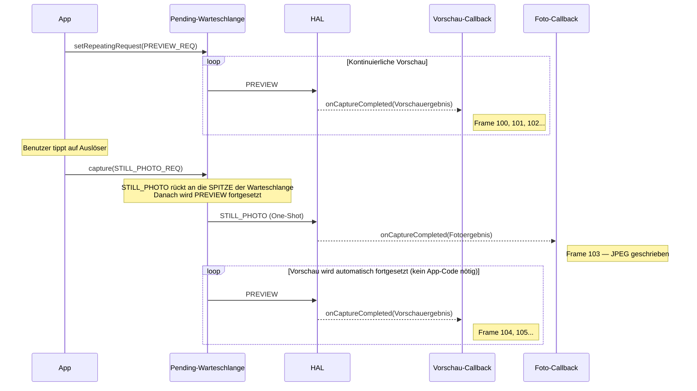
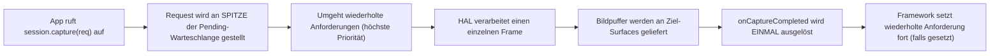
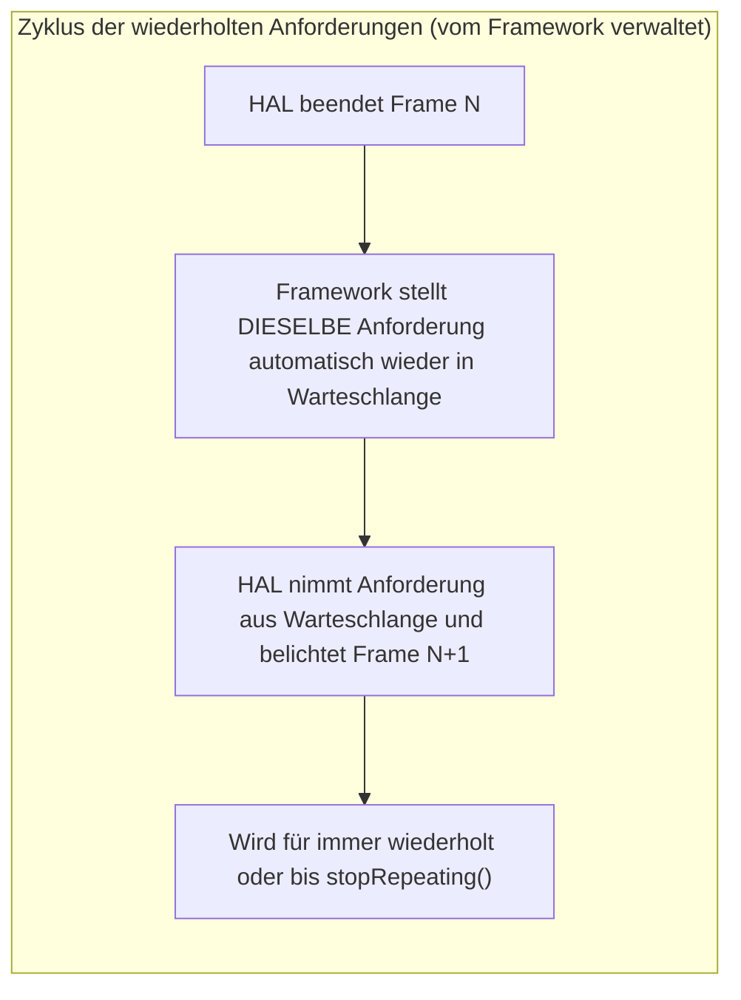
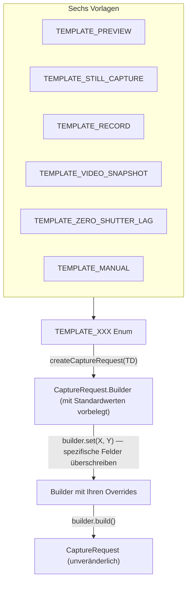

## 11.1 Drei Möglichkeiten, die Pipeline zu füttern

In [Kapitel 10](the-camera2-pipeline.md) haben Sie gesehen, wie Anforderungen die Camera2-Pipeline durchlaufen: von der Pending-Warteschlange zur In-Flight-Warteschlange zum HAL und schließlich zu Ihren Callbacks und Ausgabe-Surfaces. Aber *wie Sie diese Anforderungen übermitteln*, spielt eine enorme Rolle. Camera2 bietet Ihnen drei Übermittlungsmechanismen, jeder mit einem grundlegend unterschiedlichen Verhalten:

1. **One-Shot** (`capture()`) – führt eine einzelne Anforderung genau einmal aus.
2. **Burst** (`captureBurst()`) – führt eine Liste von Anforderungen zusammenhängend und nacheinander aus.
3. **Repeating** (`setRepeatingRequest()`) – führt dieselbe Anforderung kontinuierlich für immer aus (oder bis sie unterbrochen wird).

Zusätzlich zu diesen drei Übermittlungsmodi bietet das Framework sechs **Aufnahme-Vorlagen (Capture Templates)**, die einen `CaptureRequest.Builder` mit sinnvollen Standardwerten für gängige Anwendungsfälle (Vorschau, Standbildaufnahme, Videoaufzeichnung, Zero-Shutter-Lag, manuelle Steuerung usw.) vorbelegen.

Am Ende dieses Kapitels werden Sie genau wissen, wann Sie welchen Aufnahme-Typ und welche Vorlage verwenden sollten – einschließlich der Gründe, warum die Vorschau immer wiederholte Anforderungen verwendet, warum Burst die einzige Möglichkeit für Belichtungsreihen ist und warum Standbilder One-Shot verwenden, selbst wenn eine Vorschau läuft.

Die App Android Camera Parameters ([GitHub](https://github.com/zoozooll/AndroidCameraParameters), [Play Store](https://play.google.com/store/apps/details?id=com.minininja.cameraparams)) demonstriert alle drei Aufnahme-Typen in ihrer Registerkarte **Capture Demo**. Wechseln Sie zwischen den Modi "Vorschau (Repeating)", "Einzelbild (One-Shot)" und "Burst (3 Frames)", um das Callback-Verhalten und die Zeitunterschiede live auf Ihrem Gerät zu sehen.

## 11.2 One-Shot: capture()

Der einfachste Übermittlungsmodus ist die **One-Shot-Aufnahme** über `CameraCaptureSession.capture()`. Er tut genau das, was der Name sagt: Er übermittelt einen einzelnen `CaptureRequest` an die Pipeline, führt ihn exakt einmal aus und ist dann fertig.

```kotlin
// One-Shot: Ein einzelnes Standbild an den JPEG-ImageReader erfassen
fun captureStillPhoto() {
    val builder = cameraDevice.createCaptureRequest(CameraDevice.TEMPLATE_STILL_CAPTURE)
    builder.addTarget(jpegReader.surface)
    builder.set(CaptureRequest.JPEG_QUALITY, 100)
    builder.set(CaptureRequest.CONTROL_AF_MODE, CaptureRequest.CONTROL_AF_MODE_CONTINUOUS_PICTURE)
    builder.set(CaptureRequest.CONTROL_AE_MODE, CaptureRequest.CONTROL_AE_MODE_ON)

    val request = builder.build()

    captureSession.capture(request, object : CameraCaptureSession.CaptureCallback() {
        override fun onCaptureCompleted(
            session: CameraCaptureSession,
            request: CaptureRequest,
            result: TotalCaptureResult
        ) {
            super.onCaptureCompleted(session, request, result)
            Log.d("Capture", "One-Shot-Foto fertig. Frame #${result.frameNumber}")
        }
    }, backgroundHandler)
}
```

### Wann man One-Shot verwendet

| Anwendungsfall | Warum One-Shot? |
|----------|--------------|
| Einzelne Standbildaufnahme | Wird genau einmal pro Drücken des Auslösers ausgeführt |
| Einmaliger AF/AE-Trigger | Löst `CONTROL_AF_TRIGGER_START` für ein einzelnes Tap-to-Focus-Ereignis aus |
| Schnappschuss während eines Videos | Erfasst einen hochauflösenden Frame, während eine wiederholte Videoanforderung aktiv ist |
| Erfassung eines einzelnen RAW-Frames | Gleichzeitige Aufnahme von RAW + JPEG für ein einzelnes Foto |

### Wie One-Shot mit der wiederholten Vorschau interagiert

Ein entscheidendes Designmuster in Camera2 ist: **Die Vorschau läuft als wiederholte Anforderung, und Standbilder werden als One-Shot-Anforderungen eingeschleust.** Die One-Shot-Anforderung rückt in der Pending-Warteschlange vor die wiederholte Anforderung (wie wir im Warteschlangenmodell von Kapitel 10 besprochen haben), sodass sie sofort ausgeführt wird. Nach Abschluss der One-Shot-Anforderung nimmt das Framework automatisch die wiederholte Vorschauanforderung wieder auf – Sie müssen sie nicht erneut senden.



:::tip
Dieses automatische Fortsetzungsverhalten ist fest in das Camera2-Framework eingebaut. Sie müssen die Vorschau nach einer One-Shot-Aufnahme niemals manuell "neu starten" – das Framework stellt die wiederholte Anforderung für Sie wieder in die Warteschlange.
:::

### Ablauf einer One-Shot-Ausführung



## 11.3 Burst: captureBurst()

Während `capture()` eine einzelne Anforderung sendet, übermittelt `captureBurst()` eine **`List<CaptureRequest>`** und garantiert, dass alle N Frames in der Liste **zusammenhängend und nacheinander ausgeführt werden, ohne dass Frames von anderen Quellen (einschließlich der wiederholten Anforderung) dazwischengeschoben werden**.

Diese atomare, lückenlose Garantie macht Burst-Aufnahmen unverzichtbar für:

- **Belichtungsreihen (Exposure Bracketing)** – Erfassen von 3-5 Frames mit ±1 EV, ±2 EV, um sie anschließend zu einem HDR-Bild zu verschmelzen.
- **Fokus-Reihen (Focus Bracketing)** – Durchlaufen von Fokusdistanzen, um sie für Schärfentiefe-Effekte zu stapeln (Focus Stacking).
- **Action- / Bewegungsaufnahmen** – Aufnahme von 10-30 Frames eines sich schnell bewegenden Motivs, um dann das schärfste auszuwählen.
- **Zeitlupenvideos (High-Speed)** – `createHighSpeedRequestList()` + Burst mit eingeschränkter Hochgeschwindigkeitsaufnahme.
- **Abtastung der 3A-Konvergenz** – Auslösen des AF/AE-Triggers und anschließender Burst, bis die Konvergenz erreicht ist.

```kotlin
// Burst: Belichtungsreihe mit 3 Bildern (-2 EV, 0 EV, +2 EV)
fun captureExposureBracket() {
    val baseIso = 100
    val baseExposure = 10_000_000L  // 10 ms = "0 EV" Basislinie

    val burstList: MutableList<CaptureRequest> = mutableListOf()

    // Frame 0: -2 EV (4x kürzere Belichtung = dunkler)
    burstList += cameraDevice.createCaptureRequest(CameraDevice.TEMPLATE_STILL_CAPTURE).apply {
        addTarget(jpegReader.surface)
        set(CaptureRequest.SENSOR_SENSITIVITY, baseIso)
        set(CaptureRequest.SENSOR_EXPOSURE_TIME, baseExposure / 4)
        set(CaptureRequest.CONTROL_AE_MODE, CaptureRequest.CONTROL_AE_MODE_OFF)
    }.build()

    // Frame 1: 0 EV (korrekte Belichtung)
    burstList += cameraDevice.createCaptureRequest(CameraDevice.TEMPLATE_STILL_CAPTURE).apply {
        addTarget(jpegReader.surface)
        set(CaptureRequest.SENSOR_SENSITIVITY, baseIso)
        set(CaptureRequest.SENSOR_EXPOSURE_TIME, baseExposure)
        set(CaptureRequest.CONTROL_AE_MODE, CaptureRequest.CONTROL_AE_MODE_OFF)
    }.build()

    // Frame 2: +2 EV (4x längere Belichtung = heller)
    burstList += cameraDevice.createCaptureRequest(CameraDevice.TEMPLATE_STILL_CAPTURE).apply {
        addTarget(jpegReader.surface)
        set(CaptureRequest.SENSOR_SENSITIVITY, baseIso)
        set(CaptureRequest.SENSOR_EXPOSURE_TIME, baseExposure * 4)
        set(CaptureRequest.CONTROL_AE_MODE, CaptureRequest.CONTROL_AE_MODE_OFF)
    }.build()

    captureSession.captureBurst(burstList, object : CameraCaptureSession.CaptureCallback() {
        private var completedCount = 0

        override fun onCaptureCompleted(
            session: CameraCaptureSession,
            request: CaptureRequest,
            result: TotalCaptureResult
        ) {
            super.onCaptureCompleted(session, request, result)
            completedCount++
            Log.d("Burst", "Burst-Frame $completedCount/${burstList.size} fertig. Frame #${result.frameNumber}")

            if (completedCount == burstList.size) {
                Log.d("Burst", "Alle ${burstList.size} Bilder der Belichtungsreihe aufgenommen!")
                // TODO: HDR verschmelzen, Fokus-Stack erstellen oder Benutzer das beste Bild wählen lassen
            }
        }
    }, backgroundHandler)
}
```

### Die zusammenhängende Garantie in Aktion

Die wichtigste Eigenschaft von Burst ist, dass **die gesamte Liste atomar in die Warteschlange gestellt wird**. Selbst wenn ein `setRepeatingRequest()` aktiv ist, werden alle N Burst-Frames nacheinander ausgeführt, bevor die wiederholte Anforderung fortgesetzt wird. Die wiederholte Anforderung wird nicht zwischen den Burst-Frames eingeschoben.

```mermaid
flowchart TB
    subgraph QueueBefore ["Vor dem Senden des Bursts"]
        direction LR
        R1["PREVIEW (Repeating)"] --> R2["PREVIEW (Repeating)"] --> R3["PREVIEW (Repeating)"]
    end

    subgraph Arrow ["App ruft captureBurst([B1,B2,B3]) auf"]
        style Arrow fill:#fff3e0
    end

    subgraph QueueAfter ["Nach dem Senden des Bursts (atomares Enqueue)"]
        direction LR
        B1["BURST FRAME 1"] --> B2["BURST FRAME 2"] --> B3["BURST FRAME 3"] --> R4["PREVIEW (Repeating) wird fortgesetzt"] --> R5["PREVIEW"]
    end

    QueueBefore --> Arrow --> QueueAfter

    Note over B1,B3: Keine Vorschau-Frames schleichen sich dazwischen!
```

### Grenzen der Burst-Größe

Die maximale Burst-Größe, die Sie in einem einzigen `captureBurst()`-Aufruf übermitteln können, wird bestimmt durch:
- `CameraCharacteristics.REQUEST_MAX_NUM_OUTPUT_RAW` – für RAW-Ausgaben.
- `CameraCharacteristics.REQUEST_MAX_NUM_OUTPUT_PROC` – für verarbeitete Ausgaben (YUV/JPEG).
- Die tatsächliche Hardware-Bandbreite (4K-Bursts sind kürzer als 1080p-Bursts).

Für typische FULL-Geräte sind verarbeitete JPEG-Bursts von 10-50 Frames in Ordnung. RAW-Bursts können je nach Sensor und Speicher auf 5-10 Frames begrenzt sein.

### High-Speed-Burst für Zeitlupe

Für Zeitlupenvideos bietet Camera2 `CameraDevice.createHighSpeedRequestList()`, welches einen normalen `CaptureRequest` in eine Liste von Burst-Anforderungen umwandelt, die für Videoaufnahmen mit eingeschränkter Hochgeschwindigkeit (z. B. 120 fps oder 240 fps) geeignet sind. Dies wird mit `CameraCaptureSession.captureBurst()` kombiniert und erfordert die Fähigkeit `CONSTRAINED_HIGH_SPEED_VIDEO`:

```kotlin
// Burst: High-Speed-Zeitlupe (120 fps)
fun captureHighSpeedSlowMo() {
    val capabilities = characteristics.get(CameraCharacteristics.REQUEST_AVAILABLE_CAPABILITIES)
    val supportsHighSpeed = capabilities?.contains(
        CameraCharacteristics.REQUEST_AVAILABLE_CAPABILITIES_CONSTRAINED_HIGH_SPEED_VIDEO
    ) ?: false

    if (!supportsHighSpeed) {
        Log.w("HighSpeed", "Gerät unterstützt keine eingeschränkte Hochgeschwindigkeits-Videoaufnahme")
        return
    }

    // Eine einzelne Basis-Anforderung erstellen (die auf die MediaRecorder-Surface abzielt)
    val baseBuilder = cameraDevice.createCaptureRequest(CameraDevice.TEMPLATE_RECORD)
    baseBuilder.addTarget(mediaRecorderSurface)
    val baseRequest = baseBuilder.build()

    // In eine High-Speed-Burst-Liste umwandeln — das Framework optimiert für 120 fps
    val highSpeedBurst = cameraDevice.createHighSpeedRequestList(listOf(baseRequest))

    // Die optimierte Burst-Liste über captureBurst übermitteln
    captureSession.captureBurst(highSpeedBurst, highSpeedCallback, backgroundHandler)
}
```

## 11.4 Repeating: setRepeatingRequest()

Das Arbeitspferd von Camera2 ist die **wiederholte Anforderung (Repeating Request)**, die über `CameraCaptureSession.setRepeatingRequest()` übermittelt wird. Anstatt sie nur einmal auszuführen, stellt das Framework *dieselbe Anforderung* nach jedem Frame für immer wieder in die Warteschlange – und erzeugt so einen kontinuierlichen Stream von Frames mit der nativen Bildrate der Hardware.

```kotlin
// Repeating: Kameravorschau starten (kontinuierlicher Stream mit 30 fps)
fun startPreview() {
    val builder = cameraDevice.createCaptureRequest(CameraDevice.TEMPLATE_PREVIEW)
    builder.addTarget(previewSurface)
    builder.set(CaptureRequest.CONTROL_AF_MODE, CaptureRequest.CONTROL_AF_MODE_CONTINUOUS_PICTURE)
    builder.set(CaptureRequest.CONTROL_AE_MODE, CaptureRequest.CONTROL_AE_MODE_ON)
    builder.set(CaptureRequest.CONTROL_AWB_MODE, CaptureRequest.CONTROL_AWB_MODE_AUTO)

    val repeatingRequest = builder.build()

    captureSession.setRepeatingRequest(
        repeatingRequest,
        object : CameraCaptureSession.CaptureCallback() {
            private var frameCount = 0
            private var lastFpsLogMs = 0L

            override fun onCaptureCompleted(
                session: CameraCaptureSession,
                request: CaptureRequest,
                result: TotalCaptureResult
            ) {
                super.onCaptureCompleted(session, request, result)
                frameCount++
                val now = System.currentTimeMillis()
                if (now - lastFpsLogMs > 1000) {
                    Log.d("Preview", "Vorschau-FPS: $frameCount")
                    frameCount = 0
                    lastFpsLogMs = now
                }
            }
        },
        backgroundHandler
    )
}
```

### Warum die Vorschau wiederholte Anforderungen verwenden *muss*

Wenn Sie versuchen würden, eine Vorschau mit 30 fps zu implementieren, indem Sie `capture()` 30-mal pro Sekunde über einen Timer aufrufen, würden Sie:
1. CPU-Leistung verschwenden, indem Sie alle 33 ms identische Anforderungen erneut senden.
2. Zeitliche Abweichungen (Drift) ansammeln, wenn Ihr Timer zu spät kommt.
3. Frame-Lücken erhalten, wenn One-Shot-Callbacks blockieren.
4. Gegen die Warteschlangenverwaltung des Frameworks ankämpfen.

Die wiederholte Anforderung wird vollständig innerhalb des Frameworks/HAL gehandhabt. Nachdem jeder Frame abgeschlossen ist, plant der HAL automatisch die nächste Belichtung – ohne Beteiligung des App-Threads. Dies erzeugt eine flüssige, lückenlose Vorschau ohne CPU-Overhead in der App.



### Stoppen wiederholter Anforderungen

Um den wiederholten Stream zu stoppen, rufen Sie `stopRepeating()` auf. Dies entfernt die wiederholte Anforderung aus der Warteschlange, leert jedoch nicht die bereits in Bearbeitung befindlichen Frames. Rufen Sie `abortCaptures()` auf, um alles gewaltsam zu leeren (und `onCaptureFailed` mit `REASON_FLUSHED` für Frames in Bearbeitung auszulösen).

```kotlin
// Vorschau vorübergehend pausieren
fun pausePreview() {
    captureSession.stopRepeating()
    Log.d("Preview", "Repeating gestoppt. Frames in Bearbeitung werden noch beendet.")
}

// Notstopp — alles sofort abbrechen
fun emergencyStopAllCaptures() {
    captureSession.stopRepeating()
    captureSession.abortCaptures()
    // Alle Frames in Bearbeitung schlagen mit REASON_FLUSHED fehl
}
```

### Wiederholte Anforderungen werden auch für Videoaufzeichnungen verwendet

Zusätzlich zur Vorschau werden wiederholte Anforderungen für die **Videoaufzeichnung** (die auf eine `MediaRecorder`- oder `MediaCodec`-`Surface` abzielen) und die **kontinuierliche Bildanalyse** (die auf einen niedrig auflösenden YUV-`ImageReader` für Gesichtserkennung, ML-Inferenz usw. abzielen) verwendet.

Das Muster ist immer das gleiche: Einmal einstellen, streamen lassen und die Anforderungsparameter aktualisieren, wenn Sie Einstellungen ändern möchten (z. B. den digitalen Zoom während des Streams ändern, indem Sie den Crop-Bereich in einer neuen wiederholten Anforderung aktualisieren).

```kotlin
// Repeating: Digitalen Zoom live während der Vorschau/Videoaufzeichnung aktualisieren
fun updateDigitalZoom(cropRegion: Rect) {
    val builder = cameraDevice.createCaptureRequest(CameraDevice.TEMPLATE_PREVIEW)
    builder.addTarget(previewSurface)
    builder.addTarget(mediaRecorderSurface)
    builder.set(CaptureRequest.SCALER_CROP_REGION, cropRegion)
    builder.set(CaptureRequest.CONTROL_AF_MODE, CaptureRequest.CONTROL_AF_MODE_CONTINUOUS_PICTURE)

    // Die alte wiederholte Anforderung durch eine neue ersetzen (gleiche Ziele, neuer Ausschnitt)
    captureSession.setRepeatingRequest(builder.build(), currentCallback, backgroundHandler)
    Log.d("Zoom", "Wiederholte Anforderung mit Crop ${cropRegion.width()}x${cropRegion.height()} aktualisiert")
}
```

## 11.5 Aufnahme-Vorlagen (Capture Templates)

Jeder `CaptureRequest.Builder` beginnt mit einer **Vorlage**: Sie rufen `cameraDevice.createCaptureRequest(TEMPLATE_XXX)` auf, und das Framework befüllt den Builder mit hardwareoptimierten Standardwerten für diesen Anwendungsfall. Sie überschreiben dann nur noch die spezifischen Einstellungen, die Sie benötigen.

Vorlagen existieren, weil die Kamera-Pipeline eines Telefons dutzende Regler hat (Stärke der Rauschunterdrückung, Kantenanhebung, Tonwertkurve, Anti-Banding-Modus, Bildratenbereich, ...). Vorlagen setzen sinnvolle Baselines, sodass Sie nicht jedes einzelne Detail von Grund auf konfigurieren müssen.



### Die sechs Vorlagen, was sie vorkonfigurieren und wann man sie verwendet

| Vorlage | Anwendungsfall | Wichtige vorkonfigurierte Einstellungen |
|----------|----------|---------------------------|
| `TEMPLATE_PREVIEW` | Live-Sucher / Vorschau | Fokus auf niedrige Latenz, 3A (AF/AE/AWB) im kontinuierlichen Automatikmodus, moderate Rauschunterdrückung/Schärfung, hohe Bildrate (30 fps). Tauscht geringfügige Qualität gegen Flüssigkeit ein. |
| `TEMPLATE_STILL_CAPTURE` | Einzelbildfoto | Fokus auf maximale Qualität, AF im Fotomodus, volle Rauschunterdrückung/Schärfung, hochwertige JPEG-Kodierung, kann die Bildrate senken, um die Qualität für diesen einen Frame zu verbessern. |
| `TEMPLATE_RECORD` | Videoaufzeichnung | Stabile Bildrate (passend zur MediaRecorder-Ausgabe), kontinuierlicher AF, Zeitstempel für Audio-Video-Synchronisation, Anti-Banding aktiviert, mittlere Rauschunterdrückung – optimiert für Bewegung + Kompression. |
| `TEMPLATE_VIDEO_SNAPSHOT` | Hochauflösendes Standbild *während* einer Videoaufzeichnung | Ähnlich wie STILL_CAPTURE, behält aber die Einstellungen für Video-Frames bei – macht ein hochauflösendes Foto, ohne den Video-Stream zu stoppen. |
| `TEMPLATE_ZERO_SHUTTER_LAG` | ZSL-Standbildaufnahme (Kapitel 14) | Erstellt einen Ringpuffer der letzten Frames. Wenn der Auslöser gedrückt wird, wird ein Frame aus der *Vergangenheit* zurückgegeben, um einen Blackout zu vermeiden. Erfordert Burst-Fähigkeit und Private Reprocessing. |
| `TEMPLATE_MANUAL` | Manuelle / Pro-Steuerungen | Alle 3A-Modi standardmäßig auf OFF gesetzt, damit Sie Belichtungszeit, ISO, Fokus und Farbkorrekturverstärkung ohne Störungen manuell einstellen können. Basis für eine Pro-Kamera-Benutzeroberfläche. |

```kotlin
// Vorlagenbeispiele — sehen Sie, was passiert, wenn Sie mit jeder Vorlage beginnen

// TEMPLATE_PREVIEW — flüssig, niedrige Latenz
val previewBuilder = cameraDevice.createCaptureRequest(CameraDevice.TEMPLATE_PREVIEW)
val previewRequest = previewBuilder.build()
Log.d("Template", "PREVIEW AF_MODE = ${previewRequest.get(CaptureRequest.CONTROL_AF_MODE)}")
// ^ Typischerweise CONTROL_AF_MODE_CONTINUOUS_PICTURE (fokussiert ständig neu)

// TEMPLATE_STILL_CAPTURE — höchste Qualität pro Frame
val stillBuilder = cameraDevice.createCaptureRequest(CameraDevice.TEMPLATE_STILL_CAPTURE)
val stillRequest = stillBuilder.build()
Log.d("Template", "STILL_CAPTURE JPEG_QUALITY = ${stillRequest.get(CaptureRequest.JPEG_QUALITY)}")
// ^ Typischerweise 100 (Kodierung mit maximaler Qualität)

// TEMPLATE_MANUAL — alle automatischen Steuerungen deaktiviert
val manualBuilder = cameraDevice.createCaptureRequest(CameraDevice.TEMPLATE_MANUAL)
val manualRequest = manualBuilder.build()
Log.d("Template", "MANUAL AE_MODE = ${manualRequest.get(CaptureRequest.CONTROL_AE_MODE)}")
Log.d("Template", "MANUAL AF_MODE = ${manualRequest.get(CaptureRequest.CONTROL_AF_MODE)}")
Log.d("Template", "MANUAL AWB_MODE = ${manualRequest.get(CaptureRequest.CONTROL_AWB_MODE)}")
// ^ Typischerweise AE_MODE_OFF, AF_MODE_OFF, AWB_MODE_OFF — von Beginn an manuell
```

:::tip
Beginnen Sie immer mit einer Vorlage und überschreiben Sie spezifische Felder. Mit `TEMPLATE_PREVIEW` zu beginnen und dann 2-3 Einstellungen zu überschreiben (z. B. den Crop-Bereich für den Zoom oder den AE-Ziel-Bias für die Belichtungskorrektur), ist massiv weniger fehleranfällig als das Erstellen einer Anforderung aus einer leeren Vorlage (was ohnehin nicht möglich ist – jedes `createCaptureRequest` erfordert eine Vorlage).
:::

## 11.6 Vergleich der drei Aufnahme-Typen

| Dimension | One-Shot `capture()` | Burst `captureBurst()` | Repeating `setRepeatingRequest()` |
|-----------|---------------------|----------------------|---------------------------------|
| **Ausführung** | Einzelne Anforderung läuft einmal | Liste von N Anforderungen läuft zusammenhängend | Dieselbe Anforderung läuft in jedem Frame (automatisch neu eingereiht) |
| **Priorität** | Höchste — rückt an die SPITZE der Pending-Warteschlange | Hoch — alle N Frames werden atomar an der SPITZE eingefügt | Niedrigste — One-Shot/Burst rücken vor und Repeating wird danach fortgesetzt |
| **Unterbrechung** | Unterbricht Repeating; Repeating wird danach fortgesetzt | Unterbricht Repeating; der gesamte Burst wird abgeschlossen, bevor Repeating fortgesetzt wird | Wird durch jede One-Shot- oder Burst-Anforderung unterbrochen; wird danach automatisch fortgesetzt |
| **Warteschlangen-Verhalten** | Einzelne Anforderung eingereiht | N Anforderungen zusammenhängend eingereiht (keine Lücken) | Eine konzeptionelle Anforderung wird in jedem Zyklus neu eingereiht |
| **Typische Verwendungen** | Einzelnes Foto, einzelner AF-Trigger, Blitzfoto | Belichtungsreihen, Fokus-Reihen, Action-Serien, Zeitlupe, HDR | Vorschau, Videoaufzeichnung, kontinuierliche ML-Analyse, Live-Gesichtserkennung |
| **Ergebnis-Callback** | `onCaptureCompleted` wird genau einmal ausgelöst | `onCaptureCompleted` wird N-mal ausgelöst (einmal pro Burst-Frame) | `onCaptureCompleted` wird kontinuierlich für jeden Frame ausgelöst (30-60 Mal/Sek.) |

```mermaid
quadrantChart
    title Nutzungsbilder der Aufnahme-Typen
    x-axis ["Niedrige Frame-Anzahl", "Hohe Frame-Anzahl"]
    y-axis ["Einzelne Konfiguration", "Variable Konfiguration pro Frame"]
    quadrant-1 ["Burst: Belichtungs- / Fokus-Reihen"]
    quadrant-2 ["Burst: High-Speed-Zeitlupe"]
    quadrant-3 ["One-Shot: Standbildaufnahme"]
    quadrant-4 ["Repeating: Vorschau + Video"]
    "Einzelne JPEG-Aufnahme": [0.15, 0.2]
    "Tap-to-Focus Trigger": [0.1, 0.15]
    "HDR-Reihe mit 3 Bildern": [0.4, 0.75]
    "Fokus-Stack mit 7 Bildern": [0.45, 0.8]
    "120 fps Zeitlupe 2 Sek.": [0.85, 0.25]
    "CameraFinder Vorschau 30 fps": [0.9, 0.1]
    "4K-Videoaufzeichnung": [0.88, 0.18]
```

## 11.7 Aufnahme-Typen in der App Android Camera Parameters sehen

Öffnen Sie die App Android Camera Parameters ([GitHub](https://github.com/zoozooll/AndroidCameraParameters), [Play Store](https://play.google.com/store/apps/details?id=com.minininja.cameraparams)) und navigieren Sie zur Registerkarte **Capture Demo**. Die App stellt alle drei Aufnahme-Typen nebeneinander dar:

- Tippen Sie auf **Start Preview**, um `setRepeatingRequest(TEMPLATE_PREVIEW)` aufzurufen und ein Live-Log des `CaptureCallback` zu sehen (Frames 1, 2, 3, ... scrollen etwa alle 33 ms).
- Tippen Sie auf **Take Photo**, um ein `capture(TEMPLATE_STILL_CAPTURE)` One-Shot einzuschleusen, während die Vorschau läuft. Sie werden sehen, wie der Callback-Zähler kurz für den qualitativ hochwertigen Frame pausiert und dann nahtlos fortgesetzt wird, wenn die wiederholte Anforderung automatisch fortgesetzt wird.
- Tippen Sie auf **Burst 5 Frames**, um `captureBurst(List<CaptureRequest(5)>)` aufzurufen. Beobachten Sie, dass genau 5 Frames direkt hintereinander abgeschlossen werden, bevor das Scrollen der Vorschau fortgesetzt wird – dies beweist die zusammenhängende Garantie.

Sie können auch `REQUEST_MAX_NUM_OUTPUT_RAW` und `REQUEST_MAX_NUM_OUTPUT_PROC` in der Registerkarte **Raw JSON** inspizieren, um die Grenzen der Burst-Größe Ihres Geräts zu sehen.

## 11.8 Zusammenfassung

| Konzept | Kernaussage |
|---------|-------------|
| **One-Shot `capture()`** | Einzelne Anforderung, läuft einmal, höchste Priorität. Für Standbilder, AF-Trigger. Setzt Repeating danach automatisch fort. |
| **Burst `captureBurst()`** | Eine Liste von Anforderungen läuft zusammenhängend, keine Unterbrechung. Für Belichtungsreihen, Action, Zeitlupe. Die gesamte Liste springt atomar in die Warteschlange. |
| **Repeating `setRepeatingRequest()`** | Eine Anforderung wird kontinuierlich gestreamt. Das Framework stellt sie automatisch wieder in die Warteschlange. Für Vorschau, Video, Analyse. Niedrigste Priorität. |
| **Vorlagen** | Sechs Basislinien befüllen den Builder mit Standardwerten. Beginnen Sie mit TEMPLATE_PREVIEW/STILL_CAPTURE/RECORD/ZSL/MANUAL und überschreiben Sie nur das Nötigste. |
| **Unterbrechungsregeln** | One-Shot und Burst haben *immer* Vorrang vor Repeating. Repeating wird danach automatisch fortgesetzt. Burst-Frames werden niemals auseinandergerissen. |

## Wie geht es weiter?

In [Kapitel 12: Tiefer Einblick in die CameraCharacteristics](cameracharacteristics-deep-dive.md) werden wir uns mit dem statischen Metadaten-Objekt befassen, das beschreibt, *was Ihre Kamera überhaupt leisten kann*, bevor Sie sie öffnen. Wir werden die Hardware-Level (LEGACY → LIMITED → FULL → LEVEL_3 → EXTERNAL), das System der Capability-Flags (MANUAL_SENSOR, RAW, DEPTH_OUTPUT usw.) aufschlüsseln und lernen, wie man all dies zur Laufzeit abfragt, um Apps zu schreiben, die auf über 10.000 verschiedenen Android-Gerätemodellen funktionieren.
