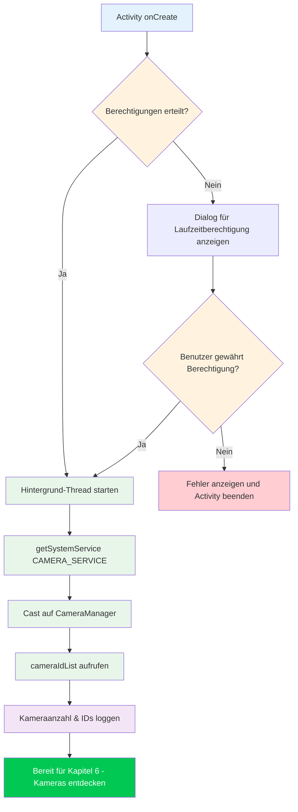

Willkommen zum praktischen Teil der Camera2-Tutorial-Serie. In den vorangegangenen Kapiteln haben Sie etwas über Smartphone-Kamerahardware und die theoretischen Grundlagen der Camera2-API gelernt. Jetzt ist es an der Zeit, die Ärmel hochzukrempeln und echten Code zu schreiben. Am Ende dieses Kapitels werden Sie ein funktionierendes Android-Projekt haben, das die Camera2-API erfolgreich initialisiert und auf den CameraManager-Dienst zugreift – der entscheidende erste Schritt, bevor Sie Kameras aufzählen, Geräte öffnen oder Vorschauen anzeigen können.

Wenn Sie ein Produktionsbeispiel für alles sehen möchten, was wir in dieser Serie bauen werden, schauen Sie sich die App **Android Camera Parameters** auf [GitHub](https://github.com/zoozooll/AndroidCameraParameters) und im [Google Play Store](https://play.google.com/store/apps/details?id=com.minininja.cameraparams) an. Sie demonstriert die fortgeschrittene Nutzung von Camera2, einschließlich der vollständigen Aufzählung der CameraCharacteristics, manueller Aufnahmesteuerung und Multi-Kamera-Unterstützung.

## Warum mit dem Projekt-Setup beginnen?

Bevor Sie eine einzige Zeile Camera2-Code schreiben können, muss Ihre Anwendung ordnungsgemäß konfiguriert sein. Camera2 ist eine hardwarenahe, leistungssensible API, und wenn Sie beim Setup Abstriche machen, führt dies zu mysteriösen Abstürzen, ANRs (Application Not Responding) oder Bildern, die nie ankommen. Die drei Säulen eines korrekten Camera2-Projekt-Setups sind:

1. **Berechtigungen** – Das Android-Framework schränkt den Kamerazugriff sowohl zum Zeitpunkt der Installation (Manifest) als auch zur Laufzeit (Einwilligung des Benutzers) ein.
2. **Threading-Architektur** – Camera2-Callbacks dürfen niemals den Haupt-Thread blockieren; wir benötigen einen dedizierten Hintergrund-Thread.
3. **View-Konfiguration** – Wenn Sie planen, TextureView für die Vorschau zu verwenden (der empfohlene Ansatz), muss die Hardwarebeschleunigung aktiviert sein.

Gehen wir jedes dieser Themen systematisch an.

## Schritt 1: Erstellen eines neuen Android Studio-Projekts

Starten Sie Android Studio und erstellen Sie ein neues Projekt. Für diese Tutorial-Serie empfehlen wir:

- **Vorlage**: Empty Activity (der einfachste Ausgangspunkt)
- **Sprache**: Kotlin (der moderne Standard für die Android-Entwicklung; alle Beispiele in dieser Serie sind in Kotlin)
- **Mindest-SDK**: API 21 (Lollipop) – dies ist die erste SDK-Stufe, die Camera2 nativ unterstützt. Wenn Sie externe USB-Kameras über OTG unterstützen müssen, zielen Sie auf API 23 oder höher ab. Wenn Sie Unterstützung für Scoped Storage zum Speichern von Fotos benötigen (Kapitel 9), ist API 29+ relevant, aber wir werden dort die Abwärtskompatibilität behandeln.
- **Konfigurationssprache für den Build**: Kotlin DSL oder Groovy – beides funktioniert; unsere Beispiele sind unabhängig vom Build-System.

Sobald das Projekt erstellt wurde, öffnen Sie die `build.gradle` (oder `build.gradle.kts`) Datei auf Modulebene. Die Standardvorlage für die Empty Activity enthält die meisten Abhängigkeiten, die Sie benötigen, aber überprüfen Sie, ob Sie mindestens folgendes haben:

```kotlin
dependencies {
    implementation("androidx.core:core-ktx:1.12.0")
    implementation("androidx.appcompat:appcompat:1.6.1")
    implementation("com.google.android.material:material:1.11.0")
    implementation("androidx.constraintlayout:constraintlayout:2.1.4")
    // Camera2 ist Teil des Android-Frameworks, daher ist KEINE zusätzliche Abhängigkeit
    // für die Basis-API erforderlich. androidx.camera.camera2 ist nur für die CameraX-Interoperabilität gedacht.
}
```

:::tip
Sie müssen **keine** externe Camera2-Abhängigkeit hinzufügen. Das gesamte Paket `android.hardware.camera2` ist Teil des Android-Frameworks. Die Jetpack CameraX-Bibliothek ist eine separate, höherrangige Abstraktion, die auf Camera2 aufbaut; wir verwenden in diesem Tutorial direkt die **native Camera2-API**.
:::

## Schritt 2: Deklarieren von Berechtigungen in der AndroidManifest.xml

Jede Kameraanwendung muss die Berechtigung `CAMERA` in der `AndroidManifest.xml` deklarieren. Dies teilt dem Google Play Store mit, dass Ihre App die Kamerahardware verwendet, und es ermöglicht den Dialog für die Laufzeitberechtigung ab Android 6.0 (API 23).

Öffnen Sie `app/src/main/AndroidManifest.xml` und fügen Sie die folgenden Elemente **als Kinder des Root-Tags `<manifest>`** hinzu (nicht innerhalb von `<application>`):

```xml
<?xml version="1.0" encoding="utf-8"?>
<manifest xmlns:android="http://schemas.android.com/apk/res/android"
    xmlns:tools="http://schemas.android.com/tools">

    <!-- ✅ Deklaration der Kameraberechtigung -->
    <uses-permission android:name="android.permission.CAMERA" />

    <!-- Optionale Feature-Deklarationen (verwendet für die Filterung im Google Play Store) -->
    <uses-feature
        android:name="android.hardware.camera"
        android:required="true" />
    <uses-feature
        android:name="android.hardware.camera.autofocus"
        android:required="false" />

    <application
        android:allowBackup="true"
        ...>
        <activity
            android:name=".MainActivity"
            android:exported="true"
            android:hardwareAccelerated="true">
            ...
        </activity>
    </application>
</manifest>
```

Lassen Sie uns die wichtigen Teile aufschlüsseln:

### `<uses-permission android:name="android.permission.CAMERA" />`

Dies ist die Kernberechtigung. Ohne sie wirft jeder Aufruf des Kameradienstes eine `SecurityException`. Bei API 22 und niedriger gewähren Benutzer diese zum Zeitpunkt der Installation; bei API 23+ müssen Sie sie auch zur Laufzeit anfordern (wird als Nächstes behandelt).

### `<uses-feature android:name="android.hardware.camera" android:required="true" />`

Diese Deklaration weist Google Play an, Ihre App nur auf Geräten anzuzeigen, die mindestens eine Kamera haben. Setzen Sie `android:required="false"`, wenn Ihre App auch ohne Kamera funktionieren kann (zum Beispiel eine Galerie-App mit optionaler Aufnahme). Wenn Sie dies gar nicht deklarieren, geht Google Play davon aus, dass eine Kamera **nicht** erforderlich ist, was dazu führen kann, dass Ihre App auf Geräten ohne Kamera installiert wird.

### `android:hardwareAccelerated="true"` in der `<activity>`

Dies ist **entscheidend** für das Rendering der TextureView-Vorschau. TextureView verwendet die GPU-Composition-Pipeline, um Kamerabilder effizient anzuzeigen. Wenn die Hardwarebeschleunigung auf Activity- oder Application-Ebene nicht aktiviert ist, wird TextureView das Rendern stillschweigend verweigern oder einen schwarzen Bildschirm anzeigen. Der Standard in modernem Android ist `true` für die gesamte Anwendung, aber es ist gute Praxis, dies explizit für jede Activity zu deklarieren, die eine TextureView beherbergt.

## Schritt 3: Anforderung der Laufzeitberechtigung

Ab Android 6.0 (Marshmallow, API 23) reicht die Deklaration der Berechtigung im Manifest allein nicht aus. Sie müssen den Benutzer zur Laufzeit auch **explizit um Erlaubnis bitten**, indem Sie die Activity Compat-Bibliothek verwenden. Das Standardmuster ist:

1. Prüfen, ob die Berechtigung bereits erteilt wurde, mit `ContextCompat.checkSelfPermission`.
2. Wenn erteilt, mit der Kamerainitialisierung fortfahren.
3. Wenn nicht erteilt, `ActivityCompat.requestPermissions` aufrufen, um den Systemdialog anzuzeigen.
4. Das Ergebnis in `onRequestPermissionsResult` verarbeiten.

Hier ist der vollständige Berechtigungsablauf in `MainActivity.kt`:

```kotlin
package com.example.camera2tutorial

import android.Manifest
import android.content.pm.PackageManager
import android.os.Bundle
import android.widget.Toast
import androidx.appcompat.app.AppCompatActivity
import androidx.core.app.ActivityCompat
import androidx.core.content.ContextCompat

class MainActivity : AppCompatActivity() {

    override fun onCreate(savedInstanceState: Bundle?) {
        super.onCreate(savedInstanceState)
        setContentView(R.layout.activity_main)

        if (allPermissionsGranted()) {
            initializeCamera()
        } else {
            ActivityCompat.requestPermissions(
                this,
                REQUIRED_PERMISSIONS,
                REQUEST_CODE_PERMISSIONS
            )
        }
    }

    private fun allPermissionsGranted() = REQUIRED_PERMISSIONS.all {
        ContextCompat.checkSelfPermission(baseContext, it) == PackageManager.PERMISSION_GRANTED
    }

    override fun onRequestPermissionsResult(
        requestCode: Int,
        permissions: Array<out String>,
        grantResults: IntArray
    ) {
        super.onRequestPermissionsResult(requestCode, permissions, grantResults)
        if (requestCode == REQUEST_CODE_PERMISSIONS) {
            if (allPermissionsGranted()) {
                initializeCamera()
            } else {
                Toast.makeText(
                    this,
                    "Die Kameraberechtigung ist erforderlich, um diese App zu nutzen.",
                    Toast.LENGTH_LONG
                ).show()
                finish()
            }
        }
    }

    private fun initializeCamera() {
        // TODO: Wir werden diese Methode in den folgenden Abschnitten implementieren.
        // Hier wird die Einrichtung des CameraManager stattfinden.
        // Für den Moment loggen wir nur den Erfolg.
        android.util.Log.d(TAG, "Berechtigungen erteilt. Bereit zur Initialisierung der Kamera.")
    }

    companion object {
        private const val TAG = "Camera2Tutorial"
        private const val REQUEST_CODE_PERMISSIONS = 10
        private val REQUIRED_PERMISSIONS = arrayOf(Manifest.permission.CAMERA)
    }
}
```

### Warum `allPermissionsGranted()` ein Array-Muster verwendet

Auch wenn wir momentan nur `CAMERA` benötigen, macht es die Definition eines `REQUIRED_PERMISSIONS`-Arrays trivial, später zusätzliche Berechtigungen hinzuzufügen (wie `WRITE_EXTERNAL_STORAGE` für das Speichern von Fotos auf älteren Systemen oder `RECORD_AUDIO` für Videos). Die Funktion `all { ... }` prüft, ob **jede** Berechtigung im Array erteilt wurde, bevor fortgefahren wird.

## Schritt 4: Der Hintergrund-Thread (HandlerThread)

Dies ist das am häufigsten übersehene Detail in Camera2-Code für Anfänger, und es verursacht **zufällige, schwer reproduzierbare Fehler**. Lassen Sie uns verstehen, warum Camera2 einen Hintergrund-Thread benötigt, und ihn dann korrekt implementieren.

### Warum Camera2 NICHT auf dem Haupt-Thread laufen darf

Der Android Haupt-Thread (UI-Thread) ist verantwortlich für:
- Das Zeichnen der UI mit 60-120 FPS
- Die Verarbeitung von Touch-Ereignissen des Benutzers
- Das Auslösen von Lebenszyklus-Callbacks
- Das Ausführen des gesamten Activity/Fragment-Codes standardmäßig

Die Camera2-API liefert mehrere kritische Callbacks synchron:
- `CameraDevice.StateCallback` – wenn eine Kamera geöffnet wird, die Verbindung getrennt wird oder ein Fehler auftritt
- `CameraCaptureSession.StateCallback` – wenn eine Aufnahmesitzung konfiguriert wird
- `CameraCaptureSession.CaptureCallback` – für jedes einzelne Bild (bis zu 60+ Mal pro Sekunde!)

Wenn diese Callbacks auf dem Haupt-Thread laufen, passieren zwei katastrophale Dinge:

1. **Ruckeln und ausgelassene Frames**: Wenn die Verarbeitung eines Callbacks auch nur 10 ms dauert, wird ein 60-FPS-Frame übersprungen, und der Benutzer sieht ein Ruckeln.
2. **Deadlocks und ANRs**: Einige Camera2-Methoden (wie `close()`) sind synchron und warten auf Callbacks. Wenn der Callback auf demselben Thread laufen muss, der `close()` aufgerufen hat, kommt es zu einem Deadlock.

Die Lösung ist ein **dedizierter Hintergrund-Thread** mit seinem eigenen Looper, implementiert über `HandlerThread`.

### Korrekte Implementierung von HandlerThread

Der Lebenszyklus des Hintergrund-Threads muss mit dem Lebenszyklus der Kameraoperationen übereinstimmen. Wir starten den Thread, wenn die Activity gestartet/fortgesetzt wird, und beenden den Thread, wenn die Activity gestoppt/pausiert wird.

```kotlin
package com.example.camera2tutorial

import android.Manifest
import android.content.Context
import android.content.pm.PackageManager
import android.hardware.camera2.CameraManager
import android.os.Bundle
import android.os.Handler
import android.os.HandlerThread
import android.util.Log
import android.widget.Toast
import androidx.appcompat.app.AppCompatActivity
import androidx.core.app.ActivityCompat
import androidx.core.content.ContextCompat

class MainActivity : AppCompatActivity() {

    // --- Hintergrund-Threading-Komponenten ---
    private lateinit var backgroundThread: HandlerThread
    private lateinit var backgroundHandler: Handler

    override fun onCreate(savedInstanceState: Bundle?) {
        super.onCreate(savedInstanceState)
        setContentView(R.layout.activity_main)

        if (allPermissionsGranted()) {
            initializeCamera()
        } else {
            ActivityCompat.requestPermissions(
                this,
                REQUIRED_PERMISSIONS,
                REQUEST_CODE_PERMISSIONS
            )
        }
    }

    override fun onResume() {
        super.onResume()
        startBackgroundThread()
        // Re-initialisieren, falls Berechtigungen erteilt wurden, während die App im Hintergrund war
        if (allPermissionsGranted() && this::cameraManager.isInitialized) {
            // (cameraManager ist unten deklariert)
        }
    }

    override fun onPause() {
        stopBackgroundThread()
        super.onPause()
    }

    private fun startBackgroundThread() {
        backgroundThread = HandlerThread("Camera2Background").apply {
            start()
        }
        backgroundHandler = Handler(backgroundThread.looper)
        Log.d(TAG, "Hintergrund-Thread gestartet: ${backgroundThread.name}")
    }

    private fun stopBackgroundThread() {
        backgroundThread.quitSafely()
        try {
            backgroundThread.join(1000) // Maximal 1 Sekunde auf die Bereinigung warten
            Log.d(TAG, "Hintergrund-Thread sauber gestoppt")
        } catch (e: InterruptedException) {
            Log.e(TAG, "Unterbrochen beim Warten auf den Hintergrund-Thread", e)
        }
    }

    // --- Initialisierung des CameraManager ---
    private lateinit var cameraManager: CameraManager

    private fun initializeCamera() {
        cameraManager = getSystemService(Context.CAMERA_SERVICE) as CameraManager

        val cameraIdList = cameraManager.cameraIdList
        Log.d(TAG, "CameraManager erfolgreich aufgerufen. ${cameraIdList.size} Kamera(s) gefunden.")
        cameraIdList.forEachIndexed { index, cameraId ->
            Log.d(TAG, "Kamera $index: ID = $cameraId")
        }

        Toast.makeText(
            this,
            "CameraManager initialisiert! ${cameraIdList.size} Kamera(s) gefunden.",
            Toast.LENGTH_LONG
        ).show()
    }

    // --- Berechtigungsverarbeitung (wie zuvor) ---
    private fun allPermissionsGranted() = REQUIRED_PERMISSIONS.all {
        ContextCompat.checkSelfPermission(baseContext, it) == PackageManager.PERMISSION_GRANTED
    }

    override fun onRequestPermissionsResult(
        requestCode: Int,
        permissions: Array<out String>,
        grantResults: IntArray
    ) {
        super.onRequestPermissionsResult(requestCode, permissions, grantResults)
        if (requestCode == REQUEST_CODE_PERMISSIONS) {
            if (allPermissionsGranted()) {
                initializeCamera()
            } else {
                Toast.makeText(
                    this,
                    "Die Kameraberechtigung ist erforderlich, um diese App zu nutzen.",
                    Toast.LENGTH_LONG
                ).show()
                finish()
            }
        }
    }

    companion object {
        private const val TAG = "Camera2Tutorial"
        private const val REQUEST_CODE_PERMISSIONS = 10
        private val REQUIRED_PERMISSIONS = arrayOf(Manifest.permission.CAMERA)
    }
}
```

### Wichtige Threading-Muster erklärt

1. **`startBackgroundThread()` in `onResume()`**: Jedes Mal, wenn die Activity in den Vordergrund tritt, erstellen wir einen neuen `HandlerThread`, starten ihn und erstellen einen `Handler`, der an den `Looper` des Threads gebunden ist. Dieser Handler wird an alle Camera2-Methoden übergeben, die Callbacks akzeptieren (`openCamera`, `createCaptureSession` usw.).

2. **`stopBackgroundThread()` in `onPause()`**: Bevor die Activity in den Hintergrund geht, rufen wir `quitSafely()` auf dem Thread auf. Dies weist den Looper an, nach dem Ende der aktuellen Nachricht keine neuen Nachrichten mehr zu verarbeiten (im Gegensatz zu `quit()`, das ausstehende Nachrichten verwirft). Dann rufen wir `join(1000)` auf, um den Haupt-Thread für höchstens eine Sekunde zu blockieren, während der Hintergrund-Thread seine Bereinigung beendet. Dies verhindert Ressourcenlecks.

3. **Warum `HandlerThread` statt `CoroutineDispatcher`?** Camera2 ist einige Jahre älter als Kotlin Coroutines, und sein Callback-System basiert grundlegend auf Handler/Looper. Man kann zwar `Dispatchers.Default.asExecutor()` verwenden oder Callbacks in `suspendCoroutine` für höherrangigen Code verpacken, aber die zugrunde liegende Camera2-API benötigt für Callbacks immer noch einen Looper-Thread. Die direkte Verwendung von `HandlerThread` ist der kanonische, dokumentierte Ansatz in den offiziellen Android-Beispielen.

## Schritt 5: Der vollständige Initialisierungsablauf (kombiniert)

Schauen wir uns nun die vollständige Sequenz der Ereignisse an, die beim Start Ihrer Anwendung eintreten müssen. Die Reihenfolge ist entscheidend: Berechtigungen → Thread → CameraManager. Wenn Sie einen Schritt umkehren, wird der Code abstürzen oder sich inkonsistent verhalten.



Das Flussdiagramm oben veranschaulicht, warum jeder Schritt existiert:

- **Berechtigungs-Gate**: Das gesamte Kamera-Subsystem ist geschützt; wir können nicht fortfahren, bis der Benutzer seine Zustimmung gegeben hat.
- **Thread vor CameraManager**: Obwohl `getSystemService()` selbst Thread-sicher ist, möchten wir, dass der Hintergrund-Thread bereits läuft, bevor wir Callback-gesteuerte Camera2-Operationen durchführen (die im nächsten Kapitel beginnen).
- **CameraManager → cameraIdList**: Der Aufruf von `cameraIdList` ist der einfachste Weg, um zu überprüfen, ob der CameraManager funktioniert. Wenn dieser Aufruf ohne Fehler erfolgreich ist, sind Ihre Manifest-Deklaration, die Laufzeitberechtigung und die Service-Bindung alle korrekt.

## Alles zusammenfügen: Ausführen und Überprüfen

An diesem Punkt haben Sie ein vollständiges, ausführbares Camera2-Projekt, das:
1. Ein Android-Projekt mit den richtigen SDK-Zielen erstellt.
2. Die Berechtigung CAMERA im Manifest deklariert.
3. Die Berechtigung zur Laufzeit anfordert und sowohl den Annahme- als auch den Ablehnungspfad verarbeitet.
4. Einen dedizierten HandlerThread in `onResume` startet und ihn in `onPause` sauber stoppt.
5. Den Systemdienst `CAMERA_SERVICE` abruft und ihn auf `CameraManager` castet.
6. `cameraIdList` aufruft und die Anzahl der Kameras sowie deren IDs loggt.

### Was Sie beim Ausführen sehen sollten

1. Beim ersten Start zeigt Android den Berechtigungsdialog: *"Darf Camera2Tutorial Bilder und Videos aufnehmen?"*
2. Tippen Sie auf **Zulassen**.
3. Ein Toast erscheint: *"CameraManager initialisiert! X Kamera(s) gefunden."*
4. In Logcat (gefiltert nach `Camera2Tutorial`) sollten Sie Einträge sehen wie:
   ```
   D/Camera2Tutorial: Hintergrund-Thread gestartet: Camera2Background
   D/Camera2Tutorial: CameraManager erfolgreich aufgerufen. 4 Kamera(s) gefunden.
   D/Camera2Tutorial: Kamera 0: ID = 0
   D/Camera2Tutorial: Kamera 1: ID = 1
   D/Camera2Tutorial: Kamera 2: ID = 2
   D/Camera2Tutorial: Kamera 3: ID = 3
   ```
5. Wenn Sie die Home-Taste drücken oder die App verlassen, zeigt Logcat:
   ```
   D/Camera2Tutorial: Hintergrund-Thread sauber gestoppt
   ```

Wenn Sie diese Logs sehen, **herzlichen Glückwunsch**! Sie haben erfolgreich das Fundament einer Camera2-Anwendung gelegt. Es gibt noch keine Kameravorschau – diese folgt in Kapitel 8 – aber die Infrastruktur ist korrekt. Wenn Sie eine `SecurityException` erhalten, überprüfen Sie, ob Sie den Berechtigungsdialog akzeptiert haben. Wenn `cameraIdList` ein leeres Array zurückgibt, hat das Gerät möglicherweise keine Kameras (unwahrscheinlich bei einem Telefon) oder die Berechtigung wurde verweigert.

## Fehlerbehebung bei häufigen Setup-Fehlern

### `SecurityException: Lacking privileges to access camera service`

Dies bedeutet, dass die Laufzeitberechtigung nicht erteilt wurde. Überprüfen Sie, ob:
- Sie `<uses-permission android:name="android.permission.CAMERA" />` zum Manifest hinzugefügt haben.
- Sie `ActivityCompat.requestPermissions` mit dem richtigen Anforderungscode aufgerufen haben.
- Der Benutzer im Dialog auf **Zulassen** getippt hat.
- Wenn Sie auf einem physischen Gerät testen, gehen Sie zu Einstellungen → Apps → Ihre App → Berechtigungen und stellen Sie sicher, dass die Kamera aktiviert ist.

### `NullPointerException` bei `backgroundHandler`

Dies passiert, wenn Sie versuchen, den `backgroundHandler` zu verwenden, bevor `startBackgroundThread()` ausgeführt wurde. Stellen Sie sicher, dass alle Camera2-Operationen, die einen Handler akzeptieren, erst ausgeführt werden, **nachdem** `onResume` aufgerufen wurde und der Thread läuft. In unserem Code wird `initializeCamera()` von `onCreate` aus aufgerufen, verwendet den CameraManager aber nur synchron; Callbacks, die den `backgroundHandler` benötigen, werden in späteren Kapiteln hinzugefügt und ordnungsgemäß über `onResume` gesteuert.

### `TextureView` zeigt in späteren Kapiteln einen schwarzen Bildschirm

Wenn Sie jetzt schon vorgreifen und eine TextureView hinzufügen, stellen Sie sicher, dass `android:hardwareAccelerated="true"` für Ihre Activity im Manifest gesetzt ist. Stellen Sie außerdem sicher, dass die TextureView an die View-Hierarchie angehängt und in Ihrer Layout-XML sichtbar ist.

## Zusammenfassung

In diesem Kapitel haben Sie das komplette Gerüst einer Android Camera2-Anwendung erstellt. Sie haben gelernt:

1. **Projektstruktur**: Wie man ein neues Android Studio-Projekt mit der Vorlage Empty Activity erstellt, auf API 21+ abzielt, Kotlin verwendet und überprüft, dass keine externen Camera2-Abhängigkeiten erforderlich sind.
2. **Manifest-Konfiguration**: Die Deklaration der Berechtigung `CAMERA`, `uses-feature`-Tags für die Google Play-Filterung und `hardwareAccelerated="true"` in der Activity für das TextureView-Rendering.
3. **Laufzeitberechtigungen**: Der vollständige Zyklus von Prüfung → Anforderung → Ergebnis unter Verwendung von `ContextCompat.checkSelfPermission` und `ActivityCompat.requestPermissions`, mit Handhabung sowohl für die Annahme als auch für die Ablehnung.
4. **Hintergrund-Threading**: Warum Camera2-Callbacks nicht auf dem Haupt-Thread laufen dürfen und wie man ein ordnungsgemäß lebenszyklusgesteuertes Paar aus `HandlerThread` + `Handler` mit `startBackgroundThread()` in `onResume` und `stopBackgroundThread()` mit `quitSafely()` + `join()` in `onPause` implementiert.
5. **Initialisierung des CameraManager**: Abrufen des Systemdienstes `CAMERA_SERVICE`, Casten auf `CameraManager`, Aufrufen von `cameraIdList` zur Überprüfung der Funktion des Dienstes und Loggen der entdeckten Kamera-IDs.

Der Code in diesem Kapitel ist das Fundament für alles, was folgt. Die App Android Camera Parameters ([GitHub](https://github.com/zoozooll/AndroidCameraParameters), [Google Play](https://play.google.com/store/apps/details?id=com.minininja.cameraparams)) verwendet genau diese Muster – mehrere `HandlerThread`s für verschiedene Workloads, sorgfältige Berechtigungsprüfungen und robustes Lebenszyklusmanagement.

## Wie geht es weiter?

Nachdem der `CameraManager` erfolgreich initialisiert wurde und wir eine Liste der Kamera-IDs haben, besteht der nächste Schritt darin, die **Fähigkeiten jeder Kamera abzufragen**. In **Kapitel 6: Kameras entdecken** werden Sie:

- Lernen, was die Kamera-ID-Strings repräsentieren (und warum Sie niemals fest codierte Annahmen darüber treffen sollten).
- Zwischen Kameras auf der Vorderseite, Rückseite und externen Kameras (USB OTG) anhand von `LENS_FACING` unterscheiden.
- Das Hardware-Level jeder Kamera abfragen (`INFO_SUPPORTED_HARDWARE_LEVEL`), um festzustellen, ob es sich um LEGACY, LIMITED, FULL oder LEVEL_3 handelt.
- Über jede Kamera auf dem Gerät iterieren und ihre Eigenschaften mit `CameraCharacteristics` loggen.

Am Ende von Kapitel 6 werden Sie ein funktionierendes Dienstprogramm zur Kameraaufzählung haben, das echte Camera2-Metadaten vom Gerät extrahiert – etwas, das Sie bereits jetzt verwenden können, um die Kamerahardware verschiedener Telefone zu vergleichen!
