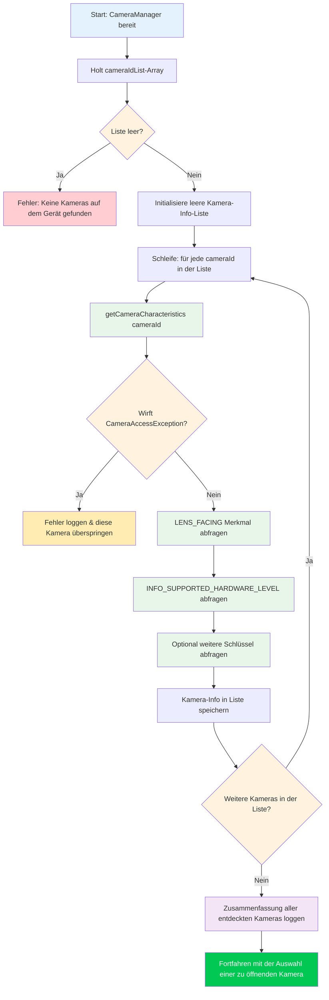

In Kapitel 5 haben Sie den `CameraManager` erfolgreich initialisiert und die Liste der Kamera-IDs abgerufen – aber ein String wie `"0"` oder `"2"` sagt Ihnen nichts darüber aus, was diese Kamera eigentlich **ist**. Ist es die Ultraweitwinkel-Rückkamera? Die Selfie-Kamera? Eine externe USB-Webcam, die über OTG angeschlossen ist? Dieses Kapitel lehrt Sie, wie Sie diese Fragen mithilfe von `CameraCharacteristics` beantworten können, dem Metadaten-Container, der jede Fähigkeit eines Kamerageräts beschreibt.

Für eine produktionsreife Referenzimplementierung der Kameraaufzählung und der Inspektion von Merkmalen schauen Sie sich die App **Android Camera Parameters** an ([GitHub](https://github.com/zoozooll/AndroidCameraParameters), [Google Play](https://play.google.com/store/apps/details?id=com.minininja.cameraparams)). Sie durchläuft jeden Schlüssel in `CameraCharacteristics` für jede Kamera auf dem Gerät und präsentiert die Ergebnisse in einer durchsuchbaren, filterbaren Benutzeroberfläche – genau das Werkzeug, das Sie benötigen, wenn Sie hardwarespezifische Camera2-Probleme debuggen.

## Kamera-IDs verstehen

Bevor wir in die Merkmale eintauchen, müssen wir eine grundlegende Quelle der Verwirrung für neue Camera2-Entwickler klären: **Was bedeuten die numerischen Kamera-ID-Strings eigentlich?**

Wenn Sie `cameraManager.cameraIdList` aufrufen, erhalten Sie ein `Array<String>` zurück – zum Beispiel: `["0", "1", "2", "3", "4"]`. Es ist **verlockend**, fest codierte Annahmen zu treffen wie:
- `"0"` = Rückseitige Weitwinkelkamera
- `"1"` = Frontkamera
- `"2"` = Teleobjektiv

**Tun Sie dies niemals.** Die Zuordnung von ID → physischer Kamera ist:
1. **Gerätespezifisch**: Ein Pixel 8 kann die ID `"1"` für die Frontkamera verwenden, während ein Samsung Galaxy S24 die ID `"3"` verwendet.
2. **Versionsspezifisch**: Ein OEM-OTA-Update kann die ID-Liste ändern, nachdem ein Gerät ausgeliefert wurde.
3. **Rebuild-spezifisch**: Einige logische Multi-Kamera-Geräte (behandelt in einem späteren Kapitel in Teil III) blenden zugrunde liegende physische Kameras je nach Modus dynamisch ein oder aus.

Der **einzige** korrekte Ansatz besteht darin, die **Merkmale jeder ID abzufragen** und eine Kamera basierend auf den Eigenschaften auszuwählen, die für Sie wichtig sind (Objektivausrichtung, Hardware-Level, Brennweitenbereich usw.). Dies ist das, was gut geschriebene Camera2-Apps tun, und es ist das Muster, das wir hier implementieren werden.

## Ablauf der Kameraaufzählung

Der allgemeine Algorithmus zum Entdecken von Kameras ist an der Oberfläche einfach, hat aber wichtige Sonderfälle bei der Fehlerbehandlung. Schauen wir uns den Prozess erst als Flussdiagramm an und implementieren ihn dann in Code.



Wichtige Beobachtungen aus dem Flussdiagramm:
1. **Behandeln Sie immer leere ID-Listen**: Selten bei Telefonen, aber häufig bei Android TV, Headless-Geräten oder Emulatoren ohne virtuelle Kamera.
2. **Umschließen Sie `getCameraCharacteristics` immer mit try/catch**: Eine Kamera könnte mitten in der Aufzählung getrennt werden (besonders eine externe USB-Kamera), oder eine restriktive Geräte-Richtlinie könnte bestimmte Kameras einschränken.
3. **Vollständig iterieren, dann wählen**: Sammeln Sie erst alle Kandidaten und wählen Sie dann den besten basierend auf Ihren Kriterien aus. Öffnen Sie nicht die erstbeste "gute" Kamera, die Sie finden – Sie könnten eine bessere übersehen.

## Einführung in CameraCharacteristics

`CameraCharacteristics` ist ein unveränderlicher Nur-Lese-Key-Value-Map, der die hardwareseitigen Fähigkeiten eines Kamerageräts beschreibt. Er enthält mehrere hundert Schlüssel, die alles abdecken, von der Brennweite des Objektivs über die Pixel-Array-Größe des Sensors bis hin zu unterstützten Ausgabeformaten.

Sie rufen ein Characteristics-Objekt wie folgt ab:
```kotlin
val characteristics: CameraCharacteristics =
    cameraManager.getCameraCharacteristics(cameraId)
```

Und Sie fragen einzelne Schlüssel mit der generischen `get`-Methode ab:
```kotlin
val lensFacing: Int? = characteristics.get(CameraCharacteristics.LENS_FACING)
```

Der Rückgabetyp ist nullfähig (`Int?` in diesem Fall), da einige Schlüssel optional sind und möglicherweise nicht auf allen Geräten vorhanden sind. In der Praxis sind die Schlüssel, die wir in diesem Kapitel abfragen (`LENS_FACING` und `INFO_SUPPORTED_HARDWARE_LEVEL`), garantiert für jede gültige Kamera vorhanden, aber es ist dennoch gute Praxis, Null-Werte defensiv zu behandeln.

:::note
Dieses Kapitel deckt absichtlich nur `LENS_FACING` und `INFO_SUPPORTED_HARDWARE_LEVEL` ab. Die tieferen Interna von `CameraCharacteristics` (Sensormerkmale, Ausgabekonfigurationen, verfügbare Fähigkeiten) sind Thema von Teil III, Kapitel 10: Die Enzyklopädie der CameraCharacteristics. Wir konzentrieren uns auf die minimalen Informationen, die Sie benötigen, um eine Kamera zum Öffnen auszuwählen.
:::

## Schlüssel 1: LENS_FACING — Vorderseite, Rückseite oder Extern

Das Erste, was fast jede Kamera-App wissen muss, ist, in welche Richtung das Objektiv zeigt. Camera2 definiert drei Konstanten:

| Konstante | Wert | Bedeutung | Typischer Anwendungsfall |
|---|---|---|---|
| `LENS_FACING_BACK` | `0` | Kamera befindet sich auf der Rückseite des Geräts, vom Benutzer abgewandt | Fotoaufnahme, Landschaftsvideo, AR |
| `LENS_FACING_FRONT` | `1` | Kamera befindet sich auf der Vorderseite des Geräts, dem Benutzer zugewandt | Selfies, Videoanrufe |
| `LENS_FACING_EXTERNAL` | `2` | Kamera ist extern am Gerät (z. B. USB-OTG-Webcam) | Externes Zubehör, Spezialkameras |

So konvertieren Sie den rohen Integer in einen menschenlesbaren String:

```kotlin
fun lensFacingToString(facing: Int?): String = when (facing) {
    CameraCharacteristics.LENS_FACING_BACK -> "Rückseite (LENS_FACING_BACK)"
    CameraCharacteristics.LENS_FACING_FRONT -> "Vorderseite (LENS_FACING_FRONT)"
    CameraCharacteristics.LENS_FACING_EXTERNAL -> "Extern / USB OTG (LENS_FACING_EXTERNAL)"
    null -> "Unbekannt (null)"
    else -> "Unbekannt (Wert=$facing)"
}
```

### Sonderfall: Externe Kameras (USB OTG)

`LENS_FACING_EXTERNAL` wurde in API 23 (Marshmallow) hinzugefügt. Bevor Sie eine externe Kamera öffnen, beachten Sie:

1. **Deklaration des USB-Host-Features**: Wenn Ihre App speziell auf externe Kameras abzielt, fügen Sie `<uses-feature android:name="android.hardware.usb.host" />` zu Ihrem Manifest hinzu. Setzen Sie `required="false"`, wenn die App auch mit integrierten Kameras funktioniert.
2. **Berechtigung für externe Geräte**: Auf vielen Geräten reicht die Berechtigung `CAMERA` allein aus, um auf eine USB-Kamera zuzugreifen. Einige USB-Webcam-Chipsätze erfordern jedoch eine zusätzliche Bestätigung der USB-Host-Berechtigung über `UsbManager.requestPermission()`. Verarbeiten Sie den Broadcast `UsbManager.ACTION_USB_DEVICE_ATTACHED`, wenn Sie automatisch erkennen möchten, wann eine Kamera angeschlossen wird.
3. **Hardware-Level**: Externe Kameras melden fast immer `INFO_SUPPORTED_HARDWARE_LEVEL_EXTERNAL` (siehe unten), was bedeutet, dass ihr Funktionsumfang durch den USB Video Class (UVC)-Treiber eingeschränkt ist. Erwarten Sie keine manuelle Steuerung oder RAW-Ausgabe von einer generischen Webcam.

Auf einem Telefon mit angeschlossener USB-Webcam könnte `cameraIdList` etwas wie `["0", "1", "100"]` zurückgeben, wobei `"100"` die dynamisch zugewiesene ID der externen Kamera ist. IDs externer Kameras sind typischerweise höhere Nummern und sind **nicht** über Neustarts oder erneutes Einstecken hinweg stabil.

## Schlüssel 2: INFO_SUPPORTED_HARDWARE_LEVEL — Was kann diese Kamera?

Das Hardware-Level ist die wichtigste Fähigkeitsklassifizierung in Camera2. Es sagt Ihnen, ob die Kamerahardware und der HAL (Hardware Abstraction Layer) die vollständige Camera2-Pipeline implementieren oder einen Legacy-Kompatibilitäts-Shim um die alte Kamera-API verwenden. Es gibt fünf Werte:

| Level | Wert | Bedeutung | Reale Geräte |
|---|---|---|---|
| `LEGACY` | `2` | Legacy-HAL-Modus. Die Kamera läuft über einen Shim auf der alten Kamera-API. Sehr eingeschränkte Funktionalität, keine manuelle Steuerung, kein RAW. | Budget-Handys, Geräte vor 2015, viele Emulatoren |
| `LIMITED` | `0` | Eingeschränkte HAL3-Unterstützung. Grundlegende Aufnahme, grundlegendes 3A (Auto-Belichtung, Autofokus, Auto-Weißabgleich), aber es fehlen fortgeschrittene Funktionen. | Mittelklasse-Handys, einige Frontkameras auf Flaggschiff-Geräten |
| `FULL` | `1` | Volle HAL3-Unterstützung. Manuelle Sensorsteuerung, Einstellungen pro Frame, RAW-Ausgabe, Reprocessing. | Haupt-/Rückkameras von Flaggschiff-Handys, Hauptkameras der Pixel-Serie |
| `LEVEL_3` | `3` | Erweiterte HAL3-Unterstützung. Fügt YUV-Reprocessing, Multi-Frame-Eingabe und High-Speed-Auflösungskonfigurationen hinzu. | Neueste Flaggschiffe, Hauptkameras ab Pixel 6 |
| `EXTERNAL` | `4` | Externe Kamera (USB/OTG). Eingeschränkte Funktionen, Gerät der UVC-Klasse. | USB-Webcams, HDMI-Capture-Sticks |

Man kann sich diese Hierarchie gut als eine Leiter der Fähigkeiten vorstellen:

```
LEGACY → LIMITED → FULL → LEVEL_3
          ↑
       EXTERNAL (paralleler Zweig für USB-Cams)
```

Jede Stufe baut auf der vorherigen auf: `FULL` enthält alles aus `LIMITED`, `LEVEL_3` enthält alles aus `FULL`. Wenn Sie Code zur Funktionserkennung schreiben, prüfen Sie von der höchsten Stufe abwärts – wenn eine Kamera `LEVEL_3` ist, wissen Sie automatisch, dass sie auch `FULL`-Funktionen unterstützt.

Hier ist die Hilfsfunktion, um das Level in eine Beschreibung zu konvertieren:

```kotlin
fun hardwareLevelToString(level: Int?): String = when (level) {
    CameraMetadata.INFO_SUPPORTED_HARDWARE_LEVEL_LEGACY ->
        "LEGACY (Shim der alten Kamera-API — eingeschränkte manuelle Steuerung)"
    CameraMetadata.INFO_SUPPORTED_HARDWARE_LEVEL_LIMITED ->
        "LIMITED (Basis-HAL3 — Standard Foto/Video)"
    CameraMetadata.INFO_SUPPORTED_HARDWARE_LEVEL_FULL ->
        "FULL (volles HAL3 — manuelle Steuerung + RAW)"
    CameraMetadata.INFO_SUPPORTED_HARDWARE_LEVEL_3 ->
        "LEVEL_3 (erweitertes HAL3 — Reprocessing + Multi-Frame)"
    CameraMetadata.INFO_SUPPORTED_HARDWARE_LEVEL_EXTERNAL ->
        "EXTERNAL (USB/OTG-Kamera — UVC-Klasse)"
    null -> "Unbekannt (null)"
    else -> "Unbekannt (Wert=$level)"
}
```

:::tip
Wenn Sie Code schreiben möchten, der nur auf leistungsfähiger Hardware läuft, verwenden Sie `>= LIMITED` für einfache Aufnahmen, `>= FULL` für manuelle Steuerung und `>= LEVEL_3` für Reprocessing-Pipelines. Nehmen Sie niemals an, dass eine Kamera FULL oder besser ist – prüfen Sie dies immer. Die App Android Camera Parameters im [Google Play Store](https://play.google.com/store/apps/details?id=com.minininja.cameraparams) zeigt das Hardware-Level als prominentes Badge für jede Kamera an, sodass Sie schnell sehen können, was jedes Gerät unterstützt.
:::

## Vollständiger Kotlin-Code: Dienstprogramm zur Kameraentdeckung

Kombinieren wir nun alles zu einer funktionierenden Implementierung. Wir erweitern die `MainActivity.kt` aus Kapitel 5 um eine Methode `discoverAndLogCameras()`, die alle Kameras durchläuft, `LENS_FACING` und `INFO_SUPPORTED_HARDWARE_LEVEL` abfragt und die Ergebnisse in Logcat ausgibt.

```kotlin
package com.example.camera2tutorial

import android.Manifest
import android.content.Context
import android.content.pm.PackageManager
import android.hardware.camera2.CameraAccessException
import android.hardware.camera2.CameraCharacteristics
import android.hardware.camera2.CameraManager
import android.hardware.camera2.CameraMetadata
import android.os.Bundle
import android.os.Handler
import android.os.HandlerThread
import android.util.Log
import android.widget.Toast
import androidx.appcompat.app.AppCompatActivity
import androidx.core.app.ActivityCompat
import androidx.core.content.ContextCompat

class MainActivity : AppCompatActivity() {

    private lateinit var backgroundThread: HandlerThread
    private lateinit var backgroundHandler: Handler
    private lateinit var cameraManager: CameraManager

    override fun onCreate(savedInstanceState: Bundle?) {
        super.onCreate(savedInstanceState)
        setContentView(R.layout.activity_main)

        if (allPermissionsGranted()) {
            initializeCameraManager()
        } else {
            ActivityCompat.requestPermissions(
                this,
                REQUIRED_PERMISSIONS,
                REQUEST_CODE_PERMISSIONS
            )
        }
    }

    override fun onResume() {
        super.onResume()
        startBackgroundThread()
    }

    override fun onPause() {
        stopBackgroundThread()
        super.onPause()
    }

    private fun startBackgroundThread() {
        backgroundThread = HandlerThread("Camera2Background").apply { start() }
        backgroundHandler = Handler(backgroundThread.looper)
    }

    private fun stopBackgroundThread() {
        backgroundThread.quitSafely()
        try {
            backgroundThread.join(1000)
        } catch (e: InterruptedException) {
            Log.e(TAG, "Unterbrochen beim Beenden des Hintergrund-Threads", e)
        }
    }

    private fun initializeCameraManager() {
        cameraManager = getSystemService(Context.CAMERA_SERVICE) as CameraManager
        discoverAndLogCameras()
    }

    // -------------------------------------------------------------------------
    // 📸 ERGÄNZUNGEN KAPITEL 6: Kameraentdeckung & Abfrage der Merkmale
    // -------------------------------------------------------------------------
    data class CameraInfo(
        val id: String,
        val lensFacing: Int?,
        val hardwareLevel: Int?
    ) {
        fun description(): String = buildString {
            append("Kamera-ID: $id | ")
            append("Ausrichtung: ${lensFacingToString(lensFacing)} | ")
            append("HW-Level: ${hardwareLevelToString(hardwareLevel)}")
        }
    }

    private fun discoverAndLogCameras() {
        val cameraIdList: Array<String> = try {
            cameraManager.cameraIdList
        } catch (e: CameraAccessException) {
            Log.e(TAG, "Fehler beim Abrufen der Kamera-ID-Liste", e)
            Toast.makeText(this, "Kameradienst nicht verfügbar", Toast.LENGTH_LONG).show()
            return
        }

        if (cameraIdList.isEmpty()) {
            Log.w(TAG, "Keine Kameras auf diesem Gerät gefunden")
            Toast.makeText(this, "Keine Kameras verfügbar", Toast.LENGTH_LONG).show()
            return
        }

        val discoveredCameras = mutableListOf<CameraInfo>()
        Log.i(TAG, "═══════════════════════════════════════════")
        Log.i(TAG, "Starte Kameraentdeckung (${cameraIdList.size} Kamera(s))")
        Log.i(TAG, "═══════════════════════════════════════════")

        for ((index, cameraId) in cameraIdList.withIndex()) {
            try {
                val characteristics = cameraManager.getCameraCharacteristics(cameraId)

                val lensFacing = characteristics.get(CameraCharacteristics.LENS_FACING)
                val hardwareLevel =
                    characteristics.get(CameraCharacteristics.INFO_SUPPORTED_HARDWARE_LEVEL)

                val info = CameraInfo(cameraId, lensFacing, hardwareLevel)
                discoveredCameras.add(info)

                Log.i(TAG, "── Kamera $index ──")
                Log.i(TAG, info.description())

            } catch (e: CameraAccessException) {
                Log.e(TAG, "Fehler beim Zugriff auf Merkmale für Kamera $cameraId", e)
            } catch (e: IllegalArgumentException) {
                Log.e(TAG, "Ungültige Kamera-ID: $cameraId", e)
            }
        }

        Log.i(TAG, "═══════════════════════════════════════════")
        Log.i(TAG, "Entdeckung abgeschlossen. ${discoveredCameras.size} Kamera(s) erfolgreich aufgezählt.")

        // Nach Ausrichtung gruppieren und zusammenfassen
        val byFacing = discoveredCameras.groupBy { it.lensFacing }
        Log.i(TAG, "  Rückseite:      ${byFacing[CameraCharacteristics.LENS_FACING_BACK]?.size ?: 0}")
        Log.i(TAG, "  Vorderseite:    ${byFacing[CameraCharacteristics.LENS_FACING_FRONT]?.size ?: 0}")
        Log.i(TAG, "  Extern/USB:     ${byFacing[CameraCharacteristics.LENS_FACING_EXTERNAL]?.size ?: 0}")

        // Nach Hardware-Level gruppieren und zusammenfassen
        val byLevel = discoveredCameras.groupBy { it.hardwareLevel }
        Log.i(TAG, "  LEGACY-Kameras:  ${byLevel[CameraMetadata.INFO_SUPPORTED_HARDWARE_LEVEL_LEGACY]?.size ?: 0}")
        Log.i(TAG, "  LIMITED-Kameras: ${byLevel[CameraMetadata.INFO_SUPPORTED_HARDWARE_LEVEL_LIMITED]?.size ?: 0}")
        Log.i(TAG, "  FULL-Kameras:    ${byLevel[CameraMetadata.INFO_SUPPORTED_HARDWARE_LEVEL_FULL]?.size ?: 0}")
        Log.i(TAG, "  LEVEL_3-Kameras: ${byLevel[CameraMetadata.INFO_SUPPORTED_HARDWARE_LEVEL_3]?.size ?: 0}")
        Log.i(TAG, "  EXTERNAL-Cams:   ${byLevel[CameraMetadata.INFO_SUPPORTED_HARDWARE_LEVEL_EXTERNAL]?.size ?: 0}")
        Log.i(TAG, "═══════════════════════════════════════════")

        val summary = buildString {
            append("${discoveredCameras.size} Kamera(s) entdeckt!\n")
            append("Hinten: ${byFacing[CameraCharacteristics.LENS_FACING_BACK]?.size ?: 0} • ")
            append("Vorne: ${byFacing[CameraCharacteristics.LENS_FACING_FRONT]?.size ?: 0} • ")
            append("Extern: ${byFacing[CameraCharacteristics.LENS_FACING_EXTERNAL]?.size ?: 0}")
        }

        Toast.makeText(this, summary, Toast.LENGTH_LONG).show()

        // Für spätere Kapitel speichern (Auswahl einer Kamera zum Öffnen)
        this.discoveredCameras = discoveredCameras
    }

    private var discoveredCameras: List<CameraInfo> = emptyList()

    // Helfer: Standard-ID der Rückkamera abrufen (erste rückseitige Kamera, die wir finden)
    fun getDefaultBackCameraId(): String? =
        discoveredCameras.firstOrNull {
            it.lensFacing == CameraCharacteristics.LENS_FACING_BACK
        }?.id

    // Helfer: Standard-ID der Frontkamera abrufen
    fun getDefaultFrontCameraId(): String? =
        discoveredCameras.firstOrNull {
            it.lensFacing == CameraCharacteristics.LENS_FACING_FRONT
        }?.id

    companion object {
        private const val TAG = "Camera2Tutorial"
        private const val REQUEST_CODE_PERMISSIONS = 10
        private val REQUIRED_PERMISSIONS = arrayOf(Manifest.permission.CAMERA)

        fun lensFacingToString(facing: Int?): String = when (facing) {
            CameraCharacteristics.LENS_FACING_BACK -> "Rückseite"
            CameraCharacteristics.LENS_FACING_FRONT -> "Vorderseite"
            CameraCharacteristics.LENS_FACING_EXTERNAL -> "Extern/USB"
            null -> "Unbekannt(null)"
            else -> "Unbekannt($facing)"
        }

        fun hardwareLevelToString(level: Int?): String = when (level) {
            CameraMetadata.INFO_SUPPORTED_HARDWARE_LEVEL_LEGACY -> "LEGACY"
            CameraMetadata.INFO_SUPPORTED_HARDWARE_LEVEL_LIMITED -> "LIMITED"
            CameraMetadata.INFO_SUPPORTED_HARDWARE_LEVEL_FULL -> "FULL"
            CameraMetadata.INFO_SUPPORTED_HARDWARE_LEVEL_3 -> "LEVEL_3"
            CameraMetadata.INFO_SUPPORTED_HARDWARE_LEVEL_EXTERNAL -> "EXTERNAL"
            null -> "Unbekannt(null)"
            else -> "Unbekannt($level)"
        }
    }

    private fun allPermissionsGranted() = REQUIRED_PERMISSIONS.all {
        ContextCompat.checkSelfPermission(baseContext, it) == PackageManager.PERMISSION_GRANTED
    }

    override fun onRequestPermissionsResult(
        requestCode: Int,
        permissions: Array<out String>,
        grantResults: IntArray
    ) {
        super.onRequestPermissionsResult(requestCode, permissions, grantResults)
        if (requestCode == REQUEST_CODE_PERMISSIONS) {
            if (allPermissionsGranted()) {
                initializeCameraManager()
            } else {
                Toast.makeText(
                    this,
                    "Die Kameraberechtigung ist erforderlich, um diese App zu nutzen.",
                    Toast.LENGTH_LONG
                ).show()
                finish()
            }
        }
    }
}
