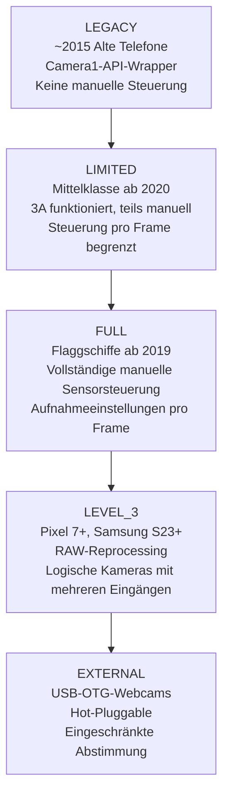
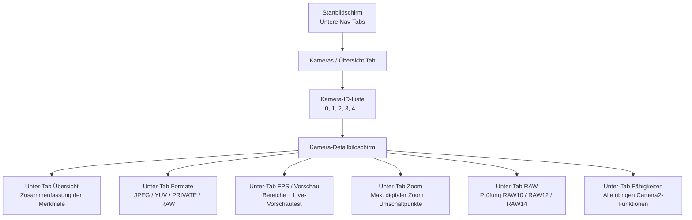

# Kapitel 4: Das eigene Telefon erkunden

Dies ist der Punkt, an dem Ihre App wichtig wird. Die Kapitel 2 und 3 gaben Ihnen ein theoretisches Verständnis der Kamerahardware und moderner Funktionen der computergestützten Fotografie. Dieses Kapitel ist praxisorientiert und gerätespezifisch. Sie werden die Begleit-App **Android Camera Parameters** auf Ihrem eigenen Telefon installieren, sie starten und systematisch untersuchen, was Ihre Hardware genau kann und was nicht – und dabei die Antworten notieren.

Die Informationen, die Sie in diesem Kapitel entdecken, sind keine akademischen Belanglosigkeiten. Die Camera2-API legt Funktionen pro Gerät und pro Kamera offen. Eine Funktion, die auf Ihrem persönlichen Pixel 10 perfekt funktioniert, kann auf einem Mittelklasse-Samsung der A-Serie von 2023 stillschweigend fehlschlagen (oder zu einem No-Op degradieren oder schlimmer noch, abstürzen), weil der HAL dieses Geräts die erforderliche Funktion einfach nicht implementiert. Bevor Sie in Teil II dieser Serie eine einzige Zeile Camera2-API-Code schreiben, müssen Sie wissen, was Ihr eigenes Testgerät leisten kann.

Am Ende dieses Kapitels werden Sie für Ihr spezifisches Telefon notiert haben: eine vollständige Liste der Kamera-IDs mit ihren Ausrichtungen und Hardware-Levels; welche Ausgabeformate jede Kamera unterstützt; die maximale JPEG-Auflösung; den höchsten Zeitlupen-FPS-Bereich; den maximalen digitalen Zoom und die Schwellenwerte für den Wechsel der physischen Kameras; und ob Ihre Hauptkamera die RAW-Ausgabe unterstützt.

## Installieren der App Android Camera Parameters

Es stehen zwei Installationsoptionen zur Verfügung. Wählen Sie diejenige aus, die Sie bevorzugen.

### Option A — Aus dem Quellcode erstellen

Wenn Sie Android-Entwickler sind und Android Studio bereits installiert haben, bietet Ihnen diese Option die Möglichkeit, den Quellcode der Begleit-App zu durchsuchen (siehe den letzten Abschnitt dieses Kapitels) und ihn sogar zu modifizieren, um zusätzliche Camera2-Merkmale zu untersuchen, die Sie interessieren.

1. Klonen Sie das GitHub-Repository:
   `https://github.com/zoozooll/AndroidCameraParameters`
2. Öffnen Sie das Projekt in Android Studio Iguana (2023.2.1) oder neuer. Der Gradle-Sync wird automatisch abgeschlossen; das Projekt zielt auf das Android SDK 34 (Android 14) mit einer `minSdkVersion` von 21 (Android 5.0 Lollipop) ab, sodass es auf praktisch jedem Telefon läuft, das Sie wahrscheinlich besitzen.
3. Aktivieren Sie USB-Debugging auf Ihrem Telefon. Gehen Sie zu **Einstellungen → Über das Telefon → Build-Nummer** und tippen Sie 7-mal auf den Eintrag Build-Nummer. Ein Toast mit dem Text "Sie sind jetzt ein Entwickler" erscheint. Kehren Sie zum Hauptmenü der Einstellungen zurück, gehen Sie zu den **Entwickleroptionen** und aktivieren Sie **USB-Debugging**.
4. Verbinden Sie Ihr Telefon über ein USB-C-Kabel mit Ihrem Computer. Akzeptieren Sie auf dem Telefon die Eingabeaufforderung "USB-Debugging von diesem Computer zulassen?" und aktivieren Sie "Von diesem Computer immer zulassen", um den Dialog in Zukunft zu vermeiden.
5. Wählen Sie die Run-Konfiguration **app** aus dem Dropdown-Menü oben in Android Studio aus (die Standard-Run-Konfiguration heißt normalerweise `app`). Stellen Sie sicher, dass Ihr verbundenes Telefon im Geräte-Dropdown erscheint.
6. Klicken Sie auf die grüne Schaltfläche **Run** (das dreieckige Play-Symbol) oder drücken Sie **Umschalt + F10**. Android Studio wird die App kompilieren, die APK über ADB auf Ihrem Telefon installieren und sie automatisch starten.

### Option B — Über Google Play installieren

Wenn Sie die App einfach nur ausführen möchten, ohne sie zu kompilieren, oder wenn Sie ihr Verhalten auf mehreren Endgeräten testen möchten, ohne jedes für ADB zu konfigurieren, verwenden Sie den Play Store Build.

Öffnen Sie den Google Play Store auf Ihrem Android-Telefon und navigieren Sie zu:

`https://play.google.com/store/apps/details?id=com.minininja.cameraparams`

Tippen Sie auf **Installieren**. Die App ist kostenlos und enthält keine Werbung, keine In-App-Käufe und keine Tracker. Sie benötigt lediglich die Berechtigung `CAMERA` (um die Kamera-Eigenschaften abzufragen und eine Vorschau-Ebene zu öffnen) und die optionale Berechtigung `RECORD_AUDIO` (wird im aktuellen Build nicht verwendet, ist aber für eine zukünftige Test-Aktivität zur Videoaufnahme reserviert). Die Berechtigung `ACCESS_FINE_LOCATION` ist optional und wird nur angefordert, wenn Sie die Beispielaufnahmen im Vorschau-Tab mit GPS-Metadaten versehen möchten.

Starten Sie die App nach Abschluss der Installation. Gewähren Sie beim ersten Start die Berechtigung für die **Kamera**, wenn der System-Dialog erscheint. Die App wird ohne diese Berechtigung nicht funktionieren, da das Sicherheitsmodell von Android eine Laufzeitberechtigung sogar für das *Abfragen* der Eigenschaften der Kamera erfordert – Sie können ohne die `CAMERA`-Berechtigung nicht einmal Kamera-IDs aufzählen.

## Kamera-IDs

Schauen Sie auf den Startbildschirm der App. Der erste (und standardmäßige) Tab unten ist mit **Kameras** beschriftet (manchmal auch **Übersicht** genannt, je nachdem, welche Build-Variante Sie ausführen). Die Kopfzeile oben in diesem Tab lautet **Alle Kamera-IDs**.

Jeder einzelnen Kamera auf einem Android-Gerät – jeder Rückkamera, der Frontkamera, jedem logischen Multi-Kamera-Fusionsgerät und jeder externen USB-OTG-Webcam – wird eine eindeutige String-Kennung zugewiesen, die **Kamera-ID** genannt wird. Kamera-IDs sind fast immer einfache Dezimalzahlen: `"0"`, `"1"`, `"2"`, `"3"` und manchmal `"4"`, `"5"` auf Geräten mit vielen Kameras. Auf seltenen Geräten (einigen externen Webcams und den simulierten Kameras des Emulators) sehen Sie möglicherweise Kamera-IDs wie `"camera@0"` oder `"0@external"`, aber einfache Ganzzahlen sind das bei weitem gängigste Format.

Jede Zeile in der Liste "Alle Kamera-IDs" zeigt von links nach rechts drei Informationen:

1. Die Kamera-ID-Nummer selbst, dargestellt als großer fetter Chip.
2. Die Ausrichtung **LENS_FACING**: entweder `BACK` (rückseitige Kamera, vom Bildschirm weg gerichtet), `FRONT` (Selfie-Kamera, zum Benutzer gerichtet) oder `EXTERNAL` (USB-Webcam / OTG-Kamera).
3. Das **Hardware-Level** dieser Kamera: ein farbiger Chip, der `LEGACY`, `LIMITED`, `FULL`, `LEVEL_3` oder `EXTERNAL` anzeigt. Dies entspricht direkt dem Camera2-API-Merkmal `INFO_SUPPORTED_HARDWARE_LEVEL`, das in Kapitel 1 dieser Serie beschrieben wurde.

Ein konkretes Beispiel: Ein Galaxy S26 Ultra meldet typischerweise **5 Kamera-IDs**:

- **ID 0**: BACK (Rückseite Weitwinkel / primäre 24-mm-Kamera), Hardware-Level = **FULL**
- **ID 1**: FRONT (Selfie-Kamera), Hardware-Level = **LIMITED**
- **ID 2**: BACK (Rückseite Ultra-Weitwinkel 0,5× Kamera), Hardware-Level = **FULL**
- **ID 3**: BACK (Rückseite 5× Periskop-Telekamera), Hardware-Level = **FULL**
- **ID 4**: BACK (logische Multi-Kamera-ID, die die fusionierte Kombination der IDs 0 + 2 + 3 darstellt, vom HAL für nahtloses Zoomen verwaltet), Hardware-Level = **FULL**

Ein Mittelklasse-Telefon (z. B. ein Samsung A54 5G) meldet möglicherweise nur 3 Kamera-IDs: Weitwinkel Rückseite, Ultra-Weitwinkel Rückseite und Front. Ein Budget-Telefon aus dem Jahr 2016 meldet möglicherweise nur 2: Rückseite und Front.

**Aufgabe für Ihr Gerät:** Notieren Sie sich die vollständige Liste der Kamera-IDs, die Ihr Telefon meldet. Notieren Sie für jede ID die Ausrichtung (LENS_FACING – Back / Front / External) und die Farbe/Beschriftung des Hardware-Level-Chips. Zählen Sie die Gesamtzahl der Kameras. Wenn Sie eine Kamera-ID sehen, deren Zweck nicht offensichtlich ist (z. B. eine zusätzliche rückseitige ID, die keiner offensichtlichen Linse auf der Rückseite des Telefons entspricht), behalten Sie diese im Hinterkopf – das sind oft ToF-Tiefensensoren, Makrokameras oder das logische Multi-Kamera-Fusionsgerät.

## Hardware-Levels

Kapitel 1 dieser Serie führte die fünf Camera2-Hardware-Levels ein, geordnet von der geringsten bis zur höchsten Leistungsfähigkeit: **LEGACY → LIMITED → FULL → LEVEL_3 → EXTERNAL**. In diesem Abschnitt wird diese Hierarchie aufgefrischt und Sie werden aufgefordert, das Level jeder Kamera mithilfe der App zu überprüfen.

Jedes Level fügt neue Funktionen und strengere Leistungsgarantien hinzu:

- **LEGACY**: Die Camera2-API ist als dünne Schicht über der veralteten `android.hardware.Camera` (Camera1) API implementiert. Fast nichts funktioniert zuverlässig – keine manuelle Belichtung, keine Steuerung pro Frame, keine RAW-Unterstützung. Sie können LEGACY-Geräte im Jahr 2026 getrost ignorieren; im Grunde meldet kein aktiv genutztes Telefon mehr dieses Level.
- **LIMITED**: Das am weitesten verbreitete Hardware-Level für Mittelklasse-Telefone und für Frontkameras bei allen Preisklassen. Die 3A-Algorithmen (Auto-Exposure, Auto-Focus, Auto-White-Balance) laufen korrekt, die grundlegende YUV- und JPEG-Ausgabe funktioniert, aber die meisten manuellen Sensorsteuerungen sind nicht verfügbar (keine manuelle Verschlusszeit unter dem AE-Minimum, keine manuelle Verstärkungssteuerung, keine Aktualisierung der Aufnahmeeinstellungen pro Frame schneller als mit einer Latenz von 3–5 Frames).
- **FULL**: Der Goldstandard für Flaggschiffe. Jede Funktion der Camera2-API funktioniert garantiert: vollständige manuelle Steuerung der Sensorbelichtungszeit und der analogen Verstärkung für jedes einzelne Bild, die Bildrate wird garantiert eingehalten, Serienbildaufnahmen mit 30+ fps mit unterschiedlichen Einstellungen pro Bild, YUV-Reprocessing, grundlegende DNG-RAW-Ausgabe. Wenn die Haupt-Rückkamera Ihres Telefons FULL meldet, können Sie jede Funktion dieser Tutorial-Serie implementieren.
- **LEVEL_3**: Die höchste Stufe, die mit den Pixel-7- und Samsung-S23-Familien in den Jahren 2022/2023 eingeführt wurde. Fügt garantierte RAW-Reprocessing-Eingabeströme hinzu (Sie können ein zuvor aufgenommenes DNG zurück in den ISP einspeisen und die Pipeline mit anderem Tone-Mapping oder anderen Farbmatrixen erneut durchlaufen lassen), YUV-Ausgabeströme mit mehreren Auflösungen und garantierte Unterstützung für die logische Multi-Kamera-Fusion.
- **EXTERNAL**: Für USB-OTG-Webcams und HDMI-Capture-Dongles, die über USB-C angeschlossen sind. Die API-Oberfläche ist identisch, aber es existieren keine Werkskalibrierungsdaten (keine auf dem OTP gespeicherten Objektivschattierungs-Maps, keine Farbkorrekturmatrizen pro Modul), sodass die Qualität externer Kameras schwankend ist.

**So inspizieren Sie dies in der App:** Tippen Sie auf den Chip für das **Hardware-Level** neben einer beliebigen Kamera-ID in der Liste. Ein Dialogfenster wird eingeblendet, das die vollständige Beschreibung von `INFO_SUPPORTED_HARDWARE_LEVEL` für diese Kamera anzeigt, zusammen mit einer Liste, welche Hauptfunktionen auf diesem Level garantiert sind (oder nicht).

**Aufgabe für Ihr Gerät:** Bestätigen Sie für Ihre primäre Rückkamera (normalerweise ID 0), welches Hardware-Level sie meldet. Bestätigen Sie das Level für Ihre Frontkamera. Stellen Sie sich dann diese Frage und denken Sie über die Antwort nach, bevor Sie weiterlesen: **Warum melden Frontkameras fast überall LIMITED statt FULL?**

Die Antwort ist, dass Frontkameras meist kostengünstigere, einfachere Sensoren sind. Der 3A-Algorithmus läuft darauf zuverlässig (schließlich benötigen Selfies eine automatische Belichtung und einen automatischen Weißabgleich, um akzeptable Ergebnisse zu liefern), aber die manuelle Sensorsteuerung hat bei Selfies eine geringere Produktpriorität. Niemand zahlt einen Aufpreis für eine manuelle Verschlusszeit von 1/1000 s bei seiner 13-MP-Selfie-Kamera. Die HAL-Anbieter optimieren daher ihre LIMITED-Implementierung für den Selfie-Anwendungsfall und führen niemals die zusätzlichen Tests und Validierungen durch, die zum Bestehen der Camera2-CTS-Tests (Compatibility Test Suite) für das FULL-Level erforderlich wären.

## Verfügbare Kameras: Ausrichtungen

Android definiert drei mögliche Werte für das Kamera-Merkmal `LENS_FACING`. Die App bietet oben im Kameras-Tab eine Filterleiste, um zwischen ihnen zu wechseln: **Alle · Rückseite · Front · Extern**.

- **BACK**: Die Kamera auf der Rückseite des Telefons, vom Bildschirm weg gerichtet. Jede rückseitige Ultra-Weitwinkel-, Weitwinkel-, Tele-, Periskop-, Makro-Kamera oder jeder ToF-Sensor meldet `LENS_FACING_BACK`. Dies ist die Kamera, die Ihre App in 90 % der Fälle verwenden wird.
- **FRONT**: Die Selfie-Kamera, die zum Benutzer zeigt, wenn der Bildschirm auf ihn gerichtet ist. Beachten Sie, dass das Vorschaubild der Frontkamera von der Standard-Kamera-App normalerweise horizontal gespiegelt (links-rechts vertauscht) wird, um dem zu entsprechen, was der Benutzer in einem Spiegel sieht. Die tatsächlichen Pixeldaten, die in JPEG-Dateien geschrieben werden, sind jedoch nicht gespiegelt, sofern Ihre App dies nicht explizit tut.
- **EXTERNAL**: Eine USB-OTG-Webcam, ein USB-Endoskop, eine USB-HDMI-Capture-Karte oder ein anderes Hot-Pluggable-Videoeingabegerät, das über USB-C angeschlossen ist. Eine der am meisten unterschätzten Funktionen der Camera2-API ist, dass EXTERNAL-Kameras über *exakt denselben Codepfad* wie interne Kameras angesprochen werden. Eine gut geschriebene Camera2-App wird eine USB-Webcam automatisch aufzählen und verwenden, ohne dass USB-spezifischer Code erforderlich ist, solange der USB-C-Anschluss des Telefons den USB-Video-Class (UVC) Gadget-Modus im Host-Modus unterstützt.

**Aufgabe für Ihr Gerät:** Verwenden Sie die Filtertoggles, um zwischen Rückseite, Front und Extern zu wechseln. Zählen Sie, wie viele Kameras in jede Kategorie fallen. Listet Ihr Telefon derzeit irgendwelche EXTERNAL-Kameras auf? Fast sicher nicht – es sei denn, Sie haben eine USB-Webcam angeschlossen. Falls Sie eine USB-Webcam oder ein USB-Endoskop besitzen, schließen Sie diese jetzt über einen USB-C-OTG-Adapter an das Telefon an und tippen Sie auf die Schaltfläche **Aktualisieren** im Menü oben rechts in der App. Sie sollten eine neue Kamera-ID mit LENS_FACING = EXTERNAL sehen. Öffnen Sie den Vorschau-Tab für diese externe Kamera – wenn alles funktioniert, sehen Sie eine Live-Vorschau der Webcam unter Verwendung desselben Camera2-API-Codepfads, der 30 Sekunden zuvor die interne Rückkamera geöffnet hat.

## Unterstützte Ausgabeformate

Jedes Camera2-Kameragerät wirft eine Liste unterstützter **Ausgabeformate** aus und für jedes Format eine Liste unterstützter Paare aus Auflösung/Größe. Die Camera2-API wird jede Aufnahmeanforderung ablehnen, die versucht, eine Format-Größen-Kombination anzusprechen, die die Kamera nicht anbietet.

Die App macht diese Informationen im Detailbildschirm der Kamera zugänglich. Um dorthin zu gelangen, tippen Sie im Kameras-Tab auf eine beliebige Zeile mit einer Kamera-ID. Sie gelangen zu einem Detailbildschirm mit mehreren wischbaren Unter-Tabs: **Übersicht · Formate · FPS · Zoom · RAW · Fähigkeiten**. Wischen Sie zum Tab **Formate** (oder tippen Sie auf die Tableiste).

Es gibt Dutzende von möglichen `ImageFormat`-Konstanten im Android-SDK, aber diese **5 Formate** machen 99 % der tatsächlichen Nutzung von Camera2-Apps aus. Die App listet sie oben im Formats-Tab mit leicht verständlichen Beschreibungen auf:

1. **JPEG**: Normale verarbeitete Fotos, die Sie per E-Mail versenden, in sozialen Medien posten oder über Messenger teilen. 8-Bit YCbCr 4:2:0 Farbe, ISP-verarbeitet (alle 8 Stufen aus Kapitel 2 angewendet), verlustbehaftet DCT-komprimiert. Kleine Dateigröße. Dies ist die Standardausgabe und die häufigste Ausgabe für Standbilder.
2. **YUV_420_888**: Das universelle unkomprimierte Format für die Verarbeitung auf dem Gerät. 8-Bit-Y-Ebene (Luminanz) plus 8-Bit-Cb- und Cr-Ebenen (Chrominanz), horizontal 2:1 unterabgetastet. Wird für Gesichtserkennung, QR-Code-Scanning, Barcode-Scanning, Machine-Learning-Inferenz (TensorFlow Lite, PyTorch Mobile), benutzerdefinierte Bildverarbeitung vor der Neukodierung in JPEG und als Eingang für den MediaCodec-Video-Encoder für Videoaufnahmen verwendet.
3. **PRIVATE**: Das opake Zero-Copy-Format, das ausschließlich für die Hochgeschwindigkeitsvorschau auf dem Display verwendet wird. Das tatsächliche Pixellayout ist herstellerspezifisch und vor der App verborgen (daher "privat"). PRIVATE-Surfaces (typischerweise eine `SurfaceView`, `TextureView` oder ein `ImageReader` mit `PRIV`-Nutzungs-Flags) überspringen alle CPU-zugänglichen Kopien und gehen direkt vom ISP-Ausgang zum Display-Compositor. Dies ist das einzige Format, das eine Vorschau mit voller Auflösung bei 60 fps oder 120 fps auf modernen Flaggschiffen garantiert.
4. **RAW_SENSOR**: Unverarbeitete Bayer-Mosaik-Daten direkt vom Sensor, bevor eine ISP-Stufe ausgeführt wird. Die Bittiefe variiert je nach Sensor: RAW10 (10 Bit pro Abtastung), RAW12 (12 Bit) oder RAW14 (14 Bit). Wird in DNG-Dateien (Digital Negative) für die Postproduktion auf dem Desktop in Adobe Lightroom, Capture One oder Darktable geschrieben. Nur Kameras mit Hardware-Level FULL oder höher unterstützen die RAW-Ausgabe; LIMITED- und LEGACY-Kameras tun dies nie.
5. **JPEG_R**: Ultra-HDR-Format, eingeführt in Android 14. Ein Standard-8-Bit-JPEG-Primärbild (abwärtskompatibel mit jedem Viewer) plus eine eingebettete 10-Bit-Gain-Map, die HDR-fähige Viewer (Android 14 System-Galerie, Chrome 120+, Adobe Lightroom 7+, Apple iOS 18 Fotos) verwenden können, um den vollen 10-Bit-HDR-Luminanzbereich auf einem HDR10- oder Dolby-Vision-Display zu rekonstruieren. Nur Flaggschiff-Telefone ab 2023 unterstützen die JPEG_R-Ausgabe.

**Aufgabe für Ihr Gerät:** Tippen Sie in der App auf Ihre primäre Rückkamera (ID 0) und wischen Sie zum Tab **Formate**. Die App zeigt jedes von dieser Kamera unterstützte Ausgabeformat an und unter jedem Format eine Liste aller unterstützten Auflösungen, sortiert von der größten (oben) bis zur kleinsten (unten). Notieren Sie sich:

- Welche der 5 oben aufgeführten Formate (JPEG, YUV_420_888, PRIVATE, RAW_SENSOR, JPEG_R) sind für Ihre Hauptkamera vorhanden?
- Was ist die **maximale JPEG-Auflösung**? Diese wird fast immer nahe an den Pixel-Dimensionen des aktiven Arrays des Sensors liegen (aber nicht unbedingt exakt gleich sein). Ein 48-MP-Sensor könnte 8000×6000 (48 MP voll), 4000×3000 (12 MP binned), 1920×1080 (2 MP) und 1280×720 (1 MP) als JPEG-Größen auflisten.
- Ist RAW_SENSOR vorhanden? Wenn ja, beachten Sie, dass Ihr Telefon die DNG-RAW-Aufnahme unterstützt; wir werden diese Fähigkeit in Kapitel 18 nutzen.
- Ist JPEG_R (Ultra HDR) vorhanden? Dies verrät Ihnen, ob der ISP Ihres Geräts in der Lage ist, HDR-Standbilder mit Gain-Map auszugeben.

Wiederholen Sie die Übung für Ihre Frontkamera und (falls vorhanden) für Ihre Ultra-Weitwinkel- und Tele-Rückkameras.

## FPS-Bereiche (Frames Per Second)

Wischen Sie im Detailbildschirm der Kamera zum Tab **FPS / Vorschau**. Die Camera2-API meldet nicht "die maximale FPS" einer Kamera als einzelne Zahl. Stattdessen meldet jede Kamera eine Liste von **FPS-Bereichen**, jeweils geschrieben als `[minimale_fps, maximale_fps]`. Der Kamera-HAL garantiert, dass der Belichtungsautomatik-Algorithmus des Sensors bei der Konfiguration einer Sitzung mit diesem FPS-Bereich eine Belichtungszeit wählt, die die tatsächliche Bildrate zwischen diesen beiden Grenzen hält.

Typische Einträge, die Sie auf einem modernen Telefon sehen werden:

- `[15, 30]`: Normale adaptive Vorschau. Dem AE-Algorithmus steht es frei, die Bildrate in sehr dunklen Szenen auf 15 fps zu senken, wenn die Belichtungszeiten lang werden. Dies ist der Standard für fast alle Anwendungsfälle der Fotovorschau.
- `[30, 30]`: Feste 30 fps. Die AE wird niemals eine Belichtungszeit von mehr als 1/30 Sekunde überschreiten; wenn die Szene zu dunkel ist, wird stattdessen die analoge Verstärkung erhöht. Wird für standardmäßige 30-fps-Videoaufnahmen verwendet.
- `[60, 60]`: Feste 60 fps. Flüssige Vorschau für Spiele-Kamera-Anwendungsfälle oder 60-fps-Videoaufnahmen. Erfordert, dass der Sensor ein Rolling-Readout besitzt, das schnell genug ist, um 60 volle Bilder pro Sekunde zu liefern.
- `[120, 120]`: Feste 120 fps für 4-fache Zeitlupen-Videoaufnahme. Normalerweise nur bei reduzierter Auflösung (1080p oder niedriger) verfügbar.
- `[240, 240]`: Feste 240 fps für 8-fache Zeitlupen-Videoaufnahmen. Fast immer nur bei einer Auflösung von 720p verfügbar.
- `[960, 960]`: Feste 960 fps für 32-fache Super-Zeitlupe. Extrem selten; nur eine Handvoll Sony-Xperia- und Samsung-Galaxy-Flaggschiffe der obersten Klasse unterstützen dies und auch nur für eine sehr kurze (0,2–0,3 Sekunden) vorab aufgezeichnete Sequenz in 720p.

Die App zeigt jeden unterstützten FPS-Bereich in einer scrollbaren Liste an. Unter der Liste befindet sich eine Karte zum Testen der Vorschau: Tippen Sie auf **Vorschautest mit 60 fps starten** und die App öffnet einen Vorschaustrom mit festen 60 fps und zeigt einen laufenden FPS-Zähler in der Ecke an, damit Sie überprüfen können, ob 60 fps auf Ihrem Gerät tatsächlich erreichbar sind.

**Aufgabe für Ihr Gerät:** Notieren Sie für Ihre primäre Rückkamera die vollständige Liste der unterstützten FPS-Bereiche. Beantworten Sie diese Fragen:

- Ist `[60, 60]` vorhanden? Ihr Telefon unterstützt eine flüssige 60-fps-Vorschau.
- Ist `[120, 120]` vorhanden? Ihr Telefon unterstützt 4-fache Zeitlupe.
- Ist `[240, 240]` vorhanden? Ihr Telefon unterstützt 8-fache Zeitlupe.
- Ist `[960, 960]` vorhanden? Wenn ja, ist Ihr Telefon ein Spitzen-Flaggschiff – viel Spaß mit der Ultra-Zeitlupe!

Vergleichen Sie nun die Liste für Ihre Frontkamera. Die FPS-Liste der Frontkamera ist fast immer kürzer: Sie enthält selten Einträge mit 240 fps oder 960 fps und manchmal fehlen auch 60 fps.

## Zoombereiche und Umschaltpunkte der Kameras

Wischen Sie im Detailbildschirm der Kamera zum Tab **Zoom**. Dieser Tab legt die Zoom-Fähigkeiten der Kamera offen.

Die erste Zahl, die Sie sehen werden, ist mit **SCALER_AVAILABLE_MAX_DIGITAL_ZOOM** beschriftet. Dies ist ein Fließkommawert wie `10.0` oder `20.0` oder `100.0`, der das maximale *digitale* Zoomverhältnis darstellt, das der HAL für diese Kamera unterstützt. Ein Wert von 10.0 bedeutet, dass Sie das mittlere Zehntel der Pixel des Sensors beschneiden können (linear – 1/10 der Breite und 1/10 der Höhe = 1 % der Gesamtpixelzahl) und immer noch einen gültigen Ausgabestrom erhalten. Beachten Sie, dass digitaler Zoom über ca. 2× hinaus zu einer sichtbar weichen, pixeligen Ausgabe führt; der Marketing-Zoom "100× Space Zoom" auf Samsung-Flaggschiffen ist 10× optisch (Periskop) × 10× digital, und bei 100× besteht das Bild im Wesentlichen nur aus 1 % der Sensorpixel, die mit KI-Schärfung hochgerechnet wurden.

Für **logische Multi-Kamera-Geräte** (z. B. das Galaxy S26 Ultra mit der Kamera-ID 4, die Weitwinkel, Ultra-Weitwinkel und Periskop-Tele kombiniert) zeigt der Zoom-Tab auch ein Diagramm der **optischen Zoomverhältnisse** und der vom HAL verwalteten Umschaltpunkte der Kameras an. Hier ist ein repräsentatives Beispiel von einem Galaxy S26 Ultra:

- **0,5×** : Aktive Kamera = Ultra-Weitwinkel (ID 2). Unter 0,7× besteht die Ausgabe zu 100 % aus dem Ultra-Weitwinkel-Sensor.
- **0,7× → 0,9×** : Fusionsbereich. Der HAL erfasst sowohl die Ultra-Weitwinkel- als auch die Weitwinkelkamera gleichzeitig, richtet sie aus und blendet die Ausgabe über. Der Benutzer sieht keinen Sprung.
- **1,0× (Standard)** : Aktive Kamera = Weitwinkel / Primär (ID 0). Dies ist die Kamera, die für 80 % der alltäglichen Fotos verwendet wird.
- **1,1× → 2,9×** : Digitaler Ausschnitt des Weitwinkel-Sensors. Die Qualität nimmt mit zunehmendem Zoom allmählich ab.
- **2,9× → 3,1×** : Fusionsbereich. Der HAL blendet vom digital beschnittenen Weitwinkel auf den nativen 3×-Periskop-Telesensor über.
- **3,0×** : Aktive Kamera = 3× Tele (falls vorhanden) oder Beginn des Periskop-Ausschnitts.
- **5,0× → 9,9×** : Digitaler Ausschnitt des 5× Periskop-Sensors (ID 3).
- **10,0×** : Native 10× Periskop-Ausgabe (falls das Periskop dies unterstützt).
- **10,1× → 30,0×** : Digitaler Ausschnitt der 10× Periskop-Ausgabe. Bei 30× betrachten Sie 1/900stel der ursprünglichen Sensorfläche hochskaliert – beeindruckendes Marketing, aber für die meisten Zwecke fotografisch nicht nützlich.

Die App verfügt über einen interaktiven Test hierfür. Kehren Sie zum Tab **Vorschau** im Detailbildschirm der Kamera zurück. Sie sehen eine Live-Kameravorschau und unten auf dem Bildschirm einen Schieberegler für das Zoomverhältnis.

**Aufgabe für Ihr Gerät:** Führen Sie eine langsame, gleichmäßige Pinch-to-Zoom-Geste auf der Vorschau-Ebene aus oder ziehen Sie den Zoom-Schieberegler sanft von seiner minimalen (links) zur maximalen (rechts) Position. Achten Sie auf die Zahl des Zoomverhältnisses. Wenn Sie bestimmte Schwellenwerte überschreiten (0,5×, 1,0×, 3,0×, 5,0×, 10,0×), werden Sie bemerken, dass das Vorschaubild kurz im Sichtfeld, in der Schärfe und manchmal im Farbton "springt" – diese Sprünge sind das Umschalten der aktiven physischen Kamera durch den HAL hinter dem logischen Multi-Kamera-Gerät. Notieren Sie sich die beobachteten Umschaltpunkte. Diese spezifischen Schwellenwerte sind die Verhältnisse, bei denen Sie als Camera2-API-Entwickler Ihre Aufnahmeanforderungen zwischen den einzelnen physischen Kamera-IDs umschalten möchten, wenn Sie maximale Bildqualität anstelle des vom HAL verwalteten digitalen Beschnitts wünschen.

## RAW-Unterstützung

Kehren Sie zum Tab **Formate** zurück. In der oberen rechten Ecke der Tab-Leiste befindet sich ein Filtertoggle: **Alle / Verarbeitet / RAW**. Tippen Sie auf **RAW**, um die Formatliste auf reine RAW-Formate zu filtern.

Wenn RAW_SENSOR für diese Kamera unterstützt wird, listet die App alle verfügbaren RAW-Varianten auf. Die gängigsten RAW-Bittiefen unter Android im Jahr 2026:

- **RAW10**: 10 Bit pro Abtastung. Am weitesten verbreitet bei Mittelklasse-Telefonen sowie bei Ultra-Weitwinkel- und Telekameras von Flaggschiffen. 1.024 verschiedene Stufen pro Bayer-Kanal.
- **RAW12**: 12 Bit pro Abtastung. Der Standard für primäre Weitwinkelkameras bei Flaggschiffen. 4.096 Stufen pro Kanal. Hervorragender Spielraum für die Bearbeitung.
- **RAW14**: 14 Bit pro Abtastung. Sehr selten; nur auf Profi-Telefonen wie dem Sony Xperia Pro-I oder dem 1-Zoll-Sensor des Xiaomi 13 Ultra zu finden. 16.384 Stufen pro Kanal. Entspricht dem Bearbeitungsspielraum vieler APS-C-DSLRs.
- **RAW_SENSOR**: Der generische Token, der auf die Standard-RAW-Bittiefe des Geräts verweist. Sie können immer das Format `RAW_SENSOR` anfordern und der HAL wird die entsprechende Bittiefen-Variante für Sie einsetzen.

Die aus `RAW_SENSOR`-Strömen ausgegebenen DNG-Dateien enthalten auch die Werkskalibrierungsdaten pro Modul: das Muster des Farbfilter-Arrays, die Farbmatrix zur Abbildung von sensor-nativen RGB auf D65-Lichtart-XYZ, den neutralen Farbpunkt, den Schwarzpunkt pro Kanal und den Weißpunkt pro Kanal. All diese Metadaten werden von RAW-Editoren auf dem Desktop benötigt, um die ansonsten nicht interpretierbaren Bayer-Mosaik-Daten zu interpretieren.

**Aufgabe für Ihr Gerät:** Ist RAW_SENSOR für Ihre primäre Rückkamera vorhanden? Wenn ja, welche Bittiefen-Varianten sind aufgelistet? Notieren Sie die Antwort. In Kapitel 18 dieser Serie lernen Sie, wie Sie einen RAW-Ausgabestrom öffnen, eine DNG-Datei erfassen und sie mit korrektem EXIF und Metadaten im Speicher Ihrer App speichern. Wenn RAW nicht unterstützt wird (häufig bei Frontkameras und bei LIMITED-Mittelklassegeräten), dann wird die RAW-Aufnahme in Ihrer eigenen Camera2-App bei dieser Kamera schlicht nicht möglich sein. Sie sollten Ihre App so gestalten, dass sie die UI-Option "RAW aufnehmen" elegant ausblendet, wenn die Fähigkeit fehlt.

## Quellcode

Die Begleit-App **Android Camera Parameters** ist zu 100 % Open Source. Das GitHub-Repository befindet sich unter:

`https://github.com/zoozooll/AndroidCameraParameters`

Wenn Sie Option A gefolgt sind und die App aus dem Quellcode erstellt haben, haben Sie den Code bereits auf Ihrem Rechner. Wenn Sie über Google Play installiert haben, können Sie das Repo jederzeit klonen, um zu sehen, wie die App jeden der Werte abfragt, die Sie gerade inspiziert haben. Durchforsten Sie den Quellcode und Sie werden finden:

- Wie die App `CameraManager.getCameraIdList()` verwendet, um alle Kamera-IDs aufzuzählen.
- Wie sie `CameraCharacteristics.LENS_FACING` und `INFO_SUPPORTED_HARDWARE_LEVEL` liest, um die Chips im Haupt-Tab "Kameras" zu füllen.
- Wie sie `SCALER_STREAM_CONFIGURATION_MAP` abfragt, um jedes unterstützte Format und jede Auflösung aufzuzählen, und wie sie die resultierende Liste für die Tabs "Formate" und "RAW" filtert.
- Wie sie `CONTROL_AE_AVAILABLE_TARGET_FPS_RANGES` liest, um die Liste der FPS-Bereiche aufzubauen.
- Wie sie `SCALER_AVAILABLE_MAX_DIGITAL_ZOOM` und `SCALER_AVAILABLE_ZOOM_RATIOS` abfragt, um das Diagramm der Kamera-Umschaltpunkte und den interaktiven Zoom-Schieberegler in der Vorschau zu erstellen.

Jeder Wert, den die App anzeigt, wird aus derselben `CameraCharacteristics`-Map gelesen, die auch Ihr eigener Camera2-API-Code ab Kapitel 5 abfragen wird. Die Begleit-App ist somit eine visuelle Referenzimplementierung für die ersten Kapitel von Teil II dieser Tutorial-Serie.

## Zusammenfassung

In diesem praxisorientierten Kapitel haben Sie die Begleit-App Android Camera Parameters auf Ihrem eigenen Android-Telefon installiert (entweder durch Kompilieren aus dem GitHub-Quellcode `https://github.com/zoozooll/AndroidCameraParameters` oder durch Installation aus Google Play unter `https://play.google.com/store/apps/details?id=com.minininja.cameraparams`). Sie haben jede Kamera-ID auf Ihrem Gerät aufgefächert und deren Ausrichtung (Back / Front / External) sowie deren Hardware-Level (LEGACY → LIMITED → FULL → LEVEL_3 → EXTERNAL) aufgezeichnet. Dabei haben Sie gelernt, warum Frontkameras fast immer LIMITED statt FULL melden. Sie haben den Ausrichtungsfilter verwendet, um die Aufteilung in Back- vs. Front- vs. External-Kameras zu sehen, und (falls Sie eine USB-Webcam zur Hand hatten) verifiziert, dass die Camera2-API USB-OTG-Kameras über exakt denselben Codepfad aufzählt wie interne Kameras. Sie haben die von jeder Kamera unterstützten Ausgabeformate (JPEG, YUV_420_888, PRIVATE, RAW_SENSOR, JPEG_R Ultra HDR) inspiziert und die maximale JPEG-Auflösung sowie die Unterstützung von RAW und Ultra HDR notiert. Sie haben die FPS-Bereiche für jede Kamera aufgeführt und erfahren, welche Zeitlupengeschwindigkeiten Ihr Telefon aufnehmen kann. Sie haben den Zoom-Schieberegler erkundet und die vom HAL verwalteten Umschaltpunkte identifiziert, an denen sich die aktive physische Kamera während eines Pinch-to-Zooms ändert. Schließlich haben Sie bestätigt, ob Ihre Hauptkamera die RAW_SENSOR-Ausgabe unterstützt und in welchen Bittiefen, und Sie wurden eingeladen, den Open-Source-Quellcode der Begleit-App zu durchsuchen, um zu sehen, wie jeder dieser Werte genau aus der Camera2-API gelesen wird.

## Wie geht es weiter?

Teil I dieser Serie ist nun abgeschlossen. Sie verfügen über die Hardware-Grundlagen (Kapitel 2), das Vokabular der Funktionen für die computergestützte Fotografie (Kapitel 3) und eine gerätespezifische Übersicht der Fähigkeiten für Ihr eigenes Telefon (Kapitel 4). Teil II beginnt in Kapitel 5 mit Ihrem ersten Camera2-API-Code: dem Öffnen eines `CameraManager`, dem programmatischen Aufzählen von `CameraCharacteristics`, dem Öffnen eines `CameraDevice`, dem Erstellen einer `CaptureSession` und dem Auslösen Ihrer ersten wiederholten Vorschauanforderung an eine `TextureView` – eine Live-Kameravorschau auf dem Bildschirm, von Grund auf in 100 Zeilen Kotlin geschrieben.
