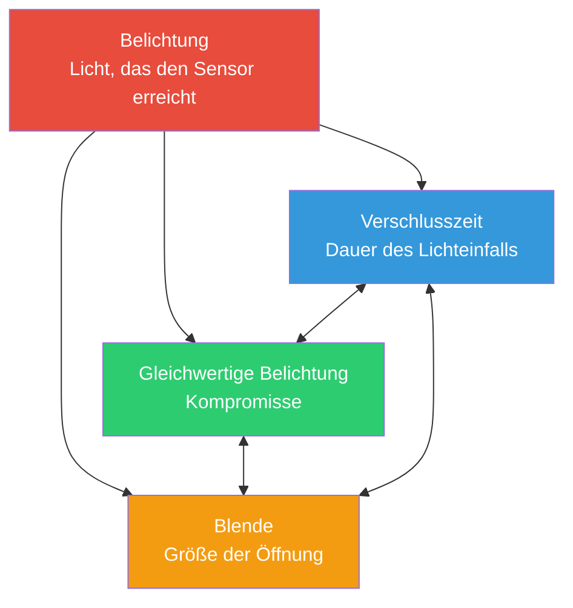

# Kapitel 13: Belichtung

## Das Belichtungsdreieck: Drei Regler, ein Ziel

Wenn Sie ein Foto mit einer Smartphone-Kamera aufnehmen, fangen Sie Licht ein. Die *Menge* an Licht, die den Sensor erreicht, bestimmt, ob Ihr Foto zu dunkel (unterbelichtet), zu hell (überbelichtet) oder genau richtig (korrekt belichtet) ist. Drei grundlegende Steuerelemente regeln dies – zusammen bilden sie das **Belichtungsdreieck**.



**Die Kernidee:** Jede Ecke des Dreiecks steuert das Licht, bringt aber auch einen *kreativen Kompromiss* mit sich. Sie können die *gleiche* Gesamtbelichtung mit verschiedenen Kombinationen der drei Einstellungen erreichen – aber jede Kombination verleiht Ihrem Foto ein anderes *Aussehen*.

Bevor wir im nächsten Kapitel in die Details der Android Camera2 API eintauchen, lassen Sie uns ein solides intuitives Fundament für jedes Element aufbauen.

---

## ISO: Sensorempfindlichkeit (Gain-Steuerung)

In den Zeiten des Films beschrieb **ISO** die *Lichtempfindlichkeit des Filmmaterials* – ein ISO 100-Film war "langsam" und benötigte helles Licht, während ein ISO 800-Film "schnell" war und in Innenräumen fotografieren konnte.

**In der digitalen Fotografie (einschließlich Smartphone-Kameras) ist ISO die Sensorverstärkung / elektronische Amplifikation.** Wenn Sie den ISO-Wert verdoppeln, verdoppeln Sie effektiv die Verstärkung, die auf das analoge Signal des Sensors angewendet wird, bevor es digitalisiert wird.

### Wie ISO funktioniert

Stellen Sie sich die Pixel-Wells des Sensors vor, die Photonen (Lichtteilchen) sammeln. Nachdem die Belichtungszeit endet:

1. Jedes Pixel wandelt die gesammelten Photonen in eine winzige elektrische Ladung um.
2. Ein **analoger Signalverstärker** multipliziert dieses Signal mit einem Faktor, der Ihrer ISO-Einstellung entspricht.
3. Das verstärkte Signal wird von analog in digital umgewandelt (ADC).
4. Die digitale Verarbeitung wendet dann weitere Schritte an (Rauschunterdrückung, Tone-Mapping).

**ISO 100 = Basis / niedrigste Verstärkung.** Das Signal wird am wenigsten verstärkt, daher:
- Fotos sind *sauber* mit minimalem digitalem Rauschen (Körnung).
- Der Dynamikumfang (Differenz zwischen den hellsten und dunkelsten aufnehmbaren Tönen) ist am höchsten.
- Die Farben sind am genauesten.

**ISO 3200 = hohe Verstärkung.** Das Signal wird 32-fach verstärkt:
- Sie können in dunkleren Szenen fotografieren, ohne die Verschlusszeit zu verlängern.
- Sie erhalten jedoch *sichtbares Rauschen* (Farbflecken, Luminanzkörnung).
- Dynamikumfang und Farbgenauigkeit nehmen deutlich ab.

### Typischer Smartphone-ISO-Bereich

| ISO-Bereich | Charakteristik | Anwendungsfall |
|-----------|---------------|----------|
| 50–200 | Basis-ISO, sauberstes Bild | Helles Tageslicht, Studiobeleuchtung |
| 200–800 | Moderate Verstärkung, geringes Rauschen | Bewölkter Tag, schattige Bereiche |
| 800–3200 | Sichtbares Rauschen, noch brauchbar | Innenbeleuchtung, Dämmerung |
| 3200–12800+ | Starkes Rauschen / starke Rauschunterdrückung | Nachtszenen, Veranstaltungen bei wenig Licht |

> **Hinweis zur Smartphone-Realität:** Flaggschiff-Telefone wenden bei hohen ISO-Werten oft eine starke computergestützte Rauschunterdrückung an (herstellerspezifische "Nachtmodus"-Verarbeitung). Wenn Sie später die automatische Pipeline in Camera2 deaktivieren, *verlieren* Sie viele dieser OEM-Optimierungen – ein wichtiger Vorbehalt, auf den wir in Kapitel 14 zurückkommen werden.

---

## Verschlusszeit (Belichtungszeit)

Die **Verschlusszeit** ist einfach die Dauer, *wie lange der Sensor dem Licht ausgesetzt ist*. In traditionellen Kameras öffnet und schließt sich ein mechanischer Verschluss physisch. In Smartphones handelt es sich fast immer um einen **elektronischen Verschluss** – der Sensor wird zurückgesetzt, darf für eine präzise Dauer Photonen sammeln und wird dann ausgelesen.

Die Verschlusszeit wird in **Sekunden** gemessen, typischerweise als Brüche ausgedrückt:

| Verschlusszeit | Auswirkung | Typische Verwendung |
|--------------|-------------|-------------|
| 1/2000 s – 1/1000 s | Sehr kurze Belichtung, friert jede Bewegung ein | Sport, Vögel, schnell fahrende Fahrzeuge |
| 1/500 s – 1/250 s | Friert typische menschliche Bewegungen ein | Gehende Menschen, spielende Kinder |
| 1/125 s – 1/60 s | "Sichere" Geschwindigkeit für Aufnahmen aus der Hand mit Stabilisierung | Allgemeine Fotografie bei ruhiger Hand |
| 1/30 s – 1/15 s | Leichte Bewegungsunschärfe sichtbar, Stativ erforderlich | Kreative Bewegung, wenig Licht |
| 1 s – 30 s | Lange Belichtung, starke Bewegungsunschärfe | Wasserfälle, Sternspuren, glattes Wasser |
| 30 s+ | Ultralange Belichtung (spezialisiert) | Astrofotografie, Lichtmalerei |

### Der Effekt der Bewegungsunschärfe

Es gibt **zwei** Gründe, sich bewusst für eine bestimmte Verschlusszeit zu entscheiden, die über "genug Licht" hinausgehen:

1. **Aktion einfrieren:** Ein Vogel im Flug bei 1/1000 s zeigt jede Feder gestochen scharf, da sich der Vogel während der Belichtung fast gar nicht bewegt hat.

2. **Bewegungsunschärfe erzeugen:** Ein Wasserfall bei 2 Sekunden lässt das fließende Wasser als glatte, seidige weiße Spuren erscheinen – weil jeder Wassertropfen während der Belichtung über viele Pixel auf dem Sensor gewandert ist.

Stellen Sie es sich wie Malen mit langer Belichtung vor: *Alles, was sich bewegt, während der Verschluss offen ist, wird zu einem Streifen.*

**Wichtig für Video:** Bei Aufnahmen mit 30 fps wird jeder Frame *maximal* für ca. 1/30 s belichtet. Kameraleute folgen der **180°-Verschlussregel**: Stellen Sie die Verschlusszeit auf das Doppelte der Bildrate ein → 1/60 s für 30-fps-Video. Dies ergibt eine natürliche, "filmähnliche" Bewegungsunschärfe, ohne zu abgehackt oder zu verschmiert zu wirken.

---

## Blende

Die **Blende** ist die Größe der Öffnung im Objektiv, durch die das Licht fällt. Sie wird in **Blendenstufen** (f/1,4, f/2,0, f/2,8, f/4,0, f/5,6, f/8,0 usw.) gemessen – eine *kontraintuitive Skala, bei der kleinere Zahlen = größere Öffnung bedeuten*.

```
  f/1.4     f/2.0     f/2.8     f/4.0     f/5.6     f/8.0
█████████████████████████████████████████████████████████
█████████████████                              █████████
███████████████                                  ███████
█████████████                                    ██████
████████████                                      █████
███████████                                      ██████
```

**Halbierung des Lichts pro Stufe:** Der Wechsel von f/1,4 → f/2,0 → f/2,8 → f/4,0 halbierte jeweils die Fläche der Öffnung, sodass nur noch die Hälfte des gesamten Lichts durchkommt. Dies ist eine "Stufe" dunkler pro Schritt.

### Kompromisse bei der Blende (kreativ & praktisch)

1. **Schärfentiefe (DoF):** Große Blende (f/1,8) = *geringe* Schärfentiefe – nur eine schmale Ebene ist scharf; alles davor/dahinter verschwimmt (Bokeh). Kleine Blende (f/8) = *große* Schärfentiefe – alles vom Vordergrund bis zum Hintergrund ist scharf.

2. **Lichtausbeute:** f/1,4 sammelt 4-mal mehr Licht als f/2,8. Aus diesem Grund werden "lichtstarke Objektive" (große Maximalblende) für Aufnahmen bei wenig Licht geschätzt.

3. **Beugung:** Bei sehr kleinen Blenden (f/11+) beugen sich die Lichtwellen um die Blendenlamellen, was das Bild leicht weicher macht. Dies ist bei Smartphones in der Regel irrelevant.

### Smartphone-Realitätscheck

Die meisten Smartphones haben **Objektive mit fester Blende** – Sie können die Blendenstufe nicht ändern. Budget-Telefone haben oft f/2,4–f/2,8; Flaggschiffe erreichen häufig f/1,4–f/1,8. Mit der [App Android Camera Parameters](https://play.google.com/store/apps/details?id=com.minininja.cameraparams) können Sie die feste Blende Ihres Objektivs in den `CameraCharacteristics` überprüfen.

Einige wenige Premium-Telefone (z. B. Samsung Galaxy S23 Ultra, Xperia-Serie) bieten einen *Dual-Aperture*-Mechanismus, der mechanisch zwischen zwei Stufen umschaltet (z. B. f/1,5 und f/2,4). Fragen Sie in Camera2 `LENS_INFO_AVAILABLE_APERTURES` ab, um zu sehen, ob Ihr Gerät mehrere Blenden unterstützt.

**Das praktische Fazit:** Für die meiste Android Camera2-Entwicklung ist die Blende *fest*, sodass Sie die Belichtung **nur über ISO + Verschlusszeit** steuern. Zwei Regler statt drei – was die Sache eigentlich vereinfacht!

---

## EV: Belichtungswert (Die logarithmische Skala)

Wenn Fotografen sagen "um eine Stufe anpassen", meinen sie die **Verdoppelung oder Halbierung des gesamten Lichts**. Um das Denken in Stufen präzise zu machen, hat sich die Branche auf den **Belichtungswert (Exposure Value, EV)** standardisiert.

**EV 0** ist definiert als die Belichtungskombination, die eine Standard-Referenzhelligkeit erzeugt: **1 Sekunde Belichtung, Blende f/1,0, ISO 100**.

Jeder **+1 EV verdoppelt das Licht** (heller). Jeder **-1 EV halbiert das Licht** (dunkler):

| EV-Änderung | Bedeutung |
|-----------|---------|
| +3 EV | 8-mal mehr Licht (2³) |
| +2 EV | 4-mal mehr Licht |
| +1 EV | 2-mal mehr Licht |
| 0 EV | Referenz: 1 s @ f/1,0 ISO 100 |
| -1 EV | ½ des Lichts |
| -2 EV | ¼ des Lichts |
| -3 EV | ⅛ des Lichts |

Das Schöne daran: **Jede Kombination aus ISO + Verschlusszeit + Blende, die denselben EV-Wert ergibt, erzeugt dieselbe Gesamtbelichtung.** Dies ist das Prinzip der *äquivalenten Belichtung*, das die drei Ecken des Dreiecks verbindet.

### Kombinationen aus EV und ISO/Verschlusszeit

Bei fester Blende vereinfacht sich die EV-Gleichung dramatisch. Für ein Smartphone bei f/1,8:

| Szene | Typischer EV | Verschluss bei ISO 100 | Verschluss bei ISO 400 | Verschluss bei ISO 1600 |
|-------|-----------|----------------|-----------------|------------------|
| Heller sonniger Strand | 15 | 1/4000 s | 1/1000 s | 1/250 s |
| Dunstiger / bewölkter Tag | 12 | 1/500 s | 1/125 s | 1/30 s |
| Helles Büro im Innenraum | 8 | 1/30 s | 1/8 s | 1/2 s |
| Wohnzimmer bei Nacht | 4 | 2 s | 0,5 s | 1/8 s |
| Sternenklare Nachtszene | -2 | 30 s | 8 s | 2 s |

### Die berühmte Sunny-16-Regel

Bevor es Matrixmessung und hochentwickelte Belichtungsautomaten gab, verließen sich Fotografen auf eine Faustregel, um die Belichtung bei Tageslicht ohne Belichtungsmesser zu treffen:

> **Stellen Sie an einem sonnigen Tag die Blende auf f/16 und die Verschlusszeit auf 1/ISO Sekunden ein.**

| Sunny-16 (f/16) | Äquivalent bei f/1,8 (Smartphone) |
|-----------------|----------------------------------|
| ISO 100, 1/100 s, f/16 → EV 15 | ISO 100, 1/4000 s, f/1,8 → EV 15 ✓ |
| ISO 200, 1/200 s, f/16 → EV 15 | ISO 200, 1/8000 s, f/1,8 → EV 15 ✓ |

Die Mathematik geht auf: f/1,8 ist etwa **6⅓ Stufen weiter** als f/16. Jede Stufe vervierfacht sich? Nein – jede Stufe *verdoppelt* die Lichtfläche. 2^(6,33) ≈ 80-mal mehr Licht. Daher muss der Verschluss 80-mal schneller sein, um dies auszugleichen: 1/100 s ÷ 80 ≈ 1/8000 s (bei ISO 200). Nah genug dran für die Praxis.

---

## Das Aussehen von unterbelichtet / korrekt / überbelichtet

Vergleichen wir gedanklich drei Aufnahmen derselben Szene (z. B. eine Person im Freien mit dem Himmel im Hintergrund):

**Unterbelichtet (-2 EV):** Das Motiv ist zu dunkel. Schatten sind zu reinem Schwarz "abgesoffen", ohne Details. In einem Histogramm stapeln sich alle Daten auf der linken (dunklen) Seite. Der Himmel mag gut aussehen, aber die Person erscheint als Silhouette. Man *kann* versuchen, unterbelichtete Rohdaten in der Nachbearbeitung "hochzuziehen", aber die Schatten werden starkes Rauschen offenbaren, da Sie ein schwaches Signal verstärken.

**Korrekt belichtet (0 EV):** Mitteltöne zeigen die richtige Textur. Das Gesicht der Person weist sichtbare Hautdetails, Falten in der Kleidung und Lichtreflexe in den Augen auf. Das Histogramm hat über den gesamten Bereich verteilte Daten, ohne hartes Abschneiden an den Enden. Bei Telefonen mit begrenztem Dynamikumfang kann dies bedeuten, dass *einige* helle Lichter im Himmel zu Weiß ausfressen (keine blauen Details) – das ist ein klassischer Kompromiss gegenüber der Unterbelichtung des Motivs.

**Überbelichtet (+2 EV):** Helle Stellen sind zu reinem Weiß "ausgefressen", ohne Möglichkeit der Wiederherstellung. Der Himmel ist eine gleichmäßig weiße Fläche; helle Hemdknöpfe und Spiegelungen sind abgeschnitten. Das Gesicht der Person mag schmeichelhaft aussehen (helle Haut), aber Sie haben permanent alle Details in den Lichtern verloren. Im Gegensatz zu unterbelichteten Schatten (die man oft mit Rauschen teilweise retten kann), sind *ausgefressene Lichter für immer verloren* – in diesen Pixeln befinden sich schlichtweg keine Daten mehr.

**Das Mantra des Fotografen:** *Belichte auf die Lichter, rette die Schatten.* Bei der RAW-Aufnahme (die wir später behandeln werden) ist dies besonders wirkungsvoll, da 14-Bit-RAW genügend Schattendetails speichert, um +2 EV oder mehr ohne katastrophales Rauschen herauszuziehen.

---

## Realitätsnahe EV-Referenztabelle

Das Auswendiglernen einiger EV-Eckwerte ermöglicht es Ihnen, die Belichtung überall einzuschätzen:

| Szene | Typischer EV (bei ISO 100) | Grober Verschluss bei f/1,8, ISO 400 |
|-------|------------------------|--------------------------------|
| Schneelandschaft bei direktem Sonnenlicht | 16 | 1/4000 s |
| Sonniger Strand, heller Tag | 15 | 1/2000 s |
| Typischer sonniger Tag | 14 | 1/1000 s |
| Bedeckter / bewölkter Tag | 12 | 1/250 s |
| Sehr bewölkt / Regen | 11 | 1/125 s |
| Offener Schatten (Person im Schatten, sonniger Hintergrund) | 9 | 1/30 s |
| Sonnenuntergang / Goldene Stunde | 7 | 1/8 s |
| Helles Büro im Innenraum | 8 | 1/15 s |
| Wohnzimmer zu Hause, nur Lampen | 4 | 1/2 s |
| Dunkles Restaurant-Interieur | 2 | 2 s |
| Stadtstraße bei Nacht (Leuchtreklamen) | 1 | 4 s |
| Nachtlandschaft, ferne Stadtlichter | -2 | 30 s |
| Mondlandschaft (Vollmond) | -3 | 1 Minute |
| Sternenhimmel, kein Mond | -6 | 8 Minuten |

Sie können diese Näherungswerte mit dem vergleichen, was die Belichtungsautomatik Ihres Telefons tatsächlich wählt. Starten Sie die [App Android Camera Parameters](https://github.com/zoozooll/AndroidCameraParameters), gehen Sie in die Live-Vorschau und beobachten Sie `SENSOR_EXPOSURE_TIME` und `SENSOR_SENSITIVITY`, während Sie von hellem Sonnenlicht in einen dunklen Raum gehen – Sie werden reale Werte sehen, die grob dieser Tabelle entsprechen.

---

## Alles zusammengefügt: Äquivalente Belichtungen

Nehmen wir an, Sie möchten die *gleiche Gesamtbelichtung* (EV 12 = bewölkter Tag, f/1,8 Smartphone). Hier sind drei gültige Kombinationen, die eine identische Sensorhelligkeit erzeugen:

| Kombination | ISO | Verschlusszeit | Look & Feel |
|-------------|-----|---------------|-------------|
| Sauber & Scharf | 100 | 1/500 s | Geringstes Rauschen, schärfstes Einfrieren von Bewegung |
| Mittelweg | 400 | 1/125 s | Geringes Rauschen, gute Balance |
| Weiche Bewegung | 1600 | 1/30 s | Sichtbares Rauschen; leichte Unschärfe bei bewegten Motiven |

Alle drei landen beim gleichen EV. Alle drei *sehen gleich hell aus*. Aber die *Textur* (Rauschkörnung) und die *Darstellung von Bewegung* sind völlig unterschiedlich. **Das ist die Kunst der Belichtung.**

### Was, wenn Sie beides brauchen?

Hier glänzt die computergestützte Fotografie. Ein Telefon im "Nachtmodus" macht nicht *eine* 2-Sekunden-Aufnahme – es nimmt *Dutzende* von 1/60-Sekunden-Frames auf (und friert so die Bewegung in jedem einzelnen ein), richtet sie dann rechnerisch aus und mittelt sie. Das Ergebnis nähert sich der Lichtausbeute einer Langzeitbelichtung an, ohne den Nachteil der Bewegungsunschärfe.

Sobald Sie die manuelle Belichtung auf Camera2-Ebene verstehen, können Sie solche Techniken selbst implementieren.

---

## Zusammenfassung

In diesem Kapitel haben wir die *Grundlagen der Fotografie* behandelt, ohne eine einzige Zeile Android-Code anzurühren:

- **Belichtungsdreieck:** Verschlusszeit (Zeit), ISO (Sensorverstärkung) und Blende (Größe der Öffnung) steuern zusammen das gesamte Licht. Jedes Element bringt einen kreativen Kompromiss mit sich.
- **ISO** in der digitalen Fotografie = analoge Sensorverstärkung. Niedriger ISO = sauber, hoher ISO = verrauscht. Smartphones unterstützen üblicherweise ISO 100–6400+ mit OEM-Rauschunterdrückung.
- **Verschlusszeit** ist die Belichtungszeit in Sekunden. Schnelle Verschlüsse (1/1000 s) frieren Aktionen ein; langsame Verschlüsse (1 s+) erzeugen Bewegungsunschärfe. Die 180°-Verschlussregel gilt für Videos.
- **Blende** ist die durch die Blendenöffnung gesteuerte Objektivöffnung. Die meisten Smartphones haben eine feste Blende, daher verlassen wir uns nur auf ISO + Verschlusszeit.
- **EV (Exposure Value)** ist die logarithmische Stufenskala, bei der jeder Schritt um ±1 das Licht verdoppelt/halbiert. EV 0 = 1 s @ f/1,0 ISO 100.
- Mit der **Sunny-16-Regel** und der EV-Referenztabelle können Sie Belichtungen ohne Messung abschätzen.
- Eine **korrekte Belichtung** gleicht die Details in den Mitteltönen aus und vermeidet abgesoffene Schatten sowie ausgefressene Lichter. RAW bewahrt Spielraum für die Rettung von Details.

## Wie geht es weiter?

In **Kapitel 14: Manuelle Belichtung in Camera2** übertragen wir dieses gesamte konzeptionelle Modell in konkrete Camera2-API-Aufrufe. Sie werden lernen:

- Wie man die Belichtungsautomatik-Pipeline deaktiviert (`CONTROL_MODE = OFF`, `CONTROL_AE_MODE = OFF`).
- Wie man ISO-Werte in `SENSOR_SENSITIVITY` übersetzt.
- Wie man menschenlesbare Sekunden ↔ Nanosekunden für `SENSOR_EXPOSURE_TIME` umrechnet.
- Vollständig funktionierender Kotlin-Code für eine feste Zeitraffer-Belichtung, eine lange Nachtbelichtung und eine Belichtungsreihe mit 3 Aufnahmen (Bracketing).
- Der wichtige Vorbehalt, dass die OEM-Rauschunterdrückung deaktiviert wird, wenn Sie 3A ausschalten.

Setzen Sie Ihre Denkkappe auf – der Code beginnt im nächsten Kapitel.
