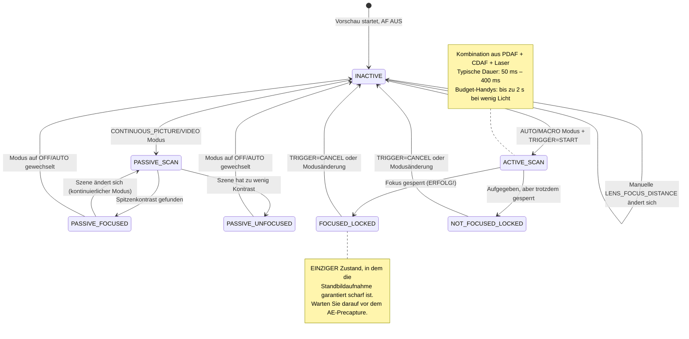

# Kapitel 15: Fokus

Die Belichtung steuert die Helligkeit. **Der Fokus steuert, was scharf ist.** Ein perfekt belichtetes Foto mit weichem Fokus ist ein misslungenes Foto. In diesem Kapitel erfahren Sie, wie Smartphone-Fokussysteme funktionieren, wie Sie den Autofokus (AF) zuverlässig über Camera2 steuern und wie Sie einen seidenweichen manuellen Fokus-Schieberegler mit `LENS_FOCUS_DISTANCE` implementieren.

Die [App Android Camera Parameters](https://github.com/zoozooll/AndroidCameraParameters) demonstriert all dies in ihrem Fokus-Panel – Sie können die Übergänge der AF-Zustandsmaschine live beobachten und den manuellen Fokus-Schieberegler ziehen, um zu sehen, wie das Objektiv von unendlich bis zur minimalen Fokusdistanz fährt.

---

## Autofokus (AF) in modernen Smartphones

Bevor wir in die API-Details eintauchen, lassen Sie uns die drei physikalischen Fokusmechanismen verstehen, die Smartphones verwenden.

### 1. Kontrast-Autofokus (CDAF) — Passiver Scan

Die Softwaretechnik: Analysieren des Bildes, Suchen nach maximalem Kantenkontrast (scharfe Kanten = höchste Ortsfrequenz) und Bewegen des Objektivs, bis der Spitzenkontrast gefunden ist.

- **Vorteil:** Funktioniert auf jeder Kamerahardware (keine speziellen Pixel erforderlich).
- **Nachteil:** Langsam. Das Objektiv muss über den Fokusbereich hin- und herfahren ("hunten"). Szenentext-Labels wie "AF SCANNING" im Camera2-Status beziehen sich darauf.

### 2. Phasenvergleich-Autofokus (PDAF) — Aktiver Scan

Spezielle Fotodioden auf dem Sensor sind in zwei Hälften geteilt. Die Phasendifferenz zwischen der linken und rechten Hälfte misst direkt, *wie weit und in welche Richtung* sich das Objektiv bewegen muss – kein Suchen erforderlich. Flaggschiff-Telefone verwenden heute Dual-Pixel-PDAF, bei dem *jedes* Pixel die Phasendetektion durchführt.

- **Vorteil:** Extrem schnell (< 100 ms Lock bei gutem Licht); funktioniert zuverlässig bei Videos.
- **Nachteil:** Hat Schwierigkeiten bei schlechtem Licht (nicht genügend Photonen, um die Phase zuverlässig zu berechnen) und hat Grenzen bei der minimalen Fokusdistanz.

### 3. Laser-AF / ToF-AF (Aktiv) — Entfernungsmesser

Ein dediziertes Hardwaremodul feuert einen Infrarot-Laserpuls ab, misst die Zeit der Reflexion und meldet die Entfernung zum Motiv direkt an den ISP. Sehr verbreitet bei Mittelklasse- bis Premium-Telefonen.

- **Vorteil:** Blitzschneller Lock auf jedes Ziel, selbst in völliger Dunkelheit (wenn das Ziel IR reflektiert).
- **Nachteil:** Begrenzte effektive Reichweite (~50 cm–5 m max.), versagt bei Glas oder IR-transparenten Objekten.

Echte Telefone kombinieren **alle drei**: PDAF für einen schnellen groben Lock, CDAF für die Feinabstimmung und Laser-AF für Szenen bei wenig Licht oder Nahaufnahmen. Camera2 legt diese vereinheitlichte Pipeline als eine einzige abstrakte Zustandsmaschine offen.

---

## AF-Modi: CONTROL_AF_MODE

Camera2 definiert diese AF-Modi in `CameraMetadata`:

| Modus (CONTROL_AF_MODE_*) | Verhalten | Anwendungsfall |
|-------------------------|----------|----------|
| `OFF` | Überhaupt kein AF. Sie stellen `LENS_FOCUS_DISTANCE` manuell ein. | Manueller Fokus, Focus Stacking, Astrofotografie (Unendlich-Lock) |
| `AUTO` | One-Shot-AF. Tut nichts, bis Sie `CONTROL_AF_TRIGGER = START` senden, scannt dann einmal und sperrt. | Klassische Point-and-Shoot-Standbildfotografie |
| `MACRO` | Identisch mit AUTO, aber auf die Erkennung von nahen Motiven ausgerichtet. | Nahaufnahmen, Scannen von Dokumenten, "Food-Modus" |
| `CONTINUOUS_PICTURE` | Fokussiert ständig neu, **pausiert aber die Neufokussierung, wenn Sie eine Standbildaufnahme auslösen**, um einen Fokus-Shift während der Aufnahme zu vermeiden. | Standard für Standbildfotografie |
| `CONTINUOUS_VIDEO` | Fokussiert ständig neu – pausiert nie. Kann sichtbar "hunten", hält aber das Video im Fokus. | Videoaufzeichnung, Video-Chats |
| `EDOF` | Extended Depth of Field: Software/Firmware-simulierter tiefer Fokus. Keine physikalische Objektivbewegung. | Budget-Geräte ohne bewegliche Objektiv-Aktoren |

**Zwei wichtige Hinweise:**

1. **EDOF-Geräte** (günstige Handys, Selfie-Kameras) haben eine *feste* Fokusebene. Sie werden von ihnen niemals `FOCUSED_LOCKED` erhalten – das Beste, was Sie bekommen, ist `PASSIVE_SCAN` → `PASSIVE_FOCUSED` → `INACTIVE`. Die [App Android Camera Parameters](https://play.google.com/store/apps/details?id=com.minininja.cameraparams) zeigt für diese Kameras explizit "Fixed Focus" an.

2. **CONTINUOUS_***-Modi kehren nach dem Leerlauf in den Zustand `INACTIVE` zurück, anstatt gesperrt zu bleiben. Erwarten Sie kein `FOCUSED_LOCKED` im kontinuierlichen Modus – das gibt es nur für `AUTO`/`MACRO` + expliziten Trigger.

---

## Die AF-Zustandsmaschine

Camera2 meldet den AF-Status über `CaptureResult.CONTROL_AF_STATE`. Das Verständnis dieser Zustände ist *entscheidend* für zuverlässige Standbild-Aufnahmesequenzen.



Referenztabelle der Zustände:

| CONTROL_AF_STATE | Bedeutung | Nächste Aktion |
|------------------|---------|-------------|
| `INACTIVE` (0) | AF ist aus, im Leerlauf oder kontinuierlicher Modus scannt gerade nicht | Falls im AUTO-Modus: TRIGGER_START senden |
| `PASSIVE_SCAN` (1) | Kontinuierlicher Modus scannt passiv | Warten; noch keine Standbildaufnahme auslösen |
| `PASSIVE_FOCUSED` (2) | Kontinuierlicher Modus hat Fokus gefunden, ist aber NICHT gesperrt (kann driften) | Sicher, Standbilder in CONTINUOUS_PICTURE auszulösen (er wird sperren) |
| `ACTIVE_SCAN` (3) | Expliziter Trigger hat einen Scan gestartet | Einfach warten... |
| `NOT_FOCUSED_LOCKED` (4) | Fokus wurde nicht gefunden, aber das Objektiv ist trotzdem gesperrt | Benutzernachricht anzeigen; optional erneut versuchen oder trotzdem aufnehmen |
| `FOCUSED_LOCKED` (5) | **ERFOLG.** Fokus gefunden und hardwareseitig gesperrt. | Sofort mit dem AE-Precapture-Trigger fortfahren |
| `PASSIVE_UNFOCUSED` (6) | Kontinuierlicher Modus konnte nicht sperren, scannt noch | Beleuchtung verbessern oder anderes Ziel wählen |

**Unumstößliche Regel für die Standbildfotografie:** Übermitteln Sie *niemals* eine Standbildaufnahme (besonders mit Blitz!), bevor Sie `FOCUSED_LOCKED` sehen. Wenn Sie diesen Schritt überspringen, wird Ihre App zeitweise unscharfe Fotos produzieren.

---

## Fokusdistanz: Dioptrien, nicht Meter

Hier ist die zweite "Falle", über die Camera2-Entwickler stolpern (nach der Überraschung mit dem Verschluss in Nanosekunden):

**`LENS_FOCUS_DISTANCE` verwendet Dioptrien (D), nicht Meter.** Dioptrien sind der *mathematische Kehrwert* der Fokusdistanz:

```
Fokusdistanz (Meter) = 1.0 / Dioptrien
Dioptrien = 1.0 / Fokusdistanz (Meter)
```

| Dioptrien (LENS_FOCUS_DISTANCE) | Physikalische Fokusdistanz |
|--------------------------------|-------------------------|
| **0.0** | **Unendlich** (∞) — Sterne, ferne Berge |
| 0.1 | 10 Meter |
| 0.25 | 4 Meter |
| 0.5 | 2 Meter |
| 1.0 | 1 Meter |
| 2.0 | 0,5 Meter (50 cm) |
| 5.0 | 0,2 Meter (20 cm) |
| 10.0 | 0,1 Meter (10 cm) |
| 20.0 | 0,05 Meter (5 cm) |

Warum Dioptrien? Weil sich der Objektiv-Aktor linear mit der *optischen Leistung* bewegt, nicht mit der physikalischen Distanz. Eine Fokusfahrt von 0,0 D → 20,0 D entspricht einer gleichmäßigen Objektivbewegung, während eine Fahrt in "Metern" von 10 m → 5 cm hochgradig nichtlinear wäre.

### Abfrage der minimalen Fokusdistanz

Jedes Objektiv hat eine Naheinstellgrenze (Sie können ein Objekt, das direkt am Glas klebt, physikalisch nicht fokussieren). Fragen Sie diese ab:

```kotlin
// Maximal nützlicher Dioptrienwert für dieses Objektiv
val maxDiopters = characteristics.get(
    CameraCharacteristics.LENS_INFO_MINIMUM_FOCUS_DISTANCE
) ?: 0.0f // 0.0f = Fixed-Focus EDOF-Objektiv (überhaupt keine Fokussteuerung!)

if (maxDiopters == 0.0f) {
    Log.w("Focus", "Dies ist ein Fixed-Focus-Objektiv. Manueller AF deaktiviert.")
} else {
    // Gültiger Dioptrienbereich ist [0.0f .. maxDiopters]
    Log.d("Focus", "Fokusbereich: 0.0 D (Unendl.) → $maxDiopters D (${1/maxDiopters} m Nahbereich)")
}
```

Typische Werte:
- Rückkamera eines Budget-Handys: ~10 D (10 cm minimale Fokusdistanz)
- Flaggschiff-Weitwinkelkamera: ~15–25 D (4–7 cm Minimum)
- Makrokamera: ~30–50 D (2–3 cm Minimum)
- Front-Selfie-Kamera: Oft 0,0 D (Fixed-Focus, EDOF)

### Hyperfokale Distanz (Konzept)

Landschaftsfotografen lieben dies: Stellen Sie den Fokus auf die **hyperfokale Distanz** ein, und alles von der Hälfte dieser Distanz bis unendlich ist "akzeptabel scharf". Bei einem Telefon mit Blende f/1,8 und einem Standard-Weitwinkelobjektiv liegt die hyperfokale Distanz bei etwa 0,5–1,0 Metern.

**Faustregel für Smartphones:** Das Einstellen von `LENS_FOCUS_DISTANCE = 2.0 D` (50 cm Fokusdistanz) entspricht bei den meisten Weitwinkelobjektiven von Telefonen annähernd der hyperfokalen Distanz. Gut für Landschafts- und Straßenfotografie, wenn man nicht auf den AF warten möchte.

```kotlin
// Voreingestellter Näherungswert für hyperfokal "alles scharf"
const val HYPERFOCAL_DIOPTERS_APPROX = 2.0f

fun setHyperfocal(builder: CaptureRequest.Builder, characteristics: CameraCharacteristics) {
    val maxD = characteristics.get(
        CameraCharacteristics.LENS_INFO_MINIMUM_FOCUS_DISTANCE
    ) ?: 0.0f
    val diopters = min(HYPERFOCAL_DIOPTERS_APPROX, maxD.takeIf { it > 0 } ?: 0.0f)
    builder.set(CaptureRequest.CONTROL_AF_MODE, CameraMetadata.CONTROL_AF_MODE_OFF)
    builder.set(CaptureRequest.LENS_FOCUS_DISTANCE, diopters)
}
```

Möchten Sie die genaue hyperfokale Distanz für Ihr spezielles Objektiv berechnen? Sie benötigen dazu auch `LENS_INFO_AVAILABLE_FOCAL_LENGTHS` (Brennweite in mm) und den physikalischen Pixelabstand des Sensors. Für 95 % der Smartphone-Anwendungsfälle sind 2,0 D nah genug dran.

---

## Vollständiges Beispiel 1: One-Shot AF Trigger-and-Capture

Dies ist der Standard-Ablauf der Standbildfotografie für den Modus `AUTO` / `MACRO`. Es ist auch genau die Sequenz, die die 3A-Orchestrierung in Kapitel 17 wiederverwenden wird.

**Ziel:** Benutzer tippt auf "Aufnahme" → AF bis zum Sperren des Fokus treiben → sobald gesperrt, die Standbildaufnahme übermitteln.

```kotlin
class AutoFocusCaptureHelper(
    private val characteristics: CameraCharacteristics,
    private val captureSession: CameraCaptureSession,
    private val previewSurface: Surface,
    private val jpegReaderSurface: Surface
) {
    private var afTriggered = false
    private var capturePlanned = false

    fun triggerAutoFocusAndCapture(onCaptureComplete: () -> Unit) {
        // ---- SCHRITT 1: Wiederholte Anforderung mit explizitem AF-Trigger erstellen ----
        val triggerRequest = captureSession.device.createCaptureRequest(
            CameraDevice.TEMPLATE_PREVIEW
        ).apply {
            addTarget(previewSurface)

            // AUTO-Modus verwenden, um den LOCKED-Zustand am Ende zu garantieren
            set(CaptureRequest.CONTROL_AF_MODE,
                CameraMetadata.CONTROL_AF_MODE_AUTO)

            // Den One-Shot AF-Trigger JETZT abfeuern
            set(CaptureRequest.CONTROL_AF_TRIGGER,
                CameraMetadata.CONTROL_AF_TRIGGER_START)
        }

        afTriggered = true
        capturePlanned = true

        // ---- SCHRITT 2: Unseren Callback zur Zustandsverfolgung abonnieren ----
        captureSession.setRepeatingRequest(
            triggerRequest.build(),
            object : CameraCaptureSession.CaptureCallback() {
                override fun onCaptureCompleted(
                    session: CameraCaptureSession,
                    request: CaptureRequest,
                    result: TotalCaptureResult
                ) {
                    val afState = result.get(CaptureResult.CONTROL_AF_STATE)
                        ?: return
                    Log.d("AF", "AF-Status: $afState")

                    when (afState) {
                        // --- ERFOLGSPFAD ---
                        CaptureResult.CONTROL_AF_STATE_FOCUSED_LOCKED -> {
                            if (capturePlanned) {
                                capturePlanned = false
                                submitStillCapture()
                                onCaptureComplete()
                            }
                        }
                        // --- FEHLERPFAD: konnte nicht sperren, aber wir versuchen es trotzdem ---
                        CaptureResult.CONTROL_AF_STATE_NOT_FOCUSED_LOCKED -> {
                            Log.w("AF", "AF konnte nicht sperren — Aufnahme erfolgt trotzdem (unscharf?)")
                            if (capturePlanned) {
                                capturePlanned = false
                                submitStillCapture()
                                onCaptureComplete()
                            }
                        }
                        // --- SCANNT NOCH: ignorieren ---
                        CaptureResult.CONTROL_AF_STATE_ACTIVE_SCAN,
                        CaptureResult.CONTROL_AF_STATE_PASSIVE_SCAN -> {
                            // Arbeitet noch, noch nichts unternehmen
                        }
                    }
                }
            },
            null // Handler auf aktuellem Thread
        )
    }

    private fun submitStillCapture() {
        val stillRequest = captureSession.device.createCaptureRequest(
            CameraDevice.TEMPLATE_STILL_CAPTURE
        ).apply {
            addTarget(previewSurface)
            addTarget(jpegReaderSurface)

            // AF für dieses Standbild gesperrt halten — Trigger noch NICHT freigeben
            set(CaptureRequest.CONTROL_AF_MODE,
                CameraMetadata.CONTROL_AF_MODE_AUTO)
            // AF_TRIGGER so lassen, wie er ist (START bleibt, bis wir explizit CANCEL senden)

            set(CaptureRequest.JPEG_QUALITY, 95)
        }

        captureSession.capture(
            stillRequest.build(),
            object : CameraCaptureSession.CaptureCallback() {
                override fun onCaptureCompleted(
                    session: CameraCaptureSession,
                    request: CaptureRequest,
                    result: TotalCaptureResult
                ) {
                    // Foto aufgenommen — nun AF-Lock freigeben, zurück zum kontinuierlichen Modus
                    resetFocusToContinuous()
                }
            },
            null
        )
    }

    private fun resetFocusToContinuous() {
        val resumePreview = captureSession.device.createCaptureRequest(
            CameraDevice.TEMPLATE_PREVIEW
        ).apply {
            addTarget(previewSurface)
            set(CaptureRequest.CONTROL_AF_MODE,
                CameraMetadata.CONTROL_AF_MODE_CONTINUOUS_PICTURE)
            set(CaptureRequest.CONTROL_AF_TRIGGER,
                CameraMetadata.CONTROL_AF_TRIGGER_CANCEL)
        }
        afTriggered = false
        captureSession.setRepeatingRequest(resumePreview.build(), null, null)
    }
}
```

**Wichtiges Detail:** Sie brechen den Trigger *nach* Abschluss der Standbildaufnahme ab – nicht davor. Wenn Sie ihn zu früh abbrechen, entsperrt sich das Objektiv während der Aufnahme, was zu einem unscharfen Foto führt.

**Timeout-Absicherung (nicht gezeigt):** Echte Apps fügen dem AF-Scan ein Timeout von 2–3 Sekunden hinzu. Wenn `ACTIVE_SCAN` 3 Sekunden lang läuft und niemals `FOCUSED_LOCKED` erreicht, brechen Sie ab und blenden Sie einen Benutzerhinweis wie "Tippen Sie zum Fokussieren auf einen kontrastreichen Bereich" ein.

---

## Vollständiges Beispiel 2: Manueller Fokus-SeekBar-Schieberegler

Dies ist die Funktion für den manuellen Fokus, wie Sie sie aus Pro-Kamera-Apps kennen. Eine SeekBar bildet den physikalischen Fokusbereich von 0,0 D → maxD stufenlos ab.

### Layout (res/layout/fragment_manual_focus.xml)

```xml
<LinearLayout
    xmlns:android="http://schemas.android.com/apk/res/android"
    android:layout_width="match_parent"
    android:layout_height="wrap_content"
    android:orientation="vertical"
    android:padding="16dp">

    <TextView
        android:id="@+id/tvFocusLabel"
        android:layout_width="match_parent"
        android:layout_height="wrap_content"
        android:text="Fokus: ∞ (unendlich)"
        android:textSize="14sp"/>

    <SeekBar
        android:id="@+id/seekFocus"
        android:layout_width="match_parent"
        android:layout_height="wrap_content"
        android:max="1000"/>
</LinearLayout>
```

### Kotlin: Fragment / Activity Verkabelung

```kotlin
class ManualFocusController(
    private val seekBar: SeekBar,
    private val labelView: TextView,
    private val characteristics: CameraCharacteristics,
    private val captureSessionProvider: () -> CameraCaptureSession?,
    private val previewSurface: Surface
) {
    // Der Schieberegler verwendet 1000 ganzzahlige Schritte für Präzision unterhalb einer Dioptrie
    private val sliderSteps = 1000
    private val maxDiopters = characteristics.get(
        CameraCharacteristics.LENS_INFO_MINIMUM_FOCUS_DISTANCE
    ) ?: 0.0f

    private var currentDiopters = 0.0f

    init {
        if (maxDiopters == 0.0f) {
            seekBar.isEnabled = false
            labelView.text = "Fixed Focus (Kein manueller AF)"
        } else {
            bindSeekBar()
            applyFocus(0.0f) // Bei unendlich starten
        }
    }

    private fun bindSeekBar() {
        // Konvertierung Schieberegler int [0..1000] ↔ Dioptrien [0.0 .. maxDiopters]
        seekBar.setOnSeekBarChangeListener(object : SeekBar.OnSeekBarChangeListener {
            private var lastUpdate = 0L

            override fun onProgressChanged(seekBar: SeekBar, progress: Int, fromUser: Boolean) {
                if (!fromUser) return

                // Drosselung auf ~30 fps (33 ms) — vermeidet das Überfluten des HAL mit Anforderungen
                val now = SystemClock.elapsedRealtime()
                if (now - lastUpdate < 33L) return
                lastUpdate = now

                val diopters = progress.toFloat() / sliderSteps.toFloat() * maxDiopters
                applyFocus(diopters)
            }
            override fun onStartTrackingTouch(seekBar: SeekBar) {
                // Sofort in den voll manuellen AF-Modus wechseln, wenn der Benutzer zu ziehen beginnt
                switchToManualMode()
            }
            override fun onStopTrackingTouch(seekBar: SeekBar) {
                // Den exakten Endwert anwenden, um Drosselungsfehler zu korrigieren
                val diopters = seekBar.progress.toFloat() / sliderSteps.toFloat() * maxDiopters
                applyFocus(diopters, force = true)
            }
        })
    }

    private fun switchToManualMode() {
        // CONTROL_AF_MODE_OFF deaktiviert die automatische Steuerung des Fokusmotors
        val session = captureSessionProvider() ?: return
        val request = session.device.createCaptureRequest(
            CameraDevice.TEMPLATE_PREVIEW
        ).apply {
            addTarget(previewSurface)
            set(CaptureRequest.CONTROL_AF_MODE, CameraMetadata.CONTROL_AF_MODE_OFF)
            set(CaptureRequest.CONTROL_MODE, CameraMetadata.CONTROL_MODE_USE_SCENE_MODE)
        }
        session.setRepeatingRequest(request.build(), null, null)
    }

    fun applyFocus(diopters: Float, force: Boolean = false) {
        currentDiopters = diopters.coerceIn(0.0f, maxDiopters)

        // Label aktualisieren: "∞" für < 0,1 D anzeigen, sonst "X.Y m"
        labelView.text = when {
            currentDiopters < 0.1f -> "Fokus: ∞ (unendlich)"
            else -> {
                val meters = 1.0f / currentDiopters
                String.format("Fokus: %.1f D  (%.2f m)", currentDiopters, meters)
            }
        }

        // Eine wiederholte Anforderung mit der neuen Fokusdistanz erstellen und übermitteln
        val session = captureSessionProvider() ?: return
        val request = session.device.createCaptureRequest(
            CameraDevice.TEMPLATE_PREVIEW
        ).apply {
            addTarget(previewSurface)
            set(CaptureRequest.CONTROL_AF_MODE, CameraMetadata.CONTROL_AF_MODE_OFF)
            set(CaptureRequest.LENS_FOCUS_DISTANCE, currentDiopters)
        }

        // setRepeatingRequest verwenden, damit jeder Vorschau-Frame den neuen Fokus berücksichtigt
        session.setRepeatingRequest(request.build(), null, null)
    }

    // --- Helfer für Voreinstellungen ---
    fun setInfinity() { seekBar.progress = 0; applyFocus(0.0f, true) }
    fun setHyperfocalApprox() {
        val d = min(2.0f, maxDiopters)
        seekBar.progress = (d / maxDiopters * sliderSteps).toInt()
        switchToManualMode()
        applyFocus(d, true)
    }
    fun setNearest() { seekBar.progress = sliderSteps; applyFocus(maxDiopters, true) }
}
```

**Wichtige Details der Implementierung:**

1. **Drosselung.** SeekBars lösen `onProgressChanged` mit bis zu 200 Hz aus. Das Senden von `setRepeatingRequest` bei jedem Ereignis überflutet den HAL mit Arbeit und führt zu Verzögerungen. Eine Drosselung auf 33 ms begrenzt die Aktualisierungen auf ~30 fps – das ist flüssig genug für die physikalische Geschwindigkeit des Objektivmotors.

2. **Frühzeitiger Wechsel zu CONTROL_AF_MODE_OFF.** Wenn Sie sich im Modus `CONTINUOUS_PICTURE` befinden und `LENS_FOCUS_DISTANCE` einstellen, ohne den AF zu deaktivieren, wird der AF-Algorithmus *gegen Sie ankämpfen* und den Fokus einen Frame später wieder auf das zurücksetzen, was er für richtig hält. Der Wechsel muss zuerst erfolgen, in `onStartTrackingTouch`.

3. **Aktualisierung über `setRepeatingRequest`**, nicht über ein einmaliges `capture()`. Der manuelle Fokus muss bei *jedem* Vorschau-Frame erhalten bleiben, bis der Benutzer den Schieberegler erneut bewegt.

4. **Erzwungenes Anwenden beim Loslassen.** Die Drosselung überspringt Zwischenpositionen; wenn der Benutzer den Finger hebt, wenden Sie den exakten finalen Wert des Schiebereglers an.

---

## Fokusbereiche (Touch-to-Focus)

Moderne Kamera-Apps lassen Sie auf den *Sucher tippen*, um ein Fokus-Ziel auszuwählen. Camera2 implementiert dies über `CONTROL_AF_REGIONS` – eine Liste von Rechtecken (im Koordinatenraum des Active Array) mit Gewichtungen.

```kotlin
// Konvertiert ein Tippen auf den Sucher (x,y) in einen Sensor-Koordinatenbereich aus den CameraCharacteristics
fun createTapFocusRegion(viewfinderWidth: Int, viewfinderHeight: Int,
                         tapX: Float, tapY: Float,
                         characteristics: CameraCharacteristics): MeteringRectangle {
    val activeArray = characteristics.get(
        CameraCharacteristics.SENSOR_INFO_ACTIVE_ARRAY_SIZE
    )!!
    // Tippen auf jeder Achse auf [0..1] normalisieren
    val nx = tapX / viewfinderWidth.toFloat()
    val ny = tapY / viewfinderHeight.toFloat()
    // Auf das Sensor-Active-Array abbilden, einen 200×200 Bereich zentriert auf dem Tippen erstellen
    val cx = (nx * activeArray.width()).toInt()
    val cy = (ny * activeArray.height()).toInt()
    val rSize = 200
    return MeteringRectangle(
        max(0, cx - rSize/2), max(0, cy - rSize/2),
        rSize, rSize,
        MeteringRectangle.METERING_WEIGHT_MAX
    )
}

// Bereich an einen Request-Builder anhängen
fun applyTapFocus(builder: CaptureRequest.Builder, region: MeteringRectangle) {
    builder.set(CaptureRequest.CONTROL_AF_REGIONS, arrayOf(region))
    builder.set(CaptureRequest.CONTROL_AE_REGIONS, arrayOf(region)) // AE-Spot ebenfalls koppeln!
    builder.set(CaptureRequest.CONTROL_AF_TRIGGER,
        CameraMetadata.CONTROL_AF_TRIGGER_CANCEL) // Vorherigen Lock aufheben
    builder.set(CaptureRequest.CONTROL_AF_TRIGGER,
        CameraMetadata.CONTROL_AF_TRIGGER_START)  // Scan im neuen Bereich auslösen
}
```

**Profi-Tipp:** Koppeln Sie `CONTROL_AE_REGIONS` immer passend zu `CONTROL_AF_REGIONS`. Der Benutzer hat auf ein Gesicht getippt, weil er dieses Gesicht *sowohl* im Fokus *als auch* korrekt belichtet haben möchte – nicht auf das Gesicht fokussiert, aber auf den hellen Himmel dahinter belichtet.

---

## Fehlerbehebung bei Fokusproblemen

| Symptom | Ursache | Lösung |
|---------|-----------|-----|
| AF-Status geht nie über ACTIVE_SCAN hinaus | Kontrastarme Szene (weiße Wand, rein blauer Himmel) oder Hardwarefehler | Timeout nach ~3 s; Benutzer benachrichtigen; auf hyperfokale Voreinstellung zurückgreifen |
| Manueller Fokus-Schieberegler bewirkt nichts | Vergessen, `CONTROL_AF_MODE = OFF` zu setzen → AF kämpft gegen Sie an | `switchToManualMode()` in onStartTrackingTouch aufrufen |
| Standbildaufnahme ist trotz FOCUSED_LOCKED unscharf | AF-Trigger abgebrochen, *bevor* die Standbildaufnahme abgeschlossen war | Erst in `onCaptureCompleted` der *Standbild*-Anforderung abbrechen |
| Frontkamera ignoriert Fokusbefehle | Fixed-Focus EDOF-Objektiv (`MINIMUM_FOCUS_DISTANCE == 0`) | Graceful Degradation: Fokus-UI für diese Kamera deaktivieren |
| Video-AF "huntet" sehr stark | `CONTINUOUS_PICTURE` statt `CONTINUOUS_VIDEO` für die Videoaufnahme verwendet | Modus auf CONTINUOUS_VIDEO umschalten, wenn MediaRecorder startet |

---

## Zusammenfassung

Der Fokus in Camera2 ist eine Zustandsmaschine, die Sie explizit steuern müssen, keine "Set and Forget"-Einstellung:

- **AF-Hardware:** Smartphones kombinieren Kontrast-AF, Phasenvergleich-AF (Dual-Pixel) und Laser-AF für schnelle, zuverlässige Sperren.
- **Modi:** `AUTO` (One-Shot, sperrt), `CONTINUOUS_PICTURE` (fokussiert neu, pausiert für Standbilder), `CONTINUOUS_VIDEO` (fokussiert immer neu), `MACRO`, `OFF` (manuell). EDOF-Objektive haben keinen beweglichen Fokus.
- **Zustände:** Warten Sie auf `FOCUSED_LOCKED` (nicht nur `PASSIVE_FOCUSED`) vor wichtigen Standbildaufnahmen.
- **Dioptrien:** `LENS_FOCUS_DISTANCE` verwendet die reziproke Distanz (0,0 D = ∞, 10 D = 10 cm). Bereich ist `[0.0 .. LENS_INFO_MINIMUM_FOCUS_DISTANCE]`.
- **One-Shot AF-Aufnahme:** `TRIGGER = START` → warten auf `FOCUSED_LOCKED` → Standbild übermitteln → dann `CANCEL`.
- **Manueller Fokus-Schieberegler:** SeekBar mit 1000 Schritten, gedrosselt auf 30 fps; zuerst Modus auf `AF_MODE_OFF` schalten, damit der automatische Algorithmus nicht gegen Ihre manuelle Einstellung ankämpft.
- **Touch-to-Focus verwendet `CONTROL_AF_REGIONS`** in Koordinaten des Sensor-Active-Arrays. Für Profi-Ergebnisse mit `AE_REGIONS` koppeln.

## Wie geht es weiter?

Helligkeit ✓ Schärfe ✓. Kümmern wir uns nun um die **Farbe**. In **Kapitel 16: Weißabgleich & Farbe** behandeln wir:

- Automatischer Weißabgleich (AWB) und die 7 Voreinstellungen (Glühlampenlicht → Schatten)
- Manuelle Farbkorrektur mit `COLOR_CORRECTION_GAINS` (4-Kanal R/G/B/G) und `COLOR_CORRECTION_TRANSFORM` (3×3 RGB-Matrix)
- Das Konzept der Farbtemperatur (2000 K Kerze → 10000 K Schatten) und wie sie auf den Weißabgleich abgebildet wird
- Funktionierender Code für eine warmtönige "Sonnenuntergangs-Voreinstellung" und den voll manuellen AWB-Aus-Modus

Farbe ist der letzte Teil der Trilogie der manuellen Steuerungen.
