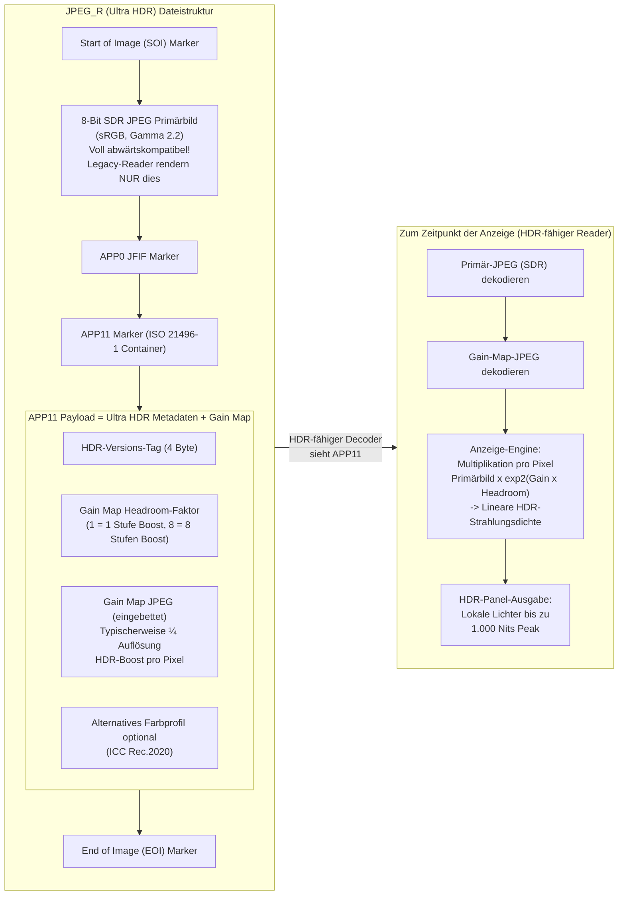

# Kapitel 21: HDR & Ultra HDR

Die Standard-Dynamic-Range-Fotografie (SDR) — 8 Bit pro Kanal, sRGB-kodiert mit einer Gamma-2.2-Kurve und für Displays mit 100 Nits gemastert — wurde für Röhrenmonitore der 1990er Jahre entwickelt. Moderne Smartphone-Sensoren erfassen einen **Dynamikumfang von 10–14 Blendenstufen** (Szenenkontrast von 1024:1 bis 16384:1), aber ein 8-Bit-SDR-JPEG kann nur etwa 6 Blendenstufen darstellen, bevor entweder die Lichter ausfressen oder die Schatten im Rauschen absaufen. **High Dynamic Range (HDR)** Formate lösen dies, indem sie die Strahlungsdichte der Szene mit 10+ Bit pro Kanal speichern, wahrnehmungsbezogen einheitliche oder szenenbezogene Transferfunktionen verwenden und Spitzenhelligkeiten der Displays von 1.000–10.000 Nits anstelle von 100 anvisieren.

Dieses Kapitel behandelt drei funktionierende HDR-Standards in Android Camera2:
- **HDR10** (10 Bit, ST.2084 PQ, Rec.2020, statische Metadaten) für Video
- **HLG (Hybrid Log-Gamma)** (10 Bit, SDR-abwärtskompatibel, ARIB STD-B67) für Rundfunk und Video
- **JPEG_R / Ultra HDR** (Android 14 API 34+, ISO 21496-1) — das revolutionäre Standbildformat, das eine sekundäre "Gain Map" in ein Standard-8-Bit-SDR-JPEG einbettet, sodass Legacy-Reader ein normales Foto sehen, während HDR-Displays die Lichter lokal um bis zu 8 Blendenstufen verstärken.

Alle drei sind in den Abschnitten *Ultra HDR / JPEG_R* und *Dynamic Range* des Forschungsdokuments zum Projekt dokumentiert. Dort wird auch die Android CDD (Compatibility Definition Document) Performance Class 15 spezifiziert, die vorschreibt, dass alle Flaggschiff-Geräte ab 2024 JPEG_R als Ausgabeformat bei maximaler Standbildgröße anbieten müssen. Sie können die Unterstützung für HDR10, HLG und JPEG_R pro Kamera-ID in der App [Android Camera Parameters](https://github.com/zoozooll/AndroidCameraParameters) aus dem [Play Store](https://play.google.com/store/apps/details?id=com.zoozooll.cameraparameters) überprüfen. Diese zählt jeden `DynamicRangeProfiles`-Schlüssel auf und meldet, ob `ImageFormat.JPEG_R` in `getOutputSizes()` erscheint.

## Grundlagen des Dynamikumfangs: Warum 8 Bit nicht ausreichen

Bevor wir in spezifische Formate eintauchen, definieren wir, was "Dynamikumfang" für Displays im Vergleich zur Erfassung bedeutet:

| Metrik | SDR (sRGB/BT.709) | HDR10 (BT.2100) | Menschliches Sehen |
|--------|-------------------|------------------|--------------|
| **Bittiefe** | 8 Bit / Kanal (256 Stufen) | 10 Bit / Kanal (1024 Stufen) | ~4,8 Bit wahrnehmungsbezogen, aber logarithmisch |
| **Spitzenluminanz** | 100 Nits (cd/m²) | 1.000+ Nits Peak (inhaltsabhängig) | ~20.000 Nits (Sonne+Himmel) bis ~0,001 Nits (dunkler Raum) |
| **Transferfunktion** | Gamma 2.2 oder sRGB stückweise | ST.2084 Perceptual Quantizer (PQ) | Logarithmische Antwort (Weber-Fechner-Gesetz) |
| **Farbraum** | sRGB / BT.709 (~35 % des sichtbaren) | Rec.2020 (~75 % des sichtbaren) | Gesamtes sichtbares Spektrum |
| **Kontrastverhältnis (nutzbar)** | ~6 Blendenstufen (64:1) | Mindestens ~10 Blendenstufen (1024:1) | ~14 Blendenstufen (16384:1) in einer einzigen Szene |

Die von SDR verwendete Gamma-Kurve wurde so entwickelt, dass sie der Nichtlinearität der Elektronenkanonen von Röhrenmonitoren der 1990er Jahre entspricht, nicht dem menschlichen Sehsystem. Die PQ-Kurve (Perceptual Quantizer), die von HDR10 verwendet wird, wurde 2014 von Dolby und der BBC unter ST.2084 standardisiert. Sie ist mathematisch an das Barten-Modell der menschlichen Kontrastempfindlichkeit angepasst – so repräsentiert jeder der 1.024 Codewerte in 10-Bit-PQ einen gerade noch wahrnehmbaren Unterschied (Just-Noticeable Difference, JND) in der Helligkeit über den gesamten Bereich von 0–10.000 Nits.

```mermaid
flowchart TD
    subgraph SDRpath["SDR 8-Bit Erfassung -> Display-Pipeline"]
        S1["Sensor Linear<br/>14-Bit RAW"] --> S2["Gamma 2.2 Kurve<br/>(Zerstört Schattendetails)"]
        S2 --> S3["8-Bit Quantisierung<br/>(Nur 22 Codes für<br/>0–10 % Luminanz)"]
        S3 --> S4["sRGB-Farbraum Clipping<br/>(25 % der Farben gehen verloren)"]
        S4 --> S5["Peak 100 Nits<br/>(Himmel/Sonne werden weiß)"]
    end

    subgraph HDRpath["HDR10 10-Bit Erfassung -> Display-Pipeline"]
        H1["Sensor Linear<br/>14-Bit RAW"] --> H2["ST.2084 PQ-Kurve<br/>(Entspricht JND-Modell)"]
        H2 --> H3["10-Bit Quantisierung<br/>(140 Codes für<br/>0–10 % Luminanz)"]
        H3 --> H4["Rec.2020 Farbraum<br/>(75 % der sichtbaren Farben)"]
        H4 --> H5["Peak 1000+ Nits<br/>(Himmel-Details bleiben erhalten)"]
    end

    style SDRpath fill:#ffeded,stroke:#b91c1c
    style HDRpath fill:#e8fff0,stroke:#15803d
```



Das obige Mermaid-Diagramm quantifiziert die zwei wichtigsten Unterschiede: SDR verwendet nur ca. 22 8-Bit-Codes für die unteren 10 % der Luminanz (was bei Aufhellung zu Streifenbildung in den Schatten führt), während PQ demselben Bereich 140 10-Bit-Codes zuweist. Die wahrnehmungsbezogene Einheitlichkeit der PQ-Kurve ist der Grund, warum 10-Bit-HDR flüssiger aussieht als 8-Bit-SDR, selbst wenn es auf einem SDR-Display auf 100 Nits heruntergesampelt wird.

## HDR10 Video: 10-Bit PQ + Rec.2020 + statische Metadaten

HDR10 ist das Basisformat für HDR-Videos — jedes Smartphone ab 2021 mit einem OLED-Display unterstützt die HDR10-Wiedergabe und jedes Snapdragon 865+ / Exynos 2100+ SoC unterstützt die HDR10-Aufnahme über Camera2. Das Format spezifiziert:

- **HEVC Main10 Profile** (H.265) Kodierung mit 10-Bit-Samples.
- **ST.2084 PQ** Transferfunktion anstelle von Gamma.
- **Rec.2020 (BT.2100)** Farbprimärvalenzen (Wide-Gamut).
- **Statische Metadaten** (SMPTE ST 2086 / CTA-861.3) in der HEVC SEI-Nachricht:
  - `max_content_light_level` (MaxCLL): Spitzenluminanz eines einzelnen Pixels in Nits.
  - `max_frame_average_light_level` (MaxFALL): Durchschnittliche Luminanz des hellsten Frames.
  - `display_primaries` und `white_point`: Farbumfang des Mastering-Displays.
  - `max_luminance` / `min_luminance`: Spitzenhelligkeit und Schwarzwert des Mastering-Displays.

Statische Metadaten bedeuten, dass genau ein Satz von Werten für die gesamte Videodauer gilt. Die Variante mit dynamischen Metadaten (HDR10+, Samsungs Alternative zu Dolby Vision) wird über Standard-Camera2 nicht offengelegt – sie erfordert Herstellererweiterungen –, aber statische HDR10-Metadaten werden universell über `DynamicRangeProfiles` unterstützt.

### Abfrage der HDR10- und HLG-Unterstützung über DynamicRangeProfiles

Android 13 (API 33) führte `CameraCharacteristics.REQUEST_AVAILABLE_DYNAMIC_RANGE_PROFILES` als strukturierte Alternative zur manuellen Prüfung der 10-Bit-Formatunterstützung in der `StreamConfigurationMap` ein. Jede Ausgabe-Surface hat ein Profil, das bei der Sitzungserstellung gewählt wird:

```kotlin
import android.hardware.camera2.CameraCharacteristics
import android.hardware.camera2.params.DynamicRangeProfiles
import android.util.Size

data class HdrVideoProfile(
    val profile: Long, // DynamicRangeProfiles.HDR10, HLG10, etc.
    val supportedSizes: List<Size>,
    val standardSizesFallbacks: List<Size>
)

fun enumerateHdrProfiles(
    characteristics: CameraCharacteristics
): List<HdrVideoProfile> {
    val profiles: DynamicRangeProfiles? =
        characteristics.get(
            CameraCharacteristics.REQUEST_AVAILABLE_DYNAMIC_RANGE_PROFILES
        ) ?: return emptyList()

    val configMap = characteristics.get(
        CameraCharacteristics.SCALER_STREAM_CONFIGURATION_MAP
    ) ?: return emptyList()

    return listOf(
        DynamicRangeProfiles.HDR10,
        DynamicRangeProfiles.HLG,
        DynamicRangeProfiles.HDR10_PLUS, // Auf Nicht-Samsung-Geräten oft null
        DynamicRangeProfiles.DOLBY_VISION_10B_HDR_OEM // Erfordert Dolby-Lizenz
    ).mapNotNull { profile ->
        if (!profiles.isProfileSupported(profile)) return@mapNotNull null

        val hdrSizes = profiles.getProfileSupportedSizes(profile)
            ?.toList() ?: emptyList()
        val sdrFallbackSizes = configMap.getOutputSizes(
            android.graphics.ImageFormat.PRIVATE
        )?.toList() ?: emptyList()

        HdrVideoProfile(profile, hdrSizes, sdrFallbackSizes)
    }
}
```

Die Methode `DynamicRangeProfiles.getProfileSupportedSizes(profile)` gibt die *Schnittmenge* aus 10-Bit-fähigen Größen und der Unterstützung durch die ISP-HDR-Pipeline zurück. Wenn `Size(3840, 2160)` (4K UHD) nicht in `getProfileSupportedSizes(HDR10)` erscheint, dann reicht der ISP-Durchsatz des HAL trotz Unterstützung von 4K SDR nicht für eine 4K HDR10-Kodierung aus (normalerweise ein Limit von 600 Megapixeln/Sek. bei der Snapdragon 8-Serie). Die App Android Camera Parameters stellt diese Schnittmengentabelle in der Registerkarte "HDR" dar, damit Sie sie vor dem Schreiben des Sitzungscodes verifizieren können.

### Einstellen von HDR10 in der OutputConfiguration für die Aufnahme

Das Dynamikumfangprofil muss **vor der Erstellung der Sitzung** über `OutputConfiguration.setDynamicRangeProfile()` festgelegt werden. Ein Ändern des Profils mitten in der Sitzung erfordert den Abbau und die Neuerstellung der Sitzung.

```kotlin
import android.hardware.camera2.params.DynamicRangeProfiles
import android.hardware.camera2.params.OutputConfiguration
import android.media.MediaCodec
import android.media.MediaCodecInfo
import android.view.Surface

fun createHdr10VideoOutput(
    encoderSurface: Surface,
    previewSurface: Surface
): Pair<OutputConfiguration, OutputConfiguration> {
    val encodeOutConfig = OutputConfiguration(encoderSurface).apply {
        setDynamicRangeProfile(DynamicRangeProfiles.HDR10)
    }
    val previewOutConfig = OutputConfiguration(previewSurface).apply {
        setDynamicRangeProfile(DynamicRangeProfiles.HDR10)
    }
    return Pair(encodeOutConfig, previewOutConfig)
}

fun configureHdr10MediaCodec(width: Int, height: Int): MediaCodec {
    val codec = MediaCodec.createEncoderByType("video/hevc")
    val format = android.media.MediaFormat.createVideoFormat(
        "video/hevc", width, height
    ).apply {
        setInteger(MediaFormat.KEY_COLOR_FORMAT,
            MediaCodecInfo.CodecCapabilities.COLOR_FormatSurface)
        setInteger(MediaFormat.KEY_BIT_RATE, 80_000_000) // 80 Mbps für 4K HDR10
        setInteger(MediaFormat.KEY_FRAME_RATE, 30)
        setInteger(MediaFormat.KEY_I_FRAME_INTERVAL, 1)
        setInteger(MediaFormat.KEY_PROFILE,
            MediaCodecInfo.CodecProfileLevel.HEVCProfileMain10)
        setInteger(MediaFormat.KEY_COLOR_STANDARD,
            MediaFormat.COLOR_STANDARD_BT2020)
        setInteger(MediaFormat.KEY_COLOR_TRANSFER,
            MediaFormat.COLOR_TRANSFER_ST2084) // ST.2084 PQ
        setInteger(MediaFormat.KEY_COLOR_RANGE,
            MediaFormat.COLOR_RANGE_LIMITED)
        setFeatureEnabled(MediaCodecInfo.CodecCapabilities.FEATURE_HdrEditing, true)
    }
    codec.configure(format, null, null, MediaCodec.CONFIGURE_FLAG_ENCODE)
    return codec
}
```

Die drei `COLOR_*`-Schlüssel (`BT2020`, `ST2084`, `LIMITED`) erzeugen in Kombination mit `HEVCProfileMain10` einen bitgenauen HDR10-Stream. Wenn Sie `KEY_COLOR_TRANSFER` weglassen oder auf den falschen Wert setzen (z. B. `COLOR_TRANSFER_GAMMA_2_2`), werden YouTube und andere Player den 10-Bit-Stream als SDR interpretieren und ihn flau oder übersättigt wiedergeben.

## HLG (Hybrid Log-Gamma): SDR-abwärtskompatibles Rundfunk-HDR

HLG (2015 von der BBC und NHK als ARIB STD-B67 standardisiert) wurde für Live-Fernsehen entwickelt, bei dem man nicht im Voraus wissen kann, ob der Zuschauer ein HDR- oder SDR-Display besitzt. Die Innovation von HLG ist eine **stückweise hybride Transferfunktion**:
- Die unteren 50 % des Codebereichs sind eine Standard-Gammakurve (entspricht exakt SDR).
- Die oberen 50 % sind eine logarithmische Kurve (speichert HDR-Lichter-Details).

Dies bedeutet, dass ein HLG-Video auf einem SDR-Display identisch mit einem korrekt abgestimmten SDR-Gamma-2.2-Video aussieht, während ein HDR-Display die logarithmische obere Hälfte "freischaltet" und Lichter mit bis zu 1.000 Nits ohne jegliche Metadaten-Signalisierung wiedergibt. Es ist kein explizites SDR→HDR-Tonwertmapping erforderlich.

Für die Videonutzung unterscheidet sich HLG von HDR10 in drei für Camera2 relevanten Punkten:
1. **Keine statischen Metadaten erforderlich** — HLG ist szenenbezogen, daher leitet das Display die Spitzenhelligkeit aus dem Signal selbst ab. Dies vereinfacht die MediaCodec-Konfiguration (keine SEI-Einfügung für MaxCLL/MaxFALL).
2. **Andere Konstante für Color-Transfer** — verwenden Sie `MediaFormat.COLOR_TRANSFER_HLG` anstelle von `ST2084`.
3. **Prüfung auf `DynamicRangeProfiles.HLG`** anstelle von `HDR10`.

Die gesamte restliche API-Nutzung (OutputConfiguration.setDynamicRangeProfile, Sitzungserstellung, CaptureRequest) ist identisch mit HDR10. Das Forschungsdokument stellt fest, dass HLG das bevorzugte Format für benutzergenerierte Videos ist, die auf sozialen Plattformen geteilt werden, da es sowohl auf SDR- als auch auf HDR-Displays ohne Tonwertmapping-Artefakte korrekt gerendert wird.

## JPEG_R (Ultra HDR): ISO 21496-1 SDR + eingebettete Gain-Map

Der größte Fortschritt in der mobilen HDR-Fotografie seit der Multi-Frame-HDR-Erfassung ist **JPEG_R**, das in Android 14 (API 34) eingeführt und als internationaler Standard **ISO 21496-1** kodiert wurde. Das Format ist konstruktionsbedingt abwärtskompatibel:

> Eine JPEG_R-Datei ist ein Standard-8-Bit-SDR-JPEG mit einem **sekundären, kleineren JPEG (der "Gain Map")**, das im `APP11`-Markersegment unter Verwendung des ISO 21496-1-Containerformats eingebettet ist. Legacy-JPEG-Decoder ignorieren nicht erkannte APP-Marker und rendern nur das 8-Bit-Primärbild. HDR-fähige Decoder lesen sowohl das Primärbild als auch die Gain-Map und rekonstruieren die ursprüngliche lineare HDR-Strahlungsdichte der Szene, indem sie die Pixelwerte des Primärbilds pro Pixel mit exp2(Gain_Map_Pixel × Headroom_Faktor) multiplizieren.

Dieser "Per-Pixel-Boost" ist das, was Ultra HDR *lokal* zu HDR macht (im Gegensatz zu statischen HDR10-Metadaten, die einen Spitzenwert global anwenden). Eine ISO 21496-1 Gain-Map bei ¼ Auflösung (typisch) kann bis zu **8 Blendenstufen lokalen Spielraum in den Lichtern** kodieren — genug, um Wolkendetails in einem Sonnenuntergang wiederherzustellen, während die Mitteltöne bei einer natürlichen SDR-Luminanz bleiben.

Die Android CDD Performance Class 15 schreibt vor:
- Alle Geräte, die CDD PC-15 bewerben (Flaggschiffe ab 2024 gemäß der CDD-Spezifikationstabelle), **MÜSSEN** die Ausgabe im Format `ImageFormat.JPEG_R` bei maximaler Standbildgröße unterstützen.
- Die maximale Standbildgröße für JPEG_R muss ≥ der maximalen YUV-Größe für diese Kamera-ID sein.

Der Abschnitt *Ultra HDR / JPEG_R* des Forschungsdokuments enthält eine vollständige Aufschlüsselung des Layouts des APP11-Markers auf Byte-Ebene. Für die Camera2 API müssen Sie `ImageFormat.JPEG_R` jedoch nur als einen einzigen opaken Ausgabepuffer behandeln — der HAL setzt das Primärbild + die Gain-Map intern zusammen.



Das entscheidende Detail im Mermaid-Diagramm: Das PRIMÄR-JPEG ist ein voll gültiges 8-Bit-SDR-Foto, sodass selbst eine JPEG-Bibliothek aus den 2010er Jahren ein korrekt aussehendes Bild rendern kann. Die HDR-Daten sind *additiv* und ersetzen nicht die Primärdatei — deshalb funktionieren JPEG_R-Dateien nahtlos mit jeder bestehenden Foto-Plattform (Instagram, Google Fotos, Messages), die noch keine Ultra HDR-Decoder besitzt.

### Abfrage der JPEG_R-Unterstützung und Aufnahme von Ultra HDR-Standbildern

Die Aufnahme von Ultra HDR-Standbildern ist funktional identisch mit der Aufnahme eines Standard-JPEGs, mit zwei Unterschieden:
1. Fragen Sie `ImageFormat.JPEG_R` in `StreamConfigurationMap.getOutputSizes()` anstelle von `ImageFormat.JPEG` ab.
2. Wenn Sie `DynamicRangeProfiles` verwenden (empfohlen), setzen Sie das Profil des JPEG_R-Ausgangs auf `DynamicRangeProfiles.JPEG_R`.

```kotlin
import android.graphics.ImageFormat
import android.hardware.camera2.CameraCharacteristics
import android.hardware.camera2.CameraDevice
import android.hardware.camera2.CaptureRequest
import android.hardware.camera2.params.DynamicRangeProfiles
import android.hardware.camera2.params.OutputConfiguration
import android.media.ImageReader
import android.util.Size

var jpegRImageReader: ImageReader? = null

fun queryJpegRSupport(
    characteristics: CameraCharacteristics
): Pair<Boolean, Size?> {
    val caps = characteristics.get(
        CameraCharacteristics.REQUEST_AVAILABLE_CAPABILITIES
    ) ?: intArrayOf()
    val supportsDynamicRange = caps.contains(
        CameraCharacteristics.REQUEST_AVAILABLE_CAPABILITIES_DYNAMIC_RANGE_TEN_BIT
    )
    val drProfiles = characteristics.get(
        CameraCharacteristics.REQUEST_AVAILABLE_DYNAMIC_RANGE_PROFILES
    )
    val supportsJpegRProfile =
        drProfiles?.isProfileSupported(DynamicRangeProfiles.JPEG_R) == true

    val configMap = characteristics.get(
        CameraCharacteristics.SCALER_STREAM_CONFIGURATION_MAP
    ) ?: return Pair(false, null)

    val jpegRSizes = configMap.getOutputSizes(ImageFormat.JPEG_R)
        ?: emptyArray()
    val maxJpegR = jpegRSizes.maxByOrNull { it.width * it.height }

    return Pair(
        supportsDynamicRange && supportsJpegRProfile && jpegRSizes.isNotEmpty(),
        maxJpegR
    )
}

fun setupJpegRCapture(
    cameraDevice: CameraDevice,
    maxJpegRSize: Size,
    previewSurface: Surface
) {
    jpegRImageReader = ImageReader.newInstance(
        maxJpegRSize.width, maxJpegRSize.height,
        ImageFormat.JPEG_R, 2
    )

    val jpegROutput = OutputConfiguration(
        jpegRImageReader!!.surface
    ).apply {
        setDynamicRangeProfile(DynamicRangeProfiles.JPEG_R)
    }
    val previewOutput = OutputConfiguration(previewSurface)

    val outputs = listOf(previewOutput, jpegROutput)
    val sessionConfig = android.hardware.camera2.params.SessionConfiguration(
        android.hardware.camera2.params.SessionConfiguration.SESSION_REGULAR,
        outputs,
        { r -> backgroundHandler.post(r) },
        object : android.hardware.camera2.CameraCaptureSession.StateCallback() {
            override fun onConfigured(
                session: android.hardware.camera2.CameraCaptureSession
            ) {
                val stillBuilder = cameraDevice.createCaptureRequest(
                    CameraDevice.TEMPLATE_STILL_CAPTURE
                ).apply {
                    addTarget(previewSurface)
                    addTarget(jpegRImageReader!!.surface)
                    set(CaptureRequest.CONTROL_MODE,
                        CaptureRequest.CONTROL_MODE_USE_SCENE_MODE)
                    set(CaptureRequest.CONTROL_SCENE_MODE,
                        CaptureRequest.CONTROL_SCENE_MODE_HDR)
                    // Multi-Frame-HDR-Fusion des HAL vor der JPEG_R-Kodierung auslösen
                }

                session.capture(stillBuilder.build(),
                    JpegRCaptureCallback(), backgroundHandler)
            }
            override fun onConfigureFailed(
                s: android.hardware.camera2.CameraCaptureSession
            ) = Log.e(TAG, "JPEG_R-Sitzung fehlgeschlagen")
        }
    )
    cameraDevice.createCaptureSession(sessionConfig)
}
```

Das Einstellen von `CONTROL_SCENE_MODE_HDR` zusammen mit `TEMPLATE_STILL_CAPTURE` löst die Multi-Frame-HDR-Bracketing- und Fusions-Pipeline des HAL aus — typischerweise 3 Frames bei -2 / 0 / +2 EV, die ausgerichtet und zusammengeführt werden, bevor sie für die ISO 21496-1-Kodierung in das SDR-Primärbild + die 8-Stufen-Gain-Map aufgeteilt werden. Das Weglassen des Szenenmodus erzeugt immer noch eine gültige JPEG_R-Datei, aber der Spielraum der Gain-Map ist dann auf den nativen Dynamikumfang des Sensors (~10 Blendenstufen) begrenzt, anstatt des Dynamikumfangs der computergestützten Fusion (~14–16 Blendenstufen).

### Empfangen und Speichern des JPEG_R-Bildes

Der `OnImageAvailableListener` für JPEG_R ist bytegenau identisch mit einem JPEG-Listener — der HAL hat bereits das Primärbild + die APP11-Gain-Map zu einem einzigen Puffer zusammengefügt:

```kotlin
import java.io.File
import java.io.FileOutputStream

inner class JpegRCaptureCallback : ImageReader.OnImageAvailableListener {
    override fun onImageAvailable(reader: ImageReader) {
        reader.acquireLatestImage()?.use { image ->
            val buffer = image.planes[0].buffer
            val jpegRBytes = ByteArray(buffer.remaining())
            buffer.get(jpegRBytes)

            val outFile = File(getExternalFilesDir(null),
                "ULTRA_HDR_${System.currentTimeMillis()}.jpg")
            FileOutputStream(outFile).use { it.write(jpegRBytes) }
        }
    }
}
```

Das Speichern als `.jpg` (keine benutzerdefinierte Erweiterung) ist entscheidend für die Kompatibilität — Legacy-Foto-Viewer schauen auf die Dateierweiterung, bevor sie den Dateiinhalt prüfen, und eine `.jpg`-Erweiterung garantiert, dass sie versuchen werden, das Standard-SDR-Primärbild zu dekodieren, noch bevor sie den APP11-Marker überhaupt bemerken.

## Zusammenfassender Vergleich der HDR-Formate

| Kriterium | HDR10 (Video) | HLG (Video) | JPEG_R / Ultra HDR (Standbild) |
|-----------|---------------|-------------|-----------------------------|
| **Bittiefe** | 10-Bit HEVC Main10 | 10-Bit HEVC Main10 | 8-Bit Primär + 8-Bit Gain-Map → netto ~12 Bit Äquivalent |
| **Peak Nits (Inhalt)** | 1.000–10.000 (statische Metadaten) | Typisch 1.000 Nits (szenenbezogen) | ~2.000 Nits (8 Stufen × 8-Bit Spielraum gemäß ISO 21496-1) |
| **Abwärtskompatibel** | Nein — SDR-Wiedergabe sieht ohne Tonwertmapping flau aus | **Ja** — SDR-Displays rendern die Gamma-Hälfte perfekt | **Ja** — Legacy-Reader rendern nur das 8-Bit-SDR-Primärbild |
| **Typ des Dynamikumfangs** | Global (statische Metadaten pro Video) | Global (szenenbezogen, keine Metadaten) | **Lokal (Gain-Map pro Pixel)** — kann Wolken verstärken, ohne die Haut auszuwaschen |
| **Einstiegspunkte Camera2 API** | `DynamicRangeProfiles.HDR10` + `MediaFormat.COLOR_TRANSFER_ST2084` | `DynamicRangeProfiles.HLG` + `MediaFormat.COLOR_TRANSFER_HLG` | `ImageFormat.JPEG_R` + `DynamicRangeProfiles.JPEG_R` |
| **Android-Version** | API 33+ (DynamicRangeProfiles) | API 33+ | API 34+ (Android 14), CDD PC-15 Mandat |
| **Anwendungsfall** | Kinoreife HDR-Videos für YouTube/Netflix | Live-Rundfunk, Social-Video UGC | HDR-Fotografie, abwärtskompatibel mit jeder Foto-Plattform weltweit |

## Zusammenfassung

Dieses Kapitel behandelte die drei funktionierenden HDR-Technologien, die in Android Camera2 verfügbar sind:

- **Grundlagen des Dynamikumfangs**: Das 8-Bit-Gamma von SDR und der Spitzenwert von 100 Nits können die 14 Blendenstufen moderner Sensoren nicht darstellen. PQ (HDR10) und HLG verwenden wahrnehmungsoptimierte 10-Bit-Kurven, um den vollen Dynamikumfang des Sensors abzubilden.
- **HDR10-Video** verwendet `DynamicRangeProfiles.HDR10` in der OutputConfiguration, HEVC Main10 Kodierung mit `COLOR_TRANSFER_ST2084` (PQ), `COLOR_STANDARD_BT2020` Primärvalenzen und statische Metadaten nach SMPTE ST 2086.
- **HLG-Video** verwendet `DynamicRangeProfiles.HLG`, `COLOR_TRANSFER_HLG` und keine statischen Metadaten. Es ist bauartbedingt SDR-abwärtskompatibel und somit ideal für den Rundfunk und benutzergenerierte Videos.
- **JPEG_R / Ultra HDR** (API 34+, ISO 21496-1, CDD PC-15 Mandat) bettet eine Gain-Map pro Pixel in den APP11-Marker eines Standard-8-Bit-SDR-JPEGs ein. Legacy-Decoder rendern das Primärbild; HDR-Decoder wenden die Gain-Map an, um bis zu 8 Blendenstufen lokalen Spielraum in den Lichtern zu erhalten.
- Die zwei Mermaid-Diagramme (SDR- vs. HDR-Pipelines, JPEG_R-Dateistruktur) visualisieren die Pfade der Kodierung und des Renderings.

## Wie geht es weiter?

In **Kapitel 22: Kamera-Erweiterungen** verlassen wir die Standard-`CameraCaptureSession` und tauchen über die `CameraExtensionSession` in die Welt der OEM-beschleunigten computergestützten Fotografie ein. Sie lernen, wie Sie `CameraExtensionCharacteristics.getSupportedExtensions()` für Nachtaufnahmen (Multi-Frame-Zusammenführung bei Langzeitbelichtung), Bokeh (Tiefen-basierte Hintergrundunschärfe / Porträtmodus), HDR (Multi-Exposure-Fusion), Gesichtsretusche (KI-Hautglättung) und Automatik (vom HAL gewählte Erweiterung) abfragen. Das Kapitel enthält ein vollständiges Beispiel für eine Porträtaufnahme unter Verwendung von `EXTENSION_BOKEH`, erklärt `getEstimatedCaptureLatencyRangeMillis()` für Fortschrittsanzeigen in der UI und verwendet ein Mermaid-Diagramm, um die Standard-Sitzungspipeline der Extension-Sitzungspipeline gegenüberzustellen, die KI- und Fusionsaufgaben auf den DSP des Herstellers auslagert.

Überprüfen Sie in der [App Android Camera Parameters](https://play.google.com/store/apps/details?id=com.zoozooll.cameraparameters), welche Kamera-Erweiterungen Ihr Gerät pro Kamera-ID unterstützt — die Registerkarte "Extensions" zählt jede `Extension`-Konstante und ihre unterstützten Aufnahmegrößen auf. Neue Geräteberichte, die an das [GitHub-Projekt](https://github.com/zoozooll/AndroidCameraParameters) übermittelt werden, helfen beim Aufbau einer öffentlichen Datenbank für die Unterstützung von OEM-Erweiterungen.
