# Kapitel 19: High-Speed-Video

High-Speed-Videos fangen Momente ein, die das menschliche Auge nicht auflösen kann: Wassertropfen, die sich mit 120 fps (4-fache Zeitlupe) von einem Wasserhahn lösen, die Flügelschläge eines Kolibris mit 240 fps (8-fache Zeitlupe) oder ein platzender Ballon mit 960 fps (32-fache Zeitlupe bei einigen Samsung-Flaggschiffen). Die Implementierung von Aufnahmen mit hohen Bildraten in Android Camera2 besteht nicht einfach darin, `SENSOR_FRAME_DURATION` auf einen kleinen Wert zu setzen – Sie müssen einen speziellen Sitzungstyp namens **`CameraConstrainedHighSpeedCaptureSession`** verwenden, vorvalidierte Frame-Bursts über **`createHighSpeedRequestList`** übermitteln und Ihre Ausgabegrößen/-auflösungen auf eine gerätespezifische Liste von "High-Speed-zugelassenen" Konfigurationen beschränken, die von **`SCALER_STREAM_CONFIGURATION_MAP.getHighSpeedVideoSizes`** zurückgegeben werden.

Dieses Kapitel stützt sich direkt auf den Abschnitt *High-Speed Sessions* des Forschungsdokuments zum Projekt, der die CPU-Kosten für das Senden von 240 einzelnen CaptureRequests pro Sekunde vergleicht (kritisch – bis zu 70 % CPU-Auslastung auf einem Snapdragon 8 Gen 2, gegenüber < 5 % mit der eingeschränkten Burst-Liste) und die genauen Einschränkungen aufzählt, die der HAL für die Anzahl der Ausgaben, FPS-Bereiche und Vorlagentypen erzwingt. Sie können in der App [Android Camera Parameters](https://github.com/zoozooll/AndroidCameraParameters) (auch im [Google Play Store](https://play.google.com/store/apps/details?id=com.zoozooll.cameraparameters) verfügbar) nachsehen, welche FPS-Bereiche Ihr Gerät für jede Kamera-ID unterstützt. Diese zeigt die rohen Ausgaben von `getHighSpeedVideoSizes()` und `getHighSpeedVideoFpsRangesFor()` in ihrem Panel für Stream-Konfigurationen an.

## Warum Standard-Sitzungen bei 240 fps nicht funktionieren

Bevor wir in die dedizierte High-Speed-API eintauchen, sollten Sie verstehen, was Aufnahmen mit 240 fps grundlegend von Aufnahmen mit 30 fps unterscheidet:

- **Durchsatz**: Ein 1080p-Frame in 8-Bit YUV_420_888 ist ca. 3,0 MB groß. Bei 240 fps fließen **720 MB/s** an Pixeldaten durch den Speicher – das 8-fache der Last bei 30 fps und genug, um eine MIPI D-PHY v1.2-Verbindung bei voller Bandbreite zu sättigen.
- **Latenzbudget**: Ein einzelnes Frame-Intervall bei 240 fps beträgt **4,167 ms**. Wenn der Android-Kameradienst mehr als 2 ms allein mit dem Marshalling eines CaptureRequest-Parcels vom Userspace zum HAL verbringt, haben Sie bereits 50 % Ihres Budgets verbraucht, bevor der Sensor überhaupt mit der Belichtung beginnt.
- **Jitter-Toleranz**: Einzelne Aufrufe von `capture()` / `setRepeatingRequest()` durchlaufen die Framework → CameraService → HAL-Brücke über Binder-IPC, was unter Last einen Jitter von ±1 ms verursacht. Bei 240 fps führt selbst ein Jitter von ±1 ms zu sichtbaren Inkonsistenzen bei der Frame-Dauer und zu Abweichungen in der A/V-Synchronisation.
- **CPU-Overhead**: Jeder `CaptureRequest` erfordert Objektkonstruktion, Parcel-Marshalling, Binder-Transaktionen und HAL-seitige Validierung. Die Durchführung dieser Schritte 240 Mal pro Sekunde im Userspace wurde vom Forschungsteam mit einer **dauerhaften CPU-Auslastung von 68–74 % auf einem Snapdragon 8 Gen 2** (Cortex-X3 + A715) gemessen. Dies würde die Flüssigkeit der Vorschau beeinträchtigen, den Akku in 20 Minuten leeren und den Thermal-HAL zum Absturz bringen, lange bevor Sie einen brauchbaren Clip aufgenommen haben.

Die **Constrained High-Speed Capture Session** löst all diese Probleme, indem sie N einzelne CaptureRequests zu **einer vorvalidierten Burst-Liste zusammenfasst, die der HAL-Hardware-Scheduler direkt verarbeitet**, wodurch der Binder-Overhead pro Frame komplett umgangen wird.

```mermaid
flowchart TD
    subgraph Standard["Standard-CaptureSession (30/60 fps)"]
        S1["App erstellt CaptureRequest<br/>pro Frame über Builder"] --> S2["Binder-IPC zum CameraService<br/>(1 Aufruf pro Frame)"]
        S2 --> S3["CameraService validiert +<br/>leitet an HAL weiter"]
        S3 --> S4["HAL plant Frame<br/>in Sensor-ISP-Pipeline"]
        S4 --> S5["Frame-Ausgabe<br/>→ Surface / MediaCodec"]
    end

    subgraph HighSpeed["CameraConstrainedHighSpeedCaptureSession (120/240 fps)"]
        H1["App ruft createHighSpeedRequestList()<br/>EINMAL auf — erstellt Burst-Liste"] --> H2["HAL vorvalidiert ALLE Frames<br/>in Burst-Liste (Timings, Größen, FPS)"]
        H2 --> H3["Burst-Liste wird in<br/>HAL-Hardware-Scheduler geladen"]
        H3 --> H4["Scheduler steuert Sensor + ISP<br/>direkt — kein Binder pro Frame"]
        H4 --> H5["240 Frames/s Ausgabe<br/>→ MediaCodec-Video-Encoder"]
    end
```



Das Diagramm verdeutlicht den architektonischen Unterschied: Der Standardpfad weist für jeden Frame einen Binder-IPC-Wasserfall auf, während der High-Speed-Pfad den Zeitplan einmal erstellt und validiert und dann den dedizierten Hardware-Sequenzer des HAL die Frames ununterbrochen liefern lässt.

## Unterstützte FPS-Bereiche und Zeitlupenfaktoren

Die Android Camera2 API bietet keine "Zeitlupe" als Funktion an – sie stellt **`FpsRange`**-Paare `[min, max]` bereit, bei denen min == max für Aufnahmen mit fester FPS gilt. Der Zeitlupen-Wiedergabefaktor wird abgeleitet, indem die Aufnahme-FPS durch die Wiedergabe-FPS geteilt wird (die bei Videos für Endverbraucher fast immer 30 fps beträgt):

| Aufnahme-FPS | Feste `FpsRange` | Wiedergabe bei 30 fps → Zeitlupenfaktor | Typische Mindestauflösung | Typische Geräteklasse |
|-------------|------------------|----------------------------------------|----------------------------|---------------------|
| 120 | `[120, 120]` | 120 ÷ 30 = **4× langsamer** | 1280×720 (720p) | Mittelklasse und höher |
| 240 | `[240, 240]` | 240 ÷ 30 = **8× langsamer** | 1280×720 oder 1920×1080 | Flaggschiff (Snapdragon 8-Serie, Exynos 2xxx) |
| 480 | `[480, 480]` | 480 ÷ 30 = **16× langsamer** | 720p (meist beschnitten) | Gaming-Handys (Black Shark, ROG Phone, RedMagic) |
| 960 | `[960, 960]` | 960 ÷ 30 = **32× langsamer** | 720p (DRAM-gepuffert, kurze Bursts < 0,5 s) | Samsung Galaxy S/Ultra, Sony Xperia 1-Serie |

Wichtig ist, dass **Modi mit 960 fps und 480 fps in der Regel "Super-Zeitlupen"-Modi sind, die eine DRAM-Pufferung auf dem Sensor erfordern** und nur ca. 0,33–0,5 Sekunden Material aufnehmen, bevor der Puffer voll ist. Diese Modi werden NICHT über `CameraConstrainedHighSpeedCaptureSession` bereitgestellt (die Standard-Sitzung kann hier nicht mithalten), sondern stattdessen über herstellerspezifische Erweiterungen oder über den CameraX ExtensionsManager auf von OEMs zugelassenen Geräten gehandhabt. Dieses Kapitel konzentriert sich auf 120 fps und 240 fps, die beiden Bereiche, die die standardmäßige eingeschränkte High-Speed-API von Camera2 universell unterstützt.

## Abfragen von High-Speed-Größen und FPS-Bereichen

Der korrekte Weg zur Aufzählung unterstützter High-Speed-Konfigurationen ist **NICHT** `getOutputSizes()` – reguläre Ausgabegrößen beinhalten oft 1080p, aber der HAL könnte 1080p bei 240 fps aufgrund von MIPI-Bandbreitenbeschränkungen verweigern. Sie müssen zwei dedizierte Methoden der `StreamConfigurationMap` aufrufen:

```kotlin
import android.hardware.camera2.CameraCharacteristics
import android.hardware.camera2.params.StreamConfigurationMap
import android.util.Range
import android.util.Size

data class HighSpeedProfile(
    val size: Size,
    val fpsRanges: List<Range<Int>>
)

fun queryHighSpeedProfiles(
    characteristics: CameraCharacteristics
): List<HighSpeedProfile> {
    val configMap: StreamConfigurationMap? =
        characteristics.get(CameraCharacteristics.SCALER_STREAM_CONFIGURATION_MAP)
            ?: return emptyList()

    val highSpeedSizes: Array<Size> =
        configMap.highSpeedVideoSizes ?: return emptyList()

    return highSpeedSizes.map { size ->
        val fpsRangesForSize =
            configMap.getHighSpeedVideoFpsRangesFor(size)?.toList()
                ?: emptyList()
        HighSpeedProfile(size, fpsRangesForSize)
    }
}
```

Die Eigenschaft `highSpeedVideoSizes` ist die maßgebliche Liste. Wenn eine 1080p-Größe hier nicht aufgeführt ist, wird der Versuch, eine eingeschränkte High-Speed-Sitzung in 1080p zu erstellen, eine `IllegalArgumentException` auslösen, selbst wenn `getOutputSizes(PRAGMA)` sie auflistet. Das Forschungsdokument stellt fest, dass Flaggschiffe der Jahre 2021–2024 universell `Size(1920, 1080)` mit sowohl `[120,120]` als auch `[240,240]` unterstützen, während Mittelklasse-Geräte nur `Size(1280, 720)` mit `[120,120]` unterstützen.

Die App Android Camera Parameters stellt die exakte Ausgabe von `highSpeedVideoSizes` und `getHighSpeedVideoFpsRangesFor()` in der Registerkarte Stream Config → High-Speed dar, sodass Sie die Ausgabe Ihres Codes mit einem bewährten Enumerator abgleichen können.

## Vom HAL erzwungene Einschränkungen

Der Abschnitt *High-Speed Sessions* des Forschungsdokuments zum Projekt listet die genauen Ein- und Ausgangsbeschränkungen auf, die `createCaptureSession` validiert, bevor eine `CameraConstrainedHighSpeedCaptureSession` erstellt wird. Verstoßen Sie gegen eine dieser Einschränkungen, erhalten Sie einen `onConfigureFailed()`-Callback ohne weitere Erklärung:

| Einschränkungs-ID | Anforderung |
|---------------|-------------|
| **HS-1** | Die Anzahl der Ausgabe-Surfaces muss ≤ 2 sein. Typische Kombination: `MediaCodec Input Surface` + `SurfaceView Vorschau`. Das Hinzufügen einer dritten Surface (z. B. `ImageReader` für Standbilder) ist NICHT erlaubt. |
| **HS-2** | Alle Ausgabe-Surfaces MÜSSEN Größen haben, die in `highSpeedVideoSizes` aufgeführt sind (gleiche Größe für beide Surfaces oder eine Größe aus der Liste pro Surface). |
| **HS-3** | Der FPS-Bereich in jedem CaptureRequest im Burst MUSS aus `getHighSpeedVideoFpsRangesFor(size)` für die gewählte Größe stammen. Adaptive FPS `[30,120]` ist NICHT erlaubt – Minimum muss für eine feste FPS gleich dem Maximum sein. |
| **HS-4** | Es sind nur die Vorlagen `TEMPLATE_RECORD` und `TEMPLATE_PREVIEW` erlaubt. `TEMPLATE_STILL_CAPTURE`, `TEMPLATE_MANUAL` und `TEMPLATE_VIDEO_SNAPSHOT` werden von `createHighSpeedRequestList` abgelehnt. |
| **HS-5** | Die Burst-Länge von `createHighSpeedRequestList()` muss ≥ 2 Frames sein. Der HAL-Scheduler benötigt mindestens ein vollständiges Frame-Intervall, um das Timing vorab zu laden. |
| **HS-6** | Das Ausgabeformat ist auf `PRIVATE` (SurfaceView / MediaCodec Surface) oder `YUV_420_888` (ImageReader für die Verarbeitung auf dem Gerät) beschränkt. `JPEG`, `RAW_SENSOR` und `HEIC` sind nicht zulässig. |
| **HS-7** | `CONTROL_AE_TARGET_FPS_RANGE` ist auf den FPS-Wert des Bursts fixiert, sobald die Sitzung aktiv ist. Der Versuch, ihn in einem späteren Burst zu ändern, führt dazu, dass dieser Burst stillschweigend verworfen wird. |

Die Einschränkung **HS-1** wird in der Praxis am häufigsten verletzt – Entwickler versuchen, einen ImageReader für die YUV-Analyse pro Frame parallel zur MediaCodec-Kodierung anzuhängen, und der HAL verweigert stillschweigend die Konfiguration. Wenn Sie gleichzeitige Vorschau + Kodierung + Verarbeitung pro Frame bei 240 fps benötigen, verwenden Sie die MediaCodec-Ausgabe-Surface **und** lesen Sie YUV-Frames aus dem Ausgabe-ByteBuffer des Encoders über `MediaCodec.dequeueOutputBuffer()` mit `BUFFER_FLAG_KEY_FRAME`-Filterung aus – hängen Sie niemals zwei unabhängige YUV-Ausgaben an.

## Einrichten der eingeschränkten High-Speed-Sitzung und Aufnahme

### Schritt 1: Erstellen des MediaRecorders / MediaCodec-Encoders

Der Einfachheit halber verwendet der folgende Code den `MediaRecorder` (der das Audio-Muxing intern übernimmt). Für die HEVC-Kodierung oder Low-Latency-Streaming würden Sie `MediaCodec.createEncoderByType("video/hevc")` direkt verwenden, aber die Surface, die beide speist, ist identisch.

```kotlin
import android.hardware.camera2.CameraDevice
import android.hardware.camera2.CameraConstrainedHighSpeedCaptureSession
import android.hardware.camera2.CaptureRequest
import android.media.MediaRecorder
import android.util.Size
import android.view.SurfaceView
import java.io.File

lateinit var cameraDevice: CameraDevice
lateinit var mediaRecorder: MediaRecorder
lateinit var recordingSurface: Surface
lateinit var previewSurface: Surface
var chosenHighSpeedSize: Size = Size(1920, 1080)
var chosenFpsRange: Range<Int> = Range(240, 240)

fun setupMediaRecorder(outputFile: File,
                       size: Size,
                       fps: Int) {
    mediaRecorder = MediaRecorder().apply {
        setAudioSource(MediaRecorder.AudioSource.MIC)
        setVideoSource(MediaRecorder.VideoSource.SURFACE)
        setOutputFormat(MediaRecorder.OutputFormat.MPEG_4)
        setOutputFile(outputFile.absolutePath)

        setVideoEncodingBitRate(40_000_000) // 40 Mbps für 240 fps 1080p
        setVideoFrameRate(fps)
        setVideoSize(size.width, size.height)
        setVideoEncoder(MediaRecorder.VideoEncoder.HEVC) // H.265 für bessere Dateigröße

        setAudioEncodingBitRate(192_000)
        setAudioSamplingRate(48_000)
        setAudioChannels(2)
        setAudioEncoder(MediaRecorder.AudioEncoder.AAC)

        setCaptureRate(fps.toDouble()) // DIES LÖST DIE ZEITLUPE AUS
        // ^ Nimmt mit variabler FPS auf, aber die Wiedergabe in den MP4-Metadaten = 30 fps,
        //   was zu einer (fps / 30)× Zeitlupe führt.

        prepare()
    }
    recordingSurface = mediaRecorder.surface
}
```

Die entscheidende Zeile, die tatsächlich die Zeitlupe erzeugt (anstatt nur eine Wiedergabe mit hoher Bildrate), ist **`setCaptureRate(fps.toDouble())`**. Dies schreibt eine MP4-`tkhd`-Box mit einer Wiedergabe-Zeitskala von 30 fps und einer Dauer pro Frame, die `1/fps` Sekunden zum Zeitpunkt der Aufnahme entspricht. Die meisten Video-Player (YouTube, Instagram, Google Fotos, ExoPlayer) berücksichtigen die Capture-Rate-Metadaten und spielen den Clip mit 30 fps ab, was die vom Benutzer erwartete 4-fache (120 ÷ 30) oder 8-fache (240 ÷ 30) Verlangsamung ergibt.

### Schritt 2: Erstellen der CameraConstrainedHighSpeedCaptureSession

Der Name des Sitzungskonstruktors ist ein klares Signal: Anstelle von `createCaptureSession` rufen Sie **`createConstrainedHighSpeedCaptureSession`** auf und geben eine Ausgabeliste an, die auf die Einschränkungsregeln begrenzt ist (≤ 2 Surfaces, beide aus `highSpeedVideoSizes`).

```kotlin
import android.hardware.camera2.CameraCaptureSession
import android.os.Handler
import android.view.Surface

fun createHighSpeedSession(
    previewSurfaceView: SurfaceView,
    backgroundHandler: Handler
) {
    previewSurface = previewSurfaceView.holder.surface

    val outputSurfaces = listOf(previewSurface, recordingSurface)

    cameraDevice.createConstrainedHighSpeedCaptureSession(
        outputSurfaces,
        object : CameraCaptureSession.StateCallback() {
            override fun onConfigured(session: CameraCaptureSession) {
                val highSpeedSession =
                    session as CameraConstrainedHighSpeedCaptureSession

                val recordBuilder = cameraDevice.createCaptureRequest(
                    CameraDevice.TEMPLATE_RECORD
                ).apply {
                    addTarget(previewSurface)
                    addTarget(recordingSurface)
                    set(
                        CaptureRequest.CONTROL_AE_TARGET_FPS_RANGE,
                        chosenFpsRange
                    )
                    set(
                        CaptureRequest.CONTROL_MODE,
                        CaptureRequest.CONTROL_MODE_AUTO
                    )
                }

                val highSpeedRequestList =
                    highSpeedSession.createHighSpeedRequestList(
                        recordBuilder.build()
                    )

                highSpeedSession.setRepeatingBurst(
                    highSpeedRequestList,
                    null, // Überspringen der Callbacks pro Frame bei 240 fps!
                    backgroundHandler
                )

                // Jetzt den MediaRecorder starten, wenn der Benutzer auf RECORD tippt
                mediaRecorder.start()
            }

            override fun onConfigureFailed(session: CameraCaptureSession) {
                Log.e(TAG, "Konfiguration der High-Speed-Sitzung FEHLGESCHLAGEN. " +
                      "Prüfen Sie, ob die Einschränkungen HS-1 bis HS-7 erfüllt sind.")
            }
        },
        backgroundHandler
    )
}
```

Jede Zeile hier ist bewusst gewählt und bildet direkt eine Einschränkung aus dem Forschungsdokument ab:
- **`TEMPLATE_RECORD`** → erfüllt Einschränkung HS-4.
- **`CONTROL_AE_TARGET_FPS_RANGE = [240,240]`** → erfüllt Einschränkung HS-3.
- **Genau 2 Ausgabe-Surfaces** (Vorschau + Aufnahme) → erfüllt Einschränkung HS-1.
- **`createHighSpeedRequestList(recordBuilder.build())`** → erstellt die Burst-Liste mit der Mindestlänge (2 Frames), die der HAL-Hardware-Scheduler direkt verarbeitet.
- **Der CaptureCallback pro Frame ist `null`** → eine weitere Leistungsoptimierung. Das Aktivieren von Callbacks pro Frame bei 240 fps verursacht Binder-IPC-Fluten von ca. 2 MB/s an CaptureResult-Parcels, was in der CPU-Drosselung des Thermal-HAL messbar ist. Aktivieren Sie Callbacks nur für kurze Debugging-Fenster, niemals bei einer produktiven Aufnahme.

## Architektur: Normale Pipeline vs. High-Speed-Pipeline (Detailliertes Mermaid)

```mermaid
flowchart LR
    subgraph NormalPipeline["Normale Aufnahme-Pipeline mit 30/60 fps"]
        NP1[Sensor-Auslesen mit 30 fps] --> NP2[Volle ISP-Pipeline:<br/>Demosaic + NR + Farbe + Ton]
        NP2 --> NP3[Framework-Warteschlange<br/>jeder CaptureRequest über Binder]
        NP3 --> NP4[Hardware-JPEG/HEVC<br/>Encoder-Block]
        NP4 --> NP5[Dateischreiber /<br/>Netzwerk-Streamer]
    end

    subgraph HSPipeline["High-Speed-Pipeline mit 240 fps"]
        HP1[Sensor-Auslesen mit 240 fps<br/>über MIPI D-PHY High-Speed-Modus] --> HP2[Minimaler / schneller ISP:<br/>Binning + leichte Rauschunterdrückung<br/>(Kein schweres Tone-Mapping)]
        HP2 --> HP3["HAL-Hardware-Scheduler<br/>Burst-Liste (vorvalidiert)<br/>← KEIN Binder pro Frame"]
        HP3 --> HP4["Dedizierter HEVC/H.264<br/>Encoder (High-Throughput-Modus)"]
        HP4 --> HP5[MediaRecorder muxt<br/>Audio + MP4-Container]
    end

    style HSPipeline fill:#fff4dd,stroke:#c58111
    style NormalPipeline fill:#e5f3ff,stroke:#2563eb
```

Der High-Speed-ISP (Block HP2) ist absichtlich **leichtgewichtig**: Die meisten Flaggschiffe reduzieren die Demosaic-Auflösung durch 2-faches Binning, lassen die zeitliche Multi-Frame-Rauschunterdrückung weg (nur räumlich pro Frame) und wenden eine lineare Tonwertkurve anstelle des Standard-Gamma an, um das Budget von 4,167 ms pro Frame einzuhalten. Aus diesem Grund wirken Videos mit 240 fps bei gleicher Auflösung weicher und verrauschter als Videos mit 30 fps – das ist keine Einbildung, sondern ein physikalisch bedingter, bewusster ISP-Kompromiss.

## CPU-Last-Benchmarks aus dem Forschungsdokument

Der Abschnitt *High-Speed Sessions* des Forschungsdokuments zum Projekt enthält die folgenden empirischen Messungen auf einem Snapdragon 8 Gen 2 (Xiaomi 13) bei einer Auflösung von 1920 × 1080:

| Konfiguration | CPU-Last (Big Cores) | CPU-Last (Little Cores) | Zeit bis zur Thermodrosselung | Frame-Verlust / 10 Min. |
|---------------|----------------------|--------------------------|-----------------------|----------------------|
| **Standard-Sitzung, 60 fps, repeatingRequest** | 8 % | 12 % | > 30 Min. | 0 |
| **Standard-Sitzung, 120 fps, repeatingRequest** | 34 % | 41 % | ~11 Min. | 218 Frames |
| **Standard-Sitzung, 240 fps, repeatingRequest** | **68–74 %** | **59–62 %** | **~3,5 Min.** | **4.890 Frames** |
| **Eingeschränkte HS-Sitzung, 120 fps, repeatingBurst** | **< 3 %** | **< 5 %** | **> 30 Min.** | **0** |
| **Eingeschränkte HS-Sitzung, 240 fps, repeatingBurst** | **< 5 %** | **< 7 %** | **> 30 Min.** | **2 Frames** |

Die Zahlen sprechen für sich. Die eingeschränkte Burst-Liste bei 240 fps verbraucht **ca. 8-mal weniger CPU-Leistung** als der Standardansatz, wird niemals gedrosselt und verliert in 10 Minuten nur 2 Frames (aufgrund eines einzelnen thermischen Interrupts). Aus diesem Grund ist `CameraConstrainedHighSpeedCaptureSession` **der einzige unterstützte Weg für High-Speed-Aufnahmen** – jeder andere Ansatz ist zwar technisch funktionsfähig, aber aufgrund von thermischen Problemen, Akkubelastung und Frame-Verlusten in der Praxis unbrauchbar.

## Beenden der Aufnahme und Freigabe von Ressourcen

Die Abschaltsequenz für High-Speed-Sitzungen ist reihenfolgeabhängig: Beenden Sie den MediaRecorder, **bevor** Sie den wiederholten Burst abbrechen. Wenn Sie den Burst zuerst stoppen, wird die Eingabe-Surface des Encoders geleert, was zum Verlust des finalen Keyframes führen kann, der für das MP4-`moov`-Atom erforderlich ist.

```kotlin
import android.hardware.camera2.CameraConstrainedHighSpeedCaptureSession

fun stopHighSpeedRecording(
    highSpeedSession: CameraConstrainedHighSpeedCaptureSession
) {
    try {
        // 1. ZUERST MEDIARECORDER STOPPEN
        mediaRecorder.stop()
        mediaRecorder.reset()
    } catch (e: RuntimeException) {
        // Keine gültigen Frames aufgenommen — kein MP4-Atom geschrieben; ignorieren
    }

    // 2. Wiederholten Burst abbrechen
    highSpeedSession.stopRepeating()

    // 3. Alle ausstehenden Aufnahmen abbrechen
    highSpeedSession.abortCaptures()

    // 4. Sitzung schließen
    highSpeedSession.close()

    // 5. ZULETZT MediaRecorder freigeben
    mediaRecorder.release()
}
```

## Zusammenfassung

Dieses Kapitel behandelte die vollständige Implementierung von Zeitlupenaufnahmen mit 120 fps und 240 fps über den eingeschränkten High-Speed-Pfad von Android Camera2:

- **CameraConstrainedHighSpeedCaptureSession** ist die einzige unterstützte API für hohe Bildraten, da einzelne CaptureRequests pro Frame über Binder einen unvertretbaren CPU-Overhead verursachen (68 %+ bei 240 fps, thermische Drosselung in 3,5 Minuten gemäß den Forschungs-Benchmarks).
- **`getHighSpeedVideoSizes()` + `getHighSpeedVideoFpsRangesFor(size)`** sind die maßgeblichen Enumeratoren – reguläre Ergebnisse von `getOutputSizes()` könnten vom HAL abgelehnt werden.
- **Zeitlupenfaktor** = Aufnahme-fps ÷ 30 fps Wiedergabe: 120 fps → 4-fache Zeitlupe, 240 fps → 8-fache Zeitlupe. Verwenden Sie `MediaRecorder.setCaptureRate(fps)`, um die korrekten Zeitlupen-Metadaten in den MP4-Container einzubetten.
- **`createHighSpeedRequestList(builder.build())`** ist zwingend erforderlich. Dies validiert jeden Frame in einer Burst-Liste vorab und lädt ihn direkt in den HAL-Hardware-Scheduler, wodurch Binder-IPC pro Frame entfällt.
- **7 HAL-Einschränkungen (HS-1 bis HS-7)** werden strikt erzwungen. Häufigster Fehler: mehr als 2 Ausgabe-Surfaces.
- Das **architektonische Mermaid-Diagramm** zeigt den leichtgewichtigen/schnellen ISP, der bei 240 fps verwendet wird (Binning, einfache Rauschunterdrückung), im Vergleich zum vollen ISP in der 30-fps-Pipeline.

## Wie geht es weiter?

In **Kapitel 20: Multi-Kamera** steigen wir in die Welt der logischen Kameras ab Android 9 ein – virtuelle Geräte, die mehrere gleich ausgerichtete physische Kameras (Ultraweitwinkel, Weitwinkel, Tele) gruppieren und dem HAL ermöglichen, Objektive an Zoom-Schwellenwerten transparent umzuschalten. Sie lernen, `getPhysicalCameraIds()` abzurufen, zwischen APPROXIMATE und CALIBRATED Sensor-Synchronisation zu unterscheiden und **`OutputConfiguration.setPhysicalCameraId()`** zu verwenden, um Frames von SOWOHL dem Weitwinkel- als auch dem Tele-Sensor gleichzeitig in einem einzigen CaptureRequest für den Disparitätsabgleich in der computergestützten Fotografie zu erfassen.

Prüfen Sie mit der App [Android Camera Parameters](https://play.google.com/store/apps/details?id=com.zoozooll.cameraparameters), ob Ihr Gerät `REQUEST_AVAILABLE_CAPABILITIES_LOGICAL_MULTI_CAMERA` meldet, und durchsuchen Sie die vollständige Liste der physischen Kamera-IDs pro logischem Gerät im Open-Source-[GitHub-Repository](https://github.com/zoozooll/AndroidCameraParameters) – Beiträge neuer Geräteberichte sind immer willkommen.
