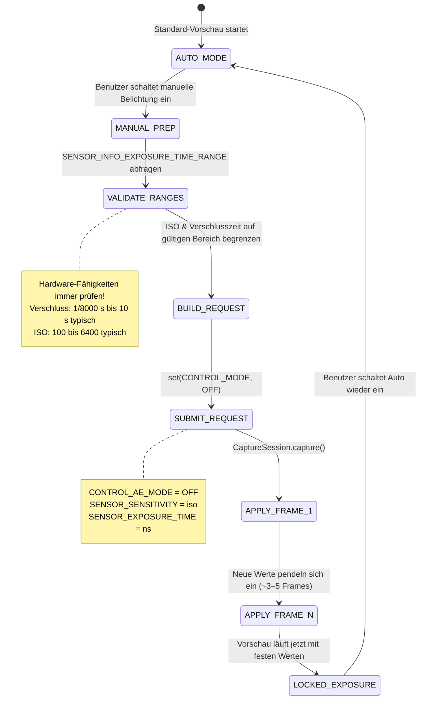

# Kapitel 14: Manuelle Belichtung in Camera2

Mit der fotografischen Theorie aus Kapitel 13 im Gepäck ist es an der Zeit, Konzepte in Code zu übersetzen. In diesem Kapitel lernen Sie, wie Sie das automatische Belichtungssystem (AE) der Kamera **vollständig übernehmen** und den ISO-Wert sowie die Verschlusszeit mit der Camera2 API manuell einstellen.

Die [App Android Camera Parameters](https://github.com/zoozooll/AndroidCameraParameters) demonstriert jede Technik in diesem Kapitel – Sie können live mitmachen, indem Sie in der App in den manuellen Modus wechseln und die Schieberegler für ISO und Verschlusszeit anpassen, um die Ergebnisse in Echtzeit zu sehen.

---

## Der große Wechsel: Von AUTO → MANUAL

Standardmäßig wird jeder von Ihnen übermittelte `CaptureRequest` über die integrierte 3A-Auto-Pipeline (Auto Exposure, Auto Focus, Auto White Balance) der Kamera ausgeführt. Um in den manuellen Modus zu wechseln, müssen Sie die Pipeline **explizit deaktivieren**.

Es gibt zwei Ebenen der Überschreibung:

| Ebene | Einstellung | Was passiert |
|-------|---------|-------------|
| 1. Nur AE deaktivieren | `CONTROL_AE_MODE = OFF` | ISO + Verschlusszeit werden manuell eingestellt; AF und AWB laufen weiterhin automatisch |
| 2. Gesamte 3A deaktivieren | `CONTROL_MODE = OFF` | **Alle** 3A-Algorithmen halten an; jeder 3A-Parameter muss manuell eingestellt werden |

Für eine zuverlässige manuelle Belichtung stellen Sie **beides** ein. Das Deaktivieren von nur `CONTROL_AE_MODE` lässt auf einigen Geräten immer noch eine OEM-Nachbearbeitung im Hintergrund "helfen". Das Einstellen von `CONTROL_MODE = OFF` ist der sauberste und am besten vorhersehbare Weg.



**Übergangslatenz:** Wenn Sie eine manuelle Aufnahmeanforderung übermitteln, erscheinen die neuen ISO-/Verschlusswerte nicht im *nächsten* Frame. CMOS-Sensoren haben eine Pipeline-Latenz – der *aktuelle* Frame wird bereits mit den alten Einstellungen belichtet. Rechnen Sie mit **3–5 Frames Übergangszeit**, bevor sich die Werte stabilisiert haben. Die [App Android Camera Parameters](https://play.google.com/store/apps/details?id=com.minininja.cameraparams) wartet explizit darauf, dass der `CaptureResult` bestätigt, dass die angeforderten Werte mit den angewendeten Werten übereinstimmen, bevor sie "locked" meldet.

---

## Manuelle Steuerungen in der Camera2 API

### SENSOR_SENSITIVITY (ISO)

Camera2 drückt den ISO-Wert als `CaptureRequest.SENSOR_SENSITIVITY` aus – eine Ganzzahl, die direkt der arithmetischen ISO-Skala entspricht. Auf den meisten Geräten ist dies eine 1:1-Abbildung:

| ISO des Fotografen | SENSOR_SENSITIVITY Wert |
|-------------------|--------------------------|
| 100 | 100 |
| 400 | 400 |
| 3200 | 3200 |
| 6400 | 6400 |

**Fragen Sie immer den gültigen Bereich ab.** Verwenden Sie keine fest codierten Werte:

```kotlin
val sensorSensitivityRange = characteristics.get(
    CameraCharacteristics.SENSOR_INFO_SENSITIVITY_RANGE
)
val minIso = sensorSensitivityRange?.lower ?: 100
val maxIso = sensorSensitivityRange?.upper ?: 6400
```

Einige Ultra-Premium-Handys melden einen Bereich wie 50–12800, während Budget-Geräte Sie möglicherweise auf 100–3200 festlegen. Werte außerhalb des Bereichs werden vom HAL begrenzt – was den Zweck Ihrer manuellen Steuerung zunichtemacht.

### SENSOR_EXPOSURE_TIME (Verschlusszeit in Nanosekunden)

Hier ist der erste Stolperstein, über den jeder neue Camera2-Entwickler stolpert: **Die Verschlusszeit wird in Nanosekunden (ns) gespeichert, nicht in Sekunden.** Menschen denken in 1/60 s; der HAL denkt in 16.666.666 ns.

Die Umrechnung ist einfache Arithmetik:

```kotlin
// Sekunden → Nanosekunden (multipliziert mit 1.000.000.000)
fun secondsToNs(seconds: Double): Long = (seconds * 1_000_000_000.0).toLong()

// Nanosekunden → Sekunden für die Anzeige für den Benutzer
fun nsToSeconds(ns: Long): Double = ns.toDouble() / 1_000_000_000.0

// Benutzerfreundlicher String-Formatierer (z. B. "1/60s" oder "2.5s")
fun formatShutter(ns: Long): String {
    val seconds = nsToSeconds(ns)
    return when {
        seconds >= 1.0 -> String.format("%.1fs", seconds)
        else -> {
            val fraction = (1.0 / seconds).toInt()
            "1/${fraction}s"
        }
    }
}
```

**Gängige Umrechnungen als Referenz:**

| Menschliche Verschlusszeit | Nanosekunden (ns) |
|--------------|-------------------|
| 1/8000 s | 125.000 |
| 1/1000 s | 1.000.000 |
| 1/500 s | 2.000.000 |
| 1/120 s (24 fps 180°-Regel) | 8.333.333 |
| 1/60 s | 16.666.666 |
| 1/30 s | 33.333.333 |
| 1/15 s | 66.666.666 |
| 1 s | 1.000.000.000 |
| 2 s | 2.000.000.000 |
| 10 s | 10.000.000.000 |
| 30 s | 30.000.000.000 |

**Fragen Sie auch hier den Hardware-Bereich ab:**

```kotlin
val exposureTimeRange = characteristics.get(
    CameraCharacteristics.SENSOR_INFO_EXPOSURE_TIME_RANGE
)
val minShutterNs = exposureTimeRange?.lower ?: 1_000_000L   // 1/1000 s Minimum
val maxShutterNs = exposureTimeRange?.upper ?: 10_000_000_000L  // 10 s Maximum
```

Auf Geräten, die Ultra-Langzeitbelichtungen unterstützen (z. B. einige Sony Xperia- und Google Pixel-Modelle), kann `SENSOR_INFO_EXPOSURE_TIME_RANGE.upper` 30.000.000.000 ns (30 s) überschreiten. Respektieren Sie diese Grenze – Anforderungen jenseits des Maximums werden stillschweigend begrenzt.

---

## ⚠️ Kritisch: Qualitätsverlust im manuellen Modus

**Dies ist die wichtigste Warnung in diesem Kapitel.** Überspringen Sie sie nicht.

Wenn Sie `CONTROL_MODE = OFF` einstellen (vollständige manuelle Überschreibung), deaktivieren Sie nicht nur die AE/AF/AWB-*Algorithmen* – auf fast allen Android-Geräten deaktivieren Sie auch die **proprietäre computergestützte Nachbearbeitung der OEMs**, die normalerweise innerhalb der 3A-Pipeline läuft.

Konkret zeigen Untersuchungen und HAL3-Analysen, dass das Deaktivieren der 3A-Funktion in der Regel Folgendes abschaltet:

| Verarbeitungsschritt | AUTO-Modus | Manueller Modus (CONTROL_MODE = OFF) |
|-----------------|-----------|-----------------------------------|
| Multi-Frame-Rauschunterdrückung | ✓ Aktiv — rauschreduzierte Ausgabe | ✗ AUS — sichtbares rohes Sensorrauschen |
| Adaptives Tone-Mapping / HDR-Zusammenführung | ✓ Aktiv — Lichter + Schatten wiederhergestellt | ✗ AUS — nur Einzelbild-Kurve |
| Lokale Kontrastanhebung (MiraVision usw.) | ✓ Variiert je nach Szene | ✗ Flache generische Kurve |
| Belichtungsmessung auf Gesichter / Szenenerkennung | ✓ Gewichtet Belichtung auf Gesichter | ✗ Ignoriert |
| Korrektur von Objektivschattierung / Vignettierung | ✓ Pro Objektiv kalibriert | ✗ Oft reduziert oder aus |

**Das Ergebnis:** Ein Foto im manuellen Modus bei ISO 3200 und 1/15 s wird *sichtbar schlechter* aussehen (verrauschter, flacherer Kontrast) als dieselbe Szene, die im AUTO-Modus mit *identischem* ISO-Wert und identischer Verschlusszeit aufgenommen wurde, die der HAL gewählt hat.

**Was können Sie tun?** Es gibt zwei realistische Optionen:

1. **Führen Sie die Nachbearbeitung selbst durch.** Da Sie die OEM-Verarbeitung deaktiviert haben, können Sie Ihre eigene Rauschunterdrückung (z. B. OpenCV bilateraler Filter, MediaPipe-Denoiser oder ein selbst trainiertes CNN) in Ihrer Verarbeitungspipeline anwenden. Die RAW-Aufnahme (siehe spätere Kapitel) + eine benutzerdefinierte RAW-Entwicklung bietet maximale künstlerische Kontrolle.

2. **Verwenden Sie manuelle AE-Überschreibungen anstelle von `CONTROL_MODE = OFF`.** Wenn Sie nur bestimmte Werte *festlegen* müssen, während die OEM-Verarbeitung aktiviert bleibt, versuchen Sie, `CONTROL_AE_MODE = ON` einzustellen, aber setzen Sie `SENSOR_SENSITIVITY` und `SENSOR_EXPOSURE_TIME` auf einer Anforderungs-Basis fest. Die Unterstützung für diesen Mischmodus ist geräteabhängig – testen Sie dies gründlich.

Die [App Android Camera Parameters](https://github.com/zoozooll/AndroidCameraParameters) verfügt im Panel für manuelle Einstellungen über einen Umschalter, mit dem Sie zwischen beiden Ansätzen wechseln und den Qualitätsunterschied visuell vergleichen können.

---

## Vollständiges Beispiel 1: Fixierte Belichtung für Zeitraffer

Ein klassischer Anwendungsfall für die manuelle Belichtung ist die **Zeitrafferfotografie**. Im AUTO-Modus passt die Kamera die Belichtung subtil von Frame zu Frame an, wenn sich Wolken bewegen oder das Licht sich ändert. Das resultierende Video flimmert furchtbar. Das Fixieren von ISO + Verschlusszeit eliminiert dies.

**Ziel:** ISO 100, 1/60 s (16.666.666 ns) — fixiert für jeden Frame.

```kotlin
class TimelapseManualExposure(
    private val characteristics: CameraCharacteristics,
    private val captureSession: CameraCaptureSession,
    private val imageReaderSurface: Surface,
    private val previewSurface: Surface
) {
    companion object {
        private const val TARGET_ISO = 100
        private const val TARGET_SHUTTER_NS = 16_666_666L // 1/60 s
    }

    fun captureTimelapseFrame(frameCallback: ImageReader.OnImageAvailableListener) {
        try {
            // ---- SCHRITT 1: Überprüfen, ob die angeforderten Werte im Hardware-Bereich liegen ----
            val isoRange = characteristics.get(
                CameraCharacteristics.SENSOR_INFO_SENSITIVITY_RANGE
            )
            val shutterRange = characteristics.get(
                CameraCharacteristics.SENSOR_INFO_EXPOSURE_TIME_RANGE
            )

            val clampedIso = isoRange?.let {
                TARGET_ISO.coerceIn(it.lower, it.upper)
            } ?: TARGET_ISO

            val clampedShutter = shutterRange?.let {
                TARGET_SHUTTER_NS.coerceIn(it.lower, it.upper)
            } ?: TARGET_SHUTTER_NS

            // ---- SCHRITT 2: CaptureRequest mit manueller Belichtung erstellen ----
            val requestBuilder = captureSession.device.createCaptureRequest(
                CameraDevice.TEMPLATE_STILL_CAPTURE
            ).apply {
                addTarget(previewSurface)
                addTarget(imageReaderSurface)

                // --- DIE ENTSCHEIDENDEN ZEILEN: 3A deaktivieren und Werte festlegen ---
                set(CaptureRequest.CONTROL_MODE, CameraMetadata.CONTROL_MODE_OFF)
                set(CaptureRequest.CONTROL_AE_MODE, CameraMetadata.CONTROL_AE_MODE_OFF)
                set(CaptureRequest.SENSOR_SENSITIVITY, clampedIso)
                set(CaptureRequest.SENSOR_EXPOSURE_TIME, clampedShutter)

                // Optional: AWB ebenfalls auf Tageslicht fixieren für konsistente Farben
                set(CaptureRequest.CONTROL_AWB_MODE, CameraMetadata.CONTROL_AWB_MODE_DAYLIGHT)

                // JPEG-Qualität für die Standbildaufnahme
                set(CaptureRequest.JPEG_QUALITY, 95)
            }

            // ---- SCHRITT 3: Die Standbildaufnahme übermitteln ----
            captureSession.capture(
                requestBuilder.build(),
                object : CameraCaptureSession.CaptureCallback() {
                    override fun onCaptureCompleted(
                        session: CameraCaptureSession,
                        request: CaptureRequest,
                        result: TotalCaptureResult
                    ) {
                        // Überprüfen, ob der HAL unsere Werte tatsächlich angewendet hat (er könnte sie begrenzen!)
                        val appliedIso = result.get(CaptureResult.SENSOR_SENSITIVITY)
                        val appliedShutter = result.get(CaptureResult.SENSOR_EXPOSURE_TIME)
                        Log.d("Timelapse", "Angewendet: ISO=$appliedIso, Verschluss=${formatShutter(appliedShutter!!)}")
                    }
                },
                null // Auf dem Handler des aktuellen Threads ausführen
            )

        } catch (e: CameraAccessException) {
            Log.e("Timelapse", "Manuelle Aufnahme fehlgeschlagen", e)
        }
    }
}
```

**Wichtige Punkte:**

- Verwenden Sie immer `coerceIn()` gegen die Hardware-Bereiche. Wenn der minimale ISO-Wert eines Budget-Handys 120 beträgt, wird Ihre Anforderung für 100 stillschweigend auf 120 geändert. `onCaptureCompleted()` bestätigt, was *tatsächlich* angewendet wurde.
- Senden Sie für einen Zeitraffer diese Anforderung alle N Sekunden (z. B. alle 5 s für eine 300-fache Beschleunigung bei einer Ausgabe von 30 fps).
- Das Festlegen von `CONTROL_AWB_MODE_DAYLIGHT` ist optional, wird aber für Zeitraffer empfohlen – andernfalls kann der AWB den Weißabgleich zwischen den Bildern immer noch subtil variieren, selbst wenn die Belichtung fest eingestellt ist.

---

## Vollständiges Beispiel 2: Langzeitbelichtung für Nachtfotografie

**Ziel:** ISO 3200, 2 Sekunden (2.000.000.000 ns) — weiche Wasserspuren, heller Nachthimmel.

**Kritische Hardware-Anforderung:** Das Gerät muss `SENSOR_INFO_EXPOSURE_TIME_RANGE.upper >= 2.000.000.000 ns` unterstützen. Viele Mittelklasse-Handys erreichen maximal ~1/8 s bis 1 s.

```kotlin
class NightLongExposure(
    private val characteristics: CameraCharacteristics,
    private val captureSession: CameraCaptureSession,
    private val previewSurface: Surface,
    private val jpegReaderSurface: Surface,
    private val rawReaderSurface: Surface? // Optionale RAW-Aufnahme
) {
    fun shootLongExposure(onPhotoSaved: (path: String) -> Unit) {
        val shutterNs = 2_000_000_000L  // 2 Sekunden
        val targetIso = 3200

        // --- Überprüfen, ob die Hardware das überhaupt kann ---
        val shutterRange = characteristics.get(
            CameraCharacteristics.SENSOR_INFO_EXPOSURE_TIME_RANGE
        )
        if (shutterRange == null || shutterRange.upper < shutterNs) {
            throw UnsupportedOperationException(
                "Gerät unterstützt keine 2-s-Belichtung. Max = " +
                "${shutterRange?.upper?.let { nsToSeconds(it) } ?: "unbekannt"}s"
            )
        }

        val requestBuilder = captureSession.device.createCaptureRequest(
            CameraDevice.TEMPLATE_STILL_CAPTURE
        ).apply {
            addTarget(previewSurface)
            addTarget(jpegReaderSurface)
            // Wenn Sie zuvor eine RAW-fähige OutputConfiguration konfiguriert haben:
            rawReaderSurface?.let { addTarget(it) }

            // Manuelle Belichtungsüberschreibung
            set(CaptureRequest.CONTROL_MODE, CameraMetadata.CONTROL_MODE_OFF)
            set(CaptureRequest.CONTROL_AE_MODE, CameraMetadata.CONTROL_AE_MODE_OFF)
            set(CaptureRequest.SENSOR_SENSITIVITY, targetIso)
            set(CaptureRequest.SENSOR_EXPOSURE_TIME, shutterNs)

            // --- Kritisch für Langzeitbelichtungen ---
            // Optische/digitale Videostabilisierung deaktivieren (bei >1 s gibt es Konflikte)
            set(CaptureRequest.LENS_OPTICAL_STABILIZATION_MODE,
                CameraMetadata.LENS_OPTICAL_STABILIZATION_MODE_OFF)
            // Kein Blitz für Langzeitbelichtungen
            set(CaptureRequest.CONTROL_AE_MODE, CameraMetadata.CONTROL_AE_MODE_OFF)
        }

        captureSession.capture(
            requestBuilder.build(),
            object : CameraCaptureSession.CaptureCallback() {
                override fun onCaptureStarted(
                    session: CameraCaptureSession,
                    request: CaptureRequest,
                    timestamp: Long
                ) {
                    super.onCaptureStarted(session, request, timestamp)
                    // UI benachrichtigen: "Belichtung gestartet — bitte 2 Sekunden lang ganz still halten"
                    Log.d("LongExposure", "Belichtung gestartet bei $timestamp")
                }

                override fun onCaptureCompleted(
                    session: CameraCaptureSession,
                    request: CaptureRequest,
                    result: TotalCaptureResult
                ) {
                    // ImageReader.OnImageAvailableListener wird separat ausgelöst, um das JPEG zu speichern
                    Log.d("LongExposure", "Langzeitbelichtung abgeschlossen")
                }
            },
            null
        )
    }
}
```

**Tipps für Langzeitbelichtungen:**

1. **OIS ausschalten.** Die optische Bildstabilisierung in den meisten Objektiven versucht, Kamera-Wackler *während* der Belichtung auszugleichen. Bei Belichtungen > 0,5 s können die OIS-Aktoren in die Sättigung gehen und ein sichtbares Abwandern verursachen. Deaktivieren Sie diese Funktion und verwenden Sie ein Stativ.

2. **Mit einem Einfrieren rechnen.** Die Kamera wird keine Vorschau-Frames ausgeben, während eine 2-sekündige Belichtung läuft. Ihre UI sollte eine explizite Anzeige "BELICHTUNG LÄUFT…" zeigen.

3. **RAW ist besser.** Hoher ISO-Wert (3200) + Langzeitbelichtung erzeugt thermisches Rauschen (der Sensor erwärmt sich). Speichern Sie ein RAW-Bild und verwenden Sie einen Desktop-RAW-Entwickler mit Frame-Mittelung – oder implementieren Sie Ihre eigene Multi-Frame-Langzeitbelichtung, indem Sie 8 × 0,25 s Frames statt 1 × 2 s Frame mitteln (reduziert thermisches Rauschen dramatisch).

---

## Vollständiges Beispiel 3: Belichtungsreihe mit 3 Bildern

**Ziel:** Gleicher ISO-Wert, 3 verschiedene Belichtungen bei −1 EV, 0 EV, +1 EV. Der Benutzer führt diese später zu einem HDR-Foto zusammen.

Aus Kapitel 13 wissen wir, dass jeder EV-Schritt das Licht verdoppelt/halbiert. Bei festem ISO-Wert bedeutet jeder EV-Schritt, die Verschlusszeit mit 2 zu multiplizieren/durch 2 zu dividieren.

```kotlin
class ExposureBracketing(
    private val characteristics: CameraCharacteristics,
    private val captureSession: CameraCaptureSession,
    private val previewSurface: Surface,
    private val jpegReaderSurface: Surface
) {
    data class BracketFrame(
        val label: String,
        val evShift: Double,  // -1.0, 0.0, +1.0
        val shutterNs: Long,
        val iso: Int
    )

    fun captureBracketSeries(baseIso: Int, baseShutterNs: Long) {
        val isoRange = characteristics.get(
            CameraCharacteristics.SENSOR_INFO_SENSITIVITY_RANGE
        )
        val shutterRange = characteristics.get(
            CameraCharacteristics.SENSOR_INFO_EXPOSURE_TIME_RANGE
        )

        // Belichtungsplan erstellen: Verschlusszeit mit 2^(evStep) multiplizieren
        val frames = listOf(-1.0, 0.0, +1.0).map { ev ->
            val multiplier = Math.pow(2.0, ev)
            val rawShutter = (baseShutterNs.toDouble() * multiplier).toLong()
            val clampedShutter = shutterRange?.let {
                rawShutter.coerceIn(it.lower, it.upper)
            } ?: rawShutter
            val clampedIso = isoRange?.let {
                baseIso.coerceIn(it.lower, it.upper)
            } ?: baseIso
            BracketFrame("EV${if (ev > 0) "+" else ""}${ev.toInt()}", ev, clampedShutter, clampedIso)
        }

        Log.d("Bracket", "Plan: ${frames.map { "${it.label} ISO${it.iso} ${formatShutter(it.shutterNs)}" }}")

        // Jedes Bild als Burst mit captureBurst() für Atomarität übermitteln
        val requestList = frames.map { frame ->
            captureSession.device.createCaptureRequest(
                CameraDevice.TEMPLATE_STILL_CAPTURE
            ).apply {
                addTarget(previewSurface)
                addTarget(jpegReaderSurface)

                set(CaptureRequest.CONTROL_MODE, CameraMetadata.CONTROL_MODE_OFF)
                set(CaptureRequest.CONTROL_AE_MODE, CameraMetadata.CONTROL_AE_MODE_OFF)
                set(CaptureRequest.SENSOR_SENSITIVITY, frame.iso)
                set(CaptureRequest.SENSOR_EXPOSURE_TIME, frame.shutterNs)

                // Jede Anforderung markieren, damit wir die Bilder im Callback sortieren können
                setTag(frame.label)
            }.build()
        }

        captureSession.captureBurst(
            requestList,
            object : CameraCaptureSession.CaptureCallback() {
                override fun onCaptureCompleted(
                    session: CameraCaptureSession,
                    request: CaptureRequest,
                    result: TotalCaptureResult
                ) {
                    val tag = request.tag as? String ?: "?"
                    Log.d("Bracket", "$tag abgeschlossen — bereit für HDR-Zusammenführung")
                }
            },
            null
        )
    }
}
```

**Warum `captureBurst()` statt drei separater `capture()`-Aufrufe?** `captureBurst()` übermittelt die gesamte Liste atomar. Der HAL garantiert, dass keine anderen Vorschau-Frames dazwischengeschoben werden und dass der Fokus- oder Weißabgleich-Zustand zwischen den Bildern nicht driftet.

**Sie möchten 5 oder 7 Belichtungsstufen?** Ändern Sie einfach `listOf(-2.0, -1.0, 0.0, +1.0, +2.0)` — die Mathematik skaliert. Viele professionelle HDR-Apps nehmen 9 Belichtungsstufen für Szenen mit extremem Dynamikumfang auf.

**Schritt der Zusammenführung:** Sobald Sie die drei JPEG- (oder RAW-) Bilder haben, können Sie sie wie folgt zusammenführen:
- Über die integrierte HDR-Pipeline von Android über `CameraExtensionSession` (siehe HDR-Kapitel).
- Mit einer Drittanbieter-Bibliothek wie OpenCVs `createMergeDebevec()` / `createMergeRobertson()` für eine echte Belichtungsfusion.
- Über Googles Photo-Sphere-HDR-Bibliothek.

---

## Fehlerbehebung bei häufigen Fehlern

| Problem | Wahrscheinliche Ursache | Lösung |
|---------|-------------|-----|
| Manuelle Werte scheinen ignoriert zu werden, sieht immer noch nach Automatik aus | `CONTROL_MODE` nicht auf OFF gesetzt oder Werte wurden begrenzt | Setzen Sie sowohl CONTROL_MODE als auch CONTROL_AE_MODE auf OFF; überprüfen Sie die angewendeten Werte in `onCaptureCompleted()` |
| Anforderung für 2-s-Langzeitbelichtung meldet sofort einen Fehler | Gerät unterstützt keine Belichtung von 2 s | Prüfen Sie `SENSOR_INFO_EXPOSURE_TIME_RANGE.upper`; verkürzen Sie die Belichtungszeit oder verwenden Sie stattdessen eine ISO-Erhöhung |
| Vorschau stottert oder verzögert sich beim Umschalten auf manuell | Zu viele `setRepeatingRequest()`-Aufrufe | Verwenden Sie einen gedrosselten Slider-Listener (alle 30–50 ms); aktualisieren Sie nur die wiederholte Anforderung, nicht die Standbildaufnahmen |
| Foto mit Langzeitbelichtung ist bei ISO 100 2 s komplett schwarz | Die Szene benötigt bei ISO 100 tatsächlich mehr Licht | Erhöhen Sie den ISO-Wert oder verlängern Sie die Verschlusszeit; 2 s bei ISO 100 ist die Basislinie für EV 0, nicht "nachthell" |
| Manuelle Aufnahmen verrauschter als automatische bei gleichem ISO-Wert | OEM-Rauschunterdrückung durch CONTROL_MODE = OFF deaktiviert | Erwartetes Verhalten! Siehe Abschnitt "Qualitätsverlust im manuellen Modus". Führen Sie eine Nachbearbeitung durch oder verwenden Sie eine teilweise manuelle Steuerung über AE_LOCK |

---

## Zusammenfassung

Sie verfügen nun über die Werkzeuge, um dem Camera2 HAL die volle Kontrolle über die Belichtung zu entziehen:

- **3A-Pipeline deaktivieren** mit `CONTROL_MODE = OFF` + `CONTROL_AE_MODE = OFF` für eine vollständig manuelle Steuerung.
- **ISO-Wert auf `SENSOR_SENSITIVITY` abbilden** (1:1-Abbildung auf der meisten Hardware; fragen Sie immer den Bereich ab).
- **Sekunden ↔ Nanosekunden abbilden** für `SENSOR_EXPOSURE_TIME` mit einer einfachen 10⁹-Umrechnung.
- **Zeitraffer-Fixierung:** Fester ISO 100 + 1/60 s wiederholt für jeden Frame = null Flimmern.
- **Nacht-Langzeitbelichtung:** ISO 3200 + 2 s mit deaktiviertem OIS = helle, glatte Nachtszene (auf unterstützter Hardware).
- **Belichtungsreihe:** Gleicher ISO-Wert, Verschlusszeit ×0,5 / ×1 / ×2 über `captureBurst()` = Eingabe für HDR-Zusammenführung bereit.
- **⚠️ Kompromiss bei manueller Qualität:** Das Deaktivieren der 3A deaktiviert die herstellerspezifische Rauschunterdrückung und das Tone-Mapping — manuelle Fotos sehen bei identischem ISO-Wert oft *schlechter* aus als automatische. Planen Sie eine Nachbearbeitung ein.

## Wie geht es weiter?

Die Belichtung steuert die *Helligkeit*. **Der Fokus steuert die Schärfe.** In **Kapitel 15: Fokus** behandeln wir:

- Zustände und Modi des Autofokus (AF) — wie die passive Suche funktioniert, der Unterschied zwischen Continuous Picture vs. Video.
- Manueller Fokus mit `LENS_FOCUS_DISTANCE` in Dioptrien (0,0 = Unendlich, 10 D = 0,1 m).
- Kotlin-Code für eine One-Shot-AF-Trigger-und-Aufnahme-Sequenz und einen SeekBar-Schieberegler für den manuellen Fokus.
- Die AF-Zustandsmaschine — wann `CONTROL_AF_STATE_FOCUSED_LOCKED` tatsächlich ausgelöst wird und wie man darauf wartet.

Hier hört die Unschärfe auf. (Wortspiel absolut beabsichtigt.)
