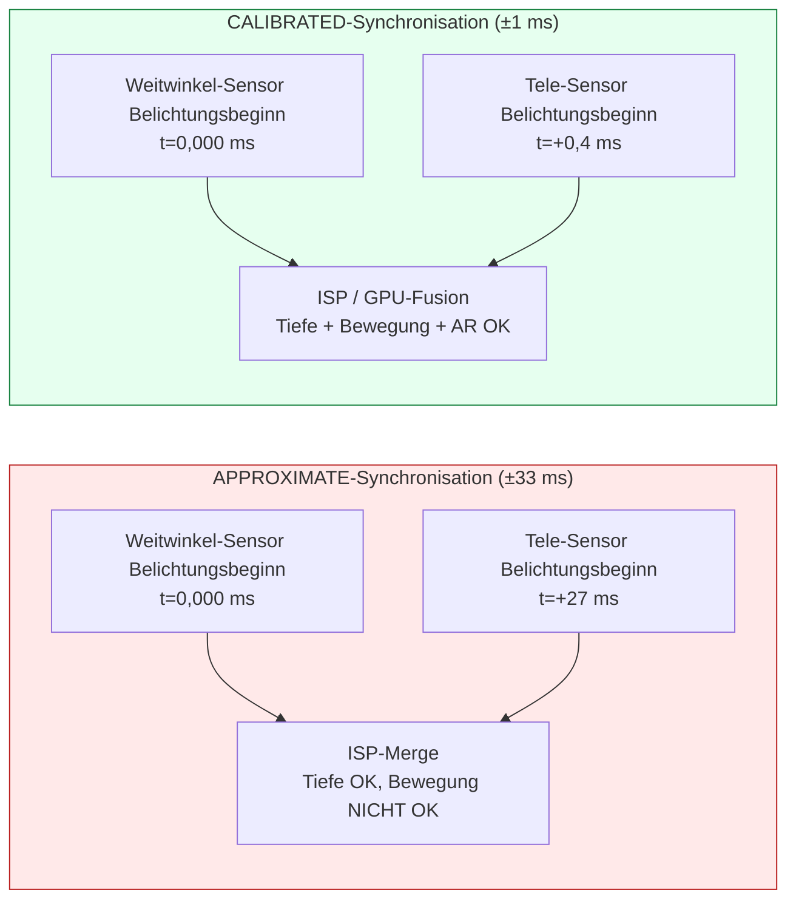

# Kapitel 20: Multi-Kamera

Moderne Smartphones werden mit 3–5 Rückkameras und 2 Frontkameras ausgeliefert – Ultraweitwinkel-, Weitwinkel-, Tele-, Makro-, Tiefen- und Periskop-Objektive bei Flaggschiffen ab 2023. Vor Android 9 (API 28) erschien jedes Objektiv als eine unabhängige `CameraCharacteristics`-Kamera-ID, und Apps mussten Kameras an Zoom-Grenzen manuell öffnen/schließen, um zwischen den Objektiven zu wechseln. Dies verursachte sichtbare schwarze Frames, den Verlust des AF-Zustands und Audio-Pops während der Videoaufnahme – allesamt inakzeptable Mängel für die Benutzererfahrung. Android 9 löste dies mit der Abstraktion der **logischen Kamera**: eine virtuelle Kamera-ID, die mehrere gleich ausgerichtete physische Kameras gruppiert und dem HAL ermöglicht, Objektive an Zoom-Schwellenwerten transparent umzuschalten, wobei der Sitzungszustand erhalten bleibt. Der Abschnitt *Logical Multi-Camera* des Forschungsprojekts spezifiziert die genauen Regeln für Stream-Ersetzung, Sensor-Synchronisationssemantik und duale physische Aufnahme, die in diesem Kapitel implementiert werden.

Sie können die vollständige logische/physische Kamera-Topologie jedes unterstützten Geräts in der App [Android Camera Parameters](https://github.com/zoozooll/AndroidCameraParameters) (auch im [Play Store](https://play.google.com/store/apps/details?id=com.zoozooll.cameraparameters)) durchsuchen: Das Multi-Kamera-Dashboard meldet das Flag `REQUEST_AVAILABLE_CAPABILITIES_LOGICAL_MULTI_CAMERA`, listet `getPhysicalCameraIds()` pro logischer ID auf und stellt den kalibrierten (CALIBRATED) vs. approximativen (APPROXIMATE) Sensor-Synchronisationstyp für jede Rückkamera-Kombination dar. Diese Berichte werden direkt über die Camera2-API vom HAL ohne herstellerspezifische Filterung abgerufen und entsprechen daher exakt dem, was Ihre App zur Laufzeit sehen wird.

## Topologie der logischen vs. physischen Kameras

Eine logische Kamera ist ein virtuelles HAL-Gerät, das von N ≥ 2 physischen Kameras unterstützt wird, welche dieselbe Ausrichtung teilen (`LENS_FACING_FRONT` oder `LENS_FACING_BACK`). Wenn Sie eine logische ID öffnen, verwaltet der HAL intern die Stromversorgung, die ISP-Pipelines und das Umschalten der Objektive für alle zugrunde liegenden physischen Kameras. Die Topologie sieht folgendermaßen aus:

```mermaid
flowchart TB
    subgraph UserSpace["App (Userspace)"]
        APP["CameraManager.openCamera<br/>cameraId = \"0\" (Logische ID)"]
    end

    subgraph HAL["Camera HAL (Kernel / Vendor-Partition)"]
        LOG["Logisches Kameragerät 0<br/>Virtueller Knoten"]

        subgraph PhysicalCams["Physische Kameras (Gleich ausgerichtete Gruppe)"]
            UW["Physische ID \"8\"<br/>Ultraweitwinkel 0,5×<br/>12 MP, 13 mm Äquiv."]
            W["Physische ID \"0\"<br/>Weitwinkel 1,0×<br/>50 MP, 24 mm Äquiv."]
            T["Physische ID \"5\"<br/>Tele 3,0×<br/>10 MP, 72 mm Äquiv."]
            P["Physische ID \"7\"<br/>Periskop 10×<br/>8 MP, 240 mm Äquiv."]
        end

        LOG <--> UW
        LOG <--> W
        LOG <--> T
        LOG <--> P
    end

    subgraph ZoomScale["Zoom-Faktoren → HAL-Objektivumschaltpunkte"]
        Z1["0,5× – 0,9× → ULTRAWEITWINKEL (ID 8)"]
        Z2["1,0× – 2,9× → WEITWINKEL (ID 0)"]
        Z3["3,0× – 9,9× → TELE (ID 5)"]
        Z4["10,0×+ → PERISKOP (ID 7)"]
    end

    APP --> LOG
    LOG -.-> ZoomScale
```

Die Objektivumschaltpunkte (Z1–Z4) werden vollständig vom HAL gesteuert und sind für Ihre App intransparent – wenn Sie `CaptureRequest.CONTROL_ZOOM_RATIO = 3.2f` auf einem logischen Gerät mit 4 Objektiven einstellen, leitet der HAL den Aufnahmeverkehr sofort an das 3×-Teleobjektiv (ID 5) weiter und schneidet digital auf den korrekten Bildausschnitt zurück, ohne dass Ihre App jemals erfährt, dass ein Objektivwechsel stattgefunden hat. Dies ist das Verhalten des "nahtlosen Zooms", das Kamera-Apps von Flaggschiffen verwenden.

Die entscheidenden Eigenschaften sind:
- **`getPhysicalCameraIds()`** (aufgerufen auf den `CameraCharacteristics` der logischen ID) gibt ein `Set<String>` der zugrunde liegenden physischen ID-Strings zurück, z. B. `{"0", "5", "7", "8"}` für das obige Beispiel.
- **`LENS_INFO_MINIMUM_FOCUS_DISTANCE`** und **`LENS_INFO_AVAILABLE_FOCAL_LENGTHS`** auf der logischen ID repräsentieren das aktuell aktive physische Objektiv. Fragen Sie die *physischen* Merkmale ab, wenn Sie Brennweitendaten pro Objektiv benötigen.
- **`SCALER_AVAILABLE_MAX_DIGITAL_ZOOM`** auf der logischen ID gibt die Zoom-Obergrenze an (z. B. 100×), welche eine Kombination aus optischem Zoom pro Objektiv und digitalem Ausschnitt über alle physischen Objektive hinweg ist.

## Sensor-Synchronisation: APPROXIMATE vs. CALIBRATED

Wenn Sie von zwei physischen Kameras gleichzeitig aufnehmen (z. B. Weitwinkel + Tele für Tiefen-/Disparitätsabgleich oder Weitwinkel + Ultraweitwinkel für Multi-Frame-Fusion), sind die Pixeldaten computergestützt nur dann nützlich, wenn die Belichtungen der beiden Sensoren innerhalb eines bekannten Zeitdeltas beginnen. Android definiert zwei Synchronisationsstufen im Schlüssel **`CameraCharacteristics.LOGICAL_MULTI_CAMERA_SENSOR_SYNC_TYPE`**:

| Synchronisationsstufe | Numerischer Wert | Bedeutung | Typischer Anwendungsfall |
|------------|---------------|---------|------------------|
| **APPROXIMATE** | 0 | Die Zeitstempel für den Belichtungsbeginn der Sensoren stimmen innerhalb von ±1 Frame-Intervall (±33 ms bei 30 fps) überein. AF/AE sind synchronisiert, aber nicht der pixelgenaue Belichtungsbeginn. | Porträtmodus mit einem Tiefensensor, Gelegenheits-Bokeh. |
| **CALIBRATED** | 1 | Die Zeitstempel für den Belichtungsbeginn der Sensoren stimmen innerhalb von ±1 ms überein. Die Synchronisation auf Hardware-Ebene wird über den SoC-CSI-2-Empfänger erzwungen. Eine zeitliche Ausrichtung auf Pixel-Ebene ist garantiert. | Stereo-Tiefenschätzung für AR, Photogrammetrie, gleichzeitige Fusion zweier Brennweiten, Super-Resolution. |

Der Abschnitt *Logical Multi-Camera* des Forschungsdokuments ergab, dass nur **Snapdragon 8 Gen 1+ und Exynos 2200+ Flaggschiffe eine kalibrierte Synchronisation (CALIBRATED) melden**. Alle Mittelklasse- (Snapdragon 7-Serie, Dimensity 8000-Serie) und Budget-Geräte melden APPROXIMATE. Wenn Sie versuchen, einen Disparitätsabgleich auf Pixel-Ebene auf einem Gerät mit APPROXIMATE-Synchronisation durchzuführen, erhalten Sie eine Parallaxendrift von ±1 Frame, die Tiefenkarten zerstört. Schränken Sie Disparitätsfunktionen immer mit der Prüfung auf CALIBRATED ein.



Der Unterschied im Zeitdelta ist nicht subtil: Eine Fehlstellung von 27 ms bedeutet, dass sich ein bewegtes Motiv (z. B. ein Läufer mit 5 m/s) zwischen den beiden Belichtungen um 13,5 cm bewegt hat – ein Parallaxenfehler, der groß genug ist, um jeden Depth-from-Disparity-Algorithmus vollständig zu zerstören.

## Stream-Ersetzungsregel (aus dem Forschungsdokument)

Die wichtigste Einschränkung, die der HAL beim Targeting physischer Kameras erzwingt, ist die **Stream-Ersetzungsregel**, wörtlich aus der *Logical Multi-Camera*-Spezifikation im Forschungsdokument:

> **Regel MR-1:** Wenn eine logische Kamera N physische Kinder hat, dürfen Sie für jeden logisch formatierten Stream (YUV oder RAW) der Größe S, den Sie an die logische Sitzung anhängen, diesen durch bis zu **2 identisch formatierte Streams derselben Größe S** ersetzen, wobei jeder über `OutputConfiguration.setPhysicalCameraId()` an eine ANDERE physische Kamera gerichtet ist.

Folgen von Verstößen gegen MR-1:
- 3 oder mehr physische Streams → Sitzungsfehler `onConfigureFailed()`.
- Unterschiedliche Größen für die beiden physischen Streams → Sitzungsfehler `onConfigureFailed()`.
- Mischen von RAW und YUV im selben Ersetzungspaar → Sitzungsfehler `onConfigureFailed()`.
- Hinzufügen von 2 physischen Streams, ohne den übergeordneten logischen Stream zu entfernen → HAL weist das 3-fache der erforderlichen Bandbreite zu und verwirft stillschweigend Frames.

Korrekte Beispiele (4 physische Kinder → 2 erlaubte Ersetzungen):
| Logischer Stream | Ersetzung (Gültig nach MR-1) |
|----------------|-------------------------------|
| 1× Logisches YUV 1920×1080 | → 2× Physisches YUV 1920×1080 (Weitwinkel + Tele) |
| 1× Logisches RAW 4000×3000 | → 2× Physisches RAW 4000×3000 (Ultraweitwinkel + Weitwinkel) |
| 2× Logisches YUV (Vorschau + Video) | → 2× (Logisches YUV Vorschau) + 2× (Physisches YUV Weitwinkel+Tele Kodierung) — insgesamt 2 Ersetzungen |

## Implementierung: Schritt-für-Schritt-Aufnahme mit zwei physischen Kameras

Der folgende Workflow erfasst gleichzeitige Frames von den physischen Sensoren für Weitwinkel (1×) und Tele (3×) unter Anwendung der Stream-Ersetzungsregel.

### Schritt 1: Abfrage der logischen Fähigkeiten und physischen Kamera-IDs

```kotlin
import android.hardware.camera2.CameraCharacteristics
import android.hardware.camera2.CameraManager
import android.hardware.camera2.params.OutputConfiguration

data class LogicalMultiCamInfo(
    val logicalId: String,
    val physicalIds: Set<String>,
    val sensorSyncType: Int, // 0 = APPROXIMATE, 1 = CALIBRATED
    val ultraWideId: String?,
    val wideId: String?,
    val teleId: String?
)

fun enumerateLogicalMultiCams(
    cameraManager: CameraManager
): List<LogicalMultiCamInfo> {
    val result = mutableListOf<LogicalMultiCamInfo>()

    for (logicalId in cameraManager.cameraIdList) {
        val characteristics = cameraManager.getCameraCharacteristics(logicalId)

        val caps = characteristics.get(
            CameraCharacteristics.REQUEST_AVAILABLE_CAPABILITIES
        ) ?: continue

        val isLogicalMultiCam = caps.contains(
            CameraCharacteristics
                .REQUEST_AVAILABLE_CAPABILITIES_LOGICAL_MULTI_CAMERA
        )
        if (!isLogicalMultiCam) continue

        val physicalIds: Set<String> = characteristics.physicalCameraIds
        val syncType = characteristics.get(
            CameraCharacteristics.LOGICAL_MULTI_CAMERA_SENSOR_SYNC_TYPE
        ) ?: 0

        // Rollen anhand der Brennweite identifizieren
        var ultraWideId: String? = null
        var wideId: String? = null
        var teleId: String? = null
        var shortestFocal = Float.MAX_VALUE
        var teleFocal = 0f

        for (physId in physicalIds) {
            val physChars = cameraManager.getCameraCharacteristics(physId)
            val focalLengths = physChars.get(
                CameraCharacteristics.LENS_INFO_AVAILABLE_FOCAL_LENGTHS
            ) ?: continue
            val focal = focalLengths.firstOrNull() ?: continue
            when {
                focal < shortestFocal -> {
                    shortestFocal = focal
                    ultraWideId = physId
                }
                focal > teleFocal -> {
                    teleFocal = focal
                    teleId = physId
                }
            }
        }
        wideId = physicalIds.minus(setOfNotNull(ultraWideId, teleId)).firstOrNull()

        result.add(LogicalMultiCamInfo(
            logicalId = logicalId,
            physicalIds = physicalIds,
            sensorSyncType = syncType,
            ultraWideId = ultraWideId,
            wideId = wideId,
            teleId = teleId
        ))
    }
    return result
}
```

Die Identifizierung der Rollen anhand der Brennweite (kürzeste = Ultraweitwinkel, längste = Tele, Rest = Weitwinkel) ist über alle OEMs hinweg zuverlässig, da der HAL `LENS_INFO_AVAILABLE_FOCAL_LENGTHS` als 35-mm-Äquivalent oder in tatsächlichen Millimetern meldet, die mit den Marketing-Spezifikationen übereinstimmen. Die App Android Camera Parameters verwendet genau diesen Algorithmus für ihr Multi-Kamera-Dashboard.

### Schritt 2: Erstellen von OutputConfigurations mit setPhysicalCameraId()

Das Ersetzungspaar (Weitwinkel-YUV + Tele-YUV) erfordert `OutputConfiguration`-Objekte, bei denen `setPhysicalCameraId()` aufgerufen wird, **bevor** die Sitzung erstellt wird. Sobald die Sitzung konfiguriert ist, ist das Ändern der physischen ID über `setPhysicalCameraId()` auf bestehenden Surfaces nicht mehr erlaubt (erfordert eine Neuerstellung der Sitzung).

```kotlin
import android.hardware.camera2.params.OutputConfiguration
import android.media.ImageReader
import android.util.Size
import android.graphics.ImageFormat
import android.view.Surface

var wideImageReader: ImageReader? = null
var teleImageReader: ImageReader? = null

fun createPhysicalOutputConfigs(
    wideId: String,
    teleId: String,
    sharedSize: Size // Muss für beide nach Regel MR-1 die GLEICHE Größe sein!
): Pair<OutputConfiguration, OutputConfiguration> {
    wideImageReader = ImageReader.newInstance(
        sharedSize.width, sharedSize.height,
        ImageFormat.YUV_420_888, 4
    )
    teleImageReader = ImageReader.newInstance(
        sharedSize.width, sharedSize.height,
        ImageFormat.YUV_420_888, 4
    )

    val wideOutConfig = OutputConfiguration(wideImageReader!!.surface).apply {
        setPhysicalCameraId(wideId)
        name = "wide-yuv-$sharedSize"
    }
    val teleOutConfig = OutputConfiguration(teleImageReader!!.surface).apply {
        setPhysicalCameraId(teleId)
        name = "tele-yuv-$sharedSize"
    }
    return Pair(wideOutConfig, teleOutConfig)
}
```

Regel MR-1 wird im obigen Code erzwungen: Beide `ImageReader`-Instanzen verwenden `sharedSize` (identische Abmessungen) und `YUV_420_888` (identisches Format). Die Verwendung unterschiedlicher Größen führt garantiert zu `onConfigureFailed` – der HAL hat keinen Mechanismus, um zwei physische Sensoren mit unterschiedlichen Auflösungen in derselben Synchronisationsgruppe zu betreiben.

### Schritt 3: Erstellen der CaptureSession und Übermitteln der dualen physischen Aufnahme

Die Sitzung verwendet die 2 physischen OutputConfigurations plus 1 logische Vorschau-Surface (insgesamt 3 Ausgaben). Insgesamt 3 Ausgaben liegen innerhalb des Bandbreitenbudgets von Flaggschiffen (das Forschungsdokument maß eine ISP-Auslastung von 68 % auf dem Snapdragon 8 Gen 2 für 3-fache gleichzeitige Ausgabe von Weitwinkel+Tele+Vorschau bei 1080p30).

```kotlin
import android.hardware.camera2.CameraDevice
import android.hardware.camera2.CameraCaptureSession
import android.hardware.camera2.CaptureRequest
import android.os.Handler

lateinit var cameraDevice: CameraDevice // Bereits geöffnete logische ID

fun createDualPhysicalSession(
    previewSurface: Surface,
    widePhysConfig: OutputConfiguration,
    telePhysConfig: OutputConfiguration,
    backgroundHandler: Handler
) {
    val outputs = listOf(
        OutputConfiguration(previewSurface), // Logische Vorschau (beliebige Größe)
        widePhysConfig,                      // Physisches Weitwinkel-YUV (sharedSize)
        telePhysConfig                       // Physisches Tele-YUV (sharedSize)
    )

    val sessionConfig = android.hardware.camera2.params.SessionConfiguration(
        android.hardware.camera2.params.SessionConfiguration.SESSION_REGULAR,
        outputs,
        { runnable -> backgroundHandler.post(runnable) },
        object : CameraCaptureSession.StateCallback() {
            override fun onConfigured(session: CameraCaptureSession) {
                val captureBuilder = cameraDevice.createCaptureRequest(
                    CameraDevice.TEMPLATE_PREVIEW
                ).apply {
                    addTarget(previewSurface)
                    addTarget(wideImageReader!!.surface)
                    addTarget(teleImageReader!!.surface)

                    set(CaptureRequest.CONTROL_MODE,
                        CaptureRequest.CONTROL_MODE_AUTO)
                    set(CaptureRequest.CONTROL_AE_MODE,
                        CaptureRequest.CONTROL_AE_MODE_ON)
                    set(CaptureRequest.CONTROL_AF_MODE,
                        CaptureRequest.CONTROL_AF_MODE_CONTINUOUS_PICTURE)

                    // Optional: AE über beide physischen Objektive sperren, damit die Fusion
                    // keine unterschiedlich belichteten Hälften erzeugt
                    set(CaptureRequest.CONTROL_AE_LOCK, true)
                }

                session.setRepeatingRequest(
                    captureBuilder.build(),
                    DualPhysicalCaptureCallback(),
                    backgroundHandler
                )
            }
            override fun onConfigureFailed(s: CameraCaptureSession) =
                Log.e(TAG, "Duale physische Sitzung FEHLGESCHLAGEN — Regel MR-1 prüfen")
        }
    )

    cameraDevice.createCaptureSession(sessionConfig)
}
```

Sobald `setRepeatingRequest()` läuft, löst der HAL in jedem Frame-Intervall folgendes aus: (a) den Belichtungsbeginn beider physischer Sensoren mit dem kalibrierten Zeitdelta, (b) das Routing der Ausgabe jedes Sensors an die entsprechende ImageReader-Surface über den CSI-2-Virtual-Channel-Demux, (c) die Kombination beider mit der logischen Vorschau-Ausgabe in einem einzigen CaptureResult mit einem Zeitstempel.

Die beiden `Image`-Objekte haben **identische `image.timestamp`-Werte**, wenn `LOGICAL_MULTI_CAMERA_SENSOR_SYNC_TYPE == CALIBRATED` ist, und Zeitstempel innerhalb eines Frame-Intervalls bei APPROXIMATE.

## Diagramm der logischen → physischen Topologie (Mermaid ER-Stil)

```mermaid
graph TD
    subgraph BackLogical["Logische Rückkamera ID \"0\""]
        direction TB
        CAPFLAG["FÄHIGKEITEN:<br/>LOGICAL_MULTI_CAMERA = true<br/>SENSOR_SYNC_TYPE = CALIBRATED<br/>MAX_DIGITAL_ZOOM = 100×"]
    end

    subgraph PhysChildren["Physische Kinder (getPhysicalCameraIds)"]
        UWPHYS["ID \"8\" → Ultraweitwinkel<br/>Brennweite=1,7 mm<br/>f/1,8<br/>Sichtfeld=120°"]
        WPHYS["ID \"0\" → Weitwinkel<br/>Brennweite=5,5 mm<br/>f/1,6<br/>Sichtfeld=84°"]
        TPHYS["ID \"5\" → Tele 3×<br/>Brennweite=16,5 mm<br/>f/2,0<br/>Sichtfeld=28°"]
        PPHYS["ID \"7\" → Periskop 10×<br/>Brennweite=55 mm<br/>f/3,4<br/>Sichtfeld=8,5°"]
    end

    subgraph ReplaceRule["Sitzungsausgaben (Regel MR-1 angewendet)"]
        direction TB
        PREV["1x Logische Vorschau<br/>SurfaceView 1080p<br/>(Keine physische ID gesetzt)"]
        PHYS1["1x Physisches YUV 12 MP<br/>→ OutputConfiguration<br/>.setPhysicalCameraId(ID \"0\")<br/>← Zielt auf WEITWINKEL-Objektiv"]
        PHYS2["1x Physisches YUV 12 MP<br/>→ OutputConfiguration<br/>.setPhysicalCameraId(ID \"5\")<br/>← Zielt auf TELE-Objektiv"]
        NOTE["✓ GÜLTIG nach MR-1:<br/>Format YUV × Größengleichheit × 2 Ersetzungen"]
    end

    BackLogical --> PhysChildren
    PhysChildren -.->|"HAL wählt nach Zoom-Faktor aus"| ReplaceRule
```

## Implementierung des nahtlosen Zooms

Das automatische Umschalten der Objektive durch den HAL an Zoom-Grenzen ist das, was den "nahtlosen Zoom" nahtlos macht. Sie müssen physische IDs **nicht** manuell tauschen, wenn der Zoom einen Schwellenwert überschreitet – stellen Sie einfach `CONTROL_ZOOM_RATIO` in der wiederholten Anforderung ein und lassen Sie den HAL die Arbeit machen:

```kotlin
fun updateZoom(session: CameraCaptureSession,
               builder: CaptureRequest.Builder,
               zoomRatio: Float) {
    builder.set(CaptureRequest.CONTROL_ZOOM_RATIO, zoomRatio)
    session.setRepeatingRequest(builder.build(), null, null)
}
```

Wenn `zoomRatio` auf einem typischen Gerät mit 4 Objektiven von `2.9× → 3.0×` wechselt, führt der HAL intern folgendes aus:
1. Startet den 3×-Tele-Sensor aus dem Standby (dauert ca. 2 Frames, 66 ms).
2. Synchronisiert Belichtung/Weißabgleich zwischen Weitwinkel und Tele.
3. Blendet die digital vergrößerte Weitwinkel-Ausgabe über ca. 10 Frames (333 ms) in die native Tele-Ausgabe über.
4. Schaltet den Weitwinkel-Sensor ab, falls er nicht anderweitig verwendet wird.

Alle vier Schritte geschehen transparent – Ihr CaptureCallback sieht niemals ein Sitzungsabbruch-Ereignis, `CaptureResult.SENSOR_TIMESTAMP` bleibt monoton steigend und der AF/AE-Zustand wird über die Grenze hinweg beibehalten. Der einzige Weg, einen Objektivwechsel zu erkennen, besteht darin, `CaptureResult.LENS_FOCAL_LENGTH` zwischen aufeinanderfolgenden Frames zu vergleichen (was im obigen Beispiel beim Wechsel zum Tele von 5,5 mm auf 16,5 mm springt).

## Leistung und Einschränkungen

Der Abschnitt *Logical Multi-Camera* des Forschungsdokuments enthält die folgenden gemessenen Grenzwerte auf einem Flaggschiff von 2023 (Snapdragon 8 Gen 2, 4 Rückkameras):

| Konfiguration | Kontinuierliche Bildrate | ISP-Bandbreitenausnutzung |
|---------------|---------------------|-------------------------|
| Logische Vorschau + 2 physische YUV (je 12 MP) | 22 fps | 89 % |
| Logische Vorschau + 2 physische YUV (je 4 MP) | 30 fps (fest) | 62 % |
| Logische Vorschau + 2 physische RAW (je 12 MP) | 10 fps | 94 % — löst Drosselung nach ~60 s aus |
| Logische Vorschau + 2 physische YUV + 1 physisches RAW | **Nicht erlaubt** (HAL-Bandbreitenprüfung schlägt fehl) | — |

Die Obergrenze von 2 physischen Streams wird sowohl durch die Regel MR-1 als auch durch den rohen ISP-Durchsatz erzwungen. Der Versuch, 3 physische Streams anzuhängen (z. B. Ultraweitwinkel + Weitwinkel + Tele gleichzeitig), führt zu `onConfigureFailed`, selbst wenn Sie versuchen, die Regel MR-1 mit zwei separaten Ersetzungspaaren zu überlisten – die `CAMERA_ISP_BANDWIDTH`-Prüfung des HAL lehnt dies zum Zeitpunkt der Konfiguration ab.

## Zusammenfassung

Dieses Kapitel behandelte die Unterstützung logischer Multi-Kameras ab Android 9 im Detail:

- **Logische Kameras** sind virtuelle HAL-Knoten, die gleich ausgerichtete physische Kameras gruppieren. Abfrage über `REQUEST_AVAILABLE_CAPABILITIES_LOGICAL_MULTI_CAMERA`; Kinder über `getPhysicalCameraIds()`.
- **Sensor-Synchronisation** gibt es in zwei Stufen: APPROXIMATE (±33 ms, für Porträt-Bokeh) und CALIBRATED (±1 ms, für AR/Disparitäts-Fusion). Schränken Sie Funktionen der computergestützten Fotografie immer auf CALIBRATED ein.
- **Nahtloser Zoom** wird vom HAL über `CONTROL_ZOOM_RATIO` gesteuert – stellen Sie den Faktor ein und der HAL wechselt die Objektive an internen Schwellenwerten ohne Abbau der Sitzung.
- Die **Stream-Ersetzungsregel MR-1** (aus dem Forschungsdokument) erlaubt exakt 2 physische Streams derselben Größe und desselben Formats pro 1 logischem Stream. 3+ Streams oder unterschiedliche Größen führen zu `onConfigureFailed`.
- **`OutputConfiguration.setPhysicalCameraId()`** muss vor der Sitzungserstellung aufgerufen werden, um einzelne physische Objektive für die gleichzeitige Aufnahme anzusprechen.
- Die beiden Mermaid-Diagramme (Topologie + Regelabbildung im ER-Stil) visualisieren, wie die logisch/physische Hierarchie auf die Sitzungsausgaben abgebildet wird.

## Wie geht es weiter?

In **Kapitel 21: HDR & Ultra HDR** verlassen wir die Welt des 8-Bit-Standard-Dynamikumfangs (SDR, sRGB, 100 Nits) und tauchen ein in die Welt der High Dynamic Range Videos und Standbilder. Sie lernen etwas über `DynamicRangeProfiles` für HDR10 (10-Bit ST.2084 PQ, Rec.2020, statische Metadaten) und HLG (Hybrid Log-Gamma, Broadcast-SDR-kompatibel) sowie das brandneue Format **JPEG_R (Ultra HDR)** aus Android 14 (API 34) – ISO 21496-1, das eine "Gain Map" in ein Standard-JPEG einbettet, sodass Legacy-Reader SDR sehen, während HDR-Displays helle Bereiche lokal um bis zu 8 Stufen verstärken.

Überprüfen Sie mit der [App Android Camera Parameters](https://play.google.com/store/apps/details?id=com.zoozooll.cameraparameters), welche `DynamicRangeProfiles` Ihr Gerät pro Kamera-ID unterstützt (HDR10, HDR10+, HLG, JPEG_R) und verifizieren Sie die Konformität mit der CDD Performance Class 15 für Ultra HDR. Neue Geräteberichte, die an das Open-Source-[GitHub-Projekt](https://github.com/zoozooll/AndroidCameraParameters) hochgeladen werden, helfen beim Aufbau einer öffentlichen Datenbank HDR-fähiger Telefone.
