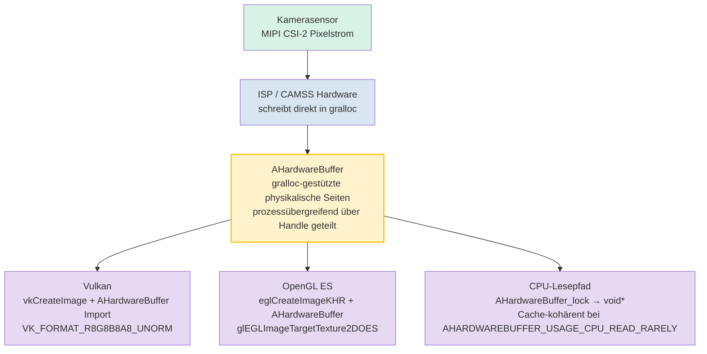

# Kapitel 25: Native Kameraentwicklung

## Zusammenfassung

Die Kapitel 1 bis 24 arbeiteten mit verwaltetem Code: Kotlin oder Java, das auf der ART läuft, wobei für jeden `CaptureRequest` eine Binder-IPC-Grenze überschritten wird und entweder `ByteBuffer`-Kopien von Frames allokiert werden oder der Overhead des durch `SurfaceTexture` vermittelten Textur-Streamings in Kauf genommen wird. Für Social-Kamera-Apps ist dies völlig ausreichend. Für AR-Engines, Echtzeit-Computer-Vision-Pipelines, Rückfahrkameras in Autos oder 3D-Engines mit einem Budget von 16 ms pro Frame ist dies jedoch nicht der Fall.

Die native Kameraentwicklung verlagert die gesamte Schleife aus Öffnen/Konfigurieren/Erfassen nach C/C++ unter Verwendung der NDK-Header `<camera/NdkCameraManager.h>` und `<android/hardware_buffer.h>`. Der unmittelbare Vorteil ist der Wegfall des JNI-Overheads auf dem zeitkritischen Pfad und – was noch entscheidender ist – die Möglichkeit, gralloc-allokierte `AHardwareBuffer`-Objekte direkt als Vulkan-`VkImage`- oder OpenGL-`EGLImage`-Ziele einzubinden, ohne dass ein einziges Byte im Speicher zwischen Sensorausgabe und GPU-Texturabtastung kopiert werden muss.

**Android Camera Parameters** hilft Ihnen zu validieren, dass Ihre Zielgeräte die Garantien für `INFO_SUPPORTED_HARDWARE_LEVEL_FULL` oder `LEVEL_3` bieten, die für einen vorhersehbaren nativen Betrieb auf niedriger Ebene erforderlich sind. Installieren Sie die App aus dem [Google Play Store](https://play.google.com/store/apps/details?id=com.minininja.cameraparams) oder sehen Sie sich den Quellcode auf [github.com/zoozooll/AndroidCameraParameters](https://github.com/zoozooll/AndroidCameraParameters) an.

---

## Warum nativ entwickeln?

Bevor wir in C++ eintauchen, lassen Sie uns präzise feststellen, was Ihnen die native Entwicklung bringt und wann sie die Komplexität rechtfertigt.

### Die Vorteile der nativen Entwicklung

1. **Kein JNI-Overhead auf dem kritischen Pfad.** Eine 60-fps-Pipeline hat 16,67 ms pro Frame Zeit. Ein einzelner JNI-Aufruf von `CallVoidMethod`, der die Grenze zwischen ART und C überschreitet, dauert im Mikrobenchmark etwa 0,5–2 µs, aber die tatsächlichen Kosten liegen im Aufruf *pro Frame*, der Thread-Übergabe, der Buchführung lokaler JNI-Referenzen und dem GC-Druck durch verwaltete `Image`-Proxys. Multipliziert mit vier Kameras, die gleichzeitig eine AR-Sitzung speisen, verbrauchen Sie bereits eine Millisekunde Ihres Budgets nur durch das Überschreiten der Sprachgrenzen. Die native Entwicklung eliminiert dies.

2. **Direkter Speicherbesitz mit `AHardwareBuffer`.** In verwaltetem Code gibt `Image.getPlanes()[0].getBuffer()` einen `ByteBuffer` zurück, der eine *Sicht* auf den gralloc-Speicher ist; das Lesen daraus erzwingt eine Invalidierung des CPU-Caches und oft eine interne Kopie für Formate wie `PRIVATE`. In nativem Code ist der `AHardwareBuffer` das gralloc-Handle selbst, und die GPU kann ihn direkt als Texturspeicher binden.

3. **Integration von AR-/3D-Engines.** Unity, Unreal, Ogre und In-house-Engines sind aus gutem Grund in C++ geschrieben. Das Ausführen der Kamera *innerhalb* des C++-Codes der Render-Schleife eliminiert das Wirrwarr aus "ART + JNI + Render-Thread".

4. **EVS-Migration (External View System) im Automobilbereich.** Vor Android 10 verwendeten Rückfahrkameras in Autos den separaten `EVS`-Stack mit eigener Aufzählung und Streaming-Pipeline. Die OEM-Migrationen 2020–2024 führten EVS auf die Standard-Camera2-NDK-APIs zusammen, wobei `AID_AUTOMOTIVE_EVS_UID = 1071` für den frühzeitigen Hardwarezugriff während des Bootvorgangs reserviert wurde, *bevor* der CameraService des `system_server` überhaupt läuft. Wenn Ihr Code auf den Automobilbereich abzielt, ist native Entwicklung unumgänglich.

### Die Nachteile der nativen Entwicklung

- Das Debuggen ist schwieriger. Abstürze in `ACameraDevice`-Callbacks erzeugen Tombstone-Traces anstelle von schönen Kotlin-Stacktraces.
- Das Lebenszyklus-Management erfolgt vollständig manuell. `ACameraManager` ist *nicht* Lifecycle-aware; das Vergessen von `ACameraCaptureSession_stopRepeating()` + `ACameraDevice_close()` bei der Zerstörung einer Surface leakt Kamera-Ressourcen und kann andere Apps bis zum Neustart blockieren.
- Weniger Workarounds für Geräte. Die Quirk-Datenbank von CameraX existiert in der NDK-Welt nicht; Sie erben das rohe HAL-Verhalten genau so, wie es ausgeliefert wird.
- Kein `DngCreator`, keine `ExifInterface`-Helfer, keine bequemen Accessoren für `CameraCharacteristics` – Sie parsen Metadaten-Tags selbst über `ACameraMetadata_getConstEntry`.

Die Entscheidung ist einfach: Wenn Sie Ihr Frame-Budget in verwaltetem Code nicht einhalten können oder wenn Sie Kamerazugriff beim Booten auf EVS-Niveau benötigen, entwickeln Sie nativ. Andernfalls bleiben Sie bei verwaltetem Code.

---

## ACameraManager: Das NDK-Pendant zum Java-CameraManager

Die NDK-Kamera-API-Oberfläche in `<camera/NdkCameraManager.h>`, `<camera/NdkCameraDevice.h>` und `<camera/NdkCaptureRequest.h>` lässt sich fast eins zu eins auf die Ihnen bekannte Java-API abbilden. Jede Java-Klasse hat ein entsprechendes natives Struct und eine Reihe freier Funktionen:

| Java                          | NDK-Handle / Funktionspräfix                          |
|-------------------------------|-------------------------------------------------------|
| `CameraManager`               | `ACameraManager` · `ACameraManager_*`                 |
| `CameraCharacteristics`       | `ACameraMetadata` · `ACameraMetadata_*`               |
| `CameraDevice`                | `ACameraDevice` · `ACameraDevice_*`                   |
| `CaptureRequest.Builder`      | `ACaptureRequest` · `ACaptureRequest_setEntry_*`      |
| `CameraCaptureSession`        | `ACameraCaptureSession` · `ACameraCaptureSession_*`   |
| `TotalCaptureResult`          | `ACameraCaptureResult` · `ACaptureResult`             |
| `ImageReader`                 | `AImageReader` (aus `<media/NdkImageReader.h>`)      |

Der Lebenszyklus ist identisch: Kameras aufzählen → Merkmale lesen → öffnen → Ausgabe-Surfaces erstellen → Sitzung erstellen → wiederholte Anforderung festlegen → Abbau in umgekehrter Reihenfolge.

### Beispiel 1: Kameras aufzählen, Merkmale lesen, ein Gerät öffnen (C++)

```cpp
#include <camera/NdkCameraManager.h>
#include <camera/NdkCameraDevice.h>
#include <camera/NdkCameraMetadata.h>
#include <android/log.h>

#define LOG_TAG "NativeCam"
#define LOGI(...) __android_log_print(ANDROID_LOG_INFO, LOG_TAG, __VA_ARGS__)
#define LOGE(...) __android_log_print(ANDROID_LOG_ERROR, LOG_TAG, __VA_ARGS__)

static ACameraManager* g_cameraManager = nullptr;
static ACameraDevice* g_cameraDevice = nullptr;

void onDeviceDisconnected(void* ctx, ACameraDevice* dev) {
    LOGI("Kameragerät getrennt");
}

void onDeviceError(void* ctx, ACameraDevice* dev, int err) {
    LOGE("Kameragerätefehler: %d", err);
}

static ACameraDevice_stateCallbacks g_deviceCallbacks = {
    .context = nullptr,
    .onDisconnected = onDeviceDisconnected,
    .onError = onDeviceError,
};

bool enumerateAndOpenBackCamera() {
    g_cameraManager = ACameraManager_create();
    if (!g_cameraManager) {
        LOGE("Erstellen von ACameraManager fehlgeschlagen");
        return false;
    }

    ACameraIdList* cameraIdList = nullptr;
    camera_status_t status = ACameraManager_getCameraIdList(
        g_cameraManager, &cameraIdList);
    if (status != ACAMERA_OK) {
        LOGE("getCameraIdList fehlgeschlagen: %d", status);
        return false;
    }

    const char* chosenId = nullptr;

    for (int i = 0; i < cameraIdList->numCameras; ++i) {
        const char* id = cameraIdList->cameraIds[i];
        ACameraMetadata* chars = nullptr;
        status = ACameraManager_getCameraCharacteristics(
            g_cameraManager, id, &chars);
        if (status != ACAMERA_OK) continue;

        ACameraMetadata_const_entry lensFacingEntry{};
        status = ACameraMetadata_getConstEntry(
            chars,
            ACAMERA_LENS_FACING,
            &lensFacingEntry);

        uint8_t facing = 0;
        if (status == ACAMERA_OK && lensFacingEntry.count > 0) {
            facing = lensFacingEntry.data.u8[0];
        }

        if (facing == ACAMERA_LENS_FACING_BACK) {
            chosenId = id;
            // Ebenfalls das Hardware-Level für die Funktionsprüfung abfragen:
            ACameraMetadata_const_entry hwEntry{};
            if (ACameraMetadata_getConstEntry(
                    chars, ACAMERA_INFO_SUPPORTED_HARDWARE_LEVEL,
                    &hwEntry) == ACAMERA_OK && hwEntry.count > 0) {
                LOGI("Rückkamera %s HW-Level = %d (erwartet %d=FULL %d=LEVEL3)",
                     id, hwEntry.data.u8[0],
                     (int)ACAMERA_INFO_SUPPORTED_HARDWARE_LEVEL_FULL,
                     (int)ACAMERA_INFO_SUPPORTED_HARDWARE_LEVEL_3);
            }
            ACameraMetadata_free(chars);
            break;
        }
        ACameraMetadata_free(chars);
    }

    ACameraManager_deleteCameraIdList(cameraIdList);

    if (!chosenId) {
        LOGE("Keine rückseitige Kamera gefunden");
        return false;
    }

    status = ACameraManager_openCamera(
        g_cameraManager, chosenId,
        &g_deviceCallbacks,
        &g_cameraDevice);

    if (status != ACAMERA_OK) {
        LOGE("openCamera fehlgeschlagen: %d", status);
        return false;
    }

    LOGI("Kamera %s erfolgreich geöffnet", chosenId);
    return true;
}
```

Beachten Sie das Fehlen von Exceptions. Jede Funktion gibt einen `camera_status_t` zurück, und Sie *müssen* jeden Rückgabewert prüfen. `ACAMERA_OK = 0`; jeder Wert ungleich null ist ein spezifischer Fehlercode (`ACAMERA_ERROR_CAMERA_IN_USE`, `ACAMERA_ERROR_CAMERA_DISCONNECTED` usw.). Es gibt keine `CameraAccessException`, die abgefangen werden könnte – wenn Sie den Rückgabewert ignorieren, lässt die Funktion den Ausgabe-Pointer einfach stillschweigend auf `nullptr` und Sie stürzen drei Zeilen später ab.

### Erstellen einer Aufnahmesitzung und Festlegen einer wiederholten Anforderung

Sobald das Gerät geöffnet ist, entspricht das Muster der Sitzungserstellung unter Java. Erstellen Sie ein `ACameraOutputTarget` pro Surface, verpacken Sie diese in einen `ACaptureSessionOutputContainer` und rufen Sie dann `ACameraDevice_createCaptureSession()` auf. Erstellen Sie für wiederholte Anforderungen einen `ACaptureRequest` aus einer Vorlage, fügen Sie Ihr Ausgabeziel hinzu und rufen Sie `ACameraCaptureSession_setRepeatingRequest()` auf. Die Callback-Strukturen (`ACameraCaptureSession_stateCallbacks`, `ACameraCaptureSession_captureCallbacks`) werden zum Zeitpunkt der Sitzungserstellung registriert und entsprechen exakt ihren Java-Pendants.

---

## AHardwareBuffer: Der Zero-Copy-Kritische-Pfad

Dies ist der eigentliche Grund für die native Entwicklung. Der `AHardwareBuffer` (definiert in `<android/hardware_buffer.h>`) ist das NDK-Handle für gralloc-allokierten Speicher – genau der Speicher, in den der Kamera-HAL die Sensor-Pixel schreibt. Wenn Sie eine durch einen `AHardwareBuffer` unterstützte Surface an `ACameraDevice_createCaptureSession` übergeben und dann denselben `AHardwareBuffer` in Vulkan oder OpenGL importieren, erhalten Sie echtes Zero-Copy:



Der `AHardwareBuffer`-Knoten ist das Bindeglied: Es handelt sich um eine einzige Allokation, die vom Schreibendpunkt des Kamera-HALs, dem Textur-Sampler der GPU und optional der CPU gemeinsam genutzt wird. Kein `memcpy`, kein `glTexImage2D`-Upload, kein `ByteBuffer.wrap()` – die GPU-Textur zeigt buchstäblich auf dieselben physikalischen DRAM-Seiten, die die Kamera gerade beschrieben hat.

Für 60-fps-AR-Pipelines bei einem 4K-Stream bedeutet dies eine Einsparung der Bandbreite von ca. 200 ms pro Sekunde (4K × 60 fps × 4 Byte = ~4,7 GB/s gespart) und den Unterschied zwischen einer flüssigen Erfahrung und einem ruckeligen Desaster.

### Beispiel 2: AHardwareBuffer nach Vulkan VkImage, Schritt für Schritt (C++)

```cpp
#include <android/hardware_buffer.h>
#include <vulkan/vulkan.h>
#include <vulkan/vulkan_android.h>

VkImage createVkImageFromAHardwareBuffer(
    VkDevice device,
    AHardwareBuffer* aBuffer,
    VkFormat format,
    uint32_t width,
    uint32_t height) {

    // Schritt 1: AndroidHardwareBufferProperties2KHR füllen
    VkAndroidHardwareBufferPropertiesANDROID ahbProps{};
    ahbProps.sType = VK_STRUCTURE_TYPE_ANDROID_HARDWARE_BUFFER_PROPERTIES_ANDROID;
    VkResult res = vkGetAndroidHardwareBufferPropertiesANDROID(
        device, aBuffer, &ahbProps);
    if (res != VK_SUCCESS) {
        LOGE("vkGetAndroidHardwareBufferPropertiesANDROID fehlgeschlagen: %d", res);
        return VK_NULL_HANDLE;
    }

    // Schritt 2: Den Bild-Import (nicht Allokation) beschreiben
    VkExternalMemoryImageCreateInfo externalInfo{};
    externalInfo.sType = VK_STRUCTURE_TYPE_EXTERNAL_MEMORY_IMAGE_CREATE_INFO;
    externalInfo.handleTypes =
        VK_EXTERNAL_MEMORY_HANDLE_TYPE_ANDROID_HARDWARE_BUFFER_BIT_ANDROID;

    VkImageCreateInfo imgInfo{};
    imgInfo.sType = VK_STRUCTURE_TYPE_IMAGE_CREATE_INFO;
    imgInfo.pNext = &externalInfo;
    imgInfo.imageType = VK_IMAGE_TYPE_2D;
    imgInfo.format = format;             // z. B. VK_FORMAT_R8G8B8A8_UNORM
    imgInfo.extent = { width, height, 1 };
    imgInfo.mipLevels = 1;
    imgInfo.arrayLayers = 1;
    imgInfo.samples = VK_SAMPLE_COUNT_1_BIT;
    imgInfo.tiling = VK_IMAGE_TILING_OPTIMAL;
    imgInfo.usage = VK_IMAGE_USAGE_SAMPLED_BIT |
                    VK_IMAGE_USAGE_TRANSFER_DST_BIT;
    imgInfo.sharingMode = VK_SHARING_MODE_EXCLUSIVE;
    imgInfo.initialLayout = VK_IMAGE_LAYOUT_UNDEFINED;

    VkImage image = VK_NULL_HANDLE;
    res = vkCreateImage(device, &imgInfo, nullptr, &image);
    if (res != VK_SUCCESS) {
        LOGE("vkCreateImage fehlgeschlagen: %d", res);
        return VK_NULL_HANDLE;
    }

    // Schritt 3: VkDeviceMemory allokieren, wobei der AHB IMPORTIERT wird, nicht neu allokiert
    VkMemoryRequirements memReqs{};
    vkGetImageMemoryRequirements(device, image, &memReqs);

    VkImportAndroidHardwareBufferInfoANDROID importInfo{};
    importInfo.sType =
        VK_STRUCTURE_TYPE_IMPORT_ANDROID_HARDWARE_BUFFER_INFO_ANDROID;
    importInfo.buffer = aBuffer;

    VkMemoryDedicatedAllocateInfo dedicatedInfo{};
    dedicatedInfo.sType = VK_STRUCTURE_TYPE_MEMORY_DEDICATED_ALLOCATE_INFO;
    dedicatedInfo.pNext = &importInfo;
    dedicatedInfo.image = image;

    VkMemoryAllocateInfo allocInfo{};
    allocInfo.sType = VK_STRUCTURE_TYPE_MEMORY_ALLOCATE_INFO;
    allocInfo.pNext = &dedicatedInfo;
    allocInfo.allocationSize = memReqs.size;
    allocInfo.memoryTypeIndex = ahbProps.memoryTypeBits
        // memoryTypeIndex muss aus der Schnittmenge von memReqs.memoryTypeBits
        // UND ahbProps.memoryTypeBits gewählt werden. Der Kürze halber weggelassen.
        ;

    VkDeviceMemory mem = VK_NULL_HANDLE;
    res = vkAllocateMemory(device, &allocInfo, nullptr, &mem);
    if (res != VK_SUCCESS) {
        LOGE("vkAllocateMemory Import fehlgeschlagen: %d", res);
        vkDestroyImage(device, image, nullptr);
        return VK_NULL_HANDLE;
    }

    // Schritt 4: Importierten Speicher an das VkImage binden
    vkBindImageMemory(device, image, mem, 0);

    // Schritt 5: Wechsel zum SHADER_READ_ONLY_OPTIMAL Layout über Command-Buffer
    // (weggelassen — Standard Image Memory Barrier für VK_IMAGE_LAYOUT_UNDEFINED
    // → VK_IMAGE_LAYOUT_SHADER_READ_ONLY_OPTIMAL)

    LOGI("AHardwareBuffer erfolgreich als VkImage %p importiert", image);
    return image;
}
```

Der konzeptionelle Sprung, über den die meisten Neulinge stolpern, ist Schritt 3: `vkAllocateMemory` mit `VK_STRUCTURE_TYPE_IMPORT_ANDROID_HARDWARE_BUFFER_INFO_ANDROID` allokiert **nicht**. Es registriert einen bestehenden `AHardwareBuffer` als ein `VkDeviceMemory`-Objekt. Die Bytes wurden bereits von gralloc allokiert, als der Kamera-Produzent die Surface erstellte; Vulkan übernimmt sie lediglich in sein Speichermodell.

Der Pfad für OpenGL ES ist analog, aber kürzer: `eglCreateImageKHR(..., EGL_NATIVE_BUFFER_ANDROID, aBuffer, ...)` → `glEGLImageTargetTexture2DOES(GL_TEXTURE_2D, eglImage)`. Ein Aufruf und Sie können abtasten.

---

## Zusammenfassung der OpenGL- und Vulkan-Interoperabilität

Beide Wege funktionieren. Welchen Sie wählen sollten:

| Faktor                | OpenGL ES 3.x + EGLImage                    | Vulkan 1.1+ + AHB-Import                     |
|-----------------------|----------------------------------------------|----------------------------------------------|
| Einfachheit           | Schnellerer Setup, weniger Zeremoniell       | Mehr Boilerplate, explizite Synchronisation  |
| Synchronisation       | Implizit; der Treiber fügt Barrieren ein     | Explizit; Sie schreiben Pipeline-Barrieren + Semaphoren |
| Multi-Queue/Threading | An einen einzelnen EGLContext pro Thread gebunden | Erstklassige Multi-Queue-Transfers           |
| Automobil-/AR-Zertifizierung | Zertifiziert auf den meisten EVS-Zielen      | Zunehmend für neue AR-Runtimes erforderlich |

Wenn Sie eine bestehende Engine integrieren, wählt die Engine für Sie aus. Wenn Sie auf der grünen Wiese beginnen und maximale Leistung wollen, ist Vulkan die Zukunft. Wenn Sie minimalen Code wollen, ist OpenGL ES über EGLImage immer noch die pragmatische Wahl und wird auf jedem Gerät mit einer Kamera ausgeliefert.

---

## Kontext der EVS-Migration im Automobilbereich: Wechsel zu Camera2 NDK

Zur Vollständigkeit eine kurze Anmerkung zum Migrationspfad im Automobilbereich, auf den in den Forschungsnotizen verwiesen wird. Bis Android 9 verwendeten Rückfahrkameras in Autos den separaten `EVS`-HAL (`android.hardware.automotive.evs@1.0`) mit eigener Aufzählung und Streaming-Pipeline. Beginnend mit Android 10 und vorgeschrieben ab Android 12 für neue IVI-Systeme wurde der EVS-Manager *auf dem Standard-Kamera-HAL3 + NDK-Kamera-Stack* neu implementiert, mit einer neuen reservierten UID `AID_AUTOMOTIVE_EVS_UID = 1071`, die bereits in der Phase `early-boot` Zugriff auf die `CAMERA`-Berechtigungsgruppe erhält – noch bevor der `CameraService` des `system_server` überhaupt initialisiert ist.

In der Praxis bedeutet das, wenn Sie Rückfahrkamera-Code für Autos schreiben:
1. Ihr Prozess läuft als UID 1071.
2. Sie verwenden *exakt* die nativen APIs aus diesem Kapitel (`ACameraManager_openCamera`, `AImageReader`, `AHardwareBuffer` → Vulkan-Import).
3. Sie müssen in der Lage sein, eine Kamera zu öffnen, zu konfigurieren und in weniger als 2 Sekunden ab dem Kaltstart einen Frame auszugeben (Anforderung gemäß FMVSS 111). Aus diesem Grund erfordert der EVS-Stack eine native Umsetzung – jede Millisekunde ART-Startzeit ist eine Millisekunde, die Sie nicht haben.

Die Migration von EVS zu Camera2 NDK ist einer der größten internen Refactorings im Kamera-Ökosystem von Android in den letzten fünf Jahren und der Grund, warum massiv in die NDK-Kamera-APIs ab Android 10 investiert wurde. Wenn Sie dieses Kapitel lesen, um ein Rückfahrkamera-Produkt auszuliefern, verwenden Sie exakt den Codepfad, der von Googles Konformitätstests für die Automobilindustrie vorgeschrieben ist.

---

## Beispiel 3 (Kotlin JNI-Bridge-Stub)

Zur Vollständigkeit ein minimaler Kotlin JNI-Einstiegspunkt, der den obigen C++-Code aufruft:

```kotlin
// NativeBridge.kt
class NativeBridge {

    external fun enumerateAndOpenBackCameraNative(): Boolean

    companion object {
        init {
            System.loadLibrary("native_camera")
        }
    }
}
```

```cpp
// native_camera.cpp JNI export
extern "C" JNIEXPORT jboolean JNICALL
Java_com_example_NativeBridge_enumerateAndOpenBackCameraNative(
    JNIEnv* /*env*/, jobject /*thiz*/) {
    return static_cast<jboolean>(enumerateAndOpenBackCamera() ? JNI_TRUE : JNI_FALSE);
}
```

Und in der `build.gradle`:

```kotlin
android {
    defaultConfig {
        ndk { abiFilters += listOf("arm64-v8a", "armeabi-v7a", "x86_64") }
    }
    externalNativeBuild {
        cmake { path = file("src/main/cpp/CMakeLists.txt") }
    }
}
```

Zusammen mit der entsprechenden `CMakeLists.txt`, die `-lcamera2ndk`, `-lmediandk`, `-landroid` und `-lvulkan` linkt.

---

## Zusammenfassung

Die native Kameraentwicklung tauscht die Ergonomie von verwaltetem Code gegen maximale Leistung und direkten Hardwarebesitz ein. `ACameraManager` und die zugehörigen Strukturen spiegeln die Java Camera2 API eins zu eins wider, nur mit Fehler-Rückgabewerten im C-Stil und manuellem Lebenszyklus. Der eigentliche Gewinn ist der `AHardwareBuffer` – das gralloc-Handle, mit dem Sie die Ausgabe des Kamera-HALs direkt in Vulkan-`VkImage`- oder OpenGL-`EGLImage`-Texturen einspeisen können, ohne den Speicher zu kopieren, was in 60-fps-AR-Pipelines Gigabytes pro Sekunde an DRAM-Bandbreite spart. Für den Automobilbereich macht die EVS-zu-NDK-Migration die native Umsetzung aufgrund der Anforderung eines Boot-Frames innerhalb von 2 Sekunden und des frühzeitigen Hardwarezugriffs über `AID_AUTOMOTIVE_EVS_UID` unumgänglich. Verwenden Sie **Android Camera Parameters**, um zu validieren, dass Ihr Zielgerät `INFO_SUPPORTED_HARDWARE_LEVEL_FULL` oder besser bietet, bevor Sie sich für eine native Implementierung entscheiden.

## Wie geht es weiter?

Ob in Kotlin oder C++, Camera2 ist eine von Natur aus asynchrone API: `StateCallbacks`, `CaptureCallbacks`, `AvailabilityCallbacks`, die alle auf Hintergrund-Threads ausgelöst werden. Kapitel 26 bändigt dieses Chaos mit Kotlin Coroutines und Flow und verwandelt die spaghettifizierte Callback-Hölle, die Sie in den ersten Kapiteln geschrieben haben, in eine saubere, lineare und reaktive Pipeline.
