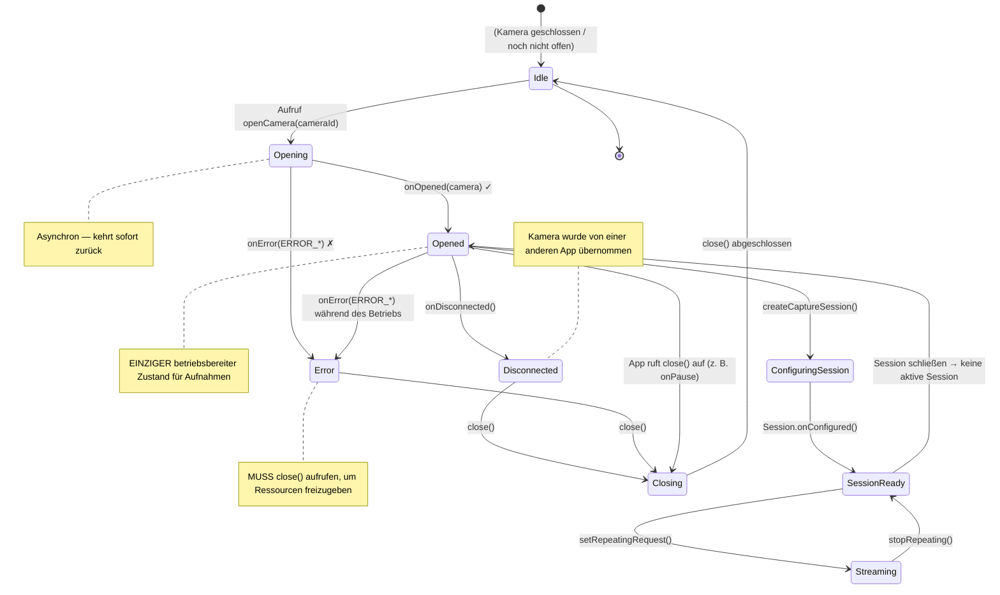

Sie haben alle Kameras auf dem Gerät aufgezählt (Kapitel 6) und diejenige identifiziert, die Sie verwenden möchten – in der Regel die rückseitige Kamera mit dem höchsten Hardware-Level. Der nächste Schritt besteht darin, diese Kamera zu **öffnen**: Stellen Sie eine aktive, hardwarenahe Verbindung zur Kamerahardware her, damit Sie Aufnahmesitzungen konfigurieren und Anforderungen übermitteln können. Das Öffnen einer Kamera ist der Punkt, an dem Ihre App von einem passiven Beobachter von Kamera-Metadaten zu einem aktiven Controller echter Hardware wird.

Wenn Sie produktionsreifen Code für den Lebenszyklus des Öffnens und Schließens einer Kamera sehen möchten, studieren Sie die App **Android Camera Parameters** auf [GitHub](https://github.com/zoozooll/AndroidCameraParameters). Ihre Klasse `Camera2Controller` kapselt das gesamte Lebenszyklus-Management von `CameraDevice`, einschließlich Fehlerbehebung, Retry-Logik und synchroner Bereinigung. Die Version der App im [Google Play Store](https://play.google.com/store/apps/details?id=com.minininja.cameraparams) wurde auf Tausenden von Geräten verschiedenster OEMs installiert, sodass die Sonderfälle, die sie behandelt, in der realen Welt praxiserprobt sind.

## Was ist CameraDevice?

`CameraDevice` ist die Camera2-Klasse, die **eine aktive, offene Verbindung zu einer bestimmten physischen (oder logischen) Kamera auf dem Gerät** repräsentiert. Bevor die Kamera geöffnet wird, können Sie nur ihre Merkmale lesen; sobald sie geöffnet ist, können Sie:
- `CameraCaptureSession`s erstellen (Kapitel 8)
- `CaptureRequest`s einreichen (Kapitel 8 und 9)
- Dynamische `CaptureResult`-Metadaten lesen, wenn Frames eintreffen
- Ausstehende Anforderungen leeren (flush), Aufnahmen abbrechen und das Gerät schließen

Ein `CameraDevice` hat zwei kritische Eigenschaften:

1. **Es ist eine Ressource für einen einzelnen Benutzer.** Nur eine App (und innerhalb Ihrer App nur eine `CameraDevice`-Instanz) kann eine bestimmte Kamera gleichzeitig offen halten. Wenn eine App mit höherer Priorität (z. B. ein eingehender Videoanruf) die Kamera benötigt, wird Ihre App zwangsweise getrennt.
2. **Es hat einen strengen, Callback-gesteuerten Lebenszyklus.** Sie können ein `CameraDevice` nicht über einen Konstruktor erstellen. Der einzige Weg, eines zu erhalten, ist über `CameraManager.openCamera()`, das die Instanz asynchron über einen `StateCallback` liefert. Sie müssen jeden Callback für Zustandsübergänge respektieren.

Die Beziehung zwischen `CameraManager`, einer Kamera-ID und dem resultierenden `CameraDevice` ist:

```
CameraManager.openCamera("0", callback, handler)
    │
    ├── Asynchroner Aufruf → kehrt sofort zurück
    │
    └───── Auf Hintergrund-Thread (via Handler) ────→ StateCallback.onOpened(cameraDevice)
                                                          │
                                                          ▼
                                                  Jetzt können Sie cameraDevice verwenden für:
                                                  • createCaptureSession(...)
                                                  • createCaptureRequest(...)
```

## Der StateCallback: Die Lebenszyklus-Maschine von CameraDevice

`CameraDevice.StateCallback` ist eine abstrakte Klasse mit drei Methoden, die Sie implementieren **müssen**. Jede offene Kamera wird schließlich mindestens einen dieser Callbacks auslösen (entweder `onOpened`, gefolgt von `onDisconnected`/`onError`, oder direkt `onError`, wenn das Öffnen fehlschlägt). Die Kamera kann erst für Aufnahmen verwendet werden, wenn `onOpened` ausgelöst wurde.

### Die drei StateCallback-Methoden

| Methode | Aufgerufen, wenn | Was zu tun ist |
|---|---|---|
| `onOpened(camera: CameraDevice)` | Die Kamera wurde erfolgreich geöffnet und ist bereit für die Verwendung. | Speichern Sie die `camera`-Referenz in einer Eigenschaft. Fahren Sie mit der Konfiguration einer Aufnahmesitzung fort (Kapitel 8). Geben Sie jedes Semaphore-Permit frei, falls Sie eines erworben haben. |
| `onDisconnected(camera: CameraDevice)` | Die Kamera wurde Ihrer App entzogen (z. B. hat eine andere App mit höherer Priorität sie geöffnet, der Benutzer ist zu einer kamera-intensiven App im Vordergrund gewechselt oder die Geräte-Richtlinie hat sie deaktiviert). | Rufen Sie sofort `camera.close()` auf. Setzen Sie Ihre gespeicherte Referenz auf null. Die Kamera kann nicht wieder geöffnet werden, bis Ihre App wieder in den Vordergrund tritt (an diesem Punkt wird `onResume` den Versuch wiederholen). |
| `onError(camera: CameraDevice, error: Int)` | Ein schwerwiegender Fehler ist während des Öffnens oder während des Betriebs der Kamera aufgetreten. Der Parameter `error` ist eine der unten beschriebenen `ERROR_*`-Konstanten. | Rufen Sie `camera.close()` auf. Setzen Sie die Referenz auf null. Je nach Fehlercode sollten Sie entweder eine Fehlermeldung für den Benutzer anzeigen oder es mit einem exponentiellen Backoff erneut versuchen. Geben Sie die Semaphore immer frei. |

### Die `onError`-Fehlercodes

Der Integer `error` in `onError` ist einer von fünf Konstanten (definiert in `CameraDevice.StateCallback`):

| Konstante | Wert | Bedeutung | Behebung |
|---|---|---|---|
| `ERROR_CAMERA_IN_USE` | `1` | Die Kamera ist bereits von einer anderen App oder vom System-Kameradienst geöffnet. | Kann nicht automatisch behoben werden; warten Sie auf `onResume`, wenn der Benutzer zu Ihrer App zurückkehrt, und versuchen Sie es erneut. |
| `ERROR_MAX_CAMERAS_IN_USE` | `2` | Das Gerät hat ein Limit für die Anzahl der Kameras, die gleichzeitig offen sein können; Sie haben es überschritten, indem Sie versucht haben, diese Kamera zu öffnen (häufig bei Multi-Kamera-Flaggschiffen). | Schließen Sie einige andere offene `CameraDevice`s, die Sie möglicherweise halten, und versuchen Sie es dann erneut. Auf Geräten mit Hardware-Limits können typischerweise nur 2–3 Kameras gleichzeitig offen sein. |
| `ERROR_CAMERA_DISABLED` | `3` | Die Geräte-Richtlinie (MDM, Kindersicherung, Kiosk-Modus) hat alle Kameras deaktiviert. | Zeigen Sie dem Benutzer eine dauerhafte Fehlermeldung an. Erneute Versuche helfen nicht, bis die Richtlinie geändert wird. |
| `ERROR_CAMERA_DEVICE` | `4` | Die Kamera-Hardware/Firmware ist auf einen nicht behebbaren Fehler gestoßen. | Schließen Sie das Gerät. Benachrichtigen Sie den Benutzer. Ein erneuter Versuch kann auf einigen Geräten helfen (bei vorübergehenden Firmware-Glitchs), daher sind ein oder zwei Versuche mit Backoff angemessen. |
| `ERROR_CAMERA_SERVICE` | `5` | Der systemweite Kameradienst selbst ist abgestürzt. Dies ist ein Fehler auf Plattformebene, nicht die Schuld Ihrer App. | Schließen und nullen Sie alles. Normalerweise startet der Kameradienst innerhalb weniger Sekunden automatisch neu; Sie können es nach einer Verzögerung erneut versuchen oder auf das nächste `onResume` warten. |

Das Zustandsdiagramm unten zeigt jeden gültigen Übergang eines `CameraDevice` von dem Moment an, in dem Sie `openCamera()` aufrufen, bis zu dem Zeitpunkt, an dem Sie (oder das System) es schließen:



Wichtige Erkenntnisse aus dem Zustandsdiagramm:

1. **Opened ist der einzige betriebsbereite Zustand.** Bevor `onOpened` ausgelöst wird und nach jedem Fehler/Trennung muss die `CameraDevice`-Referenz als unbrauchbar betrachtet werden.
2. **Schließen in jedem Endzustand.** Unabhängig davon, ob Sie `onError`, `onDisconnected` erhalten oder sich einfach dazu entschließen, proaktiv in `onPause` zu schließen: **Rufen Sie immer `close()` auf**. Das Versäumnis, eine Kamera zu schließen, führt zu Lecks, die verhindern, dass **irgendeine** App (einschließlich Ihrer) sie wieder öffnen kann, bis der Prozess stirbt oder der Systemdienst neu startet.
3. **onError ist terminal.** Nach `onError` ist diese spezifische `CameraDevice`-Instanz tot. Versuchen Sie nicht, sie wiederherzustellen; schließen Sie sie und versuchen Sie ein frisches `openCamera()`, wenn Sie glauben, dass der Fehler vorübergehend war.

## Integration in den Lebenszyklus mit Activity onPause/onResume

Der Lebenszyklus der Android Activity ist untrennbar mit dem Lebenszyklus von `CameraDevice` verbunden. Kamerahardware ist eine gemeinsam genutzte, stromintensive Ressource; das System beendet aggressiv Apps, die Kameras halten, während sie sich im Hintergrund befinden. Die kanonischen Regeln lauten:

### Wann die Kamera zu öffnen ist (onResume)

In `onResume` (nach dem Start des Hintergrund-Threads, wie wir es in Kapitel 5 festgelegt haben):
1. Überprüfen Sie, ob die Berechtigungen noch erteilt sind (der Benutzer könnte sie in den Einstellungen entzogen haben, während die App im Hintergrund war).
2. Wenn ein `CameraDevice` bereits offen ist, ist alles bestens.
3. Wenn kein `CameraDevice` offen ist, rufen Sie `openCamera()` mit der ID auf, die Sie in Kapitel 6 ausgewählt haben.

### Wann die Kamera zu schließen ist (onPause)

In `onPause` (vor dem Stoppen des Hintergrund-Threads):
1. Wenn eine wiederholte Anforderung aktiv ist (Vorschau läuft – Kapitel 8), stoppen Sie diese mit `cameraCaptureSession.stopRepeating()`.
2. Wenn eine offene Aufnahmesitzung existiert, schließen Sie diese mit `cameraCaptureSession.close()`.
3. Schließen Sie das `CameraDevice` selbst mit `cameraDevice.close()`.
4. Setzen Sie alle drei Referenzen (Session, Device und den ausstehenden Request-Builder) auf null.
5. Erst dann (und nur dann) stoppen Sie den Hintergrund-Thread.

Wenn Sie die Reihenfolge umkehren (z. B. den Thread stoppen, **bevor** Sie die Kamera schließen), haben die Callbacks, die `close()` ausführen muss, keinen Ort mehr, an dem sie ausgeführt werden können, und Sie erhalten Deadlocks, ANRs oder Warnungen wie `Handler ... sending message to a Handler on a dead thread` in Logcat.

## Nebenläufigkeitssteuerung mit Semaphore

Es gibt eine subtile Race Condition, über die selbst erfahrene Camera2-Entwickler stolpern: **Was passiert, wenn der Benutzer schnell zwischen Apps wechselt und dadurch `openCamera()` erneut aufgerufen wird, bevor der asynchrone Callback des vorherigen Öffnens ausgelöst wurde?**

Sie enden mit zwei gleichzeitigen Versuchen, dieselbe Kamera zu öffnen. Der System-Kameradienst kann einen davon ablehnen mit `ERROR_CAMERA_IN_USE` oder den ersten mitten im Öffnen trennen – in jedem Fall muss Ihr Callback-Code mit veralteten Referenzen und Double-Close-Bugs zurechtkommen.

Die Lösung ist eine **`Semaphore`**, die mit 1 Permit initialisiert wird (ein binärer Lock / Mutex):

- Bevor Sie `openCamera()` aufrufen, erwerben Sie das Permit. Wenn der Erwerb fehlschlägt (Timeout), überspringen Sie diesen Versuch (der vorherige ist noch im Gange).
- In **jedem terminalen Callback** (`onOpened`, `onDisconnected`, `onError`) geben Sie das Permit frei.
- In `onPause` geben Sie das Permit nach dem Schließen der Kamera sicherheitshalber noch einmal frei, falls es noch gehalten wurde.

`Semaphore.tryAcquire(timeout, unit)` ist die richtige Methode: Sie blockiert für maximal `timeout` Millisekunden und gibt dann `false` zurück, wenn das Permit nicht erhalten werden konnte. Verwenden Sie niemals das blockierende `acquire()` ohne Timeout im Haupt-Thread – das kann zu einem ANR führen.

## Handhabung von CameraAccessException

`CameraManager.openCamera()` wirft eine geprüfte `CameraAccessException`. Im Gegensatz zu den Fehlercodes, die über `StateCallback.onError` geliefert werden (welche Fehler nach dem Öffnen sind), treten diese Ausnahmen **während des Öffnungsversuchs selbst** auf, bevor überhaupt ein `CameraDevice`-Objekt existiert. Die vier häufigsten Ursachen:

| Grund (aus `e.reason`) | Bedeutung |
|---|---|
| `CAMERA_IN_USE` (`4`) | Entspricht der Callback-Version – eine andere App hält die Kamera. |
| `MAX_CAMERAS_IN_USE` (`5`) | Hardware-Kameralimit erreicht. |
| `CAMERA_DISABLED` (`1`) | Durch Richtlinien deaktiviert (MDM / Arbeitsprofil). |
| `CAMERA_ERROR` (`3`) | Sammelfehler bei Hardware-Versagen während des Öffnens. |

Umschließen Sie `openCamera()` immer mit einem try/catch für `CameraAccessException` und auch `IllegalArgumentException` (für den Fall, dass die Kamera-ID zwischen der Aufzählung in Kapitel 6 und jetzt ungültig wurde – z. B. eine externe USB-Cam wurde ausgesteckt).

## Vollständiger Kotlin-Code: Eine Kamera öffnen

Hier ist der vollständige Code der `MainActivity`, der alles aus diesem Kapitel integriert. Wir erweitern die Codebasis aus Kapitel 6 um die Methode `openCamera()`, einen vollständigen `StateCallback`, `Semaphore`-basierte Nebenläufigkeitssteuerung, Integration in den Lebenszyklus der Activity und eine umfassende Fehlerbehandlung.

```kotlin
package com.example.camera2tutorial

import android.Manifest
import android.content.Context
import android.content.pm.PackageManager
import android.hardware.camera2.CameraAccessException
import android.hardware.camera2.CameraCharacteristics
import android.hardware.camera2.CameraDevice
import android.hardware.camera2.CameraManager
import android.hardware.camera2.CameraMetadata
import android.os.Bundle
import android.os.Handler
import android.os.HandlerThread
import android.util.Log
import android.widget.Toast
import androidx.appcompat.app.AppCompatActivity
import androidx.core.app.ActivityCompat
import androidx.core.content.ContextCompat
import java.util.concurrent.Semaphore
import java.util.concurrent.TimeUnit

class MainActivity : AppCompatActivity() {

    private lateinit var backgroundThread: HandlerThread
    private lateinit var backgroundHandler: Handler
    private lateinit var cameraManager: CameraManager

    // Verhindern mehrerer gleichzeitiger Kamera-Öffnungsvorgänge
    private val cameraOpenCloseLock = Semaphore(1)

    // Das aktive geöffnete Kameragerät (nullfähig)
    private var cameraDevice: CameraDevice? = null

    // Ausgewählte Kamera-ID (aus dem Entdeckungsschritt in Kapitel 6)
    private var selectedCameraId: String? = null

    override fun onCreate(savedInstanceState: Bundle?) {
        super.onCreate(savedInstanceState)
        setContentView(R.layout.activity_main)

        if (allPermissionsGranted()) {
            initializeCameraManager()
        } else {
            ActivityCompat.requestPermissions(
                this,
                REQUIRED_PERMISSIONS,
                REQUEST_CODE_PERMISSIONS
            )
        }
    }

    override fun onResume() {
        super.onResume()
        startBackgroundThread()

        if (allPermissionsGranted()) {
            if (!this::cameraManager.isInitialized) {
                initializeCameraManager()
            }
            // Berechtigung OK, aber Kamera noch nicht offen → jetzt öffnen
            if (cameraDevice == null && selectedCameraId != null) {
                openCamera(selectedCameraId!!)
            }
        } else {
            // Benutzer hat Berechtigungen entzogen, während die App im Hintergrund war
            ActivityCompat.requestPermissions(
                this,
                REQUIRED_PERMISSIONS,
                REQUEST_CODE_PERMISSIONS
            )
        }
    }

    override fun onPause() {
        closeCamera()
        stopBackgroundThread()
        super.onPause()
    }

    private fun startBackgroundThread() {
        backgroundThread = HandlerThread("Camera2Background").apply { start() }
        backgroundHandler = Handler(backgroundThread.looper)
    }

    private fun stopBackgroundThread() {
        backgroundThread.quitSafely()
        try {
            backgroundThread.join(1000)
        } catch (e: InterruptedException) {
            Log.e(TAG, "Unterbrochen beim Beenden des Hintergrund-Threads", e)
        }
    }

    private fun initializeCameraManager() {
        cameraManager = getSystemService(Context.CAMERA_SERVICE) as CameraManager
        discoverCamerasAndSelectDefault()
    }

    // ----------------- Kapitel 6 (gekürzt): Entdeckung + Auswahl -----------------
    data class CameraInfo(val id: String, val lensFacing: Int?, val hardwareLevel: Int?)

    private fun discoverCamerasAndSelectDefault() {
        val cameraIds = try { cameraManager.cameraIdList } catch (_: CameraAccessException) { emptyArray() }
        val discovered = mutableListOf<CameraInfo>()
        for (id in cameraIds) {
            val chars = try { cameraManager.getCameraCharacteristics(id) } catch (_: Exception) { continue }
            discovered += CameraInfo(
                id,
                chars.get(CameraCharacteristics.LENS_FACING),
                chars.get(CameraCharacteristics.INFO_SUPPORTED_HARDWARE_LEVEL)
            )
        }
        // Bevorzugt Rückkamera mit höchstem Hardware-Level
        val backCandidates = discovered.filter { it.lensFacing == CameraCharacteristics.LENS_FACING_BACK }
            .sortedByDescending { it.hardwareLevel ?: -1 } // LEVEL_3 > FULL > LIMITED > LEGACY
        val frontCandidates = discovered.filter { it.lensFacing == CameraCharacteristics.LENS_FACING_FRONT }
            .sortedByDescending { it.hardwareLevel ?: -1 }

        selectedCameraId = (backCandidates + frontCandidates).firstOrNull()?.id
        Log.d(TAG, "Ausgewählte Kamera zum Öffnen: ID=$selectedCameraId")

        // Beim ersten Start sofort öffnen, wenn der Thread bereit ist
        if (selectedCameraId != null && this::backgroundHandler.isInitialized) {
            openCamera(selectedCameraId!!)
        }
    }

    // -------------------------------------------------------------------------
    // 🎯 ERGÄNZUNGEN KAPITEL 7: openCamera() + StateCallback + closeCamera()
    // -------------------------------------------------------------------------
    private val stateCallback = object : CameraDevice.StateCallback() {

        override fun onOpened(camera: CameraDevice) {
            // Permit wurde in openCamera() erworben; jetzt freigeben, da das Öffnen erfolgreich war
            cameraOpenCloseLock.release()
            cameraDevice = camera
            Log.d(TAG, "✅ Kamera erfolgreich geöffnet: ID=${camera.id}")
            Toast.makeText(
                this@MainActivity,
                "Kamera ${camera.id} erfolgreich geöffnet!",
                Toast.LENGTH_SHORT
            ).show()

            // TODO Kapitel 8: Hier werden wir eine CameraCaptureSession für die Vorschau erstellen.
            // Feiern wir erst einmal das erfolgreiche Öffnen — wir haben ein aktives CameraDevice!
        }

        override fun onDisconnected(camera: CameraDevice) {
            cameraOpenCloseLock.release()
            Log.w(TAG, "⚠️ Verbindung zur Kamera getrennt (von einer anderen App übernommen): ID=${camera.id}")
            cameraDevice?.close()
            cameraDevice = null
        }

        override fun onError(camera: CameraDevice, error: Int) {
            cameraOpenCloseLock.release()
            Log.e(TAG, "❌ Kamerafehler bei ID=${camera.id}. Code=$error (${errorCodeToString(error)})")

            cameraDevice?.close()
            cameraDevice = null

            // Fehlermeldung für den Benutzer je nach Fehlertyp anzeigen
            val userMsg = when (error) {
                ERROR_CAMERA_IN_USE ->
                    "Die Kamera wird von einer anderen App verwendet. Schließen Sie andere Kamera-Apps und versuchen Sie es erneut."
                ERROR_MAX_CAMERAS_IN_USE ->
                    "Zu viele Kameras sind offen. Dieses Gerät begrenzt die Anzahl der gleichzeitig aktiven Kameras."
                ERROR_CAMERA_DISABLED ->
                    "Die Kamera wurde durch eine Geräte-Richtlinie deaktiviert (Kindersicherung, Arbeitsprofil usw.)."
                ERROR_CAMERA_DEVICE ->
                    "Ein Hardwarefehler der Kamera ist aufgetreten. Versuchen Sie, Ihr Gerät neu zu starten, falls dies weiterhin besteht."
                ERROR_CAMERA_SERVICE ->
                    "Der System-Kameradienst ist abgestürzt. Bitte versuchen Sie es in einem Moment erneut."
                else ->
                    "Ein unbekannter Kamerafehler ist aufgetreten (Code=$error)."
            }
            Toast.makeText(this@MainActivity, userMsg, Toast.LENGTH_LONG).show()
        }
    }

    private fun openCamera(cameraId: String) {
        if (ContextCompat.checkSelfPermission(this, Manifest.permission.CAMERA)
            != PackageManager.PERMISSION_GRANTED
        ) {
            Log.w(TAG, "openCamera übersprungen: CAMERA-Berechtigung nicht erteilt")
            return
        }

        // ----- Semaphore mit Timeout (2,5 Sekunden) erwerben, um Blockieren zu vermeiden -----
        val acquired = try {
            cameraOpenCloseLock.tryAcquire(2500, TimeUnit.MILLISECONDS)
        } catch (e: InterruptedException) {
            Log.e(TAG, "Unterbrochen beim Warten auf die Semaphore zum Öffnen der Kamera", e)
            false
        }
        if (!acquired) {
            Log.e(TAG, "Timeout beim Warten auf Semaphore — ein anderer Öffnungs-/Schließvorgang läuft")
            Toast.makeText(this, "Die Kamera ist beschäftigt. Bitte versuchen Sie es erneut.", Toast.LENGTH_SHORT).show()
            return
        }

        try {
            Log.d(TAG, "Fordere Kamera-Öffnung an für ID=$cameraId")
            cameraManager.openCamera(
                cameraId,        // Welche Kamera geöffnet werden soll
                stateCallback,   // Lebenszyklus-Callbacks (onOpened, onDisconnected, onError)
                backgroundHandler// Thread/Looper, auf dem Callbacks laufen (NICHT der Haupt-Thread!)
            )
        } catch (e: CameraAccessException) {
            Log.e(TAG, "CameraAccessException während openCamera. Grund=${e.reason}", e)
            cameraOpenCloseLock.release() // Permit nicht halten, wenn openCamera() eine Exception geworfen hat
            val msg = when (e.reason) {
                CameraAccessException.CAMERA_IN_USE -> "Kamera wird von einer anderen App verwendet."
                CameraAccessException.MAX_CAMERAS_IN_USE -> "Momentan sind zu viele Kameras offen."
                CameraAccessException.CAMERA_DISABLED -> "Kamera durch Geräte-Richtlinie deaktiviert."
                CameraAccessException.CAMERA_ERROR -> "Hardwarefehler der Kamera während des Öffnens."
                else -> "Unbekannte CameraAccessException (Grund=${e.reason})"
            }
            Toast.makeText(this, msg, Toast.LENGTH_LONG).show()
        } catch (e: IllegalArgumentException) {
            Log.e(TAG, "Ungültige Kamera-ID: $cameraId", e)
            cameraOpenCloseLock.release()
            Toast.makeText(this, "Die angeforderte Kamera existiert nicht mehr.", Toast.LENGTH_LONG).show()
        } catch (e: SecurityException) {
            Log.e(TAG, "SecurityException — Kameraberechtigung mitten im Aufruf entzogen?", e)
            cameraOpenCloseLock.release()
        }
    }

    private fun closeCamera() {
        try {
            // Blockieren, bis wir das Permit erhalten (Schließen sollte immer das Rennen gewinnen)
            cameraOpenCloseLock.acquire()

            // Kapitel 8 TODO: Zuerst Aufnahmesitzung schließen, falls vorhanden
            // captureSession?.close()
            // captureSession = null

            cameraDevice?.close()
            cameraDevice = null
            Log.d(TAG, "🔒 Kamera geschlossen und alle Ressourcen freigegeben")
        } catch (e: InterruptedException) {
            Log.e(TAG, "Unterbrochen beim Schließen der Kamera", e)
        } finally {
            cameraOpenCloseLock.release() // Immer freigeben, auch wenn close() eine Exception geworfen hat
        }
    }

    // -------------------------------------------------------------------------
    // Helfer & Berechtigungs-Plumbing
    // -------------------------------------------------------------------------
    private fun errorCodeToString(error: Int): String = when (error) {
        CameraDevice.StateCallback.ERROR_CAMERA_IN_USE -> "ERROR_CAMERA_IN_USE"
        CameraDevice.StateCallback.ERROR_MAX_CAMERAS_IN_USE -> "ERROR_MAX_CAMERAS_IN_USE"
        CameraDevice.StateCallback.ERROR_CAMERA_DISABLED -> "ERROR_CAMERA_DISABLED"
        CameraDevice.StateCallback.ERROR_CAMERA_DEVICE -> "ERROR_CAMERA_DEVICE"
        CameraDevice.StateCallback.ERROR_CAMERA_SERVICE -> "ERROR_CAMERA_SERVICE"
        else -> "UNKNOWN_ERROR"
    }

    companion object {
        private const val TAG = "Camera2Tutorial"
        private const val REQUEST_CODE_PERMISSIONS = 10
        private val REQUIRED_PERMISSIONS = arrayOf(Manifest.permission.CAMERA)
    }

    private fun allPermissionsGranted() = REQUIRED_PERMISSIONS.all {
        ContextCompat.checkSelfPermission(baseContext, it) == PackageManager.PERMISSION_GRANTED
    }

    override fun onRequestPermissionsResult(
        requestCode: Int,
        permissions: Array<out String>,
        grantResults: IntArray
    ) {
        super.onRequestPermissionsResult(requestCode, permissions, grantResults)
        if (requestCode == REQUEST_CODE_PERMISSIONS) {
            if (allPermissionsGranted()) {
                initializeCameraManager()
            } else {
                Toast.makeText(
                    this,
                    "Die Kameraberechtigung ist erforderlich, um diese App zu nutzen.",
                    Toast.LENGTH_LONG
                ).show()
                finish()
            }
        }
    }
}
```

### Tiefer Einblick in die Semaphore-Logik

Das Muster `Semaphore(1)` im obigen Code verhindert drei spezifische Fehlerklassen:

1. **Race Condition bei doppeltem Öffnen (onResume + onCreate lösen beide openCamera aus)**: Nur einer der Aufrufe erhält das Permit; der andere läuft ins Timeout und bricht sauber ab.
2. **Race Condition zwischen Öffnen und Schließen (Benutzer tippt auf Home, während das Öffnen läuft)**: `closeCamera()` in `onPause` blockiert bei `acquire()` (kein Timeout – Schließen darf immer warten), bis das laufende Öffnen entweder erfolgreich war oder fehlgeschlagen ist. Das Permit wird dann im finally-Block wieder freigegeben.
3. **Vergessene Freigabe des Permits in Fehlerpfaden**: Jeder Pfad aus `openCamera()` heraus (Erfolgsfall über `onOpened`, Fehler über `onError`, Exceptions) gibt das Permit frei. Wenn ein Pfad dies vergisst, wird das nächste `openCamera` permanent ins Timeout laufen – die defensive Freigabe im finally-Block von `closeCamera` ist das Sicherheitsnetz.

### Warum `backgroundHandler` an `openCamera` übergeben wird

Das dritte Argument von `CameraManager.openCamera()` ist der optionale `Handler`, der angibt, welcher `Looper` eines Threads den `StateCallback` ausführen soll. Die Übergabe von `null` bedeutet, dass der Handler des Haupt-Threads verwendet wird – genau davor haben wir in Kapitel 5 gewarnt. Durch die Übergabe von `backgroundHandler` stellen wir sicher, dass:
- `onOpened`, `onDisconnected` und `onError` alle auf dem dedizierten `Camera2Background`-Thread laufen.
- Jede intensive Arbeit (wie `createCaptureSession` in Kapitel 8), die wir innerhalb von `onOpened` anstoßen, ebenfalls abseits des Haupt-Threads läuft, was ein Ruckeln der UI verhindert.

## Verifizierung: Was beim Ausführen zu erwarten ist

Wenn Sie den Code aus Kapitel 7 auf einem physischen Gerät ausführen:

1. **Erster Start (nach Erteilung der Berechtigungen)**:
   - Logcat zeigt `Ausgewählte Kamera zum Öffnen: ID=0` → `Fordere Kamera-Öffnung an für ID=0` → eine kurze Pause → `✅ Kamera erfolgreich geöffnet: ID=0`.
   - Ein Toast bestätigt: *"Kamera 0 erfolgreich geöffnet!"*
   - An diesem Punkt ist die Kamerahardware aktiv. Wenn Sie das Telefon halten, spüren Sie möglicherweise, wie sich das Kameramodul nach einigen Sekunden leicht erwärmt (es ist eingeschaltet, produziert aber noch keine Bilder).

2. **Drücken der Home-Taste (schickt die App in den Hintergrund)**:
   - `onPause` wird ausgelöst → `🔒 Kamera geschlossen und alle Ressourcen freigegeben` in Logcat.
   - Die Kamera wurde sauber geschlossen. Das System kann sie nun einer anderen App übergeben.

3. **Rückkehr zur App**:
   - `onResume` wird ausgelöst → Thread startet → `openCamera` wird erneut aufgerufen → erneut `✅ Kamera erfolgreich geöffnet`.
   - Dieser Zyklus (Öffnen → Schließen → Öffnen) muss augenblicklich und zuverlässig funktionieren. Testen Sie ihn mehr als 10-mal schnell hintereinander, um sicherzustellen, dass keine ANRs auftreten.

4. **Stresstest: Eine andere Kamera-App öffnen, während Ihre läuft**:
   - Während Ihre App den Toast "Kamera geöffnet" anzeigt, drücken Sie Home, starten Sie die integrierte Kamera-App und kehren Sie dann zu Ihrer zurück.
   - Wenn Sie Ihre App verlassen, wird `closeCamera()` sauber ausgeführt. Wenn die Standardkamera offen bleibt, während Sie versuchen, zu Ihrer zurückzukehren, sehen Sie `onDisconnected` oder `ERROR_CAMERA_IN_USE` – dies sind **korrekte und erwartete Verhaltensweisen**, keine Fehler. Ihre App geht damit ordnungsgemäß um.

Die Release-Builds der App Android Camera Parameters ([Google Play](https://play.google.com/store/apps/details?id=com.minininja.cameraparams)) enthalten automatisierte ANR-Tests, die `open/close` 1.000-mal hintereinander auf jeder größeren Gerätefamilie durchlaufen; das hier beschriebene Muster `Semaphore(1)` + `tryAcquire` ist genau das, was diese Tests ohne einen einzigen ANR oder Deadlock besteht.

## Fehlerbehebung bei häufigen Fehlern beim Öffnen

### `onError` mit `ERROR_CAMERA_IN_USE` wird bei jedem Versuch ausgelöst

Dies passiert am häufigsten, wenn:
- Sie einen Emulator verwenden, bei dem die AVD-Kamera auf `Webcam0` eingestellt ist und eine andere Desktop-App (Zoom, Teams, OBS, die integrierte Kamera-App) die Webcam des Laptops verwendet. Schließen Sie alle Desktop-Anwendungen, die die Webcam nutzen, und versuchen Sie es erneut.
- Ihre eigene App eine geleakte `CameraDevice`-Referenz aus einem vorherigen Installationszyklus hat. Deinstallieren Sie die App und installieren Sie sie neu (was den Prozess killt) oder starten Sie das Gerät neu.
- Einige Custom-ROMs einen bekannten Bug haben, bei dem der System-Kameradienst eine geleakte Referenz hält; nur ein Neustart des Geräts hilft hier.

### `tryAcquire` läuft bei jedem `openCamera` ins Timeout

Dies bedeutet, dass das Permit niemals freigegeben wird. Überprüfen Sie jeden Pfad:
1. Gibt jeder `catch`-Block in `openCamera` das Permit frei?
2. Geben alle drei Callbacks (`onOpened`, `onDisconnected`, `onError`) das Permit frei?
3. Wird das Permit im `finally`-Block von `closeCamera` freigegeben?

Fügen Sie `Log.d`-Zeilen unmittelbar vor und nach jedem `acquire`/`release`-Aufruf hinzu, gepaart mit `cameraOpenCloseLock.availablePermits`, um die Anzahl der Permits zu überwachen. Die Anzahl sollte immer `1` sein, wenn die Kamera geschlossen ist, und `0`, wenn ein Öffnungsvorgang läuft.

### `Handler sending message to a Handler on a dead thread` nach onPause

Dies tritt auf, wenn Sie `stopBackgroundThread()` **vor** `closeCamera()` aufrufen. In der richtigen Reihenfolge aus dem obigen Code wird `closeCamera()` zuerst ausgeführt (während der Thread noch aktiv ist), dann `stopBackgroundThread()`. Wenn Ihr Code dies umkehrt, tauschen Sie die Aufrufe wieder aus.

## Zusammenfassung

In diesem Kapitel haben Sie den entscheidenden Schritt getan, die Kamerahardware einzuschalten und ein aktives, offenes `CameraDevice`-Objekt zu halten. Sie haben gelernt:

1. **Was CameraDevice repräsentiert**: Eine aktive Verbindung zu einer bestimmten Kamerahardware-Einheit mit dem exklusiven Recht, Aufnahmeanforderungen an diese zu senden.
2. **StateCallback und seine drei Methoden**: `onOpened` (Kamera ist nutzbar), `onDisconnected` (Kamera wurde entzogen – sofort schließen), `onError` (schwerwiegender Fehler – schließen und für jeden der 5 Fehlercodes eine entsprechende Benutzermeldung anzeigen).
3. **Integration in den Lebenszyklus der Activity**: Die kanonischen Regeln, wann zu öffnen (`onResume`, nach dem Start des Threads, nach erneuter Prüfung der Berechtigungen) und wann zu schließen ist (`onPause`, vor dem Stoppen des Threads, Session schließen → Device schließen → Referenzen nullen → Thread stoppen).
4. **Nebenläufigkeitssteuerung mit Semaphore**: Wie eine `Semaphore(1)` mit `tryAcquire(2500ms)` das doppelte Öffnen, das Rennen zwischen Öffnen und Schließen und vergessene Freigaben verhindert; wie das Permit in jedem terminalen Pfad (Callbacks + Catches + finally-Block von close) freigegeben wird.
5. **Handhabung von CameraAccessException**: Die vier Ausnahmegründe (`CAMERA_IN_USE`, `MAX_CAMERAS_IN_USE`, `CAMERA_DISABLED`, `CAMERA_ERROR`) und wie man jeden davon dem Benutzer in einfacher Sprache präsentiert.

Die Dreifaltigkeit aus `openCamera()` + `StateCallback` + `closeCamera()` ist das Rückgrat jeder professionellen Camera2-App. Beherrschen Sie dieses Muster, und der schwierigste betriebliche Teil von Camera2 liegt hinter Ihnen.

## Wie geht es weiter?

Ein offenes `CameraDevice` ist notwendig, aber nicht ausreichend, um zu sehen, was die Kamera sieht. Um tatsächlich Pixel auf dem Bildschirm zu rendern, müssen wir Frames in eine Anzeige-Surface einspeisen. In **Kapitel 8: Die Kameravorschau anzeigen** werden Sie:

- Das Konzept einer `Surface` als Puffer-Warteschlange für Bildziele verstehen.
- Eine `TextureView` mit einem `SurfaceTextureListener` einrichten, um eine Anzeige-Surface zu erstellen.
- Mithilfe von `Matrix`-Mathematik in `configureTransform` das Seitenverhältnis der Vorschau korrigieren und die Sensorausrichtung anpassen.
- Einen `TEMPLATE_PREVIEW` `CaptureRequest.Builder` erstellen, die Surface der TextureView als Ziel hinzufügen und eine `CameraCaptureSession` erstellen.
- `setRepeatingRequest` im `onConfigured`-Callback der Sitzung aufrufen, um kontinuierliche Vorschau-Frames zu starten.

Am Ende von Kapitel 8 werden Sie endlich eine Live-Kameravorschau auf dem Bildschirm sehen – der verdiente Lohn für die gesamte Infrastrukturarbeit der Kapitel 5–7!
