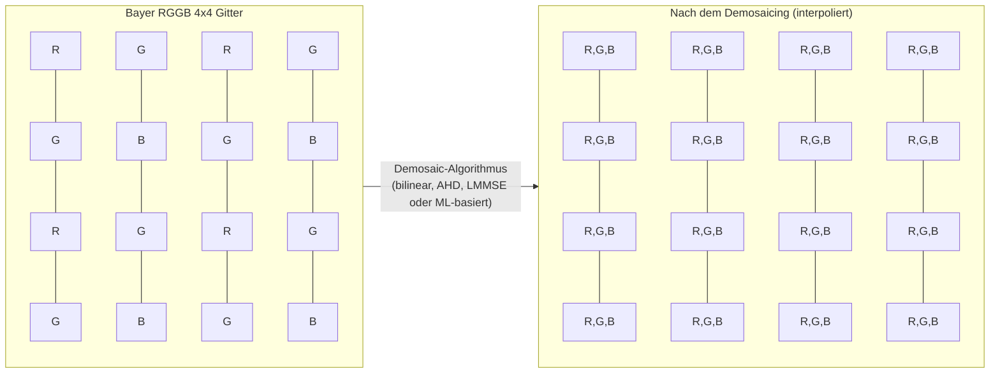
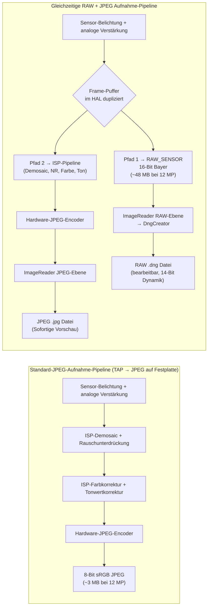

---     
sidebar_position: 18
title: "Kapitel 18: RAW-Fotografie"
description: "Meistern Sie das RAW_SENSOR-Format, die Erstellung von DNG-Dateien mit DngCreator, Bayer-Muster und die gleichzeitige RAW+JPEG-Aufnahme in der Android Camera2 API."
keywords: [Android Camera2, RAW-Fotografie, RAW_SENSOR, DngCreator, DNG, Bayer-Muster, RGGB, JPEG_R, Kamera-Metadaten]
---

# Kapitel 18: RAW-Fotografie

Professionelle mobile Fotografie verlangt mehr als die verarbeiteten JPEGs, die der ISP (Image Signal Processor) von Android standardmäßig erzeugt. Wenn Sie ein JPEG aufnehmen, wurden die Rohdaten des Sensors bereits gefiltert, interpoliert, farbkorrigiert, rauschreduziert und tonwertkorrigiert – was den Großteil des Bearbeitungsspielraums zerstört, auf den Fotografen angewiesen sind. Die Camera2 API gibt Ihnen direkten Zugriff auf das Format **RAW_SENSOR**: 16-Bit unverarbeitete Bayer-Muster-Daten direkt vom Sensor, ohne jegliche ISP-Interferenz. In Kombination mit **DngCreator** bietet das Android-Framework alles, was Sie benötigen, um standardkonforme Adobe DNG-Dateien (Digital Negative) zu erstellen, die direkt in Lightroom, Capture One, Photoshop und jedem professionellen RAW-Editor geöffnet werden können.

Dieses Kapitel baut auf den Forschungsergebnissen auf, die im Abschnitt *RAW / DngCreator* der internen Referenz des Projekts dokumentiert sind, und erweitert diese um praktischen Code, den Sie in Ihre eigene App einbinden können. Sie können diese Fähigkeiten für jedes unterstützte Gerät in der App [Android Camera Parameters](https://github.com/zoozooll/AndroidCameraParameters) einsehen – ebenfalls verfügbar im [Google Play Store](https://play.google.com/store/apps/details?id=com.zoozooll.cameraparameters). Diese meldet die maximale RAW-Größe, verfügbare RAW-Varianten (RAW10, RAW12, RAW14) und ob die DngCreator-Metadaten für jede Kamera-ID vollständig ausgefüllt sind.

## Warum RAW? Die Kosten der ISP-Verarbeitung

Bevor wir in die API-Details eintauchen, ist es entscheidend zu verstehen, was der ISP genau macht, wenn er ein JPEG erzeugt, und warum es wichtig ist, ihn zu umgehen. Eine typische Smartphone-ISP-Pipeline durchläuft nacheinander die folgenden Stufen:

1. **Schwarzwertermittlung (Black level clamping)** – subtrahiert die Basislinie des Dunkelstroms des Sensors.
2. **Objektivschattierungskorrektur (Lens shading correction)** – entfernt Vignettierung mithilfe von Gain-Maps pro Pixel.
3. **Demosaicing** – interpoliert das Bayer-Gitter mit einer Farbe pro Pixel zu einem vollständigen RGB-Bild.
4. **Rauschunterdrückung** – wendet räumliche/zeitliche Filter an, die feine Details zusammen mit dem Rauschen löschen.
5. **Farbkorrektur** – wendet eine 3×3-Matrix an, um den Farbraum des Sensors auf sRGB abzubilden.
6. **Gamma- / Tonwertkorrektur** – komprimiert die linearen 14 Blendenstufen der Szene in eine nichtlineare 8-Bit-Kurve.
7. **Kantenanhebung (Edge enhancement)** – schärft nach, um den optischen Tiefpassfilter auszugleichen.
8. **JPEG-Komprimierung** – wendet verlustbehaftetes Chroma-Subsampling (typischerweise 4:2:0) und Quantisierung an.

Das Problem bei dieser Pipeline ist, dass jeder Schritt **unumkehrbar** und auf die *Vorschau* für Konsumenten optimiert ist, nicht auf die professionelle *Nachbearbeitung*. Ein JPEG begrenzt Lichter auf Kontrastverhältnisse von 100:1 und packt 14 Bit Sensor-Dynamikbereich in 8 Bit – wenn Sie also die Schatten in der Nachbearbeitung um 2 Blendenstufen anheben, erhalten Sie Streifenbildung (Banding) anstelle von Details. RAW bewahrt die gesamte lineare Sensorausgabe und ermöglicht eine Wiederherstellung von Schatten/Lichtern über 4–6 Blendenstufen sowie benutzerdefinierte Weißabgleich-Verschiebungen, die keine Farbartefakte einführen.

```mermaid
flowchart TD
    subgraph ISP["ISP-Verarbeitungs-Pipeline (JPEG-Pfad)"]
        S1[Sensor-RAW-Daten] --> S2[Schwarzwertermittlung]
        S2 --> S3[Objektivschattierungskorrektur]
        S3 --> S4[Demosaic]
        S4 --> S5[Rauschunterdrückung]
        S5 --> S6[Farbkorrektur]
        S6 --> S7[Gamma- / Tonwertkorrektur]
        S7 --> S8[Kantenanhebung]
        S8 --> S9[JPEG-Komprimierung]
        S9 --> S10["8-Bit sRGB JPEG<br/>(≈6 Blendenstufen nutzbare Dynamik)"]
    end

    subgraph RAW["RAW-Pfad (keine ISP-Verarbeitung)"]
        R1[Sensor-RAW-Daten] --> R2["16-Bit lineares Bayer-Muster<br/>(10–14 Blendenstufen nutzbare Dynamik)"]
        R2 --> R3["DngCreator schreibt<br/>Metadaten + Pixeldaten"]
        R3 --> R4[".dng-Datei<br/>bearbeitbar in Lightroom/PS"]
    end
```



Vergleichen Sie die beiden Pfade oben visuell: Der JPEG-Pfad entfernt bei jedem Schritt Daten, während der RAW-Pfad die volle Sensornutzlast bewahrt. Der Kompromiss besteht darin, dass RAW-Dateien **nicht direkt anzeigbar** sind – sie erfordern einen separaten Rendering-Durchlauf (den "Entwicklungsschritt" in Lightroom), um das Bayer-Gitter zu interpretieren und in einen Farbraum wie sRGB oder Rec.2020 zu konvertieren.

## Das Bayer-Farbfilter-Array

RAW-Daten sind kein RGB. Jede Fotostelle auf dem Sensor zeichnet nur **eine Farbe** auf – Rot, Grün oder Blau –, da eine Silizium-Fotodiode selbst farbenblind ist und nur die Photonenzahl (Luminanz) messen kann. Um Farben zu rekonstruieren, bringen die Hersteller ein **Farbfilter-Array (CFA)** über dem Sensor an, und das resultierende einkanalige Gitter wird nach seinem Erfinder benannt: das Bayer-Muster.

In Android-Geräten existieren vier gängige CFA-Layouts, die durch die Reihenfolge der Kachel oben links (2×2) identifiziert werden:

| Muster | Kachel-Layout | Typischer Anwendungsfall |
|---------|-------------|------------------|
| **RGGB** | `R G / G B` | Die meisten Smartphones (Standard bei Samsung, Sony Exmor RS) |
| **BGGR** | `B G / G R` | Sony IMX Sensoren in einigen Xiaomi/OnePlus Geräten |
| **GRBG** | `G R / B G` | Bestimmte OmniVision Sensoren |
| **GBRG** | `G B / R G` | Selten; zu finden in einigen Mittelklasse-Geräten von Motorola |

Das auffälligste Merkmal des Bayer-Gitters ist, dass **50 % der Pixel grün** sind, während Rot und Blau jeweils 25 % erhalten. Dies ist keine willkürliche Wahl – die photopische Luminanzantwort des menschlichen Auges erreicht ihren Höhepunkt im grünen Wellenlängenbereich (um 555 nm). Die Zuweisung der doppelten Anzahl an Proben für Grün maximiert daher die wahrgenommene Schärfe und das Rauschverhalten. Der Luminanzkanal in jedem resultierenden JPEG wird zu ca. 60 % aus den grünen Fotostellen abgeleitet, sodass die grüne Abtastdichte direkt in aufgelöste Details übersetzt wird.



Der Demosaic-Block oben (P11–P44) zeigt, wie jedes Pixel rekonstruiert wird: Eine `R`-Fotostelle verwendet ihre benachbarten `G`- und `B`-Werte mittels Interpolation und umgekehrt. Diese Interpolation ist die größte Quelle für Bildunschärfe in der JPEG-Pipeline – und genau der Grund, warum Sie dies in der Postproduktion selbst machen möchten, wo modernes KI-Demosaicing (Lightroom AI Enhance, Topaz DeNoise AI usw.) schärfere Ergebnisse liefert als der Echtzeit-Hardware-ISP des Smartphones.

## Das Format RAW_SENSOR und gepackte Varianten (RAW10 / RAW12 / RAW14)

Androids kanonischer Bezeichner für das RAW-Format ist `ImageFormat.RAW_SENSOR`, der als 16-Bit-pro-Pixel-Puffer in der von `Image.getPlanes()` zurückgegebenen `Plane` erscheint. Die *effektive* Bittiefe ist jedoch geräteabhängig und wird über `CameraCharacteristics.SENSOR_INFO_BIT_DEPTH` gemeldet – die oberen Bits jenseits der tatsächlichen ADC-Auflösung des Sensors sind mit Nullen aufgefüllt.

Die meisten zeitgenössischen Smartphones verwenden eine von drei gepackten RAW-Varianten, die über `StreamConfigurationMap.getOutputSizes()` mit dedizierten Format-Konstanten offengelegt werden:

| Format-Konstante | Bit/Probe | Speicher-Layout | Typische Sensorgeneration |
|-----------------|-------------|----------------|---------------------------|
| `RAW10`         | 10          | Gepackt: 4 Proben pro 5 Byte (MSB-ausgerichtet) | Mittelklasse-Sensoren 2019–2022 (z. B. IMX586, IMX682) |
| `RAW12`         | 12          | Gepackt: 2 Proben pro 3 Byte | Flaggschiffe 2021–2024 (z. B. IMX800, IMX989 1-Zoll-Typ) |
| `RAW14`         | 14          | 16-Bit gepolstert (MSB-ausgerichtet) | Profi-Tier / Sensoren ab 1 Zoll (IMX989 mit DOL-HDR) |

Die gepackten Formate sind der Grund, warum Sie **`Buffer.getByte()` / `Buffer.getShort()` unter Berücksichtigung des Pixel-Stride verwenden müssen**, anstatt den RAW-Puffer als flaches `short[]`-Array zu behandeln – Proben in RAW10 und RAW12 überschreiten Byte-Grenzen und erfordern Bit-Shifting zur Extraktion. `DngCreator` übernimmt all dieses Packen/Entpacken transparent, wenn Sie das `Image`-Objekt direkt übergeben, was der empfohlene Ansatz ist.

## DNG: Adobe Digital Negative Standard 1.4

Warum sollten Sie `.dng`-Dateien schreiben anstatt eines proprietären Formats wie `.arw` (Sony) oder `.cr3` (Canon)? Weil **DNG das einzige universelle RAW-Format ist**, das als ISO 12234-2 veröffentlicht wurde und von jedem professionellen Foto-Toolchain akzeptiert wird. DNG v1.4 (die Version, auf die Android abzielt) spezifiziert:

- Einen TIFF/EP-kompatiblen Container (Little-Endian-IFD-Struktur).
- Obligatorische TIFF-Tags für das CFA-Muster, Schwarzwerte und Farbmatrixen.
- Optionales `ColorMatrix2` / `CalibrationIlluminant2` für Profile mit zwei Lichtquellen.
- Optionale Objektivschattierungs-Map (Tag 0xC618) für eine Flatfield-Korrektur pro Pixel.
- Optionale "Makernotes"-IFD für herstellerspezifische Kalibrierungsdaten.

Ohne diese Metadaten ist ein RAW-Puffer nur ein unbeschriftetes Gitter aus Zahlen – kein RAW-Editor könnte es korrekt rendern. Die Klasse `DngCreator` im Android-Paket `android.hardware.camera2` ist speziell darauf ausgelegt, **alle erforderlichen DNG 1.4-Metadaten automatisch** aus den `CameraCharacteristics` und dem `CaptureResult` zu befüllen, was bedeutet, dass Ihre App keine Sensorkalibrierungsdaten für jedes Gerät mitliefern muss.

Die spezifischen Metadatenfelder, die `DngCreator` schreibt, umfassen:

| DNG-Tag | Quelle | Zweck |
|---------|--------|---------|
| **BlackLevel** (SENSOR_BLACK_LEVEL_PATTERN) | `CameraCharacteristics` | 4-elementige Basislinie des Dunkelstroms pro Kanal |
| **ColorMatrix1 / ColorMatrix2** (SENSOR_COLOR_TRANSFORM1 / 2) | `CameraCharacteristics` | 3×3-Matrizen, die Sensor-RGB auf XYZ bei Lichtart A (D65) abbilden |
| **CalibrationIlluminant1 / 2** | `CameraCharacteristics` | Standard-Lichtarten-Enum (17 = Standard A, 21 = D65) |
| **ForwardMatrix1 / ForwardMatrix2** (SENSOR_FORWARD_MATRIX1 / 2) | `CameraCharacteristics` | Inverse Transformation XYZ → Sensor-RGB |
| **NeutralColorPoint** (SENSOR_NEUTRAL_COLOR_POINT) | `CameraCharacteristics` | Nativer Weißabgleich (R/G-, B/G-Verhältnisse) |
| **LensShadingMap** (STATISTICS_LENS_SHADING_MAP) | `CaptureResult` | 4-Kanal-Gain-Gitter pro Kanal zur Entfernung von Vignettierung |
| **CFA Pattern 2** | `CameraCharacteristics.SENSOR_INFO_COLOR_FILTER_ARRANGEMENT` | Kodierung der Bayer-Kacheln |
| **BaselineExposure** | `SENSOR_REFERENCE_ILLUMINANT1` | Standard-Belichtungs-Offset, der beim Rendering angewendet werden soll |

Diese Liste stammt direkt aus der Spezifikation *RAW / DngCreator* im Forschungsdokument des Projekts. Falls eines dieser Felder von der Camera2 API als `null` gemeldet wird, erstellt `DngCreator` dennoch eine gültige DNG-Datei, die jedoch in der Nachbearbeitung eine manuelle Kalibrierung erfordern kann. Sie können mit der App Android Camera Parameters überprüfen, welche Felder für jede Kamera-ID ausgefüllt sind.

## Einrichten der gleichzeitigen Aufnahme von RAW + JPEG

Der korrekte Workflow für die RAW-Aufnahme verwendet **mehrere Ausgabeziele in einem einzigen `CaptureRequest`**. Dies garantiert, dass der RAW-Puffer und das JPEG vom *exakt selben Frame* stammen (identischer Zeitstempel, identische Sensorbelichtung), was für RAW+JPEG-Backup-Workflows, die die meisten Fotografen erwarten, unerlässlich ist. Der Versuch von zwei aufeinanderfolgenden Aufnahmen führt zu einer Frame-zu-Frame-Variabilität bei Belichtung, AF und AWB.

### Schritt 1: Abfrage der Fähigkeiten und der maximalen RAW-Größe

```kotlin
import android.hardware.camera2.CameraCharacteristics
import android.hardware.camera2.params.StreamConfigurationMap
import android.util.Size
import android.graphics.ImageFormat

fun getRawCapabilities(cameraId: String,
                       characteristics: CameraCharacteristics): Pair<Boolean, Size?> {
    val caps = characteristics.get(
        CameraCharacteristics.REQUEST_AVAILABLE_CAPABILITIES
    ) ?: intArrayOf()
    val supportsRaw = caps.contains(
        CameraCharacteristics.REQUEST_AVAILABLE_CAPABILITIES_RAW
    )
    if (!supportsRaw) return Pair(false, null)

    val configMap: StreamConfigurationMap? =
        characteristics.get(CameraCharacteristics.SCALER_STREAM_CONFIGURATION_MAP)

    val rawSizes = configMap?.getOutputSizes(ImageFormat.RAW_SENSOR)
        ?: emptyArray()
    val maxRawSize = rawSizes.maxByOrNull { it.width * it.height }

    return Pair(true, maxRawSize)
}
```

`REQUEST_AVAILABLE_CAPABILITIES_RAW` ist die zwingende Voraussetzung – wenn sie nicht gesetzt ist, verweigert der HAL jede RAW_SENSOR-Ausgabe, und der Versuch, einen `ImageReader` mit diesem Format zu erstellen, wirft eine `IllegalArgumentException`. Die App Android Camera Parameters listet diese Fähigkeit pro Kamera-ID auf ihrem Haupt-Dashboard auf.

### Schritt 2: Erstellen der dualen ImageReader (RAW + JPEG)

```kotlin
import android.media.ImageReader
import android.graphics.ImageFormat

private var rawImageReader: ImageReader? = null
private var jpegImageReader: ImageReader? = null

fun setupDualImageReaders(rawSize: Size, jpegSize: Size) {
    rawImageReader = ImageReader.newInstance(
        rawSize.width,
        rawSize.height,
        ImageFormat.RAW_SENSOR,
        5 // Puffer-Tiefe: >= 2, 5 ermöglicht Spielraum für Serienaufnahmen
    ).apply {
        setOnImageAvailableListener(
            OnRawImageAvailableListener(),
            backgroundHandler
        )
    }

    jpegImageReader = ImageReader.newInstance(
        jpegSize.width,
        jpegSize.height,
        ImageFormat.JPEG,
        2
    ).apply {
        setOnImageAvailableListener(
            OnJpegImageAvailableListener(),
            backgroundHandler
        )
    }
}
```

Die Puffer-Tiefe `maxImages` für RAW sollte größer sein (5), da RAW-Puffer die 2–4-fache Bandbreite von JPEG haben und der HAL möglicherweise 2–3 Frames liefert, bevor der Festplattenschreiber aufholt. Ein Mangel an RAW-Pufferspeicher führt zu stillschweigenden Frame-Verlusten ohne Fehler-Callback.

### Schritt 3: Erstellen einer CaptureSession mit beiden Surfaces und Auslösen einer Multi-Target-Aufnahme

```kotlin
import android.hardware.camera2.CameraDevice
import android.hardware.camera2.CaptureRequest
import android.view.Surface

lateinit var cameraDevice: CameraDevice

fun createCaptureSessionAndCapture(
    rawSurface: Surface,
    jpegSurface: Surface,
    previewSurface: Surface
) {
    val outputSurfaces = listOf(previewSurface, rawSurface, jpegSurface)

    cameraDevice.createCaptureSession(
        outputSurfaces,
        object : CameraCaptureSession.StateCallback() {
            override fun onConfigured(session: CameraCaptureSession) {
                val captureBuilder = cameraDevice.createCaptureRequest(
                    CameraDevice.TEMPLATE_STILL_CAPTURE
                ).apply {
                    addTarget(previewSurface)
                    addTarget(rawSurface)
                    addTarget(jpegSurface)

                    set(CaptureRequest.CONTROL_AF_MODE,
                        CaptureRequest.CONTROL_AF_MODE_CONTINUOUS_PICTURE)
                    set(CaptureRequest.CONTROL_AE_MODE,
                        CaptureRequest.CONTROL_AE_MODE_ON)
                    set(CaptureRequest.CONTROL_AWB_MODE,
                        CaptureRequest.CONTROL_AWB_MODE_OFF) // Weißabgleich bei RAW sperren!
                }

                session.capture(
                    captureBuilder.build(),
                    RawCaptureCallback(),
                    backgroundHandler
                )
            }
            override fun onConfigureFailed(session: CameraCaptureSession) = Unit
        },
        backgroundHandler
    )
}
```

Drei Details sind hier unumgänglich:

1. **Der Weißabgleich (AWB) muss für RAW-Aufnahmen gesperrt sein (`CONTROL_AWB_MODE_OFF`).** Wenn AWB aktiviert bleibt, wendet der HAL mitten in einer Serie eine RGB-Gain-Rampe an, was bedeutet, dass jeder RAW-Frame einen anderen nativen Weißabgleich hat – was die Fähigkeit von RAW-Editoren beeinträchtigt, ein einheitliches Profil anzuwenden. Verwenden Sie stattdessen `CaptureResult.SENSOR_NEUTRAL_COLOR_POINT`, um den korrekten Weißabgleich nachträglich abzuleiten.

2. **Verwenden Sie `TEMPLATE_STILL_CAPTURE`** als Basisvorlage. Diese konfiguriert den Sensor für den hochwertigsten Auslesemodus und deaktiviert die vorschau-spezifische Rauschunterdrückung, die der HAL sonst einspeisen könnte.

3. **Alle drei Ziele (Vorschau, RAW, JPEG) befinden sich in einem `CaptureRequest`.** Der HAL garantiert eine zeitgleiche Auslieferung.

### Schritt 4: DngCreator zum Schreiben der DNG-Datei verwenden

Der Callback `OnImageAvailableListener` empfängt `Image`-Objekte, von denen die RAW-Pixeldaten bereits zugänglich sind. Übergeben Sie das `Image` *und* das passende `CaptureResult` an den `DngCreator`, zusammen mit den ursprünglichen `CameraCharacteristics`, die zum Öffnen der Kamera verwendet wurden – diese Kombination ist erforderlich, um alle DNG 1.4-Metadaten korrekt zu befüllen.

```kotlin
import android.hardware.camera2.CameraCharacteristics
import android.hardware.camera2.CaptureResult
import android.hardware.camera2.DngCreator
import android.media.Image
import java.io.File
import java.io.FileOutputStream
import java.io.IOException

inner class OnRawImageAvailableListener : ImageReader.OnImageAvailableListener {
    private val pendingDngWrites =
        HashMap<Long, CaptureResult>() // Zeitstempel → CaptureResult

    fun registerCaptureResult(timestamp: Long, result: CaptureResult) {
        pendingDngWrites[timestamp] = result
    }

    override fun onImageAvailable(reader: ImageReader) {
        var image: Image? = null
        try {
            image = reader.acquireLatestImage() ?: return
            val timestamp = image.timestamp

            val captureResult = pendingDngWrites.remove(timestamp) ?: return
            val characteristics = latestCameraCharacteristics ?: return

            val dngFile = File(
                getExternalFilesDir(null),
                "RAW_${System.currentTimeMillis()}.dng"
            )

            FileOutputStream(dngFile).use { fos ->
                val dngCreator = DngCreator(characteristics, captureResult)
                dngCreator.writeByteBuffer(
                    fos,
                    image.width,
                    image.height,
                    image.planes[0].buffer,
                    0 // Padding, bei RAW_SENSOR immer 0
                )
            }

        } catch (e: IOException) {
            Log.e(TAG, "Fehler beim Schreiben der DNG-Datei", e)
        } catch (e: IllegalStateException) {
            Log.e(TAG, "DngCreator lehnte Metadaten ab (erforderliches Feld fehlt)", e)
        } finally {
            image?.close() // WICHTIG: Image-Referenzen NIEMALS leaken
        }
    }
}
```

Der Konstruktor von `DngCreator` nimmt genau zwei Argumente entgegen:
- **`CameraCharacteristics`** – statische Felder pro Kamera (Schwarzwerte, Farbmatrixen, CFA-Muster, neutraler Farbpunkt, Lichtarten 1 & 2).
- **`CaptureResult`** – dynamische Felder pro Frame (Sensorbelichtung, ISO, Objektivschattierungs-Map, AF-Objektivposition).

Falls eines davon `null` ist oder ein erforderliches Metadatenfeld fehlt (z. B. melden einige Budget-Geräte `null` für `SENSOR_COLOR_TRANSFORM1`), wirft der Konstruktor bereits bei der Erstellung (nicht erst bei `writeByteBuffer`) eine `IllegalArgumentException`. Aus diesem Grund meldet die App Android Camera Parameters explizit jedes DNG-relevante Feld: Entwickler können Geräte vorfiltern, um Abstürze auf Geräten mit unvollständigen HAL-Implementierungen zu vermeiden.

Die Map `pendingDngWrites` mit Zeitstempeln löst ein reales Nebenläufigkeitsproblem: `CaptureResult.CaptureCallback.onCaptureCompleted()` wird **vor oder nach** `OnImageAvailableListener.onImageAvailable()` ausgelöst (HAL-abhängig). Der Abgleich über `image.timestamp == CaptureResult.SENSOR_TIMESTAMP` garantiert, dass die richtigen Metadaten mit dem richtigen Pixelpuffer gepaart werden.

## Vergleich der Verarbeitungs-Pipelines (Detailliertes Mermaid)



Die wichtigste Erkenntnis aus diesem Diagramm ist der **Duplizierungsknoten G**: Der HAL liest einen Frame vom Sensor und leitet dann eine unveränderte Kopie an den RAW-Ausgang weiter, während er *dieselbe* Kopie in den ISP für die JPEG-Kodierung einspeist. Dies garantiert die Frame-Gleichheit, ohne die Bandbreite für das Auslesen des Sensors zu verdoppeln.

## Leistungsaspekte und praktische Grenzen

Das Schreiben von 12–48 MB großen DNG-Dateien auf den Flash-Speicher nimmt messbare Zeit in Anspruch:
- UFS 3.1 Speicher: ~250 MB/s sequenzielles Schreiben → eine 12-MP-DNG (~48 MB) dauert ~190 ms.
- eMMC 5.1 Speicher: ~120 MB/s sequenzielles Schreiben → dieselbe Datei dauert ~400 ms.

Dies bedeutet, dass Sie **den UI-Thread nicht durch DNG-Schreibvorgänge blockieren dürfen** – führen Sie `writeByteBuffer` immer auf einem Hintergrund-Thread/Handler aus und schließen Sie das `Image` immer in einem `finally`-Block, um einen Puffermangel im HAL zu vermeiden.

Eine weitere wichtige Einschränkung: Nicht alle Geräte unterstützen RAW + JPEG in derselben Sitzung, selbst wenn `CAPABILITIES_RAW` gesetzt ist. Der korrekte Weg zur Überprüfung ist `StreamConfigurationMap.isOutputSupportedFor(surfaceList)` mit beiden Surfaces in der Liste. Wenn dies `false` zurückgibt, weichen Sie auf Sitzungen nur mit RAW aus.

## Zusammenfassung

Dieses Kapitel behandelte den vollständigen End-to-End-Workflow der RAW-Fotografie in Android Camera2:

- Das **Format RAW_SENSOR** liefert das unverarbeitete 16-Bit-Bayer-Gitter vom Sensor und umgeht jede Stufe der ISP-Verarbeitung.
- **Bayer-Muster** (RGGB, BGGR, GRBG, GBRG) weisen 50 % der Fotostellen Grün zu, um die Luminanz-Abtastung für das menschliche Sehen zu optimieren.
- **Gepackte Varianten** — RAW10, RAW12, RAW14 — speichern Proben mit der nativen ADC-Bittiefe; DngCreator entpackt diese transparent.
- **DNG v1.4** ist der universelle RAW-Container. `DngCreator(characteristics, result).writeByteBuffer(...)` befüllt alle erforderlichen Metadaten: Schwarzwerte, Farbmatrixen, Objektivschattierungs-Map, neutraler Farbpunkt und Kalibrierungs-Lichtarten 1 & 2.
- **Multi-Target-CaptureRequests** leiten denselben Frame sowohl an den RAW- als auch an den JPEG-ImageReader weiter und garantieren so die Frame-Gleichheit für RAW+JPEG-Workflows.
- Ein **Abgleich der Zeitstempel** zwischen `CaptureResult` und `Image` ist erforderlich, da Callbacks in einer HAL-abhängigen Reihenfolge ausgelöst werden.

## Wie geht es weiter?

Im nächsten Kapitel wechseln wir von der Standbildfotografie zum Video mit **Kapitel 19: High-Speed-Video**, in dem wir `CameraConstrainedHighSpeedCaptureSession` verwenden, um Aufnahmen mit 120 fps (4× Zeitlupe) und 240 fps (8× Zeitlupe) zu erzielen. Sie werden lernen, warum High-Speed-Sitzungen `createHighSpeedRequestList` anstelle von einzelnen CaptureRequests erfordern und wie die dedizierte High-Speed-Pipeline des HAL den normalen Vorschaupfad umgeht, um Bildraten zu liefern, die sonst CPU-kritisch wären.

Sie können die RAW-Fähigkeiten Ihres Geräts, die maximale RAW-Größe und die Vollständigkeit der DngCreator-Metadaten validieren, indem Sie die [App Android Camera Parameters](https://play.google.com/store/apps/details?id=com.zoozooll.cameraparameters) installieren – und tragen Sie Geräteberichte zum Open-Source-[GitHub-Repository](https://github.com/zoozooll/AndroidCameraParameters) bei, um anderen Entwicklern zu helfen, herauszufinden, welche Geräte professionelle RAW-Workflows unterstützen.
