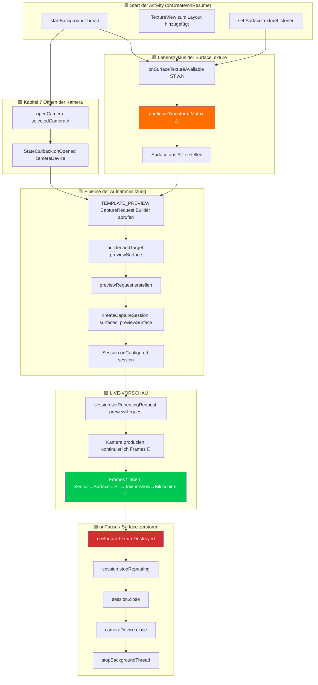

Dies ist das Kapitel, auf das Sie gewartet haben. Nach drei Kapiteln, in denen wir das Gerüst aufgebaut haben (Berechtigungen, Threading, CameraManager, Aufzählung, Lebenszyklus zum Öffnen/Schließen), werden Sie nun endlich **die Kameraausgabe live auf dem Bildschirm des Android-Geräts gerendert sehen**. Die Vorschau ist die Seele einer Kamera-App – sie ist das, worauf der Benutzer schaut, um ein Motiv einzurahmen, den Fokus zu prüfen und die Belichtung zu verifizieren, bevor er auf den Auslöser tippt. Die richtige Umsetzung macht den Unterschied zwischen einer ruckeligen, unbrauchbaren App und einer ausgereiften, reaktionsschnellen Kameraerfahrung aus.

Eine Referenzimplementierung der Vorschau, die Sonderfälle auf Hunderten von Geräten handhabt, finden Sie im Vorschaubildschirm der App **Android Camera Parameters** ([GitHub](https://github.com/zoozooll/AndroidCameraParameters) / [Google Play](https://play.google.com/store/apps/details?id=com.minininja.cameraparams)). Ihre Vorschau-Pipeline umfasst ausrichtungsbewusste Transformationen, Ausgabe-Surfaces mit mehreren Auflösungen und eine flüssige Drosselung der Bildrate – alles aufgebaut auf denselben grundlegenden Komponenten, die wir hier behandeln.

## Die Vorschau-Pipeline: Übersicht der Komponenten

Bevor wir uns in den Code vertiefen, lassen Sie uns den konzeptionellen Weg eines einzelnen Vorschau-Frames vom Kamerasensor zum Display des Telefons abbilden. Jeder Frame durchläuft fünf Schichten:

```
Kamerasensor → CameraDevice-Pipeline → Surface (BufferQueue) → SurfaceTexture → TextureView → Display
```

Jede Schicht spielt eine spezifische, nicht austauschbare Rolle. Das Überspringen oder Abkürzen einer dieser Schichten führt zu schwarzen Bildschirmen, verzerrten Seitenverhältnissen oder Tearing. Definieren wir jede Komponente:

### 1. Surface — Der Puffer für das Bildziel

Eine `Surface` ist das allgemeine Konzept der Camera2-API für **ein Ziel für verarbeitete Bild-Frames**. Unter der Haube kapselt eine Surface eine Android `BufferQueue`: einen Ringpuffer aus Grafikpuffern (typischerweise 3–5 Puffer tief), der vom System-Compositor (SurfaceFlinger) verwaltet wird. Wenn Camera2 einen Frame auf einer Surface "rendert", nimmt sie einen leeren Puffer aus der Warteschlange, füllt ihn mit Pixeldaten und stellt ihn wieder in die Warteschlange, damit der Konsument ihn verwenden kann.

Alles, was Grafikpuffer konsumieren kann, kann eine `Surface` bereitstellen. Die häufigsten Konsumenten sind:
- **SurfaceTexture** → speist eine `TextureView` (für die Vorschau auf dem Bildschirm – dieses Kapitel)
- **Surface eines MediaRecorder/MediaCodec** → Videokodierung (wird in dieser Serie nicht behandelt)
- **ImageReader-Surface** → CPU-zugängliche `Image`-Objekte für die JPEG/RAW-Aufnahme (Kapitel 9)

### 2. SurfaceTexture — Die Brücke von GPU zu GPU

`SurfaceTexture` ist die magische Klasse, die einen rohen Stream von Kamera-Frames in eine Textur verwandelt, die die GPU abtasten und rendern kann. Sie ist das Konsumenten-Ende der BufferQueue der Surface, aber anstatt Puffer an die CPU zu übergeben, konvertiert sie diese in eine OpenGL ES `GL_TEXTURE_EXTERNAL_OES` Textur. Dies ermöglicht es der `TextureView`, den Kamera-Frame unter Verwendung von Standard-GPU-Rendering in die View-Hierarchie einzubinden – es ist keine CPU-Kopie erforderlich, sodass eine Vorschau mit 60+ FPS trivial erreichbar ist.

Sie erhalten eine `Surface` für eine `SurfaceTexture` mit:
```kotlin
val surface = Surface(surfaceTexture)
```

### 3. TextureView — Das Fenster auf dem Bildschirm

`TextureView` ist eine Unterklasse von `View`, die den Inhalt einer `SurfaceTexture` anzeigen kann. Sie ist der moderne Nachfolger der älteren `SurfaceView` und die empfohlene Wahl für die Camera2-Vorschau aus drei Gründen:
- Sie verhält sich wie eine normale View (kann animiert, transformiert, Alpha-geblendet und in scrollbare Container platziert werden).
- Sie zwingt die Activity nicht dazu, ein transparentes Fenster zu verwenden (im Gegensatz zur SurfaceView, die ein "Loch" in die View-Hierarchie schlägt).
- Ihr `SurfaceTextureListener` liefert uns präzise Lebenszyklus-Callbacks für den Zeitpunkt, an dem die Surface erstellt, zerstört oder in der Größe geändert wird.

Um Callback-gesteuerten Zugriff auf die zugrunde liegende SurfaceTexture zu erhalten, bietet `TextureView` die Methode `setSurfaceTextureListener()` mit vier Callbacks:
- `onSurfaceTextureAvailable(surfaceTexture, width, height)` — die Surface ist bereit, Frames zu empfangen (wird einmal ausgelöst, wenn das Layout der View erstellt wurde).
- `onSurfaceTextureSizeChanged(surfaceTexture, width, height)` — die Größe der Surface hat sich geändert (z. B. Gerät gedreht).
- `onSurfaceTextureDestroyed(surfaceTexture)` — steht kurz vor der Zerstörung; wir müssen die Vorschau stoppen, bevor diese Methode zurückkehrt.
- `onSurfaceTextureUpdated(surfaceTexture)` — wird bei **jedem neuen Frame** ausgelöst (kann verwendet werden, um Overlays für das Face-Tracking usw. zu steuern).

### 4. CameraCaptureSession — Die konfigurierte Pipeline

Bevor ein `CameraDevice` Frames produzieren kann, müssen Sie eine `CameraCaptureSession` erstellen. Eine Sitzung ist eine **Konfiguration aller Ausgabe-Surfaces, auf die die Kamera-Pipeline schreiben wird**. Man kann sie sich als "Verrohrung" des Kamera-ISP (Image Signal Processor) vorstellen, um seine Ausgabe an eine oder mehrere Senken zu leiten. Für eine reine Vorschau hat die Sitzung eine Surface (die der TextureView). Wenn wir in Kapitel 9 die Fotoaufnahme hinzufügen, wird die Sitzung zwei Surfaces haben: Vorschau + `ImageReader`.

Wichtige Regeln:
- Eine Sitzung wird mit `CameraDevice.createCaptureSession(outputSurfaces, stateCallback, handler)` erstellt.
- Die Sitzung ist erst nutzbar, **nachdem** `StateCallback.onConfigured(session)` ausgelöst wurde.
- Ein `CameraDevice` kann nur **eine aktive Sitzung zur gleichen Zeit** haben. Das Erstellen einer neuen Sitzung schließt die vorherige.
- Die Sitzung besitzt *alle* Ausgaben für ihre Lebensdauer; das Hinzufügen einer neuen Surface (z. B. wenn man sich plötzlich entscheidet, ein Video aufzunehmen) erfordert den Abbau der alten Sitzung und das Erstellen einer neuen mit allen Surfaces (Vorschau + Recorder).

### 5. Wiederholte Aufnahmeanforderung (TEMPLATE_PREVIEW)

Wie erfolgt eine kontinuierliche Vorschau, sobald die Sitzung konfiguriert ist? Camera2 ist eine anforderungsgesteuerte API – jeder Frame ist ein `CaptureRequest`, der an die Sitzung übermittelt wird. Für die Vorschau übermitteln wir **eine Anforderung und markieren sie als wiederholt**: Die Kamerahardware wird dieselbe Anforderung (mit denselben Sensoreinstellungen, Zielen und demselben 3A-Zustand) kontinuierlich erneut ausführen und Frames so schnell produzieren, wie es die Pipeline zulässt (typischerweise 30–120 FPS).

Eine wiederholte Anforderung wird wie folgt übermittelt:
```kotlin
session.setRepeatingRequest(previewRequest, captureCallback, backgroundHandler)
```

Die Vorlage für die Vorschau ist `CameraDevice.TEMPLATE_PREVIEW`. Camera2 bietet mehrere vorgefertigte Vorlagen, die hunderte von Low-Level-Parametern (Belichtung, Bildratenbereich, 3A-Modus, Rauschunterdrückung usw.) passend für den Anwendungsfall konfigurieren. Für die Vorschau optimiert `TEMPLATE_PREVIEW` auf **niedrige Latenz und eine flüssige Bildrate**, selbst wenn dies einen leicht reduzierten Dynamikumfang des Sensors im Vergleich zu `TEMPLATE_STILL_CAPTURE` (in Kapitel 9 für Fotos verwendet) bedeutet.

## Flussdiagramm der End-to-End-Vorschau

Das folgende Flussdiagramm zeigt, wie all diese Komponenten zusammenhängen. Verfolgen Sie es aufmerksam, wenn Sie den Code lesen – jeder Block entspricht einem realen Funktionsaufruf.



Der orange hervorgehobene Block (`configureTransform`) und der grün hervorgehobene Block (LIVE-VORSCHAU) sind die beiden wichtigsten Schritte. Wenn Sie `configureTransform` überspringen, wird Ihre Vorschau verzerrt, gedreht oder gestaucht sein. Wenn Sie alles andere richtig verkabeln, aber vergessen, `setRepeatingRequest` aufzurufen, bleibt der Bildschirm schwarz, ohne dass Fehler protokolliert werden.

## Schritt 1: TextureView zum Layout-XML hinzufügen

Erstellen oder aktualisieren Sie zunächst `app/src/main/res/layout/activity_main.xml`, um eine Vollbild-`TextureView` einzufügen. Wir fügen auch ein `TextView`-Overlay als Statusanzeige hinzu, damit wir die Vorschaugröße sehen können.

```xml
<?xml version="1.0" encoding="utf-8"?>
<FrameLayout xmlns:android="http://schemas.android.com/apk/res/android"
    android:layout_width="match_parent"
    android:layout_height="match_parent">

    <TextureView
        android:id="@+id/textureView"
        android:layout_width="match_parent"
        android:layout_height="match_parent"
        android:layout_gravity="center" />

    <TextView
        android:id="@+id/statusTextView"
        android:layout_width="wrap_content"
        android:layout_height="wrap_content"
        android:layout_gravity="top|center_horizontal"
        android:layout_marginTop="16dp"
        android:background="#80000000"
        android:padding="8dp"
        android:textColor="#FFFFFFFF"
        android:textSize="12sp"
        tools:text="Kamera wird initialisiert..." />

</FrameLayout>
```

Warum `FrameLayout` als Root? Weil die Vorschau eine Vollbildschicht ist und `FrameLayout` Kinder in Z-Reihenfolge stapelt (spätere Kinder werden darüber gezeichnet). Später werden wir ein Overlay für den Auslöser hinzufügen. Die `TextureView` verwendet `match_parent` für beide Dimensionen – aber keine Sorge, wir werden unten `configureTransform` verwenden, um sie korrekt mit schwarzen Balken zu versehen (Letterboxing), sodass die Pixel selbst niemals verzerrt werden, auch wenn die View den Bildschirm füllt.

## Schritt 2: configureTransform — Das Geheimrezept für das richtige Seitenverhältnis der Vorschau

Wenn Sie nichts unternehmen und die Frames einfach in eine Vollbild-TextureView leiten, wird die Vorschau **verzerrt** sein. Warum? Weil Kamerasensoren ein festes Seitenverhältnis haben (fast immer 4:3 für die Standbildaufnahme, manchmal 16:9 für Videomodi) und das Display des Telefons ein anderes Seitenverhältnis hat (oft ~20:9 bei modernen Flaggschiffen). Wenn die Kamera einen Vorschau-Frame von 4032×3024 (4:3) ausgibt und die TextureView ihn auf 1080×2400 (20:9) streckt, wirken Gesichter schmal und lang.

Die Lösung ist **`configureTransform(viewWidth: Int, viewHeight: Int)`**: eine Methode, die eine `Matrix` (Rotation + Center-Crop-Skalierung) berechnet und auf die TextureView anwendet. Die Matrix bewirkt drei Dinge:
1. Sie **dreht** das Bild um die Anzahl der Grad, um die das Gerät relativ zur natürlichen Ausrichtung des Kamerasensors gedreht ist.
2. Sie **skaliert** das Bild so, dass es die TextureView vollständig ausfüllt, während das Seitenverhältnis beibehalten wird (Center-Crop-Stil, oder Letterbox mit schwarzen Balken, falls bevorzugt).
3. Sie **zentriert** das skalierte/gedrehte Bild neu, sodass es in der Mitte der View sitzt.

Dies ist die am häufigsten kopierte Funktion aus den offiziellen Android Camera2-Beispielen – jeder Entwickler benötigt sie, und man macht dabei leicht Fehler. Hier ist die kanonische Version:

```kotlin
/**
 * Konfiguriert die erforderliche Matrix-Transformation für `textureView`.
 * Diese Methode sollte aufgerufen werden, nachdem die Größe der Kameravorschau feststeht
 * und auch die Größe der `textureView` fixiert ist.
 *
 * @param viewWidth  Die Breite der `textureView`
 * @param viewHeight Die Höhe der `textureView`
 * @param previewSize Die von der Kamera gewählte Vorschau-Größe (width, height)
 * @param sensorOrientationDegrees Das SENSOR_ORIENTATION-Merkmal der Kamera
 * @param deviceDisplayRotationDegrees Die Rotation des Displays (0/90/180/270) relativ zur natürlichen Lage
 */
private fun configureTransform(
    viewWidth: Int,
    viewHeight: Int,
    previewSize: android.util.Size,
    sensorOrientationDegrees: Int,
    deviceDisplayRotationDegrees: Int
) {
    val rotation = when (deviceDisplayRotationDegrees) {
        android.view.Surface.ROTATION_0 -> 0
        android.view.Surface.ROTATION_90 -> 90
        android.view.Surface.ROTATION_180 -> 180
        android.view.Surface.ROTATION_270 -> 270
        else -> return
    }

    val matrix = android.graphics.Matrix()
    val viewRect = android.graphics.RectF(0f, 0f, viewWidth.toFloat(), viewHeight.toFloat())
    val bufferRect = android.graphics.RectF(
        0f,
        0f,
        previewSize.height.toFloat(),
        previewSize.width.toFloat()
    )
    val centerX = viewRect.centerX()
    val centerY = viewRect.centerY()

    // Schritt 1: Berücksichtigung der Geräterotation relativ zur Sensorausrichtung
    if (Surface.ROTATION_90 == rotation || Surface.ROTATION_270 == rotation) {
        bufferRect.offset(centerX - bufferRect.centerX(), centerY - bufferRect.centerY())
        matrix.setRectToRect(viewRect, bufferRect, android.graphics.Matrix.ScaleToFit.FILL)
        val scale = maxOf(
            viewHeight.toFloat() / previewSize.height,
            viewWidth.toFloat() / previewSize.width
        )
        matrix.postScale(scale, scale, centerX, centerY)
        matrix.postRotate(
            (90 * (rotation - 2)).toFloat(),
            centerX,
            centerY
        )
    } else if (Surface.ROTATION_180 == rotation) {
        matrix.postRotate(180f, centerX, centerY)
    }

    // Schritt 2: Berücksichtigung der Montage des Sensors relativ zum Gerät
    val relativeRotation = (sensorOrientationDegrees - rotation + 360) % 360
    if (relativeRotation != 0) {
        matrix.postRotate(relativeRotation.toFloat(), centerX, centerY)
    }

    textureView.setTransform(matrix)
}
```

Ein wichtiges Detail: `previewSize` ist die Ausgabegröße der Kamera, gemeldet als (Breite, Höhe) in **Sensorausrichtung**. Die Dimensionen der TextureView liegen in **Displayausrichtung** vor. Der RectF-Trick mit vertauschter Breite/Höhe (`bufferRect` verwendet `previewSize.height` für die Breite und umgekehrt) berücksichtigt diesen Koordinatenwechsel zwischen Sensor und Display.

Sie benötigen zwei Informationen aus den CameraCharacteristics, um diese Methode aufzurufen:
- `SENSOR_ORIENTATION` — um wie viele Grad der Sensor relativ zur natürlichen Ausrichtung des Geräts gedreht ist. Bei Rückkameras sind dies fast immer 90°. Bei Frontkameras sind es typischerweise 270° (damit das Bild korrekt gespiegelt wird). Lesen Sie dies einmal pro Kamera in der Entdeckungsphase aus.
- Display-Rotation — von `(getSystemService(Context.WINDOW_SERVICE) as WindowManager).defaultDisplay.rotation` (bei neueren APIs verwenden Sie `display?.rotation`).

## Schritt 3: Wählen Sie eine Vorschaugröße aus der SCALER_STREAM_CONFIGURATION_MAP

Bevor wir `configureTransform` schreiben oder eine Sitzung erstellen können, müssen wir wissen, welche Vorschaugröße die Kamera ausgeben kann. Für jede Kamera gibt `CameraCharacteristics.SCALER_STREAM_CONFIGURATION_MAP` ein `StreamConfigurationMap`-Objekt zurück, das alle gültigen (Format, Größe)-Paare enthält, die die Kamera produzieren kann. Für die Vorschau auf einer `SurfaceTexture` fragen wir die Ausgabegrößen für die Klasse `SurfaceTexture::class.java` ab:

```kotlin
private fun chooseOptimalPreviewSize(
    characteristics: CameraCharacteristics,
    maxWidth: Int,
    maxHeight: Int,
    targetAspectRatio: Double
): android.util.Size {
    val map = characteristics.get(CameraCharacteristics.SCALER_STREAM_CONFIGURATION_MAP)
        ?: throw IllegalStateException("Keine StreamConfigurationMap verfügbar")

    // Alle Größen, die für die SurfaceTexture-Ausgabe (Vorschau-Klasse) unterstützt werden
    val choices = map.getOutputSizes(SurfaceTexture::class.java).toList()

    // Bevorzugen Sie Größen, die zum Seitenverhältnis passen, dann solche, die in die maximalen Dimensionen passen,
    // und wählen Sie dann die größte (beste Qualität) unter den verbleibenden aus.
    val acceptable = choices.filter {
        it.width <= maxWidth
            && it.height <= maxHeight
            && Math.abs(it.width.toDouble() / it.height - targetAspectRatio) < 0.02
    }

    val chosen = acceptable.ifEmpty { choices }
        .maxByOrNull { it.width * it.height }!!

    Log.d(TAG, "Gewählte Vorschaugröße: ${chosen.width}x${chosen.height} " +
        "(aus ${choices.size} Optionen, maxAllowed=${maxWidth}x${maxHeight})")
    return chosen
}
```

Vernünftige Standardparameter: `maxWidth = 1920`, `maxHeight = 1080`, `targetAspectRatio = textureView.width.toDouble() / textureView.height`. Die Vorschau-Surface muss nicht in 4K sein – 1080p reicht für die Bildeinstellung auf einem Telefonbildschirm völlig aus, verbraucht weniger Strom und hält die Latenz der Pipeline niedrig.

## Schritt 4: Vollständiger Code für Kapitel 8 — Live-Vorschau

Hier ist die vollständige `MainActivity.kt`, die jedes Teil aus diesem Kapitel integriert: die Layout-basierte `TextureView`, den `SurfaceTextureListener`, die Größenauswahl, `configureTransform`, die Erstellung der `CameraCaptureSession` und die alles entscheidende Methode `setRepeatingRequest(TEMPLATE_PREVIEW)`.

```kotlin
package com.example.camera2tutorial

import android.Manifest
import android.content.Context
import android.content.pm.PackageManager
import android.graphics.Matrix
import android.graphics.RectF
import android.graphics.SurfaceTexture
import android.hardware.camera2.CameraAccessException
import android.hardware.camera2.CameraCharacteristics
import android.hardware.camera2.CameraCaptureSession
import android.hardware.camera2.CameraDevice
import android.hardware.camera2.CameraManager
import android.hardware.camera2.CaptureRequest
import android.hardware.camera2.params.StreamConfigurationMap
import android.os.Bundle
import android.os.Handler
import android.os.HandlerThread
import android.util.Log
import android.util.Size
import android.view.Surface
import android.view.TextureView
import android.view.WindowManager
import android.widget.TextView
import android.widget.Toast
import androidx.appcompat.app.AppCompatActivity
import androidx.core.app.ActivityCompat
import androidx.core.content.ContextCompat
import java.util.Collections
import java.util.concurrent.Semaphore
import java.util.concurrent.TimeUnit
import kotlin.math.max

class MainActivity : AppCompatActivity() {

    // UI
    private lateinit var textureView: TextureView
    private lateinit var statusTextView: TextView

    // Threading
    private lateinit var backgroundThread: HandlerThread
    private lateinit var backgroundHandler: Handler

    // Kamera
    private lateinit var cameraManager: CameraManager
    private var cameraDevice: CameraDevice? = null
    private var captureSession: CameraCaptureSession? = null
    private var previewRequestBuilder: CaptureRequest.Builder? = null
    private var previewRequest: CaptureRequest? = null
    private var selectedCameraId: String? = null
    private var sensorOrientation = 0
    private lateinit var previewSize: Size

    private val cameraOpenCloseLock = Semaphore(1)

    // ------------------------- Lebenszyklus -------------------------
    override fun onCreate(savedInstanceState: Bundle?) {
        super.onCreate(savedInstanceState)
        setContentView(R.layout.activity_main)

        textureView = findViewById(R.id.textureView)
        statusTextView = findViewById(R.id.statusTextView)
        statusTextView.text = "Warten auf Layout der TextureView..."

        if (allPermissionsGranted()) {
            initializeCameraManager()
        } else {
            ActivityCompat.requestPermissions(
                this, REQUIRED_PERMISSIONS, REQUEST_CODE_PERMISSIONS
            )
        }
    }

    override fun onResume() {
        super.onResume()
        startBackgroundThread()

        if (allPermissionsGranted()) {
            if (!this::cameraManager.isInitialized) initializeCameraManager()
            // Wenn die TextureView bereits verfügbar ist, Kamera öffnen und Sitzung starten
            if (textureView.isAvailable) {
                openCameraAndStartPreview(textureView.width, textureView.height)
            }
        } else {
            ActivityCompat.requestPermissions(
                this, REQUIRED_PERMISSIONS, REQUEST_CODE_PERMISSIONS
            )
        }
    }

    override fun onPause() {
        closeCameraAndPreview()
        stopBackgroundThread()
        super.onPause()
    }

    private fun startBackgroundThread() {
        backgroundThread = HandlerThread("Camera2Background").apply { start() }
        backgroundHandler = Handler(backgroundThread.looper)
    }

    private fun stopBackgroundThread() {
        backgroundThread.quitSafely()
        try { backgroundThread.join(1000) } catch (_: InterruptedException) {}
    }

    // ------------------------- Kapitel 6 gekürzt: Entdeckung -------------------------
    data class CameraInfo(val id: String, val facing: Int?, val hwLevel: Int?, val chars: CameraCharacteristics)

    private fun initializeCameraManager() {
        cameraManager = getSystemService(Context.CAMERA_SERVICE) as CameraManager
        val discovered = mutableListOf<CameraInfo>()
        for (id in cameraManager.cameraIdList) {
            val chars = try { cameraManager.getCameraCharacteristics(id) } catch (_: Exception) { continue }
            discovered += CameraInfo(
                id,
                chars.get(CameraCharacteristics.LENS_FACING),
                chars.get(CameraCharacteristics.INFO_SUPPORTED_HARDWARE_LEVEL),
                chars
            )
        }
        val chosen = discovered
            .sortedWith(
                compareByDescending<CameraInfo> { it.facing == CameraCharacteristics.LENS_FACING_BACK }
                    .thenByDescending { it.hwLevel ?: -1 }
            )
            .first()
        selectedCameraId = chosen.id
        sensorOrientation = chosen.chars.get(CameraCharacteristics.SENSOR_ORIENTATION) ?: 90

        Log.d(TAG, "Gewählte Kamera id=$selectedCameraId, sensorOrientation=$sensorOrientation°")

        // SurfaceTexture-Listener verbinden — er wird den eigentlichen Start der Vorschau auslösen
        textureView.surfaceTextureListener = object : TextureView.SurfaceTextureListener {
            override fun onSurfaceTextureAvailable(st: SurfaceTexture, width: Int, height: Int) {
                Log.d(TAG, "✅ SurfaceTexture verfügbar: ${width}x$height")
                statusTextView.text = "SurfaceTexture bereit — Kamera wird geöffnet..."
                openCameraAndStartPreview(width, height)
            }
            override fun onSurfaceTextureSizeChanged(st: SurfaceTexture, w: Int, h: Int) {
                if (this@MainActivity::previewSize.isInitialized) {
                    configureTransform(w, h)
                }
            }
            override fun onSurfaceTextureDestroyed(st: SurfaceTexture): Boolean {
                Log.d(TAG, "⛔ SurfaceTexture zerstört")
                return true
            }
            override fun onSurfaceTextureUpdated(st: SurfaceTexture) {
                // Wird bei JEDEM Frame aufgerufen. Halten Sie die Arbeit hier < 1 ms. FPS bei Bedarf zählen.
            }
        }
    }

    // ------------------------- Kapitel 7 gekürzt: openCamera -------------------------
    private val deviceStateCallback = object : CameraDevice.StateCallback() {
        override fun onOpened(camera: CameraDevice) {
            cameraOpenCloseLock.release()
            cameraDevice = camera
            Log.d(TAG, "✅ Kamera ${camera.id} geöffnet → Aufnahmesitzung wird erstellt")
            statusTextView.text = "Kamera offen — Aufnahmesitzung wird erstellt..."

            // ⬇️ Kapitel 8: Da die Kamera geöffnet UND die SurfaceTexture verfügbar ist,
            // erstellen wir nun die Aufnahmesitzung
            createCaptureSession()
        }
        override fun onDisconnected(camera: CameraDevice) {
            cameraOpenCloseLock.release()
            cameraDevice?.close()
            cameraDevice = null
            Log.w(TAG, "Kamera ${camera.id} getrennt")
        }
        override fun onError(camera: CameraDevice, error: Int) {
            cameraOpenCloseLock.release()
            cameraDevice?.close()
            cameraDevice = null
            val msg = when (error) {
                ERROR_CAMERA_IN_USE -> "Kamera wird von einer anderen App verwendet"
                else -> "Kamerafehler $error"
            }
            Toast.makeText(this@MainActivity, msg, Toast.LENGTH_LONG).show()
        }
    }

    // ------------------------- 🎯 KAPITEL 8: Vorschau-Pipeline -------------------------
    private fun openCameraAndStartPreview(viewWidth: Int, viewHeight: Int) {
        val camId = selectedCameraId ?: return
        if (ContextCompat.checkSelfPermission(this, Manifest.permission.CAMERA)
            != PackageManager.PERMISSION_GRANTED) return
        if (!cameraOpenCloseLock.tryAcquire(2500, TimeUnit.MILLISECONDS)) {
            Toast.makeText(this, "Zeitüberschreitung bei Kamerasperre", Toast.LENGTH_SHORT).show()
            return
        }

        // 1) Vorschaugröße festlegen, BEVOR die Sitzung geöffnet wird
        val chars = cameraManager.getCameraCharacteristics(camId)
        previewSize = chooseOptimalPreviewSize(chars, viewWidth, viewHeight)

        // 2) Transformation zur Aspekt-Korrektur auf TextureView anwenden
        configureTransform(viewWidth, viewHeight)

        // 3) Puffergröße der SurfaceTexture so konfigurieren, dass sie zur gewählten Vorschaugröße passt
        textureView.surfaceTexture!!.setDefaultBufferSize(previewSize.width, previewSize.height)

        statusTextView.text = "Vorschaugröße: ${previewSize.width}×${previewSize.height}"

        // 4) Kamera öffnen — Erstellung der Sitzung wird in onOpened → createCaptureSession() fortgesetzt
        try {
            cameraManager.openCamera(camId, deviceStateCallback, backgroundHandler)
        } catch (e: CameraAccessException) {
            cameraOpenCloseLock.release()
            Toast.makeText(this, "Kamera konnte nicht geöffnet werden: ${e.reason}", Toast.LENGTH_LONG).show()
        }
    }

    /**
     * Erstellt eine CameraCaptureSession, deren einzige Ausgabe-Surface die Vorschau-Surface der TextureView ist.
     * Erstellt dann eine TEMPLATE_PREVIEW-Anforderung und startet die Wiederholung.
     */
    private fun createCaptureSession() {
        val camera = cameraDevice ?: return
        val texture = textureView.surfaceTexture ?: return

        val previewSurface = Surface(texture)
        val outputSurfaces = Collections.singletonList(previewSurface)

        try {
            // Einmalig den TEMPLATE_PREVIEW CaptureRequest.Builder erstellen
            previewRequestBuilder =
                camera.createCaptureRequest(CameraDevice.TEMPLATE_PREVIEW).apply {
                    addTarget(previewSurface)
                }

            // Aufnahmesitzung erstellen
            camera.createCaptureSession(
                outputSurfaces,
                object : CameraCaptureSession.StateCallback() {
                    override fun onConfigured(session: CameraCaptureSession) {
                        captureSession = session
                        previewRequest = previewRequestBuilder!!.build()
                        Log.d(TAG, "✅ CaptureSession konfiguriert → starte wiederholte Vorschau")
                        statusTextView.text = "🎥 LIVE-VORSCHAU: ${previewSize.width}×${previewSize.height}"

                        // ⭐ DIES IST DIE MAGISCHE ZEILE, DIE DIE VORSCHAU STARTET:
                        session.setRepeatingRequest(
                            previewRequest!!,
                            null,  // CaptureCallback ist für die Vorschau null — wir benötigen keine Metadaten pro Frame
                            backgroundHandler
                        )
                    }

                    override fun onConfigureFailed(session: CameraCaptureSession) {
                        Log.e(TAG, "❌ Konfiguration der CaptureSession FEHLGESCHLAGEN")
                        Toast.makeText(
                            this@MainActivity,
                            "Aufnahmesitzung fehlgeschlagen — Vorschau nicht verfügbar",
                            Toast.LENGTH_LONG
                        ).show()
                    }

                    override fun onClosed(session: CameraCaptureSession) {
                        // Optional: symmetrischer Bereinigungs-Hook
                        if (captureSession === session) captureSession = null
                    }
                },
                backgroundHandler
            )
        } catch (e: CameraAccessException) {
            Log.e(TAG, "createCaptureSession warf eine CameraAccessException", e)
        } catch (e: IllegalStateException) {
            Log.e(TAG, "Kamera wurde beim Erstellen der Sitzung geschlossen", e)
        }
    }

    /**
     * Wählt die größte Vorschaugröße, die zum Seitenverhältnis der View passt
     * und in die angegebenen maximalen Dimensionen passt.
     */
    private fun chooseOptimalPreviewSize(
        characteristics: CameraCharacteristics,
        viewWidth: Int,
        viewHeight: Int
    ): Size {
        val map: StreamConfigurationMap =
            characteristics.get(CameraCharacteristics.SCALER_STREAM_CONFIGURATION_MAP)
                ?: throw IllegalStateException("StreamConfigurationMap nicht verfügbar")

        val viewAspect = max(viewWidth, viewHeight).toDouble() / min(viewWidth, viewHeight)
        val choices = map.getOutputSizes(SurfaceTexture::class.java).toList()

        // Angemessene Obergrenze für die Vorschau — kein 4K-Vorschaustream nötig
        val maxPreviewPixels = 1920 * 1080

        val aspectMatches = choices.filter {
            val szAspect = max(it.width, it.height).toDouble() / min(it.width, it.height)
            kotlin.math.abs(szAspect - viewAspect) < 0.02
                && (it.width * it.height) <= maxPreviewPixels * 2
        }

        val final = aspectMatches.ifEmpty { choices }
            .sortedByDescending { it.width * it.height }
            .first()

        Log.d(TAG, "Wahl der Vorschaugröße: ${final.width}×${final.height} " +
            "(aus ${choices.size} Optionen, targetAspect=%.2f)".format(viewAspect))
        return final
    }

    /**
     * Wendet eine Matrix auf die TextureView an, damit die Vorschau-Pixel im korrekten Seitenverhältnis
     * (keine Verzerrung) und in der korrekten Ausrichtung (keine Drehung) gerendert werden.
     */
    private fun configureTransform(viewWidth: Int, viewHeight: Int) {
        if (!this::previewSize.isInitialized) return
        val rotation = (getSystemService(Context.WINDOW_SERVICE) as WindowManager)
            .defaultDisplay.rotation
        val matrix = Matrix()
        val viewRect = RectF(0f, 0f, viewWidth.toFloat(), viewHeight.toFloat())
        val bufferRect = RectF(
            0f, 0f,
            previewSize.height.toFloat(),
            previewSize.width.toFloat()
        )
        val cx = viewRect.centerX()
        val cy = viewRect.centerY()
        bufferRect.offset(cx - bufferRect.centerX(), cy - bufferRect.centerY())
        matrix.setRectToRect(viewRect, bufferRect, Matrix.ScaleToFit.FILL)
        val scale = max(
            viewHeight.toFloat() / previewSize.height,
            viewWidth.toFloat() / previewSize.width
        )
        matrix.postScale(scale, scale, cx, cy)
        val rotationDegrees = when (rotation) {
            Surface.ROTATION_0 -> sensorOrientation
            Surface.ROTATION_90 -> 0
            Surface.ROTATION_180 -> 360 - sensorOrientation
            Surface.ROTATION_270 -> 180
            else -> 0
        }
        matrix.postRotate(rotationDegrees.toFloat(), cx, cy)
        textureView.setTransform(matrix)
        Log.d(TAG, "configureTransform angewendet (Rotation=$rotationDegrees°, Skalierung=%.2f)".format(scale))
    }

    // ------------------------- Abbau -------------------------
    private fun closeCameraAndPreview() {
        try {
            cameraOpenCloseLock.acquire()

            captureSession?.apply {
                try {
                    stopRepeating()
                    abortCaptures()
                } catch (_: CameraAccessException) {}
                close()
            }
            captureSession = null

            cameraDevice?.close()
            cameraDevice = null

            Log.d(TAG, "🔒 Vorschau & Kamera vollständig abgebaut")
        } catch (_: InterruptedException) {
        } finally {
            cameraOpenCloseLock.release()
        }
    }

    // ------------------------- Boilerplate -------------------------
    companion object {
        private const val TAG = "Camera2Tutorial"
        private const val REQUEST_CODE_PERMISSIONS = 10
        private val REQUIRED_PERMISSIONS = arrayOf(Manifest.permission.CAMERA)
    }

    private fun allPermissionsGranted() = REQUIRED_PERMISSIONS.all {
        ContextCompat.checkSelfPermission(baseContext, it) == PackageManager.PERMISSION_GRANTED
    }

    override fun onRequestPermissionsResult(
        requestCode: Int, permissions: Array<out String>, grantResults: IntArray
    ) {
        super.onRequestPermissionsResult(requestCode, permissions, grantResults)
        if (requestCode == REQUEST_CODE_PERMISSIONS) {
            if (allPermissionsGranted()) {
                initializeCameraManager()
            } else {
                Toast.makeText(this, "Kameraberechtigung erforderlich", Toast.LENGTH_LONG).show()
                finish()
            }
        }
    }
}
```

### Die 5 Zeilen, die die Vorschau tatsächlich starten

Von den über 350 Zeilen Infrastruktur sind **nur fünf aufeinanderfolgende Anweisungen** im obigen Code dafür verantwortlich, die Frames tatsächlich auf den Bildschirm zu bringen:

```kotlin
// Zeile A: Erstellen einer TEMPLATE_PREVIEW-Anforderung, die auf die Vorschau-Surface abzielt
previewRequestBuilder = camera.createCaptureRequest(CameraDevice.TEMPLATE_PREVIEW).apply {
    addTarget(previewSurface)
}

// Zeile B: Aufnahmesitzung mit der Vorschau-Surface als Ausgabe erstellen
camera.createCaptureSession(outputSurfaces, object : CameraCaptureSession.StateCallback() {
    override fun onConfigured(session: CameraCaptureSession) {
        // Zeile C: Den unveränderlichen CaptureRequest aus dem Builder erstellen
        previewRequest = previewRequestBuilder!!.build()
        // Zeile D: ⭐ Den kontinuierlichen Stream von Vorschau-Frames starten
        session.setRepeatingRequest(previewRequest!!, null, backgroundHandler)
    }
}, backgroundHandler)
```

Überspringen Sie `addTarget(previewSurface)`, weiß die Sitzung nicht, wohin die Frames gesendet werden sollen, was zu einem schwarzen Bildschirm führt. Vergessen Sie `setRepeatingRequest`, wartet die Kamera auf eine Aufnahme, die niemals kommt – ebenfalls Schwarzbild. Verwenden Sie die falsche Vorlage für den Builder (`TEMPLATE_STILL_CAPTURE` statt `TEMPLATE_PREVIEW`), kommen die Vorschau-Frames mit nur 5 FPS an. Alle fünf Zeilen (plus `configureTransform` für das Seitenverhältnis) müssen korrekt sein.

## Verifizierung: Wie Erfolg aussieht

Wenn Sie die App aus Kapitel 8 auf einem physischen Gerät ausführen, sollten Sie die folgenden Verhaltensweisen als Meilensteine beobachten:

1. **Splash (0 s)**: Status zeigt *"Warten auf Layout der TextureView..."* — die View wird aufgebaut.
2. **SurfaceTexture bereit (~0,1 s)**: Status ändert sich zu *"SurfaceTexture bereit — Kamera wird geöffnet..."*. Der Callback `onSurfaceTextureAvailable` wurde ausgelöst.
3. **Kamera geöffnet (~0,5 s)**: Status ändert sich zu *"Kamera offen — Aufnahmesitzung wird erstellt..."*. Logcat zeigt die Zeile für die `previewSize`-Wahl und die Zeile `configureTransform angewendet`.
4. **Sitzung konfiguriert (~0,7 s)**: Status ändert sich zu **🎥 LIVE-VORSCHAU: 1920×1080** und **Sie sehen das Kamerabild auf dem Bildschirm**! Es ist flüssig (30–60 FPS), korrekt ausgerichtet und das Seitenverhältnis wirkt natürlich (keine verzerrten Gesichter).
5. **Home-Taste drücken / App in den Hintergrund**: Logcat zeigt `🔒 Vorschau & Kamera vollständig abgebaut`. Wenn Sie zurückkehren, wird die Vorschau augenblicklich fortgesetzt.
6. **Gerät ins Querformat drehen**: `onSurfaceTextureSizeChanged` wird ausgelöst, `configureTransform` wird mit neuen Dimensionen erneut ausgeführt und die Vorschau zentriert sich im Querformat korrekt neu, ohne Ruckler.

Wenn Sie kein Vorschaubild sehen, prüfen Sie systematisch die fünf oben genannten Startzeilen und vergewissern Sie sich, dass `setDefaultBufferSize` auf der `SurfaceTexture` aufgerufen wurde, bevor die Sitzung erstellt wurde. Dieser Schritt (`textureView.surfaceTexture!!.setDefaultBufferSize(previewSize.width, previewSize.height)`) ist eine **stille Fehlerquelle**: Wird er vergessen, liefern einige Geräte schwarze Frames ohne jegliche Fehlermeldung.

## Fehlerbehebung bei Vorschauproblemen

### Schwarzer Bildschirm, keine Fehler in Logcat

Dies ist der häufigste und frustrierendste Fehler in Kapitel 8. Prüfen Sie der Reihe nach:

1. **Wurde `setDefaultBufferSize` aufgerufen?** Sie muss mit denselben Werten für `previewSize.width/height` aufgerufen werden, die die Sitzung verwendet, BEVOR die Sitzung erstellt wird.
2. **Wurde `addTarget(previewSurface)` ausgeführt?** Loggen Sie die Liste der Ziele im `previewRequestBuilder` unmittelbar vor `.build()`.
3. **Wurde `setRepeatingRequest` tatsächlich ausgelöst?** Fügen Sie einen `CaptureCallback` hinzu (ersetzen Sie `null` durch einen Callback, der `onCaptureStarted` loggt) und prüfen Sie, ob Frames produziert werden. Wenn `onCaptureStarted` niemals ausgelöst wird, wurde die Sitzung nie aktiv – gehen Sie zurück zu `onConfigured` vs. `onConfigureFailed`.
4. **Ist `hardwareAccelerated="true"` für die Activity gesetzt?** (Anforderung aus Kapitel 2.) Falls nicht, wird die TextureView stillschweigend nicht gerendert.

### Vorschau steht auf dem Kopf oder ist um 90° gedreht

Ihre Funktion `configureTransform` ist fehlerhaft. Fügen Sie Debug-Logging für `rotationDegrees` innerhalb von `configureTransform` hinzu und vergleichen Sie dies mit `sensorOrientation`. Ein häufiger Fehler: Das Anwenden der Sensorrotation und der Geräterotation in der falschen Reihenfolge. Bei den Pixel-Geräten sind Rückkameras um 90° zur Normallage gedreht; bei einigen Samsung-Geräten sind es 270°. Lesen Sie immer `SENSOR_ORIENTATION` aus, anstatt den Wert fest zu kodieren.

### Vorschau erscheint verzerrt (schmale lange oder kurze breite Gesichter)

Dies bedeutet, dass `configureTransform` zwar ausgeführt wurde, aber nicht korrekt skaliert hat. Loggen Sie `viewAspect`, das Seitenverhältnis der endgültig gewählten `previewSize` und die Variable `scale`. Die Skalierung sollte > 1,0 (Center-Crop) oder < 1,0 (Letterbox mit Balken) sein. Wenn die Skalierung exakt 1,0 beträgt und die Seitenverhältnisse nicht übereinstimmen, strecken Sie die Pixel passend zur View.

### Vorschau läuft mit niedriger Bildrate (fühlt sich wie 5–10 FPS an)

Prüfen Sie zwei Dinge:
1. **Verwendete Vorlage**: `TEMPLATE_STILL_CAPTURE` läuft mit den Bildraten der Standbildaufnahme (niedrig). Sie müssen `TEMPLATE_PREVIEW` verwenden.
2. **Vorschaugröße**: Hat `chooseOptimalPreviewSize` eine 4K-Vorschau (3840×2160) gewählt? Das sind ca. 8-mal mehr Pixel als bei 1080p und wird die Bildrate auf Budget-Geräten in die Knie zwingen. Fügen Sie die Obergrenze `maxPreviewPixels` ein, wie im obigen Code gezeigt.

## Zusammenfassung

Dieses Kapitel war der Lohn für die gesamte Arbeit an der Infrastruktur. Sie haben nun eine funktionierende App mit Kameravorschau. Sie haben gelernt:

1. **Die fünf Komponenten der Vorschau-Pipeline**: `Surface` (Pufferwarteschlange), `SurfaceTexture` (GPU-Textur-Konvertierung), `TextureView` (Anzeige auf dem Bildschirm), `CameraCaptureSession` (Zusammenführung aller Ausgaben) und die wiederholte `TEMPLATE_PREVIEW` `CaptureRequest` (kontinuierliche Frame-Erzeugung).
2. **TextureView + SurfaceTextureListener**: Wie man die Vollbild-TextureView über das XML-Layout einrichtet, `onSurfaceTextureAvailable` nutzt, um zu wissen, wann die GPU-Surface bereit ist, und `onSurfaceTextureSizeChanged` für die Größenänderung/Neuausrichtung zur Laufzeit verkabelt.
3. **Auswahl der Vorschaugröße**: Wie man die `SCALER_STREAM_CONFIGURATION_MAP` liest, `getOutputSizes(SurfaceTexture::class.java)` abfragt und die größte Größe wählt, die zum Seitenverhältnis der View passt, mit einer Obergrenze von 1080p, um Latenz und Stromverbrauch niedrig zu halten.
4. **configureTransform**: Die kanonische Matrix zur Aspekt-Korrektur, die Vorschau-Frames so dreht, dass sie zur Geräteausrichtung passen, und sie per Center-Crop skaliert, sodass keine Verzerrung auftritt. Warum Breite/Höhe zwischen Puffer-Rect und View-Rect vertauscht werden.
5. **CameraCaptureSession + setRepeatingRequest**: Erstellen eines `TEMPLATE_PREVIEW`-Anforderungsbuilders, `addTarget(previewSurface)`, Erstellen der Sitzung und Aufruf von `session.setRepeatingRequest()` in `onConfigured` – die einzige Zeile, die den Frame-Stream tatsächlich startet.

Die App Android Camera Parameters auf [Google Play](https://play.google.com/store/apps/details?id=com.minininja.cameraparams) verwendet einen direkten Nachfahren genau dieser Vorschau-Pipeline. Ihr Overlay-System (das den 3A-Zustand pro Frame, ISO, Belichtungszeit und Objektivposition anzeigt) ist auf dem CaptureCallback-Parameter aufgebaut, den Sie als `null` übergeben haben – die Vorschau-Frames fließen weiter, und wir greifen die Metadaten ab, ohne den Stream zu unterbrechen.

## Wie geht es weiter?

Eine Live-Vorschau ist eine beeindruckende Demo, aber es ist erst dann eine Kamera-**App**, wenn man ein Foto aufnehmen und speichern kann. In **Kapitel 9: Fotos aufnehmen** werden wir:

1. Den `ImageReader` mit JPEG-Format einführen, die CPU-zugängliche Senke für hochwertige Standbilder.
2. Lernen, wie man die JPEG-Kompressionsqualität einstellt und die Puffer-Warteschlangentiefe `maxImages` verwaltet.
3. Den Ablauf des Precapture-AE-Triggers (Belichtungsautomatik) durchlaufen: wiederholte Vorschau stoppen → Precapture-AE-Trigger starten → auf AE-Konvergenz warten → Standbild aufnehmen → Bytes speichern → AE entsperren → wiederholte Vorschau fortsetzen.
4. Die Scoped-Storage-kompatible Fotospeicherung über den `MediaStore` ab Android 10 und direktes `FileOutputStream` bei älteren Versionen implementieren, wobei immer daran zu denken ist, das `Image` zu schließen (`.close()`), um Puffermangel zu vermeiden.
5. Eine `CaptureCallback`-Kette mit Zustandsverfolgung pro Aufnahme hinzufügen, damit das Warten auf das Precapture korrekt funktioniert.

Am Ende von Kapitel 9 wird Ihr Tutorial-Projekt eine **nutzbare, echte Kameraanwendung** sein: Tippen Sie auf eine Schaltfläche, hören Sie den Auslöser und finden Sie Ihr JPEG-Foto im Pictures-Ordner des Geräts. Sie können dann die Ausgabequalität direkt mit der App Android Camera Parameters ([GitHub](https://github.com/zoozooll/AndroidCameraParameters)) vergleichen, um zu sehen, welchen Unterschied manuelle Steuerungen machen!
